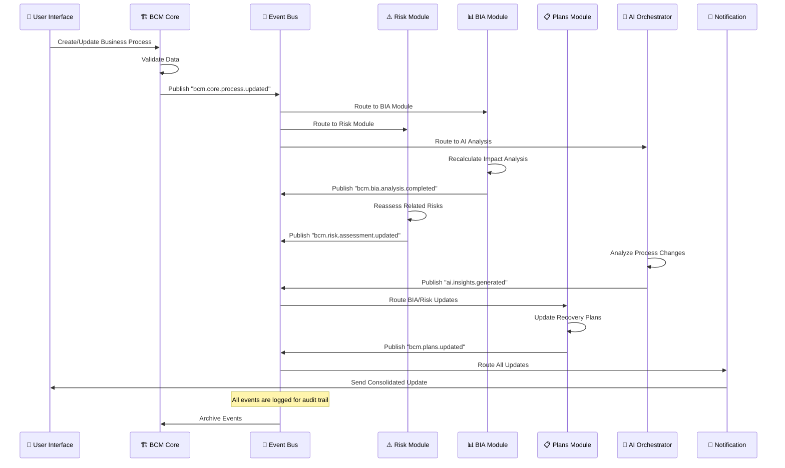
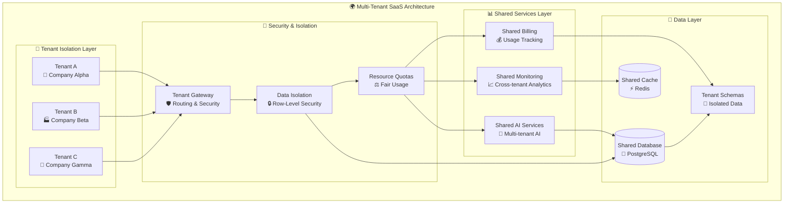
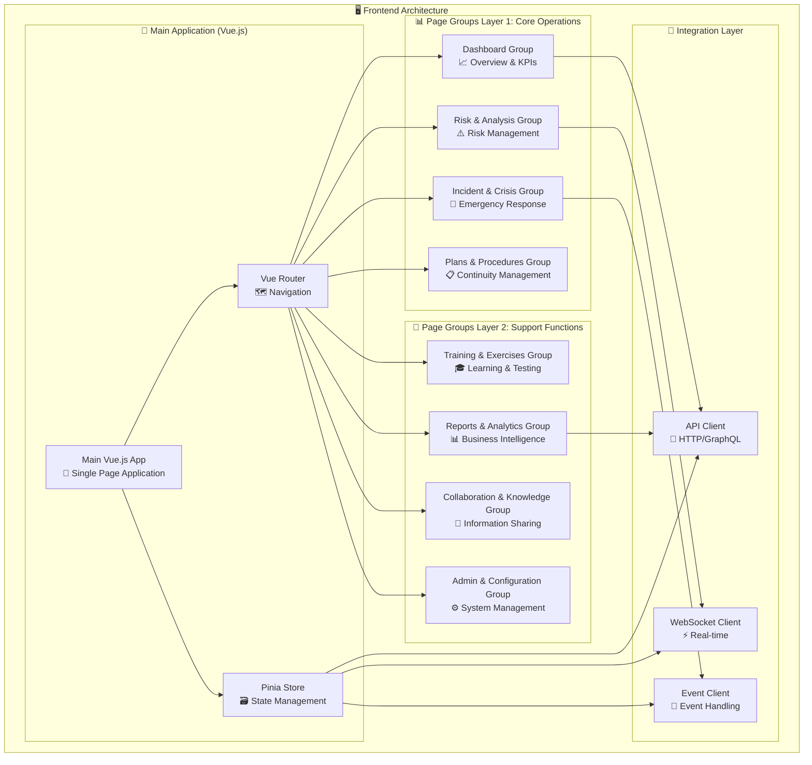
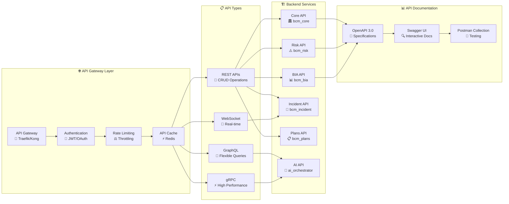
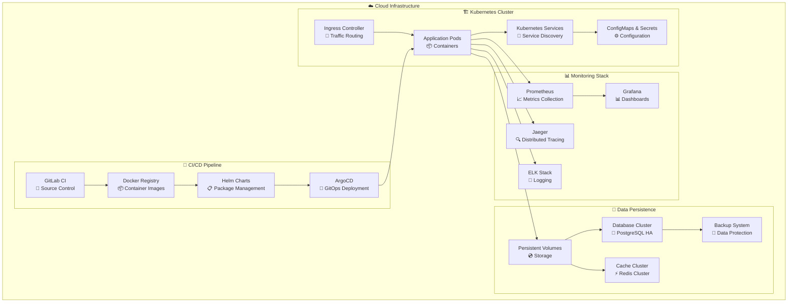
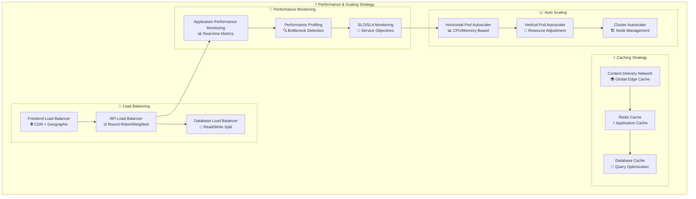

# 🏗️ BCM Platform - Детальные диаграммы и схемы
*Комплексные архитектурные диаграммы для BCM Platform*

---

## 📊 1. Полная архитектурная диаграмма системы

```mermaid
graph TB
    %% Frontend Layer
    subgraph "🖥️ Frontend Layer"
        VUE[Vue.js Portal<br/>:5173]
        REACT[React Admin<br/>:3000]
        MOBILE[Mobile Apps]
    end

    %% API Gateway
    subgraph "🌐 API Gateway Layer"
        GATEWAY[Traefik Gateway<br/>:80/443]
        RATE_LIMIT[Rate Limiting]
        AUTH_GATE[Auth Gateway]
    end

    %% Domain 1: Core Foundation
    subgraph "🏛️ DOMAIN 1: Core Foundation & Governance"
        direction TB

        subgraph "Core Modules"
            BCM_CORE[bcm_core<br/>🏗️ Base Platform]
            BCM_GOV[bcm_governance<br/>📋 Policies]
            BCM_CONFIG[bcm_config<br/>⚙️ Configuration]
            BCM_CONTEXT[bcm_context<br/>🌍 Org Context]
            BCM_AUDIT[bcm_audit<br/>🔍 Audit & Compliance]
        end

        subgraph "Core Services"
            AUTH_SVC[Auth Service<br/>🔐 :8005]
            EVENT_SVC[EventBus<br/>📡 :8001]
            NOTIF_SVC[Notification<br/>📢 :8004]
            AI_CTRL[AI Control Center<br/>🤖 :8200]
        end
    end

    %% Domain 2: Risk & Impact
    subgraph "🔍 DOMAIN 2: Risk & Impact Analysis"
        direction TB

        subgraph "Analysis Modules"
            BCM_RISK[bcm_risk_management<br/>⚠️ AI Risk Advisor]
            BCM_BIA[bcm_bia<br/>📊 BIA Engine v2.0]
            BCM_AI[bcm_intelligent_base<br/>🧠 AI Integration]
        end

        subgraph "AI Services"
            AI_ORCH[AI Orchestrator<br/>🎭 :8000]
            BIA_ENG[BIA Engine<br/>📈 :8082]
            DOC_PROC[Document Processor<br/>📄 :8083]
        end
    end

    %% Domain 3: Operations
    subgraph "🚨 DOMAIN 3: Operations & Response"
        direction TB

        subgraph "Operations Modules"
            BCM_INC_MGT[bcm_incident_management<br/>🚨 Advanced Incidents]
            BCM_INC[bcm_incident<br/>⚡ Basic Incidents]
            BCM_PLANS[bcm_plans<br/>📋 Continuity Plans]
            BCM_EX[bcm_exercise<br/>🎯 Exercises]
            BCM_TRAIN[bcm_training<br/>🎓 AI Learning Coach]
        end

        subgraph "Operations Services"
            SCENARIO_SVC[Scenario Orchestrator<br/>🎭 :8085]
            COMPLIANCE_SVC[Compliance Checker<br/>✅ :8084]
        end
    end

    %% Domain 4: Analytics
    subgraph "📈 DOMAIN 4: Analytics & Collaboration"
        direction TB

        subgraph "Analytics Modules"
            BCM_REP[bcm_reporting<br/>📊 Reports & Analytics]
            BCM_KPI[bcm_kpi<br/>📈 Metrics & KPI]
            BCM_PORTAL[bcm_portal<br/>🌐 Client Portal]
            BCM_COMM[bcm_community<br/>👥 Knowledge Base]
            BCM_TEMP[bcm_templates<br/>📄 Document Templates]
            BCM_CLIENT[bcm_clients<br/>🏢 Multi-tenant Clients]
        end

        subgraph "Integration Services"
            GRAFANA_ADP[Grafana Adapter<br/>📊 :8006]
            HIVE_ADP[TheHive Adapter<br/>🔒 :8007]
            LMS_ADP[LMS Adapter<br/>🎓 :8008]
        end
    end

    %% External Systems
    subgraph "🌍 External Systems"
        GRAFANA[Grafana<br/>📊 :3000]
        THEHIVE[TheHive<br/>🔒 :9000]
        TEAMS[Microsoft Teams<br/>💬]
        SLACK[Slack<br/>💬]
        NICS[NICS Platform<br/>🏛️]
        JAAMSIM[JaamSim<br/>🎮]
    end

    %% Data Layer
    subgraph "💾 Data Layer"
        POSTGRES[(PostgreSQL<br/>🐘 :5432)]
        REDIS[(Redis Cache<br/>⚡ :6379)]
        RABBITMQ[(RabbitMQ<br/>📨 :5672)]
        FILES[(File Storage<br/>📁 S3/MinIO)]
    end

    %% Frontend connections
    VUE --> GATEWAY
    REACT --> GATEWAY
    MOBILE --> GATEWAY

    %% Gateway routing
    GATEWAY --> RATE_LIMIT
    RATE_LIMIT --> AUTH_GATE
    AUTH_GATE --> BCM_CORE

    %% Core Domain connections
    BCM_CORE --> BCM_GOV
    BCM_CORE --> BCM_CONFIG
    BCM_CORE --> BCM_CONTEXT
    BCM_CORE --> BCM_AUDIT

    AUTH_SVC --> BCM_CORE
    EVENT_SVC --> BCM_CORE
    NOTIF_SVC --> BCM_CORE
    AI_CTRL --> BCM_CORE

    %% Cross-domain dependencies
    BCM_CORE --> BCM_RISK
    BCM_CORE --> BCM_BIA
    BCM_CORE --> BCM_INC_MGT
    BCM_CORE --> BCM_REP

    BCM_BIA --> BCM_RISK
    BCM_RISK --> BCM_PLANS
    BCM_INC_MGT --> BCM_PLANS
    BCM_PLANS --> BCM_EX
    BCM_EX --> BCM_TRAIN

    BCM_REP --> BCM_KPI
    BCM_KPI --> BCM_PORTAL
    BCM_COMM --> BCM_TEMP

    %% AI Integration
    AI_CTRL --> AI_ORCH
    AI_ORCH --> BIA_ENG
    AI_ORCH --> DOC_PROC
    AI_ORCH --> SCENARIO_SVC

    %% Service integrations
    BCM_RISK --> AI_ORCH
    BCM_BIA --> BIA_ENG
    BCM_INC_MGT --> SCENARIO_SVC
    BCM_AUDIT --> COMPLIANCE_SVC

    %% External integrations
    GRAFANA_ADP --> GRAFANA
    HIVE_ADP --> THEHIVE
    LMS_ADP --> TEAMS
    LMS_ADP --> SLACK
    BCM_EX --> NICS
    BCM_EX --> JAAMSIM

    %% Data connections
    BCM_CORE --> POSTGRES
    AI_ORCH --> REDIS
    EVENT_SVC --> RABBITMQ
    BCM_TEMP --> FILES

    %% Event flows (dotted lines)
    EVENT_SVC -.-> BCM_RISK
    EVENT_SVC -.-> BCM_BIA
    EVENT_SVC -.-> BCM_INC_MGT
    EVENT_SVC -.-> BCM_REP
    EVENT_SVC -.-> NOTIF_SVC
```

---

## 🤖 2. Digital BCM Organism - AI Архитектура

```mermaid
graph TB
    subgraph "🧠 Digital BCM Organism - AI Control Center"
        direction TB

        AI_COORDINATOR[AI Organ Coordinator<br/>🎭 Central Intelligence]

        subgraph "🔬 AI Organs Layer 1: Core Analysis"
            AI_RISK[AI Risk Advisor<br/>⚠️ FAIR Analysis]
            AI_BIA[AI BIA Brain<br/>📊 RTO/RPO Optimization]
            AI_CRISIS[AI Crisis Coordinator<br/>🚨 Emergency Response]
            AI_LEARN[AI Learning Coach<br/>🎓 Personalized Training]
        end

        subgraph "🎯 AI Organs Layer 2: Specialized Functions"
            AI_COMPLIANCE[AI Compliance Oracle<br/>✅ Regulatory Monitoring]
            AI_SCENARIO[AI Scenario Generator<br/>🎬 Exercise Creation]
            AI_REPORT[AI Report Analyst<br/>📈 Insights Generation]
            AI_INTEGRATION[AI Integration Hub<br/>🔗 External Coordination]
        end
    end

    subgraph "🔗 AI Service Infrastructure"
        AI_ORCHESTRATOR[AI Orchestrator<br/>🎭 :8000]
        BIA_ENGINE[BIA Engine v2.0<br/>📊 :8082]
        DOC_PROCESSOR[Document Processor<br/>📄 :8083]
        SCENARIO_ORCHESTRATOR[Scenario Orchestrator<br/>🎬 :8085]
        COMPLIANCE_CHECKER[Compliance Checker<br/>✅ :8084]
    end

    subgraph "📊 AI Knowledge Base"
        VECTOR_DB[(Vector Database<br/>🧭 Embeddings)]
        MODEL_STORE[(Model Store<br/>🏗️ ML Models)]
        KNOWLEDGE_GRAPH[(Knowledge Graph<br/>🕸️ Relationships)]
        TRAINING_DATA[(Training Data<br/>📚 Datasets)]
    end

    subgraph "🌍 External AI Services"
        ANTHROPIC[Anthropic Claude<br/>🤖 LLM]
        OPENAI[OpenAI GPT<br/>🧠 LLM]
        HUGGINGFACE[HuggingFace<br/>🤗 Models]
        CUSTOM_ML[Custom ML Models<br/>⚙️ Specialized]
    end

    %% AI Coordinator connections
    AI_COORDINATOR --> AI_RISK
    AI_COORDINATOR --> AI_BIA
    AI_COORDINATOR --> AI_CRISIS
    AI_COORDINATOR --> AI_LEARN
    AI_COORDINATOR --> AI_COMPLIANCE
    AI_COORDINATOR --> AI_SCENARIO
    AI_COORDINATOR --> AI_REPORT
    AI_COORDINATOR --> AI_INTEGRATION

    %% AI Organs to Services
    AI_RISK --> AI_ORCHESTRATOR
    AI_BIA --> BIA_ENGINE
    AI_CRISIS --> SCENARIO_ORCHESTRATOR
    AI_COMPLIANCE --> COMPLIANCE_CHECKER
    AI_SCENARIO --> SCENARIO_ORCHESTRATOR
    AI_REPORT --> DOC_PROCESSOR

    %% AI Services to Knowledge Base
    AI_ORCHESTRATOR --> VECTOR_DB
    BIA_ENGINE --> MODEL_STORE
    DOC_PROCESSOR --> KNOWLEDGE_GRAPH
    SCENARIO_ORCHESTRATOR --> TRAINING_DATA

    %% External AI connections
    AI_ORCHESTRATOR --> ANTHROPIC
    AI_ORCHESTRATOR --> OPENAI
    BIA_ENGINE --> HUGGINGFACE
    DOC_PROCESSOR --> CUSTOM_ML
```

---

## 🔄 3. Event-Driven Integration Flow

---

## 🌐 4. Multi-Tenant Architecture

---

## 📱 5. Frontend Architecture & Page Grouping

---

## 🔗 6. API Integration Architecture

---

## 🔐 7. Security Architecture

```mermaid
graph TB
    subgraph "🔐 Security Architecture"

        subgraph "🚪 Authentication Layer"
            KEYCLOAK[Keycloak<br/>🔑 SSO/OIDC]
            JWT[JWT Tokens<br/>🎫 Stateless Auth]
            MFA[Multi-Factor Auth<br/>🛡️ 2FA/TOTP]
        end

        subgraph "🛡️ Authorization Layer"
            RBAC[Role-Based Access<br/>👥 User Roles]
            ABAC[Attribute-Based Access<br/>📋 Dynamic Permissions]
            TENANT_ISOLATION[Tenant Isolation<br/>🏢 Data Separation]
        end

        subgraph "🔒 Data Protection"
            ENCRYPTION[Data Encryption<br/>🔐 AES-256]
            TLS[TLS/SSL<br/>🌐 Transport Security]
            VAULT[Secrets Vault<br/>🗝️ HashiCorp Vault]
        end

        subgraph "📊 Security Monitoring"
            AUDIT_LOG[Audit Logging<br/>📝 Activity Tracking]
            SIEM[SIEM Integration<br/>🔍 Security Analytics]
            THREAT_DETECTION[Threat Detection<br/>⚠️ Anomaly Detection]
        end
    end

    %% Authentication flow
    KEYCLOAK --> JWT
    JWT --> MFA
    MFA --> RBAC

    %% Authorization flow
    RBAC --> ABAC
    ABAC --> TENANT_ISOLATION

    %% Data protection
    TENANT_ISOLATION --> ENCRYPTION
    ENCRYPTION --> TLS
    TLS --> VAULT

    %% Security monitoring
    VAULT --> AUDIT_LOG
    AUDIT_LOG --> SIEM
    SIEM --> THREAT_DETECTION
```

---

## 🚀 8. Deployment Architecture

---

## 📈 9. Scalability & Performance Architecture

---

## 🎯 Ключевые архитектурные принципы

### 1. **Domain-Driven Design (DDD)**
- 4 четких бизнес-домена
- Bounded contexts для каждого домена
- Ubiquitous language в каждом контексте

### 2. **Event-Driven Architecture (EDA)**
- Асинхронная коммуникация через EventBus
- Event sourcing для аудита
- CQRS pattern для чтения/записи

### 3. **Microservices Pattern**
- Независимые деплоймент юниты
- API-first подход
- Fault tolerance и circuit breakers

### 4. **AI-First Design**
- Digital BCM Organism в центре архитектуры
- AI-enhanced workflows
- Machine learning integration

### 5. **Multi-Tenant SaaS**
- Complete data isolation
- Shared infrastructure
- Tenant-specific configurations

---

**Эти диаграммы обеспечивают полное понимание архитектуры BCM платформы и служат основой для разработки и масштабирования системы.**