# 👥 BCM Platform - User Experience Architecture
*Архитектура пользовательского опыта для различных ролей в BCM*

---

## 🎯 Пользователь-центричный подход

В BCM платформе работают **разные типы пользователей** с уникальными потребностями и рабочими процессами. Каждая роль требует своего интерфейса, функций и дашборда.

---

## 👥 Типы пользователей и их интерфейсы

### 🏢 **BCM Manager (Менеджер по непрерывности бизнеса)**
*Главный архитектор BCM программы в организации*

#### 🎯 Основные задачи:
- Стратегическое планирование BCM программы
- Координация всех BCM активностей
- Отчетность руководству
- Управление ресурсами и бюджетом

#### 📊 Пользовательский дашборд:
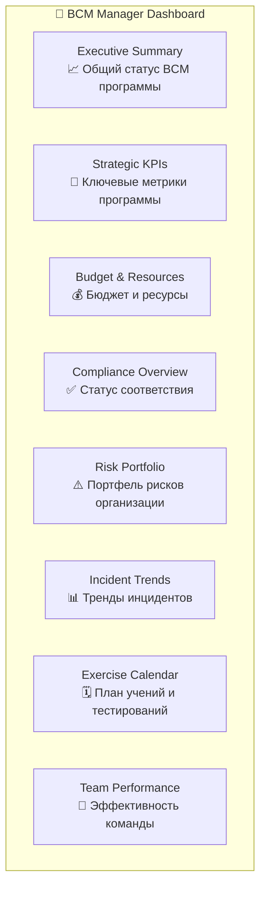

#### 🔧 Основные функции интерфейса:
- **Strategic Planning Workspace** - Планирование BCM стратегии
- **Executive Reporting Suite** - Отчеты для руководства
- **Resource Management Center** - Управление командой и бюджетом
- **Stakeholder Communication Hub** - Коммуникация с заинтересованными сторонами

---

### 🔍 **Risk Analyst (Аналитик рисков)**
*Специалист по выявлению и анализу рисков*

#### 🎯 Основные задачи:
- Идентификация и оценка рисков
- Мониторинг рисковой среды
- Анализ влияния рисков на бизнес
- Подготовка рекомендаций по управлению рисками

#### 📊 Пользовательский дашборд:
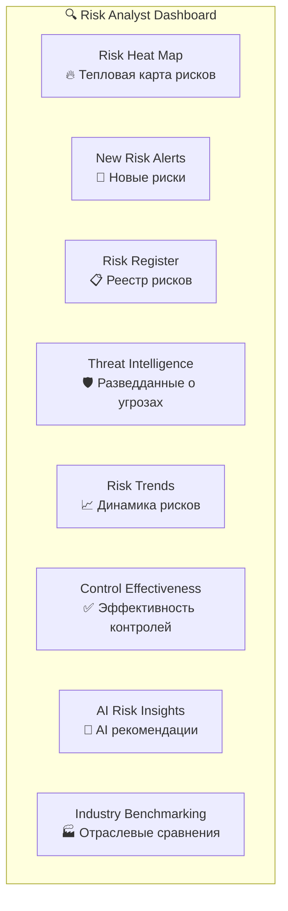

#### 🔧 Основные функции интерфейса:
- **Risk Assessment Workspace** - Рабочая область для оценки рисков
- **AI Risk Advisor Panel** - Панель AI помощника по рискам
- **Threat Intelligence Feed** - Лента разведданных
- **Risk Scenario Modeler** - Моделирование рисковых сценариев

---

### 📊 **BIA Specialist (Специалист по анализу воздействия)**
*Эксперт по оценке влияния нарушений на бизнес*

#### 🎯 Основные задачи:
- Проведение анализа воздействия на бизнес
- Определение критичности процессов
- Расчет RTO/RPO параметров
- Финансовая оценка потерь

#### 📊 Пользовательский дашборд:
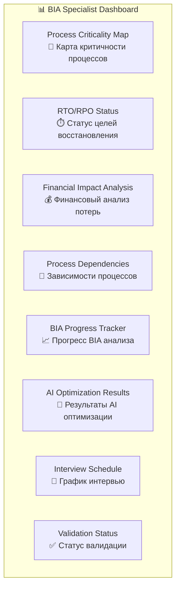

#### 🔧 Основные функции интерфейса:
- **BIA Analysis Workspace** - Рабочая область для BIA
- **Process Interview Manager** - Управление интервью с процесс-владельцами
- **Impact Calculator** - Калькулятор воздействия
- **AI BIA Optimizer** - AI оптимизатор параметров

---

### 🚨 **Crisis Manager (Кризис-менеджер)**
*Руководитель антикризисного реагирования*

#### 🎯 Основные задачи:
- Координация действий во время кризиса
- Управление командами реагирования
- Принятие критических решений
- Коммуникация с заинтересованными сторонами

#### 📊 Пользовательский дашборд:
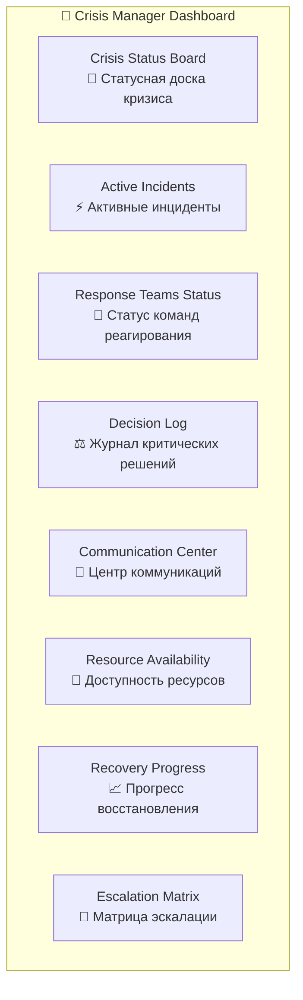

#### 🔧 Основные функции интерфейса:
- **Crisis Command Center** - Командный центр управления кризисом
- **Real-time Communication Hub** - Центр коммуникации в реальном времени
- **Decision Support System** - Система поддержки принятия решений
- **Recovery Coordination Panel** - Панель координации восстановления

---

### 👨‍💼 **Process Owner (Владелец процесса)**
*Ответственный за критически важный бизнес-процесс*

#### 🎯 Основные задачи:
- Управление своими бизнес-процессами
- Поддержание планов восстановления
- Участие в учениях и тестированиях
- Отчетность о статусе процесса

#### 📊 Пользовательский дашборд:
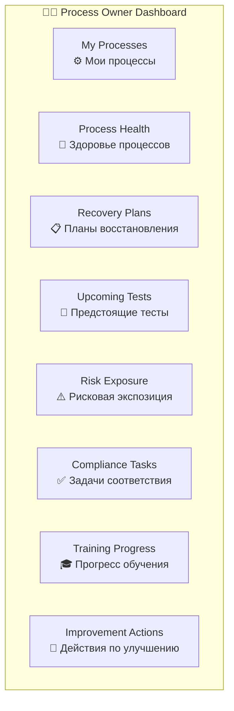

#### 🔧 Основные функции интерфейса:
- **Process Management Console** - Консоль управления процессами
- **Plan Maintenance Workspace** - Рабочая область поддержки планов
- **Testing Coordination Panel** - Панель координации тестирований
- **Compliance Checklist** - Чек-лист соответствия

---

### 🎓 **BCM Coordinator (Координатор BCM)**
*Операционный исполнитель BCM активностей*

#### 🎯 Основные задачи:
- Координация повседневных BCM активностей
- Организация учений и тренировок
- Поддержание документации
- Мониторинг соответствия процедурам

#### 📊 Пользовательский дашборд:
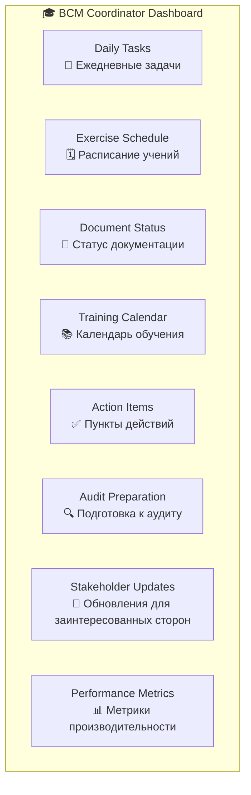

#### 🔧 Основные функции интерфейса:
- **Activity Coordination Center** - Центр координации активностей
- **Exercise Management System** - Система управления учениями
- **Document Control Panel** - Панель контроля документов
- **Stakeholder Communication Tools** - Инструменты коммуникации

---

### 🏭 **Operations Manager (Операционный менеджер)**
*Руководитель операционной деятельности*

#### 🎯 Основные задачи:
- Обеспечение операционной стабильности
- Мониторинг производственных процессов
- Управление операционными рисками
- Координация с BCM командой

#### 📊 Пользовательский дашборд:
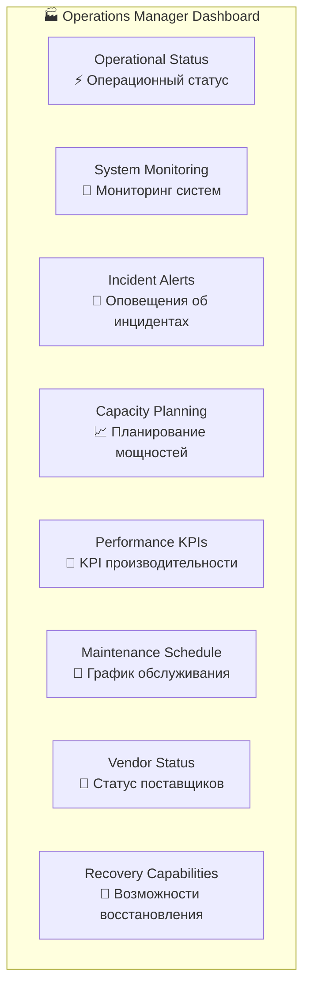

#### 🔧 Основные функции интерфейса:
- **Operations Control Center** - Центр управления операциями
- **Incident Response Console** - Консоль реагирования на инциденты
- **Performance Monitoring Dashboard** - Дашборд мониторинга производительности
- **Recovery Coordination Panel** - Панель координации восстановления

---

### 👨‍💻 **IT Manager (IT-менеджер)**
*Руководитель IT-восстановления и технической поддержки*

#### 🎯 Основные задачи:
- Управление IT-инфраструктурой
- Планирование IT-восстановления
- Обеспечение кибербезопасности
- Техническая поддержка BCM процессов

#### 📊 Пользовательский дашборд:
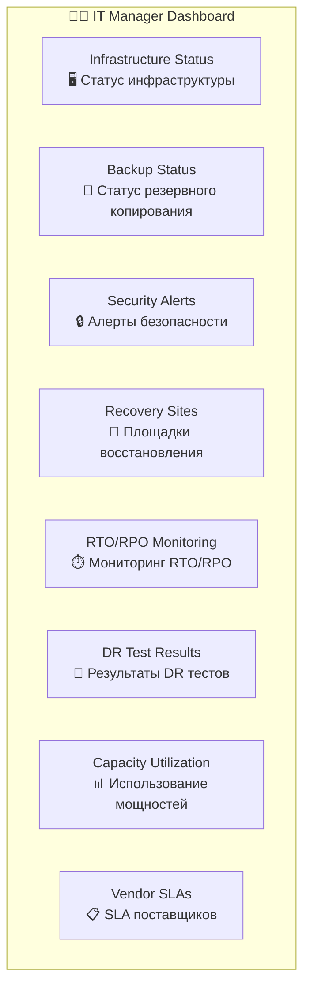

#### 🔧 Основные функции интерфейса:
- **IT Infrastructure Console** - Консоль IT-инфраструктуры
- **DR Management System** - Система управления аварийным восстановлением
- **Security Operations Center** - Центр операций безопасности
- **Technical Recovery Tools** - Инструменты технического восстановления

---

## 🔄 Адаптивный интерфейс по ролям

### 🎨 **Персонализация интерфейса**

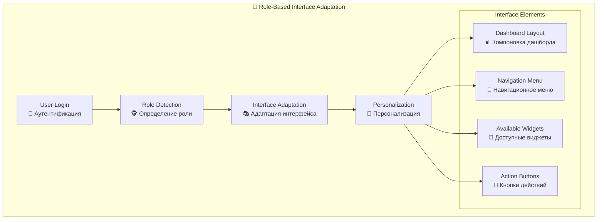

---

## 📱 Мобильные интерфейсы для ролей

### 🚨 **Crisis Response Mobile App**
*Мобильное приложение для кризисного реагирования*

#### Основные экраны:
- **Emergency Dashboard** - Экстренный дашборд
- **Crisis Communication** - Кризисная коммуникация
- **Quick Actions** - Быстрые действия
- **Team Coordination** - Координация команды
- **Status Updates** - Обновления статуса

### 👥 **BCM Mobile Companion**
*Мобильный помощник для всех BCM ролей*

#### Основные функции:
- **Role-specific Notifications** - Уведомления по роли
- **Quick Status Checks** - Быстрая проверка статуса
- **Emergency Contacts** - Экстренные контакты
- **Document Access** - Доступ к документам
- **Offline Capabilities** - Оффлайн возможности

---

## 🔗 Интеграция пользовательского опыта

### 🌊 **Seamless User Journey**

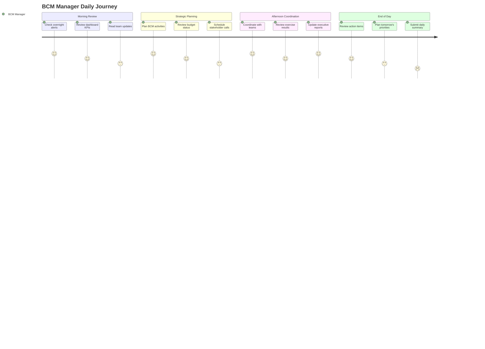

### 🔄 **Cross-Role Collaboration**

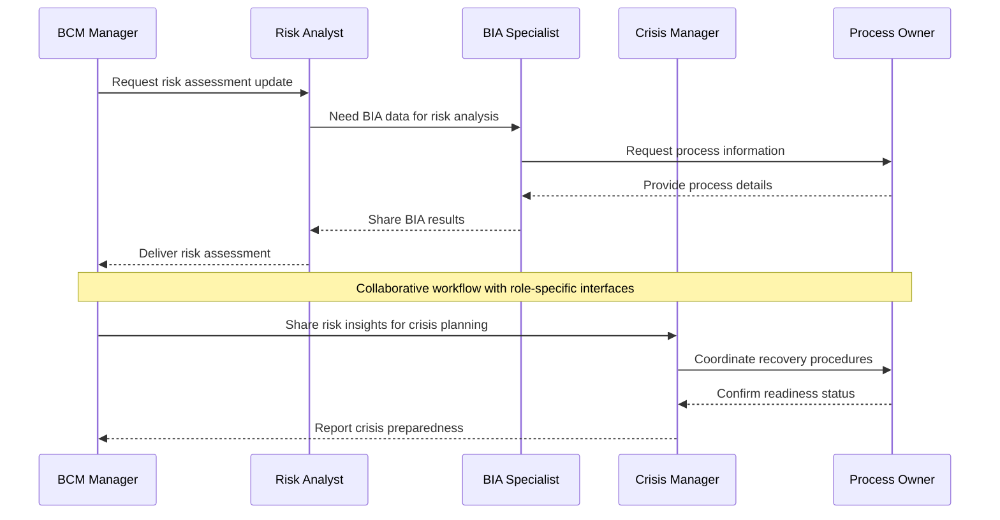

---

## 🎯 Ключевые принципы пользовательского опыта

### 1. **Role-Centric Design**
- Каждая роль получает релевантный интерфейс
- Персонализированные дашборды и функции
- Адаптивная навигация по ролям

### 2. **Context-Aware Interface**
- Интерфейс адаптируется к текущему контексту
- Приоритизация критической информации
- Динамическое отображение релевантных данных

### 3. **Collaborative Workflow**
- Seamless взаимодействие между ролями
- Общие рабочие пространства для проектов
- Интегрированная коммуникация

### 4. **Mobile-First Approach**
- Критические функции доступны на мобильных
- Оффлайн capabilities для экстренных ситуаций
- Push-уведомления по ролям

### 5. **AI-Enhanced Experience**
- Персонализированные AI рекомендации
- Предиктивные интерфейсы
- Автоматизация рутинных задач

---

**Эта пользователь-центричная архитектура обеспечивает каждой роли в BCM оптимальный опыт работы с системой, повышая эффективность и удовлетворенность пользователей.**