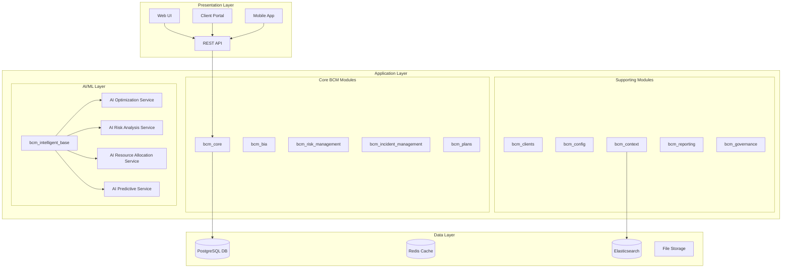
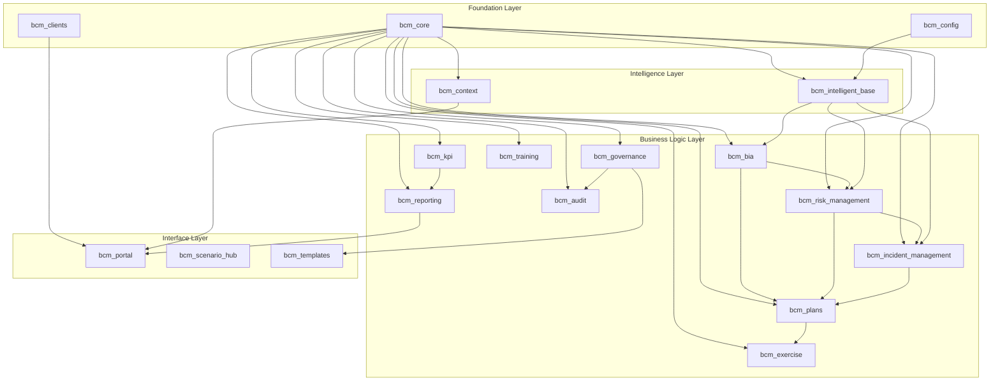
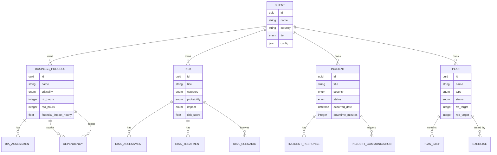

# ISO 22301 BCM Platform - Техническая архитектура

## Обзор системы

**ISO 22301 Business Continuity Management Platform** - это enterprise-grade система управления непрерывностью бизнеса, построенная на платформе Odoo 18.0 с интеграцией искусственного интеллекта и машинного обучения.

### Архитектурные принципы

1. **Модульность** - 19 специализированных модулей с четким разделением ответственности
2. **Масштабируемость** - Горизонтальное и вертикальное масштабирование
3. **Мульти-тенантность** - Полная изоляция данных клиентов
4. **API-First** - REST API для всех операций
5. **AI-Driven** - Интеллектуальная оптимизация и аналитика
6. **Compliance** - Соответствие ISO 22301, 27001, NIST

## Архитектура высокого уровня



## Модульная архитектура

### Уровень 1: Фундаментальные модули
- **bcm_core** - Базовые модели и утилиты
- **bcm_config** - Конфигурация системы
- **bcm_clients** - Мульти-тенантность

### Уровень 2: Интеллектуальный слой
- **bcm_intelligent_base** - AI/ML интеграция
- **bcm_context** - Контекстный поиск и индексация

### Уровень 3: Функциональные модули
- **bcm_bia** - Business Impact Analysis
- **bcm_risk_management** - Управление рисками
- **bcm_incident_management** - Управление инцидентами
- **bcm_plans** - Планы непрерывности

### Уровень 4: Специализированные модули
- **bcm_audit** - Аудит и compliance
- **bcm_exercise** - Тестирование и учения
- **bcm_governance** - Корпоративное управление
- **bcm_training** - Обучение персонала
- **bcm_reporting** - Отчетность и аналитика

### Уровень 5: Интерфейсные модули
- **bcm_portal** - Клиентский портал
- **bcm_scenario_hub** - Центр сценариев
- **bcm_templates** - Шаблоны документов
- **bcm_kpi** - Метрики и KPI

## Диаграмма зависимостей модулей



## Технологический стек

### Backend
- **Framework**: Odoo 18.0 (Python)
- **Database**: PostgreSQL 15
- **Cache**: Redis 7
- **Search**: Elasticsearch 8.x
- **AI/ML**: TensorFlow 2.x, scikit-learn
- **Message Queue**: Apache Kafka
- **API**: REST (JSON), GraphQL

### Frontend
- **Web UI**: Odoo Web Client (JavaScript, XML)
- **Portal**: Vue.js 3 / React 18
- **Mobile**: React Native / Flutter
- **Charts**: Chart.js, D3.js
- **Maps**: OpenLayers, Mapbox

### Infrastructure
- **Container**: Docker, Kubernetes
- **Load Balancer**: Nginx, HAProxy
- **Monitoring**: Prometheus, Grafana
- **Logging**: ELK Stack (Elasticsearch, Logstash, Kibana)
- **Storage**: MinIO (S3-compatible)

## Модель данных высокого уровня

### Основные сущности



## API Architecture

### REST API Structure
```
/api/v1/
├── bcm/
│   ├── core/
│   │   ├── clients/
│   │   ├── config/
│   │   └── context/
│   ├── bia/
│   │   ├── processes/
│   │   ├── assessments/
│   │   └── dependencies/
│   ├── risk/
│   │   ├── risks/
│   │   ├── assessments/
│   │   └── treatments/
│   ├── incident/
│   │   ├── incidents/
│   │   ├── responses/
│   │   └── communications/
│   ├── plans/
│   │   ├── plans/
│   │   ├── steps/
│   │   └── activations/
│   └── ai/
│       ├── analysis/
│       ├── optimization/
│       └── predictions/
```

### Authentication & Authorization
- **Authentication**: JWT tokens, OAuth 2.0
- **Authorization**: Role-based access control (RBAC)
- **Multi-tenancy**: Client-based data isolation
- **API Keys**: For system integrations

## Производительность и масштабирование

### Горизонтальное масштабирование
- **Application Servers**: Multiple Odoo instances behind load balancer
- **Database**: PostgreSQL read replicas
- **Cache**: Redis Cluster
- **AI Services**: Kubernetes auto-scaling

### Вертикальное масштабирование
- **CPU**: Multi-core processing for AI/ML workloads
- **Memory**: Large datasets caching
- **Storage**: SSD for database, object storage for files

### Оптимизация производительности
- **Database Indexing**: Optimized for common queries
- **Caching Strategy**: Multi-level caching (Redis, Application, Browser)
- **Lazy Loading**: On-demand data loading
- **Background Jobs**: Asynchronous processing for heavy operations

## Безопасность

### Data Security
- **Encryption at Rest**: Database and file encryption
- **Encryption in Transit**: TLS 1.3 for all communications
- **Key Management**: HashiCorp Vault
- **Backup Encryption**: Encrypted backups with rotation

### Access Control
- **Multi-Factor Authentication**: TOTP, SMS, Hardware keys
- **Single Sign-On**: SAML 2.0, OpenID Connect
- **Session Management**: Secure session handling
- **Audit Logging**: Comprehensive audit trails

### Compliance
- **GDPR**: Data protection and privacy
- **ISO 27001**: Information security management
- **SOX**: Financial controls
- **Industry Standards**: Sector-specific compliance

## Мониторинг и наблюдаемость

### Application Monitoring
- **Health Checks**: Service health endpoints
- **Performance Metrics**: Response times, throughput
- **Error Tracking**: Exception monitoring and alerting
- **Business Metrics**: BCM-specific KPIs

### Infrastructure Monitoring
- **System Resources**: CPU, Memory, Disk, Network
- **Container Metrics**: Docker/Kubernetes metrics
- **Database Performance**: Query performance, connections
- **AI/ML Metrics**: Model performance, prediction accuracy

### Logging and Alerting
- **Centralized Logging**: ELK Stack
- **Log Correlation**: Distributed tracing
- **Alerting Rules**: Proactive issue detection
- **Dashboard**: Real-time operational views

## Интеграции

### External Systems
- **ERP Systems**: SAP, Oracle, Microsoft Dynamics
- **ITSM Tools**: ServiceNow, Jira Service Management
- **Security Tools**: SIEM, Threat Intelligence
- **Communication**: Slack, Microsoft Teams, Email

### API Integrations
- **Webhooks**: Real-time event notifications
- **Batch APIs**: Bulk data operations
- **GraphQL**: Flexible data queries
- **Message Queues**: Asynchronous integrations

## Планы развития архитектуры

### Краткосрочные (6 месяцев)
- Микросервисная декомпозиция критических модулей
- Улучшение AI/ML pipeline
- Mobile-first подход для портала

### Среднесрочные (12 месяцев)
- Serverless функции для AI обработки
- Real-time analytics и streaming
- Advanced security features

### Долгосрочные (24+ месяцев)
- Edge computing для IoT интеграций
- Blockchain для immutable records
- Quantum-resistant cryptography

## Метрики производительности

### Целевые показатели
- **API Response Time**: < 200ms (95th percentile)
- **Database Query Time**: < 50ms (average)
- **AI Analysis Time**: < 60 seconds (BIA optimization)
- **System Availability**: 99.9% uptime
- **Data Consistency**: 100% ACID compliance
- **Security Incidents**: Zero tolerance for data breaches