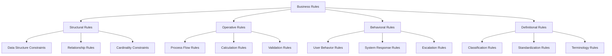

# BCM Platform Business Rules and Constraints

## Overview

This document defines the comprehensive set of business rules, constraints, and validation logic that govern the BCM Platform's operations. These rules ensure compliance with ISO 22301 standards, maintain data integrity, and enforce proper business continuity management practices.

## Table of Contents

1. [Business Rule Categories](#business-rule-categories)
2. [ISO 22301 Compliance Rules](#iso-22301-compliance-rules)
3. [Data Integrity and Validation Rules](#data-integrity-and-validation-rules)
4. [Workflow and Process Rules](#workflow-and-process-rules)
5. [Security and Access Control Rules](#security-and-access-control-rules)
6. [Performance and Quality Rules](#performance-and-quality-rules)
7. [Integration and System Rules](#integration-and-system-rules)
8. [Audit and Compliance Rules](#audit-and-compliance-rules)
9. [AI and Automation Rules](#ai-and-automation-rules)

---

## Business Rule Categories

### Rule Classification System

Business rules are classified into the following categories for systematic management and implementation:



### Rule Priority Levels

**Priority 1 (Critical):** Rules that ensure system integrity, security, and legal compliance
**Priority 2 (High):** Rules that ensure business process effectiveness and ISO compliance
**Priority 3 (Medium):** Rules that improve system usability and data quality
**Priority 4 (Low):** Rules that provide guidance and best practices

### Rule Enforcement Mechanisms

- **Hard Rules:** System-enforced constraints that cannot be violated
- **Soft Rules:** Warnings and notifications that can be overridden with justification
- **Advisory Rules:** Guidance and recommendations without enforcement
- **Configurable Rules:** Organization-specific rules that can be customized

---

## ISO 22301 Compliance Rules

### Policy and Governance Rules

#### Rule BCM-POL-001: Policy Framework Requirements
**Priority:** 1 (Critical)
**Category:** Structural
**Description:** All BCM policies must follow the mandatory ISO 22301 policy framework

**Constraints:**
- Every organization must have a documented BCM policy
- Policy must be approved by top management
- Policy must be communicated to all relevant stakeholders
- Policy must be reviewed annually at minimum
- Policy changes require formal approval workflow

**Implementation:**
```javascript
validatePolicyFramework(policy) {
  return {
    hasTopManagementApproval: policy.approver_role === 'CEO' || policy.approver_role === 'Board',
    hasAnnualReview: policy.last_review_date > (Date.now() - 365*24*60*60*1000),
    hasCommunicationPlan: policy.communication_status === 'published',
    hasDocumentedScope: policy.scope && policy.scope.length > 0
  }
}
```

#### Rule BCM-POL-002: Management Commitment
**Priority:** 1 (Critical)
**Category:** Behavioral
**Description:** Top management commitment must be demonstrated through measurable actions

**Constraints:**
- BCM policy must be signed by CEO or equivalent
- Adequate resources must be allocated to BCM program
- Management review meetings must occur at defined intervals
- Management must demonstrate leadership in BCM activities

### Context of Organization Rules

#### Rule BCM-CTX-001: Organizational Context Assessment
**Priority:** 2 (High)
**Category:** Operative
**Description:** Organization context must be comprehensively analyzed and documented

**Constraints:**
- Internal and external issues must be identified and maintained
- Interested parties and their requirements must be documented
- Scope of BCMS must be clearly defined
- Context review must occur at least annually

**Validation Rules:**
```python
def validate_organizational_context(context):
    required_elements = [
        'internal_issues',
        'external_issues',
        'interested_parties',
        'legal_requirements',
        'contractual_obligations'
    ]

    for element in required_elements:
        if not context.get(element) or len(context[element]) == 0:
            return ValidationError(f"Missing required context element: {element}")

    if not context.get('last_review') or days_since(context['last_review']) > 365:
        return ValidationError("Context review is overdue")

    return ValidationSuccess()
```

### Leadership and Commitment Rules

#### Rule BCM-LEAD-001: BCM Manager Assignment
**Priority:** 1 (Critical)
**Category:** Structural
**Description:** A qualified BCM Manager must be assigned with defined responsibilities

**Constraints:**
- BCM Manager must have appropriate competencies
- Role and responsibilities must be formally documented
- BCM Manager must have authority to manage the BCMS
- BCM Manager must report to top management

#### Rule BCM-LEAD-002: Committee Structure
**Priority:** 2 (High)
**Category:** Structural
**Description:** BCM committee structure must support effective governance

**Constraints:**
- BCM committee must include senior management representation
- Committee meetings must be held at defined intervals
- Meeting minutes must be recorded and distributed
- Action items must be tracked to completion

---

## Data Integrity and Validation Rules

### Business Impact Analysis Rules

#### Rule BIA-001: Process Criticality Classification
**Priority:** 2 (High)
**Category:** Definitional
**Description:** Business processes must be classified according to criticality levels

**Constraints:**
- Criticality must be one of: Critical, Important, Normal, Low
- Critical processes must have RTO ≤ 4 hours
- Important processes must have RTO ≤ 24 hours
- All processes must have defined RTO and RPO values

**Validation Logic:**
```python
def validate_process_criticality(process):
    criticality_rto_mapping = {
        'Critical': 4,    # hours
        'Important': 24,  # hours
        'Normal': 72,     # hours
        'Low': 168        # hours (1 week)
    }

    max_rto = criticality_rto_mapping.get(process.criticality)
    if not max_rto:
        return ValidationError("Invalid criticality level")

    if process.rto_hours > max_rto:
        return ValidationError(f"RTO exceeds maximum for {process.criticality} processes")

    if process.rpo_hours > process.rto_hours:
        return ValidationError("RPO cannot exceed RTO")

    return ValidationSuccess()
```

#### Rule BIA-002: Impact Assessment Completeness
**Priority:** 2 (High)
**Category:** Operative
**Description:** Impact assessments must cover all required impact categories

**Required Impact Categories:**
- Financial impact (direct and indirect costs)
- Operational impact (capacity reduction, service disruption)
- Customer impact (satisfaction, retention, reputation)
- Regulatory impact (compliance violations, penalties)
- Health and safety impact
- Environmental impact

**Validation Requirements:**
```python
def validate_impact_assessment(assessment):
    required_categories = [
        'financial_direct',
        'financial_indirect',
        'operational_capacity',
        'customer_impact',
        'regulatory_impact',
        'health_safety',
        'environmental'
    ]

    missing_categories = []
    for category in required_categories:
        if not hasattr(assessment, category) or assessment[category] is None:
            missing_categories.append(category)

    if missing_categories:
        return ValidationError(f"Missing impact assessments: {missing_categories}")

    return ValidationSuccess()
```

#### Rule BIA-003: Dependency Mapping
**Priority:** 2 (High)
**Category:** Structural
**Description:** Critical dependencies must be identified and mapped

**Constraints:**
- Internal dependencies (people, facilities, technology, suppliers)
- External dependencies (utilities, suppliers, partners)
- Dependency criticality must be assessed
- Single points of failure must be identified

### Risk Management Rules

#### Rule RISK-001: Risk Assessment Methodology
**Priority:** 2 (High)
**Category:** Operative
**Description:** Risk assessments must follow consistent methodology

**Constraints:**
- Risk probability must use 5-point scale (Very Low, Low, Medium, High, Very High)
- Risk impact must use 5-point scale (Insignificant, Minor, Moderate, Major, Catastrophic)
- Risk matrix must be consistently applied
- Risk appetite thresholds must be defined

**Risk Calculation Rules:**
```python
def calculate_risk_score(probability, impact):
    probability_values = {
        'Very Low': 1,
        'Low': 2,
        'Medium': 3,
        'High': 4,
        'Very High': 5
    }

    impact_values = {
        'Insignificant': 1,
        'Minor': 2,
        'Moderate': 3,
        'Major': 4,
        'Catastrophic': 5
    }

    prob_score = probability_values.get(probability)
    impact_score = impact_values.get(impact)

    if not prob_score or not impact_score:
        raise ValidationError("Invalid probability or impact value")

    risk_score = prob_score * impact_score

    if risk_score >= 15:
        return {'score': risk_score, 'level': 'Very High', 'color': 'red'}
    elif risk_score >= 12:
        return {'score': risk_score, 'level': 'High', 'color': 'orange'}
    elif risk_score >= 6:
        return {'score': risk_score, 'level': 'Medium', 'color': 'yellow'}
    elif risk_score >= 3:
        return {'score': risk_score, 'level': 'Low', 'color': 'green'}
    else:
        return {'score': risk_score, 'level': 'Very Low', 'color': 'blue'}
```

#### Rule RISK-002: Risk Treatment Requirements
**Priority:** 2 (High)
**Category:** Operative
**Description:** Risk treatment must be applied based on risk level and appetite

**Treatment Decision Matrix:**
- Very High Risk (15-25): Mandatory treatment required
- High Risk (12-14): Treatment required unless justified exception
- Medium Risk (6-11): Treatment recommended
- Low Risk (3-5): Treatment optional
- Very Low Risk (1-2): Accept risk

**Validation Logic:**
```python
def validate_risk_treatment(risk):
    if risk.level == 'Very High' and risk.treatment_status != 'in_progress':
        if not risk.treatment_plan:
            return ValidationError("Very High risks must have treatment plan")

    if risk.level == 'High' and risk.treatment_status == 'accepted':
        if not risk.acceptance_justification:
            return ValidationError("High risk acceptance requires justification")

    if risk.treatment_plan:
        if not risk.treatment_owner:
            return ValidationError("Treatment plan must have assigned owner")
        if not risk.target_completion_date:
            return ValidationError("Treatment plan must have target completion date")

    return ValidationSuccess()
```

---

## Workflow and Process Rules

### Plan Development Rules

#### Rule PLAN-001: Plan Structure Requirements
**Priority:** 2 (High)
**Category:** Structural
**Description:** All BCM plans must follow standardized structure

**Required Plan Elements:**
- Executive summary
- Scope and objectives
- Roles and responsibilities
- Activation procedures
- Response procedures
- Recovery procedures
- Communication procedures
- Resource requirements
- Testing procedures

**Validation Framework:**
```python
def validate_plan_structure(plan):
    required_sections = [
        'executive_summary',
        'scope_and_objectives',
        'roles_responsibilities',
        'activation_procedures',
        'response_procedures',
        'recovery_procedures',
        'communication_procedures',
        'resource_requirements',
        'testing_procedures'
    ]

    missing_sections = []
    for section in required_sections:
        if not getattr(plan, section, None) or len(getattr(plan, section)) < 100:
            missing_sections.append(section)

    if missing_sections:
        return ValidationError(f"Plan missing required sections: {missing_sections}")

    return ValidationSuccess()
```

#### Rule PLAN-002: Plan Testing Requirements
**Priority:** 2 (High)
**Category:** Operative
**Description:** Plans must be tested according to defined schedule

**Testing Requirements:**
- All plans must be tested at least annually
- Critical process plans must be tested every 6 months
- Test results must be documented
- Improvements must be implemented based on test results

### Exercise and Training Rules

#### Rule EX-001: Exercise Program Requirements
**Priority:** 2 (High)
**Category:** Operative
**Description:** Exercise program must provide comprehensive testing coverage

**Exercise Requirements:**
- Tabletop exercises: Annual minimum for all plans
- Functional exercises: Annual for critical processes
- Full-scale exercises: Every 2 years for organization
- Communication tests: Quarterly minimum

**Participation Rules:**
```python
def validate_exercise_participation(exercise):
    required_roles = exercise.plan.get_required_roles()
    participating_roles = [p.role for p in exercise.participants]

    missing_roles = set(required_roles) - set(participating_roles)
    if missing_roles:
        return ValidationError(f"Missing required participant roles: {missing_roles}")

    if exercise.type == 'full_scale' and len(exercise.participants) < 5:
        return ValidationError("Full-scale exercises require minimum 5 participants")

    return ValidationSuccess()
```

#### Rule TRAIN-001: Competency Requirements
**Priority:** 2 (High)
**Category:** Behavioral
**Description:** BCM roles must maintain required competency levels

**Competency Standards:**
- BCM Manager: Advanced certification required
- BCM Team Members: Intermediate certification required
- General Staff: Basic awareness training required
- Plan Owners: Role-specific training required

---

## Security and Access Control Rules

### Authentication and Authorization Rules

#### Rule SEC-001: Multi-Factor Authentication
**Priority:** 1 (Critical)
**Category:** Behavioral
**Description:** MFA required for privileged access

**MFA Requirements:**
- BCM Managers: MFA mandatory
- Plan Owners: MFA mandatory
- System Administrators: MFA mandatory
- External Consultants: MFA mandatory

#### Rule SEC-002: Role-Based Access Control
**Priority:** 1 (Critical)
**Category:** Structural
**Description:** Access must be granted based on role and need-to-know

**Access Control Matrix:**
```python
ROLE_PERMISSIONS = {
    'bcm_manager': {
        'bia': ['read', 'write', 'approve'],
        'risk': ['read', 'write', 'approve'],
        'plans': ['read', 'write', 'approve'],
        'exercises': ['read', 'write', 'execute'],
        'reports': ['read', 'write', 'publish']
    },
    'plan_owner': {
        'bia': ['read'],
        'risk': ['read'],
        'plans': ['read', 'write'],
        'exercises': ['read', 'participate'],
        'reports': ['read']
    },
    'general_user': {
        'bia': ['read'],
        'risk': ['read'],
        'plans': ['read'],
        'exercises': ['participate'],
        'reports': ['read']
    }
}

def validate_access(user_role, resource, action):
    permissions = ROLE_PERMISSIONS.get(user_role, {})
    resource_permissions = permissions.get(resource, [])

    if action not in resource_permissions:
        return AccessDenied(f"User role {user_role} cannot {action} {resource}")

    return AccessGranted()
```

### Data Protection Rules

#### Rule DP-001: Data Classification
**Priority:** 1 (Critical)
**Category:** Definitional
**Description:** All data must be classified according to sensitivity

**Classification Levels:**
- **Public:** Non-sensitive information
- **Internal:** Internal use only
- **Confidential:** Sensitive business information
- **Restricted:** Highly sensitive or regulated data

#### Rule DP-002: Data Retention
**Priority:** 1 (Critical)
**Category:** Operative
**Description:** Data retention must comply with legal and business requirements

**Retention Periods:**
- BIA records: 7 years minimum
- Risk assessments: 7 years minimum
- Incident records: 10 years minimum
- Exercise records: 5 years minimum
- Audit records: 10 years minimum

---

## Performance and Quality Rules

### System Performance Rules

#### Rule PERF-001: Response Time Standards
**Priority:** 2 (High)
**Category:** Operative
**Description:** System must meet defined performance standards

**Performance Targets:**
- Dashboard loading: < 3 seconds
- Search queries: < 1 second
- Report generation: < 30 seconds
- Incident alerts: < 30 seconds

#### Rule PERF-002: Availability Requirements
**Priority:** 1 (Critical)
**Category:** Operative
**Description:** System availability must meet business requirements

**Availability Targets:**
- Production system: 99.5% uptime
- Planned maintenance: Maximum 4 hours monthly
- Incident response system: 99.9% uptime
- Critical alerts: 99.99% delivery rate

### Data Quality Rules

#### Rule DQ-001: Data Completeness
**Priority:** 2 (High)
**Category:** Operative
**Description:** Critical data fields must be complete

**Completeness Requirements:**
```python
MANDATORY_FIELDS = {
    'bia_process': [
        'name', 'description', 'process_owner', 'criticality',
        'rto_hours', 'rpo_hours', 'impact_assessment'
    ],
    'risk_assessment': [
        'risk_title', 'description', 'probability', 'impact',
        'risk_owner', 'assessment_date'
    ],
    'continuity_plan': [
        'plan_name', 'scope', 'plan_owner', 'activation_criteria',
        'response_procedures', 'recovery_procedures'
    ]
}

def validate_data_completeness(record_type, record):
    required_fields = MANDATORY_FIELDS.get(record_type, [])
    missing_fields = []

    for field in required_fields:
        if not getattr(record, field, None):
            missing_fields.append(field)

    if missing_fields:
        return ValidationError(f"Missing mandatory fields: {missing_fields}")

    return ValidationSuccess()
```

---

## Integration and System Rules

### API Integration Rules

#### Rule API-001: Rate Limiting
**Priority:** 2 (High)
**Category:** Operative
**Description:** API calls must respect rate limiting constraints

**Rate Limits:**
- Authenticated users: 1000 requests/hour
- Anonymous users: 100 requests/hour
- System integrations: 10000 requests/hour
- Emergency services: No limit

#### Rule API-002: Data Validation
**Priority:** 1 (Critical)
**Category:** Operative
**Description:** All API inputs must be validated

**Validation Requirements:**
- Input sanitization for XSS prevention
- SQL injection prevention
- Data type validation
- Business rule validation
- Authorization checking

### Event Processing Rules

#### Rule EVENT-001: Event Ordering
**Priority:** 2 (High)
**Category:** Operative
**Description:** Events must be processed in correct order

**Ordering Requirements:**
- Events within same aggregate must be processed sequentially
- Cross-aggregate events can be processed in parallel
- Failed events must be retried with exponential backoff
- Event processing must be idempotent

---

## Audit and Compliance Rules

### Audit Trail Rules

#### Rule AUDIT-001: Comprehensive Logging
**Priority:** 1 (Critical)
**Category:** Operative
**Description:** All significant actions must be logged

**Logging Requirements:**
- User authentication events
- Data modification events
- System configuration changes
- Access control changes
- Plan activations
- Exercise executions

**Log Format:**
```json
{
  "timestamp": "2024-01-01T12:00:00Z",
  "user_id": "user123",
  "action": "modify_bia_process",
  "resource_type": "bia_process",
  "resource_id": "proc456",
  "changes": {
    "field": "criticality",
    "old_value": "Important",
    "new_value": "Critical"
  },
  "ip_address": "192.168.1.100",
  "user_agent": "Mozilla/5.0...",
  "session_id": "sess789"
}
```

#### Rule AUDIT-002: Log Integrity
**Priority:** 1 (Critical)
**Category:** Structural
**Description:** Audit logs must maintain integrity

**Integrity Requirements:**
- Logs must be digitally signed
- Log tampering must be detectable
- Logs must be stored in immutable storage
- Log access must be restricted and audited

---

## AI and Automation Rules

### AI Decision Rules

#### Rule AI-001: Human Oversight
**Priority:** 1 (Critical)
**Category:** Behavioral
**Description:** AI decisions must have appropriate human oversight

**Oversight Requirements:**
- High-impact decisions require human approval
- AI recommendations must show confidence levels
- Decision rationale must be explainable
- Humans must be able to override AI decisions

#### Rule AI-002: Bias Prevention
**Priority:** 2 (High)
**Category:** Operative
**Description:** AI systems must be monitored for bias

**Bias Monitoring:**
- Regular model performance audits
- Fairness metrics tracking
- Training data diversity validation
- Outcome disparity analysis

### Automation Rules

#### Rule AUTO-001: Automated Decision Boundaries
**Priority:** 1 (Critical)
**Category:** Operative
**Description:** Automated decisions must operate within defined boundaries

**Decision Boundaries:**
- Financial impact > $10,000: Human approval required
- Critical process changes: Human approval required
- Plan activation: Human approval required
- Risk level changes: Human review required

**Implementation Framework:**
```python
def validate_automated_decision(decision):
    if decision.financial_impact > 10000:
        if not decision.human_approval:
            return ValidationError("High financial impact requires human approval")

    if decision.affects_critical_process:
        if not decision.human_review:
            return ValidationError("Critical process changes require human review")

    if decision.confidence_level < 0.8:
        if not decision.human_oversight:
            return ValidationError("Low confidence decisions require human oversight")

    return ValidationSuccess()
```

---

## Rule Implementation Guidelines

### Frontend Implementation

**Form Validation:**
- Client-side validation for immediate feedback
- Server-side validation for security and integrity
- Progressive validation during form completion
- Clear error messages with correction guidance

**UI/UX Considerations:**
- Visual indicators for mandatory fields
- Real-time validation feedback
- Contextual help for complex rules
- Graceful error handling and recovery

### Backend Implementation

**Database Constraints:**
- Foreign key constraints for referential integrity
- Check constraints for business rules
- Triggers for complex validation logic
- Audit triggers for change tracking

**API Validation:**
- Input validation middleware
- Business rule validation services
- Error response standardization
- Validation result caching

### Monitoring and Compliance

**Rule Violation Monitoring:**
- Real-time rule violation detection
- Automated compliance reporting
- Exception handling and escalation
- Regular rule effectiveness review

**Continuous Improvement:**
- Rule performance metrics
- Business rule optimization
- Stakeholder feedback integration
- Regular rule review and updates

---

**This document provides the comprehensive foundation for implementing and maintaining business rules across the BCM platform, ensuring consistent behavior, data integrity, and regulatory compliance.**