# BCM Platform Integration Flows and Module Interactions

## Overview

This document defines how modules interact and integrate within the BCM Platform ecosystem. It provides comprehensive mapping of data flows, event streams, API interactions, and cross-module dependencies that enable seamless business continuity management operations.

## Table of Contents

1. [Integration Architecture Overview](#integration-architecture-overview)
2. [Core Integration Patterns](#core-integration-patterns)
3. [Module Interaction Matrix](#module-interaction-matrix)
4. [Event-Driven Integration Flows](#event-driven-integration-flows)
5. [API Integration Patterns](#api-integration-patterns)
6. [Data Flow Diagrams](#data-flow-diagrams)
7. [Real-Time Integration Flows](#real-time-integration-flows)
8. [External System Integrations](#external-system-integrations)
9. [Error Handling and Resilience](#error-handling-and-resilience)

---

## Integration Architecture Overview

### Microservices Integration Model

The BCM Platform implements a sophisticated microservices architecture with multiple integration layers ensuring seamless communication between components.


```mermaid
graph TB
    subgraph "Frontend Layer"
        VUE[Vue.js Portal]
        REACT[React Admin]
        MOBILE[Mobile Apps]
    end

    subgraph "API Gateway Layer"
        GATEWAY[API Gateway/Traefik]
        AUTH[Authentication Service]
        RATE[Rate Limiting]
    end

    subgraph "Business Logic Layer"
        subgraph "Odoo Core Modules"
            CORE[bcm_core]
            BIA[bcm_bia]
            RISK[bcm_risk_management]
            INCIDENT[bcm_incident]
            PLANS[bcm_plans]
            GOVERNANCE[bcm_governance]
            AUDIT[bcm_audit]
            EXERCISE[bcm_exercise]
            TRAINING[bcm_training]
            KPI[bcm_kpi]
            REPORTING[bcm_reporting]
            TEMPLATES[bcm_templates]
            CLIENTS[bcm_clients]
            CONFIG[bcm_config]
            CONTEXT[bcm_context]
            PORTAL[bcm_portal]
            COMMUNITY[bcm_community]
        end
    end

    subgraph "Integration Services Layer"
        EVENTBUS[EventBus Service]
        MCP[MCP Server]
        NOTIFICATION[Notification Service]
        BPMN[BPMN Service]
        WORKFLOW[Workflow Engine]
    end

    subgraph "AI Services Layer"
        AI_ORCH[AI Orchestrator]
        SCENARIO_AI[Scenario AI]
        BIA_AI[BIA Engine]
        DOC_AI[Document Processor]
        COMPLIANCE_AI[Compliance Checker]
    end

    subgraph "External Integration Layer"
        GRAFANA[Grafana]
        THEHIVE[TheHive]
        TEAMS[Microsoft Teams]
        SLACK[Slack]
        NICS[NICS Platform]
        JAAMSIM[JaamSim]
    end

    subgraph "Data Layer"
        POSTGRES[(PostgreSQL)]
        REDIS[(Redis Cache)]
        RABBITMQ[(RabbitMQ)]
        FILES[(File Storage)]
    end

    %% Frontend to Gateway
    VUE --> GATEWAY
    REACT --> GATEWAY
    MOBILE --> GATEWAY

    %% Gateway to Services
    GATEWAY --> AUTH
    GATEWAY --> CORE

    %% Core Module Interactions
    CORE --> BIA
    CORE --> RISK
    CORE --> INCIDENT
    CORE --> PLANS
    BIA --> RISK
    RISK --> PLANS
    INCIDENT --> PLANS
    PLANS --> EXERCISE
    EXERCISE --> TRAINING

    %% Integration Services
    EVENTBUS --> CORE
    EVENTBUS --> NOTIFICATION
    MCP --> AI_ORCH
    BPMN --> WORKFLOW
    WORKFLOW --> CORE

    %% AI Services Integration
    AI_ORCH --> BIA_AI
    AI_ORCH --> SCENARIO_AI
    AI_ORCH --> DOC_AI
    AI_ORCH --> COMPLIANCE_AI
    AI_ORCH --> CORE

    %% External Integrations
    NOTIFICATION --> TEAMS
    NOTIFICATION --> SLACK
    EVENTBUS --> THEHIVE
    REPORTING --> GRAFANA
    EXERCISE --> NICS
    EXERCISE --> JAAMSIM

    %% Data Layer
    CORE --> POSTGRES
    AI_ORCH --> REDIS
    EVENTBUS --> RABBITMQ
    TEMPLATES --> FILES
```

### Integration Principles

**Key Design Principles:**
- **Event-Driven:** Asynchronous communication through event streams
- **API-First:** RESTful APIs for synchronous operations
- **Loosely Coupled:** Minimal direct dependencies between modules
- **Resilient:** Circuit breakers and fallback mechanisms
- **Scalable:** Horizontal scaling through load balancing
- **Observable:** Comprehensive logging and monitoring

**Communication Patterns:**
- **Synchronous:** REST APIs for immediate responses
- **Asynchronous:** Event bus for decoupled operations
- **Request-Response:** Direct API calls for data retrieval
- **Publish-Subscribe:** Event notifications for state changes
- **Stream Processing:** Real-time data flows for monitoring

---

## Core Integration Patterns

### Pattern 1: Event-Driven Integration

Most module interactions follow an event-driven pattern for loose coupling and real-time responsiveness.

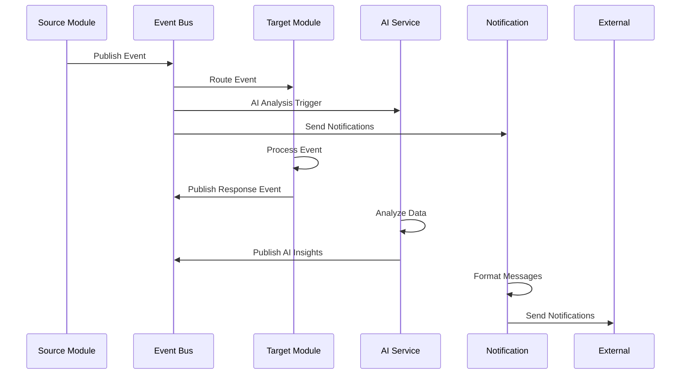
```mermaid
sequenceDiagram
    participant Source as Source Module
    participant EventBus as Event Bus
    participant Target as Target Module
    participant AI as AI Service
    participant Notification as Notification

    Source->>EventBus: Publish Event
    EventBus->>Target: Route Event
    EventBus->>AI: AI Analysis Trigger
    EventBus->>Notification: Send Notifications

    Target->>Target: Process Event
    Target->>EventBus: Publish Response Event

    AI->>AI: Analyze Data
    AI->>EventBus: Publish AI Insights

    Notification->>Notification: Format Messages
    Notification->>External: Send Notifications
```

**Event Categories:**
- `bcm.bia.*` - Business Impact Analysis events
- `bcm.risk.*` - Risk management events
- `bcm.incident.*` - Incident management events
- `bcm.plan.*` - Plan management events
- `bcm.exercise.*` - Exercise events
- `bcm.training.*` - Training events
- `bcm.compliance.*` - Compliance events
- `system.*` - System-level events

### Pattern 2: API Orchestration

Complex operations requiring multiple module coordination use API orchestration patterns.

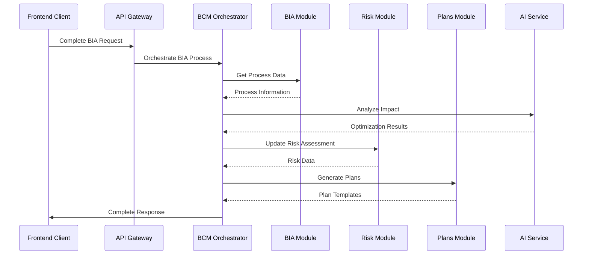
```mermaid
sequenceDiagram
    participant Client as Frontend Client
    participant Gateway as API Gateway
    participant Orchestrator as BCM Orchestrator
    participant BIA as BIA Module
    participant Risk as Risk Module
    participant Plans as Plans Module
    participant AI as AI Service

    Client->>Gateway: Complete BIA Request
    Gateway->>Orchestrator: Orchestrate BIA Process

    Orchestrator->>BIA: Get Process Data
    BIA-->>Orchestrator: Process Information

    Orchestrator->>AI: Analyze Impact
    AI-->>Orchestrator: Optimization Results

    Orchestrator->>Risk: Update Risk Assessment
    Risk-->>Orchestrator: Risk Data

    Orchestrator->>Plans: Generate Plans
    Plans-->>Orchestrator: Plan Templates

    Orchestrator->>Client: Complete Response
```

### Pattern 3: Data Synchronization

Critical data synchronization ensures consistency across modules while maintaining performance.

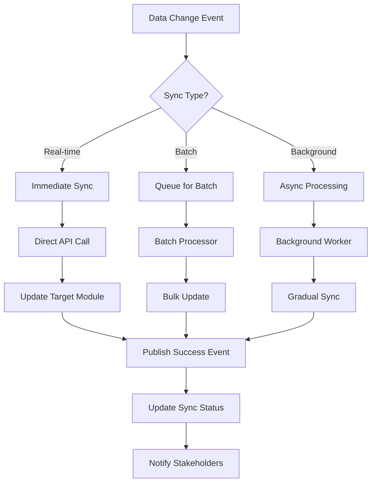
```mermaid
flowchart TD
    A[Data Change Event] --> B{Sync Type?}
    B -->|Real-time| C[Immediate Sync]
    B -->|Batch| D[Queue for Batch]
    B -->|Background| E[Async Processing]

    C --> F[Direct API Call]
    D --> G[Batch Processor]
    E --> H[Background Worker]

    F --> I[Update Target Module]
    G --> J[Bulk Update]
    H --> K[Gradual Sync]

    I --> L[Publish Success Event]
    J --> L
    K --> L

    L --> M[Update Sync Status]
    M --> N[Notify Stakeholders]
```

---

## Module Interaction Matrix

### Interaction Dependencies

| Source Module | Target Module | Interaction Type | Data Flow | Frequency |
|---------------|---------------|------------------|-----------|-----------|
| bcm_core | All Modules | API + Events | Bidirectional | Continuous |
| bcm_bia | bcm_risk_management | Events | BIA → Risk | On Update |
| bcm_bia | bcm_plans | API | BIA → Plans | On Demand |
| bcm_risk_management | bcm_plans | Events | Risk → Plans | Real-time |
| bcm_incident | bcm_plans | API + Events | Bidirectional | Real-time |
| bcm_plans | bcm_exercise | API | Plans → Exercise | On Schedule |
| bcm_exercise | bcm_training | Events | Exercise → Training | Post-Exercise |
| bcm_audit | All Modules | API | Audit ← All | Periodic |
| bcm_governance | All Modules | Events | Governance → All | Policy Updates |
| bcm_kpi | All Modules | API | KPI ← All | Real-time |
| bcm_reporting | All Modules | API | Reporting ← All | On Demand |
| bcm_portal | All Modules | API | Bidirectional | User Actions |

### Critical Integration Points

#### 1. BIA to Risk Management Integration

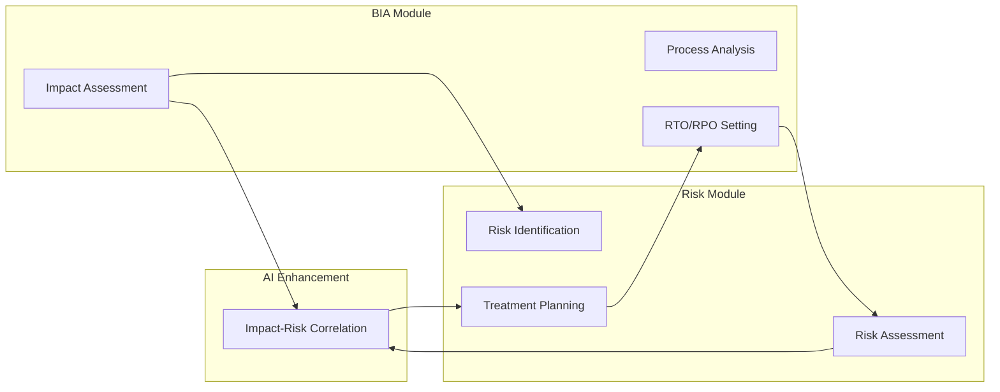
```mermaid
flowchart LR
    subgraph "BIA Module"
        BIA1[Process Analysis]
        BIA2[Impact Assessment]
        BIA3[RTO/RPO Setting]
    end

    subgraph "Risk Module"
        RISK1[Risk Identification]
        RISK2[Risk Assessment]
        RISK3[Treatment Planning]
    end

    BIA2 --> RISK1
    BIA3 --> RISK2
    RISK3 --> BIA3

    subgraph "AI Enhancement"
        AI[Impact-Risk Correlation]
    end

    BIA2 --> AI
    RISK2 --> AI
    AI --> RISK3
```

**Integration Logic:**
- BIA impact levels trigger risk assessments
- Critical processes automatically create associated risks
- RTO/RPO targets influence risk tolerance levels
- Risk treatments update BIA recovery strategies

#### 2. Incident to Plans Integration

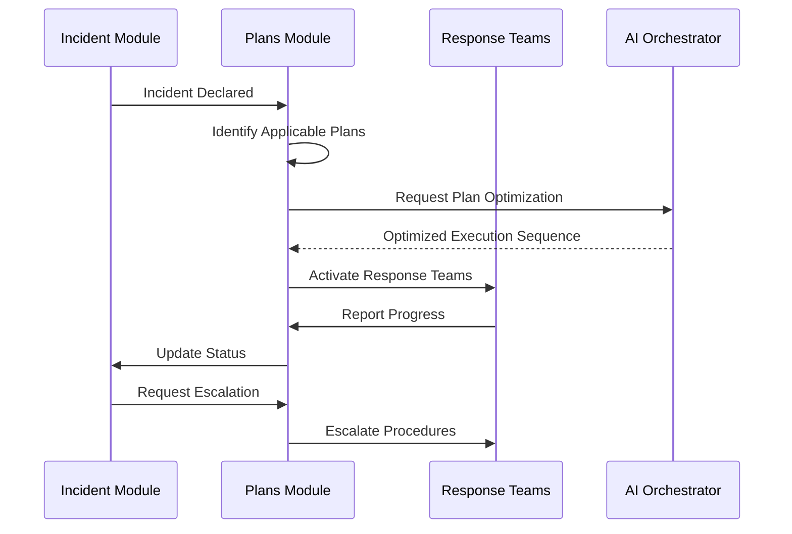
```mermaid
sequenceDiagram
    participant Incident as Incident Module
    participant Plans as Plans Module
    participant Teams as Response Teams
    participant AI as AI Orchestrator

    Incident->>Plans: Incident Declared
    Plans->>Plans: Identify Applicable Plans
    Plans->>AI: Request Plan Optimization
    AI-->>Plans: Optimized Execution Sequence
    Plans->>Teams: Activate Response Teams
    Teams->>Plans: Report Progress
    Plans->>Incident: Update Status
    Incident->>Plans: Request Escalation
    Plans->>Teams: Escalate Procedures
```

#### 3. Exercise to Training Integration

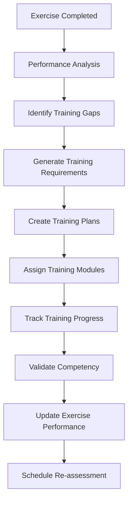
```mermaid
flowchart TD
    A[Exercise Completed] --> B[Performance Analysis]
    B --> C[Identify Training Gaps]
    C --> D[Generate Training Requirements]
    D --> E[Create Training Plans]
    E --> F[Assign Training Modules]
    F --> G[Track Training Progress]
    G --> H[Validate Competency]
    H --> I[Update Exercise Performance]
    I --> J[Schedule Re-assessment]
```

---

## Event-Driven Integration Flows

### Event Bus Architecture

The platform uses RabbitMQ-based event bus for asynchronous communication between modules.

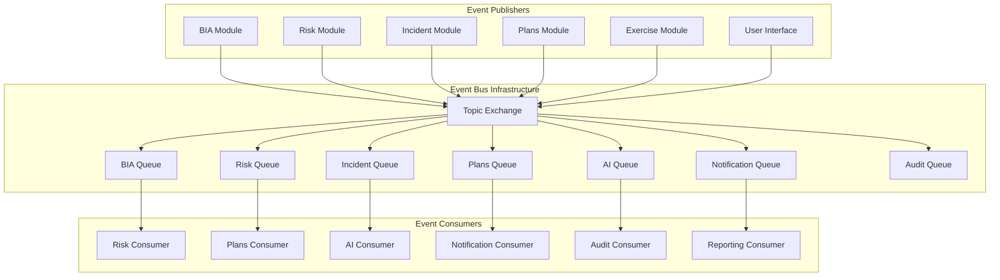
```mermaid
graph TB
    subgraph "Event Publishers"
        P1[BIA Module]
        P2[Risk Module]
        P3[Incident Module]
        P4[Plans Module]
        P5[Exercise Module]
        P6[User Interface]
    end

    subgraph "Event Bus Infrastructure"
        EXCHANGE[Topic Exchange]
        Q1[BIA Queue]
        Q2[Risk Queue]
        Q3[Incident Queue]
        Q4[Plans Queue]
        Q5[AI Queue]
        Q6[Notification Queue]
        Q7[Audit Queue]
    end

    subgraph "Event Consumers"
        C1[Risk Consumer]
        C2[Plans Consumer]
        C3[AI Consumer]
        C4[Notification Consumer]
        C5[Audit Consumer]
        C6[Reporting Consumer]
    end

    P1 --> EXCHANGE
    P2 --> EXCHANGE
    P3 --> EXCHANGE
    P4 --> EXCHANGE
    P5 --> EXCHANGE
    P6 --> EXCHANGE

    EXCHANGE --> Q1
    EXCHANGE --> Q2
    EXCHANGE --> Q3
    EXCHANGE --> Q4
    EXCHANGE --> Q5
    EXCHANGE --> Q6
    EXCHANGE --> Q7

    Q1 --> C1
    Q2 --> C2
    Q3 --> C3
    Q4 --> C4
    Q5 --> C5
    Q6 --> C6
```

### Event Schema Standards

**Standard Event Structure:**
```json
{
  "event_id": "uuid",
  "event_type": "bcm.bia.process.updated",
  "timestamp": "2024-01-01T12:00:00Z",
  "source": "bcm_bia",
  "tenant_id": "tenant_123",
  "user_id": "user_456",
  "data": {
    "process_id": "proc_789",
    "changes": {...},
    "metadata": {...}
  },
  "correlation_id": "corr_abc123",
  "version": "1.0"
}
```

### Critical Event Flows

#### 1. BIA Process Update Flow

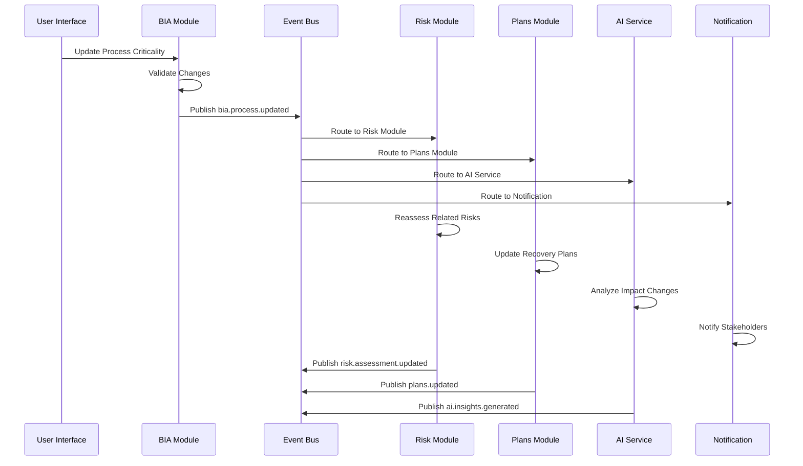
```mermaid
sequenceDiagram
    participant User as User Interface
    participant BIA as BIA Module
    participant EventBus as Event Bus
    participant Risk as Risk Module
    participant Plans as Plans Module
    participant AI as AI Service
    participant Notification as Notification

    User->>BIA: Update Process Criticality
    BIA->>BIA: Validate Changes
    BIA->>EventBus: Publish bia.process.updated

    EventBus->>Risk: Route to Risk Module
    EventBus->>Plans: Route to Plans Module
    EventBus->>AI: Route to AI Service
    EventBus->>Notification: Route to Notification

    Risk->>Risk: Reassess Related Risks
    Plans->>Plans: Update Recovery Plans
    AI->>AI: Analyze Impact Changes
    Notification->>Notification: Notify Stakeholders

    Risk->>EventBus: Publish risk.assessment.updated
    Plans->>EventBus: Publish plans.updated
    AI->>EventBus: Publish ai.insights.generated
```

#### 2. Incident Response Flow

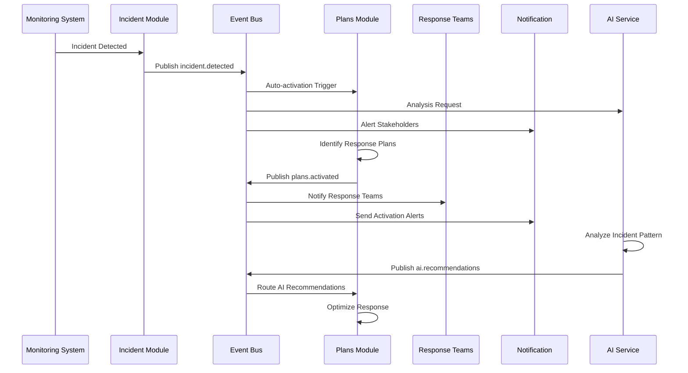
```mermaid
sequenceDiagram
    participant Monitor as Monitoring System
    participant Incident as Incident Module
    participant EventBus as Event Bus
    participant Plans as Plans Module
    participant Teams as Response Teams
    participant Notification as Notification
    participant AI as AI Service

    Monitor->>Incident: Incident Detected
    Incident->>EventBus: Publish incident.detected

    EventBus->>Plans: Auto-activation Trigger
    EventBus->>AI: Analysis Request
    EventBus->>Notification: Alert Stakeholders

    Plans->>Plans: Identify Response Plans
    Plans->>EventBus: Publish plans.activated

    EventBus->>Teams: Notify Response Teams
    EventBus->>Notification: Send Activation Alerts

    AI->>AI: Analyze Incident Pattern
    AI->>EventBus: Publish ai.recommendations

    EventBus->>Plans: Route AI Recommendations
    Plans->>Plans: Optimize Response
```

---

## API Integration Patterns

### RESTful API Design

All modules expose standardized REST APIs following OpenAPI 3.0 specifications.

#### Standard API Patterns

**Resource-Based URLs:**
```
GET /api/v1/bia/processes
POST /api/v1/bia/processes
GET /api/v1/bia/processes/{id}
PUT /api/v1/bia/processes/{id}
DELETE /api/v1/bia/processes/{id}
```

**Cross-Module API Calls:**
```
GET /api/v1/risk/assessments?process_id={bia_process_id}
POST /api/v1/plans/generate
{
  "process_ids": ["proc1", "proc2"],
  "risk_ids": ["risk1", "risk2"],
  "template_id": "template1"
}
```

#### API Gateway Configuration

```yaml
routes:
  - path: /api/v1/bia/*
    service: bcm_bia
    middleware: [auth, rate_limit, audit]

  - path: /api/v1/risk/*
    service: bcm_risk_management
    middleware: [auth, rate_limit, audit]

  - path: /api/v1/incidents/*
    service: bcm_incident
    middleware: [auth, rate_limit, audit, priority]

  - path: /api/v1/plans/*
    service: bcm_plans
    middleware: [auth, rate_limit, audit]
```

### GraphQL Integration

Advanced queries spanning multiple modules use GraphQL for efficient data fetching.

```graphql
query DashboardData($tenantId: ID!) {
  bia {
    processes(tenantId: $tenantId) {
      id
      name
      criticality
      rto
      rpo
      risks {
        id
        level
        status
      }
    }
  }

  incidents(tenantId: $tenantId, status: "open") {
    id
    severity
    affectedProcesses {
      id
      name
    }
    activePlans {
      id
      status
    }
  }

  kpis(tenantId: $tenantId) {
    name
    value
    target
    trend
  }
}
```

---

## Data Flow Diagrams

### Complete BCM Data Flow

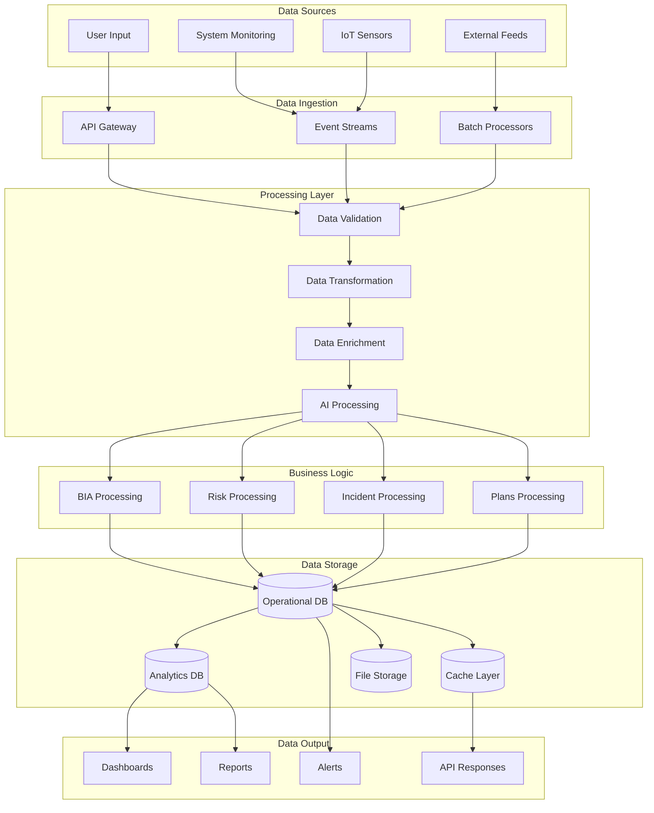
```mermaid
flowchart TD
    subgraph "Data Sources"
        USERS[User Input]
        SYSTEMS[System Monitoring]
        EXTERNAL[External Feeds]
        SENSORS[IoT Sensors]
    end

    subgraph "Data Ingestion"
        API[API Gateway]
        STREAMS[Event Streams]
        BATCH[Batch Processors]
    end

    subgraph "Processing Layer"
        VALIDATION[Data Validation]
        TRANSFORMATION[Data Transformation]
        ENRICHMENT[Data Enrichment]
        AI_PROCESSING[AI Processing]
    end

    subgraph "Business Logic"
        BIA_LOGIC[BIA Processing]
        RISK_LOGIC[Risk Processing]
        INCIDENT_LOGIC[Incident Processing]
        PLANS_LOGIC[Plans Processing]
    end

    subgraph "Data Storage"
        OPERATIONAL[(Operational DB)]
        ANALYTICAL[(Analytics DB)]
        CACHE[(Cache Layer)]
        FILES[(File Storage)]
    end

    subgraph "Data Output"
        DASHBOARDS[Dashboards]
        REPORTS[Reports]
        ALERTS[Alerts]
        APIS[API Responses]
    end

    USERS --> API
    SYSTEMS --> STREAMS
    EXTERNAL --> BATCH
    SENSORS --> STREAMS

    API --> VALIDATION
    STREAMS --> VALIDATION
    BATCH --> VALIDATION

    VALIDATION --> TRANSFORMATION
    TRANSFORMATION --> ENRICHMENT
    ENRICHMENT --> AI_PROCESSING

    AI_PROCESSING --> BIA_LOGIC
    AI_PROCESSING --> RISK_LOGIC
    AI_PROCESSING --> INCIDENT_LOGIC
    AI_PROCESSING --> PLANS_LOGIC

    BIA_LOGIC --> OPERATIONAL
    RISK_LOGIC --> OPERATIONAL
    INCIDENT_LOGIC --> OPERATIONAL
    PLANS_LOGIC --> OPERATIONAL

    OPERATIONAL --> ANALYTICAL
    OPERATIONAL --> CACHE
    OPERATIONAL --> FILES

    ANALYTICAL --> DASHBOARDS
    ANALYTICAL --> REPORTS
    CACHE --> APIS
    OPERATIONAL --> ALERTS
```

### Module-Specific Data Flows

#### BIA Data Flow

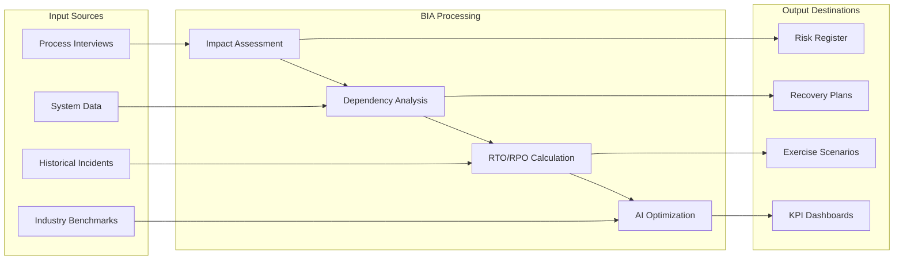
```mermaid
flowchart LR
    subgraph "Input Sources"
        A[Process Interviews]
        B[System Data]
        C[Historical Incidents]
        D[Industry Benchmarks]
    end

    subgraph "BIA Processing"
        E[Impact Assessment]
        F[Dependency Analysis]
        G[RTO/RPO Calculation]
        H[AI Optimization]
    end

    subgraph "Output Destinations"
        I[Risk Register]
        J[Recovery Plans]
        K[Exercise Scenarios]
        L[KPI Dashboards]
    end

    A --> E
    B --> F
    C --> G
    D --> H

    E --> I
    F --> J
    G --> K
    H --> L

    E --> F
    F --> G
    G --> H
```

#### Risk Management Data Flow

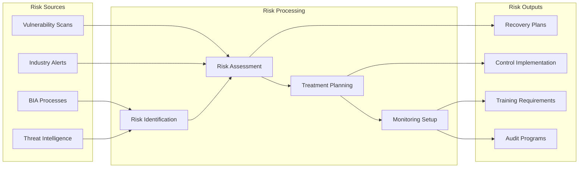
```mermaid
flowchart LR
    subgraph "Risk Sources"
        A[BIA Processes]
        B[Threat Intelligence]
        C[Vulnerability Scans]
        D[Industry Alerts]
    end

    subgraph "Risk Processing"
        E[Risk Identification]
        F[Risk Assessment]
        G[Treatment Planning]
        H[Monitoring Setup]
    end

    subgraph "Risk Outputs"
        I[Recovery Plans]
        J[Control Implementation]
        K[Training Requirements]
        L[Audit Programs]
    end

    A --> E
    B --> E
    C --> F
    D --> F

    E --> F
    F --> G
    G --> H

    F --> I
    G --> J
    H --> K
    H --> L
```

---

## Real-Time Integration Flows

### WebSocket-Based Real-Time Updates

Critical operations use WebSocket connections for real-time collaboration and monitoring.

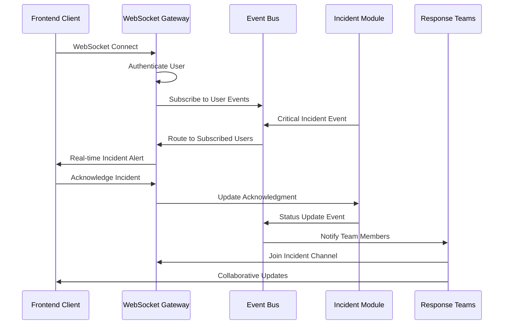
```mermaid
sequenceDiagram
    participant Client as Frontend Client
    participant Gateway as WebSocket Gateway
    participant EventBus as Event Bus
    participant Incident as Incident Module
    participant Teams as Response Teams

    Client->>Gateway: WebSocket Connect
    Gateway->>Gateway: Authenticate User
    Gateway->>EventBus: Subscribe to User Events

    Incident->>EventBus: Critical Incident Event
    EventBus->>Gateway: Route to Subscribed Users
    Gateway->>Client: Real-time Incident Alert

    Client->>Gateway: Acknowledge Incident
    Gateway->>Incident: Update Acknowledgment
    Incident->>EventBus: Status Update Event
    EventBus->>Teams: Notify Team Members

    Teams->>Gateway: Join Incident Channel
    Teams->>Client: Collaborative Updates
```

### Server-Sent Events (SSE) for Monitoring

Long-running monitoring operations use SSE for efficient real-time updates.

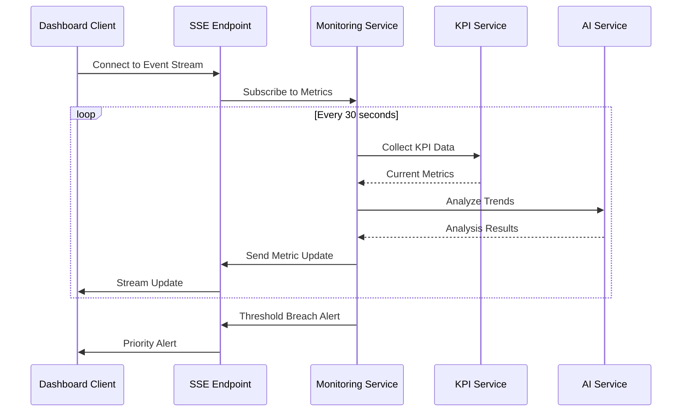
```mermaid
sequenceDiagram
    participant Dashboard as Dashboard Client
    participant SSE as SSE Endpoint
    participant Monitor as Monitoring Service
    participant KPI as KPI Service
    participant AI as AI Service

    Dashboard->>SSE: Connect to Event Stream
    SSE->>Monitor: Subscribe to Metrics

    loop Every 30 seconds
        Monitor->>KPI: Collect KPI Data
        KPI-->>Monitor: Current Metrics
        Monitor->>AI: Analyze Trends
        AI-->>Monitor: Analysis Results
        Monitor->>SSE: Send Metric Update
        SSE->>Dashboard: Stream Update
    end

    Monitor->>SSE: Threshold Breach Alert
    SSE->>Dashboard: Priority Alert
```

### Streaming Data Processing

High-volume data streams use Apache Kafka-like patterns for scalable processing.

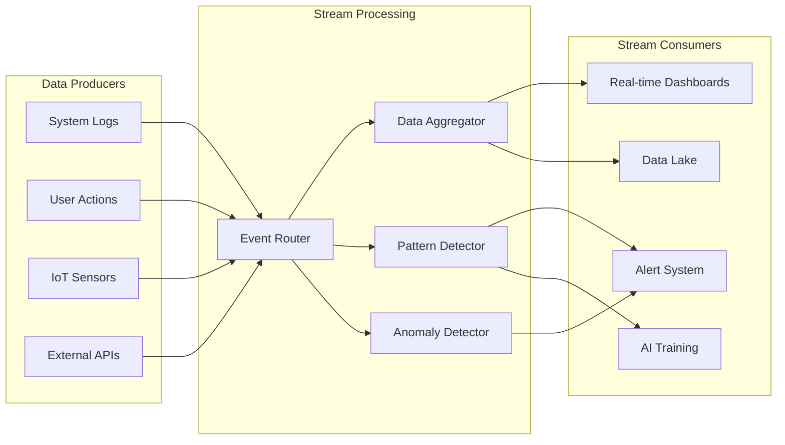
```mermaid
flowchart LR
    subgraph "Data Producers"
        A[System Logs]
        B[User Actions]
        C[IoT Sensors]
        D[External APIs]
    end

    subgraph "Stream Processing"
        E[Event Router]
        F[Data Aggregator]
        G[Pattern Detector]
        H[Anomaly Detector]
    end

    subgraph "Stream Consumers"
        I[Real-time Dashboards]
        J[Alert System]
        K[Data Lake]
        L[AI Training]
    end

    A --> E
    B --> E
    C --> E
    D --> E

    E --> F
    E --> G
    E --> H

    F --> I
    G --> J
    H --> J
    F --> K
    G --> L
```

---

## External System Integrations

### Enterprise System Integrations

#### Microsoft Teams Integration

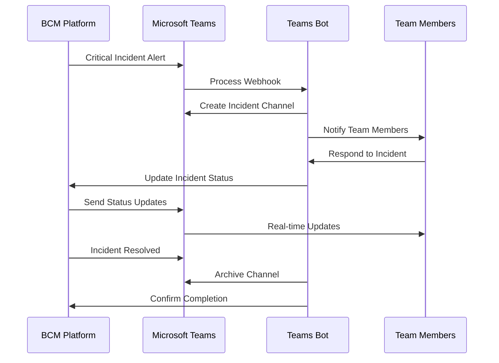
```mermaid
sequenceDiagram
    participant BCM as BCM Platform
    participant Teams as Microsoft Teams
    participant Bot as Teams Bot
    participant Users as Team Members

    BCM->>Teams: Critical Incident Alert
    Teams->>Bot: Process Webhook
    Bot->>Teams: Create Incident Channel
    Bot->>Users: Notify Team Members

    Users->>Bot: Respond to Incident
    Bot->>BCM: Update Incident Status
    BCM->>Teams: Send Status Updates
    Teams->>Users: Real-time Updates

    BCM->>Teams: Incident Resolved
    Bot->>Teams: Archive Channel
    Bot->>BCM: Confirm Completion
```

#### TheHive Security Platform

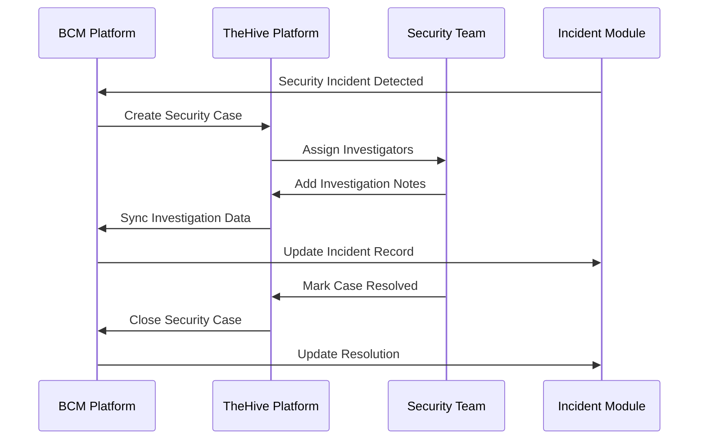
```mermaid
sequenceDiagram
    participant BCM as BCM Platform
    participant TheHive as TheHive Platform
    participant Security as Security Team
    participant Incident as Incident Module

    Incident->>BCM: Security Incident Detected
    BCM->>TheHive: Create Security Case
    TheHive->>Security: Assign Investigators

    Security->>TheHive: Add Investigation Notes
    TheHive->>BCM: Sync Investigation Data
    BCM->>Incident: Update Incident Record

    Security->>TheHive: Mark Case Resolved
    TheHive->>BCM: Close Security Case
    BCM->>Incident: Update Resolution
```

#### Grafana Monitoring Integration

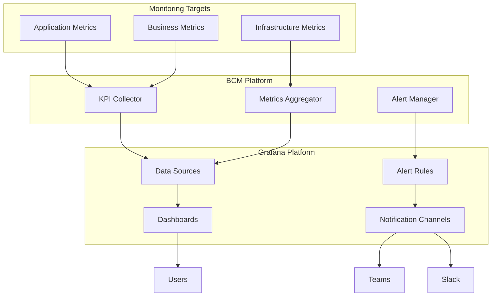
```mermaid
flowchart TD
    subgraph "BCM Platform"
        A[KPI Collector]
        B[Metrics Aggregator]
        C[Alert Manager]
    end

    subgraph "Grafana Platform"
        D[Data Sources]
        E[Dashboards]
        F[Alert Rules]
        G[Notification Channels]
    end

    subgraph "Monitoring Targets"
        H[Application Metrics]
        I[Infrastructure Metrics]
        J[Business Metrics]
    end

    A --> D
    B --> D
    C --> F

    D --> E
    F --> G

    H --> A
    I --> B
    J --> A

    E --> Users
    G --> Teams
    G --> Slack
```

### Cloud Service Integrations

#### AWS Services Integration

```yaml
integrations:
  s3:
    purpose: Document and backup storage
    configuration:
      bucket: bcm-platform-documents
      encryption: AES-256
      versioning: enabled

  sns:
    purpose: Critical alert distribution
    configuration:
      topics:
        - bcm-critical-alerts
        - bcm-system-alerts

  lambda:
    purpose: Serverless processing
    functions:
      - incident-auto-classification
      - report-generation
      - data-transformation
```

#### Azure Services Integration

```yaml
integrations:
  active_directory:
    purpose: Single sign-on authentication
    configuration:
      tenant_id: ${AZURE_TENANT_ID}
      client_id: ${AZURE_CLIENT_ID}

  blob_storage:
    purpose: Large file storage
    configuration:
      account: bcmplatformstorage
      container: documents

  cognitive_services:
    purpose: AI-powered document analysis
    services:
      - text-analytics
      - form-recognizer
      - language-understanding
```

---

## Error Handling and Resilience

### Circuit Breaker Pattern

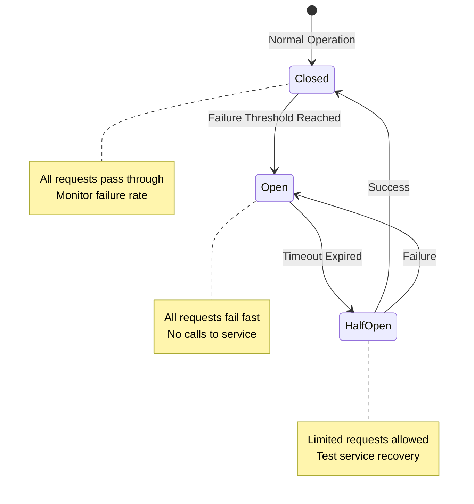
```mermaid
stateDiagram-v2
    [*] --> Closed: Normal Operation
    Closed --> Open: Failure Threshold Reached
    Open --> HalfOpen: Timeout Expired
    HalfOpen --> Closed: Success
    HalfOpen --> Open: Failure

    note right of Closed
        All requests pass through
        Monitor failure rate
    end note

    note right of Open
        All requests fail fast
        No calls to service
    end note

    note right of HalfOpen
        Limited requests allowed
        Test service recovery
    end note
```

### Retry Mechanisms

```mermaid
flowchart TD
    A[API Call] --> B{Success?}
    B -->|Yes| C[Return Result]
    B -->|No| D{Retryable Error?}
    D -->|No| E[Return Error]
    D -->|Yes| F{Max Retries?}
    F -->|Yes| E
    F -->|No| G[Wait with Backoff]
    G --> H[Increment Counter]
    H --> A

    subgraph "Backoff Strategy"
        I[Exponential Backoff]
        J[Jitter Addition]
        K[Max Delay Cap]
    end

    G --> I
    I --> J
    J --> K
```

### Fallback Strategies

**Integration Fallback Hierarchy:**
1. **Primary Service:** Normal operation
2. **Secondary Service:** Backup service instance
3. **Cache:** Last known good data
4. **Default Values:** Safe operational defaults
5. **Degraded Mode:** Limited functionality
6. **Offline Mode:** Essential functions only

### Error Propagation

```mermaid
sequenceDiagram
    participant Client as Frontend
    participant Gateway as API Gateway
    participant Service as BCM Service
    participant External as External API
    participant Monitor as Error Monitor

    Client->>Gateway: API Request
    Gateway->>Service: Forward Request
    Service->>External: External API Call
    External-->>Service: Error Response

    Service->>Monitor: Log Error Details
    Service->>Service: Apply Fallback Logic
    Service-->>Gateway: Fallback Response
    Gateway-->>Client: Processed Response

    Monitor->>Monitor: Analyze Error Pattern
    Monitor->>Teams: Alert if Threshold Exceeded
```

---

**This document provides the comprehensive foundation for understanding how all modules integrate and interact within the BCM platform, enabling developers to build robust, scalable, and resilient integrations.**