# BCM Platform PDCA Processes and Continuous Improvement

## Overview

This document defines how the BCM Platform implements the Plan-Do-Check-Act (PDCA) cycle for continuous improvement in Business Continuity Management. It provides the business logic foundation for automated PDCA processes, AI-driven optimization, and comprehensive continuous improvement workflows.

## Table of Contents

1. [PDCA Framework Overview](#pdca-framework-overview)
2. [PLAN Phase Implementation](#plan-phase-implementation)
3. [DO Phase Execution](#do-phase-execution)
4. [CHECK Phase Monitoring](#check-phase-monitoring)
5. [ACT Phase Improvement](#act-phase-improvement)
6. [AI-Driven PDCA Automation](#ai-driven-pdca-automation)
7. [Cross-Module PDCA Integration](#cross-module-pdca-integration)
8. [Continuous Improvement Metrics](#continuous-improvement-metrics)
9. [PDCA Governance and Controls](#pdca-governance-and-controls)

---

## PDCA Framework Overview

### PDCA Cycle Definition

The PDCA cycle is the foundation of continuous improvement in the BCM Platform, ensuring systematic enhancement of business continuity capabilities through iterative improvement processes.

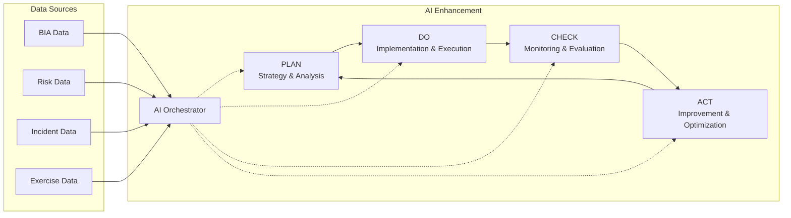

### Platform PDCA Integration

**Core Principles:**
- Every BCM process participates in continuous PDCA cycles
- AI-driven insights enhance decision-making at each phase
- Real-time data feeds enable dynamic optimization
- Cross-module collaboration ensures holistic improvement
- Automated workflows reduce manual overhead

**Key Components:**
- **Event-Driven Architecture:** Real-time PDCA trigger events
- **AI Orchestrator:** Intelligent analysis and recommendations
- **BPMN Workflows:** Automated process execution
- **KPI Framework:** Continuous performance monitoring
- **Feedback Loops:** Multi-level improvement mechanisms

---

## PLAN Phase Implementation

### Strategic Planning Process

The PLAN phase establishes the foundation for effective business continuity management through comprehensive analysis and strategic planning.

#### Business Impact Analysis (BIA) Planning

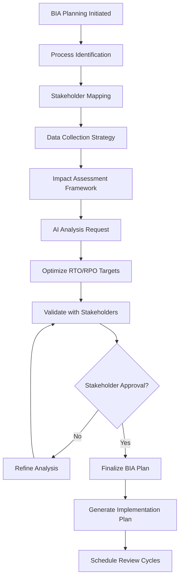

**AI Enhancement Features:**
- Automated process discovery through data analysis
- Predictive impact modeling based on historical data
- Optimization algorithms for RTO/RPO targets
- Stakeholder influence analysis and engagement planning
- Resource allocation optimization

**Frontend Implementation:**
- Interactive BIA planning wizard
- Drag-and-drop process modeling interface
- AI-powered impact calculation tools
- Collaborative stakeholder review workflows
- Automated documentation generation

#### Risk Management Planning

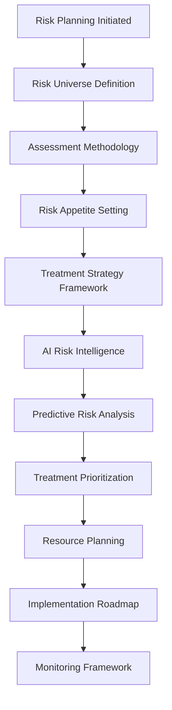

**Key Planning Components:**
- Risk taxonomy and categorization
- Assessment criteria and scoring matrices
- Treatment strategy templates
- Resource requirement analysis
- Timeline and milestone planning

#### Continuity Plan Development

**Planning Elements:**
- Recovery strategy selection
- Resource requirement analysis
- Team structure and responsibilities
- Communication plan development
- Testing and exercise planning

---

## DO Phase Execution

### Implementation and Execution Management

The DO phase focuses on executing planned activities and implementing business continuity measures according to established plans.

#### Plan Implementation Workflow

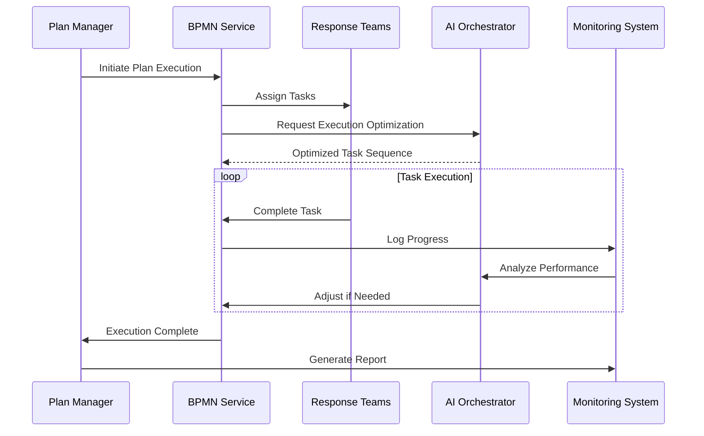

**Execution Components:**
- Task assignment and tracking
- Real-time progress monitoring
- Dynamic task optimization
- Resource allocation management
- Communication coordination

#### Training and Exercise Execution

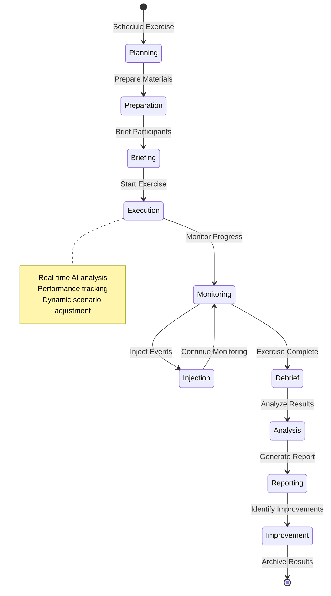

**Exercise Types and Execution:**
- **Tabletop Exercises:** Discussion-based scenario walkthroughs
- **Functional Exercises:** Specific function or capability testing
- **Full-Scale Exercises:** Comprehensive response testing
- **Virtual Exercises:** Technology-mediated remote exercises

#### Incident Response Execution

**Response Activation Process:**
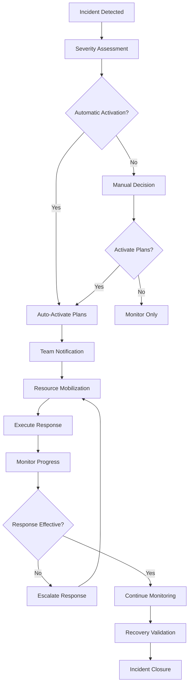

---

## CHECK Phase Monitoring

### Performance Monitoring and Evaluation

The CHECK phase provides continuous monitoring and evaluation of BCM performance against established objectives and targets.

#### KPI Monitoring Framework

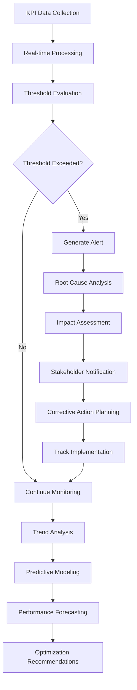

**Key Performance Indicators:**
- **Availability Metrics:** System uptime, service availability
- **Response Metrics:** Incident response times, recovery times
- **Compliance Metrics:** Audit findings, regulatory compliance
- **Training Metrics:** Competency levels, exercise performance
- **Risk Metrics:** Risk exposure, treatment effectiveness

#### Continuous Assessment Process

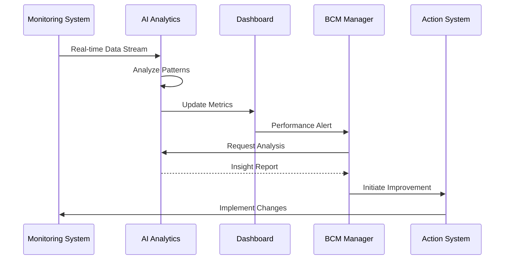

#### Compliance Monitoring

**Automated Compliance Checks:**
- Policy adherence monitoring
- Regulatory requirement tracking
- Audit trail validation
- Control effectiveness assessment
- Documentation completeness verification

**Compliance States:**
- **Compliant:** All requirements met
- **Partial Compliance:** Some gaps identified
- **Non-Compliant:** Significant issues found
- **Under Review:** Assessment in progress
- **Improvement Required:** Actions needed

---

## ACT Phase Improvement

### Improvement Implementation and Optimization

The ACT phase implements improvements based on monitoring results and analysis, ensuring continuous enhancement of BCM capabilities.

#### Improvement Planning Process

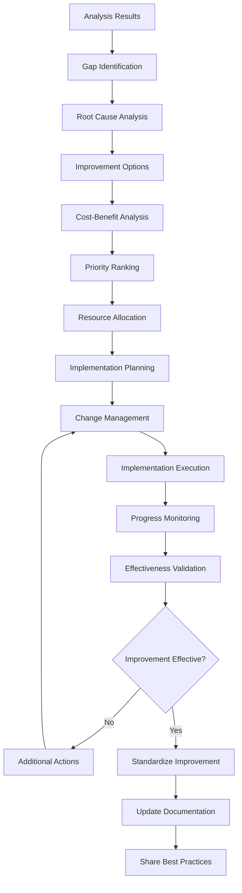

#### Corrective and Preventive Actions (CAPA)

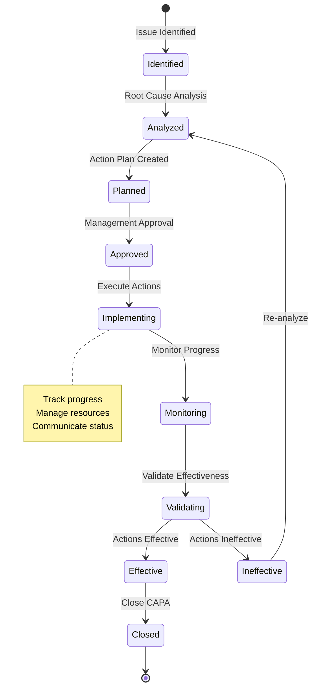

**CAPA Categories:**
- **Corrective Actions:** Fix identified problems
- **Preventive Actions:** Prevent potential problems
- **Improvement Actions:** Enhance existing processes
- **Innovation Actions:** Implement new capabilities

#### Continuous Improvement Lifecycle

**Improvement Sources:**
- Internal assessment findings
- External audit recommendations
- Incident lessons learned
- Exercise improvement opportunities
- Stakeholder feedback
- Industry best practice adoption

**Implementation Framework:**
1. **Opportunity Identification:** Regular assessment and feedback collection
2. **Business Case Development:** Cost-benefit analysis and resource planning
3. **Stakeholder Engagement:** Change management and communication
4. **Phased Implementation:** Controlled rollout with validation points
5. **Effectiveness Measurement:** KPI tracking and outcome validation
6. **Standardization:** Process documentation and knowledge sharing

---

## AI-Driven PDCA Automation

### Artificial Intelligence Enhancement

AI services provide intelligent automation and optimization throughout the PDCA cycle, enabling proactive improvement and predictive insights.

#### AI Orchestrator Functions

```mermaid
graph TB
    subgraph "AI Orchestrator Core"
        A[Pattern Recognition Engine]
        B[Predictive Analytics Engine]
        C[Optimization Algorithm Engine]
        D[Decision Support Engine]
    end

    subgraph "PLAN Enhancement"
        E[Strategic Planning AI]
        F[Resource Optimization AI]
        G[Risk Prediction AI]
    end

    subgraph "DO Enhancement"
        H[Execution Optimization AI]
        I[Real-time Adjustment AI]
        J[Resource Allocation AI]
    end

    subgraph "CHECK Enhancement"
        K[Performance Analysis AI]
        L[Anomaly Detection AI]
        M[Trend Forecasting AI]
    end

    subgraph "ACT Enhancement"
        N[Improvement Recommendation AI]
        O[Priority Optimization AI]
        P[Implementation Planning AI]
    end

    A --> E
    A --> H
    A --> K
    A --> N

    B --> G
    B --> M
    B --> N

    C --> F
    C --> I
    C --> O

    D --> E
    D --> L
    D --> P
```

#### Predictive PDCA Capabilities

**Predictive Planning:**
- Business impact forecasting
- Risk trend prediction
- Resource demand forecasting
- Scenario probability analysis

**Intelligent Execution:**
- Dynamic workflow optimization
- Real-time resource reallocation
- Automated decision support
- Performance prediction

**Smart Monitoring:**
- Anomaly detection and alerting
- Predictive failure analysis
- Performance trend identification
- Compliance risk prediction

**Proactive Improvement:**
- Opportunity identification
- Improvement impact prediction
- Optimization recommendation
- Implementation success forecasting

#### Machine Learning Models

**Model Categories:**
- **Time Series Models:** Trend analysis and forecasting
- **Classification Models:** Risk categorization and severity assessment
- **Regression Models:** Impact prediction and resource optimization
- **Clustering Models:** Pattern recognition and anomaly detection
- **Neural Networks:** Complex relationship modeling and prediction

---

## Cross-Module PDCA Integration

### Integrated PDCA Workflows

The platform implements comprehensive PDCA cycles that span multiple modules, ensuring holistic improvement across all BCM capabilities.

#### End-to-End PDCA Integration

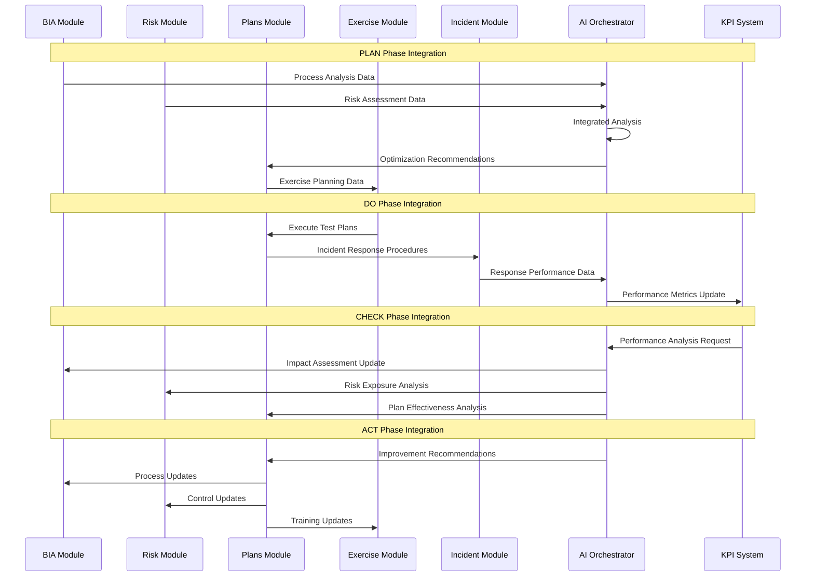

#### Module-Specific PDCA Cycles

**BIA Module PDCA:**
- **Plan:** Process identification and impact assessment planning
- **Do:** Conduct BIA interviews and data collection
- **Check:** Validate impact calculations and RTO/RPO targets
- **Act:** Update process criticality and recovery requirements

**Risk Module PDCA:**
- **Plan:** Risk identification and assessment methodology
- **Do:** Execute risk assessments and treatment plans
- **Check:** Monitor risk levels and treatment effectiveness
- **Act:** Update risk treatments and controls

**Plans Module PDCA:**
- **Plan:** Develop recovery strategies and procedures
- **Do:** Implement and test continuity plans
- **Check:** Evaluate plan effectiveness and execution performance
- **Act:** Update plans based on lessons learned and improvements

**Exercise Module PDCA:**
- **Plan:** Design exercise scenarios and objectives
- **Do:** Execute training exercises and simulations
- **Check:** Evaluate exercise performance and learning outcomes
- **Act:** Improve training content and exercise design

---

## Continuous Improvement Metrics

### PDCA Performance Measurement

Comprehensive metrics framework for measuring PDCA effectiveness and continuous improvement progress.

#### Cycle-Specific Metrics

**PLAN Phase Metrics:**
- Planning cycle time and efficiency
- Stakeholder engagement effectiveness
- Plan quality and completeness scores
- Resource estimation accuracy

**DO Phase Metrics:**
- Implementation success rates
- Execution time and efficiency
- Resource utilization effectiveness
- Quality of deliverables

**CHECK Phase Metrics:**
- Monitoring coverage and effectiveness
- Issue detection rates and timeliness
- Performance variance from targets
- Compliance assessment scores

**ACT Phase Metrics:**
- Improvement implementation success
- Time to implement improvements
- Improvement effectiveness scores
- Cost-benefit realization

#### Integrated PDCA Metrics

```mermaid
graph TD
    A[PDCA Cycle Metrics] --> B[Cycle Time Metrics]
    A --> C[Quality Metrics]
    A --> D[Effectiveness Metrics]
    A --> E[Efficiency Metrics]

    B --> B1[Plan-to-Do Time]
    B --> B2[Do-to-Check Time]
    B --> B3[Check-to-Act Time]
    B --> B4[Full Cycle Time]

    C --> C1[Plan Quality Score]
    C --> C2[Execution Quality Score]
    C --> C3[Monitoring Accuracy]
    C --> C4[Improvement Success Rate]

    D --> D1[Target Achievement Rate]
    D --> D2[Issue Resolution Rate]
    D --> D3[Stakeholder Satisfaction]
    D --> D4[ROI on Improvements]

    E --> E1[Resource Utilization]
    E --> E2[Automation Rate]
    E --> E3[Cost per Cycle]
    E --> E4[Time to Value]
```

#### Maturity Assessment Framework

**PDCA Maturity Levels:**
1. **Initial (Level 1):** Ad-hoc, reactive approach
2. **Managed (Level 2):** Basic PDCA processes established
3. **Defined (Level 3):** Standardized and documented processes
4. **Quantitatively Managed (Level 4):** Metrics-driven optimization
5. **Optimizing (Level 5):** Continuous innovation and improvement

**Maturity Indicators:**
- Process standardization and documentation
- Metrics collection and analysis capabilities
- Automation and AI integration levels
- Stakeholder engagement and satisfaction
- Continuous improvement culture adoption

---

## PDCA Governance and Controls

### Governance Framework

Structured governance ensures effective PDCA implementation with appropriate oversight and accountability.

#### PDCA Governance Structure

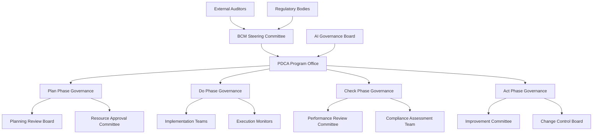

#### Control Framework

**Key Controls:**
- **Authorization Controls:** Proper approval for PDCA activities
- **Segregation of Duties:** Separation of execution and monitoring
- **Documentation Controls:** Complete audit trail maintenance
- **Review Controls:** Regular assessment and validation
- **Change Controls:** Managed improvement implementation

**Risk Management:**
- PDCA process risk assessment
- Control effectiveness monitoring
- Risk mitigation planning
- Continuous control improvement

#### Audit and Assurance

**Internal Audit Activities:**
- PDCA process effectiveness reviews
- Compliance assessment and validation
- Control testing and verification
- Improvement opportunity identification

**External Assurance:**
- Regulatory compliance validation
- Third-party effectiveness assessments
- Certification maintenance support
- Best practice benchmarking

---

**This document provides the comprehensive foundation for implementing and managing PDCA processes across the BCM platform, ensuring systematic continuous improvement and optimization of business continuity capabilities.**