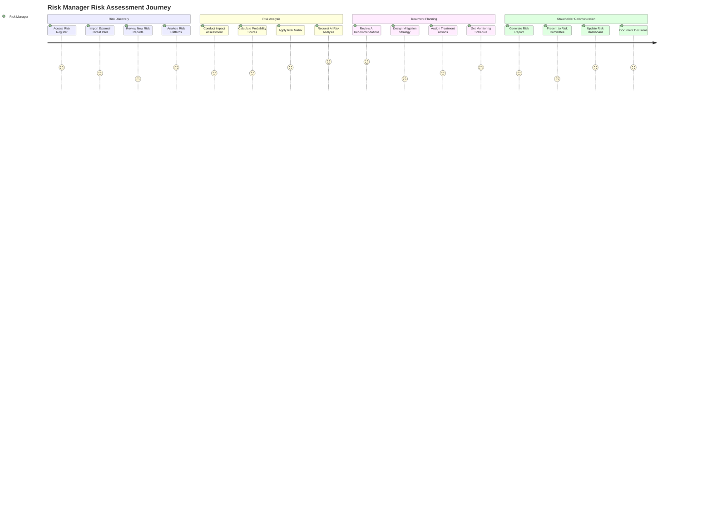
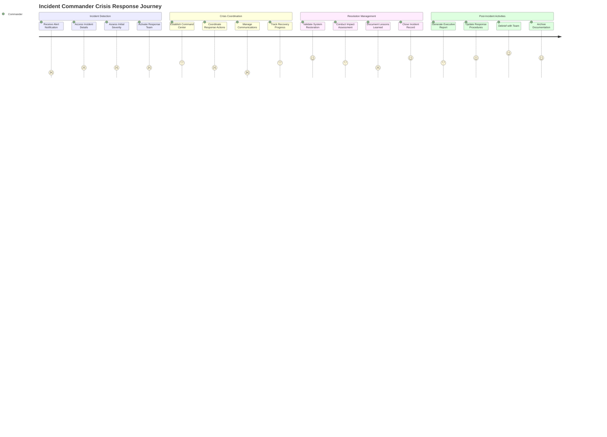
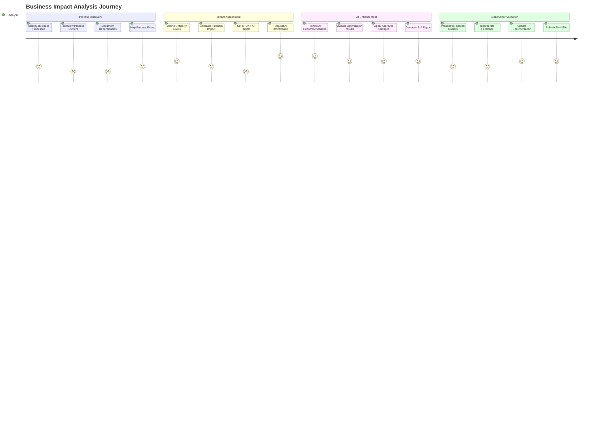
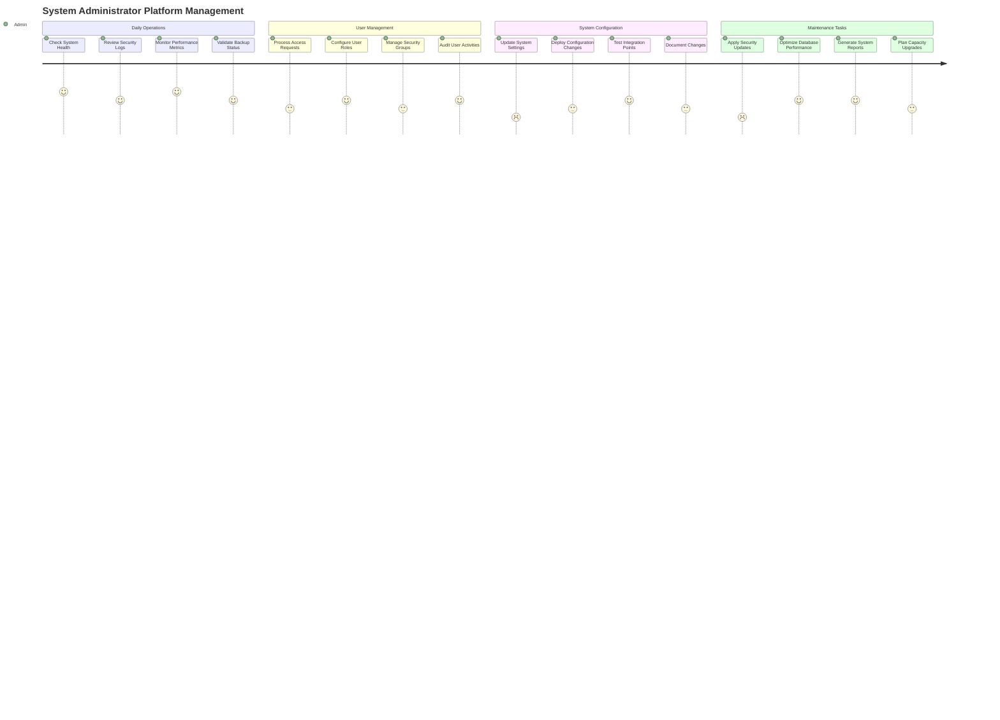
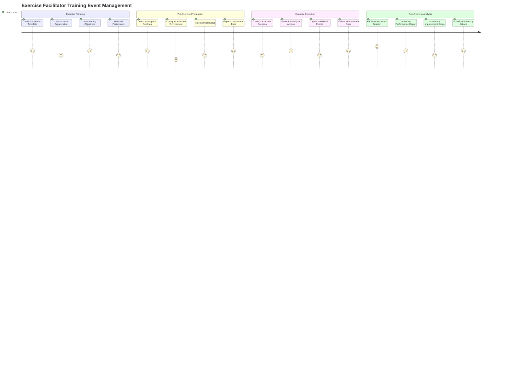
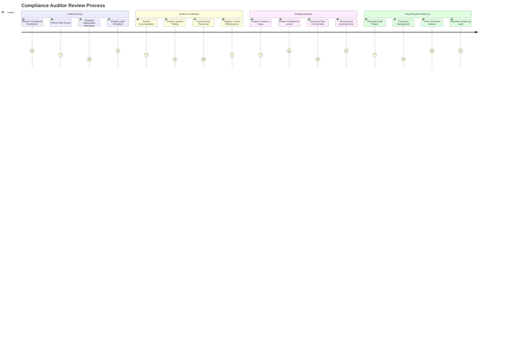
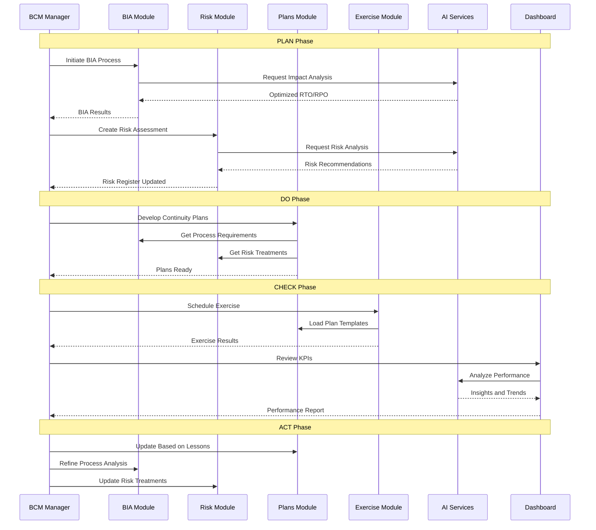
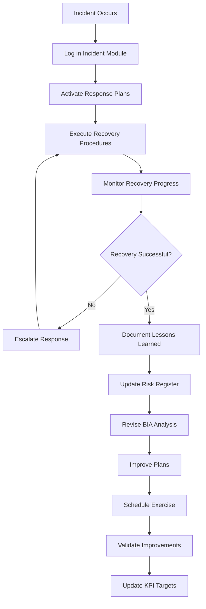

# BCM Platform User Journeys and Experience Flows

## Overview

This document provides comprehensive user journey maps and experience flows for all user types across the BCM Platform. It defines how different personas interact with the system, their pain points, and the optimal paths to achieve their goals.

## Table of Contents

1. [User Personas and Roles](#user-personas-and-roles)
2. [Core User Journeys](#core-user-journeys)
3. [Administrative Journeys](#administrative-journeys)
4. [Specialized Role Journeys](#specialized-role-journeys)
5. [Cross-Module User Flows](#cross-module-user-flows)
6. [Mobile and Responsive Considerations](#mobile-and-responsive-considerations)
7. [Accessibility and Inclusion](#accessibility-and-inclusion)

---

## User Personas and Roles

### Primary User Personas

#### 1. **BCM Manager** (Primary Decision Maker)
- **Responsibilities:** Overall BCM program management, strategic planning, compliance oversight
- **Key Goals:** Ensure business continuity, demonstrate compliance, optimize recovery capabilities
- **Pain Points:** Need for real-time visibility, complex reporting requirements, resource constraints
- **Technology Comfort:** Moderate to high, prefers intuitive interfaces

#### 2. **Risk Manager** (Risk Specialist)
- **Responsibilities:** Risk identification, assessment, treatment, monitoring
- **Key Goals:** Minimize organizational risk exposure, provide accurate risk intelligence
- **Pain Points:** Complex risk calculations, data integration challenges, stakeholder communication
- **Technology Comfort:** High, comfortable with advanced analytics tools

#### 3. **Incident Commander** (Crisis Response Leader)
- **Responsibilities:** Incident response coordination, crisis team management, communication
- **Key Goals:** Rapid incident resolution, minimal business impact, effective team coordination
- **Pain Points:** Time pressure, information overload, multi-channel communication needs
- **Technology Comfort:** Variable, needs simple but powerful tools under pressure

#### 4. **Business Analyst** (Process Expert)
- **Responsibilities:** Business impact analysis, process documentation, dependency mapping
- **Key Goals:** Accurate process analysis, efficient data collection, meaningful insights
- **Pain Points:** Complex process relationships, data quality issues, stakeholder availability
- **Technology Comfort:** Moderate, appreciates guided workflows

#### 5. **System Administrator** (Technical Manager)
- **Responsibilities:** Platform configuration, user management, system monitoring
- **Key Goals:** System reliability, security compliance, efficient operations
- **Pain Points:** Complex configurations, multiple system integration, troubleshooting
- **Technology Comfort:** Very high, prefers detailed control and monitoring

#### 6. **End User/Employee** (General Staff)
- **Responsibilities:** Following BCM procedures, participating in exercises, reporting incidents
- **Key Goals:** Understanding their role, easy access to procedures, quick incident reporting
- **Pain Points:** Information overload, complex procedures, unclear responsibilities
- **Technology Comfort:** Variable, needs simple and intuitive interfaces

---

## Core User Journeys

### 1. BCM Manager Daily Dashboard Journey

**Key Frontend Requirements:**
- Personalized dashboard with role-specific widgets
- Real-time data updates without page refresh
- One-click drill-down from high-level metrics
- Mobile-responsive design for executive briefings
- Quick action buttons for common tasks

**Critical Success Factors:**
- Dashboard loads in < 2 seconds
- All critical information visible without scrolling
- Intuitive navigation between related functions
- Automated alert prioritization and filtering

### 2. Risk Manager Risk Assessment Journey

**Key Frontend Requirements:**
- Drag-and-drop risk matrix interface
- Real-time risk calculation as data is entered
- Integration with external threat intelligence feeds
- Automated report generation with customizable templates
- Visual risk trend analysis and forecasting

### 3. Incident Commander Crisis Response Journey

**Key Frontend Requirements:**
- Mobile-first crisis dashboard design
- One-touch communication to response teams
- Real-time status updates from multiple sources
- Offline capability for critical functions
- Voice-to-text for rapid documentation

**Critical Success Factors:**
- Maximum 3 clicks to any critical function
- Automatic escalation and notification
- Integration with external communication systems
- Comprehensive audit trail for post-incident analysis

### 4. Business Analyst BIA Process Journey

**Key Frontend Requirements:**
- Interactive process mapping tools
- Guided interview questionnaires
- AI-powered dependency discovery
- Collaborative review and approval workflows
- Automated impact calculation tools

---

## Administrative Journeys

### System Administrator Platform Management Journey

**Key Frontend Requirements:**
- Comprehensive system monitoring dashboard
- Bulk user management capabilities
- Configuration validation and rollback features
- Automated health check reporting
- Integration testing tools

### Client Portal User Self-Service Journey

**Key Frontend Requirements:**
- Single sign-on integration
- Self-service knowledge base with search
- AI-powered chatbot for instant assistance
- Customizable reporting tools
- Multi-language support options

---

## Specialized Role Journeys

### Exercise Facilitator Training Event Journey

### Compliance Auditor Review Journey

---

## Cross-Module User Flows

### Complete PDCA Cycle User Flow

### Incident-to-Improvement Workflow

---

## Mobile and Responsive Considerations

### Mobile-First Crisis Response

**Key Requirements:**
- Touch-friendly interface with large buttons
- Offline capability for critical functions
- Voice input for rapid data entry
- Push notifications for alerts
- GPS integration for location tracking

**Critical User Flows:**
1. **Emergency Alert Response:** Receive → Acknowledge → Access details (< 30 seconds)
2. **Team Communication:** Select team → Send message → Confirm delivery (< 15 seconds)
3. **Status Updates:** Update status → Add notes → Notify stakeholders (< 45 seconds)

### Tablet Interface for Field Operations

**Optimized Features:**
- Large forms optimized for tablet input
- Offline data collection with sync capability
- Photo and video capture integration
- Digital signature capture
- Barcode/QR code scanning

### Desktop Power User Interface

**Advanced Features:**
- Multi-monitor support for crisis rooms
- Keyboard shortcuts for all major functions
- Advanced filtering and search capabilities
- Customizable dashboard layouts
- Export capabilities for external tools

---

## Accessibility and Inclusion

### WCAG 2.1 Compliance Features

**Visual Accessibility:**
- High contrast mode options
- Scalable text (up to 200% without scrolling)
- Screen reader compatibility
- Alternative text for all images
- Color-independent information display

**Motor Accessibility:**
- Keyboard navigation for all functions
- Adjustable timeout periods
- Large click targets (minimum 44px)
- Voice input support
- Switch device compatibility

**Cognitive Accessibility:**
- Clear and consistent navigation
- Plain language throughout interface
- Progressive disclosure of complex information
- Undo functionality for critical actions
- Help and guidance always available

### Multilingual Support

**Supported Languages:**
- English (primary)
- Spanish
- French
- German
- Portuguese
- Arabic
- Chinese (Simplified)
- Japanese

**Localization Features:**
- Right-to-left language support
- Cultural date and number formats
- Culturally appropriate icons and colors
- Local compliance framework integration

---

## User Experience Optimization

### Performance Expectations

**Response Time Targets:**
- Page loads: < 2 seconds
- Search results: < 1 second
- Dashboard updates: < 500ms
- Mobile interactions: < 300ms

### Usability Heuristics

**Nielsen's 10 Usability Principles Applied:**
1. **Visibility of System Status:** Real-time indicators throughout interface
2. **Match System and Real World:** BCM terminology and familiar workflows
3. **User Control:** Undo, redo, and cancel options always available
4. **Consistency:** Standardized interface patterns across modules
5. **Error Prevention:** Validation and confirmation for critical actions
6. **Recognition vs Recall:** Context-sensitive help and guidance
7. **Flexibility:** Customizable workflows and interface layouts
8. **Aesthetic Design:** Clean, professional interface focused on functionality
9. **Error Recovery:** Clear error messages with suggested solutions
10. **Help Documentation:** Contextual help always accessible

### User Feedback Integration

**Continuous Improvement Process:**
- In-app feedback collection
- User testing sessions
- Analytics-driven optimization
- A/B testing for key workflows
- Regular user satisfaction surveys

---

**This document provides the comprehensive foundation for understanding user experience across the BCM platform, ensuring that all user types can efficiently accomplish their goals while maintaining high satisfaction and productivity levels.**