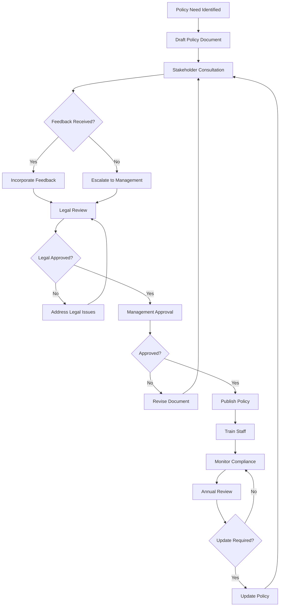
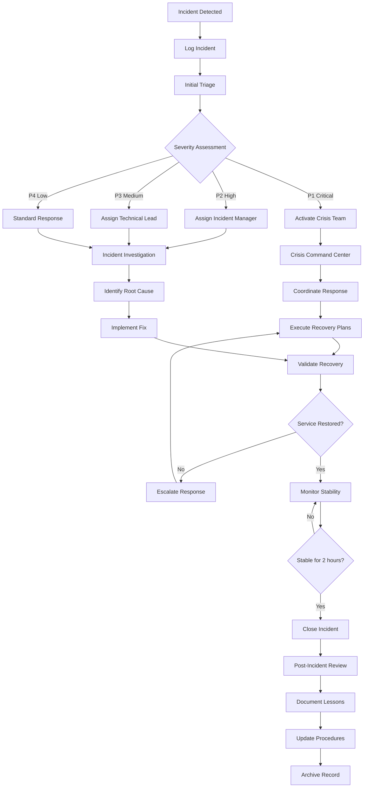
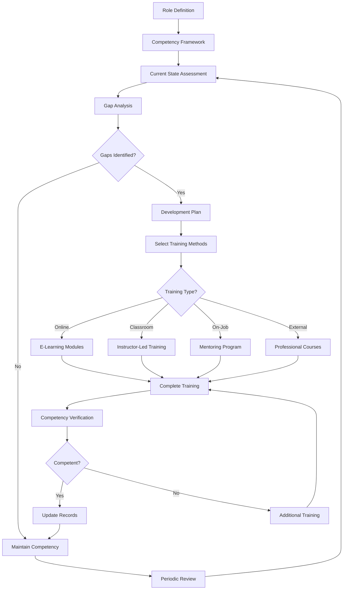
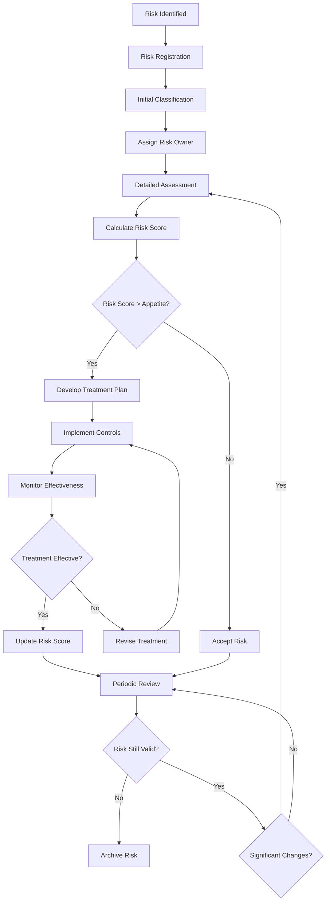
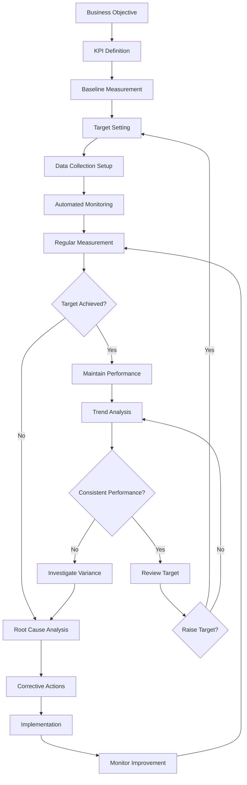
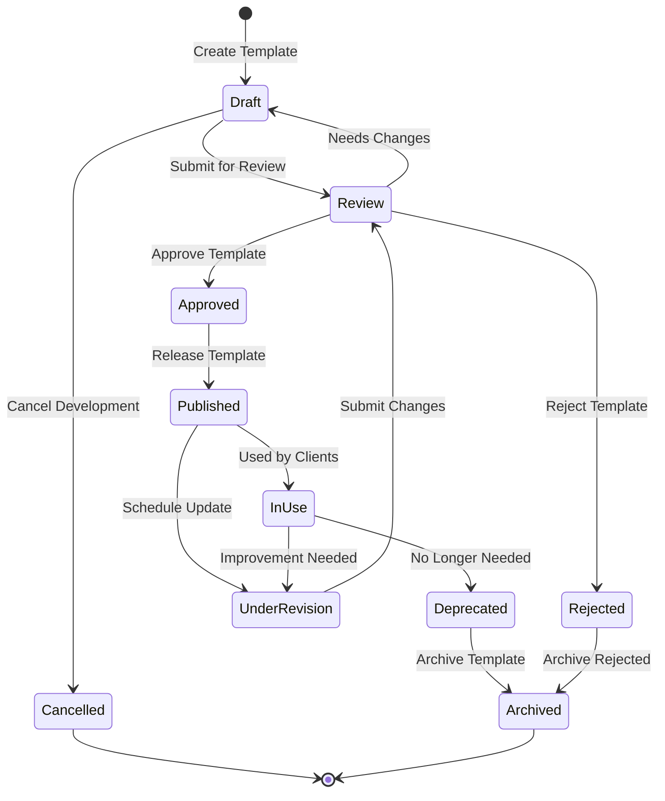
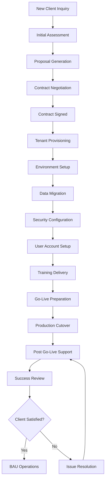
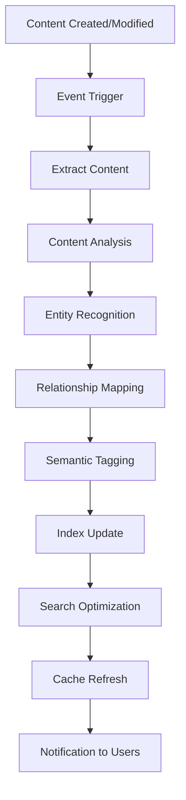

# BCM Platform Workflows and Business Processes

## Overview

This document consolidates all module workflows and business processes for the BCM Platform. It serves as the definitive reference for understanding how business logic flows through the system and how different modules interact to deliver comprehensive Business Continuity Management.

## Table of Contents

1. [Core Governance Workflows](#core-governance-workflows)
2. [Incident Management Workflows](#incident-management-workflows)
3. [Training and Exercise Workflows](#training-and-exercise-workflows)
4. [Risk Assessment Workflows](#risk-assessment-workflows)
5. [BIA and Recovery Planning](#bia-and-recovery-planning)
6. [Reporting and KPI Workflows](#reporting-and-kpi-workflows)
7. [Template and Configuration Management](#template-and-configuration-management)
8. [Multi-Tenant Client Workflows](#multi-tenant-client-workflows)
9. [Content Management and Search](#content-management-and-search)

---

## Core Governance Workflows

### Policy Management Lifecycle

The policy management workflow ensures systematic development, approval, and maintenance of BCM policies.

**Key States:**
- Draft → Review → Approved → Published → Active → Under Review → Updated

**Process Flow:**

**Frontend Implementation:**
- Policy creation forms in BCM Governance module
- Approval workflow interface
- Version control and document history
- Automated notification system for stakeholders

### BCM Committee Meeting Workflow

Structured approach to managing BCM committee meetings with proper documentation and follow-up.

**Process Components:**
- Pre-meeting preparation and agenda setting
- Meeting execution with decision tracking
- Post-meeting action item management
- Progress monitoring and reporting

**Frontend Integration:**
- Meeting scheduler and calendar integration
- Action item tracking dashboard
- Meeting minutes generation
- Progress reporting interface

---

## Incident Management Workflows

### Incident Response Lifecycle

Comprehensive incident management from detection through resolution and post-incident review.

**Critical Path:**

**State Machine:**
- New → Acknowledged → Assigned → In Progress → Escalated/Crisis Mode → Resolved → Closed
- Support for incident reopening and status tracking

**Frontend Features:**
- Real-time incident dashboard
- Automated escalation triggers
- Integration with external systems (TheHive)
- Mobile-responsive crisis management interface

### Crisis Management Activation

Special workflow for critical incidents requiring crisis team activation.

**Key Components:**
- Automatic escalation criteria
- Crisis team notification system
- Command center coordination
- Executive reporting

---

## Training and Exercise Workflows

### Competency Management Workflow

Systematic approach to identifying, developing, and maintaining BCM competencies.

**Process Flow:**

**Frontend Integration:**
- Learning Management System (LMS) integration
- Progress tracking dashboards
- Competency gap analysis reports
- Certification management

### Exercise Planning and Execution

Comprehensive exercise management from planning through post-exercise improvement.

**Exercise Types:**
- Tabletop exercises
- Walkthrough exercises
- Functional exercises
- Full-scale exercises

**Process Components:**
- Exercise planning and scenario development
- Participant preparation and briefing
- Real-time execution monitoring
- Post-exercise evaluation and improvement

---

## Risk Assessment Workflows

### Risk Management Lifecycle

Complete risk management process from identification through treatment and monitoring.

**Process Flow:**

**AI Integration:**
- Predictive risk analysis
- Automated risk scoring
- Treatment recommendation engine
- Trend analysis and forecasting

**Frontend Features:**
- Risk register management
- Heat map visualizations
- Treatment tracking dashboard
- Compliance monitoring interface

---

## BIA and Recovery Planning

### Business Impact Analysis Process

Systematic approach to understanding business process criticality and recovery requirements.

**Key Steps:**
1. Process identification and documentation
2. Impact assessment (financial, operational, regulatory)
3. Recovery time objective (RTO) setting
4. Recovery point objective (RPO) definition
5. Dependency mapping
6. Resource requirement analysis

**AI Enhancement:**
- Automated RTO/RPO optimization
- Impact calculation algorithms
- Dependency discovery
- Recovery strategy recommendations

### Plan Activation Workflow

Structured approach to business continuity plan activation and execution.

**Activation Triggers:**
- Manual activation by authorized personnel
- Automated activation based on system events
- Escalated incident response
- External threat notifications

**Process Components:**
- Authorization verification
- Team notification and mobilization
- Step-by-step execution tracking
- Recovery validation and monitoring

---

## Reporting and KPI Workflows

### KPI Management Lifecycle

Comprehensive approach to defining, monitoring, and improving key performance indicators.

**Process Flow:**

**Real-time Features:**
- Automated data collection
- Threshold monitoring and alerting
- Dashboard updates every 5 minutes
- Trend analysis and forecasting

### Automated Report Generation

Streamlined approach to creating and distributing BCM reports.

**Report Types:**
- Scheduled reports (daily, weekly, monthly)
- On-demand reports
- Event-triggered reports
- Compliance reports

**Quality Assurance:**
- Data validation checks
- Template compliance verification
- Automated distribution
- Archive management

---

## Template and Configuration Management

### Template Lifecycle Management

Systematic approach to managing document templates and organizational standards.

**State Management:**

**Frontend Integration:**
- Template library and search
- Version control and comparison
- Usage analytics and feedback
- Customization and branding tools

### Configuration Change Management

Controlled approach to system configuration changes with proper approval and rollback capabilities.

**Change Categories:**
- Low impact: Technical team approval
- High impact: Change Advisory Board approval
- Emergency: Post-implementation review required

**Process Components:**
- Impact assessment
- Approval workflow
- Implementation planning
- Validation and rollback procedures

---

## Multi-Tenant Client Workflows

### Client Onboarding Workflow

Comprehensive process for bringing new clients onto the BCM platform.

**Process Stages:**

**Security Features:**
- Complete data isolation
- Tenant-specific configurations
- Independent backup and recovery
- Compliance with data protection regulations

### Client Data Isolation

Robust multi-tenant architecture ensuring complete data separation and security.

**Security Measures:**
- Database-level tenant filtering
- API gateway tenant validation
- Encrypted data transmission
- Audit logging for all tenant access

---

## Content Management and Search

### Content Indexing Pipeline

Automated system for indexing and making BCM content searchable.

**Process Flow:**

**AI Enhancement:**
- Natural language processing
- Semantic search capabilities
- Content recommendations
- Automated tagging and categorization

**Frontend Integration:**
- Advanced search interface
- Filtered and faceted search
- Content recommendations
- Search analytics and optimization

---

## Cross-Module Integration Patterns

### Event-Driven Architecture

All workflows participate in a comprehensive event-driven architecture enabling real-time coordination and automation.

**Key Event Categories:**
- `bcm.policy.*` - Policy lifecycle events
- `bcm.incident.*` - Incident management events
- `bcm.exercise.*` - Training and exercise events
- `bcm.risk.*` - Risk assessment events
- `bcm.bia.*` - Business impact analysis events
- `bcm.plan.*` - Continuity plan events

### Workflow Orchestration

BPMN-based workflow orchestration enables complex business process automation across multiple modules.

**Integration Points:**
- Automated task assignment
- Conditional workflow branching
- External system integration
- Human task management
- Process monitoring and optimization

---

**This document serves as the comprehensive reference for all BCM platform workflows, providing both high-level understanding and detailed implementation guidance for frontend developers.**