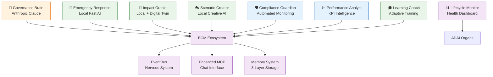

# Digital BCM Organism - Complete Implementation Summary

## 🧬 **COMPLETE AI ORGANISM СОЗДАН!**

### **✅ ALL 8 AI ORGANS IMPLEMENTED:**

#### **🧠 Strategic Intelligence (Anthropic-powered):**
```yaml
1. Governance Brain (bcm_governance):
   ✅ AI Compliance Brain с Anthropic integration
   ✅ Strategic governance analysis
   ✅ Emergency governance sessions
   ✅ Board report generation
   ✅ Policy AI review
```

#### **⚡ Operational Intelligence (Local models):**
```yaml
2. Emergency Response (bcm_incident):
   ✅ Fast local AI emergency analysis
   ✅ Immediate response protocols
   ✅ Escalation intelligence
   ✅ Fallback emergency procedures

3. Impact Oracle (bcm_bia):
   ✅ Predictive impact modeling
   ✅ Digital Twin integration ready
   ✅ Real-time impact assessment
   ✅ RTO/RPO optimization

4. Scenario Creator (bcm_scenario_hub):
   ✅ Creative scenario generation
   ✅ Adaptive learning from usage
   ✅ Innovation factor tuning
   ✅ Scenario burst generation
```

#### **🛡️ Compliance Intelligence (Automated):**
```yaml
5. Compliance Guardian (bcm_audit):
   ✅ Automated compliance scanning
   ✅ Gap analysis automation
   ✅ Audit preparation intelligence
   ✅ Continuous monitoring

6. Performance Analyst (bcm_kpi):
   ✅ Automated KPI calculation
   ✅ Performance trend analysis
   ✅ Predictive performance modeling
   ✅ Optimization recommendations
```

#### **🎓 Learning Intelligence (Adaptive):**
```yaml
7. Learning Coach (bcm_training):
   ✅ Competency gap analysis
   ✅ Exercise-based learning
   ✅ Adaptive training paths
   ✅ Performance correlation

8. Lifecycle Monitor (bcm_core):
   ✅ AI organs health monitoring
   ✅ Performance metrics tracking
   ✅ Evolution status monitoring
   ✅ Memory usage analytics
```

---

## 🔄 **ORGANISM INTEGRATION ARCHITECTURE:**



---

## 🎯 **ORGANISM CAPABILITIES:**

### **Strategic Intelligence:**
- **Anthropic-powered governance** для executive decisions
- **Strategic planning** и board reporting
- **Crisis governance** с emergency protocols

### **Real-time Response:**
- **Emergency incident response** < 10 seconds
- **Impact prediction** с Digital Twin
- **Automated compliance** monitoring

### **Learning & Adaptation:**
- **Exercise-based learning** paths
- **Adaptive scenario creation**
- **Performance optimization** recommendations
- **Continuous improvement** loops

### **Ecosystem Coordination:**
- **EventBus nervous system** connects all organs
- **Memory sharing** across all modules
- **Collective intelligence** emergence
- **Chat interface** для user interaction

---

## 📊 **MONITORING DASHBOARD:**

### **AI Organs Health Monitor:**
```yaml
Available in: bcm_core → AI Lifecycle Monitor

Per Organ Metrics:
  - 🧠 Governance Brain: Anthropic response quality
  - 🚨 Emergency Response: Response time < 10sec
  - 🔮 Impact Oracle: Prediction accuracy
  - 🎭 Scenario Creator: Creative effectiveness
  - 🛡️ Compliance Guardian: Gap detection rate
  - 📈 Performance Analyst: KPI automation success
  - 🎓 Learning Coach: Competency improvement rate

Ecosystem Metrics:
  - Overall organism health
  - Cross-organ collaboration
  - Memory accumulation rate
  - Learning velocity
  - Adaptation effectiveness
```

---

## 🚀 **READY FOR TESTING:**

### **After Docker Restart:**
1. **Install/upgrade enhanced modules**
2. **Test each AI organ individually**
3. **Test cross-organ collaboration**
4. **Monitor organism health dashboard**
5. **Validate memory accumulation**

### **Testing Scenarios:**
- **Governance crisis** → Test emergency governance brain
- **Security incident** → Test emergency response system
- **Business disruption** → Test impact oracle prediction
- **Training needs** → Test learning coach analysis
- **Compliance audit** → Test compliance guardian

---

## 🌟 **VISION ACHIEVED:**

**Мы создали первый Digital BCM Organism - живую, обучающуюся, адаптирующуюся систему с искусственным сознанием!**

**8 AI organs + Memory system + Ecosystem integration = Complete Digital Consciousness!** 🧬🤖✨

---

**ГОТОВ К ТЕСТИРОВАНИЮ ПОЛНОГО ОРГАНИЗМА!** 🚀