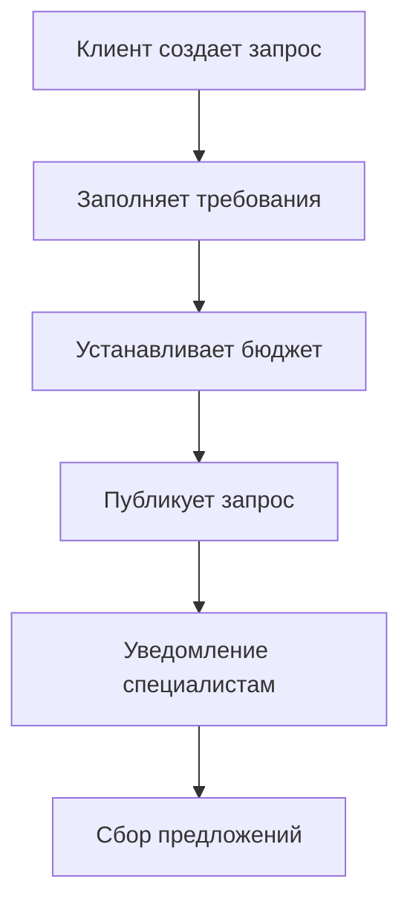
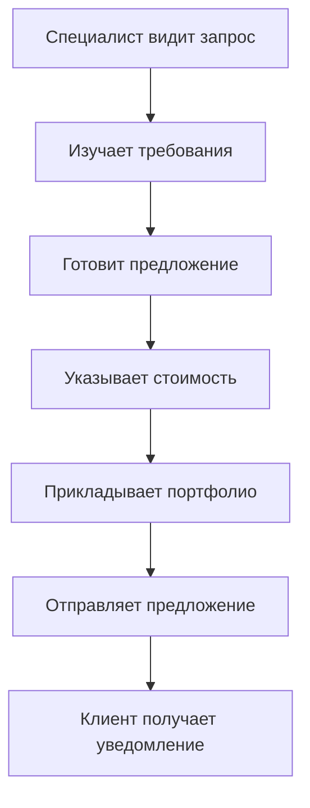
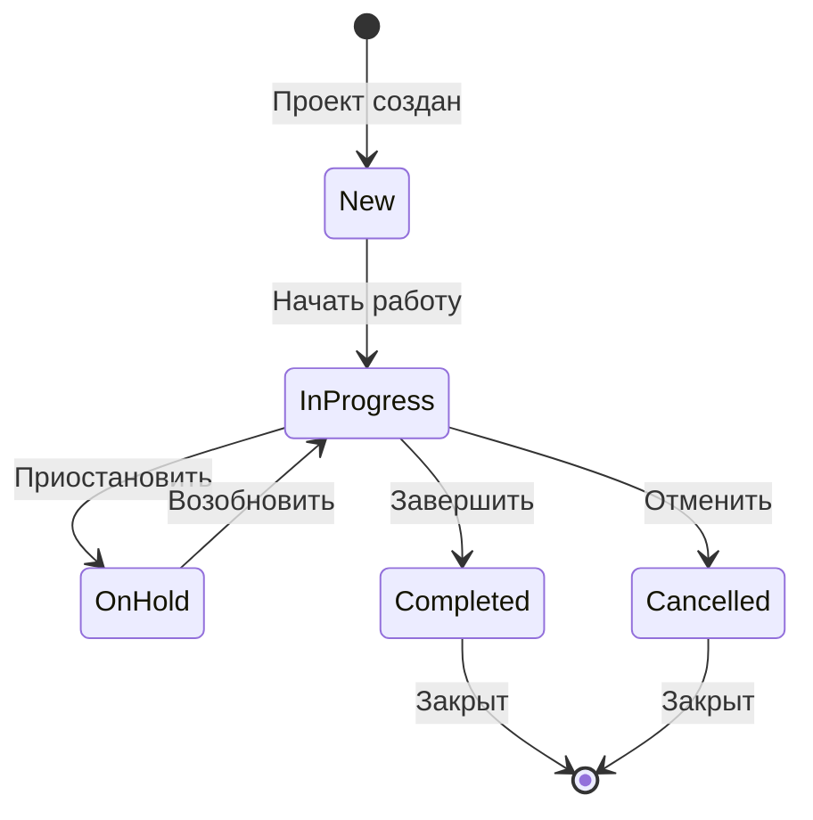

# BCM Community Marketplace - Полная документация

## 📋 Оглавление
1. [Обзор платформы](#обзор-платформы)
2. [Архитектура решения](#архитектура-решения)
3. [Модели данных](#модели-данных)
4. [Бизнес-процессы](#бизнес-процессы)
5. [API и интеграции](#api-и-интеграции)
6. [Безопасность](#безопасность)
7. [Развертывание](#развертывание)

---

## 🎯 Обзор платформы

### Концепция
BCM Community Marketplace - это профессиональная платформа, объединяющая специалистов по непрерывности бизнеса (BCM) с организациями, которым требуются их услуги. Модель работы аналогична Uber или Upwork, но специализирована исключительно для BCM-индустрии.

### Ключевые участники

#### 1. BCM Специалисты
- Независимые консультанты
- Эксперты по управлению рисками
- Тренеры и инструкторы BCM
- Аудиторы ISO 22301
- Специалисты по кризисному управлению

#### 2. Организации-клиенты
- Корпорации, нуждающиеся в BCM-экспертизе
- Государственные учреждения
- НКО и критическая инфраструктура
- Малый и средний бизнес

#### 3. Администраторы платформы
- Модераторы контента
- Медиаторы споров
- Верификаторы специалистов

### Ценностное предложение

**Для специалистов:**
- Доступ к глобальной базе клиентов
- Управление репутацией и портфолио
- Автоматизация административных задач
- Гарантии оплаты

**Для организаций:**
- Быстрый поиск квалифицированных специалистов
- Прозрачное ценообразование
- Гарантии качества
- Управление проектами

---

## 🏗️ Архитектура решения

### Технологический стек
- **Backend**: Odoo 18.0 ERP
- **Frontend**: Vue.js 3 + TypeScript
- **База данных**: PostgreSQL 15
- **Кеширование**: Redis
- **Очереди**: RabbitMQ
- **Контейнеризация**: Docker

### Модульная структура

```
bcm_community/
├── models/
│   ├── bcm_specialist.py         # Профили специалистов
│   ├── bcm_marketplace.py        # Запросы и предложения
│   ├── bcm_project_tracking.py   # Проекты и отслеживание
│   ├── forum_models.py           # Форум сообщества
│   └── knowledge_models.py       # База знаний
├── views/
│   ├── specialist_views.xml      # Интерфейсы специалистов
│   ├── marketplace_views.xml     # Маркетплейс
│   └── project_views.xml         # Управление проектами
├── security/
│   └── ir.model.access.csv       # Права доступа
└── data/
    ├── specializations.xml       # Справочник специализаций
    └── industries.xml            # Справочник индустрий
```

---

## 📊 Модели данных

### 1. bcm.specialist - Профиль специалиста

| Поле | Тип | Описание |
|------|-----|----------|
| name | Char | Полное имя специалиста |
| user_id | Many2one(res.users) | Учетная запись пользователя |
| title | Char | Профессиональное звание |
| bio | Text | Профессиональная биография |
| years_experience | Integer | Лет опыта |
| hourly_rate | Float | Почасовая ставка |
| specialization_ids | Many2many | Специализации |
| industry_ids | Many2many | Опыт в индустриях |
| certification_ids | One2many | Сертификации |
| rating | Float | Средний рейтинг |
| is_verified | Boolean | Статус верификации |
| availability_status | Selection | Доступность |
| portfolio_ids | One2many | Портфолио проектов |

### 2. bcm.service.request - Запрос на услуги

| Поле | Тип | Описание |
|------|-----|----------|
| name | Char | Название запроса |
| description | Html | Детальное описание |
| client_id | Many2one(res.partner) | Клиент |
| service_type | Selection | Тип услуги |
| urgency | Selection | Срочность |
| budget_min/max | Float | Бюджет |
| required_skills | Many2many | Требуемые навыки |
| work_location | Selection | Локация работы |
| state | Selection | Статус запроса |
| proposal_ids | One2many | Полученные предложения |

### 3. bcm.service.proposal - Предложение специалиста

| Поле | Тип | Описание |
|------|-----|----------|
| request_id | Many2one | Связанный запрос |
| specialist_id | Many2one | Специалист |
| cover_letter | Html | Сопроводительное письмо |
| proposed_approach | Text | Предлагаемый подход |
| pricing_type | Selection | Тип ценообразования |
| total_cost | Float | Общая стоимость |
| state | Selection | Статус предложения |

### 4. bcm.marketplace.project - Активный проект

| Поле | Тип | Описание |
|------|-----|----------|
| name | Char | Название проекта |
| code | Char | Код проекта |
| specialist_id | Many2one | Исполнитель |
| client_id | Many2one | Заказчик |
| start_date | Date | Дата начала |
| budget | Float | Бюджет |
| progress | Float | Прогресс (%) |
| milestone_ids | One2many | Вехи проекта |
| timesheet_ids | One2many | Учет времени |
| state | Selection | Статус проекта |

### 5. bcm.project.milestone - Веха проекта

| Поле | Тип | Описание |
|------|-----|----------|
| project_id | Many2one | Проект |
| name | Char | Название вехи |
| deadline | Date | Дедлайн |
| deliverables | Text | Результаты |
| amount | Float | Сумма оплаты |
| state | Selection | Статус |
| attachment_ids | Many2many | Приложенные файлы |

---

## 🔄 Бизнес-процессы

### 1. Процесс размещения запроса



### 2. Процесс подачи предложения



### 3. Жизненный цикл проекта



### 4. Процесс оплаты по вехам

1. **Создание вехи** - Специалист создает веху с описанием результатов
2. **Выполнение работ** - Специалист выполняет работы по вехе
3. **Подача на проверку** - Загрузка результатов и отправка клиенту
4. **Проверка клиентом** - Клиент проверяет соответствие результатов
5. **Утверждение/отклонение** - Клиент принимает решение
6. **Оплата** - При утверждении происходит оплата

---

## 🔌 API и интеграции

### REST API Endpoints

#### Специалисты
```
GET    /api/specialists           # Список специалистов
GET    /api/specialists/{id}      # Профиль специалиста
POST   /api/specialists           # Создать профиль
PUT    /api/specialists/{id}      # Обновить профиль
GET    /api/specialists/{id}/reviews  # Отзывы
```

#### Запросы на услуги
```
GET    /api/requests              # Список запросов
GET    /api/requests/{id}         # Детали запроса
POST   /api/requests              # Создать запрос
PUT    /api/requests/{id}         # Обновить запрос
POST   /api/requests/{id}/invite  # Пригласить специалиста
```

#### Предложения
```
GET    /api/proposals             # Мои предложения
POST   /api/proposals             # Подать предложение
PUT    /api/proposals/{id}        # Обновить предложение
POST   /api/proposals/{id}/accept # Принять предложение
```

#### Проекты
```
GET    /api/projects              # Мои проекты
GET    /api/projects/{id}         # Детали проекта
POST   /api/projects/{id}/milestone  # Создать веху
POST   /api/projects/{id}/timesheet  # Добавить время
```

### Webhook События

```javascript
// Новый запрос
{
  "event": "request.created",
  "data": {
    "request_id": "123",
    "service_type": "consulting",
    "skills": ["risk_assessment", "iso22301"]
  }
}

// Новое предложение
{
  "event": "proposal.submitted",
  "data": {
    "proposal_id": "456",
    "request_id": "123",
    "specialist_id": "789"
  }
}

// Веха утверждена
{
  "event": "milestone.approved",
  "data": {
    "milestone_id": "321",
    "project_id": "654",
    "amount": 5000
  }
}
```

---

## 🔐 Безопасность

### Уровни доступа

| Роль | Права доступа |
|------|---------------|
| Guest | Просмотр публичных профилей и запросов |
| Client | Создание запросов, просмотр предложений, управление проектами |
| Specialist | Создание профиля, подача предложений, выполнение проектов |
| Moderator | Модерация контента, верификация специалистов |
| Admin | Полный доступ, управление спорами, настройки системы |

### Защита данных

1. **Шифрование** - SSL/TLS для всех соединений
2. **Аутентификация** - OAuth 2.0 + JWT токены
3. **Авторизация** - RBAC (Role-Based Access Control)
4. **Валидация** - Проверка всех входных данных
5. **Аудит** - Логирование всех критических операций

### Compliance

- **GDPR** - Соответствие европейским стандартам защиты данных
- **ISO 27001** - Информационная безопасность
- **PCI DSS** - При обработке платежей

---

## 🚀 Развертывание

### Требования к инфраструктуре

| Компонент | Минимум | Рекомендуется |
|-----------|---------|---------------|
| CPU | 4 cores | 8 cores |
| RAM | 8 GB | 16 GB |
| Storage | 100 GB SSD | 500 GB SSD |
| Network | 100 Mbps | 1 Gbps |

### Docker Compose конфигурация

```yaml
services:
  odoo:
    image: odoo:18.0
    depends_on:
      - postgres
      - redis
    environment:
      - HOST=postgres
      - USER=odoo
      - PASSWORD=${ODOO_PASSWORD}
    volumes:
      - ./addons/bcm_community:/mnt/extra-addons/bcm_community
    ports:
      - "8069:8069"

  postgres:
    image: postgres:15
    environment:
      - POSTGRES_DB=bcm_marketplace
      - POSTGRES_USER=odoo
      - POSTGRES_PASSWORD=${DB_PASSWORD}
    volumes:
      - postgres_data:/var/lib/postgresql/data

  redis:
    image: redis:7-alpine
    ports:
      - "6379:6379"
```

### Переменные окружения

```bash
# .env file
ODOO_PASSWORD=secure_password_here
DB_PASSWORD=database_password_here
REDIS_URL=redis://redis:6379
SMTP_SERVER=smtp.gmail.com
SMTP_PORT=587
SMTP_USER=notifications@bcm-platform.com
SMTP_PASSWORD=smtp_password_here
STRIPE_SECRET_KEY=sk_live_...
STRIPE_PUBLIC_KEY=pk_live_...
```

### Команды установки

```bash
# Клонировать репозиторий
git clone https://github.com/SEH-foundation/ISO-22301.git
cd ISO-22301

# Запустить контейнеры
docker-compose up -d

# Установить модуль
docker-compose exec odoo python3 -m odoo \
  --addons-path=/mnt/extra-addons \
  -d bcm_platform \
  -i bcm_community \
  --stop-after-init

# Проверить логи
docker-compose logs -f odoo
```

---

## 📈 Метрики и KPI

### Для платформы
- Количество активных специалистов
- Количество размещенных запросов
- Общий объем транзакций
- Средний рейтинг специалистов
- Процент успешных проектов

### Для специалистов
- Конверсия предложений
- Средний чек проекта
- Рейтинг и отзывы
- Время отклика
- Повторные клиенты

### Для клиентов
- Время закрытия запроса
- Качество выполнения
- Экономия бюджета
- Удовлетворенность результатом

---

## 🔧 Техническая поддержка

### Контакты
- **Email**: support@bcm-marketplace.com
- **Telegram**: @bcm_marketplace_support
- **GitHub Issues**: https://github.com/SEH-foundation/ISO-22301/issues

### FAQ

**Q: Как стать верифицированным специалистом?**
A: Необходимо предоставить документы об образовании, сертификаты и пройти проверку администратором.

**Q: Какая комиссия платформы?**
A: Платформа берет 15% с каждой успешной транзакции.

**Q: Как решаются споры?**
A: Через встроенную систему медиации с участием администратора платформы.

---

*Документ обновлен: 16 сентября 2025*
*Версия: 1.0*