# 📊 BCM Portal - Группировка страниц и компонентов
*Детальная структура страниц портала с группировкой функций*

---

## 🎯 Принципы группировки страниц

### **Логика объединения функций на одной странице:**
1. **Связанные данные** - функции, работающие с одним типом данных
2. **Общий workflow** - этапы одного бизнес-процесса
3. **Одинаковая частота использования** - функции, используемые в одно время
4. **Схожая аудитория** - функции для одной роли или команды
5. **Контекстная связанность** - функции, дополняющие друг друга

---

## 📱 **СТРАНИЦА 1: Main Dashboard**
*Центральная точка входа для всех ролей*

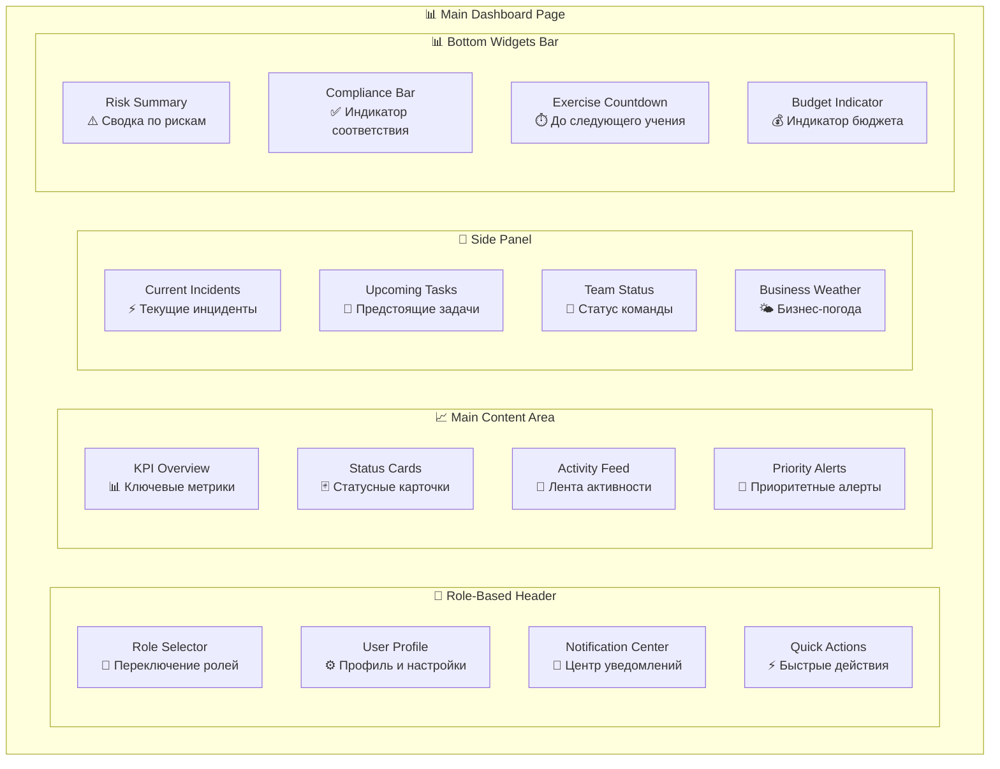

**На одной странице потому что:**
- Все пользователи начинают работу отсюда
- Нужен общий обзор состояния системы
- Быстрый доступ к критической информации
- Персонализация по ролям через виджеты

---

## 🔍 **СТРАНИЦА 2: Risk & Analysis Hub**
*Комплексный анализ рисков и воздействия*

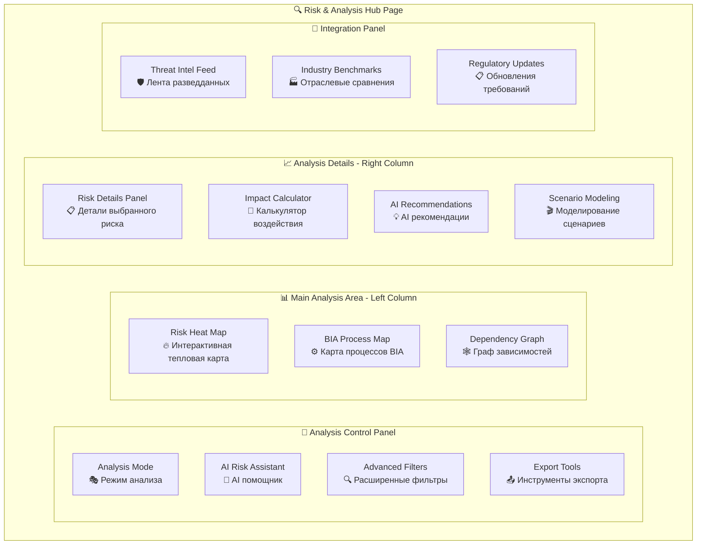

**На одной странице потому что:**
- Risk и BIA анализы взаимосвязаны
- Общие данные о процессах и зависимостях
- Единый workflow анализа "от риска к воздействию"
- AI помощник работает с обоими типами анализа

---

## 🚨 **СТРАНИЦА 3: Crisis Command Center**
*Управление кризисными ситуациями и инцидентами*

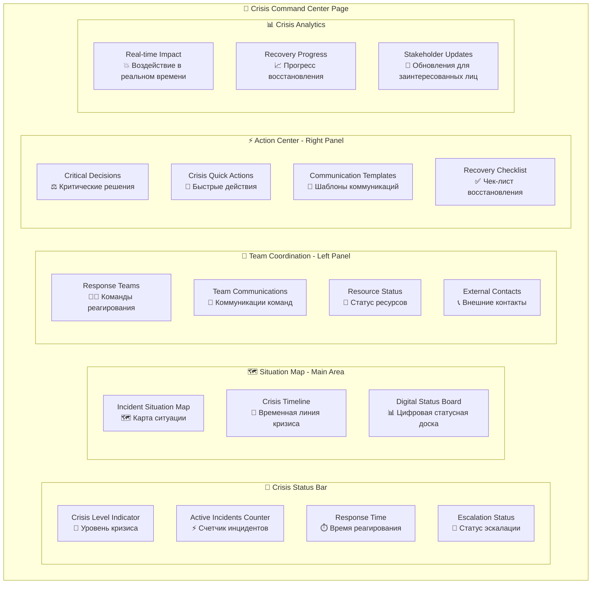

**На одной странице потому что:**
- Кризисное управление требует единого центра координации
- Все критические функции должны быть доступны одновременно
- Real-time collaboration между всеми участниками
- Минимизация переходов между экранами в критической ситуации

---

## 📋 **СТРАНИЦА 4: Plans & Procedures Workspace**
*Управление планами непрерывности и процедурами*

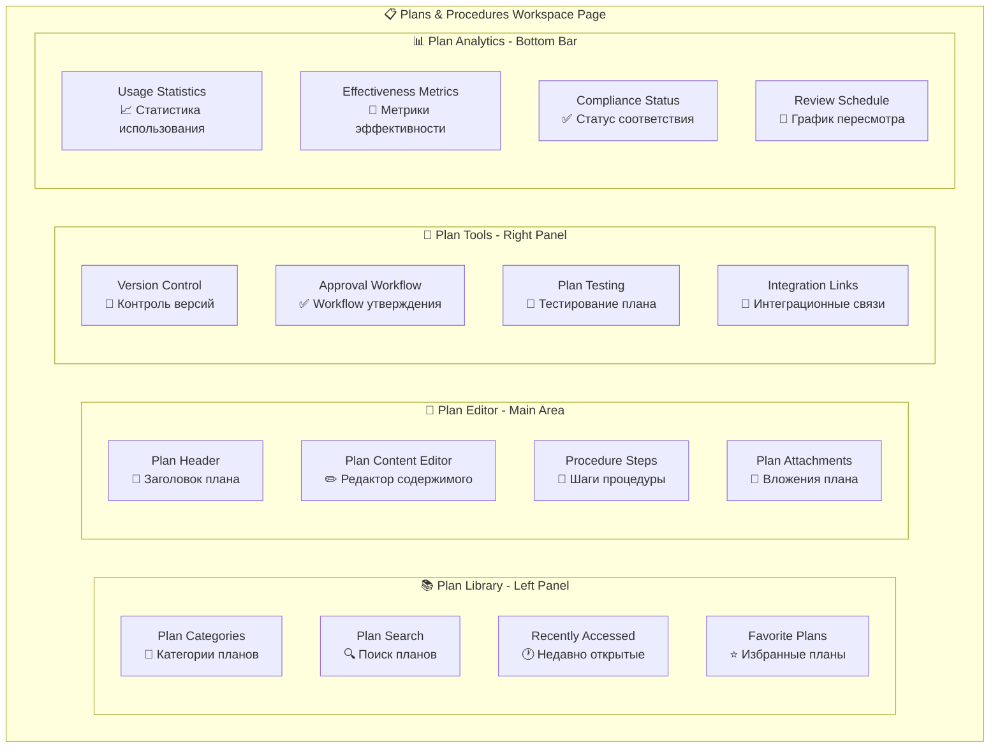

**На одной странице потому что:**
- Plans и procedures тесно связаны
- Единый workflow создания/редактирования/утверждения
- Нужен доступ к библиотеке и инструментам одновременно
- Версионирование и тестирование - часть одного процесса

---

## 🎓 **СТРАНИЦА 5: Training & Exercise Hub**
*Обучение, учения и развитие компетенций*

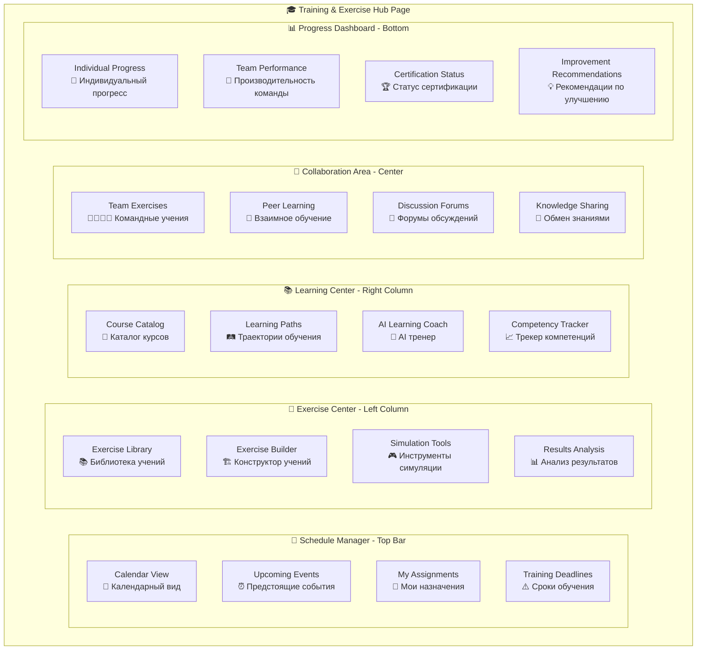

**На одной странице потому что:**
- Training и exercises - единый цикл развития компетенций
- Календарь нужен и для обучения, и для учений
- AI coach работает с обеими активностями
- Результаты учений влияют на потребности в обучении

---

## 📊 **СТРАНИЦА 6: Analytics & Reporting Suite**
*Аналитика, отчетность и бизнес-аналитика*

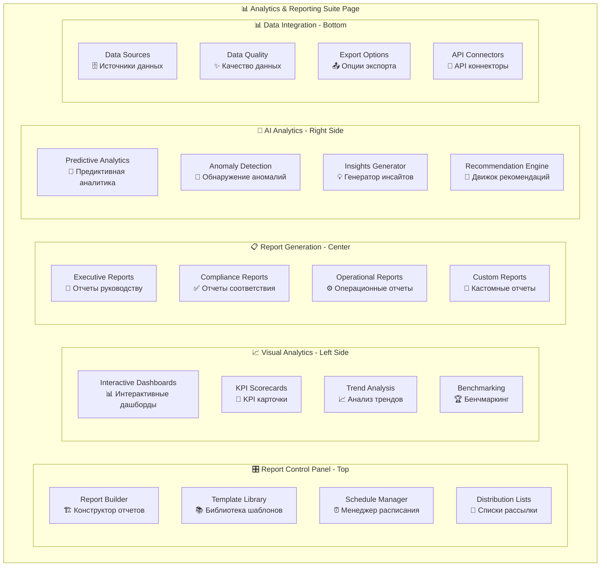

**На одной странице потому что:**
- Analytics и reporting - единый workflow от данных к инсайтам
- Визуализация и генерация отчетов используют одни данные
- AI analytics дополняет традиционную отчетность
- Нужен единый контроль качества данных и экспорта

---

## 👥 **СТРАНИЦА 7: Collaboration & Knowledge Portal**
*Сотрудничество, база знаний и сообщество*

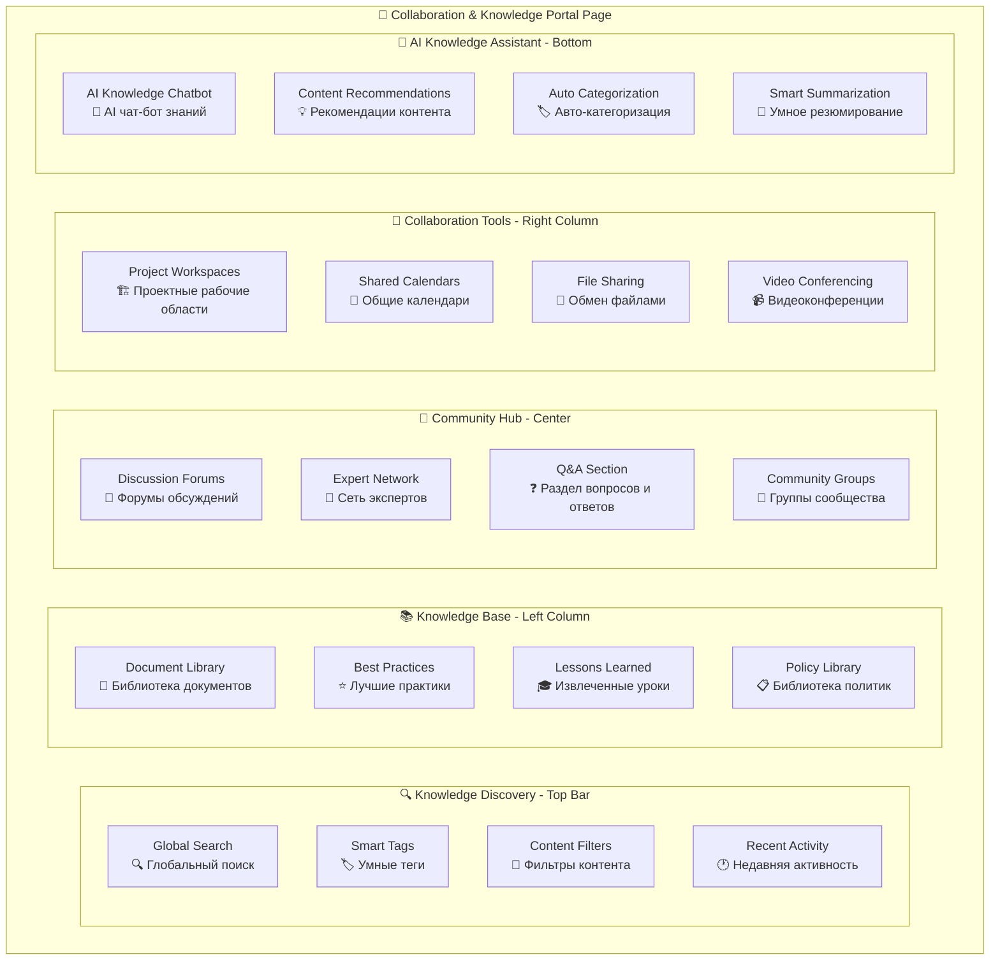

**На одной странице потому что:**
- Knowledge sharing и collaboration - взаимосвязанные процессы
- Поиск работает по всем типам контента
- Community discussions дополняют knowledge base
- AI assistant помогает с поиском и рекомендациями по всему контенту

---

## ⚙️ **СТРАНИЦА 8: System Administration Center**
*Администрирование системы и управление конфигурацией*

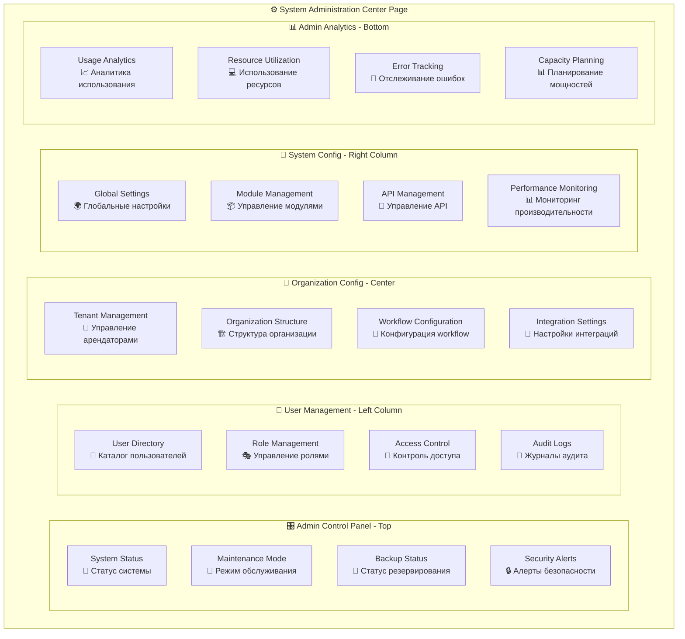

**На одной странице потому что:**
- Все административные функции требуют высоких привилегий
- System monitoring и configuration взаимосвязаны
- User management и security settings работают вместе
- Admin analytics нужна для всех административных решений

---

## 📱 **МОБИЛЬНЫЕ СТРАНИЦЫ**

### 📱 **Mobile Page 1: Emergency Dashboard**
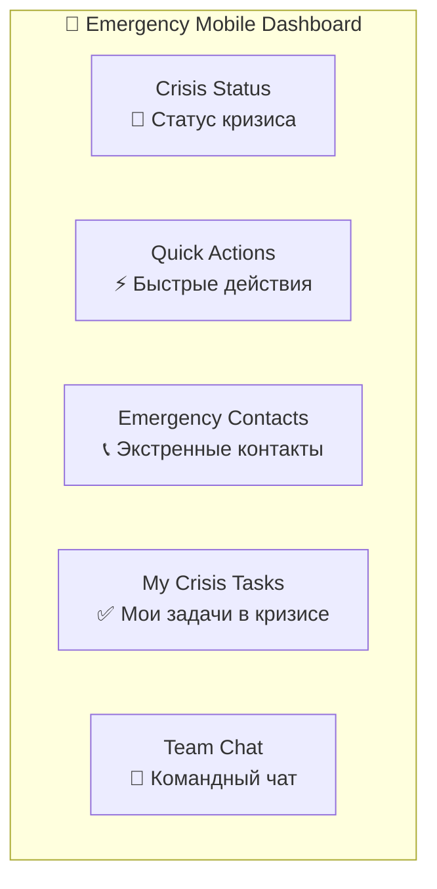

### 📱 **Mobile Page 2: Daily BCM Companion**
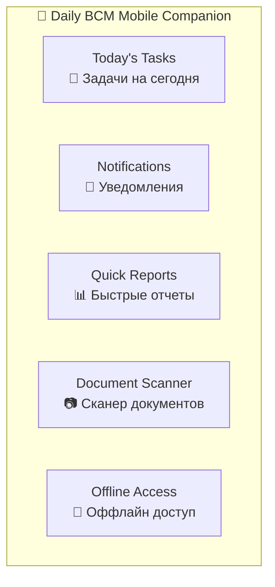

---

## 🔄 **Логика навигации между страницами**

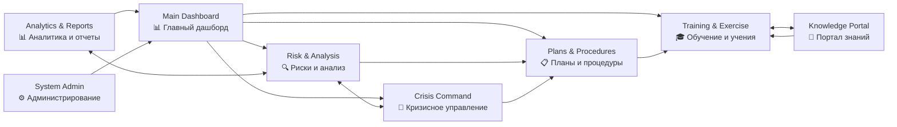

---

## 🎯 **Преимущества такой группировки:**

### ✅ **Снижение когнитивной нагрузки**
- Связанные функции на одной странице
- Минимум переходов между экранами
- Контекстная группировка информации

### ✅ **Повышение эффективности**
- Быстрый доступ к связанным данным
- Унифицированные инструменты для схожих задач
- Оптимизированные workflow

### ✅ **Улучшение пользовательского опыта**
- Интуитивная логика группировки
- Персонализация по ролям
- Адаптивный интерфейс

### ✅ **Техническая оптимизация**
- Меньше API вызовов
- Общие компоненты и данные
- Лучшая производительность

**Такая структура обеспечивает оптимальный баланс между функциональностью и простотой использования!** 🚀