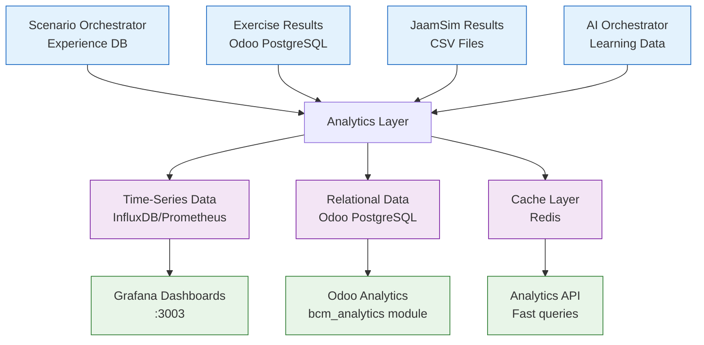
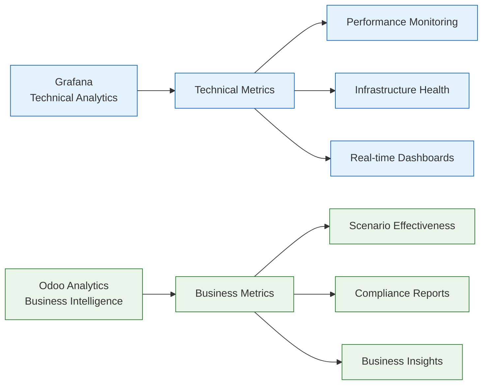

# ЭТАП 5: Intelligence & Analytics - Architecture Strategy

## 🎯 Архитектурные вопросы и решения

### **ВОПРОС 1: Где хранить аналитику?**

#### **РЕКОМЕНДАЦИЯ: Гибридный подход** ⭐



#### **Архитектура хранения:**
```yaml
Time-Series Data (Prometheus/InfluxDB):
  - Exercise performance metrics over time
  - Simulation resource utilization
  - Response time trends
  - System performance data
  - Real-time monitoring data

Relational Data (Odoo PostgreSQL):
  - Exercise results и outcomes
  - Scenario effectiveness scores
  - Participant feedback
  - Learning insights и recommendations
  - Knowledge base articles

Cache Layer (Redis):
  - Aggregated analytics для fast queries
  - Real-time dashboard data
  - Frequently accessed insights
  - Session-based analytics
```

---

### **ВОПРОС 2: Grafana vs Odoo для analytics?**

#### **ОТВЕТ: ОБА! Каждый для своих задач** 🎯

```yaml
Grafana (External Analytics):
  ✅ Real-time performance monitoring
  ✅ Time-series charts и trends
  ✅ System health dashboards
  ✅ Infrastructure metrics
  ✅ Alerting и notifications

Odoo Analytics (Business Analytics):
  ✅ Exercise outcomes analysis
  ✅ Scenario effectiveness reports
  ✅ Business intelligence dashboards
  ✅ Compliance reporting
  ✅ User-friendly business reports
```

#### **Division of Responsibility:**


---

### **ВОПРОС 3: Knowledge Base - модуль Odoo?**

#### **ОТВЕТ: ДА! bcm_knowledge Odoo модуль** ✅

```yaml
Advantages Odoo Module:
  ✅ Native integration с bcm_scenario_hub
  ✅ User permissions и multi-tenancy
  ✅ Search integration
  ✅ Mail.thread для collaboration
  ✅ Workflow integration для approval
  ✅ Portal access для external users

Features:
  - Knowledge articles automatically generated from exercises
  - Best practices extracted from successful scenarios
  - Community-driven content creation
  - AI-powered content suggestions
  - Version control и approval workflows
```

---

## 🏗️ **ЭТАП 5: Конкретная реализация**

### **КОМПОНЕНТ 1: Analytics Storage (Hybrid)**

#### **1.1: Time-Series (Prometheus + Grafana)**
```yaml
Location: /monitoring/ (уже есть)
Technology: Prometheus + Grafana + InfluxDB
Purpose: Real-time performance metrics

Data Types:
  - exercise_duration_seconds
  - simulation_cpu_usage_percent
  - participant_response_time_seconds
  - scenario_generation_latency_ms
  - workflow_completion_rate

Grafana Dashboards:
  - BCM Platform Performance
  - Exercise Execution Metrics
  - Simulation Engine Performance
  - AI Service Performance
```

#### **1.2: Business Analytics (Odoo)**
```yaml
Location: /core/odoo-18.0/addons/bcm_analytics/ (NEW MODULE)
Technology: Odoo reporting + PostgreSQL
Purpose: Business intelligence и compliance reporting

Models:
  - bcm.analytics.exercise - Exercise analytics
  - bcm.analytics.scenario - Scenario effectiveness
  - bcm.analytics.dashboard - Custom dashboards
  - bcm.analytics.report - Scheduled reports
```

### **КОМПОНЕНТ 2: Enhanced Grafana Setup**

#### **2.1: BCM-specific Grafana Configuration**
```yaml
File: /monitoring/grafana/dashboards/bcm_exercise_analytics.json

Dashboard Panels:
  - Exercise Success Rate over time
  - Average Exercise Duration by type
  - Participant Engagement metrics
  - Simulation Performance metrics
  - AI Generation success rate
  - Most effective scenarios ranking

Data Sources:
  - Prometheus: Time-series metrics
  - PostgreSQL: Business data queries
  - Redis: Cached aggregations
```

#### **2.2: Custom Metrics Collection**
```python
# ADD to services: Prometheus metrics export

from prometheus_client import Counter, Histogram, Gauge

# Exercise metrics
exercise_counter = Counter('bcm_exercises_total', 'Total exercises run')
exercise_duration = Histogram('bcm_exercise_duration_seconds', 'Exercise duration')
scenario_effectiveness = Gauge('bcm_scenario_effectiveness', 'Scenario effectiveness score')

# AI metrics
ai_generation_counter = Counter('bcm_ai_scenarios_generated', 'AI scenarios generated')
ai_generation_latency = Histogram('bcm_ai_generation_seconds', 'AI generation time')

# Simulation metrics
simulation_events = Counter('bcm_simulation_events_processed', 'Simulation events processed')
simulation_utilization = Gauge('bcm_simulation_resource_utilization', 'Resource utilization %')
```

### **КОМПОНЕНТ 3: bcm_knowledge Odoo Module**

#### **3.1: Knowledge Base Models**
```python
# NEW MODULE: /core/odoo-18.0/addons/bcm_knowledge/

class BCMKnowledgeArticle(models.Model):
    _name = 'bcm.knowledge.article'
    _description = 'BCM Knowledge Base Article'
    _inherit = ['mail.thread', 'mail.activity.mixin', 'website.published.mixin']

    title = fields.Char('Article Title', required=True)
    content = fields.Html('Article Content')
    category = fields.Selection([
        ('best_practice', 'Best Practice'),
        ('lesson_learned', 'Lesson Learned'),
        ('procedure', 'Procedure'),
        ('case_study', 'Case Study'),
        ('template', 'Template Guide')
    ])

    # AI Generation
    is_ai_generated = fields.Boolean('AI Generated')
    source_exercise_id = fields.Many2one('bcm.exercise', 'Source Exercise')
    source_scenario_id = fields.Many2one('bcm.scenario', 'Source Scenario')

    # Effectiveness
    usefulness_score = fields.Float('Usefulness Score', compute='_compute_usefulness')
    view_count = fields.Integer('View Count')
    bookmark_count = fields.Integer('Bookmark Count')

    # Tags и categorization
    tag_ids = fields.Many2many('bcm.knowledge.tag', 'Knowledge Tags')
    iso_clause_ids = fields.Many2many('bcm.iso.clause', 'Related ISO Clauses')

    def action_generate_from_exercise(self, exercise_id):
        """Generate knowledge article from exercise results"""
        # Get exercise data и results
        # Query AI для content generation
        # Create structured article
```

---

## 🎯 **РЕКОМЕНДУЕМАЯ АРХИТЕКТУРА ЭТАП 5:**

### **1. Analytics Storage** 📊
```yaml
HYBRID APPROACH:
  - Grafana + Prometheus: Real-time performance metrics
  - Odoo bcm_analytics: Business intelligence reports
  - Redis: Fast cached queries
  - Scenario Orchestrator: Experience accumulation
```

### **2. Analytics Visualization** 📈
```yaml
DUAL APPROACH:
  - Grafana: Technical dashboards (existing :3003)
  - Odoo: Business analytics module (NEW)
  - API layer: Custom analytics endpoints
```

### **3. Knowledge Base** 📚
```yaml
ODOO MODULE:
  - bcm_knowledge module (NEW)
  - AI-generated articles from exercise results
  - Community collaboration
  - Website integration для portal access
```

### **🔄 Data Flow Architecture:**
```
Exercise Results → Scenario Orchestrator (Experience) → Analytics Layer → Visualization
                                    ↓                        ↓              ↓
                           AI Learning Database        Grafana + Odoo    Knowledge Base
```

**Такой подход тебе подходит?** Hybrid storage + dual visualization + Odoo knowledge module? 🤔

Или хочешь изменить что-то в архитектуре? 🏗️