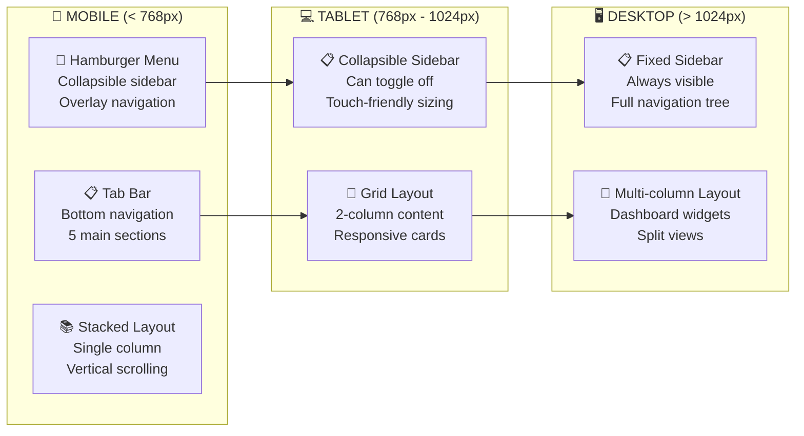

# 🎨 BCM PLATFORM - UI/UX НАВИГАЦИЯ И ДИЗАЙН СИСТЕМА

## 🗺️ ГЛОБАЛЬНАЯ НАВИГАЦИОННАЯ СТРУКТУРА

### 📱 Основная компоновка приложения
```
┌─────────────────────────────────────────────────────────┐
│  🎨 APP HEADER (фиксированный)                         │
│  ├── 🏠 Logo + Title                                   │
│  ├── 🔍 Global Search                                  │
│  ├── 🚨 Notifications (badge)                          │
│  ├── 🌐 Language Selector                              │
│  └── 👤 User Menu (avatar + dropdown)                  │
├─────────────────────────────────────────────────────────┤
│ 📱 MAIN LAYOUT                                         │
│ ┌─────────────┬─────────────────────────────────────┐   │
│ │ 📋 SIDEBAR │ 📊 MAIN CONTENT AREA                │   │
│ │ (collapsible│                                     │   │
│ │             │ ┌─────────────────────────────────┐ │   │
│ │ 🏠 Dashboard │ │ 📄 PAGE HEADER                  │ │   │
│ │             │ │ ├── 📝 Breadcrumbs             │ │   │
│ │ 📊 Modules: │ │ ├── 🎯 Page Title              │ │   │
│ │ ├──🧠 Core  │ │ └── ⚙️ Page Actions            │ │   │
│ │ ├──🌐 Portal │ ├─────────────────────────────────┤ │   │
│ │ ├──🏢 Context│ │ 📊 DYNAMIC CONTENT              │ │   │
│ │ ├──📊 BIA   │ │ ├── 📋 Tables/Lists             │ │   │
│ │ ├──📋 Plans │ │ ├── 📄 Forms                    │ │   │
│ │ ├──🚨 Incident│ ├── 📊 Dashboards               │ │   │
│ │ └──⚙️ Settings│ └── 🎨 Custom Components        │ │   │
│ │             │                                     │   │
│ │ 🤖 AI Tools │                                     │   │
│ │ 👥 Community│                                     │   │
│ │ 📈 Analytics│                                     │   │
│ └─────────────┘                                     │   │
└─────────────────────────────────────────────────────────┘
│  🦶 FOOTER (minimal)                                   │
│  ├── © BCM Platform 2025                              │
│  ├── 📞 Support                                       │
│  └── 📄 Legal                                         │
└─────────────────────────────────────────────────────────┘
```

### 🧭 Иерархия навигации по уровням

```mermaid
graph TD
    subgraph "🏠 LEVEL 1 - MAIN SECTIONS"
        DASH[📊 Dashboard<br/>Главная панель]
        MODULES[📋 BCM Modules<br/>Основные модули]
        AI[🤖 AI Tools<br/>ИИ инструменты]
        ANALYTICS[📈 Analytics<br/>Аналитика]
        ADMIN[⚙️ Administration<br/>Администрирование]
    end

    subgraph "📋 LEVEL 2 - BCM MODULES (25+)"
        CORE[🧠 BCM Core<br/>Ядро системы]
        PORTAL[🌐 BCM Portal<br/>Главный портал]
        CONTEXT[🏢 Context<br/>Контекст организации]
        CONFIG[⚙️ Configuration<br/>Конфигурация]
        BIA[📊 BIA<br/>Анализ воздействия]
        PLANS[📋 Plans<br/>Планы восстановления]
        INCIDENT[🚨 Incidents<br/>Управление инцидентами]
        RISK[⚠️ Risk Management<br/>Управление рисками]
        TRAIN[🎓 Training<br/>Обучение]
        EXERCISE[🏃 Exercises<br/>Учения]
        SCENARIO[🎭 Scenario Hub<br/>Центр сценариев]
        KPI[📊 KPI<br/>Показатели]
        REPORT[📈 Reporting<br/>Отчетность]
        AUDIT[🔍 Audit<br/>Аудит]
        CLIENTS[👥 Clients<br/>Клиенты]
        COMMUNITY[👥 Community<br/>Сообщество]
        TEMPLATES[📄 Templates<br/>Шаблоны]
        GOVERNANCE[🏛️ Governance<br/>Управление]
    end

    subgraph "📄 LEVEL 3 - MODULE PAGES"
        LIST[📋 List View<br/>Списки записей]
        FORM[📝 Form View<br/>Формы создания/редактирования]
        DETAIL[📄 Detail View<br/>Детальный просмотр]
        DASHBOARD_SUB[📊 Module Dashboard<br/>Дашборд модуля]
        SETTINGS_SUB[⚙️ Module Settings<br/>Настройки модуля]
    end

    DASH --> MODULES
    MODULES --> CORE
    MODULES --> PORTAL
    MODULES --> CONTEXT
    MODULES --> CONFIG
    MODULES --> BIA
    MODULES --> PLANS
    MODULES --> INCIDENT
    MODULES --> RISK
    MODULES --> TRAIN
    MODULES --> EXERCISE
    MODULES --> SCENARIO
    MODULES --> KPI
    MODULES --> REPORT
    MODULES --> AUDIT
    MODULES --> CLIENTS
    MODULES --> COMMUNITY
    MODULES --> TEMPLATES
    MODULES --> GOVERNANCE

    CORE --> LIST
    CORE --> FORM
    CORE --> DETAIL
    CORE --> DASHBOARD_SUB
    CORE --> SETTINGS_SUB
```



---

## 📋 СТРУКТУРА БОКОВОГО МЕНЮ

### 🎯 Главное меню (Приоритизированное)

```
📱 BCM PLATFORM
├── 🏠 Dashboard                           # Всегда первым
│   ├── 📊 Executive Overview
│   ├── 🚨 Active Incidents
│   ├── 📋 Recent Activities
│   └── 📈 Key Metrics
│
├── 🧠 CORE MODULES (Phase 1)             # Основные модули
│   ├── 🧠 BCM Core                       # Ядро системы
│   │   ├── 📋 Plans Management
│   │   ├── 🚨 Incidents
│   │   ├── 🏢 Business Processes
│   │   └── 🏷️ Tags & Categories
│   ├── ⚙️ Configuration                  # Конфигурация
│   │   ├── 🏢 System Settings
│   │   ├── 👥 User Preferences
│   │   ├── 🔗 Service Integrations
│   │   └── 🤖 AI Configuration
│   └── 🏢 Organization Context           # Контекст
│       ├── 🏢 Company Profile
│       ├── 🏗️ Business Units
│       ├── 👥 Stakeholders
│       └── 📜 Regulatory Requirements
│
├── 📊 BUSINESS MODULES (Phase 2)         # Бизнес-модули
│   ├── 📊 Business Impact Analysis
│   │   ├── 🧮 BIA Calculator
│   │   ├── 💰 Financial Impact
│   │   ├── ⏱️ RTO/RPO Targets
│   │   └── 🔗 Dependencies Mapping
│   ├── 📋 Recovery Plans
│   │   ├── 📄 Plan Library
│   │   ├── 📝 Plan Templates
│   │   ├── 🔄 Version Control
│   │   └── ✅ Plan Validation
│   ├── 🚨 Incident Management
│   │   ├── 🆕 Create Incident
│   │   ├── 📋 Active Incidents
│   │   ├── 📊 Incident Analytics
│   │   └── 📈 Response Metrics
│   └── ⚠️ Risk Management
│       ├── 🎯 Risk Register
│       ├── 📊 Risk Assessment
│       ├── 🛡️ Mitigation Plans
│       └── 📈 Risk Analytics
│
├── 🎓 OPERATIONS (Phase 3)               # Операционные
│   ├── 🎓 Training & Awareness
│   │   ├── 📚 Learning Materials
│   │   ├── 🎯 Training Programs
│   │   ├── 📊 Progress Tracking
│   │   └── 🏆 Certifications
│   ├── 🏃 Exercises & Testing
│   │   ├── 🎭 Exercise Scenarios
│   │   ├── 📅 Exercise Calendar
│   │   ├── 📊 Results Analysis
│   │   └── 📋 Lessons Learned
│   ├── 📄 Templates & Documents
│   │   ├── 📝 Document Library
│   │   ├── 📋 Template Gallery
│   │   ├── 🔄 Version Management
│   │   └── 📤 Export/Import
│   └── 👥 Client Management
│       ├── 🏢 Client Profiles
│       ├── 📊 Client Dashboard
│       ├── 📋 Service Agreements
│       └── 📈 Performance Reports
│
├── 📈 ANALYTICS & REPORTING             # Аналитика
│   ├── 📊 KPI Dashboard
│   │   ├── 🎯 Performance Metrics
│   │   ├── 📈 Trend Analysis
│   │   ├── 🚨 Alert Thresholds
│   │   └── 📊 Custom KPIs
│   ├── 📈 Business Intelligence
│   │   ├── 📊 Executive Reports
│   │   ├── 📋 Operational Reports
│   │   ├── 📈 Compliance Reports
│   │   └── 🎯 Custom Analytics
│   ├── 🔍 Audit & Compliance
│   │   ├── ✅ ISO 22301 Assessment
│   │   ├── 📋 Audit Checklist
│   │   ├── 📊 Compliance Score
│   │   └── 📈 Gap Analysis
│   └── 🏛️ Governance
│       ├── 📋 Policy Management
│       ├── 👥 Committee Structure
│       ├── 📊 Governance Dashboard
│       └── 📈 Maturity Assessment
│
├── 🤖 AI TOOLS                          # ИИ инструменты
│   ├── 🧠 AI Assistant
│   │   ├── 💬 Chat Interface
│   │   ├── 🎯 Smart Recommendations
│   │   ├── 📊 Predictive Analytics
│   │   └── 🔮 Scenario Modeling
│   ├── 🎭 Scenario Hub
│   │   ├── 🎪 Scenario Marketplace
│   │   ├── 🎨 Scenario Builder
│   │   ├── 🤖 AI-Generated Scenarios
│   │   └── 📊 Scenario Analytics
│   └── 📄 Document Intelligence
│       ├── 📤 Document Upload
│       ├── 🔍 Smart Search
│       ├── 📊 Content Analysis
│       └── 💡 Auto-Suggestions
│
├── 👥 COMMUNITY                         # Сообщество
│   ├── 💬 Discussion Forum
│   │   ├── 📋 Topic Categories
│   │   ├── 🔥 Hot Discussions
│   │   ├── ⭐ Expert Answers
│   │   └── 🏆 User Reputation
│   ├── 📚 Knowledge Base
│   │   ├── 📄 Articles Library
│   │   ├── 🔍 Smart Search
│   │   ├── ⭐ User Ratings
│   │   └── 💡 Suggestions
│   └── 🎓 Learning Hub
│       ├── 📚 Training Materials
│       ├── 🎥 Video Tutorials
│       ├── 📊 Progress Tracking
│       └── 🏆 Achievements
│
└── ⚙️ ADMINISTRATION                    # Администрирование
    ├── 👥 User Management
    │   ├── 👤 Users & Roles
    │   ├── 🏢 Company Management
    │   ├── 🔐 Permissions Matrix
    │   └── 📊 Activity Monitoring
    ├── 🔧 System Settings
    │   ├── 🌐 Global Configuration
    │   ├── 🔗 API Management
    │   ├── 🤖 AI Services Health
    │   └── 📊 System Monitoring
    ├── 💾 Data Management
    │   ├── 📤 Import/Export
    │   ├── 💾 Backup & Restore
    │   ├── 🔄 Data Migration
    │   └── 📊 Storage Analytics
    └── 🔒 Security & Audit
        ├── 🔐 Security Policies
        ├── 📝 Audit Logs
        ├── 🚨 Security Alerts
        └── 📊 Access Reports
```

---

## 🎨 ВИЗУАЛЬНАЯ ИЕРАРХИЯ И ГРУППИРОВКА

### 🎯 Цветовая схема меню

```css
/* 🎨 BCM Platform Color System */
:root {
  /* Главные цвета */
  --bcm-primary: #2563eb;      /* Синий - основной */
  --bcm-secondary: #7c3aed;    /* Фиолетовый - вторичный */
  --bcm-accent: #f59e0b;       /* Оранжевый - акцент */

  /* Статусные цвета */
  --bcm-success: #10b981;      /* Зеленый - успех */
  --bcm-warning: #f59e0b;      /* Оранжевый - предупреждение */
  --bcm-danger: #ef4444;       /* Красный - опасность */
  --bcm-info: #06b6d4;         /* Голубой - информация */

  /* Серые тона */
  --bcm-gray-50: #f9fafb;
  --bcm-gray-100: #f3f4f6;
  --bcm-gray-200: #e5e7eb;
  --bcm-gray-300: #d1d5db;
  --bcm-gray-600: #4b5563;
  --bcm-gray-800: #1f2937;
  --bcm-gray-900: #111827;
}

/* 📱 Menu Item Categories */
.menu-item {
  /* 🏠 Dashboard */
  &.dashboard { color: var(--bcm-primary); }

  /* 🧠 Core Modules - Синие тона */
  &.core-module { color: var(--bcm-primary); }

  /* 📊 Business Modules - Зеленые тона */
  &.business-module { color: var(--bcm-success); }

  /* 🎓 Operations - Фиолетовые тона */
  &.operations-module { color: var(--bcm-secondary); }

  /* 📈 Analytics - Голубые тона */
  &.analytics-module { color: var(--bcm-info); }

  /* 🤖 AI Tools - Оранжевые тона */
  &.ai-module { color: var(--bcm-accent); }

  /* 👥 Community - Теплые тона */
  &.community-module { color: #f97316; }

  /* ⚙️ Admin - Серые тона */
  &.admin-module { color: var(--bcm-gray-600); }
}
```

### 📐 Spacing и Typography

```css
/* 📏 Spacing System */
.sidebar {
  --space-xs: 0.25rem;   /* 4px */
  --space-sm: 0.5rem;    /* 8px */
  --space-md: 1rem;      /* 16px */
  --space-lg: 1.5rem;    /* 24px */
  --space-xl: 2rem;      /* 32px */

  /* Menu Structure */
  .menu-section {
    margin-bottom: var(--space-lg);

    .section-title {
      font-size: 0.75rem;
      font-weight: 600;
      text-transform: uppercase;
      letter-spacing: 0.05em;
      color: var(--bcm-gray-600);
      margin-bottom: var(--space-sm);
      padding: 0 var(--space-md);
    }
  }

  .menu-item {
    padding: var(--space-sm) var(--space-md);
    border-radius: 0.375rem;
    margin: 0 var(--space-xs);

    &.level-1 { font-weight: 600; }
    &.level-2 {
      font-weight: 500;
      margin-left: var(--space-lg);
    }
    &.level-3 {
      font-weight: 400;
      margin-left: var(--space-xl);
      font-size: 0.875rem;
    }

    /* Active state */
    &.active {
      background: var(--bcm-primary);
      color: white;
    }

    /* Hover state */
    &:hover {
      background: var(--bcm-gray-100);
    }
  }
}
```

---

## 📱 АДАПТИВНАЯ НАВИГАЦИЯ

### 📱 Mobile-First подход



### 📱 Responsive Breakpoints

```css
/* 📐 Responsive Design System */
:root {
  --breakpoint-sm: 640px;   /* Mobile Large */
  --breakpoint-md: 768px;   /* Tablet */
  --breakpoint-lg: 1024px;  /* Desktop */
  --breakpoint-xl: 1280px;  /* Large Desktop */
  --breakpoint-2xl: 1536px; /* Extra Large */
}

/* 📱 Mobile Navigation */
@media (max-width: 767px) {
  .sidebar {
    position: fixed;
    top: 0;
    left: -100%;
    width: 280px;
    height: 100vh;
    transition: left 0.3s ease;
    z-index: 1000;

    &.open {
      left: 0;
    }
  }

  .main-content {
    margin-left: 0;
    width: 100%;
  }

  /* Bottom Tab Navigation */
  .bottom-tabs {
    position: fixed;
    bottom: 0;
    left: 0;
    right: 0;
    display: flex;
    background: white;
    border-top: 1px solid var(--bcm-gray-200);

    .tab-item {
      flex: 1;
      text-align: center;
      padding: var(--space-sm);

      .icon { font-size: 1.25rem; }
      .label { font-size: 0.75rem; }
    }
  }
}

/* 💻 Tablet Navigation */
@media (min-width: 768px) and (max-width: 1023px) {
  .sidebar {
    width: 240px;
    position: fixed;
    transform: translateX(-100%);
    transition: transform 0.3s ease;

    &.open {
      transform: translateX(0);
    }
  }

  .main-content {
    margin-left: 0;
    transition: margin-left 0.3s ease;

    &.sidebar-open {
      margin-left: 240px;
    }
  }
}

/* 🖥️ Desktop Navigation */
@media (min-width: 1024px) {
  .sidebar {
    position: fixed;
    width: 260px;
    height: 100vh;
    top: 0;
    left: 0;
  }

  .main-content {
    margin-left: 260px;
    width: calc(100% - 260px);
  }
}
```

---

## 🧩 КОМПОНЕНТНАЯ АРХИТЕКТУРА UI

### 🎨 Базовые UI компоненты

```typescript
// 📁 components/ui/index.ts
export { default as BCMButton } from './BCMButton.vue'
export { default as BCMCard } from './BCMCard.vue'
export { default as BCMTable } from './BCMTable.vue'
export { default as BCMForm } from './BCMForm.vue'
export { default as BCMModal } from './BCMModal.vue'
export { default as BCMAlert } from './BCMAlert.vue'
export { default as BCMBadge } from './BCMBadge.vue'
export { default as BCMAvatar } from './BCMAvatar.vue'
export { default as BCMTabs } from './BCMTabs.vue'
export { default as BCMDropdown } from './BCMDropdown.vue'
export { default as BCMDatePicker } from './BCMDatePicker.vue'
export { default as BCMFileUpload } from './BCMFileUpload.vue'
export { default as BCMChart } from './BCMChart.vue'
export { default as BCMMetricCard } from './BCMMetricCard.vue'
export { default as BCMProgressBar } from './BCMProgressBar.vue'

// 📁 components/layout/index.ts
export { default as AppHeader } from './AppHeader.vue'
export { default as AppSidebar } from './AppSidebar.vue'
export { default as AppFooter } from './AppFooter.vue'
export { default as PageHeader } from './PageHeader.vue'
export { default as Breadcrumbs } from './Breadcrumbs.vue'

// 📁 components/bcm/index.ts - BCM специфичные компоненты
export { default as PlanCard } from './PlanCard.vue'
export { default as IncidentAlert } from './IncidentAlert.vue'
export { default as RiskMatrix } from './RiskMatrix.vue'
export { default as BIACalculator } from './BIACalculator.vue'
export { default as ComplianceScore } from './ComplianceScore.vue'
export { default as AIRecommendations } from './AIRecommendations.vue'
```

### 🎯 Композиция страниц модулей

```vue
<!-- 📁 views/modules/BCMModuleTemplate.vue -->
<template>
  <div class="bcm-module-page">
    <!-- 📄 Page Header -->
    <PageHeader
      :title="moduleConfig.title"
      :subtitle="moduleConfig.description"
      :breadcrumbs="breadcrumbs"
    >
      <template #actions>
        <BCMButton
          variant="primary"
          @click="handleCreate"
          v-if="canCreate"
        >
          <i class="fas fa-plus"></i>
          Create {{ moduleConfig.entityName }}
        </BCMButton>

        <BCMDropdown>
          <template #trigger>
            <BCMButton variant="outline">
              <i class="fas fa-ellipsis-v"></i>
            </BCMButton>
          </template>
          <template #content>
            <DropdownItem @click="handleExport">Export Data</DropdownItem>
            <DropdownItem @click="handleImport">Import Data</DropdownItem>
            <DropdownItem @click="handleSettings">Settings</DropdownItem>
          </template>
        </BCMDropdown>
      </template>
    </PageHeader>

    <!-- 📊 Module Dashboard/Stats -->
    <div class="module-stats" v-if="showStats">
      <div class="grid grid-cols-1 md:grid-cols-2 lg:grid-cols-4 gap-4">
        <BCMMetricCard
          v-for="metric in moduleMetrics"
          :key="metric.key"
          :title="metric.title"
          :value="metric.value"
          :trend="metric.trend"
          :color="metric.color"
        />
      </div>
    </div>

    <!-- 📋 Main Content Area -->
    <div class="module-content">
      <BCMTabs v-model="activeTab">
        <BCMTab name="list" title="All Records">
          <!-- 📋 List View -->
          <div class="list-controls">
            <div class="flex justify-between items-center">
              <BCMSearchInput
                v-model="searchQuery"
                placeholder="Search records..."
              />
              <div class="flex gap-2">
                <BCMSelect v-model="statusFilter" placeholder="Filter by status">
                  <option value="">All Statuses</option>
                  <option value="active">Active</option>
                  <option value="draft">Draft</option>
                </BCMSelect>
                <BCMButton variant="outline" @click="handleRefresh">
                  <i class="fas fa-sync"></i>
                </BCMButton>
              </div>
            </div>
          </div>

          <BCMTable
            :data="filteredRecords"
            :columns="tableColumns"
            :loading="isLoading"
            @row-click="handleRowClick"
            @sort="handleSort"
          >
            <template #actions="{ record }">
              <BCMButton size="sm" variant="ghost" @click="handleEdit(record)">
                <i class="fas fa-edit"></i>
              </BCMButton>
              <BCMButton size="sm" variant="ghost" @click="handleDelete(record)">
                <i class="fas fa-trash"></i>
              </BCMButton>
            </template>
          </BCMTable>
        </BCMTab>

        <BCMTab name="dashboard" title="Dashboard" v-if="showDashboard">
          <!-- 📊 Module Dashboard -->
          <ModuleDashboard :module="moduleConfig.name" />
        </BCMTab>

        <BCMTab name="ai" title="AI Insights" v-if="hasAI">
          <!-- 🤖 AI Features -->
          <AIRecommendations :module="moduleConfig.name" />
        </BCMTab>
      </BCMTabs>
    </div>
  </div>
</template>

<script setup lang="ts">
import { ref, computed, onMounted } from 'vue'
import { useRoute, useRouter } from 'vue-router'
import { useBCMModule } from '@/composables/useBCMModule'
import type { ModuleConfig, BCMRecord } from '@/types'

// Props
interface Props {
  moduleConfig: ModuleConfig
}
const props = defineProps<Props>()

// Composables
const route = useRoute()
const router = useRouter()
const {
  records,
  isLoading,
  searchQuery,
  statusFilter,
  loadRecords,
  createRecord,
  updateRecord,
  deleteRecord
} = useBCMModule(props.moduleConfig.name)

// State
const activeTab = ref('list')

// Computed
const breadcrumbs = computed(() => [
  { label: 'Dashboard', to: '/' },
  { label: 'Modules', to: '/modules' },
  { label: props.moduleConfig.title, to: route.path }
])

const filteredRecords = computed(() => {
  let filtered = records.value

  if (searchQuery.value) {
    filtered = filtered.filter(record =>
      record.name.toLowerCase().includes(searchQuery.value.toLowerCase())
    )
  }

  if (statusFilter.value) {
    filtered = filtered.filter(record => record.status === statusFilter.value)
  }

  return filtered
})

// Methods
async function handleCreate() {
  router.push(`${route.path}/create`)
}

async function handleEdit(record: BCMRecord) {
  router.push(`${route.path}/${record.id}/edit`)
}

async function handleRowClick(record: BCMRecord) {
  router.push(`${route.path}/${record.id}`)
}

// Lifecycle
onMounted(() => {
  loadRecords()
})
</script>
```

---

## 🎯 СПЕЦИФИЧНЫЕ LAYOUTS ДЛЯ ТИПОВ СТРАНИЦ

### 📊 Dashboard Layout
```
┌─────────────────────────────────────────────────────────┐
│ 📊 DASHBOARD LAYOUT                                     │
├─────────────────────────────────────────────────────────┤
│ 🎯 Quick Stats (4 columns)                             │
│ ┌─────────┬─────────┬─────────┬─────────┐               │
│ │📊 Active│🚨 Critical│📋 Plans│✅ Compliance│           │
│ │Incidents│Incidents │Updated │Score    │               │
│ └─────────┴─────────┴─────────┴─────────┘               │
├─────────────────────────────────────────────────────────┤
│ 📈 Charts Section (2 columns)                          │
│ ┌───────────────────────┬───────────────────────┐       │
│ │📊 Incident Trends    │📋 Plan Status         │       │
│ │(Line Chart)          │(Donut Chart)          │       │
│ └───────────────────────┴───────────────────────┘       │
├─────────────────────────────────────────────────────────┤
│ 📋 Recent Activities & Alerts (2 columns)              │
│ ┌───────────────────────┬───────────────────────┐       │
│ │📝 Recent Activities  │🚨 System Alerts       │       │
│ │• Plan updated        │• High CPU usage        │       │
│ │• Incident resolved   │• Failed backup         │       │
│ │• Training completed  │• API rate limit        │       │
│ └───────────────────────┴───────────────────────┘       │
└─────────────────────────────────────────────────────────┘
```

### 📋 List View Layout
```
┌─────────────────────────────────────────────────────────┐
│ 📋 LIST VIEW LAYOUT                                     │
├─────────────────────────────────────────────────────────┤
│ 🔍 Search & Filter Bar                                  │
│ ┌─────────────────┬─────────┬─────────┬─────────┐       │
│ │🔍 Search Input  │📊 Filter│📅 Date  │⚙️ Actions│      │
│ └─────────────────┴─────────┴─────────┴─────────┘       │
├─────────────────────────────────────────────────────────┤
│ 📊 Data Table                                           │
│ ┌──┬──────────────┬─────────┬─────────┬─────────┬───┐   │
│ │☐ │Name          │Status   │Modified │Owner    │⚙️ │   │
│ ├──┼──────────────┼─────────┼─────────┼─────────┼───┤   │
│ │☐ │Recovery Plan │Active   │2 hrs ago│John D.  │...│   │
│ │☐ │Incident #123 │Critical │1 hr ago │Jane S.  │...│   │
│ │☐ │Risk Register │Draft    │1 day ago│Mike R.  │...│   │
│ └──┴──────────────┴─────────┴─────────┴─────────┴───┘   │
├─────────────────────────────────────────────────────────┤
│ 📄 Pagination                                           │
│ ┌─────────────────────────────────────────────────────┐ │
│ │ Showing 1-20 of 156   [◀] 1 2 3 ... 8 [▶]          │ │
│ └─────────────────────────────────────────────────────┘ │
└─────────────────────────────────────────────────────────┘
```

### 📝 Form Layout
```
┌─────────────────────────────────────────────────────────┐
│ 📝 FORM LAYOUT                                          │
├─────────────────────────────────────────────────────────┤
│ 💾 Form Actions                                         │
│ ┌─────────────────────────────────────────────────────┐ │
│ │ [💾 Save] [📋 Save & New] [❌ Cancel] [🔍 Preview]   │ │
│ └─────────────────────────────────────────────────────┘ │
├─────────────────────────────────────────────────────────┤
│ 📋 Form Content (Tabs)                                  │
│ ┌─────────────────────────────────────────────────────┐ │
│ │ [📝 General] [🎯 Details] [🔒 Security] [🤖 AI]     │ │
│ ├─────────────────────────────────────────────────────┤ │
│ │ 📝 General Tab Content                              │ │
│ │ ┌─────────────────┬─────────────────┐               │ │
│ │ │📝 Name          │📊 Status        │               │ │
│ │ │[Input Field]    │[Select]         │               │ │
│ │ ├─────────────────┴─────────────────┤               │ │
│ │ │📄 Description                     │               │ │
│ │ │[Textarea - Rich Text Editor]      │               │ │
│ │ └───────────────────────────────────┘               │ │
│ └─────────────────────────────────────────────────────┘ │
└─────────────────────────────────────────────────────────┘
```

---

## 📱 СОСТОЯНИЯ ИНТЕРФЕЙСА

### 🔄 Loading States
```typescript
// 📊 Различные состояния загрузки
export const LoadingStates = {
  // 📋 Table loading
  TableSkeleton: () => (
    <div className="animate-pulse">
      {[...Array(5)].map((_, i) => (
        <div key={i} className="flex space-x-4 p-4">
          <div className="h-4 bg-gray-200 rounded w-1/4"></div>
          <div className="h-4 bg-gray-200 rounded w-1/3"></div>
          <div className="h-4 bg-gray-200 rounded w-1/6"></div>
          <div className="h-4 bg-gray-200 rounded w-1/4"></div>
        </div>
      ))}
    </div>
  ),

  // 📊 Card loading
  CardSkeleton: () => (
    <div className="animate-pulse p-6">
      <div className="h-6 bg-gray-200 rounded mb-4 w-3/4"></div>
      <div className="h-4 bg-gray-200 rounded mb-2"></div>
      <div className="h-4 bg-gray-200 rounded mb-2 w-5/6"></div>
      <div className="h-4 bg-gray-200 rounded w-4/6"></div>
    </div>
  ),

  // 📊 Metrics loading
  MetricSkeleton: () => (
    <div className="animate-pulse p-4">
      <div className="h-8 bg-gray-200 rounded mb-2 w-16"></div>
      <div className="h-4 bg-gray-200 rounded w-24"></div>
    </div>
  )
}
```

### ❌ Error States
```vue
<!-- 📁 components/ui/ErrorStates.vue -->
<template>
  <div class="error-state" :class="`error-${type}`">
    <div class="error-icon">
      <i :class="iconClass"></i>
    </div>
    <h3 class="error-title">{{ title }}</h3>
    <p class="error-message">{{ message }}</p>
    <div class="error-actions" v-if="showActions">
      <BCMButton
        variant="primary"
        @click="$emit('retry')"
        v-if="canRetry"
      >
        <i class="fas fa-redo"></i>
        Try Again
      </BCMButton>
      <BCMButton
        variant="outline"
        @click="$emit('goBack')"
        v-if="canGoBack"
      >
        <i class="fas fa-arrow-left"></i>
        Go Back
      </BCMButton>
    </div>
  </div>
</template>

<script setup lang="ts">
interface Props {
  type: 'network' | 'permission' | 'not-found' | 'server' | 'validation'
  title?: string
  message?: string
  canRetry?: boolean
  canGoBack?: boolean
}

const props = withDefaults(defineProps<Props>(), {
  canRetry: true,
  canGoBack: true
})

const errorConfigs = {
  network: {
    icon: 'fas fa-wifi',
    title: 'Connection Problem',
    message: 'Unable to connect to the server. Please check your internet connection.'
  },
  permission: {
    icon: 'fas fa-lock',
    title: 'Access Denied',
    message: 'You don\'t have permission to access this resource.'
  },
  'not-found': {
    icon: 'fas fa-search',
    title: 'Not Found',
    message: 'The requested resource could not be found.'
  },
  server: {
    icon: 'fas fa-server',
    title: 'Server Error',
    message: 'Something went wrong on our end. Please try again later.'
  },
  validation: {
    icon: 'fas fa-exclamation-triangle',
    title: 'Validation Error',
    message: 'Please check your input and try again.'
  }
}

const config = errorConfigs[props.type]
const iconClass = config.icon
const title = props.title || config.title
const message = props.message || config.message
const showActions = props.canRetry || props.canGoBack
</script>
```

### 📊 Empty States
```vue
<!-- 📁 components/ui/EmptyState.vue -->
<template>
  <div class="empty-state">
    <div class="empty-illustration">
      <i :class="illustrationClass"></i>
    </div>
    <h3 class="empty-title">{{ title }}</h3>
    <p class="empty-message">{{ message }}</p>
    <div class="empty-actions" v-if="showActions">
      <BCMButton
        variant="primary"
        @click="$emit('primaryAction')"
        v-if="primaryActionText"
      >
        <i :class="primaryActionIcon"></i>
        {{ primaryActionText }}
      </BCMButton>
      <BCMButton
        variant="outline"
        @click="$emit('secondaryAction')"
        v-if="secondaryActionText"
      >
        {{ secondaryActionText }}
      </BCMButton>
    </div>
  </div>
</template>

<script setup lang="ts">
interface Props {
  type: 'no-data' | 'no-search' | 'no-permission' | 'first-time'
  title?: string
  message?: string
  primaryActionText?: string
  primaryActionIcon?: string
  secondaryActionText?: string
}

const emptyConfigs = {
  'no-data': {
    illustration: 'fas fa-inbox',
    title: 'No data yet',
    message: 'Get started by creating your first record.',
    primaryActionText: 'Create First Record',
    primaryActionIcon: 'fas fa-plus'
  },
  'no-search': {
    illustration: 'fas fa-search',
    title: 'No results found',
    message: 'Try adjusting your search criteria or filters.',
    primaryActionText: 'Clear Filters',
    primaryActionIcon: 'fas fa-times'
  },
  'no-permission': {
    illustration: 'fas fa-lock',
    title: 'Access restricted',
    message: 'Contact your administrator for access to this feature.',
    primaryActionText: 'Request Access',
    primaryActionIcon: 'fas fa-envelope'
  },
  'first-time': {
    illustration: 'fas fa-rocket',
    title: 'Welcome to BCM Platform!',
    message: 'Let\'s get started with setting up your business continuity management.',
    primaryActionText: 'Start Setup',
    primaryActionIcon: 'fas fa-play'
  }
}
</script>
```

**🎯 Эта документация дает команде:**

✅ **Точную карту навигации** - где какие меню рисовать
✅ **Визуальную иерархию** - как группировать и раскрашивать
✅ **Адаптивные layouts** - как выглядит на всех устройствах
✅ **Компонентную архитектуру** - какие UI элементы создавать
✅ **Готовые layouts** - шаблоны для разных типов страниц
✅ **Состояния интерфейса** - loading, error, empty states

Теперь дизайнеры и фронтенд разработчики знают точно что и как создавать! 🚀