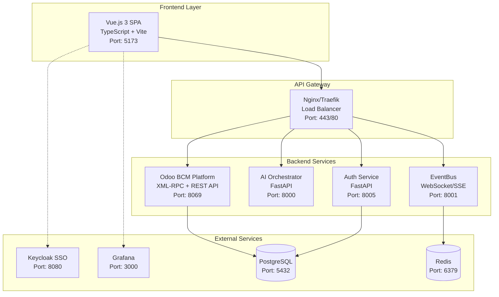
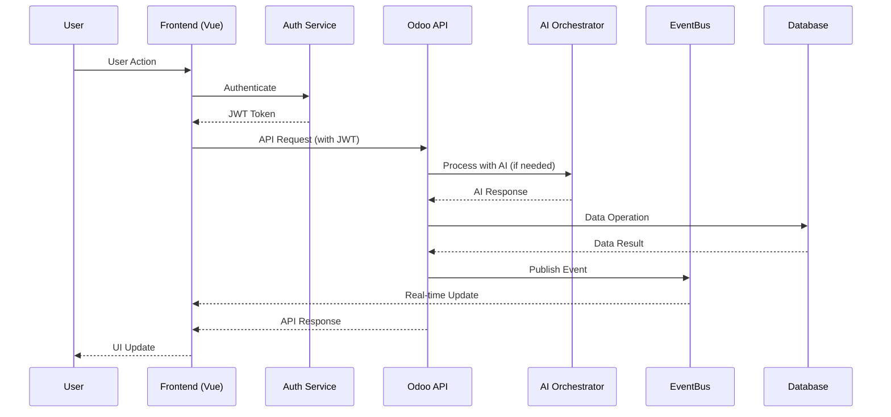
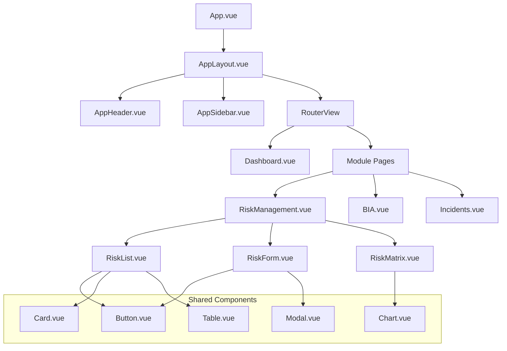
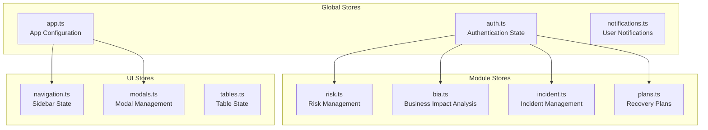
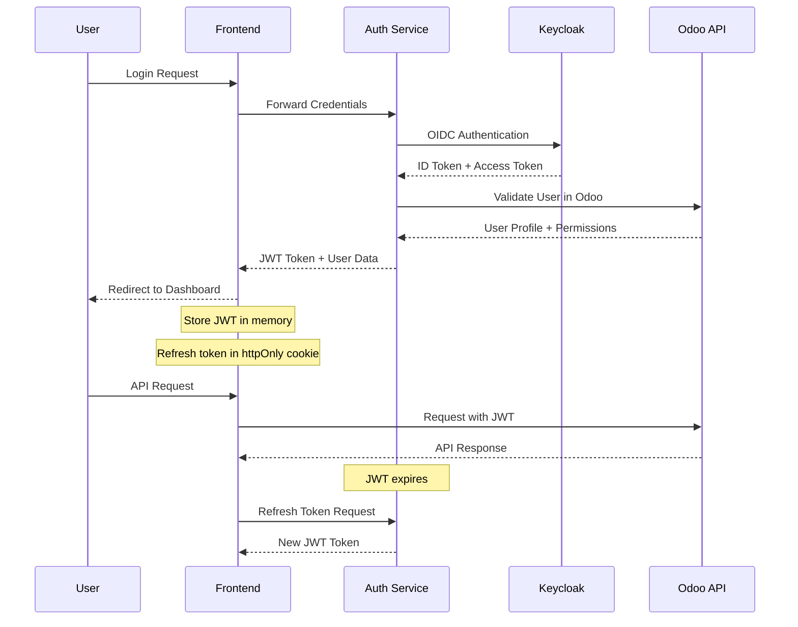

# 🏗️ BCM Platform Frontend Architecture

> **Complete architectural overview for frontend development team**

## 📋 Table of Contents

1. [System Architecture Overview](#system-architecture-overview)
2. [Technology Stack](#technology-stack)
3. [Project Structure](#project-structure)
4. [Component Architecture](#component-architecture)
5. [State Management](#state-management)
6. [Routing Strategy](#routing-strategy)
7. [API Integration Layer](#api-integration-layer)
8. [Real-time Communication](#real-time-communication)
9. [Security Architecture](#security-architecture)
10. [Performance Considerations](#performance-considerations)

---

## 🎯 System Architecture Overview

### High-Level Architecture



### Data Flow Architecture



---

## ⚙️ Technology Stack

### Core Frontend Technologies

| Technology | Version | Purpose | Documentation |
|------------|---------|---------|---------------|
| **Vue.js** | 3.4+ | Core framework | [Vue 3 Guide](https://vuejs.org/guide/) |
| **TypeScript** | 5.0+ | Type safety | [TS Handbook](https://www.typescriptlang.org/docs/) |
| **Vite** | 5.0+ | Build tool | [Vite Guide](https://vitejs.dev/guide/) |
| **Pinia** | 2.1+ | State management | [Pinia Docs](https://pinia.vuejs.org/) |
| **Vue Router** | 4.2+ | Client-side routing | [Router Guide](https://router.vuejs.org/) |

### UI and Styling

| Technology | Version | Purpose |
|------------|---------|---------|
| **Tailwind CSS** | 3.4+ | Utility-first CSS framework |
| **Headless UI** | 1.7+ | Unstyled, accessible UI components |
| **Heroicons** | 2.0+ | Icon library |
| **Chart.js** | 4.4+ | Data visualization |
| **Monaco Editor** | 0.45+ | Code editing (for templates) |

### Development Tools

| Tool | Purpose |
|------|---------|
| **ESLint** | Code linting |
| **Prettier** | Code formatting |
| **Vitest** | Unit testing |
| **Cypress** | E2E testing |
| **TypeScript** | Static type checking |

---

## 📁 Project Structure

### Directory Organization

```
📁 frontend/web_portal-2/
├── 📁 public/                    # Static assets
│   ├── favicon.ico
│   └── images/
├── 📁 src/
│   ├── 📁 assets/               # Compiled assets
│   │   ├── 📁 images/
│   │   └── 📁 styles/
│   │       ├── main.scss        # Global styles
│   │       ├── variables.scss   # SCSS variables
│   │       └── components.scss  # Component styles
│   ├── 📁 components/           # Reusable components
│   │   ├── 📁 ui/              # Basic UI components
│   │   │   ├── Button.vue
│   │   │   ├── Card.vue
│   │   │   ├── Modal.vue
│   │   │   └── index.ts        # Component exports
│   │   ├── 📁 layout/          # Layout components
│   │   │   ├── AppHeader.vue
│   │   │   ├── AppSidebar.vue
│   │   │   └── PageHeader.vue
│   │   ├── 📁 charts/          # Chart components
│   │   ├── 📁 forms/           # Form components
│   │   └── 📁 bcm/             # BCM-specific components
│   │       ├── PlanCard.vue
│   │       ├── RiskMatrix.vue
│   │       └── IncidentAlert.vue
│   ├── 📁 composables/         # Vue 3 composables
│   │   ├── useAuth.ts
│   │   ├── useApi.ts
│   │   ├── useEventBus.ts
│   │   └── useBCMModule.ts
│   ├── 📁 services/            # API and business logic
│   │   ├── api.ts              # Main API client
│   │   ├── auth.ts             # Authentication service
│   │   ├── bcm.ts              # BCM-specific APIs
│   │   └── eventBus.ts         # Real-time communication
│   ├── 📁 stores/              # Pinia stores
│   │   ├── auth.ts             # Authentication state
│   │   ├── app.ts              # Global app state
│   │   ├── notifications.ts    # Notification system
│   │   └── modules/            # Module-specific stores
│   │       ├── risk.ts
│   │       ├── incident.ts
│   │       └── bia.ts
│   ├── 📁 types/               # TypeScript definitions
│   │   ├── api.ts              # API response types
│   │   ├── auth.ts             # Auth-related types
│   │   ├── bcm.ts              # BCM business types
│   │   └── index.ts            # Type exports
│   ├── 📁 utils/               # Utility functions
│   │   ├── formatting.ts       # Data formatting
│   │   ├── validation.ts       # Form validation
│   │   └── constants.ts        # Application constants
│   ├── 📁 views/               # Page components
│   │   ├── 📁 auth/            # Authentication pages
│   │   ├── 📁 modules/         # BCM module pages
│   │   │   ├── RiskManagement.vue
│   │   │   ├── BIA.vue
│   │   │   ├── Incidents.vue
│   │   │   └── Plans.vue
│   │   ├── Dashboard.vue
│   │   └── NotFound.vue
│   ├── App.vue                 # Root component
│   ├── main.ts                 # Application entry point
│   └── router.ts               # Vue Router configuration
├── 📁 tests/                   # Test files
│   ├── 📁 unit/               # Unit tests
│   ├── 📁 e2e/                # E2E tests
│   └── 📁 fixtures/           # Test data
├── index.html                 # HTML template
├── package.json               # Dependencies
├── tsconfig.json             # TypeScript config
├── vite.config.ts            # Vite configuration
├── tailwind.config.js        # Tailwind CSS config
├── cypress.config.ts         # Cypress config
└── vitest.config.ts          # Vitest config
```

---

## 🧩 Component Architecture

### Component Hierarchy



### Component Design Principles

#### 1. Single Responsibility
Each component should have one clear purpose and responsibility.

```vue
<!-- ✅ Good: Focused component -->
<template>
  <div class="risk-score-badge" :class="scoreClass">
    {{ formattedScore }}
  </div>
</template>

<script setup lang="ts">
interface Props {
  score: number
  maxScore?: number
}

const props = withDefaults(defineProps<Props>(), {
  maxScore: 25
})

const formattedScore = computed(() =>
  `${props.score}/${props.maxScore}`
)

const scoreClass = computed(() => {
  const percentage = (props.score / props.maxScore) * 100
  if (percentage >= 80) return 'score-critical'
  if (percentage >= 60) return 'score-high'
  if (percentage >= 40) return 'score-medium'
  return 'score-low'
})
</script>
```

#### 2. Composition over Inheritance
Use Vue 3 composition API and composables for shared logic.

```typescript
// composables/useDataTable.ts
export function useDataTable<T>(
  fetchData: () => Promise<T[]>,
  filterFn?: (item: T, query: string) => boolean
) {
  const data = ref<T[]>([])
  const loading = ref(false)
  const searchQuery = ref('')
  const sortBy = ref('')
  const sortOrder = ref<'asc' | 'desc'>('asc')

  const filteredData = computed(() => {
    let filtered = data.value

    if (searchQuery.value && filterFn) {
      filtered = filtered.filter(item =>
        filterFn(item, searchQuery.value)
      )
    }

    if (sortBy.value) {
      filtered = filtered.sort((a, b) => {
        const aVal = a[sortBy.value]
        const bVal = b[sortBy.value]
        const result = aVal < bVal ? -1 : aVal > bVal ? 1 : 0
        return sortOrder.value === 'desc' ? -result : result
      })
    }

    return filtered
  })

  const loadData = async () => {
    loading.value = true
    try {
      data.value = await fetchData()
    } finally {
      loading.value = false
    }
  }

  const sortData = (field: string) => {
    if (sortBy.value === field) {
      sortOrder.value = sortOrder.value === 'asc' ? 'desc' : 'asc'
    } else {
      sortBy.value = field
      sortOrder.value = 'asc'
    }
  }

  return {
    data: readonly(data),
    filteredData,
    loading: readonly(loading),
    searchQuery,
    sortBy,
    sortOrder,
    loadData,
    sortData
  }
}
```

#### 3. Props and Events Pattern

```vue
<!-- Parent Component -->
<template>
  <RiskList
    :risks="risks"
    :loading="loading"
    @select="handleRiskSelect"
    @create="handleRiskCreate"
    @update="handleRiskUpdate"
    @delete="handleRiskDelete"
  />
</template>

<!-- Child Component -->
<template>
  <div class="risk-list">
    <div v-if="loading" class="loading-state">
      Loading risks...
    </div>
    <div v-else>
      <div
        v-for="risk in risks"
        :key="risk.id"
        @click="$emit('select', risk)"
        class="risk-item"
      >
        {{ risk.name }}
      </div>
    </div>
  </div>
</template>

<script setup lang="ts">
import type { Risk } from '@/types/bcm'

interface Props {
  risks: Risk[]
  loading: boolean
}

interface Emits {
  select: [risk: Risk]
  create: []
  update: [risk: Risk]
  delete: [riskId: number]
}

defineProps<Props>()
defineEmits<Emits>()
</script>
```

---

## 🗄️ State Management

### Pinia Store Architecture



### Store Implementation Example

```typescript
// stores/risk.ts
import { defineStore } from 'pinia'
import { ref, computed } from 'vue'
import type { Risk, RiskFilters, CreateRiskData } from '@/types/bcm'
import { riskApi } from '@/services/api'
import { useNotifications } from '@/stores/notifications'

export const useRiskStore = defineStore('risk', () => {
  // State
  const risks = ref<Risk[]>([])
  const selectedRisk = ref<Risk | null>(null)
  const loading = ref(false)
  const filters = ref<RiskFilters>({
    status: 'all',
    category: 'all',
    severity: 'all',
    search: ''
  })

  // Getters
  const filteredRisks = computed(() => {
    return risks.value.filter(risk => {
      if (filters.value.status !== 'all' && risk.status !== filters.value.status) {
        return false
      }
      if (filters.value.category !== 'all' && risk.category !== filters.value.category) {
        return false
      }
      if (filters.value.severity !== 'all' && risk.severity !== filters.value.severity) {
        return false
      }
      if (filters.value.search && !risk.name.toLowerCase().includes(filters.value.search.toLowerCase())) {
        return false
      }
      return true
    })
  })

  const criticalRisks = computed(() =>
    risks.value.filter(risk => risk.riskScore >= 20)
  )

  const riskStats = computed(() => ({
    total: risks.value.length,
    critical: criticalRisks.value.length,
    high: risks.value.filter(r => r.riskScore >= 15 && r.riskScore < 20).length,
    medium: risks.value.filter(r => r.riskScore >= 10 && r.riskScore < 15).length,
    low: risks.value.filter(r => r.riskScore < 10).length
  }))

  // Actions
  const fetchRisks = async () => {
    loading.value = true
    try {
      const response = await riskApi.getRisks()
      risks.value = response.data
    } catch (error) {
      useNotifications().error('Failed to load risks')
      throw error
    } finally {
      loading.value = false
    }
  }

  const createRisk = async (riskData: CreateRiskData) => {
    try {
      const response = await riskApi.createRisk(riskData)
      risks.value.push(response.data)
      useNotifications().success('Risk created successfully')
      return response.data
    } catch (error) {
      useNotifications().error('Failed to create risk')
      throw error
    }
  }

  const updateRisk = async (id: number, updates: Partial<Risk>) => {
    try {
      const response = await riskApi.updateRisk(id, updates)
      const index = risks.value.findIndex(r => r.id === id)
      if (index !== -1) {
        risks.value[index] = response.data
      }
      useNotifications().success('Risk updated successfully')
      return response.data
    } catch (error) {
      useNotifications().error('Failed to update risk')
      throw error
    }
  }

  const deleteRisk = async (id: number) => {
    try {
      await riskApi.deleteRisk(id)
      risks.value = risks.value.filter(r => r.id !== id)
      useNotifications().success('Risk deleted successfully')
    } catch (error) {
      useNotifications().error('Failed to delete risk')
      throw error
    }
  }

  const setFilters = (newFilters: Partial<RiskFilters>) => {
    filters.value = { ...filters.value, ...newFilters }
  }

  const clearFilters = () => {
    filters.value = {
      status: 'all',
      category: 'all',
      severity: 'all',
      search: ''
    }
  }

  const selectRisk = (risk: Risk | null) => {
    selectedRisk.value = risk
  }

  return {
    // State
    risks: readonly(risks),
    selectedRisk: readonly(selectedRisk),
    loading: readonly(loading),
    filters,

    // Getters
    filteredRisks,
    criticalRisks,
    riskStats,

    // Actions
    fetchRisks,
    createRisk,
    updateRisk,
    deleteRisk,
    setFilters,
    clearFilters,
    selectRisk
  }
})
```

---

## 🛣️ Routing Strategy

### Route Configuration

```typescript
// router/index.ts
import { createRouter, createWebHistory } from 'vue-router'
import { useAuthStore } from '@/stores/auth'

const router = createRouter({
  history: createWebHistory(),
  routes: [
    {
      path: '/',
      name: 'Dashboard',
      component: () => import('@/views/Dashboard.vue'),
      meta: { requiresAuth: true, title: 'Dashboard' }
    },
    {
      path: '/auth',
      name: 'Auth',
      component: () => import('@/layouts/AuthLayout.vue'),
      children: [
        {
          path: 'login',
          name: 'Login',
          component: () => import('@/views/auth/Login.vue'),
          meta: { title: 'Login' }
        }
      ]
    },
    {
      path: '/modules',
      name: 'Modules',
      component: () => import('@/layouts/ModuleLayout.vue'),
      meta: { requiresAuth: true },
      children: [
        {
          path: 'risk-management',
          name: 'RiskManagement',
          component: () => import('@/views/modules/RiskManagement.vue'),
          meta: { title: 'Risk Management', module: 'risk' },
          children: [
            {
              path: '',
              name: 'RiskList',
              component: () => import('@/views/modules/risk/RiskList.vue')
            },
            {
              path: 'create',
              name: 'RiskCreate',
              component: () => import('@/views/modules/risk/RiskForm.vue')
            },
            {
              path: ':id',
              name: 'RiskDetail',
              component: () => import('@/views/modules/risk/RiskDetail.vue'),
              props: true
            },
            {
              path: ':id/edit',
              name: 'RiskEdit',
              component: () => import('@/views/modules/risk/RiskForm.vue'),
              props: true
            }
          ]
        },
        {
          path: 'bia',
          name: 'BIA',
          component: () => import('@/views/modules/BIA.vue'),
          meta: { title: 'Business Impact Analysis', module: 'bia' }
        },
        {
          path: 'incidents',
          name: 'Incidents',
          component: () => import('@/views/modules/Incidents.vue'),
          meta: { title: 'Incident Management', module: 'incident' }
        }
      ]
    },
    {
      path: '/:pathMatch(.*)*',
      name: 'NotFound',
      component: () => import('@/views/NotFound.vue'),
      meta: { title: '404 - Not Found' }
    }
  ]
})

// Navigation guards
router.beforeEach(async (to, from, next) => {
  const authStore = useAuthStore()

  // Set page title
  document.title = to.meta.title ? `${to.meta.title} - BCM Platform` : 'BCM Platform'

  // Check authentication
  if (to.meta.requiresAuth && !authStore.isAuthenticated) {
    next({ name: 'Login', query: { redirect: to.fullPath } })
    return
  }

  // Check module permissions
  if (to.meta.module && !authStore.hasModuleAccess(to.meta.module)) {
    next({ name: 'Dashboard' })
    return
  }

  next()
})

export default router
```

### Route Meta Information

```typescript
// types/router.ts
export interface RouteMeta {
  title?: string
  requiresAuth?: boolean
  module?: string
  permissions?: string[]
  layout?: string
  breadcrumb?: BreadcrumbItem[]
}

export interface BreadcrumbItem {
  label: string
  to?: string
  icon?: string
}
```

---

## 🔌 API Integration Layer

### API Client Configuration

```typescript
// services/api.ts
import axios, { type AxiosInstance, type AxiosRequestConfig } from 'axios'
import { useAuthStore } from '@/stores/auth'
import { useNotifications } from '@/stores/notifications'

class ApiClient {
  private client: AxiosInstance

  constructor() {
    this.client = axios.create({
      baseURL: import.meta.env.VITE_API_URL || 'http://localhost:8069/api',
      timeout: 30000,
      headers: {
        'Content-Type': 'application/json'
      }
    })

    this.setupInterceptors()
  }

  private setupInterceptors() {
    // Request interceptor
    this.client.interceptors.request.use(
      (config) => {
        const authStore = useAuthStore()

        if (authStore.token) {
          config.headers.Authorization = `Bearer ${authStore.token}`
        }

        if (authStore.companyId) {
          config.headers['X-Company-Id'] = authStore.companyId
        }

        return config
      },
      (error) => Promise.reject(error)
    )

    // Response interceptor
    this.client.interceptors.response.use(
      (response) => response,
      async (error) => {
        const authStore = useAuthStore()
        const notifications = useNotifications()

        if (error.response?.status === 401) {
          try {
            await authStore.refreshToken()
            return this.client(error.config)
          } catch {
            authStore.logout()
            notifications.error('Session expired. Please login again.')
          }
        }

        if (error.response?.status === 403) {
          notifications.error('You do not have permission to perform this action.')
        }

        if (error.response?.status >= 500) {
          notifications.error('Server error. Please try again later.')
        }

        return Promise.reject(error)
      }
    )
  }

  async get<T>(url: string, config?: AxiosRequestConfig): Promise<T> {
    const response = await this.client.get(url, config)
    return response.data
  }

  async post<T>(url: string, data?: any, config?: AxiosRequestConfig): Promise<T> {
    const response = await this.client.post(url, data, config)
    return response.data
  }

  async put<T>(url: string, data?: any, config?: AxiosRequestConfig): Promise<T> {
    const response = await this.client.put(url, data, config)
    return response.data
  }

  async patch<T>(url: string, data?: any, config?: AxiosRequestConfig): Promise<T> {
    const response = await this.client.patch(url, data, config)
    return response.data
  }

  async delete<T>(url: string, config?: AxiosRequestConfig): Promise<T> {
    const response = await this.client.delete(url, config)
    return response.data
  }
}

export const apiClient = new ApiClient()
```

---

## ⚡ Real-time Communication

### EventBus Integration

```typescript
// services/eventBus.ts
import { ref, onMounted, onUnmounted } from 'vue'
import { useAuthStore } from '@/stores/auth'

export class EventBusService {
  private ws: WebSocket | null = null
  private eventSource: EventSource | null = null
  private listeners = new Map<string, Set<Function>>()
  private reconnectAttempts = 0
  private maxReconnectAttempts = 10
  private reconnectDelay = 5000

  constructor() {
    this.connect()
  }

  private connect() {
    const authStore = useAuthStore()
    const wsUrl = import.meta.env.VITE_WS_URL || 'ws://localhost:8001'

    try {
      this.ws = new WebSocket(`${wsUrl}/ws?token=${authStore.token}`)

      this.ws.onopen = () => {
        console.log('WebSocket connected')
        this.reconnectAttempts = 0
        this.subscribeToCompanyEvents(authStore.companyId)
      }

      this.ws.onmessage = (event) => {
        try {
          const data = JSON.parse(event.data)
          this.handleEvent(data)
        } catch (error) {
          console.error('Failed to parse WebSocket message:', error)
        }
      }

      this.ws.onerror = (error) => {
        console.error('WebSocket error:', error)
      }

      this.ws.onclose = () => {
        console.log('WebSocket disconnected')
        this.attemptReconnect()
      }
    } catch (error) {
      console.error('Failed to connect to WebSocket:', error)
      this.attemptReconnect()
    }
  }

  private attemptReconnect() {
    if (this.reconnectAttempts < this.maxReconnectAttempts) {
      this.reconnectAttempts++
      setTimeout(() => {
        console.log(`Reconnection attempt ${this.reconnectAttempts}`)
        this.connect()
      }, this.reconnectDelay)
    }
  }

  private subscribeToCompanyEvents(companyId: number) {
    if (this.ws?.readyState === WebSocket.OPEN) {
      this.ws.send(JSON.stringify({
        action: 'subscribe',
        patterns: [
          `company.${companyId}.*`,
          'system.alerts.*',
          'ai.analysis.*'
        ]
      }))
    }
  }

  private handleEvent(data: any) {
    const { event_type, payload } = data

    this.listeners.forEach((callbacks, pattern) => {
      if (this.matchPattern(pattern, event_type)) {
        callbacks.forEach(callback => {
          try {
            callback(payload, event_type)
          } catch (error) {
            console.error(`Error in event handler for ${event_type}:`, error)
          }
        })
      }
    })
  }

  private matchPattern(pattern: string, eventType: string): boolean {
    const regex = new RegExp('^' + pattern.replace(/\*/g, '.*') + '$')
    return regex.test(eventType)
  }

  subscribe(pattern: string, callback: Function) {
    if (!this.listeners.has(pattern)) {
      this.listeners.set(pattern, new Set())
    }
    this.listeners.get(pattern)!.add(callback)
  }

  unsubscribe(pattern: string, callback: Function) {
    const callbacks = this.listeners.get(pattern)
    if (callbacks) {
      callbacks.delete(callback)
      if (callbacks.size === 0) {
        this.listeners.delete(pattern)
      }
    }
  }

  publish(eventType: string, payload: any) {
    if (this.ws?.readyState === WebSocket.OPEN) {
      this.ws.send(JSON.stringify({
        action: 'publish',
        event_type: eventType,
        payload
      }))
    }
  }

  disconnect() {
    if (this.ws) {
      this.ws.close()
      this.ws = null
    }
    if (this.eventSource) {
      this.eventSource.close()
      this.eventSource = null
    }
  }
}

export const eventBus = new EventBusService()

// Composable for using EventBus in components
export function useEventBus() {
  const connected = ref(false)

  const subscribe = (pattern: string, callback: Function) => {
    eventBus.subscribe(pattern, callback)

    onUnmounted(() => {
      eventBus.unsubscribe(pattern, callback)
    })
  }

  const publish = (eventType: string, payload: any) => {
    eventBus.publish(eventType, payload)
  }

  onMounted(() => {
    connected.value = true
  })

  onUnmounted(() => {
    connected.value = false
  })

  return {
    connected,
    subscribe,
    publish
  }
}
```

---

## 🔒 Security Architecture

### Authentication Flow



### Security Implementation

```typescript
// stores/auth.ts
import { defineStore } from 'pinia'
import { ref, computed } from 'vue'
import { jwtDecode } from 'jwt-decode'
import type { User, LoginCredentials, JWTPayload } from '@/types/auth'
import { authApi } from '@/services/auth'

export const useAuthStore = defineStore('auth', () => {
  // State
  const user = ref<User | null>(null)
  const token = ref<string | null>(null)
  const refreshToken = ref<string | null>(null)
  const permissions = ref<string[]>([])
  const companyId = ref<number | null>(null)

  // Getters
  const isAuthenticated = computed(() => !!token.value && !!user.value)

  const tokenPayload = computed(() => {
    if (!token.value) return null
    try {
      return jwtDecode<JWTPayload>(token.value)
    } catch {
      return null
    }
  })

  const isTokenExpired = computed(() => {
    if (!tokenPayload.value) return true
    return Date.now() >= tokenPayload.value.exp * 1000
  })

  // Actions
  const login = async (credentials: LoginCredentials) => {
    try {
      const response = await authApi.login(credentials)

      token.value = response.access_token
      refreshToken.value = response.refresh_token
      user.value = response.user
      permissions.value = response.permissions
      companyId.value = response.user.company_id

      // Store refresh token in httpOnly cookie
      document.cookie = `refresh_token=${response.refresh_token}; HttpOnly; Secure; SameSite=Strict`

      return response
    } catch (error) {
      throw new Error('Authentication failed')
    }
  }

  const logout = async () => {
    try {
      if (refreshToken.value) {
        await authApi.logout(refreshToken.value)
      }
    } catch (error) {
      console.error('Logout error:', error)
    } finally {
      // Clear all auth state
      token.value = null
      refreshToken.value = null
      user.value = null
      permissions.value = []
      companyId.value = null

      // Clear cookies
      document.cookie = 'refresh_token=; expires=Thu, 01 Jan 1970 00:00:00 UTC; path=/;'

      // Redirect to login
      window.location.href = '/auth/login'
    }
  }

  const refreshAccessToken = async () => {
    if (!refreshToken.value) {
      throw new Error('No refresh token available')
    }

    try {
      const response = await authApi.refresh(refreshToken.value)
      token.value = response.access_token

      if (response.refresh_token) {
        refreshToken.value = response.refresh_token
        document.cookie = `refresh_token=${response.refresh_token}; HttpOnly; Secure; SameSite=Strict`
      }

      return response.access_token
    } catch (error) {
      await logout()
      throw error
    }
  }

  const hasPermission = (permission: string): boolean => {
    return permissions.value.includes(permission) || permissions.value.includes('admin')
  }

  const hasModuleAccess = (module: string): boolean => {
    return hasPermission(`module.${module}.read`) || hasPermission('admin')
  }

  const canCreate = (resource: string): boolean => {
    return hasPermission(`${resource}.create`) || hasPermission('admin')
  }

  const canUpdate = (resource: string): boolean => {
    return hasPermission(`${resource}.update`) || hasPermission('admin')
  }

  const canDelete = (resource: string): boolean => {
    return hasPermission(`${resource}.delete`) || hasPermission('admin')
  }

  // Initialize from stored state
  const initialize = () => {
    // Get refresh token from cookie if available
    const cookies = document.cookie.split(';')
    const refreshCookie = cookies.find(cookie => cookie.trim().startsWith('refresh_token='))

    if (refreshCookie) {
      refreshToken.value = refreshCookie.split('=')[1]
      // Attempt to refresh token on app load
      refreshAccessToken().catch(() => {
        // If refresh fails, user needs to login again
        logout()
      })
    }
  }

  return {
    // State
    user: readonly(user),
    token: readonly(token),
    permissions: readonly(permissions),
    companyId: readonly(companyId),

    // Getters
    isAuthenticated,
    isTokenExpired,

    // Actions
    login,
    logout,
    refreshAccessToken,
    hasPermission,
    hasModuleAccess,
    canCreate,
    canUpdate,
    canDelete,
    initialize
  }
})
```

---

## ⚡ Performance Considerations

### Code Splitting Strategy

```typescript
// router/index.ts - Lazy loading routes
const routes = [
  {
    path: '/modules/risk-management',
    name: 'RiskManagement',
    component: () => import(
      /* webpackChunkName: "risk-management" */
      '@/views/modules/RiskManagement.vue'
    )
  },
  {
    path: '/modules/bia',
    name: 'BIA',
    component: () => import(
      /* webpackChunkName: "bia" */
      '@/views/modules/BIA.vue'
    )
  }
]
```

### Bundle Optimization

```typescript
// vite.config.ts
import { defineConfig } from 'vite'
import vue from '@vitejs/plugin-vue'
import { resolve } from 'path'

export default defineConfig({
  plugins: [vue()],
  build: {
    rollupOptions: {
      output: {
        manualChunks: {
          // Vendor chunks
          'vue-vendor': ['vue', 'vue-router', 'pinia'],
          'ui-vendor': ['@headlessui/vue', 'chart.js'],
          'utility-vendor': ['axios', 'date-fns', 'lodash-es'],

          // Feature chunks
          'risk-management': [
            './src/views/modules/RiskManagement.vue',
            './src/stores/risk.ts'
          ],
          'bia': [
            './src/views/modules/BIA.vue',
            './src/stores/bia.ts'
          ]
        }
      }
    },
    chunkSizeWarningLimit: 1000
  },
  resolve: {
    alias: {
      '@': resolve(__dirname, 'src')
    }
  }
})
```

### Performance Monitoring

```typescript
// utils/performance.ts
export class PerformanceMonitor {
  private static measurements = new Map<string, number>()

  static start(label: string) {
    this.measurements.set(label, performance.now())
  }

  static end(label: string): number {
    const startTime = this.measurements.get(label)
    if (!startTime) {
      console.warn(`No start time found for ${label}`)
      return 0
    }

    const duration = performance.now() - startTime
    this.measurements.delete(label)

    console.log(`${label}: ${duration.toFixed(2)}ms`)
    return duration
  }

  static measure<T>(label: string, fn: () => T): T {
    this.start(label)
    const result = fn()
    this.end(label)
    return result
  }

  static async measureAsync<T>(label: string, fn: () => Promise<T>): Promise<T> {
    this.start(label)
    const result = await fn()
    this.end(label)
    return result
  }
}

// Usage in components
export function usePerformanceMonitoring() {
  const measureRender = (componentName: string, renderFn: () => void) => {
    return PerformanceMonitor.measure(`${componentName} render`, renderFn)
  }

  const measureApiCall = async (endpoint: string, apiCall: () => Promise<any>) => {
    return PerformanceMonitor.measureAsync(`API: ${endpoint}`, apiCall)
  }

  return {
    measureRender,
    measureApiCall
  }
}
```

---

**🎯 This architecture document provides the complete foundation for frontend development, ensuring scalable, maintainable, and performant code that integrates seamlessly with the BCM Platform's backend services.**