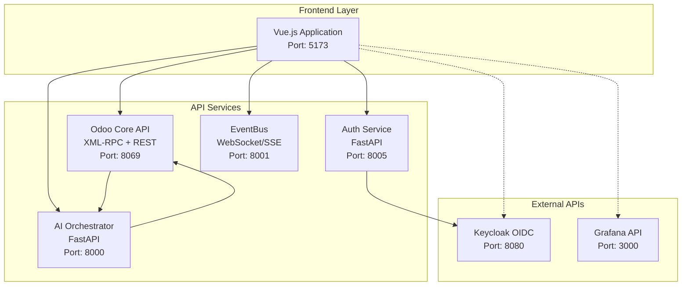

# 🔌 BCM Platform API Integration Guide

> **Practical API integration examples and patterns for frontend developers**

## 📋 Table of Contents

1. [API Architecture Overview](#api-architecture-overview)
2. [Authentication Integration](#authentication-integration)
3. [Odoo XML-RPC Integration](#odoo-xml-rpc-integration)
4. [REST API Integration](#rest-api-integration)
5. [Real-time Communication](#real-time-communication)
6. [Module-Specific APIs](#module-specific-apis)
7. [Error Handling Patterns](#error-handling-patterns)
8. [Testing API Integration](#testing-api-integration)
9. [Performance Optimization](#performance-optimization)

---

## 🎯 API Architecture Overview

### Service Communication Flow



### API Client Architecture

```typescript
// services/apiClient.ts
import axios, { type AxiosInstance } from 'axios'
import { xmlrpc } from '@/utils/xmlrpc'
import { useAuthStore } from '@/stores/auth'

export class ApiClient {
  private restClient: AxiosInstance
  private xmlrpcUrl: string

  constructor() {
    this.restClient = this.createRestClient()
    this.xmlrpcUrl = `${import.meta.env.VITE_ODOO_URL}/xmlrpc/2`
  }

  private createRestClient(): AxiosInstance {
    const client = axios.create({
      baseURL: import.meta.env.VITE_API_URL,
      timeout: 30000,
      headers: {
        'Content-Type': 'application/json'
      }
    })

    // Add request interceptor for authentication
    client.interceptors.request.use((config) => {
      const authStore = useAuthStore()

      if (authStore.token) {
        config.headers.Authorization = `Bearer ${authStore.token}`
      }

      if (authStore.companyId) {
        config.headers['X-Company-Id'] = authStore.companyId
      }

      return config
    })

    return client
  }

  // REST API methods
  async get<T>(endpoint: string, params?: any): Promise<T> {
    const response = await this.restClient.get(endpoint, { params })
    return response.data
  }

  async post<T>(endpoint: string, data?: any): Promise<T> {
    const response = await this.restClient.post(endpoint, data)
    return response.data
  }

  async put<T>(endpoint: string, data?: any): Promise<T> {
    const response = await this.restClient.put(endpoint, data)
    return response.data
  }

  async patch<T>(endpoint: string, data?: any): Promise<T> {
    const response = await this.restClient.patch(endpoint, data)
    return response.data
  }

  async delete<T>(endpoint: string): Promise<T> {
    const response = await this.restClient.delete(endpoint)
    return response.data
  }

  // XML-RPC methods for Odoo
  async xmlrpcCall(service: string, method: string, ...args: any[]): Promise<any> {
    const authStore = useAuthStore()

    return xmlrpc.call({
      url: `${this.xmlrpcUrl}/${service}`,
      method,
      params: [
        authStore.odooDatabase,
        authStore.odooUserId,
        authStore.odooPassword,
        ...args
      ]
    })
  }
}

export const apiClient = new ApiClient()
```

---

## 🔐 Authentication Integration

### Auth Service Implementation

```typescript
// services/auth.ts
import { apiClient } from './apiClient'
import type { LoginCredentials, AuthResponse, User } from '@/types/auth'

export class AuthService {
  async login(credentials: LoginCredentials): Promise<AuthResponse> {
    try {
      // Step 1: Authenticate with Auth Service
      const authResponse = await apiClient.post<AuthResponse>('/auth/login', {
        username: credentials.username,
        password: credentials.password,
        company_id: credentials.companyId
      })

      // Step 2: Get Odoo session
      const odooSession = await this.getOdooSession(credentials)

      return {
        ...authResponse,
        odoo_session: odooSession
      }
    } catch (error) {
      throw new Error('Authentication failed')
    }
  }

  private async getOdooSession(credentials: LoginCredentials) {
    // Use XML-RPC to authenticate with Odoo
    const uid = await apiClient.xmlrpcCall(
      'common',
      'authenticate',
      credentials.database || 'bcm_platform',
      credentials.username,
      credentials.password,
      {}
    )

    if (!uid) {
      throw new Error('Odoo authentication failed')
    }

    return {
      uid,
      database: credentials.database || 'bcm_platform',
      username: credentials.username,
      password: credentials.password
    }
  }

  async refreshToken(refreshToken: string): Promise<{ access_token: string }> {
    return apiClient.post('/auth/refresh', {
      refresh_token: refreshToken
    })
  }

  async logout(refreshToken: string): Promise<void> {
    await apiClient.post('/auth/logout', {
      refresh_token: refreshToken
    })
  }

  async getCurrentUser(): Promise<User> {
    return apiClient.get('/auth/me')
  }

  async updatePassword(currentPassword: string, newPassword: string): Promise<void> {
    await apiClient.post('/auth/change-password', {
      current_password: currentPassword,
      new_password: newPassword
    })
  }
}

export const authService = new AuthService()
```

### Authentication Hook

```typescript
// composables/useAuth.ts
import { computed } from 'vue'
import { useRouter } from 'vue-router'
import { useAuthStore } from '@/stores/auth'
import { authService } from '@/services/auth'
import type { LoginCredentials } from '@/types/auth'

export function useAuth() {
  const authStore = useAuthStore()
  const router = useRouter()

  const isAuthenticated = computed(() => authStore.isAuthenticated)
  const user = computed(() => authStore.user)
  const permissions = computed(() => authStore.permissions)

  const login = async (credentials: LoginCredentials) => {
    try {
      const response = await authService.login(credentials)
      await authStore.setAuthData(response)

      // Redirect to dashboard or intended route
      const redirect = router.currentRoute.value.query.redirect as string
      await router.push(redirect || '/')

      return response
    } catch (error) {
      throw new Error('Login failed. Please check your credentials.')
    }
  }

  const logout = async () => {
    await authStore.logout()
    await router.push('/auth/login')
  }

  const hasPermission = (permission: string): boolean => {
    return authStore.hasPermission(permission)
  }

  const canAccess = (resource: string, action: string): boolean => {
    return authStore.hasPermission(`${resource}.${action}`)
  }

  return {
    isAuthenticated,
    user,
    permissions,
    login,
    logout,
    hasPermission,
    canAccess
  }
}
```

---

## 🗄️ Odoo XML-RPC Integration

### XML-RPC Utility

```typescript
// utils/xmlrpc.ts
export interface XmlRpcOptions {
  url: string
  method: string
  params: any[]
}

export class XmlRpcClient {
  async call(options: XmlRpcOptions): Promise<any> {
    const xmlPayload = this.buildXmlPayload(options.method, options.params)

    const response = await fetch(options.url, {
      method: 'POST',
      headers: {
        'Content-Type': 'text/xml',
      },
      body: xmlPayload
    })

    if (!response.ok) {
      throw new Error(`XML-RPC call failed: ${response.statusText}`)
    }

    const xmlText = await response.text()
    return this.parseXmlResponse(xmlText)
  }

  private buildXmlPayload(method: string, params: any[]): string {
    const paramElements = params.map(param => this.encodeParam(param)).join('')

    return `<?xml version="1.0"?>
<methodCall>
  <methodName>${method}</methodName>
  <params>
    ${paramElements}
  </params>
</methodCall>`
  }

  private encodeParam(param: any): string {
    const type = typeof param

    if (type === 'string') {
      return `<param><value><string>${this.escapeXml(param)}</string></value></param>`
    } else if (type === 'number') {
      return Number.isInteger(param)
        ? `<param><value><int>${param}</int></value></param>`
        : `<param><value><double>${param}</double></value></param>`
    } else if (type === 'boolean') {
      return `<param><value><boolean>${param ? 1 : 0}</boolean></value></param>`
    } else if (Array.isArray(param)) {
      const arrayItems = param.map(item => this.encodeParam(item)).join('')
      return `<param><value><array><data>${arrayItems}</data></array></value></param>`
    } else if (type === 'object' && param !== null) {
      const structMembers = Object.entries(param)
        .map(([key, value]) =>
          `<member><name>${key}</name>${this.encodeParam(value)}</member>`
        ).join('')
      return `<param><value><struct>${structMembers}</struct></value></param>`
    }

    return `<param><value><string></string></value></param>`
  }

  private parseXmlResponse(xmlText: string): any {
    const parser = new DOMParser()
    const doc = parser.parseFromString(xmlText, 'text/xml')

    // Check for fault
    const fault = doc.querySelector('fault')
    if (fault) {
      const faultValue = this.parseValue(fault.querySelector('value'))
      throw new Error(`XML-RPC Fault: ${faultValue.faultString}`)
    }

    // Parse successful response
    const params = doc.querySelector('params')
    if (params) {
      const param = params.querySelector('param')
      if (param) {
        return this.parseValue(param.querySelector('value'))
      }
    }

    return null
  }

  private parseValue(valueElement: Element | null): any {
    if (!valueElement) return null

    // Check for different value types
    const stringElement = valueElement.querySelector('string')
    if (stringElement) return stringElement.textContent

    const intElement = valueElement.querySelector('int, i4')
    if (intElement) return parseInt(intElement.textContent || '0')

    const doubleElement = valueElement.querySelector('double')
    if (doubleElement) return parseFloat(doubleElement.textContent || '0')

    const booleanElement = valueElement.querySelector('boolean')
    if (booleanElement) return (intElement?.textContent || '0') === '1'

    const arrayElement = valueElement.querySelector('array')
    if (arrayElement) {
      const data = arrayElement.querySelector('data')
      if (data) {
        return Array.from(data.querySelectorAll('value')).map(v => this.parseValue(v))
      }
    }

    const structElement = valueElement.querySelector('struct')
    if (structElement) {
      const result: Record<string, any> = {}
      structElement.querySelectorAll('member').forEach(member => {
        const name = member.querySelector('name')?.textContent
        const value = member.querySelector('value')
        if (name && value) {
          result[name] = this.parseValue(value)
        }
      })
      return result
    }

    return valueElement.textContent
  }

  private escapeXml(str: string): string {
    return str
      .replace(/&/g, '&amp;')
      .replace(/</g, '&lt;')
      .replace(/>/g, '&gt;')
      .replace(/"/g, '&quot;')
      .replace(/'/g, '&#39;')
  }
}

export const xmlrpc = new XmlRpcClient()
```

### Odoo Model Service

```typescript
// services/odooModel.ts
import { apiClient } from './apiClient'

export class OdooModelService {
  constructor(private modelName: string) {}

  async search(domain: any[] = [], options: any = {}): Promise<number[]> {
    return apiClient.xmlrpcCall(
      'object',
      'execute_kw',
      this.modelName,
      'search',
      [domain],
      options
    )
  }

  async read(ids: number[], fields: string[] = []): Promise<any[]> {
    return apiClient.xmlrpcCall(
      'object',
      'execute_kw',
      this.modelName,
      'read',
      [ids],
      { fields }
    )
  }

  async searchRead(domain: any[] = [], fields: string[] = [], options: any = {}): Promise<any[]> {
    return apiClient.xmlrpcCall(
      'object',
      'execute_kw',
      this.modelName,
      'search_read',
      [domain],
      {
        fields,
        ...options
      }
    )
  }

  async create(values: Record<string, any>): Promise<number> {
    return apiClient.xmlrpcCall(
      'object',
      'execute_kw',
      this.modelName,
      'create',
      [values]
    )
  }

  async write(ids: number[], values: Record<string, any>): Promise<boolean> {
    return apiClient.xmlrpcCall(
      'object',
      'execute_kw',
      this.modelName,
      'write',
      [ids, values]
    )
  }

  async unlink(ids: number[]): Promise<boolean> {
    return apiClient.xmlrpcCall(
      'object',
      'execute_kw',
      this.modelName,
      'unlink',
      [ids]
    )
  }

  async nameGet(ids: number[]): Promise<[number, string][]> {
    return apiClient.xmlrpcCall(
      'object',
      'execute_kw',
      this.modelName,
      'name_get',
      [ids]
    )
  }

  async fieldsGet(fields: string[] = []): Promise<Record<string, any>> {
    return apiClient.xmlrpcCall(
      'object',
      'execute_kw',
      this.modelName,
      'fields_get',
      [],
      { attributes: ['string', 'help', 'type', 'required', 'readonly'] }
    )
  }

  async searchCount(domain: any[] = []): Promise<number> {
    return apiClient.xmlrpcCall(
      'object',
      'execute_kw',
      this.modelName,
      'search_count',
      [domain]
    )
  }
}

// Factory function for creating model services
export function createOdooModel(modelName: string): OdooModelService {
  return new OdooModelService(modelName)
}
```

---

## 🌐 REST API Integration

### API Service Classes

```typescript
// services/bcmApi.ts
import { apiClient } from './apiClient'
import type {
  Risk, CreateRiskData, UpdateRiskData,
  BIAProcess, CreateBIAData,
  Incident, CreateIncidentData,
  Plan, CreatePlanData
} from '@/types/bcm'

export class BCMApiService {
  // Risk Management API
  risk = {
    async getAll(params?: {
      page?: number,
      limit?: number,
      status?: string,
      category?: string
    }): Promise<{ data: Risk[], total: number }> {
      return apiClient.get('/v1/risks', params)
    },

    async getById(id: number): Promise<Risk> {
      return apiClient.get(`/v1/risks/${id}`)
    },

    async create(data: CreateRiskData): Promise<Risk> {
      return apiClient.post('/v1/risks', data)
    },

    async update(id: number, data: UpdateRiskData): Promise<Risk> {
      return apiClient.patch(`/v1/risks/${id}`, data)
    },

    async delete(id: number): Promise<void> {
      return apiClient.delete(`/v1/risks/${id}`)
    },

    async analyze(id: number, analysisType = 'monte_carlo'): Promise<any> {
      return apiClient.post(`/v1/risks/${id}/analyze`, {
        analysis_type: analysisType,
        iterations: 10000,
        confidence_level: 0.95
      })
    },

    async getMatrix(): Promise<any> {
      return apiClient.get('/v1/risks/matrix')
    },

    async export(format = 'xlsx'): Promise<Blob> {
      return apiClient.get(`/v1/risks/export?format=${format}`, {
        responseType: 'blob'
      })
    }
  }

  // BIA API
  bia = {
    async getProcesses(params?: any): Promise<{ data: BIAProcess[], total: number }> {
      return apiClient.get('/v1/bia/processes', params)
    },

    async getProcess(id: number): Promise<BIAProcess> {
      return apiClient.get(`/v1/bia/processes/${id}`)
    },

    async createProcess(data: CreateBIAData): Promise<BIAProcess> {
      return apiClient.post('/v1/bia/processes', data)
    },

    async updateProcess(id: number, data: Partial<BIAProcess>): Promise<BIAProcess> {
      return apiClient.patch(`/v1/bia/processes/${id}`, data)
    },

    async deleteProcess(id: number): Promise<void> {
      return apiClient.delete(`/v1/bia/processes/${id}`)
    },

    async analyzeCascade(processId: number): Promise<any> {
      return apiClient.get(`/v1/bia/processes/${processId}/cascade-analysis`)
    },

    async optimizeRTO(processId: number, constraints: any): Promise<any> {
      return apiClient.post(`/v1/bia/processes/${processId}/optimize`, constraints)
    },

    async getDependencyMap(): Promise<any> {
      return apiClient.get('/v1/bia/dependency-map')
    }
  }

  // Incident Management API
  incident = {
    async getAll(params?: any): Promise<{ data: Incident[], total: number }> {
      return apiClient.get('/v1/incidents', params)
    },

    async getById(id: number): Promise<Incident> {
      return apiClient.get(`/v1/incidents/${id}`)
    },

    async create(data: CreateIncidentData): Promise<Incident> {
      return apiClient.post('/v1/incidents', data)
    },

    async update(id: number, data: Partial<Incident>): Promise<Incident> {
      return apiClient.patch(`/v1/incidents/${id}`, data)
    },

    async updateStatus(id: number, status: string, notes?: string): Promise<Incident> {
      return apiClient.patch(`/v1/incidents/${id}/status`, { status, notes })
    },

    async escalate(id: number, level: number, reason: string): Promise<Incident> {
      return apiClient.post(`/v1/incidents/${id}/escalate`, { level, reason })
    },

    async addTimeline(id: number, entry: any): Promise<any> {
      return apiClient.post(`/v1/incidents/${id}/timeline`, entry)
    },

    async getMetrics(period = '30d'): Promise<any> {
      return apiClient.get(`/v1/incidents/metrics?period=${period}`)
    }
  }

  // Plans API
  plan = {
    async getAll(params?: any): Promise<{ data: Plan[], total: number }> {
      return apiClient.get('/v1/plans', params)
    },

    async getById(id: number): Promise<Plan> {
      return apiClient.get(`/v1/plans/${id}`)
    },

    async create(data: CreatePlanData): Promise<Plan> {
      return apiClient.post('/v1/plans', data)
    },

    async update(id: number, data: Partial<Plan>): Promise<Plan> {
      return apiClient.patch(`/v1/plans/${id}`, data)
    },

    async delete(id: number): Promise<void> {
      return apiClient.delete(`/v1/plans/${id}`)
    },

    async activate(id: number): Promise<Plan> {
      return apiClient.post(`/v1/plans/${id}/activate`)
    },

    async test(id: number, testData: any): Promise<any> {
      return apiClient.post(`/v1/plans/${id}/test`, testData)
    },

    async getVersions(id: number): Promise<any[]> {
      return apiClient.get(`/v1/plans/${id}/versions`)
    }
  }

  // AI Integration API
  ai = {
    async analyze(entityType: string, entityId: number, parameters: any = {}): Promise<any> {
      return apiClient.post('/v1/ai/analyze', {
        entity_type: entityType,
        entity_id: entityId,
        parameters
      })
    },

    async getRecommendations(context: any): Promise<any> {
      return apiClient.post('/v1/ai/recommendations', { context })
    },

    async chat(message: string, context?: any): Promise<any> {
      return apiClient.post('/v1/ai/chat', { message, context })
    },

    async predictRisk(scenarioData: any): Promise<any> {
      return apiClient.post('/v1/ai/risk-prediction', scenarioData)
    }
  }

  // Analytics API
  analytics = {
    async getDashboard(dashboardType = 'executive'): Promise<any> {
      return apiClient.get(`/v1/analytics/dashboard/${dashboardType}`)
    },

    async getKPIs(module?: string): Promise<any> {
      const params = module ? { module } : {}
      return apiClient.get('/v1/analytics/kpis', params)
    },

    async generateReport(reportType: string, parameters: any): Promise<any> {
      return apiClient.post('/v1/analytics/reports', {
        type: reportType,
        parameters
      })
    },

    async exportReport(reportId: string, format = 'pdf'): Promise<Blob> {
      return apiClient.get(`/v1/analytics/reports/${reportId}/export?format=${format}`, {
        responseType: 'blob'
      })
    }
  }
}

export const bcmApi = new BCMApiService()
```

---

## ⚡ Real-time Communication

### WebSocket Service

```typescript
// services/realtime.ts
import { ref, reactive } from 'vue'
import { useAuthStore } from '@/stores/auth'

interface WebSocketMessage {
  event_type: string
  payload: any
  timestamp: string
}

export class RealtimeService {
  private ws: WebSocket | null = null
  private reconnectAttempts = 0
  private maxReconnectAttempts = 10
  private reconnectDelay = 5000
  private pingInterval: number | null = null

  public connected = ref(false)
  public listeners = reactive(new Map<string, Set<Function>>())

  constructor() {
    this.connect()
  }

  private connect() {
    const authStore = useAuthStore()
    const wsUrl = import.meta.env.VITE_WS_URL || 'ws://localhost:8001'

    try {
      this.ws = new WebSocket(`${wsUrl}/ws?token=${authStore.token}&company=${authStore.companyId}`)

      this.ws.onopen = () => {
        console.log('WebSocket connected')
        this.connected.value = true
        this.reconnectAttempts = 0
        this.startPing()
        this.subscribeToCompanyEvents()
      }

      this.ws.onmessage = (event) => {
        try {
          const message: WebSocketMessage = JSON.parse(event.data)
          this.handleMessage(message)
        } catch (error) {
          console.error('Failed to parse WebSocket message:', error)
        }
      }

      this.ws.onerror = (error) => {
        console.error('WebSocket error:', error)
      }

      this.ws.onclose = (event) => {
        console.log('WebSocket disconnected:', event.code, event.reason)
        this.connected.value = false
        this.stopPing()
        this.attemptReconnect()
      }
    } catch (error) {
      console.error('Failed to create WebSocket connection:', error)
      this.attemptReconnect()
    }
  }

  private startPing() {
    this.pingInterval = window.setInterval(() => {
      if (this.ws?.readyState === WebSocket.OPEN) {
        this.ws.send(JSON.stringify({ type: 'ping' }))
      }
    }, 30000) // Ping every 30 seconds
  }

  private stopPing() {
    if (this.pingInterval) {
      clearInterval(this.pingInterval)
      this.pingInterval = null
    }
  }

  private attemptReconnect() {
    if (this.reconnectAttempts < this.maxReconnectAttempts) {
      this.reconnectAttempts++
      setTimeout(() => {
        console.log(`Reconnection attempt ${this.reconnectAttempts}`)
        this.connect()
      }, this.reconnectDelay * Math.pow(2, this.reconnectAttempts - 1)) // Exponential backoff
    } else {
      console.error('Max reconnection attempts reached')
    }
  }

  private subscribeToCompanyEvents() {
    const authStore = useAuthStore()

    if (this.ws?.readyState === WebSocket.OPEN) {
      this.ws.send(JSON.stringify({
        action: 'subscribe',
        topics: [
          `company.${authStore.companyId}.*`,
          'system.alerts.*',
          'ai.analysis.completed',
          'incident.created',
          'incident.updated',
          'risk.threshold_exceeded'
        ]
      }))
    }
  }

  private handleMessage(message: WebSocketMessage) {
    const { event_type, payload } = message

    // Handle system messages
    if (event_type === 'pong') {
      return // Ping/pong for connection health
    }

    if (event_type === 'connection.established') {
      console.log('Server acknowledged connection')
      return
    }

    // Notify listeners
    this.listeners.forEach((callbacks, pattern) => {
      if (this.matchPattern(pattern, event_type)) {
        callbacks.forEach(callback => {
          try {
            callback(payload, event_type)
          } catch (error) {
            console.error(`Error in event handler for ${event_type}:`, error)
          }
        })
      }
    })
  }

  private matchPattern(pattern: string, eventType: string): boolean {
    // Convert pattern to regex (supports wildcards)
    const regex = new RegExp('^' + pattern.replace(/\*/g, '.*') + '$')
    return regex.test(eventType)
  }

  subscribe(pattern: string, callback: Function) {
    if (!this.listeners.has(pattern)) {
      this.listeners.set(pattern, new Set())
    }
    this.listeners.get(pattern)!.add(callback)

    // If already connected, subscribe immediately
    if (this.ws?.readyState === WebSocket.OPEN) {
      this.ws.send(JSON.stringify({
        action: 'subscribe',
        pattern
      }))
    }
  }

  unsubscribe(pattern: string, callback: Function) {
    const callbacks = this.listeners.get(pattern)
    if (callbacks) {
      callbacks.delete(callback)
      if (callbacks.size === 0) {
        this.listeners.delete(pattern)

        // Unsubscribe from server
        if (this.ws?.readyState === WebSocket.OPEN) {
          this.ws.send(JSON.stringify({
            action: 'unsubscribe',
            pattern
          }))
        }
      }
    }
  }

  publish(eventType: string, payload: any) {
    if (this.ws?.readyState === WebSocket.OPEN) {
      this.ws.send(JSON.stringify({
        action: 'publish',
        event_type: eventType,
        payload,
        timestamp: new Date().toISOString()
      }))
    } else {
      console.warn('Cannot publish: WebSocket not connected')
    }
  }

  disconnect() {
    if (this.ws) {
      this.ws.close(1000, 'Client disconnect')
      this.ws = null
    }
    this.stopPing()
  }
}

export const realtimeService = new RealtimeService()

// Vue composable for using realtime service
export function useRealtime() {
  const subscribe = (pattern: string, callback: Function) => {
    realtimeService.subscribe(pattern, callback)

    // Return unsubscribe function
    return () => realtimeService.unsubscribe(pattern, callback)
  }

  const publish = (eventType: string, payload: any) => {
    realtimeService.publish(eventType, payload)
  }

  return {
    connected: realtimeService.connected,
    subscribe,
    publish
  }
}
```

---

## 📊 Module-Specific APIs

### Risk Management Integration

```typescript
// composables/useRiskManagement.ts
import { ref, computed, onMounted } from 'vue'
import { bcmApi } from '@/services/bcmApi'
import { useRealtime } from '@/services/realtime'
import type { Risk, CreateRiskData, RiskFilters } from '@/types/bcm'

export function useRiskManagement() {
  const risks = ref<Risk[]>([])
  const loading = ref(false)
  const error = ref<string | null>(null)

  const filters = ref<RiskFilters>({
    status: 'all',
    category: 'all',
    severity: 'all',
    search: ''
  })

  const { subscribe } = useRealtime()

  // Computed properties
  const filteredRisks = computed(() => {
    return risks.value.filter(risk => {
      if (filters.value.status !== 'all' && risk.status !== filters.value.status) {
        return false
      }
      if (filters.value.category !== 'all' && risk.category !== filters.value.category) {
        return false
      }
      if (filters.value.search && !risk.name.toLowerCase().includes(filters.value.search.toLowerCase())) {
        return false
      }
      return true
    })
  })

  const riskMatrix = computed(() => {
    const matrix = Array(5).fill(null).map(() => Array(5).fill([]))

    filteredRisks.value.forEach(risk => {
      if (risk.probability && risk.impact) {
        const row = risk.probability - 1
        const col = risk.impact - 1
        if (row >= 0 && row < 5 && col >= 0 && col < 5) {
          matrix[row][col] = [...matrix[row][col], risk]
        }
      }
    })

    return matrix
  })

  const criticalRisks = computed(() => {
    return filteredRisks.value.filter(risk => risk.riskScore >= 20)
  })

  // Methods
  const loadRisks = async () => {
    loading.value = true
    error.value = null

    try {
      const response = await bcmApi.risk.getAll({
        page: 1,
        limit: 1000
      })
      risks.value = response.data
    } catch (err) {
      error.value = 'Failed to load risks'
      console.error('Error loading risks:', err)
    } finally {
      loading.value = false
    }
  }

  const createRisk = async (riskData: CreateRiskData): Promise<Risk> => {
    try {
      const newRisk = await bcmApi.risk.create(riskData)
      risks.value.push(newRisk)
      return newRisk
    } catch (err) {
      throw new Error('Failed to create risk')
    }
  }

  const updateRisk = async (id: number, updates: Partial<Risk>): Promise<Risk> => {
    try {
      const updatedRisk = await bcmApi.risk.update(id, updates)

      const index = risks.value.findIndex(r => r.id === id)
      if (index !== -1) {
        risks.value[index] = updatedRisk
      }

      return updatedRisk
    } catch (err) {
      throw new Error('Failed to update risk')
    }
  }

  const deleteRisk = async (id: number): Promise<void> => {
    try {
      await bcmApi.risk.delete(id)
      risks.value = risks.value.filter(r => r.id !== id)
    } catch (err) {
      throw new Error('Failed to delete risk')
    }
  }

  const analyzeRisk = async (id: number, analysisType = 'monte_carlo') => {
    try {
      const analysis = await bcmApi.risk.analyze(id, analysisType)

      // Update risk with analysis results
      const risk = risks.value.find(r => r.id === id)
      if (risk) {
        risk.aiAnalysis = analysis
      }

      return analysis
    } catch (err) {
      throw new Error('Risk analysis failed')
    }
  }

  const exportRisks = async (format = 'xlsx'): Promise<void> => {
    try {
      const blob = await bcmApi.risk.export(format)

      // Create download link
      const url = window.URL.createObjectURL(blob)
      const a = document.createElement('a')
      a.href = url
      a.download = `risks_${new Date().toISOString().split('T')[0]}.${format}`
      document.body.appendChild(a)
      a.click()
      document.body.removeChild(a)
      window.URL.revokeObjectURL(url)
    } catch (err) {
      throw new Error('Export failed')
    }
  }

  // Real-time updates
  const setupRealtimeUpdates = () => {
    // Subscribe to risk updates
    subscribe('risk.created', (risk: Risk) => {
      risks.value.push(risk)
    })

    subscribe('risk.updated', (risk: Risk) => {
      const index = risks.value.findIndex(r => r.id === risk.id)
      if (index !== -1) {
        risks.value[index] = risk
      }
    })

    subscribe('risk.deleted', (payload: { id: number }) => {
      risks.value = risks.value.filter(r => r.id !== payload.id)
    })

    subscribe('risk.threshold_exceeded', (payload: { risk: Risk, threshold: number }) => {
      // Handle threshold alerts
      console.log('Risk threshold exceeded:', payload)
    })
  }

  // Initialize
  onMounted(() => {
    loadRisks()
    setupRealtimeUpdates()
  })

  return {
    // State
    risks: readonly(risks),
    loading: readonly(loading),
    error: readonly(error),
    filters,

    // Computed
    filteredRisks,
    riskMatrix,
    criticalRisks,

    // Methods
    loadRisks,
    createRisk,
    updateRisk,
    deleteRisk,
    analyzeRisk,
    exportRisks
  }
}
```

---

## ❌ Error Handling Patterns

### Global Error Handler

```typescript
// plugins/errorHandler.ts
import { App } from 'vue'
import { useNotifications } from '@/stores/notifications'

export interface ApiError {
  message: string
  code?: string
  status?: number
  details?: any
}

export class ErrorHandler {
  private notifications = useNotifications()

  handleApiError(error: any): ApiError {
    console.error('API Error:', error)

    // Network errors
    if (!error.response) {
      return {
        message: 'Network error. Please check your connection.',
        code: 'NETWORK_ERROR'
      }
    }

    const { status, data } = error.response

    // Handle different status codes
    switch (status) {
      case 400:
        return {
          message: data?.message || 'Invalid request data.',
          code: 'BAD_REQUEST',
          status,
          details: data?.details
        }

      case 401:
        return {
          message: 'Authentication required. Please login again.',
          code: 'UNAUTHORIZED',
          status
        }

      case 403:
        return {
          message: 'You do not have permission to perform this action.',
          code: 'FORBIDDEN',
          status
        }

      case 404:
        return {
          message: 'The requested resource was not found.',
          code: 'NOT_FOUND',
          status
        }

      case 422:
        return {
          message: 'Validation failed. Please check your input.',
          code: 'VALIDATION_ERROR',
          status,
          details: data?.errors
        }

      case 429:
        return {
          message: 'Too many requests. Please try again later.',
          code: 'RATE_LIMITED',
          status
        }

      case 500:
        return {
          message: 'Internal server error. Please try again later.',
          code: 'INTERNAL_ERROR',
          status
        }

      case 503:
        return {
          message: 'Service temporarily unavailable. Please try again later.',
          code: 'SERVICE_UNAVAILABLE',
          status
        }

      default:
        return {
          message: data?.message || 'An unexpected error occurred.',
          code: 'UNKNOWN_ERROR',
          status
        }
    }
  }

  handleError(error: any, context?: string): ApiError {
    const apiError = this.handleApiError(error)

    // Show notification based on error type
    if (apiError.status === 401) {
      // Don't show notification for auth errors - handled by auth interceptor
    } else if (apiError.status && apiError.status >= 500) {
      this.notifications.error(`Server Error: ${apiError.message}`)
    } else if (apiError.code === 'NETWORK_ERROR') {
      this.notifications.error('Network Error: Please check your connection')
    } else {
      this.notifications.error(apiError.message)
    }

    // Log error for debugging
    if (context) {
      console.error(`Error in ${context}:`, apiError)
    }

    return apiError
  }

  handleValidationErrors(errors: Record<string, string[]>): string {
    const errorMessages = Object.entries(errors)
      .map(([field, messages]) => `${field}: ${messages.join(', ')}`)
      .join('\n')

    this.notifications.error(`Validation failed:\n${errorMessages}`)
    return errorMessages
  }
}

export const errorHandler = new ErrorHandler()

// Vue plugin
export default {
  install(app: App) {
    app.config.globalProperties.$handleError = errorHandler.handleError.bind(errorHandler)
    app.provide('errorHandler', errorHandler)
  }
}
```

### API Error Wrapper

```typescript
// utils/apiWrapper.ts
import { errorHandler } from '@/plugins/errorHandler'

export async function withErrorHandling<T>(
  apiCall: () => Promise<T>,
  context?: string
): Promise<T> {
  try {
    return await apiCall()
  } catch (error) {
    const apiError = errorHandler.handleError(error, context)
    throw apiError
  }
}

export async function withSilentError<T>(
  apiCall: () => Promise<T>,
  fallback?: T
): Promise<T | undefined> {
  try {
    return await apiCall()
  } catch (error) {
    console.error('Silent API error:', error)
    return fallback
  }
}

// Usage in components
export function useApiCall() {
  const safeApiCall = async <T>(
    apiCall: () => Promise<T>,
    context?: string
  ): Promise<T | null> => {
    try {
      return await withErrorHandling(apiCall, context)
    } catch (error) {
      // Error already handled by errorHandler
      return null
    }
  }

  return {
    safeApiCall,
    withErrorHandling,
    withSilentError
  }
}
```

---

## 🧪 Testing API Integration

### API Mock Service

```typescript
// tests/mocks/apiMock.ts
import { vi } from 'vitest'
import type { Risk, BIAProcess, Incident } from '@/types/bcm'

export class ApiMockService {
  private mockData = {
    risks: [
      {
        id: 1,
        name: 'Cyber Attack Risk',
        category: 'operational',
        probability: 4,
        impact: 5,
        riskScore: 20,
        status: 'active'
      },
      {
        id: 2,
        name: 'Data Center Failure',
        category: 'operational',
        probability: 2,
        impact: 4,
        riskScore: 8,
        status: 'mitigating'
      }
    ] as Risk[],

    biaProcesses: [
      {
        id: 1,
        name: 'Payment Processing',
        department: 'Finance',
        criticality: 'critical',
        rtoHours: 4,
        rpoMinutes: 30
      }
    ] as BIAProcess[],

    incidents: [
      {
        id: 1,
        title: 'Network Outage',
        severity: 'critical',
        status: 'in_progress',
        reportedAt: new Date().toISOString()
      }
    ] as Incident[]
  }

  risk = {
    getAll: vi.fn().mockResolvedValue({
      data: this.mockData.risks,
      total: this.mockData.risks.length
    }),

    getById: vi.fn().mockImplementation((id: number) => {
      const risk = this.mockData.risks.find(r => r.id === id)
      return risk ? Promise.resolve(risk) : Promise.reject(new Error('Risk not found'))
    }),

    create: vi.fn().mockImplementation((data: any) => {
      const newRisk = {
        id: this.mockData.risks.length + 1,
        ...data,
        riskScore: data.probability * data.impact
      }
      this.mockData.risks.push(newRisk)
      return Promise.resolve(newRisk)
    }),

    update: vi.fn().mockImplementation((id: number, data: any) => {
      const index = this.mockData.risks.findIndex(r => r.id === id)
      if (index === -1) {
        return Promise.reject(new Error('Risk not found'))
      }

      this.mockData.risks[index] = {
        ...this.mockData.risks[index],
        ...data
      }
      return Promise.resolve(this.mockData.risks[index])
    }),

    delete: vi.fn().mockImplementation((id: number) => {
      const index = this.mockData.risks.findIndex(r => r.id === id)
      if (index === -1) {
        return Promise.reject(new Error('Risk not found'))
      }

      this.mockData.risks.splice(index, 1)
      return Promise.resolve()
    }),

    analyze: vi.fn().mockResolvedValue({
      prediction: 85,
      confidence: 0.92,
      recommendations: ['Implement additional monitoring', 'Update incident response plan']
    })
  }

  // Add more mock services for other modules...
}

export const apiMockService = new ApiMockService()

// Test helper for setting up API mocks
export function setupApiMocks() {
  vi.mock('@/services/bcmApi', () => ({
    bcmApi: apiMockService
  }))
}
```

### Component Testing with API

```typescript
// tests/components/RiskList.test.ts
import { describe, it, expect, beforeEach, vi } from 'vitest'
import { mount } from '@vue/test-utils'
import { createPinia } from 'pinia'
import RiskList from '@/components/RiskList.vue'
import { setupApiMocks, apiMockService } from '@/tests/mocks/apiMock'

describe('RiskList', () => {
  let wrapper: any
  let pinia: any

  beforeEach(() => {
    setupApiMocks()
    pinia = createPinia()

    wrapper = mount(RiskList, {
      global: {
        plugins: [pinia]
      }
    })
  })

  it('loads and displays risks', async () => {
    // Wait for component to load data
    await wrapper.vm.$nextTick()
    await new Promise(resolve => setTimeout(resolve, 100))

    expect(apiMockService.risk.getAll).toHaveBeenCalled()
    expect(wrapper.findAll('.risk-item')).toHaveLength(2)
  })

  it('handles risk creation', async () => {
    const createButton = wrapper.find('[data-test="create-risk"]')
    await createButton.trigger('click')

    const newRiskData = {
      name: 'New Risk',
      category: 'strategic',
      probability: 3,
      impact: 3
    }

    await wrapper.vm.createRisk(newRiskData)

    expect(apiMockService.risk.create).toHaveBeenCalledWith(newRiskData)
  })

  it('handles API errors gracefully', async () => {
    // Mock API error
    apiMockService.risk.getAll.mockRejectedValueOnce(new Error('Network error'))

    wrapper = mount(RiskList, {
      global: {
        plugins: [pinia]
      }
    })

    await wrapper.vm.$nextTick()
    await new Promise(resolve => setTimeout(resolve, 100))

    expect(wrapper.find('.error-message').exists()).toBe(true)
  })
})
```

---

## ⚡ Performance Optimization

### API Caching Strategy

```typescript
// services/cache.ts
export class ApiCache {
  private cache = new Map<string, { data: any, timestamp: number, ttl: number }>()
  private maxSize = 100

  set(key: string, data: any, ttl = 300000): void { // 5 minutes default TTL
    // Remove oldest entries if cache is full
    if (this.cache.size >= this.maxSize) {
      const oldestKey = this.cache.keys().next().value
      this.cache.delete(oldestKey)
    }

    this.cache.set(key, {
      data,
      timestamp: Date.now(),
      ttl
    })
  }

  get(key: string): any | null {
    const entry = this.cache.get(key)

    if (!entry) {
      return null
    }

    // Check if entry has expired
    if (Date.now() - entry.timestamp > entry.ttl) {
      this.cache.delete(key)
      return null
    }

    return entry.data
  }

  delete(key: string): void {
    this.cache.delete(key)
  }

  clear(): void {
    this.cache.clear()
  }

  // Invalidate cache entries matching pattern
  invalidatePattern(pattern: string): void {
    const regex = new RegExp(pattern)

    for (const key of this.cache.keys()) {
      if (regex.test(key)) {
        this.cache.delete(key)
      }
    }
  }
}

export const apiCache = new ApiCache()

// Cached API wrapper
export function withCache<T>(
  cacheKey: string,
  apiCall: () => Promise<T>,
  ttl?: number
): Promise<T> {
  const cached = apiCache.get(cacheKey)

  if (cached) {
    return Promise.resolve(cached)
  }

  return apiCall().then(result => {
    apiCache.set(cacheKey, result, ttl)
    return result
  })
}
```

### Request Debouncing

```typescript
// composables/useDebounceApi.ts
import { ref, watch } from 'vue'

export function useDebouncedApi<T>(
  apiCall: (query: string) => Promise<T>,
  delay = 300
) {
  const query = ref('')
  const results = ref<T | null>(null)
  const loading = ref(false)
  const error = ref<string | null>(null)

  let debounceTimer: number | null = null

  const search = async (searchQuery: string) => {
    query.value = searchQuery

    if (debounceTimer) {
      clearTimeout(debounceTimer)
    }

    debounceTimer = window.setTimeout(async () => {
      if (!searchQuery.trim()) {
        results.value = null
        return
      }

      loading.value = true
      error.value = null

      try {
        results.value = await apiCall(searchQuery)
      } catch (err) {
        error.value = err instanceof Error ? err.message : 'Search failed'
      } finally {
        loading.value = false
      }
    }, delay)
  }

  // Watch for direct query changes
  watch(query, (newQuery) => {
    search(newQuery)
  })

  return {
    query,
    results,
    loading,
    error,
    search
  }
}
```

### Batch API Operations

```typescript
// services/batchApi.ts
interface BatchRequest {
  id: string
  endpoint: string
  method: 'GET' | 'POST' | 'PATCH' | 'DELETE'
  data?: any
}

interface BatchResponse {
  id: string
  status: number
  data?: any
  error?: string
}

export class BatchApiService {
  private batchQueue: BatchRequest[] = []
  private batchTimer: number | null = null
  private readonly batchDelay = 100 // 100ms
  private readonly maxBatchSize = 10

  async addToBatch(request: BatchRequest): Promise<any> {
    return new Promise((resolve, reject) => {
      this.batchQueue.push({
        ...request,
        resolve,
        reject
      } as any)

      // Start batch timer if not already running
      if (!this.batchTimer) {
        this.batchTimer = window.setTimeout(() => {
          this.processBatch()
        }, this.batchDelay)
      }

      // Process immediately if batch is full
      if (this.batchQueue.length >= this.maxBatchSize) {
        this.processBatch()
      }
    })
  }

  private async processBatch() {
    if (this.batchTimer) {
      clearTimeout(this.batchTimer)
      this.batchTimer = null
    }

    if (this.batchQueue.length === 0) {
      return
    }

    const batch = this.batchQueue.splice(0, this.maxBatchSize)

    try {
      const responses = await apiClient.post<BatchResponse[]>('/batch', {
        requests: batch.map(req => ({
          id: req.id,
          endpoint: req.endpoint,
          method: req.method,
          data: req.data
        }))
      })

      // Resolve individual promises
      responses.forEach(response => {
        const request = batch.find(req => req.id === response.id)
        if (request) {
          if (response.status >= 200 && response.status < 300) {
            ;(request as any).resolve(response.data)
          } else {
            ;(request as any).reject(new Error(response.error || 'Batch request failed'))
          }
        }
      })
    } catch (error) {
      // Reject all requests in batch
      batch.forEach(request => {
        ;(request as any).reject(error)
      })
    }

    // Continue processing if there are more requests
    if (this.batchQueue.length > 0) {
      this.batchTimer = window.setTimeout(() => {
        this.processBatch()
      }, this.batchDelay)
    }
  }
}

export const batchApi = new BatchApiService()
```

---

**🎯 This API integration guide provides comprehensive patterns and examples for connecting the frontend with all BCM Platform services, ensuring robust, performant, and maintainable API communications.**