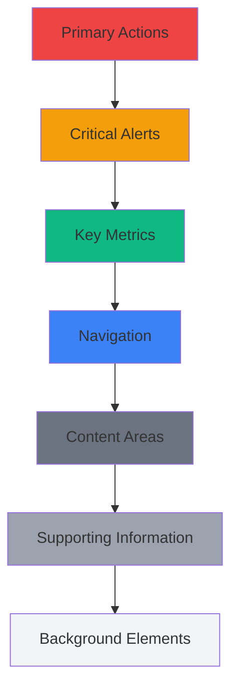

# 🎨 BCM Platform UI/UX Design System

> **Complete design guidelines and component library for consistent user experience**

## 📋 Table of Contents

1. [Design Philosophy](#design-philosophy)
2. [Color System](#color-system)
3. [Typography](#typography)
4. [Spacing and Layout](#spacing-and-layout)
5. [Component Library](#component-library)
6. [Navigation Structure](#navigation-structure)
7. [Responsive Design](#responsive-design)
8. [Accessibility Guidelines](#accessibility-guidelines)
9. [Interactive States](#interactive-states)
10. [BCM-Specific Patterns](#bcm-specific-patterns)

---

## 🎯 Design Philosophy

### Core Principles

**1. Clarity Over Complexity**
- Clear visual hierarchy for critical business continuity information
- Minimal cognitive load during crisis situations
- Direct pathways to essential functions

**2. Professional Enterprise Feel**
- Trustworthy and authoritative design language
- Consistent with ISO 22301 professional standards
- Suitable for C-level executive presentations

**3. Crisis-Ready Interface**
- High contrast for emergency visibility
- Quick access to critical functions
- Clear status indicators and alerts

**4. Data-Driven Design**
- Emphasis on metrics, KPIs, and analytics
- Effective data visualization patterns
- Actionable insights presentation

### Visual Hierarchy Framework



---

## 🎨 Color System

### Primary Color Palette

```css
:root {
  /* Primary Brand Colors */
  --bcm-primary-50: #eff6ff;
  --bcm-primary-100: #dbeafe;
  --bcm-primary-200: #bfdbfe;
  --bcm-primary-300: #93c5fd;
  --bcm-primary-400: #60a5fa;
  --bcm-primary-500: #3b82f6;  /* Main brand color */
  --bcm-primary-600: #2563eb;
  --bcm-primary-700: #1d4ed8;
  --bcm-primary-800: #1e40af;
  --bcm-primary-900: #1e3a8a;

  /* Secondary Colors */
  --bcm-secondary-50: #f5f3ff;
  --bcm-secondary-100: #ede9fe;
  --bcm-secondary-200: #ddd6fe;
  --bcm-secondary-300: #c4b5fd;
  --bcm-secondary-400: #a78bfa;
  --bcm-secondary-500: #8b5cf6;
  --bcm-secondary-600: #7c3aed;  /* Secondary brand */
  --bcm-secondary-700: #6d28d9;
  --bcm-secondary-800: #5b21b6;
  --bcm-secondary-900: #4c1d95;
}
```

### Semantic Colors

```css
:root {
  /* Status Colors */
  --bcm-success-50: #ecfdf5;
  --bcm-success-100: #d1fae5;
  --bcm-success-200: #a7f3d0;
  --bcm-success-300: #6ee7b7;
  --bcm-success-400: #34d399;
  --bcm-success-500: #10b981;  /* Success/Active */
  --bcm-success-600: #059669;
  --bcm-success-700: #047857;
  --bcm-success-800: #065f46;
  --bcm-success-900: #064e3b;

  --bcm-warning-50: #fffbeb;
  --bcm-warning-100: #fef3c7;
  --bcm-warning-200: #fde68a;
  --bcm-warning-300: #fcd34d;
  --bcm-warning-400: #fbbf24;
  --bcm-warning-500: #f59e0b;  /* Warning/Attention */
  --bcm-warning-600: #d97706;
  --bcm-warning-700: #b45309;
  --bcm-warning-800: #92400e;
  --bcm-warning-900: #78350f;

  --bcm-danger-50: #fef2f2;
  --bcm-danger-100: #fee2e2;
  --bcm-danger-200: #fecaca;
  --bcm-danger-300: #fca5a5;
  --bcm-danger-400: #f87171;
  --bcm-danger-500: #ef4444;  /* Critical/Error */
  --bcm-danger-600: #dc2626;
  --bcm-danger-700: #b91c1c;
  --bcm-danger-800: #991b1b;
  --bcm-danger-900: #7f1d1d;

  --bcm-info-50: #f0f9ff;
  --bcm-info-100: #e0f2fe;
  --bcm-info-200: #bae6fd;
  --bcm-info-300: #7dd3fc;
  --bcm-info-400: #38bdf8;
  --bcm-info-500: #0ea5e9;
  --bcm-info-600: #0284c7;  /* Information */
  --bcm-info-700: #0369a1;
  --bcm-info-800: #075985;
  --bcm-info-900: #0c4a6e;
}
```

### Risk Assessment Colors

```css
:root {
  /* Risk Level Colors */
  --risk-low: #10b981;      /* Green */
  --risk-medium: #f59e0b;   /* Orange */
  --risk-high: #ef4444;     /* Red */
  --risk-critical: #7c2d12; /* Dark Red */

  /* Risk Matrix Colors */
  --risk-matrix-1: #dcfce7; /* Very Low */
  --risk-matrix-2: #bef264; /* Low */
  --risk-matrix-3: #fde047; /* Medium */
  --risk-matrix-4: #fb923c; /* High */
  --risk-matrix-5: #dc2626; /* Critical */
}
```

### Neutral Gray Palette

```css
:root {
  /* Gray Scale */
  --gray-50: #f9fafb;
  --gray-100: #f3f4f6;
  --gray-200: #e5e7eb;
  --gray-300: #d1d5db;
  --gray-400: #9ca3af;
  --gray-500: #6b7280;
  --gray-600: #4b5563;
  --gray-700: #374151;
  --gray-800: #1f2937;
  --gray-900: #111827;

  /* Text Colors */
  --text-primary: var(--gray-900);
  --text-secondary: var(--gray-600);
  --text-muted: var(--gray-500);
  --text-disabled: var(--gray-400);
  --text-inverse: #ffffff;

  /* Background Colors */
  --bg-primary: #ffffff;
  --bg-secondary: var(--gray-50);
  --bg-muted: var(--gray-100);
  --bg-inverse: var(--gray-900);
}
```

---

## ✍️ Typography

### Font Stack

```css
:root {
  /* Primary font for interface */
  --font-sans: 'Inter', -apple-system, BlinkMacSystemFont, 'Segoe UI',
               'Roboto', 'Oxygen', 'Ubuntu', 'Cantarell', sans-serif;

  /* Monospace for code/data */
  --font-mono: 'Fira Code', 'Monaco', 'Cascadia Code',
               'Roboto Mono', monospace;

  /* Display font for headings */
  --font-display: 'Inter', var(--font-sans);
}
```

### Type Scale

```css
:root {
  /* Font Sizes */
  --text-xs: 0.75rem;     /* 12px */
  --text-sm: 0.875rem;    /* 14px */
  --text-base: 1rem;      /* 16px */
  --text-lg: 1.125rem;    /* 18px */
  --text-xl: 1.25rem;     /* 20px */
  --text-2xl: 1.5rem;     /* 24px */
  --text-3xl: 1.875rem;   /* 30px */
  --text-4xl: 2.25rem;    /* 36px */
  --text-5xl: 3rem;       /* 48px */
  --text-6xl: 3.75rem;    /* 60px */

  /* Line Heights */
  --leading-none: 1;
  --leading-tight: 1.25;
  --leading-snug: 1.375;
  --leading-normal: 1.5;
  --leading-relaxed: 1.625;
  --leading-loose: 2;

  /* Font Weights */
  --font-thin: 100;
  --font-extralight: 200;
  --font-light: 300;
  --font-normal: 400;
  --font-medium: 500;
  --font-semibold: 600;
  --font-bold: 700;
  --font-extrabold: 800;
  --font-black: 900;
}
```

### Typography Components

```css
/* Heading Styles */
.heading-1 {
  font-size: var(--text-4xl);
  font-weight: var(--font-bold);
  line-height: var(--leading-tight);
  color: var(--text-primary);
  margin-bottom: 1.5rem;
}

.heading-2 {
  font-size: var(--text-3xl);
  font-weight: var(--font-semibold);
  line-height: var(--leading-tight);
  color: var(--text-primary);
  margin-bottom: 1rem;
}

.heading-3 {
  font-size: var(--text-2xl);
  font-weight: var(--font-semibold);
  line-height: var(--leading-snug);
  color: var(--text-primary);
  margin-bottom: 0.75rem;
}

.heading-4 {
  font-size: var(--text-xl);
  font-weight: var(--font-medium);
  line-height: var(--leading-snug);
  color: var(--text-primary);
  margin-bottom: 0.5rem;
}

/* Body Text */
.body-large {
  font-size: var(--text-lg);
  line-height: var(--leading-relaxed);
  color: var(--text-primary);
}

.body-normal {
  font-size: var(--text-base);
  line-height: var(--leading-normal);
  color: var(--text-primary);
}

.body-small {
  font-size: var(--text-sm);
  line-height: var(--leading-normal);
  color: var(--text-secondary);
}

/* Special Text Styles */
.text-label {
  font-size: var(--text-sm);
  font-weight: var(--font-medium);
  text-transform: uppercase;
  letter-spacing: 0.05em;
  color: var(--text-secondary);
}

.text-caption {
  font-size: var(--text-xs);
  line-height: var(--leading-normal);
  color: var(--text-muted);
}

.text-code {
  font-family: var(--font-mono);
  font-size: var(--text-sm);
  background-color: var(--bg-muted);
  padding: 0.125rem 0.25rem;
  border-radius: 0.25rem;
}
```

---

## 📐 Spacing and Layout

### Spacing Scale

```css
:root {
  /* Spacing Scale (based on 4px unit) */
  --space-0: 0;
  --space-1: 0.25rem;  /* 4px */
  --space-2: 0.5rem;   /* 8px */
  --space-3: 0.75rem;  /* 12px */
  --space-4: 1rem;     /* 16px */
  --space-5: 1.25rem;  /* 20px */
  --space-6: 1.5rem;   /* 24px */
  --space-7: 1.75rem;  /* 28px */
  --space-8: 2rem;     /* 32px */
  --space-10: 2.5rem;  /* 40px */
  --space-12: 3rem;    /* 48px */
  --space-16: 4rem;    /* 64px */
  --space-20: 5rem;    /* 80px */
  --space-24: 6rem;    /* 96px */
}
```

### Layout Grid

```css
/* Container Sizes */
.container {
  width: 100%;
  margin-left: auto;
  margin-right: auto;
  padding-left: var(--space-4);
  padding-right: var(--space-4);
}

@media (min-width: 640px) {
  .container { max-width: 640px; }
}

@media (min-width: 768px) {
  .container {
    max-width: 768px;
    padding-left: var(--space-6);
    padding-right: var(--space-6);
  }
}

@media (min-width: 1024px) {
  .container {
    max-width: 1024px;
    padding-left: var(--space-8);
    padding-right: var(--space-8);
  }
}

@media (min-width: 1280px) {
  .container { max-width: 1280px; }
}

@media (min-width: 1536px) {
  .container { max-width: 1536px; }
}

/* Grid System */
.grid {
  display: grid;
  gap: var(--space-4);
}

.grid-cols-1 { grid-template-columns: repeat(1, minmax(0, 1fr)); }
.grid-cols-2 { grid-template-columns: repeat(2, minmax(0, 1fr)); }
.grid-cols-3 { grid-template-columns: repeat(3, minmax(0, 1fr)); }
.grid-cols-4 { grid-template-columns: repeat(4, minmax(0, 1fr)); }
.grid-cols-12 { grid-template-columns: repeat(12, minmax(0, 1fr)); }

/* Flexbox Utilities */
.flex { display: flex; }
.flex-col { flex-direction: column; }
.flex-row { flex-direction: row; }
.items-center { align-items: center; }
.items-start { align-items: flex-start; }
.items-end { align-items: flex-end; }
.justify-center { justify-content: center; }
.justify-between { justify-content: space-between; }
.justify-start { justify-content: flex-start; }
.justify-end { justify-content: flex-end; }
```

---

## 🧩 Component Library

### Buttons

```vue
<!-- Button Component -->
<template>
  <button
    :class="buttonClasses"
    :disabled="disabled || loading"
    @click="$emit('click', $event)"
  >
    <Icon
      v-if="loading"
      name="spinner"
      class="animate-spin -ml-1 mr-2"
    />
    <Icon
      v-else-if="icon"
      :name="icon"
      :class="iconClasses"
    />
    <span v-if="$slots.default">
      <slot />
    </span>
  </button>
</template>

<script setup lang="ts">
interface Props {
  variant?: 'primary' | 'secondary' | 'outline' | 'ghost' | 'danger'
  size?: 'xs' | 'sm' | 'md' | 'lg' | 'xl'
  icon?: string
  iconPosition?: 'left' | 'right'
  loading?: boolean
  disabled?: boolean
  fullWidth?: boolean
}

const props = withDefaults(defineProps<Props>(), {
  variant: 'primary',
  size: 'md',
  iconPosition: 'left'
})

const buttonClasses = computed(() => [
  'inline-flex items-center justify-center',
  'font-medium rounded-lg transition-all duration-200',
  'focus:outline-none focus:ring-2 focus:ring-offset-2',
  'disabled:opacity-50 disabled:cursor-not-allowed',

  // Variants
  {
    // Primary
    'bg-bcm-primary-600 text-white hover:bg-bcm-primary-700 focus:ring-bcm-primary-500':
      props.variant === 'primary',

    // Secondary
    'bg-bcm-secondary-600 text-white hover:bg-bcm-secondary-700 focus:ring-bcm-secondary-500':
      props.variant === 'secondary',

    // Outline
    'border border-gray-300 bg-white text-gray-700 hover:bg-gray-50 focus:ring-bcm-primary-500':
      props.variant === 'outline',

    // Ghost
    'text-gray-700 hover:bg-gray-100 focus:ring-bcm-primary-500':
      props.variant === 'ghost',

    // Danger
    'bg-bcm-danger-600 text-white hover:bg-bcm-danger-700 focus:ring-bcm-danger-500':
      props.variant === 'danger'
  },

  // Sizes
  {
    'px-2.5 py-1.5 text-xs': props.size === 'xs',
    'px-3 py-2 text-sm': props.size === 'sm',
    'px-4 py-2 text-sm': props.size === 'md',
    'px-4 py-2 text-base': props.size === 'lg',
    'px-6 py-3 text-base': props.size === 'xl'
  },

  // Full width
  { 'w-full': props.fullWidth }
])

const iconClasses = computed(() => [
  'h-4 w-4',
  {
    '-ml-1 mr-2': props.iconPosition === 'left' && $slots.default,
    'ml-2 -mr-1': props.iconPosition === 'right' && $slots.default
  }
])
</script>
```

### Cards

```vue
<!-- Card Component -->
<template>
  <div :class="cardClasses">
    <div v-if="$slots.header" class="card-header">
      <slot name="header" />
    </div>

    <div :class="bodyClasses">
      <slot />
    </div>

    <div v-if="$slots.footer" class="card-footer">
      <slot name="footer" />
    </div>
  </div>
</template>

<script setup lang="ts">
interface Props {
  variant?: 'default' | 'outlined' | 'elevated'
  padding?: 'none' | 'sm' | 'md' | 'lg'
  rounded?: 'none' | 'sm' | 'md' | 'lg'
}

const props = withDefaults(defineProps<Props>(), {
  variant: 'default',
  padding: 'md',
  rounded: 'md'
})

const cardClasses = computed(() => [
  'card',
  'bg-white overflow-hidden',

  // Variants
  {
    'border border-gray-200': props.variant === 'outlined',
    'shadow-sm': props.variant === 'default',
    'shadow-lg': props.variant === 'elevated'
  },

  // Rounded corners
  {
    'rounded-none': props.rounded === 'none',
    'rounded-sm': props.rounded === 'sm',
    'rounded-lg': props.rounded === 'md',
    'rounded-xl': props.rounded === 'lg'
  }
])

const bodyClasses = computed(() => [
  'card-body',
  {
    'p-0': props.padding === 'none',
    'p-3': props.padding === 'sm',
    'p-6': props.padding === 'md',
    'p-8': props.padding === 'lg'
  }
])
</script>

<style scoped>
.card-header {
  @apply px-6 py-4 border-b border-gray-200 bg-gray-50;
}

.card-footer {
  @apply px-6 py-4 border-t border-gray-200 bg-gray-50;
}
</style>
```

### Form Controls

```vue
<!-- Input Component -->
<template>
  <div class="form-field">
    <label
      v-if="label"
      :for="inputId"
      class="form-label"
    >
      {{ label }}
      <span v-if="required" class="text-red-500">*</span>
    </label>

    <div class="relative">
      <input
        :id="inputId"
        :type="type"
        :value="modelValue"
        :placeholder="placeholder"
        :disabled="disabled"
        :readonly="readonly"
        :class="inputClasses"
        @input="$emit('update:modelValue', $event.target.value)"
        @blur="$emit('blur', $event)"
        @focus="$emit('focus', $event)"
      />

      <div v-if="icon" class="absolute inset-y-0 left-0 flex items-center pl-3">
        <Icon :name="icon" class="h-5 w-5 text-gray-400" />
      </div>

      <div v-if="$slots.suffix" class="absolute inset-y-0 right-0 flex items-center pr-3">
        <slot name="suffix" />
      </div>
    </div>

    <p v-if="error" class="mt-1 text-sm text-red-600">
      {{ error }}
    </p>

    <p v-else-if="hint" class="mt-1 text-sm text-gray-500">
      {{ hint }}
    </p>
  </div>
</template>

<script setup lang="ts">
interface Props {
  modelValue?: string | number
  type?: string
  label?: string
  placeholder?: string
  icon?: string
  error?: string
  hint?: string
  required?: boolean
  disabled?: boolean
  readonly?: boolean
  size?: 'sm' | 'md' | 'lg'
}

const props = withDefaults(defineProps<Props>(), {
  type: 'text',
  size: 'md'
})

defineEmits<{
  'update:modelValue': [value: string]
  blur: [event: FocusEvent]
  focus: [event: FocusEvent]
}>()

const inputId = computed(() => `input-${Math.random().toString(36).substr(2, 9)}`)

const inputClasses = computed(() => [
  'block w-full rounded-lg border transition-colors duration-200',
  'focus:outline-none focus:ring-2 focus:ring-offset-2',

  // Sizes
  {
    'px-3 py-2 text-sm': props.size === 'sm',
    'px-4 py-2.5 text-base': props.size === 'md',
    'px-4 py-3 text-lg': props.size === 'lg'
  },

  // States
  {
    'border-red-300 focus:border-red-500 focus:ring-red-500': props.error,
    'border-gray-300 focus:border-bcm-primary-500 focus:ring-bcm-primary-500': !props.error,
    'bg-gray-50 cursor-not-allowed': props.disabled || props.readonly
  },

  // Icon padding
  {
    'pl-10': props.icon,
    'pr-10': props.$slots.suffix
  }
])
</script>

<style scoped>
.form-label {
  @apply block text-sm font-medium text-gray-700 mb-1;
}
</style>
```

### Data Tables

```vue
<!-- Table Component -->
<template>
  <div class="table-container">
    <div class="overflow-hidden shadow ring-1 ring-black ring-opacity-5 md:rounded-lg">
      <table class="min-w-full divide-y divide-gray-300">
        <thead class="bg-gray-50">
          <tr>
            <th
              v-for="column in columns"
              :key="column.key"
              :class="headerClasses(column)"
              @click="handleSort(column)"
            >
              <div class="flex items-center space-x-1">
                <span>{{ column.title }}</span>
                <Icon
                  v-if="column.sortable"
                  :name="getSortIcon(column.key)"
                  class="h-4 w-4 text-gray-400"
                />
              </div>
            </th>
            <th v-if="$slots.actions" class="relative px-6 py-3">
              <span class="sr-only">Actions</span>
            </th>
          </tr>
        </thead>

        <tbody class="divide-y divide-gray-200 bg-white">
          <tr
            v-for="(row, index) in data"
            :key="getRowKey(row, index)"
            :class="rowClasses(row, index)"
            @click="$emit('rowClick', row, index)"
          >
            <td
              v-for="column in columns"
              :key="column.key"
              :class="cellClasses(column)"
            >
              <slot
                :name="column.key"
                :row="row"
                :value="getValue(row, column.key)"
                :index="index"
              >
                {{ formatValue(row, column) }}
              </slot>
            </td>

            <td v-if="$slots.actions" class="relative px-6 py-4 text-right text-sm font-medium">
              <slot name="actions" :row="row" :index="index" />
            </td>
          </tr>

          <tr v-if="loading">
            <td :colspan="columns.length + ($slots.actions ? 1 : 0)" class="px-6 py-12 text-center">
              <div class="flex items-center justify-center">
                <Icon name="spinner" class="h-6 w-6 animate-spin text-gray-400 mr-2" />
                <span class="text-gray-500">Loading...</span>
              </div>
            </td>
          </tr>

          <tr v-else-if="data.length === 0">
            <td :colspan="columns.length + ($slots.actions ? 1 : 0)" class="px-6 py-12 text-center">
              <div class="text-gray-500">
                <Icon name="inbox" class="h-12 w-12 mx-auto mb-4 text-gray-300" />
                <p class="text-lg font-medium">No data available</p>
                <p class="text-sm">There are no records to display.</p>
              </div>
            </td>
          </tr>
        </tbody>
      </table>
    </div>
  </div>
</template>

<script setup lang="ts">
interface Column {
  key: string
  title: string
  sortable?: boolean
  align?: 'left' | 'center' | 'right'
  width?: string
  formatter?: (value: any, row: any) => string
}

interface Props {
  columns: Column[]
  data: any[]
  loading?: boolean
  sortBy?: string
  sortOrder?: 'asc' | 'desc'
  rowKey?: string | ((row: any, index: number) => string)
  hoverable?: boolean
  striped?: boolean
}

const props = withDefaults(defineProps<Props>(), {
  sortOrder: 'asc',
  hoverable: true
})

defineEmits<{
  rowClick: [row: any, index: number]
  sort: [column: string, order: 'asc' | 'desc']
}>()

const headerClasses = (column: Column) => [
  'px-6 py-3 text-left text-xs font-medium text-gray-500 uppercase tracking-wider',
  {
    'cursor-pointer hover:bg-gray-100': column.sortable,
    'text-center': column.align === 'center',
    'text-right': column.align === 'right'
  }
]

const cellClasses = (column: Column) => [
  'px-6 py-4 whitespace-nowrap text-sm',
  {
    'text-center': column.align === 'center',
    'text-right': column.align === 'right',
    'text-gray-900': !column.align || column.align === 'left'
  }
]

const rowClasses = (row: any, index: number) => [
  {
    'hover:bg-gray-50 cursor-pointer': props.hoverable,
    'bg-gray-50': props.striped && index % 2 === 1
  }
]

const getRowKey = (row: any, index: number): string => {
  if (typeof props.rowKey === 'function') {
    return props.rowKey(row, index)
  }
  return props.rowKey ? row[props.rowKey] : index.toString()
}

const getValue = (row: any, key: string): any => {
  return key.split('.').reduce((obj, path) => obj?.[path], row)
}

const formatValue = (row: any, column: Column): string => {
  const value = getValue(row, column.key)

  if (column.formatter) {
    return column.formatter(value, row)
  }

  return value?.toString() || ''
}

const getSortIcon = (columnKey: string): string => {
  if (props.sortBy !== columnKey) return 'sort'
  return props.sortOrder === 'asc' ? 'sort-up' : 'sort-down'
}

const handleSort = (column: Column) => {
  if (!column.sortable) return

  const newOrder = props.sortBy === column.key && props.sortOrder === 'asc' ? 'desc' : 'asc'
  $emit('sort', column.key, newOrder)
}
</script>
```

---

## 🧭 Navigation Structure

### Main Navigation Layout

```vue
<!-- AppLayout.vue -->
<template>
  <div class="app-layout">
    <!-- Header -->
    <header class="app-header">
      <div class="flex items-center justify-between h-16 px-6">
        <!-- Logo and branding -->
        <div class="flex items-center space-x-4">
          <button
            @click="toggleSidebar"
            class="lg:hidden p-2 rounded-md text-gray-600 hover:text-gray-900 hover:bg-gray-100"
          >
            <Icon name="menu" class="h-6 w-6" />
          </button>

          <div class="flex items-center space-x-3">
            
            <h1 class="text-xl font-semibold text-gray-900">BCM Platform</h1>
          </div>
        </div>

        <!-- Header actions -->
        <div class="flex items-center space-x-4">
          <!-- Global search -->
          <div class="relative">
            <Icon name="search" class="absolute left-3 top-1/2 transform -translate-y-1/2 h-5 w-5 text-gray-400" />
            <input
              type="text"
              placeholder="Search..."
              class="pl-10 pr-4 py-2 border border-gray-300 rounded-lg text-sm focus:outline-none focus:ring-2 focus:ring-bcm-primary-500"
            />
          </div>

          <!-- Notifications -->
          <NotificationDropdown />

          <!-- User menu -->
          <UserDropdown />
        </div>
      </div>
    </header>

    <!-- Sidebar -->
    <aside :class="sidebarClasses">
      <AppSidebar />
    </aside>

    <!-- Main content -->
    <main :class="mainContentClasses">
      <router-view />
    </main>
  </div>
</template>

<script setup lang="ts">
const sidebarOpen = ref(false)

const toggleSidebar = () => {
  sidebarOpen.value = !sidebarOpen.value
}

const sidebarClasses = computed(() => [
  'fixed inset-y-0 left-0 z-50 w-64 transform bg-white border-r border-gray-200 transition-transform duration-300 ease-in-out',
  'lg:translate-x-0 lg:static lg:inset-0',
  {
    'translate-x-0': sidebarOpen.value,
    '-translate-x-full': !sidebarOpen.value
  }
])

const mainContentClasses = computed(() => [
  'flex-1 min-w-0 lg:ml-64'
])
</script>

<style scoped>
.app-layout {
  @apply min-h-screen bg-gray-50;
}

.app-header {
  @apply fixed top-0 right-0 left-0 z-40 bg-white border-b border-gray-200 lg:left-64;
}

@media (min-width: 1024px) {
  .app-header {
    left: 16rem; /* 64 * 0.25rem */
  }
}
</style>
```

### Sidebar Navigation

```vue
<!-- AppSidebar.vue -->
<template>
  <nav class="sidebar">
    <div class="sidebar-content">
      <!-- User info -->
      <div class="user-section">
        <div class="flex items-center space-x-3 p-4">
          <Avatar :src="user?.avatar" :name="user?.name" size="md" />
          <div class="flex-1 min-w-0">
            <p class="text-sm font-medium text-gray-900 truncate">
              {{ user?.name }}
            </p>
            <p class="text-xs text-gray-500 truncate">
              {{ user?.role }}
            </p>
          </div>
        </div>
      </div>

      <!-- Navigation items -->
      <div class="nav-sections">
        <NavSection
          v-for="section in navigationSections"
          :key="section.title"
          :title="section.title"
          :items="section.items"
          :collapsed="section.collapsed"
          @toggle="toggleSection(section)"
        />
      </div>
    </div>

    <!-- Footer -->
    <div class="sidebar-footer">
      <div class="p-4 border-t border-gray-200">
        <Button
          variant="outline"
          size="sm"
          icon="help-circle"
          full-width
          @click="openHelp"
        >
          Help & Support
        </Button>
      </div>
    </div>
  </nav>
</template>

<script setup lang="ts">
interface NavItem {
  title: string
  path?: string
  icon?: string
  badge?: string | number
  children?: NavItem[]
  permission?: string
}

interface NavSection {
  title: string
  items: NavItem[]
  collapsed: boolean
}

const user = computed(() => useAuthStore().user)

const navigationSections = ref<NavSection[]>([
  {
    title: 'Main',
    collapsed: false,
    items: [
      {
        title: 'Dashboard',
        path: '/',
        icon: 'home'
      }
    ]
  },
  {
    title: 'Core Modules',
    collapsed: false,
    items: [
      {
        title: 'BCM Core',
        icon: 'cog',
        children: [
          { title: 'Plans', path: '/modules/plans', icon: 'document-text' },
          { title: 'Processes', path: '/modules/processes', icon: 'flow-chart' },
          { title: 'Settings', path: '/modules/settings', icon: 'settings' }
        ]
      },
      {
        title: 'Organization Context',
        path: '/modules/context',
        icon: 'office-building'
      }
    ]
  },
  {
    title: 'Business Modules',
    collapsed: false,
    items: [
      {
        title: 'Business Impact Analysis',
        path: '/modules/bia',
        icon: 'chart-bar'
      },
      {
        title: 'Risk Management',
        path: '/modules/risk',
        icon: 'shield-exclamation',
        badge: '5'
      },
      {
        title: 'Incident Management',
        path: '/modules/incidents',
        icon: 'exclamation-triangle',
        badge: '2'
      }
    ]
  },
  {
    title: 'Operations',
    collapsed: true,
    items: [
      {
        title: 'Training & Awareness',
        path: '/modules/training',
        icon: 'academic-cap'
      },
      {
        title: 'Exercises & Testing',
        path: '/modules/exercises',
        icon: 'play'
      },
      {
        title: 'Templates',
        path: '/modules/templates',
        icon: 'template'
      }
    ]
  },
  {
    title: 'Analytics',
    collapsed: true,
    items: [
      {
        title: 'KPI Dashboard',
        path: '/analytics/kpi',
        icon: 'chart-line'
      },
      {
        title: 'Reports',
        path: '/analytics/reports',
        icon: 'document-report'
      },
      {
        title: 'Audit & Compliance',
        path: '/analytics/audit',
        icon: 'clipboard-check'
      }
    ]
  },
  {
    title: 'AI Tools',
    collapsed: true,
    items: [
      {
        title: 'AI Assistant',
        path: '/ai/assistant',
        icon: 'brain'
      },
      {
        title: 'Scenario Hub',
        path: '/ai/scenarios',
        icon: 'lightbulb'
      }
    ]
  }
])
</script>

<style scoped>
.sidebar {
  @apply h-full flex flex-col bg-white;
}

.sidebar-content {
  @apply flex-1 overflow-y-auto;
}

.user-section {
  @apply border-b border-gray-200;
}

.nav-sections {
  @apply py-4;
}

.sidebar-footer {
  @apply border-t border-gray-200;
}
</style>
```

---

## 📱 Responsive Design

### Breakpoint System

```css
:root {
  /* Breakpoints */
  --breakpoint-sm: 640px;   /* Mobile Large */
  --breakpoint-md: 768px;   /* Tablet */
  --breakpoint-lg: 1024px;  /* Desktop */
  --breakpoint-xl: 1280px;  /* Large Desktop */
  --breakpoint-2xl: 1536px; /* Extra Large */
}

/* Mobile First Media Queries */
@media (min-width: 640px) {
  .sm\:block { display: block; }
  .sm\:hidden { display: none; }
  .sm\:grid-cols-2 { grid-template-columns: repeat(2, minmax(0, 1fr)); }
}

@media (min-width: 768px) {
  .md\:grid-cols-3 { grid-template-columns: repeat(3, minmax(0, 1fr)); }
  .md\:text-lg { font-size: 1.125rem; }
}

@media (min-width: 1024px) {
  .lg\:grid-cols-4 { grid-template-columns: repeat(4, minmax(0, 1fr)); }
  .lg\:block { display: block; }
  .lg\:hidden { display: none; }
}
```

### Mobile Navigation

```vue
<!-- MobileNavigation.vue -->
<template>
  <!-- Mobile menu overlay -->
  <div
    v-if="isOpen"
    class="fixed inset-0 z-50 lg:hidden"
    @click="close"
  >
    <div class="fixed inset-0 bg-black bg-opacity-25" />

    <nav class="mobile-nav">
      <div class="mobile-nav-header">
        <div class="flex items-center justify-between p-4">
          <div class="flex items-center space-x-3">
            
            <span class="text-lg font-semibold">BCM Platform</span>
          </div>
          <button @click="close" class="p-2">
            <Icon name="x" class="h-6 w-6" />
          </button>
        </div>
      </div>

      <div class="mobile-nav-content">
        <MobileNavItem
          v-for="item in navigationItems"
          :key="item.title"
          :item="item"
          @navigate="handleNavigate"
        />
      </div>
    </nav>
  </div>

  <!-- Mobile bottom tabs -->
  <div class="mobile-bottom-tabs lg:hidden">
    <button
      v-for="tab in bottomTabs"
      :key="tab.name"
      :class="bottomTabClasses(tab)"
      @click="navigateTo(tab.path)"
    >
      <Icon :name="tab.icon" class="h-6 w-6" />
      <span class="text-xs">{{ tab.label }}</span>
      <span
        v-if="tab.badge"
        class="absolute -top-1 -right-1 h-5 w-5 bg-red-500 text-white text-xs rounded-full flex items-center justify-center"
      >
        {{ tab.badge }}
      </span>
    </button>
  </div>
</template>

<script setup lang="ts">
interface Props {
  isOpen: boolean
}

defineProps<Props>()

const emit = defineEmits<{
  close: []
}>()

const route = useRoute()
const router = useRouter()

const bottomTabs = [
  { name: 'dashboard', label: 'Home', icon: 'home', path: '/' },
  { name: 'risks', label: 'Risks', icon: 'shield-exclamation', path: '/modules/risk', badge: 5 },
  { name: 'incidents', label: 'Incidents', icon: 'exclamation-triangle', path: '/modules/incidents', badge: 2 },
  { name: 'menu', label: 'Menu', icon: 'menu', action: 'openMenu' }
]

const bottomTabClasses = (tab: any) => [
  'relative flex flex-col items-center justify-center flex-1 py-2 transition-colors',
  {
    'text-bcm-primary-600': route.path === tab.path,
    'text-gray-500': route.path !== tab.path
  }
]

const navigateTo = (path?: string) => {
  if (path) {
    router.push(path)
  } else {
    // Open mobile menu
    emit('open')
  }
}

const handleNavigate = (path: string) => {
  router.push(path)
  emit('close')
}

const close = () => emit('close')
</script>

<style scoped>
.mobile-nav {
  @apply fixed left-0 top-0 bottom-0 w-80 max-w-sm bg-white shadow-xl;
  transform: translateX(0);
}

.mobile-nav-header {
  @apply border-b border-gray-200;
}

.mobile-nav-content {
  @apply flex-1 overflow-y-auto py-4;
}

.mobile-bottom-tabs {
  @apply fixed bottom-0 left-0 right-0 bg-white border-t border-gray-200;
  @apply flex items-center justify-around h-16 px-4;
  z-index: 40;
}
</style>
```

---

## ♿ Accessibility Guidelines

### ARIA Labels and Roles

```vue
<!-- Accessible components example -->
<template>
  <div class="risk-matrix" role="grid" aria-label="Risk Assessment Matrix">
    <div class="matrix-header" role="row">
      <div class="matrix-cell header" role="columnheader">Impact →</div>
      <div
        v-for="impact in impactLevels"
        :key="impact"
        class="matrix-cell header"
        role="columnheader"
      >
        {{ impact }}
      </div>
    </div>

    <div
      v-for="(probability, pIndex) in probabilityLevels"
      :key="probability"
      class="matrix-row"
      role="row"
    >
      <div class="matrix-cell header" role="rowheader">
        {{ probability }}
      </div>
      <div
        v-for="(impact, iIndex) in impactLevels"
        :key="impact"
        class="matrix-cell risk-cell"
        role="gridcell"
        :aria-label="`Risk level ${getRiskLevel(pIndex, iIndex)}, Probability ${probability}, Impact ${impact}`"
        :tabindex="0"
        @click="handleCellClick(pIndex, iIndex)"
        @keydown.enter="handleCellClick(pIndex, iIndex)"
        @keydown.space.prevent="handleCellClick(pIndex, iIndex)"
      >
        {{ getRiskScore(pIndex, iIndex) }}
      </div>
    </div>
  </div>
</template>

<script setup lang="ts">
// Component with proper keyboard navigation and screen reader support
const handleCellClick = (probabilityIndex: number, impactIndex: number) => {
  // Announce the action to screen readers
  const announcement = `Selected cell with probability ${probabilityLevels[probabilityIndex]} and impact ${impactLevels[impactIndex]}`
  announceToScreenReader(announcement)

  emit('cellSelected', { probabilityIndex, impactIndex })
}

const announceToScreenReader = (message: string) => {
  const announcement = document.createElement('div')
  announcement.setAttribute('aria-live', 'polite')
  announcement.setAttribute('aria-atomic', 'true')
  announcement.className = 'sr-only'
  announcement.textContent = message

  document.body.appendChild(announcement)
  setTimeout(() => document.body.removeChild(announcement), 1000)
}
</script>

<style scoped>
/* Screen reader only class */
.sr-only {
  position: absolute;
  width: 1px;
  height: 1px;
  padding: 0;
  margin: -1px;
  overflow: hidden;
  clip: rect(0, 0, 0, 0);
  white-space: nowrap;
  border: 0;
}

/* Focus styles for keyboard navigation */
.risk-cell:focus {
  @apply outline-none ring-2 ring-bcm-primary-500 ring-offset-2;
}

/* High contrast mode support */
@media (prefers-contrast: high) {
  .risk-cell {
    border: 2px solid;
  }
}

/* Reduced motion support */
@media (prefers-reduced-motion: reduce) {
  * {
    animation-duration: 0.01ms !important;
    animation-iteration-count: 1 !important;
    transition-duration: 0.01ms !important;
  }
}
</style>
```

### Focus Management

```typescript
// composables/useFocusManagement.ts
export function useFocusManagement() {
  const focusableElements = 'button, [href], input, select, textarea, [tabindex]:not([tabindex="-1"])'

  const trapFocus = (element: HTMLElement) => {
    const focusableNodes = element.querySelectorAll(focusableElements)
    const firstNode = focusableNodes[0] as HTMLElement
    const lastNode = focusableNodes[focusableNodes.length - 1] as HTMLElement

    const handleTabKey = (e: KeyboardEvent) => {
      if (e.key !== 'Tab') return

      if (e.shiftKey && document.activeElement === firstNode) {
        e.preventDefault()
        lastNode.focus()
      } else if (!e.shiftKey && document.activeElement === lastNode) {
        e.preventDefault()
        firstNode.focus()
      }
    }

    element.addEventListener('keydown', handleTabKey)
    firstNode?.focus()

    return () => {
      element.removeEventListener('keydown', handleTabKey)
    }
  }

  const restoreFocus = (previousElement: HTMLElement | null) => {
    if (previousElement) {
      previousElement.focus()
    }
  }

  const getNextFocusableElement = (currentElement: HTMLElement): HTMLElement | null => {
    const focusableNodes = Array.from(document.querySelectorAll(focusableElements)) as HTMLElement[]
    const currentIndex = focusableNodes.indexOf(currentElement)
    return focusableNodes[currentIndex + 1] || null
  }

  const getPreviousFocusableElement = (currentElement: HTMLElement): HTMLElement | null => {
    const focusableNodes = Array.from(document.querySelectorAll(focusableElements)) as HTMLElement[]
    const currentIndex = focusableNodes.indexOf(currentElement)
    return focusableNodes[currentIndex - 1] || null
  }

  return {
    trapFocus,
    restoreFocus,
    getNextFocusableElement,
    getPreviousFocusableElement
  }
}
```

---

## 🎭 Interactive States

### Loading States

```vue
<!-- LoadingStates.vue -->
<template>
  <div>
    <!-- Skeleton Loading -->
    <div v-if="loading" class="animate-pulse">
      <div class="grid grid-cols-1 md:grid-cols-3 gap-6">
        <div v-for="i in 6" :key="i" class="bg-white rounded-lg p-6">
          <div class="h-4 bg-gray-200 rounded w-3/4 mb-4"></div>
          <div class="h-8 bg-gray-200 rounded w-1/2 mb-4"></div>
          <div class="space-y-2">
            <div class="h-3 bg-gray-200 rounded"></div>
            <div class="h-3 bg-gray-200 rounded w-5/6"></div>
          </div>
        </div>
      </div>
    </div>

    <!-- Spinner Loading -->
    <div v-else-if="showSpinner" class="flex items-center justify-center py-12">
      <div class="flex items-center space-x-3">
        <Icon name="spinner" class="h-6 w-6 animate-spin text-bcm-primary-600" />
        <span class="text-gray-600">{{ loadingMessage || 'Loading...' }}</span>
      </div>
    </div>

    <!-- Progress Loading -->
    <div v-else-if="showProgress" class="py-8">
      <div class="max-w-md mx-auto">
        <div class="flex items-center justify-between mb-2">
          <span class="text-sm text-gray-600">{{ progressLabel }}</span>
          <span class="text-sm text-gray-600">{{ progress }}%</span>
        </div>
        <div class="w-full bg-gray-200 rounded-full h-2">
          <div
            class="bg-bcm-primary-600 h-2 rounded-full transition-all duration-300"
            :style="{ width: `${progress}%` }"
          ></div>
        </div>
      </div>
    </div>

    <!-- Content -->
    <div v-else>
      <slot />
    </div>
  </div>
</template>

<script setup lang="ts">
interface Props {
  loading?: boolean
  showSpinner?: boolean
  showProgress?: boolean
  loadingMessage?: string
  progress?: number
  progressLabel?: string
}

withDefaults(defineProps<Props>(), {
  progress: 0,
  progressLabel: 'Processing...'
})
</script>
```

### Error States

```vue
<!-- ErrorStates.vue -->
<template>
  <div class="error-state" :class="errorStateClasses">
    <div class="text-center py-12">
      <Icon :name="errorIcon" :class="iconClasses" />

      <h3 class="text-lg font-medium text-gray-900 mb-2">
        {{ errorTitle }}
      </h3>

      <p class="text-gray-600 mb-6 max-w-md mx-auto">
        {{ errorMessage }}
      </p>

      <div class="flex flex-col sm:flex-row gap-3 justify-center">
        <Button
          v-if="canRetry"
          variant="primary"
          icon="refresh"
          @click="$emit('retry')"
        >
          Try Again
        </Button>

        <Button
          v-if="canGoBack"
          variant="outline"
          icon="arrow-left"
          @click="$emit('goBack')"
        >
          Go Back
        </Button>

        <Button
          v-if="showContact"
          variant="outline"
          icon="mail"
          @click="$emit('contact')"
        >
          Contact Support
        </Button>
      </div>
    </div>
  </div>
</template>

<script setup lang="ts">
interface Props {
  type: 'network' | 'permission' | 'not-found' | 'server' | 'validation'
  title?: string
  message?: string
  canRetry?: boolean
  canGoBack?: boolean
  showContact?: boolean
}

const props = withDefaults(defineProps<Props>(), {
  canRetry: true,
  canGoBack: true,
  showContact: false
})

defineEmits<{
  retry: []
  goBack: []
  contact: []
}>()

const errorConfigs = {
  network: {
    icon: 'wifi-off',
    title: 'Connection Problem',
    message: 'Unable to connect to the server. Please check your internet connection and try again.',
    iconColor: 'text-orange-500'
  },
  permission: {
    icon: 'lock-closed',
    title: 'Access Denied',
    message: 'You don\'t have permission to access this resource. Contact your administrator for access.',
    iconColor: 'text-red-500'
  },
  'not-found': {
    icon: 'search',
    title: 'Not Found',
    message: 'The page or resource you\'re looking for doesn\'t exist or has been moved.',
    iconColor: 'text-gray-500'
  },
  server: {
    icon: 'server',
    title: 'Server Error',
    message: 'Something went wrong on our end. Our team has been notified and is working on a fix.',
    iconColor: 'text-red-500'
  },
  validation: {
    icon: 'exclamation-triangle',
    title: 'Validation Error',
    message: 'Please check your input and correct any errors before submitting.',
    iconColor: 'text-yellow-500'
  }
}

const config = errorConfigs[props.type]

const errorIcon = config.icon
const errorTitle = props.title || config.title
const errorMessage = props.message || config.message

const iconClasses = [
  'h-16 w-16 mx-auto mb-4',
  config.iconColor
]

const errorStateClasses = [
  'min-h-96 flex items-center justify-center'
]
</script>
```

---

## 🎯 BCM-Specific Patterns

### Risk Assessment Visualization

```vue
<!-- RiskMatrix.vue -->
<template>
  <div class="risk-matrix-container">
    <div class="risk-matrix" role="grid" aria-label="Risk Assessment Matrix">
      <!-- Matrix header -->
      <div class="matrix-header">
        <div class="matrix-label">
          <div class="probability-label">
            <span class="label-text">Probability →</span>
          </div>
          <div class="impact-label">
            <span class="label-text">← Impact</span>
          </div>
        </div>

        <div class="impact-headers">
          <div
            v-for="impact in impactLevels"
            :key="impact.value"
            class="impact-header"
          >
            <span class="text-xs font-medium">{{ impact.label }}</span>
          </div>
        </div>
      </div>

      <!-- Matrix body -->
      <div class="matrix-body">
        <div class="probability-labels">
          <div
            v-for="probability in probabilityLevels"
            :key="probability.value"
            class="probability-label"
          >
            <span class="text-xs font-medium">{{ probability.label }}</span>
          </div>
        </div>

        <div class="matrix-grid">
          <div
            v-for="(row, rowIndex) in matrix"
            :key="rowIndex"
            class="matrix-row"
          >
            <div
              v-for="(cell, colIndex) in row"
              :key="colIndex"
              :class="getCellClasses(rowIndex, colIndex)"
              :tabindex="0"
              @click="handleCellClick(rowIndex, colIndex, cell)"
              @keydown.enter="handleCellClick(rowIndex, colIndex, cell)"
            >
              <div class="cell-content">
                <div class="risk-score">
                  {{ getRiskScore(rowIndex, colIndex) }}
                </div>
                <div v-if="cell.risks?.length" class="risk-count">
                  {{ cell.risks.length }} risk{{ cell.risks.length > 1 ? 's' : '' }}
                </div>
              </div>
            </div>
          </div>
        </div>
      </div>
    </div>

    <!-- Legend -->
    <div class="risk-legend">
      <div class="legend-item" v-for="level in riskLevels" :key="level.name">
        <div :class="level.colorClass" class="legend-color"></div>
        <span class="legend-label">{{ level.name }}</span>
      </div>
    </div>
  </div>
</template>

<script setup lang="ts">
interface Risk {
  id: number
  name: string
  probability: number
  impact: number
  riskScore: number
}

interface Props {
  risks: Risk[]
}

const props = defineProps<Props>()

const impactLevels = [
  { value: 1, label: 'Very Low' },
  { value: 2, label: 'Low' },
  { value: 3, label: 'Medium' },
  { value: 4, label: 'High' },
  { value: 5, label: 'Very High' }
]

const probabilityLevels = [
  { value: 5, label: 'Very High' },
  { value: 4, label: 'High' },
  { value: 3, label: 'Medium' },
  { value: 2, label: 'Low' },
  { value: 1, label: 'Very Low' }
]

const riskLevels = [
  { name: 'Low (1-4)', colorClass: 'bg-green-200 border-green-400' },
  { name: 'Medium (5-9)', colorClass: 'bg-yellow-200 border-yellow-400' },
  { name: 'High (10-15)', colorClass: 'bg-orange-200 border-orange-400' },
  { name: 'Critical (16-25)', colorClass: 'bg-red-200 border-red-400' }
]

// Build matrix with risks
const matrix = computed(() => {
  const matrixData = Array(5).fill(null).map(() =>
    Array(5).fill(null).map(() => ({ risks: [] as Risk[] }))
  )

  props.risks.forEach(risk => {
    if (risk.probability && risk.impact) {
      const row = 5 - risk.probability // Reverse for display
      const col = risk.impact - 1
      if (row >= 0 && row < 5 && col >= 0 && col < 5) {
        matrixData[row][col].risks.push(risk)
      }
    }
  })

  return matrixData
})

const getRiskScore = (probabilityIndex: number, impactIndex: number): number => {
  const probability = 5 - probabilityIndex
  const impact = impactIndex + 1
  return probability * impact
}

const getCellClasses = (rowIndex: number, colIndex: number) => {
  const score = getRiskScore(rowIndex, colIndex)

  return [
    'matrix-cell',
    'cursor-pointer',
    'transition-all',
    'duration-200',
    'hover:scale-105',
    'focus:outline-none',
    'focus:ring-2',
    'focus:ring-bcm-primary-500',
    {
      'bg-green-100 border-green-300 hover:bg-green-200': score <= 4,
      'bg-yellow-100 border-yellow-300 hover:bg-yellow-200': score >= 5 && score <= 9,
      'bg-orange-100 border-orange-300 hover:bg-orange-200': score >= 10 && score <= 15,
      'bg-red-100 border-red-300 hover:bg-red-200': score >= 16
    }
  ]
}

const handleCellClick = (rowIndex: number, colIndex: number, cell: any) => {
  emit('cellClick', {
    probability: 5 - rowIndex,
    impact: colIndex + 1,
    risks: cell.risks,
    score: getRiskScore(rowIndex, colIndex)
  })
}
</script>

<style scoped>
.risk-matrix-container {
  @apply bg-white rounded-lg border border-gray-200 p-6;
}

.risk-matrix {
  @apply w-full overflow-hidden;
}

.matrix-header {
  @apply flex mb-4;
}

.matrix-label {
  @apply w-24 flex flex-col items-center justify-center;
}

.probability-label,
.impact-label {
  @apply text-sm font-medium text-gray-600 transform -rotate-45;
}

.impact-headers {
  @apply flex flex-1;
}

.impact-header {
  @apply flex-1 text-center py-2 text-gray-600;
}

.matrix-body {
  @apply flex;
}

.probability-labels {
  @apply w-24 flex flex-col;
}

.probability-label {
  @apply flex-1 flex items-center justify-center text-gray-600;
}

.matrix-grid {
  @apply flex-1 space-y-1;
}

.matrix-row {
  @apply flex space-x-1;
}

.matrix-cell {
  @apply flex-1 aspect-square border-2 rounded-lg;
  @apply flex items-center justify-center;
  @apply min-h-16;
}

.cell-content {
  @apply text-center;
}

.risk-score {
  @apply text-lg font-bold text-gray-800;
}

.risk-count {
  @apply text-xs text-gray-600 mt-1;
}

.risk-legend {
  @apply flex flex-wrap gap-4 mt-6 pt-4 border-t border-gray-200;
}

.legend-item {
  @apply flex items-center space-x-2;
}

.legend-color {
  @apply w-4 h-4 rounded border-2;
}

.legend-label {
  @apply text-sm text-gray-600;
}
</style>
```

### Status Indicators

```vue
<!-- StatusIndicator.vue -->
<template>
  <div :class="containerClasses">
    <div :class="indicatorClasses">
      <Icon v-if="icon" :name="icon" class="h-4 w-4" />
      <span v-if="!iconOnly" class="font-medium">{{ label }}</span>
    </div>
    <div v-if="showTooltip && description" class="tooltip">
      {{ description }}
    </div>
  </div>
</template>

<script setup lang="ts">
interface Props {
  status: 'active' | 'inactive' | 'warning' | 'critical' | 'pending' | 'completed'
  label?: string
  description?: string
  icon?: string
  iconOnly?: boolean
  size?: 'sm' | 'md' | 'lg'
  showTooltip?: boolean
}

const props = withDefaults(defineProps<Props>(), {
  size: 'md',
  showTooltip: false
})

const statusConfig = {
  active: {
    bgColor: 'bg-green-100',
    textColor: 'text-green-800',
    borderColor: 'border-green-200',
    icon: 'check-circle',
    label: 'Active'
  },
  inactive: {
    bgColor: 'bg-gray-100',
    textColor: 'text-gray-800',
    borderColor: 'border-gray-200',
    icon: 'minus-circle',
    label: 'Inactive'
  },
  warning: {
    bgColor: 'bg-yellow-100',
    textColor: 'text-yellow-800',
    borderColor: 'border-yellow-200',
    icon: 'exclamation-triangle',
    label: 'Warning'
  },
  critical: {
    bgColor: 'bg-red-100',
    textColor: 'text-red-800',
    borderColor: 'border-red-200',
    icon: 'exclamation-circle',
    label: 'Critical'
  },
  pending: {
    bgColor: 'bg-blue-100',
    textColor: 'text-blue-800',
    borderColor: 'border-blue-200',
    icon: 'clock',
    label: 'Pending'
  },
  completed: {
    bgColor: 'bg-green-100',
    textColor: 'text-green-800',
    borderColor: 'border-green-200',
    icon: 'check',
    label: 'Completed'
  }
}

const config = statusConfig[props.status]

const containerClasses = computed(() => [
  'relative inline-block'
])

const indicatorClasses = computed(() => [
  'inline-flex items-center border rounded-full',
  config.bgColor,
  config.textColor,
  config.borderColor,

  // Sizes
  {
    'px-2 py-1 text-xs space-x-1': props.size === 'sm',
    'px-3 py-1.5 text-sm space-x-1.5': props.size === 'md',
    'px-4 py-2 text-base space-x-2': props.size === 'lg'
  },

  // Icon only styling
  {
    'px-1.5 py-1.5': props.iconOnly && props.size === 'sm',
    'px-2 py-2': props.iconOnly && props.size === 'md',
    'px-2.5 py-2.5': props.iconOnly && props.size === 'lg'
  }
])

const icon = computed(() => props.icon || config.icon)
const label = computed(() => props.label || config.label)
</script>

<style scoped>
.tooltip {
  @apply absolute bottom-full left-1/2 transform -translate-x-1/2 mb-2;
  @apply bg-gray-900 text-white text-xs rounded py-1 px-2 whitespace-nowrap;
  @apply opacity-0 pointer-events-none transition-opacity duration-200;
}

.relative:hover .tooltip {
  @apply opacity-100;
}

.tooltip::after {
  content: '';
  @apply absolute top-full left-1/2 transform -translate-x-1/2;
  @apply border-4 border-transparent border-t-gray-900;
}
</style>
```

---

**🎯 This comprehensive UI/UX guide provides everything needed to create a consistent, accessible, and professional interface for the BCM Platform, ensuring excellent user experience across all modules and use cases.**