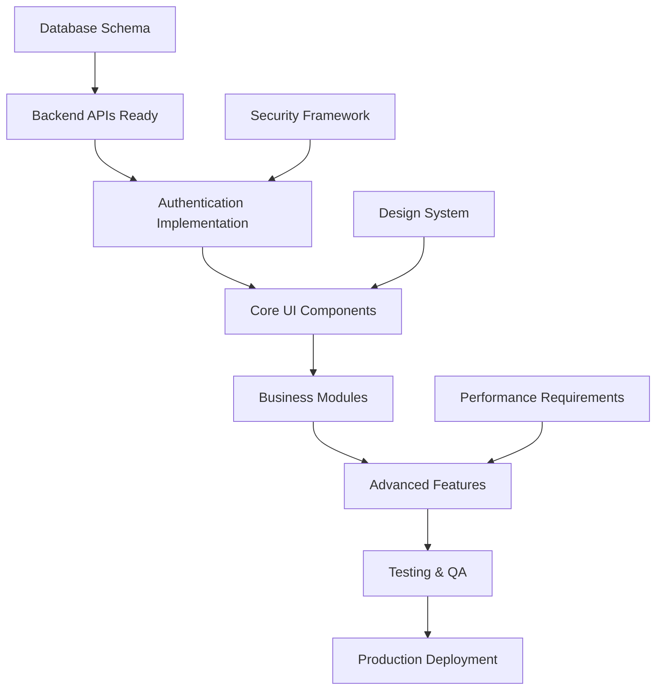
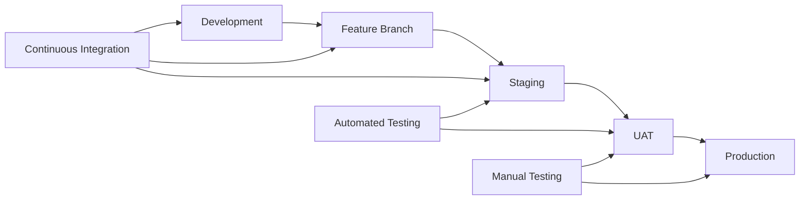

# 🛣️ BCM Platform Frontend Development Roadmap

> **Step-by-step implementation plan with milestones, priorities, and dependencies**

## 📋 Table of Contents

1. [Project Overview](#project-overview)
2. [Phase 1: Foundation Setup](#phase-1-foundation-setup)
3. [Phase 2: Core Business Modules](#phase-2-core-business-modules)
4. [Phase 3: Advanced Features](#phase-3-advanced-features)
5. [Phase 4: Optimization & Polish](#phase-4-optimization--polish)
6. [Dependencies and Prerequisites](#dependencies-and-prerequisites)
7. [Resource Allocation](#resource-allocation)
8. [Risk Mitigation](#risk-mitigation)
9. [Quality Assurance](#quality-assurance)
10. [Deployment Strategy](#deployment-strategy)

---

## 🎯 Project Overview

### Timeline Summary

| Phase | Duration | Key Deliverables | Team Size |
|-------|----------|------------------|-----------|
| **Phase 1** | 4 weeks | Infrastructure, Auth, Basic UI | 3-4 developers |
| **Phase 2** | 8 weeks | Core BCM modules | 4-5 developers |
| **Phase 3** | 8 weeks | Advanced features, AI integration | 5-6 developers |
| **Phase 4** | 4 weeks | Optimization, testing, deployment | 4-5 developers |
| **Total** | **24 weeks** | Complete BCM Platform Frontend | Variable |

### Success Metrics

- **Performance**: < 3 seconds initial load, < 1 second navigation
- **Accessibility**: WCAG 2.1 AA compliance
- **Browser Support**: Chrome 90+, Firefox 88+, Safari 14+, Edge 90+
- **Mobile Responsive**: Works on 320px+ viewports
- **Test Coverage**: 80%+ unit test coverage, 60%+ E2E coverage

---

## 🏗️ Phase 1: Foundation Setup (Weeks 1-4)

### Week 1: Project Infrastructure

#### 🎯 Sprint Goals
- Set up development environment
- Configure build tools and CI/CD pipeline
- Establish code quality standards

#### 📋 Tasks

**Development Environment Setup**
- [ ] Create Vue 3 + TypeScript project with Vite
- [ ] Configure ESLint, Prettier, and Husky hooks
- [ ] Set up Git workflow and branching strategy
- [ ] Configure development Docker containers
- [ ] Set up environment variables and configuration

```bash
# Example setup commands
npm create vue@latest bcm-frontend -- --typescript --router --pinia --eslint --prettier
cd bcm-frontend
npm install
npm install -D @types/node @vitejs/plugin-vue
```

**Code Quality Tools**
- [ ] Configure TypeScript strict mode
- [ ] Set up unit testing with Vitest
- [ ] Configure E2E testing with Cypress
- [ ] Set up Storybook for component documentation
- [ ] Configure bundle analyzer for performance monitoring

**CI/CD Pipeline**
- [ ] Set up GitHub Actions / GitLab CI
- [ ] Configure automated testing pipeline
- [ ] Set up deployment pipeline to staging environment
- [ ] Configure code quality gates

#### 📊 Deliverables
- ✅ Working development environment
- ✅ CI/CD pipeline functioning
- ✅ Code quality tools configured
- ✅ Project documentation structure

#### ⚠️ Risks & Mitigation
- **Risk**: Docker environment issues on different platforms
- **Mitigation**: Provide platform-specific setup guides and fallback local setup

---

### Week 2: Authentication & Authorization

#### 🎯 Sprint Goals
- Implement authentication flow
- Set up role-based access control
- Create secure API communication layer

#### 📋 Tasks

**Authentication Implementation**
- [ ] Create login/logout pages with form validation
- [ ] Implement JWT token management
- [ ] Set up Keycloak integration for SSO
- [ ] Create auth guards for route protection
- [ ] Implement token refresh mechanism

```typescript
// Example auth store structure
export const useAuthStore = defineStore('auth', () => {
  const user = ref<User | null>(null)
  const token = ref<string | null>(null)
  const isAuthenticated = computed(() => !!token.value)

  const login = async (credentials: LoginCredentials) => {
    // Implementation
  }

  const logout = async () => {
    // Implementation
  }

  return { user, token, isAuthenticated, login, logout }
})
```

**API Client Setup**
- [ ] Create Axios-based API client with interceptors
- [ ] Implement request/response error handling
- [ ] Set up automatic token attachment
- [ ] Create retry logic for failed requests
- [ ] Add request/response logging for development

**Role-Based Access Control**
- [ ] Define permission system architecture
- [ ] Create permission checking composables
- [ ] Implement UI element visibility controls
- [ ] Set up route-level access control
- [ ] Create admin-only sections

#### 📊 Deliverables
- ✅ Working authentication system
- ✅ Secure API communication
- ✅ Role-based access controls
- ✅ Protected routes and components

#### ⚠️ Risks & Mitigation
- **Risk**: Keycloak integration complexity
- **Mitigation**: Start with basic JWT auth, add Keycloak in Week 3

---

### Week 3: UI Foundation & Navigation

#### 🎯 Sprint Goals
- Build core UI components
- Implement navigation structure
- Create responsive layout system

#### 📋 Tasks

**Core UI Components**
- [ ] Build design system components (Button, Input, Card, Modal)
- [ ] Create data table component with sorting/filtering
- [ ] Implement form components with validation
- [ ] Build notification/toast system
- [ ] Create loading states and error components

```vue
<!-- Example component structure -->
<template>
  <button :class="buttonClasses" @click="$emit('click')">
    <Icon v-if="icon" :name="icon" />
    <slot />
  </button>
</template>

<script setup lang="ts">
interface Props {
  variant?: 'primary' | 'secondary' | 'outline'
  size?: 'sm' | 'md' | 'lg'
  icon?: string
  loading?: boolean
  disabled?: boolean
}
// Implementation...
</script>
```

**Navigation System**
- [ ] Create responsive sidebar navigation
- [ ] Implement mobile hamburger menu
- [ ] Build breadcrumb navigation
- [ ] Create user profile dropdown
- [ ] Set up notification center

**Layout System**
- [ ] Create main application layout
- [ ] Implement responsive grid system
- [ ] Build page header components
- [ ] Create dashboard layout templates
- [ ] Set up print-friendly styles

#### 📊 Deliverables
- ✅ Complete component library
- ✅ Responsive navigation system
- ✅ Application layout structure
- ✅ Mobile-first responsive design

#### ⚠️ Risks & Mitigation
- **Risk**: Component API changes during development
- **Mitigation**: Lock component interfaces early, use TypeScript for contracts

---

### Week 4: Data Integration & State Management

#### 🎯 Sprint Goals
- Connect to backend APIs
- Implement state management patterns
- Create data fetching strategies

#### 📋 Tasks

**API Integration**
- [ ] Connect to Odoo XML-RPC endpoints
- [ ] Integrate with REST API services
- [ ] Set up real-time WebSocket connections
- [ ] Create API service layer for each module
- [ ] Implement error handling and retry logic

**State Management**
- [ ] Set up Pinia stores for each domain
- [ ] Implement optimistic updates
- [ ] Create data caching strategies
- [ ] Build offline support foundations
- [ ] Set up state persistence

```typescript
// Example store pattern
export const useRiskStore = defineStore('risk', () => {
  const risks = ref<Risk[]>([])
  const loading = ref(false)

  const fetchRisks = async () => {
    loading.value = true
    try {
      risks.value = await riskApi.getAll()
    } finally {
      loading.value = false
    }
  }

  return { risks, loading, fetchRisks }
})
```

**Real-time Features**
- [ ] Implement WebSocket connection management
- [ ] Create event-driven UI updates
- [ ] Build notification system for real-time alerts
- [ ] Set up automatic data synchronization
- [ ] Handle connection loss and reconnection

#### 📊 Deliverables
- ✅ Connected to all backend services
- ✅ Working state management system
- ✅ Real-time data updates
- ✅ Error handling and offline support

#### ⚠️ Risks & Mitigation
- **Risk**: Backend API not ready
- **Mitigation**: Create mock services and API contracts early

---

## 🏢 Phase 2: Core Business Modules (Weeks 5-12)

### Weeks 5-6: Risk Management Module

#### 🎯 Sprint Goals
- Build comprehensive risk management interface
- Implement risk assessment workflows
- Create risk visualization components

#### 📋 Tasks

**Risk Assessment Interface**
- [ ] Create risk registration forms with validation
- [ ] Build risk matrix visualization component
- [ ] Implement risk scoring calculator
- [ ] Create risk categorization interface
- [ ] Build risk timeline and history tracking

**Risk Analysis Features**
- [ ] Integrate Monte Carlo simulation visualization
- [ ] Create AI-powered risk recommendations display
- [ ] Build risk correlation analysis charts
- [ ] Implement FAIR analysis interface
- [ ] Create risk mitigation planning tools

**Data Visualization**
- [ ] Risk heat maps and charts
- [ ] Trend analysis dashboards
- [ ] Risk exposure reporting
- [ ] Comparative risk analysis
- [ ] Executive risk summary views

#### 📊 Deliverables
- ✅ Complete risk management module
- ✅ Interactive risk matrix
- ✅ AI-powered risk insights
- ✅ Comprehensive reporting interface

---

### Weeks 7-8: Business Impact Analysis (BIA)

#### 🎯 Sprint Goals
- Create BIA process management interface
- Build dependency mapping tools
- Implement RTO/RPO optimization features

#### 📋 Tasks

**BIA Process Management**
- [ ] Create business process registration forms
- [ ] Build process dependency mapping interface
- [ ] Implement criticality assessment tools
- [ ] Create impact calculation workflows
- [ ] Build resource requirement planning

**Dependency Visualization**
- [ ] Create interactive dependency maps
- [ ] Build cascade impact analysis
- [ ] Implement critical path visualization
- [ ] Create bottleneck identification tools
- [ ] Build recovery sequence planning

**RTO/RPO Optimization**
- [ ] Create time objective setting interface
- [ ] Build cost-benefit analysis tools
- [ ] Implement optimization recommendations
- [ ] Create scenario-based planning
- [ ] Build compliance checking tools

#### 📊 Deliverables
- ✅ Complete BIA module
- ✅ Interactive dependency mapping
- ✅ RTO/RPO optimization tools
- ✅ Business process registry

---

### Weeks 9-10: Incident Management

#### 🎯 Sprint Goals
- Build incident tracking and response interface
- Create crisis communication tools
- Implement incident analysis features

#### 📋 Tasks

**Incident Tracking**
- [ ] Create incident reporting forms
- [ ] Build incident categorization system
- [ ] Implement severity assessment tools
- [ ] Create incident timeline tracking
- [ ] Build response team coordination

**Crisis Response Interface**
- [ ] Create crisis team activation tools
- [ ] Build communication templates
- [ ] Implement escalation procedures
- [ ] Create status update broadcasting
- [ ] Build recovery progress tracking

**Post-Incident Analysis**
- [ ] Create lessons learned capture
- [ ] Build root cause analysis tools
- [ ] Implement improvement recommendations
- [ ] Create incident metrics dashboard
- [ ] Build trend analysis reporting

#### 📊 Deliverables
- ✅ Complete incident management system
- ✅ Crisis response coordination tools
- ✅ Post-incident analysis capabilities
- ✅ Incident metrics and reporting

---

### Weeks 11-12: Recovery Plans & Templates

#### 🎯 Sprint Goals
- Create plan management interface
- Build template library system
- Implement plan testing and validation

#### 📋 Tasks

**Plan Management**
- [ ] Create plan creation and editing interface
- [ ] Build plan versioning system
- [ ] Implement plan approval workflows
- [ ] Create plan distribution tools
- [ ] Build plan maintenance scheduling

**Template Library**
- [ ] Create template creation interface
- [ ] Build template categorization system
- [ ] Implement template sharing features
- [ ] Create template customization tools
- [ ] Build template version control

**Plan Testing & Validation**
- [ ] Create test scenario builder
- [ ] Build plan execution simulator
- [ ] Implement validation checklists
- [ ] Create testing result tracking
- [ ] Build continuous improvement tools

#### 📊 Deliverables
- ✅ Complete plan management system
- ✅ Template library with sharing
- ✅ Plan testing and validation tools
- ✅ Version control and approval workflows

---

## 🚀 Phase 3: Advanced Features (Weeks 13-20)

### Weeks 13-14: AI Integration & Analytics

#### 🎯 Sprint Goals
- Integrate AI-powered features
- Build advanced analytics dashboards
- Create predictive modeling interfaces

#### 📋 Tasks

**AI Integration**
- [ ] Build AI assistant chat interface
- [ ] Create AI recommendation panels
- [ ] Implement predictive risk modeling
- [ ] Build automated report generation
- [ ] Create AI-powered scenario planning

**Advanced Analytics**
- [ ] Build executive dashboard with KPIs
- [ ] Create trend analysis and forecasting
- [ ] Implement comparative analytics
- [ ] Build custom report builder
- [ ] Create data export and sharing tools

**Predictive Features**
- [ ] Build risk prediction models visualization
- [ ] Create impact forecasting tools
- [ ] Implement early warning systems
- [ ] Build optimization suggestions
- [ ] Create performance benchmarking

#### 📊 Deliverables
- ✅ AI-powered assistant and recommendations
- ✅ Advanced analytics dashboards
- ✅ Predictive modeling interfaces
- ✅ Automated reporting capabilities

---

### Weeks 15-16: Training & Exercise Management

#### 🎯 Sprint Goals
- Build training management system
- Create exercise planning and execution tools
- Implement learning progress tracking

#### 📋 Tasks

**Training Management**
- [ ] Create training course catalog
- [ ] Build learning path management
- [ ] Implement progress tracking
- [ ] Create certification management
- [ ] Build training effectiveness metrics

**Exercise Planning**
- [ ] Create exercise scenario builder
- [ ] Build participant management
- [ ] Implement exercise scheduling
- [ ] Create resource allocation tools
- [ ] Build exercise evaluation forms

**Learning Analytics**
- [ ] Build learning progress dashboards
- [ ] Create competency assessment tools
- [ ] Implement knowledge gap analysis
- [ ] Build training ROI metrics
- [ ] Create personalized learning recommendations

#### 📊 Deliverables
- ✅ Complete training management system
- ✅ Exercise planning and execution tools
- ✅ Learning analytics and tracking
- ✅ Certification and competency management

---

### Weeks 17-18: Compliance & Audit Features

#### 🎯 Sprint Goals
- Build compliance monitoring interface
- Create audit management tools
- Implement regulatory reporting features

#### 📋 Tasks

**Compliance Monitoring**
- [ ] Create compliance framework mapping
- [ ] Build control assessment tools
- [ ] Implement gap analysis features
- [ ] Create compliance dashboards
- [ ] Build regulatory update tracking

**Audit Management**
- [ ] Create audit planning tools
- [ ] Build finding management system
- [ ] Implement corrective action tracking
- [ ] Create audit report generation
- [ ] Build auditor collaboration tools

**Regulatory Reporting**
- [ ] Build automated compliance reports
- [ ] Create regulatory submission tools
- [ ] Implement certification tracking
- [ ] Build evidence collection system
- [ ] Create compliance calendars

#### 📊 Deliverables
- ✅ Complete compliance monitoring system
- ✅ Audit management capabilities
- ✅ Regulatory reporting automation
- ✅ Evidence and certification tracking

---

### Weeks 19-20: Community & Collaboration

#### 🎯 Sprint Goals
- Build knowledge sharing platform
- Create collaboration tools
- Implement community features

#### 📋 Tasks

**Knowledge Sharing**
- [ ] Create knowledge base with search
- [ ] Build article creation and editing
- [ ] Implement community forums
- [ ] Create expert networks
- [ ] Build best practice sharing

**Collaboration Tools**
- [ ] Create team workspaces
- [ ] Build document collaboration
- [ ] Implement commenting and reviews
- [ ] Create notification systems
- [ ] Build activity feeds

**Community Features**
- [ ] Build user profiles and reputation
- [ ] Create community challenges
- [ ] Implement peer learning
- [ ] Build mentorship matching
- [ ] Create community analytics

#### 📊 Deliverables
- ✅ Knowledge sharing platform
- ✅ Collaboration workspace tools
- ✅ Community engagement features
- ✅ Peer learning and mentorship

---

## ✨ Phase 4: Optimization & Polish (Weeks 21-24)

### Week 21: Performance Optimization

#### 🎯 Sprint Goals
- Optimize application performance
- Implement advanced caching strategies
- Reduce bundle size and load times

#### 📋 Tasks

**Performance Optimization**
- [ ] Implement code splitting and lazy loading
- [ ] Optimize bundle size with tree shaking
- [ ] Add service worker for caching
- [ ] Implement virtual scrolling for large lists
- [ ] Optimize images and assets

**Caching Strategies**
- [ ] Implement API response caching
- [ ] Add offline data synchronization
- [ ] Create progressive data loading
- [ ] Build cache invalidation strategies
- [ ] Implement optimistic updates

**Monitoring & Analytics**
- [ ] Add performance monitoring
- [ ] Implement user analytics
- [ ] Create error tracking and reporting
- [ ] Build performance dashboards
- [ ] Set up alerting for performance issues

#### 📊 Deliverables
- ✅ Optimized application performance
- ✅ Advanced caching implementation
- ✅ Performance monitoring system
- ✅ Offline capability support

---

### Week 22: Accessibility & Internationalization

#### 🎯 Sprint Goals
- Ensure WCAG 2.1 AA compliance
- Implement internationalization support
- Create accessibility testing suite

#### 📋 Tasks

**Accessibility Implementation**
- [ ] Add ARIA labels and roles throughout
- [ ] Implement keyboard navigation
- [ ] Ensure proper color contrast
- [ ] Add screen reader support
- [ ] Create accessibility testing tools

**Internationalization**
- [ ] Set up i18n framework
- [ ] Create translation keys and files
- [ ] Implement language switching
- [ ] Add RTL language support
- [ ] Create translation management tools

**Testing & Validation**
- [ ] Run accessibility audits
- [ ] Test with screen readers
- [ ] Validate keyboard navigation
- [ ] Check color contrast ratios
- [ ] Create accessibility documentation

#### 📊 Deliverables
- ✅ WCAG 2.1 AA compliant interface
- ✅ Multi-language support
- ✅ Accessibility testing suite
- ✅ Documentation and guidelines

---

### Week 23: Testing & Quality Assurance

#### 🎯 Sprint Goals
- Comprehensive testing coverage
- Bug fixes and stability improvements
- Security auditing and hardening

#### 📋 Tasks

**Testing Coverage**
- [ ] Achieve 80%+ unit test coverage
- [ ] Complete E2E test scenarios
- [ ] Implement visual regression testing
- [ ] Create performance testing suite
- [ ] Build automated accessibility testing

**Quality Assurance**
- [ ] Conduct comprehensive QA testing
- [ ] Fix identified bugs and issues
- [ ] Optimize error handling
- [ ] Improve user experience flows
- [ ] Validate business requirements

**Security Hardening**
- [ ] Conduct security audit
- [ ] Implement content security policies
- [ ] Add input validation and sanitization
- [ ] Review authentication and authorization
- [ ] Test for common vulnerabilities

#### 📊 Deliverables
- ✅ Comprehensive test suite
- ✅ Bug-free, stable application
- ✅ Security-hardened codebase
- ✅ Quality assurance documentation

---

### Week 24: Deployment & Go-Live

#### 🎯 Sprint Goals
- Deploy to production environment
- Monitor and support go-live
- Document deployment and operations

#### 📋 Tasks

**Production Deployment**
- [ ] Deploy to production environment
- [ ] Configure production monitoring
- [ ] Set up backup and recovery
- [ ] Implement health checks
- [ ] Create deployment documentation

**Go-Live Support**
- [ ] Monitor system performance
- [ ] Provide user support and training
- [ ] Address any critical issues
- [ ] Collect user feedback
- [ ] Plan immediate improvements

**Documentation & Handover**
- [ ] Complete technical documentation
- [ ] Create user manuals and guides
- [ ] Document operational procedures
- [ ] Conduct team knowledge transfer
- [ ] Plan ongoing maintenance

#### 📊 Deliverables
- ✅ Production-ready application
- ✅ Live system with monitoring
- ✅ Complete documentation
- ✅ Support and maintenance plan

---

## 🔄 Dependencies and Prerequisites

### Critical Dependencies



### External Dependencies

| Dependency | Status Required | Impact if Delayed |
|------------|----------------|-------------------|
| **Backend APIs** | Week 2 | High - Blocks all data features |
| **Design System** | Week 3 | Medium - UI consistency issues |
| **Keycloak Setup** | Week 4 | Medium - Auth complexity increase |
| **Production Environment** | Week 23 | High - Deployment delays |

### Internal Dependencies

- **Team Onboarding**: All developers need Vue 3 + TypeScript training
- **Code Review Process**: Established by Week 1
- **Testing Strategy**: Defined by Week 2
- **Deployment Pipeline**: Ready by Week 20

---

## 👥 Resource Allocation

### Team Structure

| Role | Phase 1 | Phase 2 | Phase 3 | Phase 4 |
|------|---------|---------|---------|---------|
| **Frontend Lead** | 1 | 1 | 1 | 1 |
| **Senior Frontend Developer** | 1 | 2 | 2 | 1 |
| **Frontend Developer** | 1 | 2 | 3 | 2 |
| **UI/UX Designer** | 1 | 0.5 | 0.5 | 1 |
| **QA Engineer** | 0.5 | 1 | 1 | 1 |
| **DevOps Engineer** | 0.5 | 0.5 | 0.5 | 1 |

### Skill Requirements

**Frontend Lead**
- 5+ years Vue.js/React experience
- Strong TypeScript and architecture skills
- Experience with large-scale frontend applications
- Team leadership and mentoring capabilities

**Senior Frontend Developer**
- 3+ years modern frontend framework experience
- Proficient in TypeScript, state management, testing
- Experience with API integration and real-time features
- Knowledge of performance optimization

**Frontend Developer**
- 2+ years JavaScript/TypeScript experience
- Familiar with Vue 3, Pinia, and modern tooling
- Basic testing and debugging skills
- Willingness to learn BCM domain knowledge

**UI/UX Designer**
- Experience with enterprise application design
- Proficiency in design systems and component libraries
- Knowledge of accessibility standards
- Experience with user research and testing

---

## ⚠️ Risk Mitigation

### High-Risk Areas

#### 1. Backend API Dependencies
**Risk**: Backend APIs not ready on time
**Probability**: Medium
**Impact**: High
**Mitigation**:
- Create detailed API contracts early
- Build comprehensive mock services
- Implement adapter pattern for easy API switching
- Regular backend team coordination

#### 2. Performance Requirements
**Risk**: Application doesn't meet performance targets
**Probability**: Medium
**Impact**: Medium
**Mitigation**:
- Performance testing from Phase 1
- Regular performance monitoring
- Code splitting and optimization early
- Performance budgets and gates

#### 3. Team Capacity
**Risk**: Team members unavailable or skills gaps
**Probability**: Low
**Impact**: High
**Mitigation**:
- Cross-training on critical components
- Detailed documentation and knowledge sharing
- Buffer time in schedule for learning
- External contractor backup plan

#### 4. Scope Creep
**Risk**: Additional requirements added mid-project
**Probability**: High
**Impact**: Medium
**Mitigation**:
- Clear requirements documentation
- Change request process
- Regular stakeholder reviews
- Flexible architecture for future changes

### Risk Monitoring

| Risk Category | Monitor Weekly | Escalation Threshold |
|---------------|---------------|---------------------|
| **Schedule Delays** | Task completion % | > 20% behind plan |
| **Quality Issues** | Bug count, test coverage | > 50 open bugs |
| **Performance** | Load times, bundle size | > Target + 20% |
| **Team Capacity** | Available hours, blockers | > 2 team members blocked |

---

## 🧪 Quality Assurance

### Testing Strategy

#### Unit Testing (Target: 80% coverage)
- Component testing with Vue Test Utils
- Store logic testing with Pinia Testing
- Utility function testing
- Mock external dependencies

```typescript
// Example test structure
describe('RiskList Component', () => {
  it('should display risks correctly', () => {
    const wrapper = mount(RiskList, {
      props: { risks: mockRisks }
    })
    expect(wrapper.findAll('.risk-item')).toHaveLength(mockRisks.length)
  })

  it('should handle risk selection', async () => {
    const wrapper = mount(RiskList)
    await wrapper.find('.risk-item').trigger('click')
    expect(wrapper.emitted('select')).toBeTruthy()
  })
})
```

#### Integration Testing (Target: 60% coverage)
- API integration testing
- Store integration testing
- Route navigation testing
- Authentication flow testing

#### E2E Testing (Target: Critical paths)
- User authentication flow
- Risk creation and management
- Incident reporting workflow
- Dashboard navigation and interaction

```typescript
// Example E2E test
describe('Risk Management Flow', () => {
  it('should create and manage risks', () => {
    cy.login('manager@company.com')
    cy.visit('/modules/risk')
    cy.get('[data-cy=create-risk]').click()
    cy.get('[data-cy=risk-name]').type('New Cyber Risk')
    cy.get('[data-cy=save-risk]').click()
    cy.contains('Risk created successfully')
  })
})
```

### Code Quality Gates

#### Pre-commit Checks
- ESLint and Prettier formatting
- TypeScript compilation
- Unit test execution
- Commit message validation

#### Pull Request Requirements
- Code review by senior developer
- All tests passing
- No console.log or debugger statements
- Performance impact assessment

#### Release Criteria
- 80%+ unit test coverage
- All E2E tests passing
- No critical or high-severity bugs
- Performance benchmarks met
- Accessibility audit passed

---

## 🚀 Deployment Strategy

### Environment Strategy



### Deployment Pipeline

#### 1. Development Environment
- **Purpose**: Local development and testing
- **Deployment**: Docker Compose with hot reload
- **Data**: Mock data and local test database
- **Monitoring**: Console logging and Vue DevTools

#### 2. Staging Environment
- **Purpose**: Integration testing and QA validation
- **Deployment**: Automated deployment on merge to develop
- **Data**: Sanitized production-like data
- **Monitoring**: Full monitoring stack

#### 3. User Acceptance Testing (UAT)
- **Purpose**: Business user validation
- **Deployment**: Manual deployment from staging
- **Data**: Production-like test scenarios
- **Monitoring**: User activity tracking

#### 4. Production Environment
- **Purpose**: Live system for end users
- **Deployment**: Blue-green deployment strategy
- **Data**: Production data with full backups
- **Monitoring**: Comprehensive monitoring and alerting

### Release Process

#### Pre-release Checklist
- [ ] All tests passing
- [ ] Performance benchmarks met
- [ ] Security scan completed
- [ ] Documentation updated
- [ ] Rollback plan prepared

#### Deployment Steps
1. **Pre-deployment**: Backup current version
2. **Deploy**: Blue-green deployment with health checks
3. **Verify**: Smoke tests and health validation
4. **Monitor**: Real-time monitoring for issues
5. **Rollback**: If issues detected, immediate rollback

#### Post-deployment
- Monitor system health for 24 hours
- Collect user feedback and metrics
- Address any critical issues immediately
- Plan next iteration improvements

---

## 📈 Success Metrics and KPIs

### Technical Metrics

| Metric | Target | Measurement |
|--------|---------|-------------|
| **Initial Load Time** | < 3 seconds | Lighthouse/WebPageTest |
| **Navigation Speed** | < 1 second | Custom timing API |
| **Bundle Size** | < 500KB initial | Webpack Bundle Analyzer |
| **Test Coverage** | > 80% | Jest/Vitest coverage |
| **Accessibility Score** | > 95 | Lighthouse accessibility |

### Business Metrics

| Metric | Target | Measurement |
|--------|---------|-------------|
| **User Adoption** | > 90% active users | Analytics tracking |
| **Task Completion Rate** | > 85% | User flow analytics |
| **User Satisfaction** | > 4.5/5 rating | User surveys |
| **Support Tickets** | < 5 per week | Support system |
| **Training Completion** | < 2 hours | Learning management |

### Project Metrics

| Metric | Target | Measurement |
|--------|---------|-------------|
| **On-time Delivery** | 100% phases | Project tracking |
| **Budget Adherence** | Within 10% | Cost tracking |
| **Quality Gates** | 100% passed | Quality dashboard |
| **Team Velocity** | Stable sprint-to-sprint | Agile metrics |
| **Code Reviews** | 100% coverage | Git analytics |

---

**🎯 This roadmap provides a comprehensive, achievable plan for delivering a world-class BCM Platform frontend that meets all business requirements while maintaining high standards for performance, accessibility, and user experience.**