# 🔄 BCM Platform Business Process Flows

> **How business logic translates to frontend requirements and user experience design**

## 📋 Table of Contents

1. [Business Process Overview](#business-process-overview)
2. [User Journey Mapping](#user-journey-mapping)
3. [Critical Business Workflows](#critical-business-workflows)
4. [Data Flow Requirements](#data-flow-requirements)
5. [Integration Touch Points](#integration-touch-points)
6. [Compliance and Audit Flows](#compliance-and-audit-flows)
7. [Real-time Business Events](#real-time-business-events)
8. [Frontend Implementation Patterns](#frontend-implementation-patterns)

---

## 🎯 Business Process Overview

### BCM Lifecycle Integration

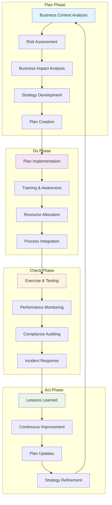

### Frontend Module Mapping

| Business Process | Primary Frontend Module | Supporting Modules |
|------------------|-------------------------|-------------------|
| **Context Analysis** | Organization Context | BCM Core, Configuration |
| **Risk Assessment** | Risk Management | AI Assistant, Analytics |
| **BIA Execution** | Business Impact Analysis | Plans, Templates |
| **Plan Development** | Recovery Plans | Templates, Governance |
| **Training Programs** | Training & Awareness | Community, Exercises |
| **Exercise Management** | Exercises & Testing | Scenarios, AI Hub |
| **Incident Response** | Incident Management | Plans, Communication |
| **Compliance Monitoring** | Audit & Compliance | Reporting, Governance |

---

## 👤 User Journey Mapping

### 1. BCM Manager - Strategic Planning Journey

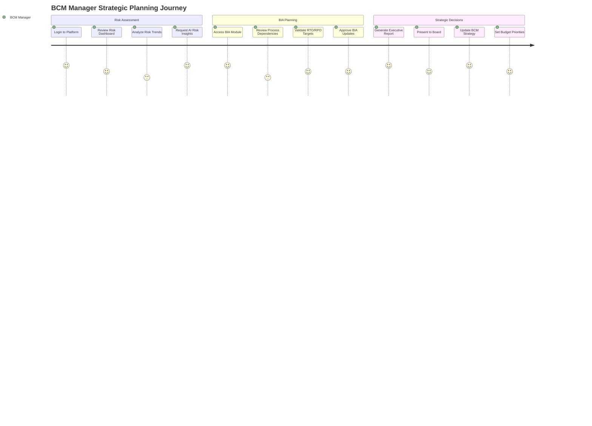

**Frontend Requirements:**
- Executive dashboard with high-level KPIs
- One-click drill-down to detailed analysis
- Mobile-responsive design for board presentations
- Export capabilities for external sharing
- AI-powered insight summaries

### 2. Risk Manager - Risk Assessment Journey

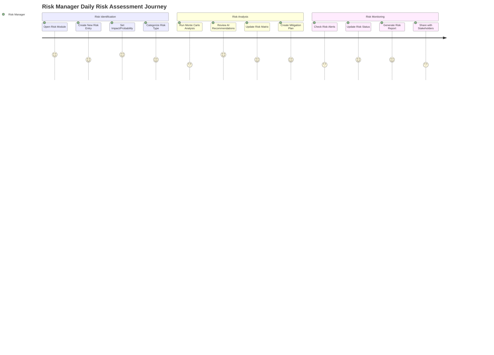

**Frontend Requirements:**
- Interactive risk matrix with drag-and-drop
- Advanced analytics and visualization tools
- Real-time risk threshold alerting
- Collaborative mitigation planning interface
- Automated report generation

### 3. Incident Commander - Crisis Response Journey

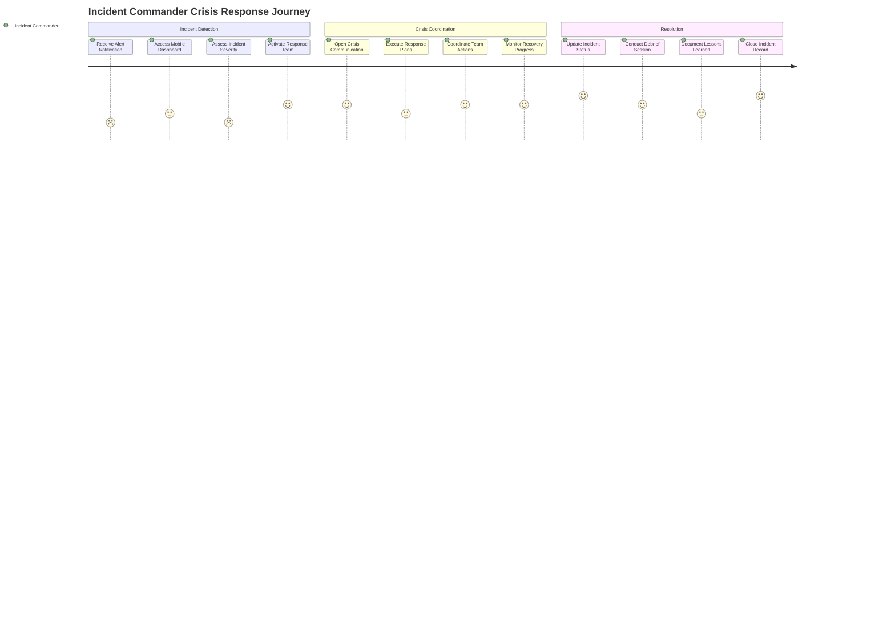

**Frontend Requirements:**
- Mobile-first crisis interface
- One-touch team activation
- Real-time status dashboards
- Voice/video integration capabilities
- Offline mode for crisis situations

---

## ⚡ Critical Business Workflows

### 1. Risk Assessment Workflow

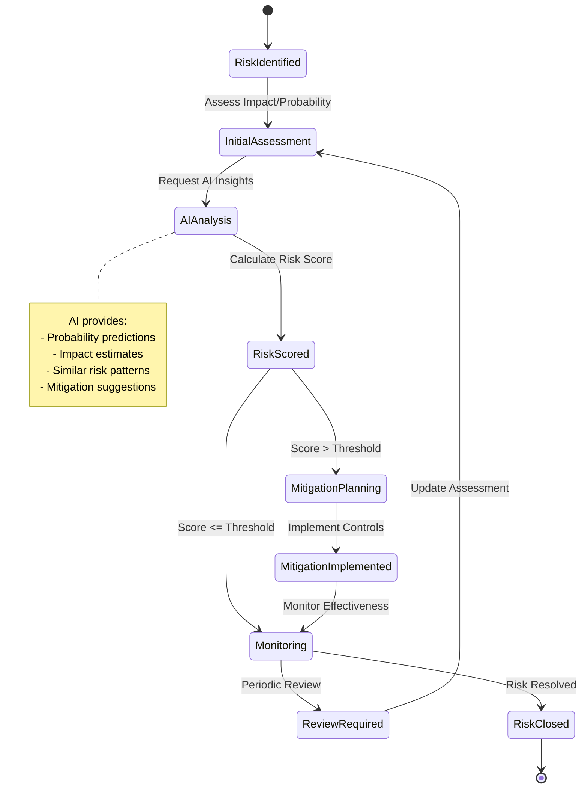

**Frontend Implementation:**

```vue
<!-- RiskAssessmentWorkflow.vue -->
<template>
  <div class="risk-workflow">
    <!-- Workflow Progress -->
    <WorkflowProgress
      :steps="workflowSteps"
      :current-step="currentStep"
      @step-click="handleStepNavigation"
    />

    <!-- Dynamic Form Based on Step -->
    <component
      :is="currentStepComponent"
      :risk="risk"
      :ai-insights="aiInsights"
      @next="handleNextStep"
      @previous="handlePreviousStep"
      @save="handleSave"
    />

    <!-- AI Insights Panel -->
    <AIInsightsPanel
      v-if="showAIInsights"
      :insights="aiInsights"
      :loading="aiLoading"
      @apply-suggestion="handleAISuggestion"
    />
  </div>
</template>

<script setup lang="ts">
const workflowSteps = [
  { id: 'identification', title: 'Risk Identification', component: 'RiskIdentificationForm' },
  { id: 'assessment', title: 'Initial Assessment', component: 'RiskAssessmentForm' },
  { id: 'analysis', title: 'AI Analysis', component: 'AIAnalysisView' },
  { id: 'scoring', title: 'Risk Scoring', component: 'RiskScoringForm' },
  { id: 'mitigation', title: 'Mitigation Planning', component: 'MitigationPlanForm' }
]

const currentStep = ref(0)
const risk = ref<Risk>({})
const aiInsights = ref(null)

// Workflow navigation logic
const handleNextStep = async () => {
  if (currentStep.value === 1) {
    // Trigger AI analysis after initial assessment
    await requestAIAnalysis()
  }
  currentStep.value++
}

const requestAIAnalysis = async () => {
  aiLoading.value = true
  try {
    aiInsights.value = await aiService.analyzeRisk(risk.value)
  } finally {
    aiLoading.value = false
  }
}
</script>
```

### 2. Business Impact Analysis Workflow

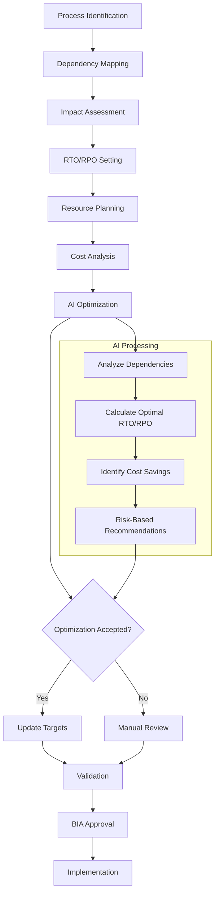

**Frontend Implementation:**

```typescript
// BIA Workflow Composable
export function useBIAWorkflow() {
  const currentProcess = ref<BIAProcess | null>(null)
  const dependencies = ref<ProcessDependency[]>([])
  const aiOptimizations = ref<OptimizationSuggestion[]>([])

  const analyzeDependencies = async (processId: number) => {
    // Fetch and visualize process dependencies
    dependencies.value = await biaApi.getProcessDependencies(processId)

    // Generate dependency visualization data
    return {
      nodes: dependencies.value.map(dep => ({
        id: dep.id,
        label: dep.name,
        type: dep.type,
        criticality: dep.criticality
      })),
      edges: dependencies.value.flatMap(dep =>
        dep.connections.map(conn => ({
          from: dep.id,
          to: conn.targetId,
          type: conn.type,
          impact: conn.impact
        }))
      )
    }
  }

  const optimizeRTORPO = async (constraints: OptimizationConstraints) => {
    aiOptimizations.value = await aiService.optimizeRTORPO({
      processId: currentProcess.value?.id,
      constraints,
      riskTolerance: constraints.riskTolerance
    })

    return aiOptimizations.value
  }

  const applyOptimization = async (optimization: OptimizationSuggestion) => {
    if (currentProcess.value) {
      currentProcess.value.rto = optimization.recommendedRTO
      currentProcess.value.rpo = optimization.recommendedRPO
      currentProcess.value.estimatedCost = optimization.estimatedCost

      await biaApi.updateProcess(currentProcess.value.id, currentProcess.value)
    }
  }

  return {
    currentProcess,
    dependencies,
    aiOptimizations,
    analyzeDependencies,
    optimizeRTORPO,
    applyOptimization
  }
}
```

### 3. Incident Response Workflow

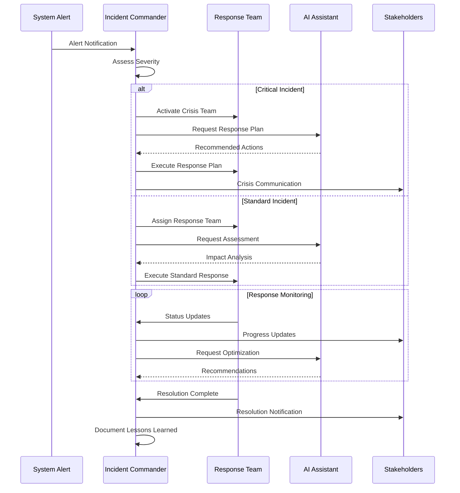

**Frontend Implementation:**

```vue
<!-- IncidentResponseDashboard.vue -->
<template>
  <div class="incident-response-dashboard">
    <!-- Crisis Mode Toggle -->
    <div v-if="incident.severity === 'critical'" class="crisis-mode">
      <div class="crisis-header">
        <Icon name="alert-triangle" class="h-8 w-8 text-red-500 animate-pulse" />
        <h1 class="text-2xl font-bold text-red-700">CRISIS MODE ACTIVE</h1>
      </div>

      <!-- Quick Actions for Crisis -->
      <div class="crisis-actions">
        <Button
          variant="danger"
          size="lg"
          icon="users"
          @click="activateCrisisTeam"
        >
          Activate Crisis Team
        </Button>
        <Button
          variant="danger"
          size="lg"
          icon="megaphone"
          @click="initiateEmergencyComms"
        >
          Emergency Communications
        </Button>
      </div>
    </div>

    <!-- Response Timeline -->
    <IncidentTimeline
      :events="incident.timeline"
      :realtime="true"
      @add-update="handleTimelineUpdate"
    />

    <!-- Team Coordination -->
    <ResponseTeamPanel
      :team="responseTeam"
      :tasks="assignedTasks"
      @assign-task="handleTaskAssignment"
    />

    <!-- AI Recommendations -->
    <AIRecommendationsPanel
      :incident="incident"
      :recommendations="aiRecommendations"
      @apply-recommendation="handleAIRecommendation"
    />

    <!-- Real-time Metrics -->
    <IncidentMetrics
      :downtime="incident.downtime"
      :affected-users="incident.affectedUsers"
      :estimated-impact="incident.estimatedImpact"
    />
  </div>
</template>

<script setup lang="ts">
interface Props {
  incidentId: number
}

const props = defineProps<Props>()

const incident = ref<Incident>({})
const responseTeam = ref<ResponseTeamMember[]>([])
const aiRecommendations = ref<AIRecommendation[]>([])

const { subscribe } = useRealtime()

// Real-time incident updates
subscribe(`incident.${props.incidentId}.updated`, (updatedIncident) => {
  incident.value = updatedIncident
})

subscribe(`incident.${props.incidentId}.team_message`, (message) => {
  // Handle team communication updates
  handleTeamMessage(message)
})

const activateCrisisTeam = async () => {
  await incidentApi.activateCrisisTeam(props.incidentId)
  // Trigger notifications to crisis team members
}

const initiateEmergencyComms = () => {
  // Open emergency communication center
  router.push(`/incidents/${props.incidentId}/communications`)
}
</script>
```

---

## 📊 Data Flow Requirements

### 1. Cross-Module Data Dependencies

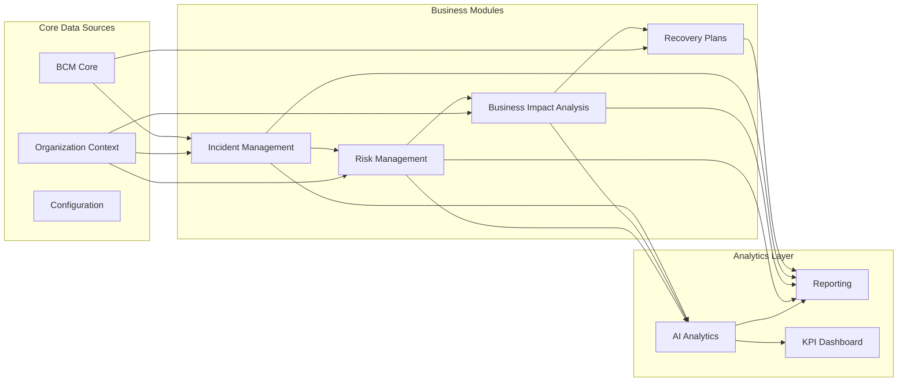

### 2. Data Synchronization Patterns

```typescript
// Data Sync Service
export class DataSyncService {
  private syncQueue = new Map<string, SyncOperation>()
  private conflictResolver = new ConflictResolver()

  async syncModuleData(moduleId: string, data: any) {
    const operation: SyncOperation = {
      id: generateId(),
      moduleId,
      data,
      timestamp: Date.now(),
      status: 'pending'
    }

    this.syncQueue.set(operation.id, operation)

    try {
      // Validate data consistency
      await this.validateDataConsistency(moduleId, data)

      // Sync with backend
      await this.performSync(operation)

      // Update dependent modules
      await this.updateDependentModules(moduleId, data)

      operation.status = 'completed'
    } catch (error) {
      operation.status = 'failed'
      operation.error = error.message

      // Handle conflicts or retry
      await this.handleSyncError(operation, error)
    }
  }

  private async validateDataConsistency(moduleId: string, data: any) {
    const validators = {
      'risk': this.validateRiskData,
      'bia': this.validateBIAData,
      'incident': this.validateIncidentData
    }

    const validator = validators[moduleId]
    if (validator) {
      await validator(data)
    }
  }

  private async updateDependentModules(moduleId: string, data: any) {
    const dependencies = {
      'risk': ['bia', 'incident', 'plans'],
      'bia': ['plans', 'risk'],
      'incident': ['risk', 'plans']
    }

    const dependents = dependencies[moduleId] || []

    for (const dependent of dependents) {
      await this.notifyModuleUpdate(dependent, moduleId, data)
    }
  }
}
```

### 3. Real-time Data Flow

```typescript
// Real-time Data Manager
export class RealTimeDataManager {
  private eventBus = useEventBus()
  private dataStores = new Map<string, any>()

  constructor() {
    this.setupEventListeners()
  }

  private setupEventListeners() {
    // Risk updates affecting BIA
    this.eventBus.subscribe('risk.updated', (risk: Risk) => {
      this.propagateRiskUpdate(risk)
    })

    // BIA updates affecting plans
    this.eventBus.subscribe('bia.process.updated', (process: BIAProcess) => {
      this.propagateBIAUpdate(process)
    })

    // Incident updates affecting risk assessment
    this.eventBus.subscribe('incident.resolved', (incident: Incident) => {
      this.updateRiskFromIncident(incident)
    })
  }

  private async propagateRiskUpdate(risk: Risk) {
    // Update BIA risk factors
    const biaStore = useBIAStore()
    await biaStore.updateRiskFactors(risk)

    // Update plan activation triggers
    const planStore = usePlanStore()
    await planStore.updateActivationTriggers(risk)

    // Notify AI for reanalysis
    this.eventBus.publish('ai.reanalyze_required', {
      type: 'risk_change',
      entityId: risk.id,
      affectedModules: ['bia', 'plans']
    })
  }
}
```

---

## 🔗 Integration Touch Points

### 1. AI Service Integration Points

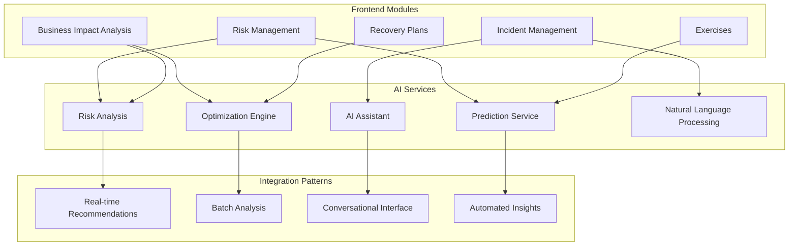

**Frontend Implementation:**

```typescript
// AI Integration Service
export class AIIntegrationService {
  private aiClient = new AIClient()
  private chatHistory = new Map<string, ChatMessage[]>()

  // Real-time AI recommendations
  async getRealtimeRecommendations(context: AIContext): Promise<Recommendation[]> {
    const stream = await this.aiClient.streamRecommendations(context)

    return new Promise((resolve) => {
      const recommendations: Recommendation[] = []

      stream.on('recommendation', (rec: Recommendation) => {
        recommendations.push(rec)
        // Update UI immediately
        this.updateRecommendationUI(rec)
      })

      stream.on('complete', () => {
        resolve(recommendations)
      })
    })
  }

  // Conversational AI interface
  async chatWithAI(message: string, context: ChatContext): Promise<ChatResponse> {
    const history = this.chatHistory.get(context.sessionId) || []

    const response = await this.aiClient.chat({
      message,
      history,
      context: {
        module: context.module,
        entityId: context.entityId,
        userRole: context.userRole
      }
    })

    // Update chat history
    history.push(
      { role: 'user', content: message, timestamp: Date.now() },
      { role: 'assistant', content: response.message, timestamp: Date.now() }
    )
    this.chatHistory.set(context.sessionId, history)

    return response
  }

  // Batch analysis for large datasets
  async requestBatchAnalysis(analysisType: AnalysisType, data: any[]): Promise<string> {
    const jobId = await this.aiClient.submitBatchJob({
      type: analysisType,
      data,
      priority: 'normal'
    })

    // Poll for completion or use WebSocket for updates
    this.monitorBatchJob(jobId)

    return jobId
  }

  private monitorBatchJob(jobId: string) {
    const { subscribe } = useRealtime()

    subscribe(`ai.batch.${jobId}.progress`, (progress: BatchProgress) => {
      this.updateBatchProgress(jobId, progress)
    })

    subscribe(`ai.batch.${jobId}.completed`, (results: BatchResults) => {
      this.handleBatchCompletion(jobId, results)
    })
  }
}
```

### 2. External System Integration

```typescript
// External Integration Manager
export class ExternalIntegrationManager {
  private integrations = new Map<string, IntegrationAdapter>()

  constructor() {
    this.setupIntegrations()
  }

  private setupIntegrations() {
    // Grafana integration for monitoring
    this.integrations.set('grafana', new GrafanaAdapter({
      baseUrl: process.env.VITE_GRAFANA_URL,
      apiKey: process.env.VITE_GRAFANA_API_KEY
    }))

    // TheHive integration for incident management
    this.integrations.set('thehive', new TheHiveAdapter({
      baseUrl: process.env.VITE_THEHIVE_URL,
      apiKey: process.env.VITE_THEHIVE_API_KEY
    }))

    // MISP integration for threat intelligence
    this.integrations.set('misp', new MISPAdapter({
      baseUrl: process.env.VITE_MISP_URL,
      apiKey: process.env.VITE_MISP_API_KEY
    }))
  }

  async getMonitoringDashboard(dashboardId: string): Promise<DashboardData> {
    const grafana = this.integrations.get('grafana') as GrafanaAdapter
    return await grafana.getDashboard(dashboardId)
  }

  async createIncidentInTheHive(incident: Incident): Promise<TheHiveCase> {
    const thehive = this.integrations.get('thehive') as TheHiveAdapter
    return await thehive.createCase({
      title: incident.title,
      description: incident.description,
      severity: this.mapSeverity(incident.severity),
      tags: incident.tags
    })
  }

  async getThreatIntelligence(ioc: string): Promise<ThreatData> {
    const misp = this.integrations.get('misp') as MISPAdapter
    return await misp.searchAttributes(ioc)
  }
}
```

---

## 📋 Compliance and Audit Flows

### 1. ISO 22301 Compliance Workflow

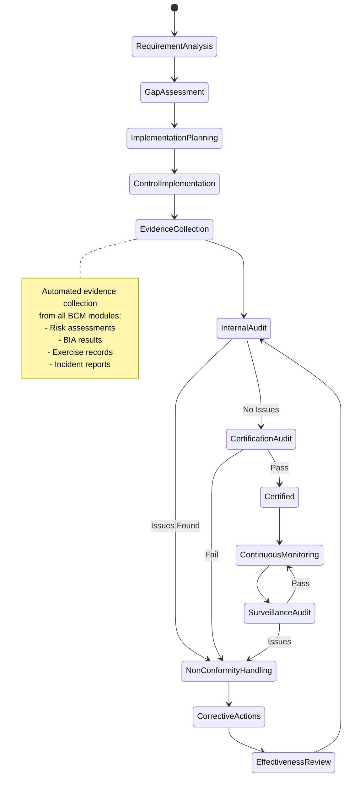

**Frontend Implementation:**

```vue
<!-- ComplianceWorkflow.vue -->
<template>
  <div class="compliance-workflow">
    <!-- Compliance Dashboard -->
    <ComplianceDashboard
      :overall-score="complianceScore"
      :requirements="iso22301Requirements"
      :gaps="identifiedGaps"
    />

    <!-- Requirement Details -->
    <div class="requirements-grid">
      <RequirementCard
        v-for="requirement in iso22301Requirements"
        :key="requirement.id"
        :requirement="requirement"
        :evidence="getEvidence(requirement.id)"
        :status="getComplianceStatus(requirement.id)"
        @view-evidence="handleViewEvidence"
        @collect-evidence="handleCollectEvidence"
      />
    </div>

    <!-- Evidence Collection Panel -->
    <EvidenceCollectionPanel
      v-if="showEvidencePanel"
      :requirement="selectedRequirement"
      :available-evidence="availableEvidence"
      @evidence-selected="handleEvidenceSelection"
    />

    <!-- Audit Trail -->
    <AuditTrail
      :activities="auditActivities"
      :filters="auditFilters"
      @filter-change="handleAuditFilter"
    />
  </div>
</template>

<script setup lang="ts">
const complianceScore = ref(0)
const iso22301Requirements = ref<ComplianceRequirement[]>([])
const identifiedGaps = ref<ComplianceGap[]>([])
const auditActivities = ref<AuditActivity[]>([])

// Automated evidence collection
const collectEvidenceAutomatically = async () => {
  const evidenceCollector = new AutomatedEvidenceCollector()

  // Collect from Risk Management
  const riskEvidence = await evidenceCollector.collectFromModule('risk', {
    requirements: ['4.3.3', '6.2', '8.4.2'],
    criteria: 'risk_assessments_completed'
  })

  // Collect from BIA
  const biaEvidence = await evidenceCollector.collectFromModule('bia', {
    requirements: ['4.3.2', '5.4', '8.2.2'],
    criteria: 'bia_completed_annually'
  })

  // Collect from Exercise Management
  const exerciseEvidence = await evidenceCollector.collectFromModule('exercises', {
    requirements: ['8.5', '9.1.2'],
    criteria: 'exercises_conducted_planned'
  })

  return { riskEvidence, biaEvidence, exerciseEvidence }
}
</script>
```

### 2. Audit Management Process

```typescript
// Audit Management Service
export class AuditManagementService {
  async createAuditPlan(auditScope: AuditScope): Promise<AuditPlan> {
    // Generate audit plan based on compliance requirements
    const requirements = await this.getApplicableRequirements(auditScope)

    const auditPlan: AuditPlan = {
      id: generateId(),
      scope: auditScope,
      requirements: requirements,
      plannedStartDate: auditScope.startDate,
      plannedEndDate: auditScope.endDate,
      auditors: auditScope.auditors,
      auditeeOrganization: auditScope.organization,
      checklistItems: await this.generateChecklist(requirements),
      evidenceRequirements: await this.determineEvidenceRequirements(requirements)
    }

    return auditPlan
  }

  async conductAuditInterview(auditId: string, interviewData: InterviewData): Promise<InterviewRecord> {
    // Record audit interview with evidence capture
    const interview: InterviewRecord = {
      id: generateId(),
      auditId,
      interviewee: interviewData.interviewee,
      interviewer: interviewData.interviewer,
      questions: interviewData.questions,
      responses: interviewData.responses,
      evidenceCollected: [],
      timestamp: Date.now()
    }

    // Automatically link to relevant system evidence
    interview.evidenceCollected = await this.linkSystemEvidence(interview)

    return interview
  }

  async generateAuditReport(auditId: string): Promise<AuditReport> {
    const audit = await this.getAudit(auditId)
    const findings = await this.consolidateFindings(auditId)
    const recommendations = await this.generateRecommendations(findings)

    return {
      id: generateId(),
      auditId,
      executiveSummary: await this.generateExecutiveSummary(audit, findings),
      findings: findings,
      recommendations: recommendations,
      nonConformities: findings.filter(f => f.type === 'non_conformity'),
      observations: findings.filter(f => f.type === 'observation'),
      strengths: findings.filter(f => f.type === 'strength'),
      overallConclusion: await this.determineOverallConclusion(findings),
      certificationRecommendation: await this.determineCertificationRecommendation(findings)
    }
  }
}
```

---

## ⚡ Real-time Business Events

### 1. Critical Event Processing

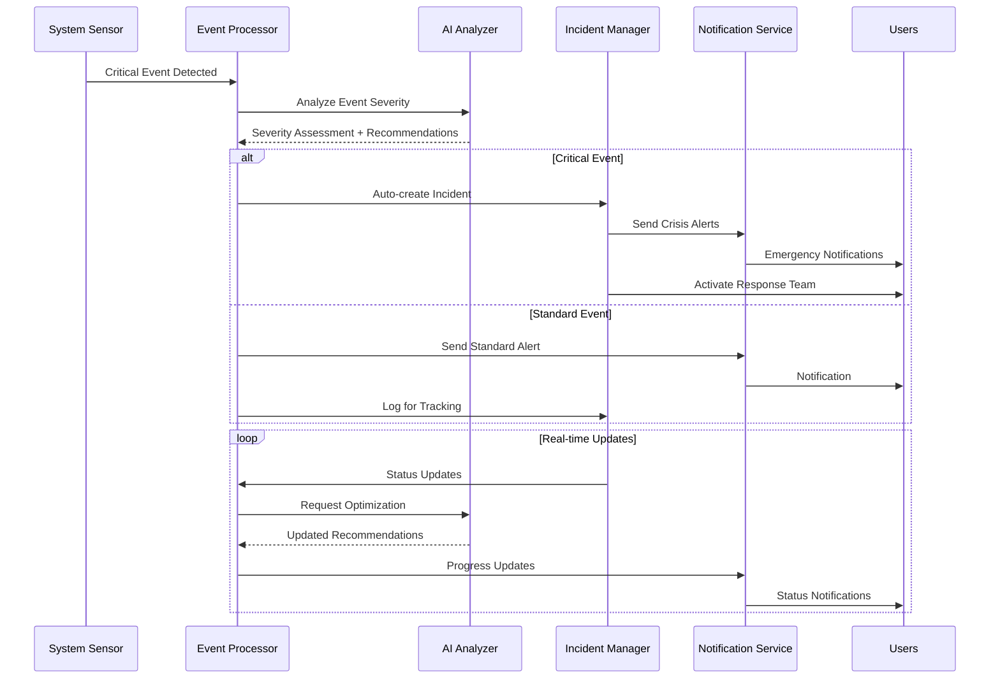

**Frontend Implementation:**

```typescript
// Real-time Event Manager
export class RealTimeEventManager {
  private eventProcessors = new Map<string, EventProcessor>()
  private notificationService = new NotificationService()

  constructor() {
    this.setupEventProcessors()
    this.connectToEventStream()
  }

  private setupEventProcessors() {
    // System monitoring events
    this.eventProcessors.set('system.threshold_exceeded', new ThresholdEventProcessor())
    this.eventProcessors.set('system.service_down', new ServiceDownProcessor())

    // Business events
    this.eventProcessors.set('risk.threshold_exceeded', new RiskThresholdProcessor())
    this.eventProcessors.set('incident.severity_escalated', new IncidentEscalationProcessor())
    this.eventProcessors.set('bia.rto_exceeded', new RTOExceededProcessor())
  }

  private connectToEventStream() {
    const { subscribe } = useRealtime()

    // Subscribe to all critical events
    subscribe('system.*', (event) => this.processEvent(event))
    subscribe('business.*', (event) => this.processEvent(event))
    subscribe('ai.*', (event) => this.processEvent(event))
  }

  private async processEvent(event: BusinessEvent) {
    const processor = this.eventProcessors.get(event.type)
    if (!processor) {
      console.warn(`No processor found for event type: ${event.type}`)
      return
    }

    try {
      const result = await processor.process(event)

      // Handle different result types
      switch (result.action) {
        case 'create_incident':
          await this.createIncidentFromEvent(event, result.metadata)
          break

        case 'notify_users':
          await this.notifyUsers(result.recipients, result.message, result.urgency)
          break

        case 'update_dashboard':
          await this.updateDashboards(result.dashboardUpdates)
          break

        case 'trigger_automation':
          await this.triggerAutomation(result.automationId, result.parameters)
          break
      }

      // Log event processing for audit trail
      await this.logEventProcessing(event, result)

    } catch (error) {
      console.error(`Error processing event ${event.type}:`, error)
      await this.handleEventProcessingError(event, error)
    }
  }

  private async createIncidentFromEvent(event: BusinessEvent, metadata: any) {
    const incidentData = {
      title: `Auto-created: ${event.description}`,
      description: `Incident automatically created from ${event.type} event`,
      severity: this.mapEventSeverityToIncident(event.severity),
      source: 'automated_system',
      eventId: event.id,
      detectedAt: event.timestamp,
      affectedSystems: metadata.affectedSystems || [],
      estimatedImpact: metadata.estimatedImpact || 'unknown'
    }

    const incident = await incidentApi.create(incidentData)

    // Notify incident commanders
    await this.notificationService.notifyIncidentCommanders(incident)

    return incident
  }
}
```

### 2. Business Event Dashboard

```vue
<!-- RealTimeEventDashboard.vue -->
<template>
  <div class="event-dashboard">
    <!-- Event Stream -->
    <div class="event-stream">
      <h3>Live Event Stream</h3>
      <div class="event-list">
        <EventCard
          v-for="event in recentEvents"
          :key="event.id"
          :event="event"
          :realtime="true"
          @action="handleEventAction"
        />
      </div>
    </div>

    <!-- Event Analytics -->
    <div class="event-analytics">
      <h3>Event Analytics</h3>
      <EventMetrics
        :metrics="eventMetrics"
        :timeframe="selectedTimeframe"
        @timeframe-change="handleTimeframeChange"
      />

      <EventTrendChart
        :data="eventTrendData"
        :categories="eventCategories"
      />
    </div>

    <!-- Active Alerts -->
    <div class="active-alerts">
      <h3>Active Alerts</h3>
      <AlertCard
        v-for="alert in activeAlerts"
        :key="alert.id"
        :alert="alert"
        @acknowledge="handleAlertAcknowledge"
        @escalate="handleAlertEscalate"
        @resolve="handleAlertResolve"
      />
    </div>

    <!-- Event Processing Rules -->
    <div class="processing-rules">
      <h3>Event Processing Rules</h3>
      <RuleEditor
        :rules="processingRules"
        @rule-updated="handleRuleUpdate"
        @rule-created="handleRuleCreate"
      />
    </div>
  </div>
</template>

<script setup lang="ts">
const recentEvents = ref<BusinessEvent[]>([])
const activeAlerts = ref<Alert[]>([])
const eventMetrics = ref<EventMetrics>({})
const processingRules = ref<ProcessingRule[]>([])

const { subscribe } = useRealtime()

// Real-time event updates
subscribe('event.*', (event: BusinessEvent) => {
  recentEvents.value.unshift(event)
  // Keep only last 100 events for performance
  if (recentEvents.value.length > 100) {
    recentEvents.value = recentEvents.value.slice(0, 100)
  }

  updateEventMetrics(event)
})

subscribe('alert.*', (alert: Alert) => {
  const existingIndex = activeAlerts.value.findIndex(a => a.id === alert.id)
  if (existingIndex >= 0) {
    activeAlerts.value[existingIndex] = alert
  } else {
    activeAlerts.value.push(alert)
  }
})

const handleEventAction = async (action: string, event: BusinessEvent) => {
  switch (action) {
    case 'create_incident':
      await createIncidentFromEvent(event)
      break
    case 'mark_false_positive':
      await markEventAsFalsePositive(event)
      break
    case 'add_to_knowledge_base':
      await addEventToKnowledgeBase(event)
      break
  }
}

const updateEventMetrics = (event: BusinessEvent) => {
  eventMetrics.value.totalEvents = (eventMetrics.value.totalEvents || 0) + 1
  eventMetrics.value.eventsByType = {
    ...eventMetrics.value.eventsByType,
    [event.type]: (eventMetrics.value.eventsByType?.[event.type] || 0) + 1
  }
  eventMetrics.value.eventsBySeverity = {
    ...eventMetrics.value.eventsBySeverity,
    [event.severity]: (eventMetrics.value.eventsBySeverity?.[event.severity] || 0) + 1
  }
}
</script>
```

---

## 🛠️ Frontend Implementation Patterns

### 1. Business Rule Engine

```typescript
// Business Rule Engine for Frontend
export class BusinessRuleEngine {
  private rules = new Map<string, BusinessRule[]>()
  private ruleEvaluator = new RuleEvaluator()

  async evaluateRules(context: RuleContext): Promise<RuleResult[]> {
    const applicableRules = this.getApplicableRules(context)
    const results: RuleResult[] = []

    for (const rule of applicableRules) {
      try {
        const result = await this.ruleEvaluator.evaluate(rule, context)
        results.push(result)

        // Execute actions if rule passes
        if (result.passed) {
          await this.executeRuleActions(rule.actions, context)
        }
      } catch (error) {
        console.error(`Error evaluating rule ${rule.id}:`, error)
        results.push({
          ruleId: rule.id,
          passed: false,
          error: error.message
        })
      }
    }

    return results
  }

  private getApplicableRules(context: RuleContext): BusinessRule[] {
    const contextRules = this.rules.get(context.module) || []
    return contextRules.filter(rule =>
      this.isRuleApplicable(rule, context)
    )
  }

  private async executeRuleActions(actions: RuleAction[], context: RuleContext) {
    for (const action of actions) {
      switch (action.type) {
        case 'show_warning':
          this.showWarning(action.message, context)
          break
        case 'block_action':
          this.blockAction(action.actionId, action.reason)
          break
        case 'auto_complete':
          await this.autoCompleteField(action.fieldId, action.value, context)
          break
        case 'trigger_workflow':
          await this.triggerWorkflow(action.workflowId, context)
          break
      }
    }
  }

  // Example: Risk scoring rules
  addRiskScoringRules() {
    this.rules.set('risk', [
      {
        id: 'high_risk_approval',
        name: 'High Risk Requires Approval',
        condition: 'risk.score >= 15',
        actions: [
          { type: 'show_warning', message: 'High risk requires management approval' },
          { type: 'trigger_workflow', workflowId: 'risk_approval_workflow' }
        ]
      },
      {
        id: 'probability_impact_validation',
        name: 'Validate Probability and Impact',
        condition: 'risk.probability >= 1 && risk.probability <= 5 && risk.impact >= 1 && risk.impact <= 5',
        actions: [
          { type: 'auto_complete', fieldId: 'risk_score', value: 'risk.probability * risk.impact' }
        ]
      }
    ])
  }
}
```

### 2. Workflow State Management

```typescript
// Workflow State Manager
export class WorkflowStateManager {
  private workflows = new Map<string, WorkflowDefinition>()
  private activeWorkflows = new Map<string, WorkflowInstance>()

  defineWorkflow(definition: WorkflowDefinition) {
    this.workflows.set(definition.id, definition)
  }

  async startWorkflow(workflowId: string, initialData: any): Promise<string> {
    const definition = this.workflows.get(workflowId)
    if (!definition) {
      throw new Error(`Workflow ${workflowId} not found`)
    }

    const instance: WorkflowInstance = {
      id: generateId(),
      workflowId,
      currentStep: definition.startStep,
      data: initialData,
      history: [],
      status: 'active',
      startedAt: Date.now()
    }

    this.activeWorkflows.set(instance.id, instance)

    // Execute first step
    await this.executeStep(instance)

    return instance.id
  }

  async progressWorkflow(instanceId: string, action: string, data?: any): Promise<boolean> {
    const instance = this.activeWorkflows.get(instanceId)
    if (!instance) {
      throw new Error(`Workflow instance ${instanceId} not found`)
    }

    const definition = this.workflows.get(instance.workflowId)!
    const currentStep = definition.steps.find(s => s.id === instance.currentStep)!

    // Find next step based on action
    const transition = currentStep.transitions.find(t => t.action === action)
    if (!transition) {
      throw new Error(`No transition found for action ${action} in step ${instance.currentStep}`)
    }

    // Validate transition conditions
    if (transition.condition && !this.evaluateCondition(transition.condition, instance.data, data)) {
      return false
    }

    // Record history
    instance.history.push({
      stepId: instance.currentStep,
      action,
      data,
      timestamp: Date.now()
    })

    // Move to next step
    instance.currentStep = transition.nextStep
    if (data) {
      instance.data = { ...instance.data, ...data }
    }

    // Check if workflow is complete
    if (transition.nextStep === 'END') {
      instance.status = 'completed'
      instance.completedAt = Date.now()
    } else {
      await this.executeStep(instance)
    }

    return true
  }

  private async executeStep(instance: WorkflowInstance) {
    const definition = this.workflows.get(instance.workflowId)!
    const step = definition.steps.find(s => s.id === instance.currentStep)!

    // Execute step actions
    for (const action of step.actions || []) {
      await this.executeStepAction(action, instance)
    }

    // Notify UI of step change
    this.notifyStepChange(instance)
  }
}

// Usage in risk assessment workflow
const riskAssessmentWorkflow: WorkflowDefinition = {
  id: 'risk_assessment',
  name: 'Risk Assessment Process',
  startStep: 'identification',
  steps: [
    {
      id: 'identification',
      name: 'Risk Identification',
      component: 'RiskIdentificationForm',
      transitions: [
        { action: 'next', nextStep: 'assessment' }
      ]
    },
    {
      id: 'assessment',
      name: 'Risk Assessment',
      component: 'RiskAssessmentForm',
      actions: [
        { type: 'calculate_risk_score' }
      ],
      transitions: [
        { action: 'next', nextStep: 'ai_analysis', condition: 'risk.score >= 10' },
        { action: 'next', nextStep: 'approval', condition: 'risk.score < 10' },
        { action: 'back', nextStep: 'identification' }
      ]
    },
    {
      id: 'ai_analysis',
      name: 'AI Analysis',
      component: 'AIAnalysisView',
      actions: [
        { type: 'request_ai_analysis' }
      ],
      transitions: [
        { action: 'next', nextStep: 'approval' },
        { action: 'back', nextStep: 'assessment' }
      ]
    },
    {
      id: 'approval',
      name: 'Management Approval',
      component: 'ApprovalForm',
      transitions: [
        { action: 'approve', nextStep: 'END' },
        { action: 'reject', nextStep: 'assessment' }
      ]
    }
  ]
}
```

---

**🎯 This comprehensive business flows document provides the frontend team with deep understanding of how business processes should be implemented in the user interface, ensuring that the technical implementation properly supports the business requirements and user workflows.**