# 🎯 BCM PLATFORM - БИЗНЕС СЦЕНАРИИ И ПОТОКИ ИНФОРМАЦИИ

## 🌊 ГЛОБАЛЬНЫЕ ПОТОКИ ИНФОРМАЦИИ

### 📊 1. Основной информационный поток BCM
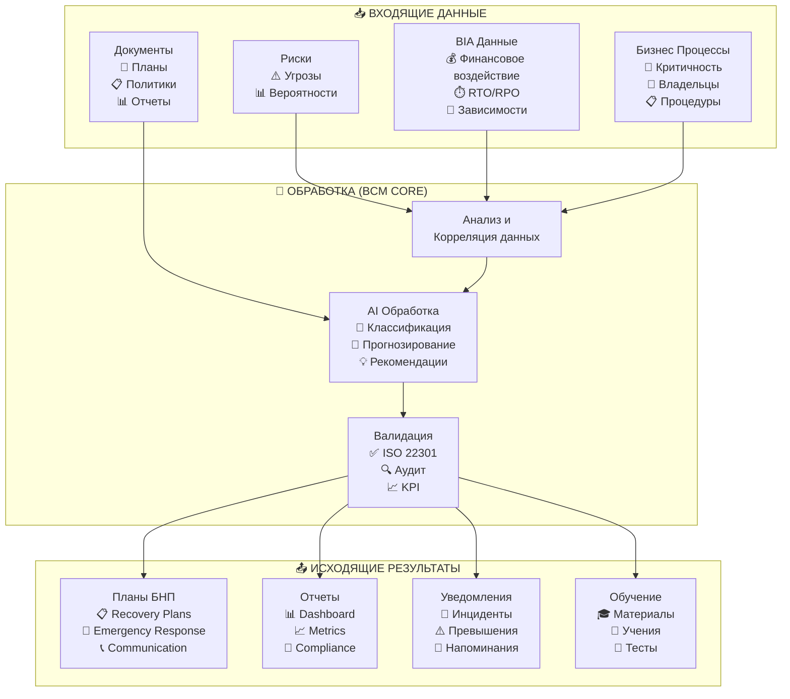

---

## 🎭 КЛЮЧЕВЫЕ БИЗНЕС СЦЕНАРИИ

### 🚨 СЦЕНАРИЙ 1: "Крупный инцидент - полный цикл"

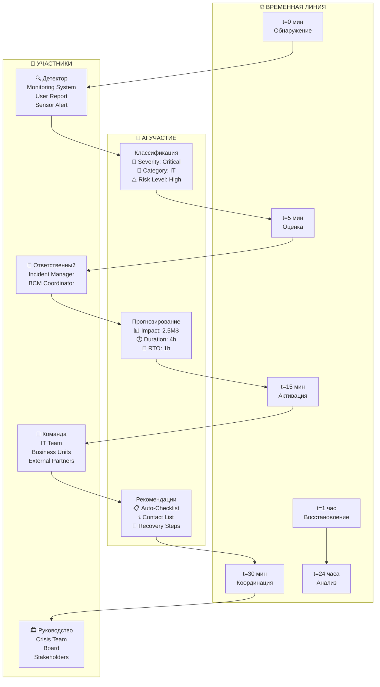

**🔄 Детальный поток информации:**
```
📥 Входящий инцидент:
├── 1. Автоматическое обнаружение (Monitoring/Manual Report)
├── 2. AI Классификация (severity + category + impact)
├── 3. Уведомление ответственных (SMS/Email/Push)
├── 4. AI Генерация response checklist
├── 5. Активация соответствующего плана БНП
├── 6. Real-time координация через платформу
├── 7. Отслеживание прогресса восстановления
├── 8. Автоматическая генерация отчетов
└── 9. Post-incident анализ и lessons learned

📊 Метрики в реальном времени:
├── Время обнаружения → классификации
├── Время активации команды
├── Progress по восстановлению
├── Финансовые потери в реальном времени
└── Соответствие RTO/RPO целям
```

### 📊 СЦЕНАРИЙ 2: "BIA анализ нового критического процесса"

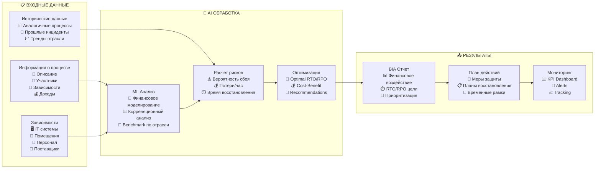

### 🎓 СЦЕНАРИЙ 3: "Планирование и проведение учений"

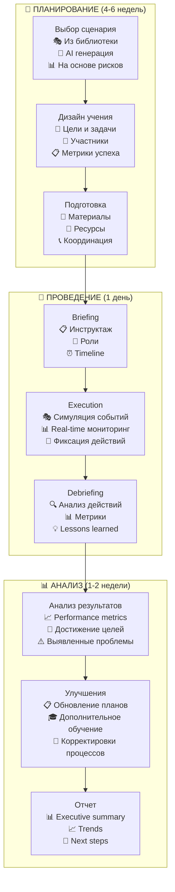

---

## 👥 КАРТЫ ПОЛЬЗОВАТЕЛЬСКИХ ПУТЕЙ

### 🧑‍💼 BCM МЕНЕДЖЕР - Ежедневная работа

```mermaid
journey
    title BCM Manager - Типичный день
    section Утро (9:00-11:00)
        Проверка Dashboard: 8: BCM Manager
        Анализ overnight alerts: 7: BCM Manager
        Обзор KPI и метрик: 8: BCM Manager
        Планирование дня: 9: BCM Manager
    section День (11:00-17:00)
        Обработка инцидентов: 6: BCM Manager
        Координация с командами: 7: BCM Manager, IT Team, Business Units
        Обновление планов: 8: BCM Manager
        Подготовка отчетов: 7: BCM Manager
    section Вечер (17:00-18:00)
        Финализация документов: 8: BCM Manager
        Планирование на завтра: 9: BCM Manager
        Отправка summary: 8: BCM Manager, Management
```

### 👨‍💻 IT АДМИНИСТРАТОР - Управление системой

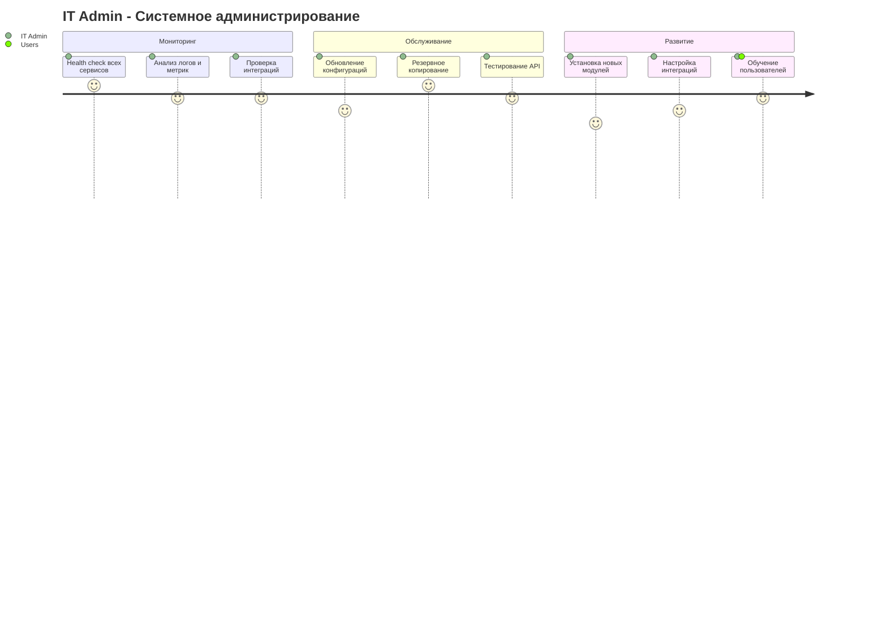

### 🏢 РУКОВОДИТЕЛЬ ПРОЦЕССА - Управление рисками

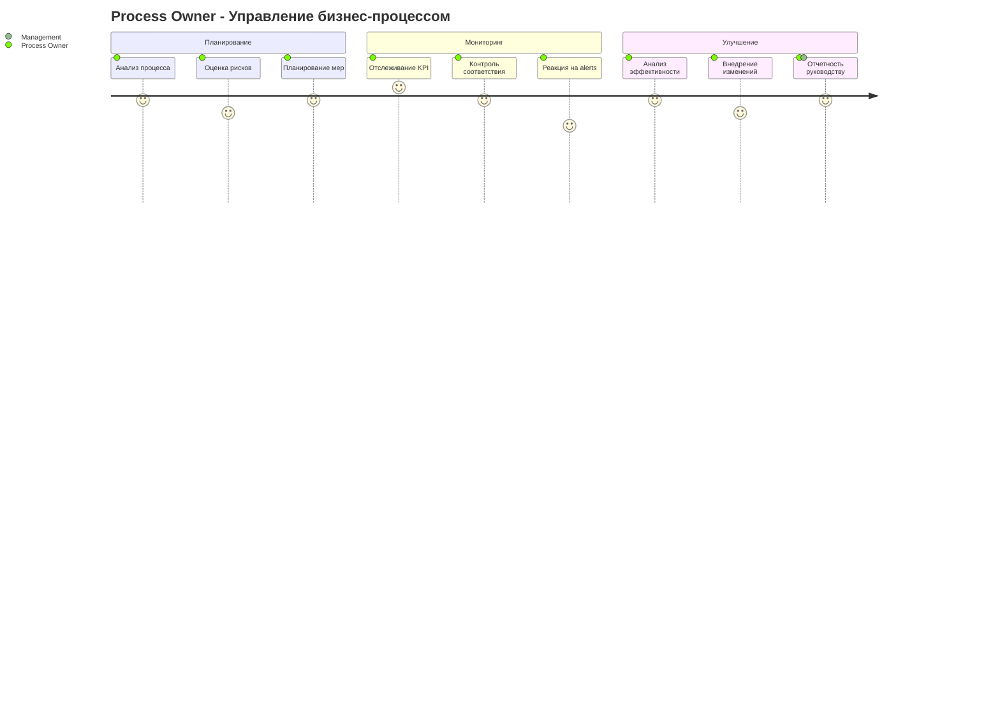

---

## 🔄 ДИАГРАММЫ СОСТОЯНИЙ КЛЮЧЕВЫХ СУЩНОСТЕЙ

### 📋 Жизненный цикл BCM Plan

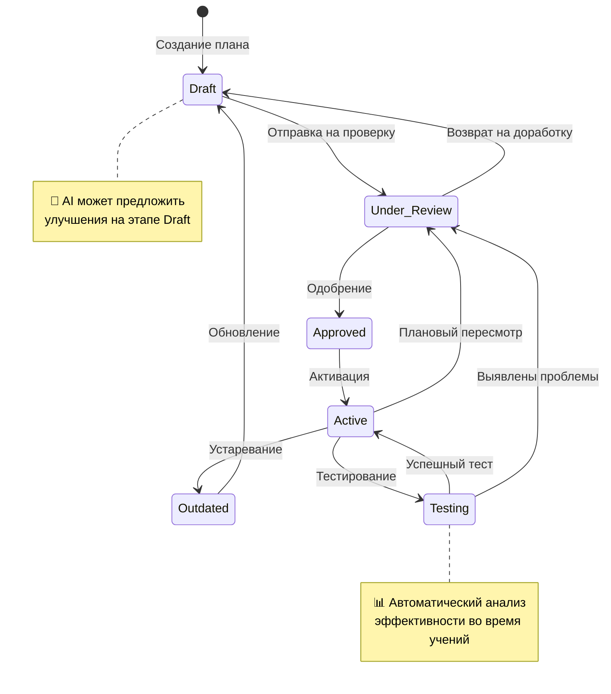

### 🚨 Жизненный цикл Incident

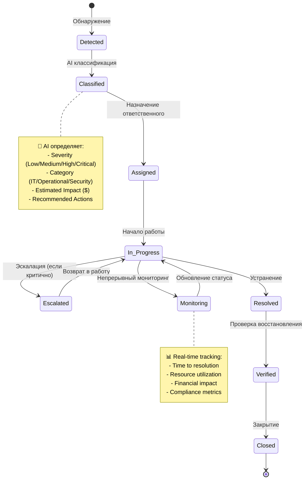

### 🏢 Жизненный цикл Business Process в BCM

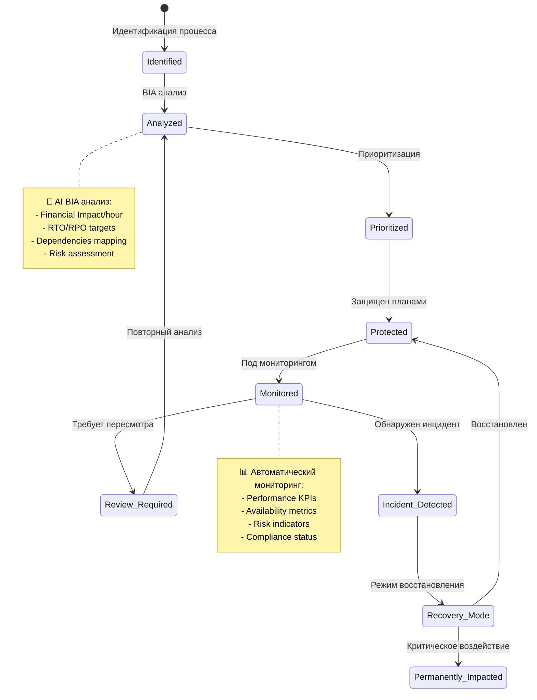

---

## 🎛️ ИНТЕГРАЦИОННЫЕ ПАТТЕРНЫ

### 🔌 Паттерн: "AI-Enhanced Decision Making"

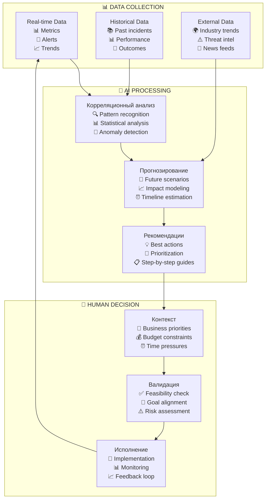

### 🔄 Паттерн: "Event-Driven Architecture"

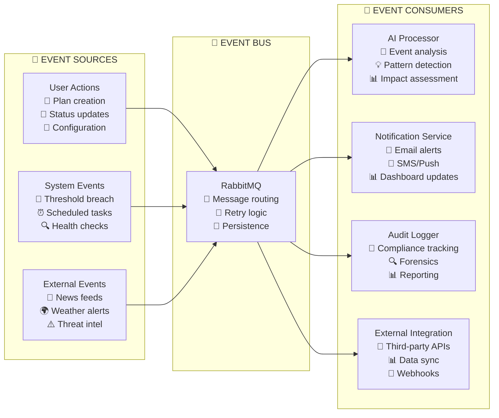

---

## 📊 МЕТРИКИ И KPI ПОТОКИ

### 🎯 Real-time BCM Dashboard Data Flow

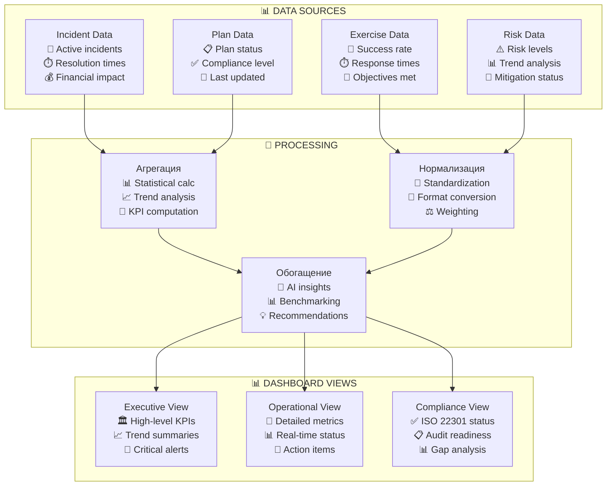

---

## 🚀 DEPLOYMENT ARCHITECTURE

### 🐳 Production Deployment Pattern

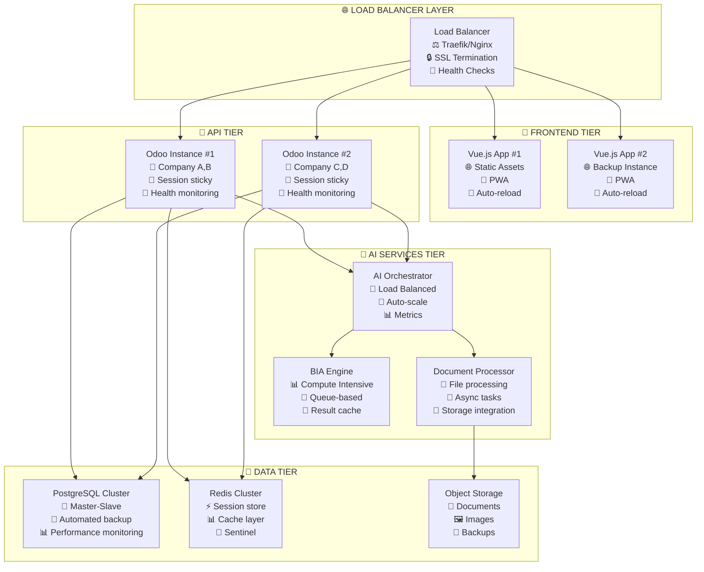

**🎯 Для команды разработчиков это даст:**

1. **📊 Понимание потоков данных** - как информация движется по системе
2. **🎭 Реальные сценарии использования** - что должна делать система
3. **👥 Пользовательские пути** - как разные роли взаимодействуют
4. **🔄 Паттерны интеграции** - как связывать компоненты
5. **🚀 Архитектура развертывания** - как запускать в production

Что еще хочешь добавить? Диаграммы безопасности? Паттерны обработки ошибок? Схемы масштабирования?