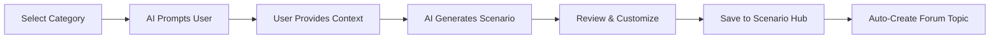

# BCM Platform User Guide - Enhanced with PHASE 1-5 Features

## 📋 Overview

This comprehensive user guide covers all enhanced functionality introduced through PHASE 1-5 implementation, including AI-powered scenario generation, advanced analytics, simulation capabilities, and community-driven knowledge management.

### New Enhanced Features
- **AI-Powered Scenario Generation** - Create realistic BCM scenarios with AI assistance
- **Advanced Exercise Management** - Multi-type exercises with simulation support
- **Analytics Dashboards** - Real-time insights and business intelligence
- **Community Knowledge Base** - Collaborative knowledge sharing platform
- **Simulation Integration** - JaamSim-powered realistic scenario modeling
- **Automated Workflows** - BPMN-based process automation

## 🚀 Getting Started with Enhanced Features

### 1. AI-Powered Scenario Creation

#### **Accessing the Scenario Hub**
1. Navigate to **BCM Platform** → **Scenario Hub**
2. Click **"Generate New Scenario"** button
3. Select your scenario type from enhanced categories:
   - **Epidemic** - Disease outbreak scenarios
   - **Blackout** - Power grid failure scenarios
   - **Cyber Attack** - Security breach scenarios
   - **Supply Chain** - Logistics disruption scenarios
   - **Natural Disaster** - Weather and geological events
   - **Terrorism** - Security threat scenarios
   - **Financial Crisis** - Economic disruption scenarios
   - **Custom** - AI-assisted custom scenarios

#### **AI Scenario Generation Process**


**Step-by-Step Process:**
1. **Choose Scenario Category**: Select from 8 enhanced categories
2. **Provide Organization Context**:
   - Organization type and size
   - Industry sector
   - Critical business functions
   - Geographic locations
3. **Set Complexity Level**:
   - **Low**: Basic disruption scenarios
   - **Medium**: Multi-factor impact scenarios
   - **High**: Complex cascading failure scenarios
4. **Review AI-Generated Content**:
   - Scenario description and timeline
   - Impact assessment
   - Required responses
   - Success criteria
5. **Customize and Enhance**:
   - Modify scenario details
   - Add organization-specific elements
   - Set custom parameters
6. **Publish to Community**:
   - Share with BCM community
   - Auto-create forum discussion
   - Enable community feedback

### 2. Advanced Exercise Management

#### **Exercise Types Available**

##### **Tabletop Exercises**
```yaml
Purpose: Discussion-based scenario exploration
Features:
  - AI-moderated discussions
  - Real-time collaboration tools
  - Automated note-taking
  - Decision tracking
  - Lessons learned capture

Process:
  1. Select scenario from Scenario Hub
  2. Invite participants via notification system
  3. Configure discussion parameters
  4. Launch exercise with AI moderation
  5. Review auto-generated summary
```

##### **Functional Exercises**
```yaml
Purpose: Operational activation and testing
Features:
  - BPMN workflow automation
  - Task assignment and tracking
  - Real-time status monitoring
  - Performance metrics collection
  - Integration with notification systems

Process:
  1. Configure exercise parameters
  2. Set up automated workflows
  3. Assign roles and responsibilities
  4. Execute with workflow automation
  5. Analyze performance metrics
```

##### **Simulation Exercises**
```yaml
Purpose: Realistic scenario modeling
Features:
  - JaamSim integration
  - Physics-based modeling
  - Real-time visualization
  - Performance analytics
  - Exportable results

Process:
  1. Design simulation parameters
  2. Configure JaamSim model
  3. Run simulation scenarios
  4. Monitor real-time metrics
  5. Export results and analysis
```

#### **Exercise Creation Workflow**
1. **Exercise Planning**:
   - Choose exercise type
   - Select scenario from hub
   - Set objectives and success criteria
   - Configure duration and complexity

2. **Participant Management**:
   - Invite participants via email/Teams/Slack
   - Assign roles and responsibilities
   - Set access permissions
   - Configure collaboration tools

3. **Execution Monitoring**:
   - Real-time dashboard monitoring
   - Automated progress tracking
   - Participant activity analytics
   - Issue identification and resolution

4. **Results and Analysis**:
   - Auto-generated exercise reports
   - Performance metrics analysis
   - Lessons learned capture
   - AI-powered improvement recommendations

### 3. Analytics and Business Intelligence

#### **Dashboard Types Available**

##### **Executive Dashboard**
```yaml
Purpose: High-level strategic insights
Metrics:
  - Platform adoption rates
  - Exercise effectiveness trends
  - ROI on BCM investments
  - Compliance status overview
  - Risk trend analysis

Access: C-level executives and senior management
Update Frequency: Daily
```

##### **Operational Dashboard**
```yaml
Purpose: Detailed operational metrics
Metrics:
  - Exercise performance analytics
  - Scenario usage patterns
  - Participant engagement metrics
  - Resource utilization
  - Template effectiveness

Access: BCM coordinators and managers
Update Frequency: Real-time
```

##### **AI Insights Dashboard**
```yaml
Purpose: Machine learning recommendations
Features:
  - Scenario improvement suggestions
  - Exercise optimization recommendations
  - Learning effectiveness trends
  - Predictive analytics
  - Continuous improvement insights

Access: All users
Update Frequency: Weekly (or on-demand)
```

#### **Using Analytics Features**
1. **Accessing Dashboards**:
   - Navigate to **Analytics** → **Dashboards**
   - Select dashboard type
   - Configure date ranges and filters
   - Export reports as needed

2. **Customizing Views**:
   - Drag and drop widgets
   - Set custom time periods
   - Filter by organization units
   - Save custom dashboard layouts

3. **Setting Up Automated Reports**:
   - Configure report schedules
   - Set recipient lists
   - Choose export formats (PDF, Excel, CSV)
   - Enable alert notifications

### 4. Community and Knowledge Base

#### **Knowledge Base Features**

##### **Auto-Generated Articles**
```yaml
Source: Successful exercise results
Process:
  1. Exercise completion triggers analysis
  2. AI extracts lessons learned
  3. Content generated and structured
  4. Article published to knowledge base
  5. Community can review and enhance

Article Types:
  - Best practices documentation
  - Lessons learned summaries
  - Template usage guides
  - Case study analyses
  - Troubleshooting guides
```

##### **Community Contributions**
```yaml
Features:
  - Expert verification system
  - Peer review process
  - Reputation scoring
  - Content moderation
  - Multi-language support

Process:
  1. Users create knowledge articles
  2. Community reviews and rates content
  3. Experts verify accuracy
  4. Approved content published
  5. Contributors earn reputation points
```

#### **Forum Integration**
1. **Automatic Topic Creation**:
   - New scenarios auto-create forum topics
   - Exercise completion triggers discussions
   - Q&A sections for each module

2. **Expert Networks**:
   - Connect with BCM professionals
   - Industry-specific discussion groups
   - Regional BCM communities

3. **Knowledge Sharing**:
   - Share templates and best practices
   - Collaborative scenario development
   - Peer learning opportunities

### 5. Simulation and Modeling

#### **JaamSim Integration**

##### **Setting Up Simulations**
1. **Model Configuration**:
   - Define system parameters
   - Set up entity relationships
   - Configure resource constraints
   - Establish performance metrics

2. **Scenario Parameters**:
   - Define disruption events
   - Set impact severity levels
   - Configure recovery timelines
   - Establish success criteria

3. **Running Simulations**:
   - Start simulation engine
   - Monitor real-time progress
   - Collect performance data
   - Analyze results

##### **Simulation Types**
```yaml
Discrete Event Simulation:
  - Process flow modeling
  - Resource allocation analysis
  - Capacity planning
  - Bottleneck identification

System Dynamics:
  - Feedback loop analysis
  - Policy impact modeling
  - Long-term trend analysis
  - Strategic planning support

Agent-Based Modeling:
  - Individual behavior modeling
  - Emergent pattern analysis
  - Social interaction effects
  - Complex adaptive systems
```

#### **NICS Platform Integration**
```yaml
Purpose: Emergency management simulation
Features:
  - Real-time incident tracking
  - Multi-agency coordination
  - Resource management
  - Communication tracking
  - Situation awareness

Integration Points:
  - Automated incident creation
  - Status synchronization
  - Report generation
  - Metrics collection
```

### 6. Template and Document Management

#### **Enhanced Template Features**

##### **BPMN Workflow Templates**
```yaml
Purpose: Automated process execution
Features:
  - Visual workflow design
  - Automated task assignment
  - Progress tracking
  - Approval workflows
  - Integration with notification systems

Template Types:
  - Incident response workflows
  - Business continuity activation
  - Recovery procedures
  - Communication plans
  - Audit processes
```

##### **AI-Powered Template Generation**
1. **Template Recommendations**:
   - AI suggests relevant templates
   - Based on organization profile
   - Considers industry best practices
   - Customizes for specific needs

2. **Auto-Generation Features**:
   - Content creation from prompts
   - Compliance checking
   - Format standardization
   - Multi-format export

#### **Document Automation**
```yaml
Supported Formats:
  - Microsoft Word (.docx)
  - PDF documents
  - BPMN workflows (.bpmn)
  - XML configurations
  - CSV data exports

Generation Features:
  - Dynamic content insertion
  - Template merging
  - Batch processing
  - Version control
  - Approval workflows
```

## 🔧 Advanced Configuration

### **AI Model Configuration**
```yaml
Available Models:
  - GPT-4 for complex reasoning
  - Specialized BCM models
  - Local LLM options
  - Custom fine-tuned models

Configuration Options:
  - Model selection per use case
  - Temperature and creativity settings
  - Response length controls
  - Safety and filtering options
```

### **Integration Settings**
```yaml
Notification Channels:
  - Microsoft Teams integration
  - Slack workspace connections
  - Email SMTP configuration
  - SMS provider setup
  - PagerDuty integration

Authentication:
  - Single Sign-On (SSO) setup
  - Multi-factor authentication
  - Role-based access control
  - API key management
  - OAuth 2.0 configuration
```

### **System Customization**
```yaml
Branding:
  - Custom logos and colors
  - White-label configuration
  - Custom domain setup
  - Email template branding

Workflow Customization:
  - Custom approval processes
  - Organization-specific templates
  - Custom fields and forms
  - Automated rule configuration
```

## 📊 Reporting and Analytics

### **Standard Reports Available**
1. **Exercise Performance Reports**
2. **Scenario Effectiveness Analysis**
3. **Compliance Status Reports**
4. **Resource Utilization Analysis**
5. **Training Completion Reports**
6. **Risk Assessment Summaries**
7. **Incident Response Metrics**
8. **Community Engagement Analytics**

### **Custom Report Builder**
```yaml
Features:
  - Drag-and-drop report designer
  - Custom field selection
  - Multiple chart types
  - Automated scheduling
  - Multi-format export
  - Dashboard integration
```

## 🎯 Best Practices

### **Scenario Development**
1. **Use AI assistance** for initial scenario creation
2. **Customize for your organization** context
3. **Collaborate with community** for peer review
4. **Regular updates** based on lessons learned
5. **Version control** for scenario evolution

### **Exercise Management**
1. **Start with tabletop exercises** for new scenarios
2. **Progress to functional exercises** for testing
3. **Use simulation** for complex scenarios
4. **Collect comprehensive feedback** from participants
5. **Document lessons learned** in knowledge base

### **Community Engagement**
1. **Share successful scenarios** with community
2. **Contribute to knowledge base** regularly
3. **Participate in forum discussions**
4. **Provide peer reviews** for community content
5. **Build expert reputation** through quality contributions

---

**Complete user guide for enhanced BCM Platform with all PHASE 1-5 features, AI integration, and community capabilities.**