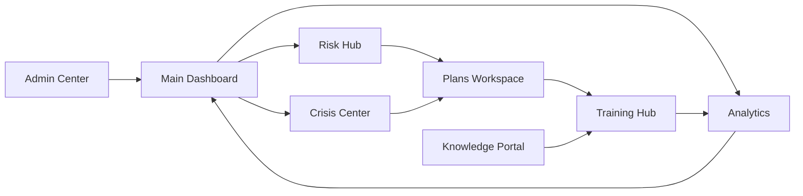

# 🎛️ BCM Portal - Детальные разделы и элементы управления
*Подробная разбивка каждой страницы портала по разделам, кнопкам и логике взаимосвязей*

---

## 📊 **СТРАНИЦА 1: Main Dashboard - Детальная разбивка**

### 🎯 **Header Section (Шапка)**
```
🏠 BCM Platform Logo    |    👤 User: John Smith (BCM Manager)    |    🔔 [5] Notifications    |    ⚙️ Settings
```

#### **Элементы управления:**
- **🎭 Role Selector** - Dropdown: "BCM Manager, Risk Analyst, Crisis Manager..."
- **👤 User Profile** - Кнопка профиля с меню настроек
- **🔔 Notification Center** - Badge с счетчиком + dropdown список
- **⚡ Quick Actions** - Floating button с меню быстрых действий

### 📈 **KPI Overview Section (Главные метрики)**
```
┌─────────────────┬─────────────────┬─────────────────┬─────────────────┐
│ 🎯 BCM Maturity │ ⚠️ Active Risks │ 🚨 Open Incidents│ ✅ Compliance   │
│     85%         │      23         │        3        │      92%        │
│   ↗️ +5%        │   🔴 High: 4   │   🔴 P1: 1     │   📋 ISO 22301 │
└─────────────────┴─────────────────┴─────────────────┴─────────────────┘
```

#### **Элементы управления:**
- **📊 Drill-down buttons** - Каждая метрика кликабельна → переход в соответствующий раздел
- **🎯 Period Selector** - "Last 30 days, Quarter, Year"
- **📈 Trend indicators** - Стрелки вверх/вниз с процентами изменения

### 🃏 **Status Cards Grid (Статусные карточки)**
```
┌───────────────────────┬───────────────────────┬───────────────────────┐
│ 🏢 My Organization    │ 👥 My Team            │ 📅 Upcoming Events    │
│ Status: ✅ Operational│ Online: 8/12         │ • BIA Workshop (Mon)  │
│ Last Incident: 3 days │ On Leave: 2          │ • Fire Drill (Wed)    │
│ RTO Status: 🟢 Good   │ Training Due: 4      │ • Audit Meeting (Fri) │
│                       │                       │                       │
│ [View Details]        │ [Manage Team]        │ [View Calendar]       │
└───────────────────────┴───────────────────────┴───────────────────────┘
```

#### **Элементы управления:**
- **[View Details]** - Кнопка перехода к детальной информации
- **[Manage Team]** - Переход к управлению командой
- **[View Calendar]** - Открытие календаря событий
- **📌 Pin/Unpin** - Закрепление важных карточек

### 📰 **Activity Feed (Лента активности)**
```
┌─────────────────────────────────────────────────────────────────────────┐
│ 🕐 Recent Activity                                           [View All] │
├─────────────────────────────────────────────────────────────────────────┤
│ 🔴 15:30 │ Critical incident reported in IT Infrastructure              │
│ ⚠️  14:45 │ New high-risk identified: Supply Chain Disruption         │
│ ✅ 13:20 │ BIA analysis completed for Customer Service process         │
│ 👥 12:15 │ Exercise "Fire Evacuation" scheduled for next week          │
│ 📋 11:30 │ Recovery Plan v2.1 approved by management                   │
└─────────────────────────────────────────────────────────────────────────┘
```

#### **Элементы управления:**
- **🔍 Filter by type** - "Incidents, Risks, Plans, Exercises..."
- **👤 Filter by involvement** - "My items, Team items, All"
- **[View All]** - Переход к полной ленте активности
- **📌 Mark as important** - Закрепление важных событий

### 🚨 **Priority Alerts Panel**
```
┌─────────────────────────────────────────────────────────────────────────┐
│ 🚨 Priority Alerts                                          [Manage] │
├─────────────────────────────────────────────────────────────────────────┤
│ 🔴 CRITICAL │ Database server incident - Recovery in progress          │
│             │ Estimated completion: 2 hours   [Join Crisis Team]      │
├─────────────────────────────────────────────────────────────────────────┤
│ 🟠 HIGH     │ Quarterly BIA review overdue for 3 processes            │
│             │ Due: Yesterday              [Schedule Review]           │
├─────────────────────────────────────────────────────────────────────────┤
│ 🟡 MEDIUM   │ 5 staff members need BCM training renewal               │
│             │ Due: Next week             [Send Reminders]             │
└─────────────────────────────────────────────────────────────────────────┘
```

#### **Элементы управления:**
- **[Join Crisis Team]** - Прямой переход к Crisis Command Center
- **[Schedule Review]** - Открытие календаря для планирования
- **[Send Reminders]** - Автоматическая отправка напоминаний
- **✅ Dismiss** - Закрытие выполненного алерта

---

## 🔍 **СТРАНИЦА 2: Risk & Analysis Hub - Детальная разбивка**

### 🎯 **Analysis Control Panel (Панель управления анализом)**
```
┌─ Analysis Mode ─┐ ┌─ AI Assistant ─┐ ┌─── Filters ───┐ ┌─── Export ───┐
│ ◉ Risk Analysis │ │ 🤖 AI Advisor  │ │ Category: All  │ │ 📊 Dashboard │
│ ○ BIA Analysis  │ │ Status: Active │ │ Severity: All  │ │ 📋 Report    │
│ ○ Combined View │ │ [Ask AI]       │ │ Owner: All     │ │ 📈 Charts    │
└─────────────────┘ └────────────────┘ └────────────────┘ └──────────────┘
```

#### **Элементы управления:**
- **Analysis Mode Radio** - Переключение между типами анализа
- **[Ask AI]** - Открытие чата с AI помощником
- **Category Filter** - Dropdown с категориями рисков/процессов
- **Export buttons** - Различные форматы экспорта данных

### 🔥 **Risk Heat Map Section (Интерактивная тепловая карта)**
```
┌─────────────────────────────────────────────────────────────────────────┐
│                    🔥 Risk Heat Map                                     │
├─────────────────────────────────────────────────────────────────────────┤
│        │   Very Low │    Low     │   Medium   │    High    │ Very High  │
├────────┼────────────┼────────────┼────────────┼────────────┼────────────┤
│Critical│     📊     │     📊     │     📊     │   🔴 5     │   🔴 2     │
│High    │     📊     │     📊     │   🟠 8     │   🟠 12    │     📊     │
│Medium  │     📊     │   🟡 15    │   🟡 20    │     📊     │     📊     │
│Low     │   🟢 25    │   🟢 18    │     📊     │     📊     │     📊     │
│V.Low   │   🟢 30    │     📊     │     📊     │     📊     │     📊     │
└────────┴────────────┴────────────┴────────────┴────────────┴────────────┘
```

#### **Элементы управления:**
- **📊 Clickable cells** - Клик показывает список рисков в ячейке
- **🔍 Zoom controls** - Увеличение/уменьшение карты
- **🎯 Risk drill-down** - Переход к детальной информации о риске
- **📊 Switch to BIA view** - Переключение на карту процессов BIA

### 📋 **Risk Details Panel (Панель деталей)**
```
┌─────────────────────────────────────────────────────────────────────────┐
│ Selected Risk: Cyber Security Breach                          [Edit]   │
├─────────────────────────────────────────────────────────────────────────┤
│ ID: RISK-2024-001           │ Owner: John Smith (CISO)                  │
│ Category: Technology        │ Status: Active                            │
│ Likelihood: High (4)        │ Impact: Major (4)                        │
│ Risk Score: 16              │ Last Review: 2024-01-15                  │
├─────────────────────────────────────────────────────────────────────────┤
│ 🤖 AI Analysis:                                                        │
│ Based on industry trends and threat intelligence, this risk has        │
│ increased probability due to recent APT campaigns targeting            │
│ financial sector. Recommend immediate security assessment.             │
├─────────────────────────────────────────────────────────────────────────┤
│ [📊 Run AI Analysis] [📋 Create Plan] [🎯 Schedule Exercise]           │
└─────────────────────────────────────────────────────────────────────────┘
```

#### **Элементы управления:**
- **[Edit]** - Редактирование параметров риска
- **[📊 Run AI Analysis]** - Запуск AI анализа риска
- **[📋 Create Plan]** - Создание плана реагирования
- **[🎯 Schedule Exercise]** - Планирование учения по риску

### 🧮 **Impact Calculator (Калькулятор воздействия)**
```
┌─────────────────────────────────────────────────────────────────────────┐
│ 🧮 Impact Calculator                                         [Calculate]│
├─────────────────────────────────────────────────────────────────────────┤
│ Process: Customer Service          │ Annual Revenue: $2,500,000         │
│ Peak Users: 150                    │ Staff Count: 25                    │
│ Criticality: High                  │ Dependencies: 3 processes          │
├─────────────────────────────────────────────────────────────────────────┤
│ 📊 Calculated Impact (24h outage):                                     │
│ • Direct Loss: $68,493                                                 │
│ • Cascading Loss: $12,450                                              │
│ • Reputational Impact: $25,000                                         │
│ • Total Impact: $105,943                                               │
├─────────────────────────────────────────────────────────────────────────┤
│ 🤖 AI Recommended RTO: 2.5 hours   │ 🤖 AI Recommended RPO: 30 min     │
│ [Accept Recommendations] [Run BIA Engine] [Generate Report]            │
└─────────────────────────────────────────────────────────────────────────┘
```

#### **Элементы управления:**
- **Input fields** - Поля ввода параметров процесса
- **[Calculate]** - Запуск расчета воздействия
- **[Accept Recommendations]** - Применение AI рекомендаций
- **[Run BIA Engine]** - Запуск внешнего BIA Engine v2.0

---

## 🚨 **СТРАНИЦА 3: Crisis Command Center - Детальная разбивка**

### 🔴 **Crisis Status Bar (Панель статуса кризиса)**
```
🔴 CRISIS LEVEL: HIGH    ⚡ ACTIVE INCIDENTS: 3    ⏱️ RESPONSE TIME: 00:47:23    🔺 ESCALATED: YES
```

#### **Элементы управления:**
- **🔴 Crisis Level Indicator** - Clickable → изменение уровня кризиса
- **⚡ Incidents Counter** - Переход к списку активных инцидентов
- **⏱️ Timer** - Автообновляемый таймер с момента объявления кризиса
- **🔺 Escalation Toggle** - Кнопка эскалации/деэскалации

### 🗺️ **Situation Map (Карта ситуации)**
```
┌─────────────────────────────────────────────────────────────────────────┐
│ 🗺️ Crisis Situation Map                              [🔄 Refresh: 30s] │
├─────────────────────────────────────────────────────────────────────────┤
│                          🏢 Main Office                                │
│                         ❌ Server Room                                 │
│                         🟡 Call Center                                 │
│                         ✅ Executive Floor                             │
│                                                                         │
│    🏭 Backup Site                           🏪 Remote Office           │
│    ✅ Operational                          🟡 Limited Capacity         │
│                                                                         │
│ Legend: ✅ Operational  🟡 Degraded  ❌ Critical  ⚠️ Unknown           │
├─────────────────────────────────────────────────────────────────────────┤
│ [📍 Add Location] [🎯 Focus on Critical] [📊 Status Summary]           │
└─────────────────────────────────────────────────────────────────────────┘
```

#### **Элементы управления:**
- **🔄 Auto-refresh** - Автоматическое обновление каждые 30 секунд
- **📍 Location markers** - Clickable для просмотра деталей
- **[Add Location]** - Добавление новых локаций на карту
- **[Focus on Critical]** - Фокус на критических объектах

### 👥 **Response Teams Panel (Панель команд реагирования)**
```
┌─────────────────────────────────────────────────────────────────────────┐
│ 👥 Response Teams                                           [Manage]    │
├─────────────────────────────────────────────────────────────────────────┤
│ 🚨 Crisis Team Alpha    │ Status: 🟢 Active     │ Members: 5/6          │
│    Leader: John Smith   │ Location: Command Ctr │ [💬 Chat] [📞 Call]   │
├─────────────────────────────────────────────────────────────────────────┤
│ 🔧 IT Recovery Team     │ Status: 🟡 Deployed   │ Members: 8/8          │
│    Leader: Jane Doe     │ Location: Server Room │ [💬 Chat] [📞 Call]   │
├─────────────────────────────────────────────────────────────────────────┤
│ 📞 Communications Team  │ Status: 🟢 Standby    │ Members: 3/4          │
│    Leader: Bob Johnson  │ Location: Media Room  │ [💬 Chat] [📞 Call]   │
└─────────────────────────────────────────────────────────────────────────┘
```

#### **Элементы управления:**
- **[💬 Chat]** - Открытие командного чата
- **[📞 Call]** - Инициация группового вызова
- **[Manage]** - Управление составом команд
- **Status indicators** - Real-time статус команд

### ⚖️ **Critical Decisions Log (Журнал критических решений)**
```
┌─────────────────────────────────────────────────────────────────────────┐
│ ⚖️ Decision Log                                       [Add Decision]    │
├─────────────────────────────────────────────────────────────────────────┤
│ 🕐 16:45 │ APPROVED │ Activate backup data center                      │
│          │ By: CEO  │ Rationale: Primary site recovery ETA >4 hours  │
├─────────────────────────────────────────────────────────────────────────┤
│ 🕐 16:30 │ APPROVED │ Invoke external vendor support                   │
│          │ By: CTO  │ Rationale: Internal team needs additional help │
├─────────────────────────────────────────────────────────────────────────┤
│ 🕐 16:15 │ PENDING  │ Public communication about service disruption   │
│          │ By: CMO  │ Awaiting legal review                          │
│          │          │ [✅ Approve] [❌ Reject] [📝 Comment]           │
└─────────────────────────────────────────────────────────────────────────┘
```

#### **Элементы управления:**
- **[Add Decision]** - Добавление нового решения
- **[✅ Approve]** - Утверждение решения
- **[❌ Reject]** - Отклонение решения
- **[📝 Comment]** - Добавление комментария

---

## 📋 **СТРАНИЦА 4: Plans & Procedures Workspace - Детальная разбивка**

### 📚 **Plan Library (Библиотека планов)**
```
┌─────────────────────────────────────────────────────────────────────────┐
│ 📚 Plan Library                                          [New Plan]     │
├─────────────────────────────────────────────────────────────────────────┤
│ 🔍 Search: [____________________] 🔽 Category: All  📅 Updated: Any     │
├─────────────────────────────────────────────────────────────────────────┤
│ 📂 IT Disaster Recovery (5 plans)                                      │
│   📄 Database Recovery Plan v2.1        🟢 Approved    Jan 15, 2024    │
│   📄 Network Restoration Plan v1.3      🟡 Under Review Dec 20, 2023   │
│   📄 Cyber Incident Response v3.0       🟢 Approved    Jan 10, 2024    │
├─────────────────────────────────────────────────────────────────────────┤
│ 📂 Business Continuity (8 plans)                                       │
│   📄 Customer Service Recovery v2.0     🟢 Approved    Jan 12, 2024    │
│   📄 Supply Chain Continuity v1.8       🔴 Expired     Dec 01, 2023    │
│   📄 Remote Work Activation v1.5        🟢 Approved    Jan 05, 2024    │
├─────────────────────────────────────────────────────────────────────────┤
│ ⭐ My Favorites (3) │ 🕐 Recent (7) │ 📋 My Plans (12)                  │
└─────────────────────────────────────────────────────────────────────────┘
```

#### **Элементы управления:**
- **[New Plan]** - Создание нового плана
- **🔍 Search box** - Поиск по названию и содержимому
- **Category filter** - Фильтрация по категориям планов
- **Status indicators** - 🟢 Approved, 🟡 Under Review, 🔴 Expired
- **⭐ Favorite toggle** - Добавление в избранное

### 📝 **Plan Editor (Редактор планов)**
```
┌─────────────────────────────────────────────────────────────────────────┐
│ Plan: Database Recovery Plan v2.1                    [💾 Save] [📤 Send]│
├─────────────────────────────────────────────────────────────────────────┤
│ Status: 🟢 Approved │ Owner: IT Team │ Last Updated: Jan 15, 2024       │
│ RTO: 2 hours        │ RPO: 30 min    │ Next Review: Apr 15, 2024        │
├─────────────────────────────────────────────────────────────────────────┤
│ 📋 Plan Sections:                                                      │
│ ▼ 1. Activation Criteria                                               │
│   • Database server unavailable for >15 minutes                       │
│   • Database corruption detected                                       │
│   • Primary site evacuation required                                  │
│                                                                         │
│ ▼ 2. Response Team                                                     │
│   Primary: John Smith (IT Manager)  📞 +1-555-0123                    │
│   Backup:  Jane Doe (DBA)           📞 +1-555-0124                    │
│                                                                         │
│ ▶ 3. Recovery Procedures (12 steps)                                    │
│ ▶ 4. Communication Plan                                                │
│ ▶ 5. Testing & Validation                                              │
│                                                                         │
│ [➕ Add Section] [📝 Edit Section] [🗑️ Delete Section]                │
└─────────────────────────────────────────────────────────────────────────┘
```

#### **Элементы управления:**
- **[💾 Save]** - Сохранение изменений
- **[📤 Send]** - Отправка на утверждение
- **▼/▶ Expand/Collapse** - Раскрытие/сворачивание разделов
- **[➕ Add Section]** - Добавление нового раздела
- **[📝 Edit Section]** - Редактирование раздела

### 🔄 **Approval Workflow (Workflow утверждения)**
```
┌─────────────────────────────────────────────────────────────────────────┐
│ 🔄 Approval Workflow                                                   │
├─────────────────────────────────────────────────────────────────────────┤
│ ✅ 1. Author Review      │ John Smith      │ Completed   │ Jan 12       │
│ ✅ 2. Technical Review   │ Jane Doe        │ Completed   │ Jan 13       │
│ ✅ 3. Management Review  │ Bob Johnson     │ Completed   │ Jan 14       │
│ 🔄 4. Executive Approval │ CEO Office      │ In Progress │ Jan 15       │
│ ⏳ 5. Final Publication  │ System Auto     │ Waiting     │ -            │
├─────────────────────────────────────────────────────────────────────────┤
│ Current Stage: Executive Approval                                       │
│ Expected Completion: Jan 16, 2024                                       │
│ [📞 Contact Approver] [⏭️ Skip Stage] [❌ Cancel Workflow]             │
└─────────────────────────────────────────────────────────────────────────┘
```

#### **Элементы управления:**
- **[📞 Contact Approver]** - Связь с текущим утверждающим
- **[⏭️ Skip Stage]** - Пропуск этапа (если есть права)
- **[❌ Cancel Workflow]** - Отмена процесса утверждения

---

## 🎓 **СТРАНИЦА 5: Training & Exercise Hub - Детальная разбивка**

### 📅 **Schedule Manager (Менеджер расписания)**
```
┌─────────────────────────────────────────────────────────────────────────┐
│ 📅 January 2024                          [Today] [Week] [Month]        │
├─────────────────────────────────────────────────────────────────────────┤
│ Mon 15 │ Tue 16 │ Wed 17      │ Thu 18 │ Fri 19 │ Sat 20 │ Sun 21      │
│        │        │ 🎯 Fire     │        │ 🎓 BCM │        │             │
│        │        │ Drill       │        │ Training│       │             │
│        │        │ 2:00 PM     │        │ 9:00 AM│        │             │
│        │        │ [Join]      │        │ [Join] │        │             │
├─────────────────────────────────────────────────────────────────────────┤
│ 📋 Today's Schedule:                                                    │
│ • 09:00 - BCM Fundamentals Training (Room A)           [Join Meeting]  │
│ • 14:00 - Fire Evacuation Exercise (All Building)      [View Details] │
│ • 16:00 - Post-Exercise Debrief (Conference Room)      [Join Meeting]  │
└─────────────────────────────────────────────────────────────────────────┘
```

#### **Элементы управления:**
- **[Today/Week/Month]** - Переключение видов календаря
- **[Join]** - Присоединение к событию
- **[Join Meeting]** - Переход к онлайн-встрече
- **[View Details]** - Просмотр деталей события

### 🎯 **Exercise Center (Центр учений)**
```
┌─────────────────────────────────────────────────────────────────────────┐
│ 🎯 Exercise Center                                      [New Exercise]  │
├─────────────────────────────────────────────────────────────────────────┤
│ 🎮 Exercise Builder                                                     │
│ ┌─ Exercise Type ─┐ ┌─ Scenario ────┐ ┌─ Participants ─┐               │
│ │ ◉ Tabletop      │ │ Cyber Attack  │ │ IT Team: 8     │               │
│ │ ○ Walkthrough   │ │ Fire Emergency│ │ Crisis Team: 5 │               │
│ │ ○ Full Scale    │ │ Data Breach   │ │ External: 3    │               │
│ └─────────────────┘ └───────────────┘ └────────────────┘               │
│                                                                         │
│ 📊 Scenario Details:                                                    │
│ Duration: 2 hours │ Complexity: Medium │ Injects: 5                    │
│ Objectives: Test incident response, communication, recovery procedures │
│                                                                         │
│ [🎬 Run Simulation] [📋 Generate Script] [👥 Assign Roles]            │
└─────────────────────────────────────────────────────────────────────────┘
```

#### **Элементы управления:**
- **[New Exercise]** - Создание нового учения
- **Exercise Type Radio** - Выбор типа учения
- **Scenario Dropdown** - Выбор сценария из библиотеки
- **[🎬 Run Simulation]** - Запуск симуляции учения
- **[📋 Generate Script]** - Генерация сценария учения

### 📚 **Learning Center (Центр обучения)**
```
┌─────────────────────────────────────────────────────────────────────────┐
│ 📚 Learning Center                                      [Browse All]    │
├─────────────────────────────────────────────────────────────────────────┤
│ 🛤️ My Learning Path: BCM Professional Certification                    │
│ Progress: ▓▓▓▓▓▓▓░░░ 70% Complete                                      │
│                                                                         │
│ ✅ Module 1: BCM Fundamentals (Completed)                              │
│ ✅ Module 2: Risk Assessment (Completed)                               │
│ ✅ Module 3: BIA Analysis (Completed)                                  │
│ 🔄 Module 4: Plan Development (In Progress - 30%)      [Continue]      │
│ ⏳ Module 5: Exercise & Testing (Not Started)          [Preview]       │
│ ⏳ Module 6: Crisis Management (Not Started)           [Preview]       │
│                                                                         │
│ 🤖 AI Learning Coach Recommendations:                                  │
│ • Focus on Plan Development templates this week                        │
│ • Schedule practice session for BIA calculations                       │
│ • Review recent incident case studies                                  │
│                                                                         │
│ [💬 Chat with AI Coach] [📊 View Progress] [🏆 My Certificates]       │
└─────────────────────────────────────────────────────────────────────────┘
```

#### **Элементы управления:**
- **[Browse All]** - Просмотр всех доступных курсов
- **[Continue]** - Продолжение текущего модуля
- **[Preview]** - Предварительный просмотр модуля
- **[💬 Chat with AI Coach]** - Общение с AI тренером
- **Progress bars** - Визуальный индикатор прогресса

---

## 📊 **СТРАНИЦА 6: Analytics & Reporting Suite - Детальная разбивка**

### 🎛️ **Report Control Panel (Панель управления отчетами)**
```
┌─────────────────────────────────────────────────────────────────────────┐
│ 🏗️ Report Builder                                       [Save Template]│
├─────────────────────────────────────────────────────────────────────────┤
│ Report Type: │ Data Source:  │ Time Period: │ Recipients:              │
│ 🔽Executive  │ 🔽All Modules │ 🔽Last Month │ 👥 Executive Team       │
│   Compliance │   Risk Mgmt   │   Quarter    │    Board Members        │
│   Operational│   BIA         │   Year       │    Stakeholders         │
│   Custom     │   Incidents   │   Custom     │ [➕ Add Recipient]      │
│              │   Plans       │              │                         │
├─────────────────────────────────────────────────────────────────────────┤
│ 📊 Report Elements:                                                     │
│ ☑️ KPI Summary        ☑️ Risk Heat Map       ☐ Trend Analysis          │
│ ☑️ Compliance Status  ☐ Incident Timeline   ☑️ Executive Summary       │
│ ☐ Team Performance   ☑️ Budget vs Actual    ☐ Recommendations         │
│                                                                         │
│ [👁️ Preview] [📅 Schedule] [📤 Generate Now] [🤖 AI Enhance]          │
└─────────────────────────────────────────────────────────────────────────┘
```

#### **Элементы управления:**
- **Dropdown selectors** - Выбор типа, источника, периода
- **Checkboxes** - Выбор элементов отчета
- **[👁️ Preview]** - Предварительный просмотр отчета
- **[📅 Schedule]** - Планирование автоматической генерации
- **[🤖 AI Enhance]** - AI улучшение отчета

### 📈 **Interactive Dashboards (Интерактивные дашборды)**
```
┌─────────────────────────────────────────────────────────────────────────┐
│ 📊 BCM Performance Dashboard                           [Customize]      │
├─────────────────────────────────────────────────────────────────────────┤
│ ┌─ KPI Overview ──────┐ ┌─ Risk Trends ─────┐ ┌─ Incident Volume ────┐ │
│ │ BCM Maturity: 85%   │ │     ╭─╮           │ │ Jan: ▓▓▓ 12         │ │
│ │ Compliance: 92%     │ │   ╭─╯ ╰─╮         │ │ Feb: ▓▓ 8           │ │
│ │ Exercise Score: 78% │ │ ╭─╯     ╰──╮      │ │ Mar: ▓▓▓▓ 15        │ │
│ │ Training Rate: 95%  │ │╱          ╰──    │ │ Apr: ▓ 5            │ │
│ └─────────────────────┘ └───────────────────┘ └─────────────────────┘ │
│                                                                         │
│ ┌─ Compliance Radar ──────────────────────────┐ ┌─ Team Performance ─┐ │
│ │        ISO 22301                             │ │ Team Alpha: 92%    │ │
│ │           ╱╲                                 │ │ Team Beta:  88%    │ │
│ │          ╱  ╲     NIST                      │ │ Team Gamma: 95%    │ │
│ │    SOX  ╱____╲                              │ │ [View Details]     │ │
│ │        ╱      ╲                             │ │                    │ │
│ │       ╱________╲                            │ │                    │ │
│ │     GDPR        PCI DSS                     │ │                    │ │
│ └──────────────────────────────────────────────┘ └────────────────────┘ │
│                                                                         │
│ [📊 Drill Down] [📈 Trend View] [📋 Export Data] [⚙️ Configure]       │
└─────────────────────────────────────────────────────────────────────────┘
```

#### **Элементы управления:**
- **[Customize]** - Настройка виджетов дашборда
- **[📊 Drill Down]** - Детализация метрик
- **[📈 Trend View]** - Переход к трендовому анализу
- **Interactive charts** - Кликабельные элементы графиков

### 🔮 **Predictive Analytics (Предиктивная аналитика)**
```
┌─────────────────────────────────────────────────────────────────────────┐
│ 🔮 AI Predictive Analytics                             [Configure AI]   │
├─────────────────────────────────────────────────────────────────────────┤
│ 📈 Risk Trend Predictions (Next 90 days):                              │
│ • Cyber Security Risk: ↗️ Increasing (Confidence: 87%)                │
│ • Supply Chain Risk: ↘️ Decreasing (Confidence: 76%)                  │
│ • Operational Risk: → Stable (Confidence: 92%)                        │
│                                                                         │
│ 🚨 Anomaly Detection:                                                   │
│ • Unusual spike in IT incidents detected (Last 7 days)                │
│ • Training completion rate below normal (Team Beta)                    │
│ • Budget variance exceeding threshold (Exercise program)              │
│                                                                         │
│ 💡 AI Recommendations:                                                  │
│ • Increase cybersecurity training frequency                            │
│ • Schedule additional IT resilience exercises                          │
│ • Review supplier risk assessments                                     │
│                                                                         │
│ [📊 View Detailed Analysis] [📋 Generate Report] [⚙️ Adjust Model]     │
└─────────────────────────────────────────────────────────────────────────┘
```

#### **Элементы управления:**
- **[Configure AI]** - Настройка AI моделей
- **[📊 View Detailed Analysis]** - Детальный анализ предсказаний
- **[⚙️ Adjust Model]** - Настройка параметров модели
- **Confidence indicators** - Показатели достоверности прогнозов

---

## 🔗 **Логика взаимосвязей между разделами:**

### 🔄 **Cross-Page Navigation Flow**


### 🎯 **Context-Aware Actions**
- **From Risk Analysis** → **Create Recovery Plan** → **Schedule Exercise**
- **From Incident** → **Activate Plan** → **Join Crisis Team**
- **From Exercise Results** → **Update Plans** → **Schedule Training**
- **From Analytics** → **Generate Report** → **Share Insights**

---

**Эта детальная структура обеспечивает логичную группировку функций и интуитивную навигацию между связанными элементами!** 🚀