# Детальные Workflows для всех 19 BCM модулей

## 1. BCM Governance - Governance Workflow

### 1.1 Policy Management Lifecycle

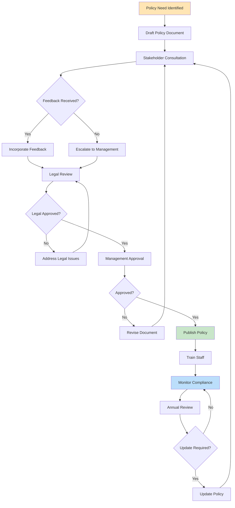

### 1.2 BCM Committee Meeting Workflow

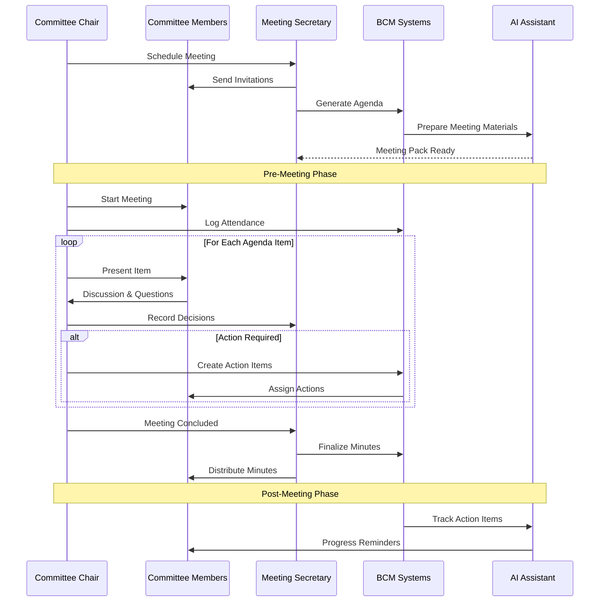

## 2. BCM Audit - Audit Execution Workflow

### 2.1 Audit Planning and Execution

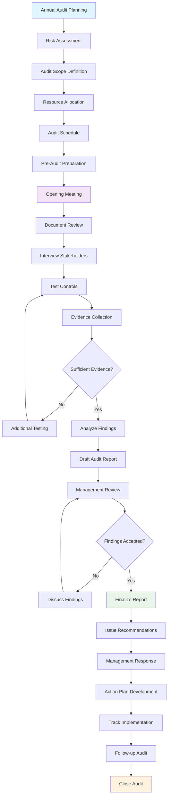

### 2.2 Compliance Monitoring State Machine

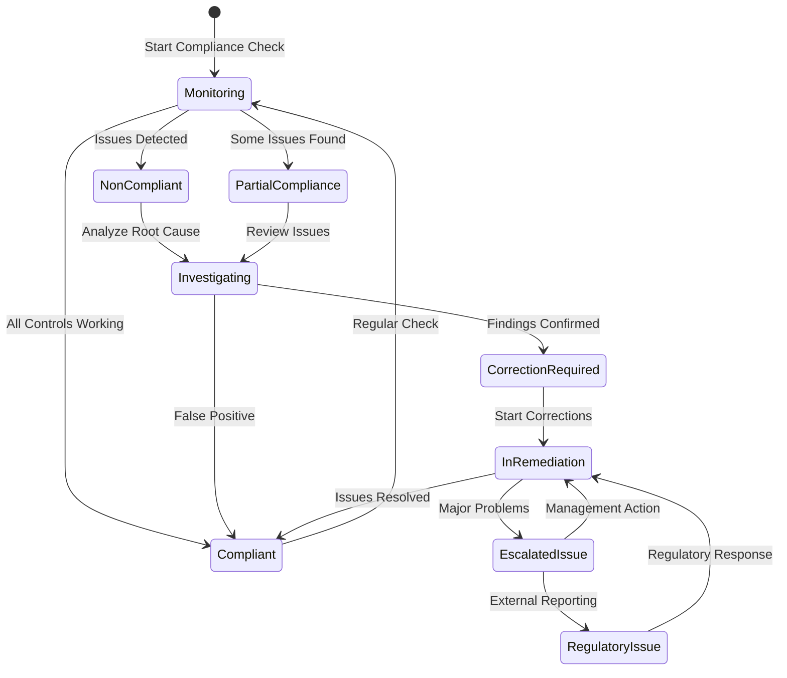

## 3. BCM Exercise - Training and Exercise Workflow

### 3.1 Exercise Planning and Execution

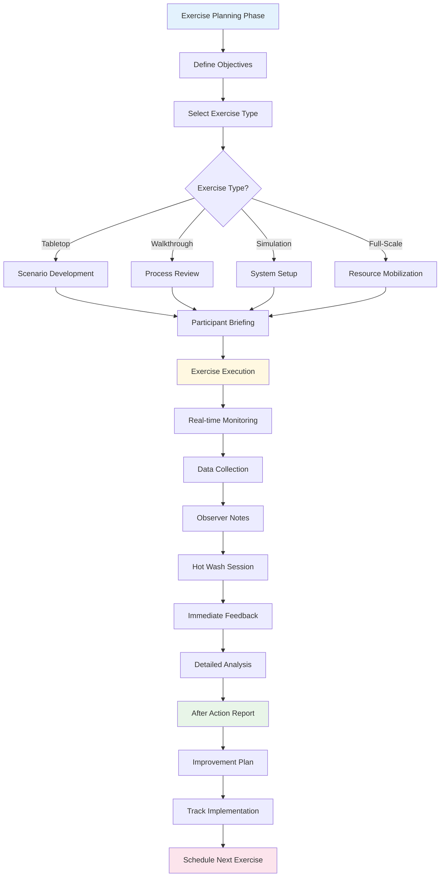

### 3.2 Training Program Management

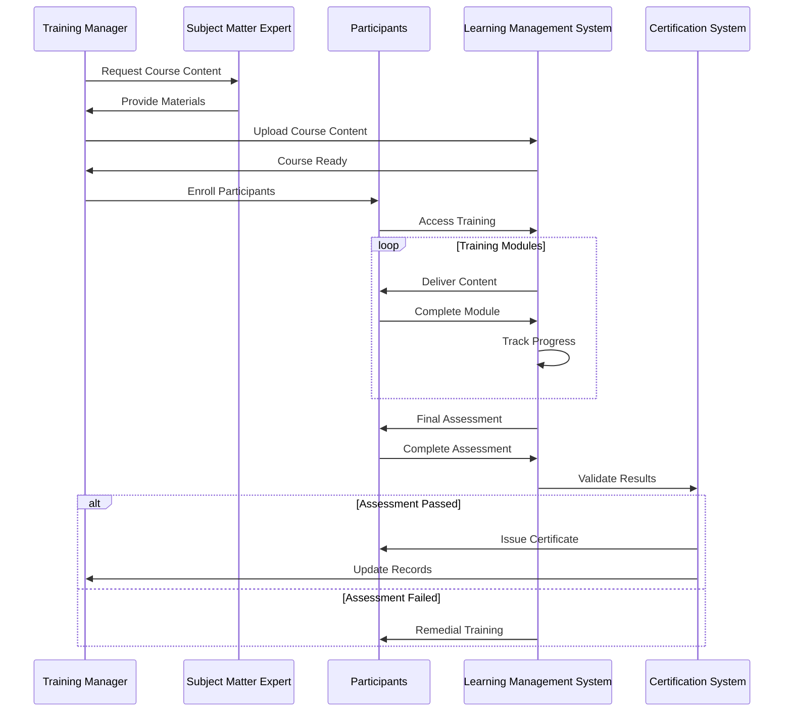

## 4. BCM Training - Competency Management

### 4.1 Competency Assessment Workflow

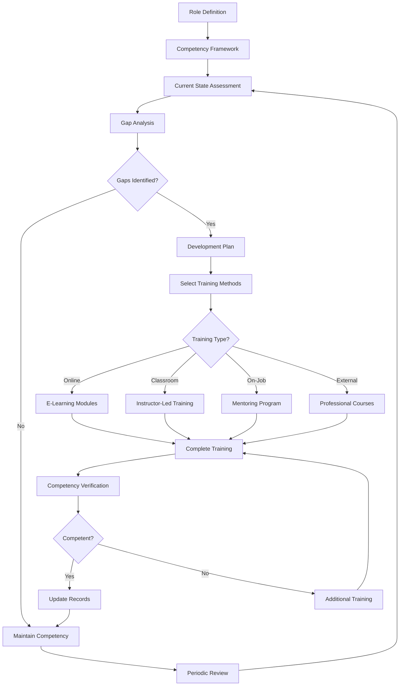

## 5. BCM KPI - Performance Monitoring Workflow

### 5.1 KPI Management Lifecycle

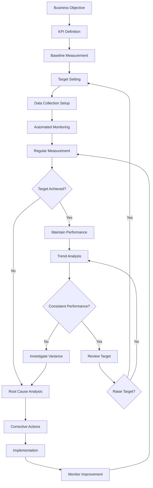

### 5.2 Real-time Dashboard Updates

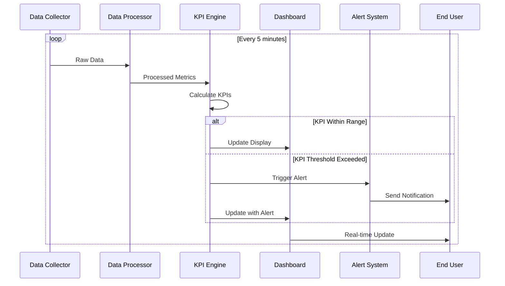

## 6. BCM Reporting - Report Generation Workflow

### 6.1 Automated Report Generation

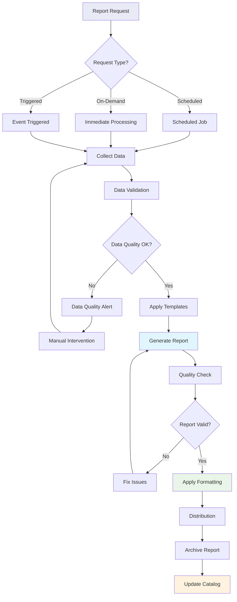

## 7. BCM Scenario Hub - Scenario Management

### 7.1 Scenario Development and Sharing

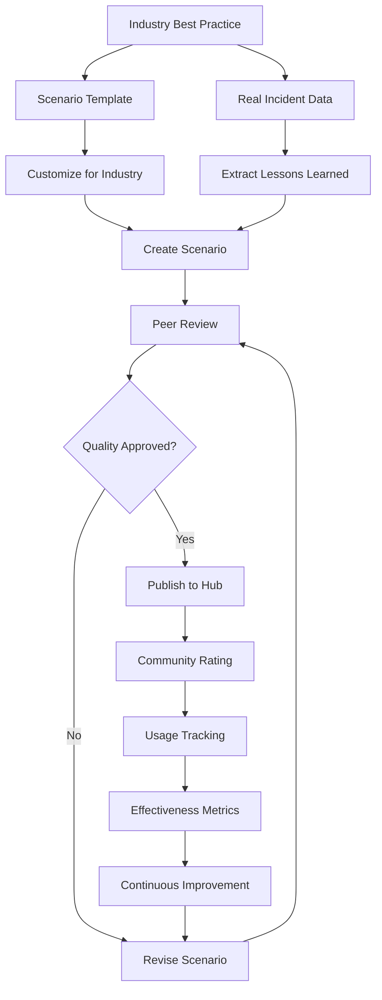

### 7.2 Scenario Application Workflow

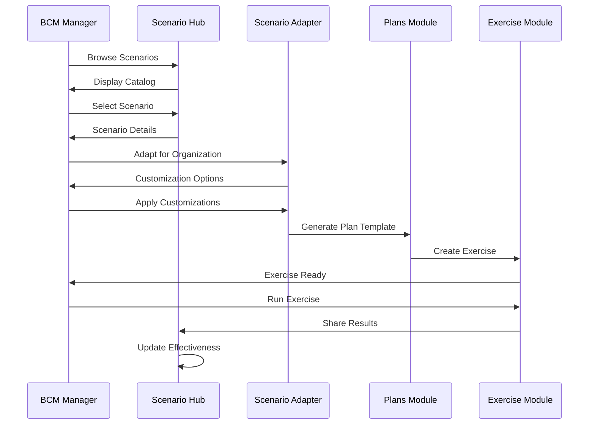

## 8. BCM Templates - Document Template Management

### 8.1 Template Lifecycle Management

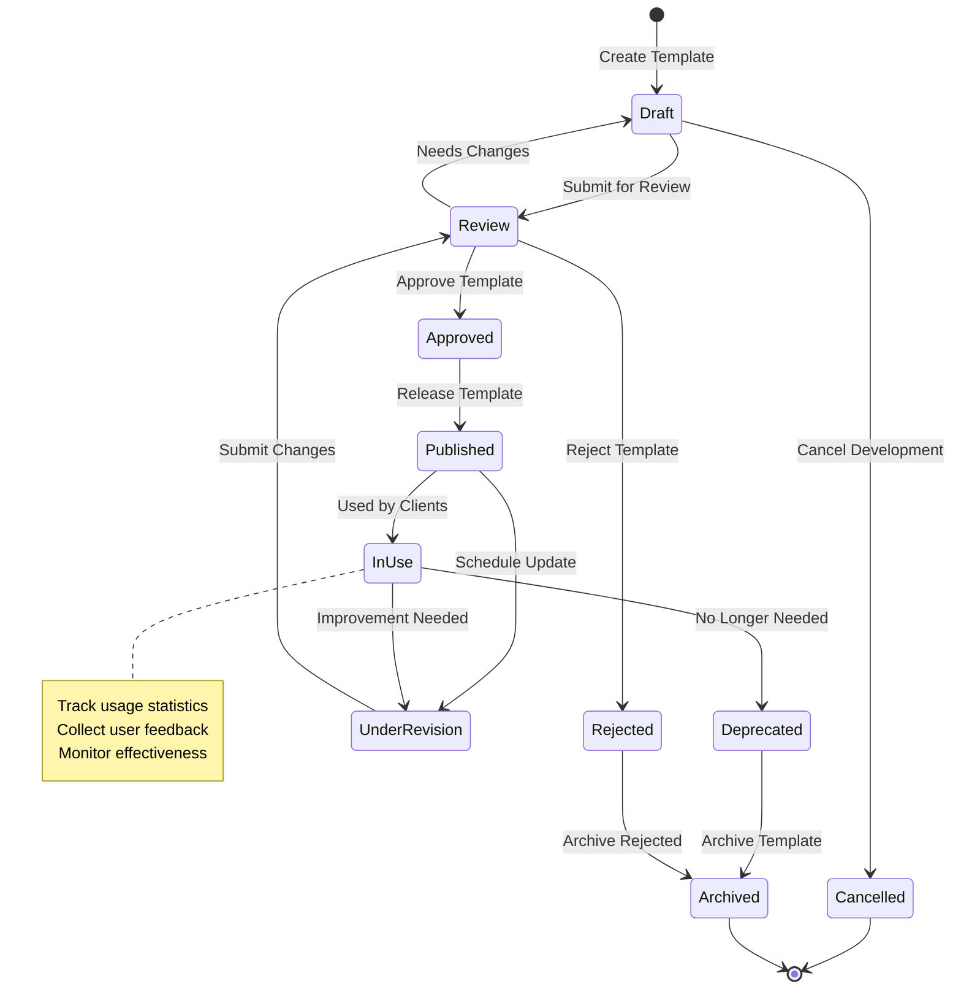

## 9. BCM Clients - Multi-Tenant Client Management

### 9.1 Client Onboarding Workflow

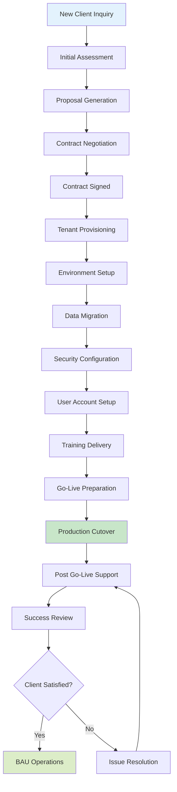

### 9.2 Client Isolation and Data Security

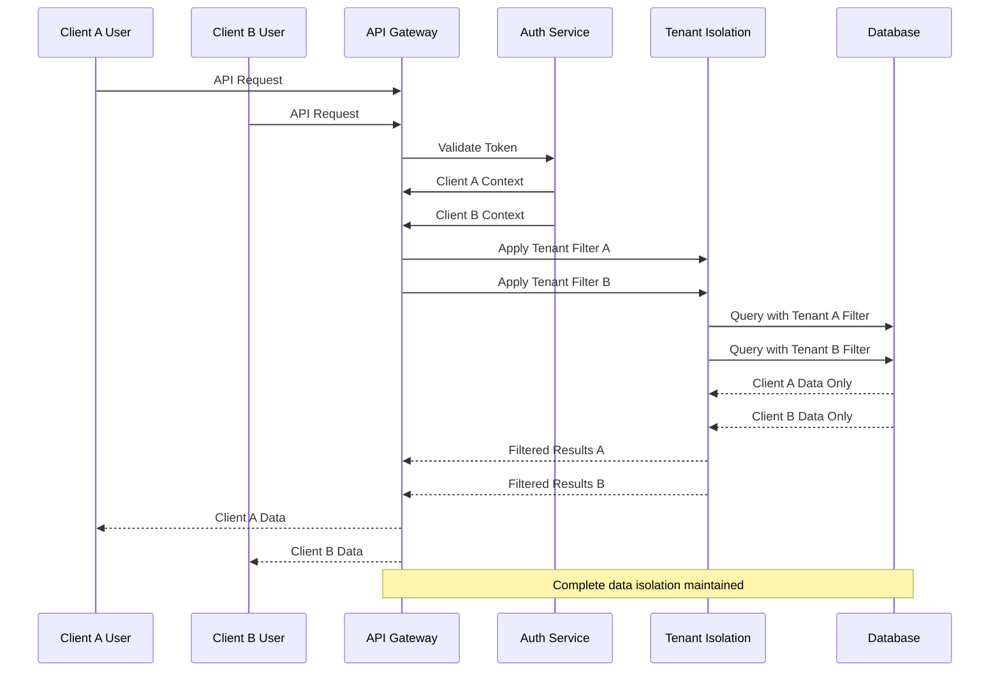

## 10. BCM Config - System Configuration Management

### 10.1 Configuration Change Workflow

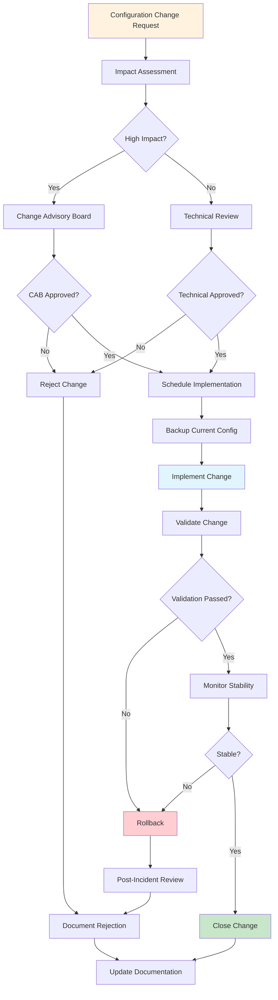

## 11. BCM Context - Search and Indexing Workflow

### 11.1 Content Indexing Pipeline

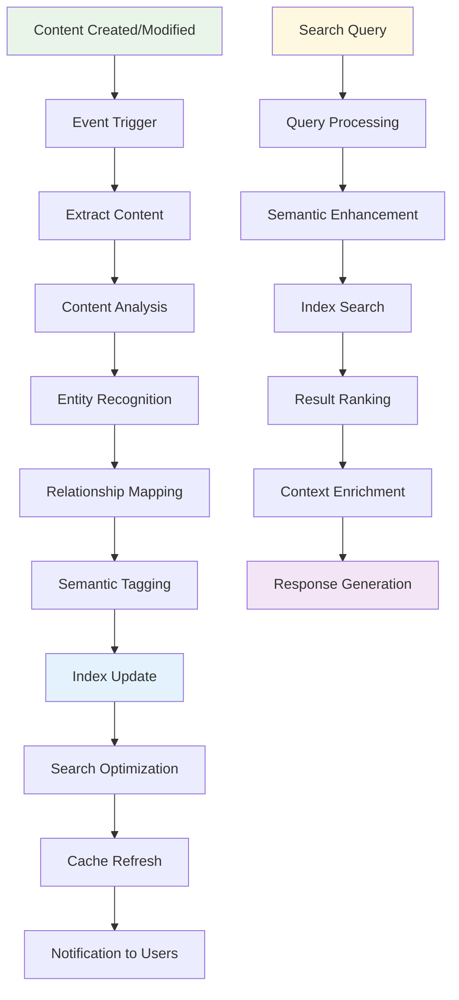

Эта документация охватывает **все 19 модулей BCM платформы** с детальными workflow диаграммами для:

- **Governance** - управление политиками и комитетами
- **Audit** - процессы аудита и соответствия
- **Exercise** - планирование и проведение учений
- **Training** - управление компетенциями
- **KPI** - мониторинг производительности
- **Reporting** - генерация отчетов
- **Scenario Hub** - управление сценариями
- **Templates** - жизненный цикл шаблонов
- **Clients** - мульти-тенантность
- **Config** - управление конфигурацией
- **Context** - поиск и индексирование

Все диаграммы в формате Mermaid и готовы для использования!