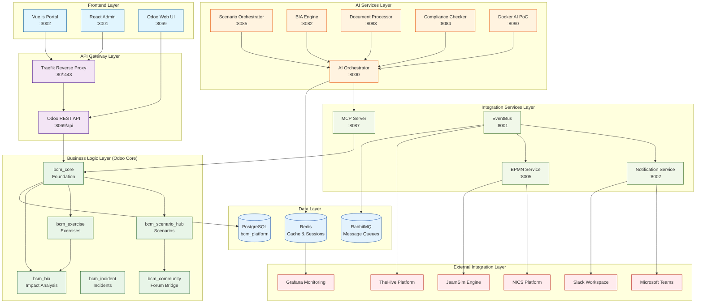
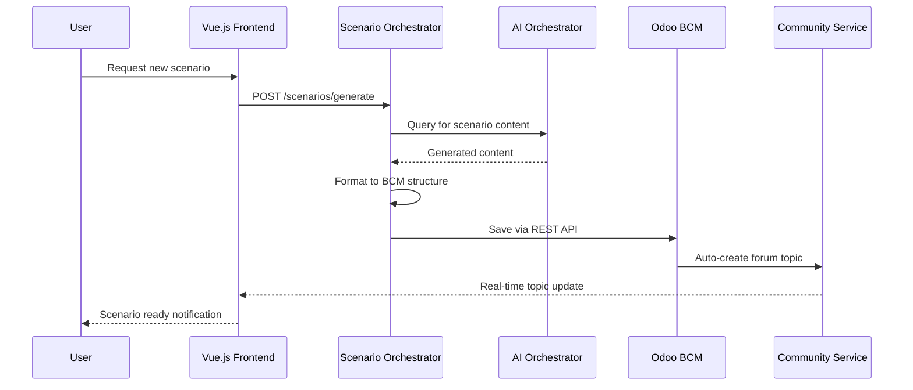
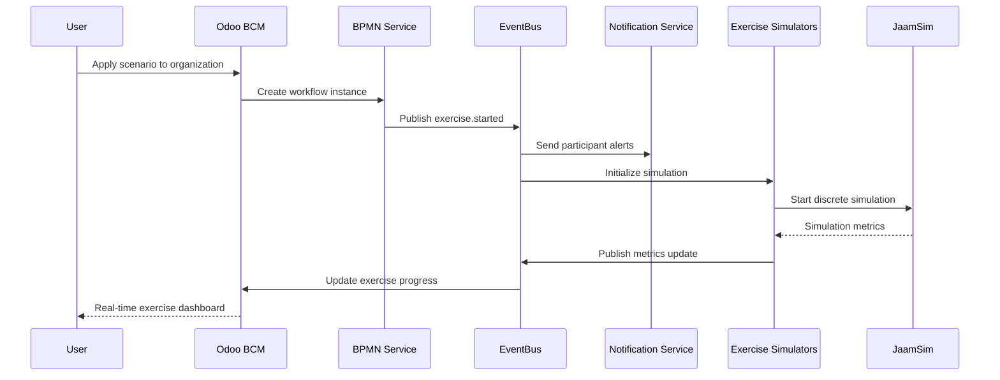
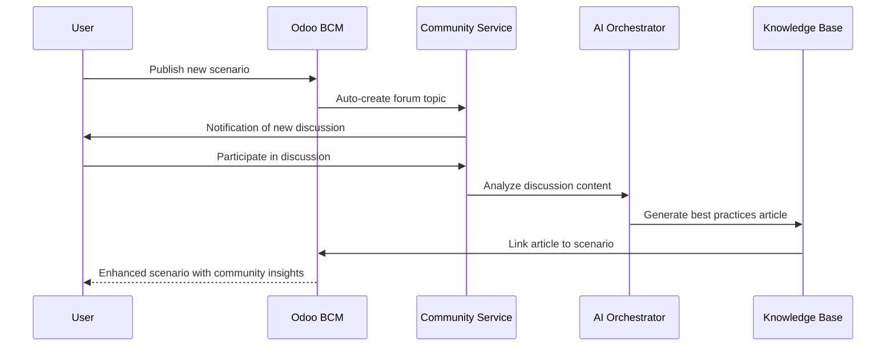
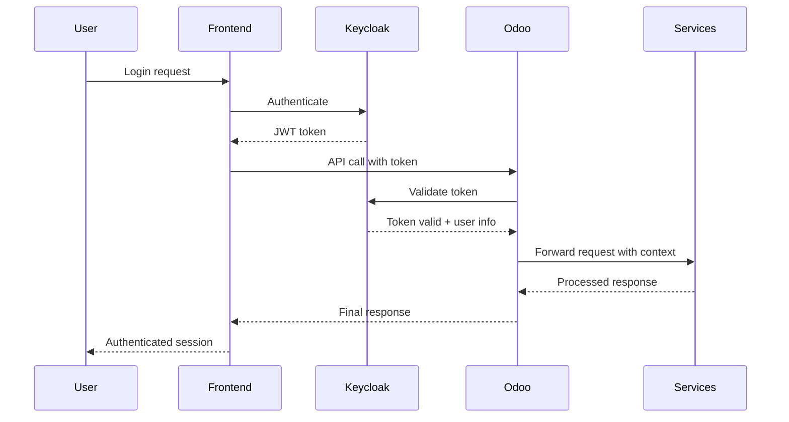
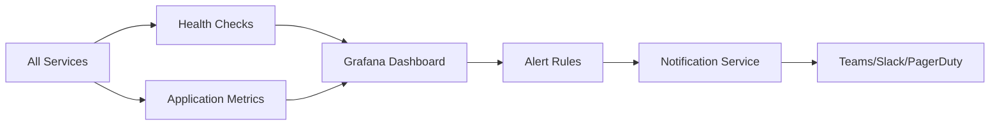

# BCM Platform System Integration Guide

## 🎯 Integration Architecture Overview

The BCM Platform follows a **microservices architecture** with **Odoo as the central hub** and specialized services for AI, simulation, and external integrations.



## 🔄 Integration Patterns

### **Pattern 1: AI-Enhanced Scenario Generation**



### **Pattern 2: Exercise Workflow Execution**



### **Pattern 3: Community Knowledge Creation**



## 🔧 Critical Integration Points

### **1. Odoo ↔ AI Services**
```yaml
Integration Method: REST API + MCP Protocol
Data Flow: Bidirectional
Key Endpoints:
  - Odoo → AI: /api/v1/ai/analyze
  - AI → Odoo: /api/v1/scenarios, /api/v1/incidents
Security: API key authentication
Error Handling: Circuit breaker pattern with fallbacks
```

### **2. EventBus ↔ All Services**
```yaml
Integration Method: RabbitMQ messaging
Message Format: JSON with standardized schema
Event Categories:
  - bcm.scenario.* (created, published, applied)
  - bcm.exercise.* (started, completed, failed)
  - bcm.incident.* (detected, escalated, resolved)
  - system.* (health, performance, errors)
```

### **3. Frontend ↔ Backend**
```yaml
Vue.js Portal:
  - Axios HTTP client for API calls
  - WebSocket connection for real-time updates
  - State management via Vuex
  - Authentication via Keycloak integration

React Admin:
  - REST API integration with Odoo
  - Real-time dashboard updates
  - Role-based access control
  - Administrative functions
```

## 🛡️ Security Integration

### **Authentication Flow**


### **Authorization Model**
```yaml
Keycloak Realm: bcm-platform
Client: odoo-bcm

Security Groups:
  - BCM User: Basic access to scenarios and exercises
  - BCM Manager: Full module access + management
  - BCM Admin: System administration + configuration
  - Scenario Reviewer: Scenario moderation and approval
  - Exercise Facilitator: Exercise execution and monitoring

Multi-Tenant Security:
  - Company-based data isolation
  - Role inheritance within company hierarchy
  - Cross-company collaboration controls
```

## 📊 Performance Integration

### **Monitoring Stack**


### **Key Metrics Monitored**
- **Service Health**: Uptime, response times, error rates
- **AI Performance**: Model inference times, accuracy scores
- **Database Performance**: Query times, connection pools
- **Exercise Metrics**: Participation rates, completion times
- **User Engagement**: Scenario usage, community activity

## 🚀 Deployment Integration

### **Container Orchestration**
```yaml
Platform: Docker Compose
Orchestration: Single docker-compose.yml
Service Discovery: Docker internal DNS
Load Balancing: Traefik reverse proxy
Health Monitoring: Built-in Docker health checks
```

### **Data Persistence**
```yaml
Primary Storage: PostgreSQL with Docker volumes
Cache Storage: Redis with persistence enabled
File Storage: Docker volumes for uploads and logs
Backup Strategy: Automated database backups
```

### **Scaling Strategy**
```yaml
Horizontal Scaling:
  - AI services can run multiple instances
  - EventBus supports load distribution
  - Notification service scales independently

Vertical Scaling:
  - PostgreSQL optimized for BCM workloads
  - Redis configured for high throughput
  - AI services with memory optimization
```

---

**This guide provides the complete integration foundation for understanding, maintaining, and extending the BCM Platform ecosystem.**