# User Journeys и Workflows для всех BCM модулей

## 1. User Journey Maps - Полные пути пользователей

### 1.1 BCM Core - Системный администратор

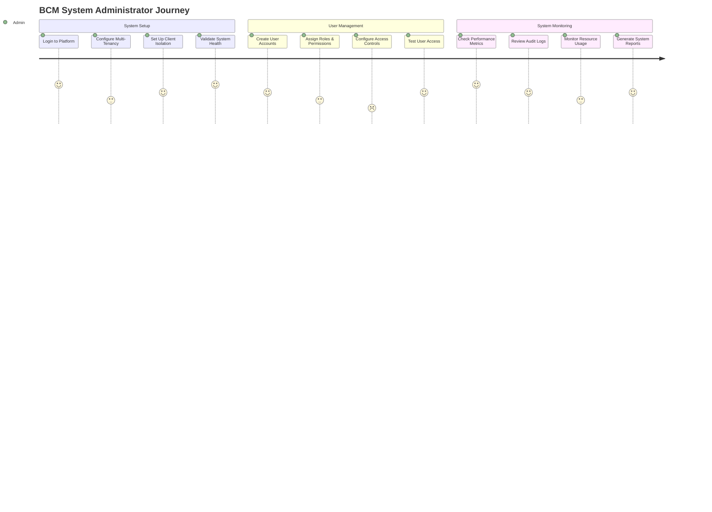

### 1.2 BCM BIA - Business Analyst Journey

### 1.3 BCM Risk Management - Risk Manager Journey

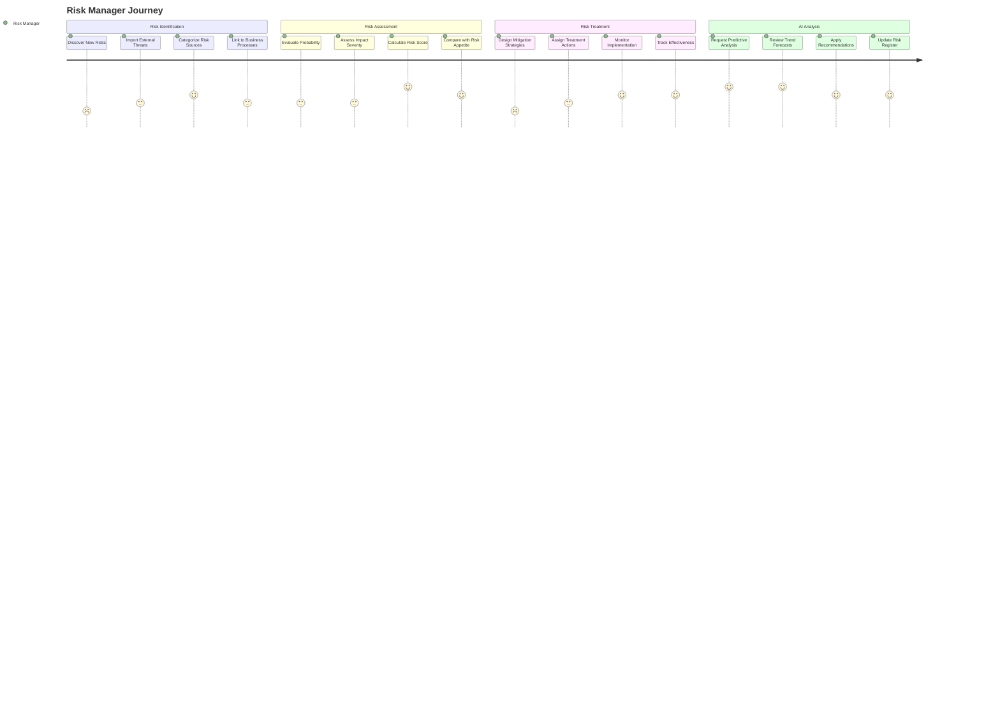

### 1.4 BCM Incident Management - Incident Commander Journey

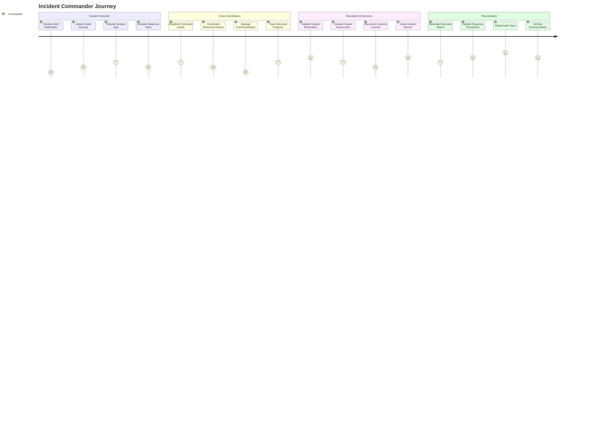

### 1.5 BCM Portal - Client User Journey

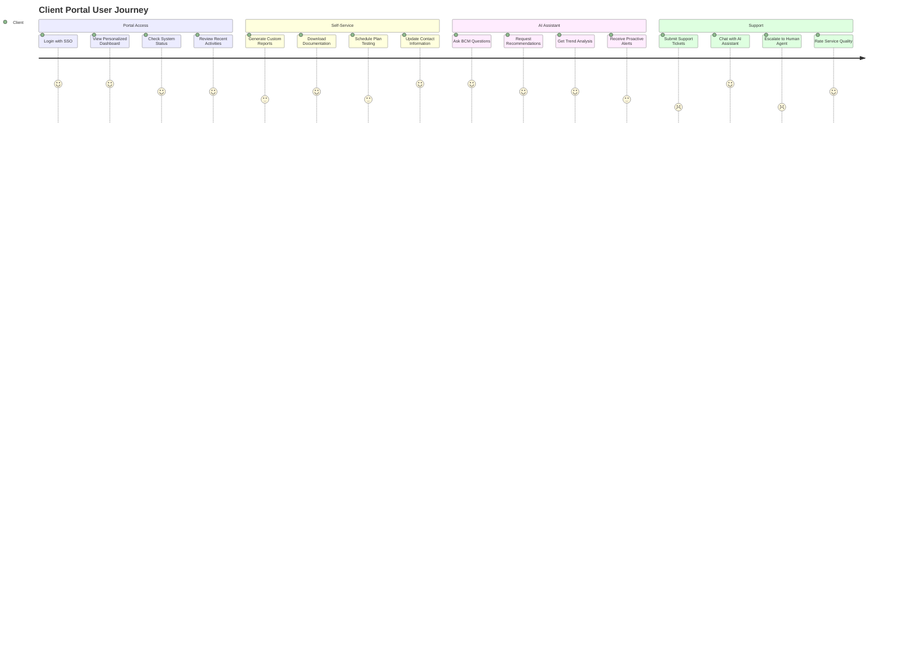

## 2. BPMN Диаграммы - Бизнес-процессы в стандарте

### 2.1 BIA Assessment Process

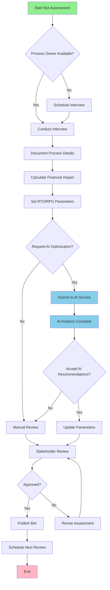

### 2.2 Risk Management Lifecycle

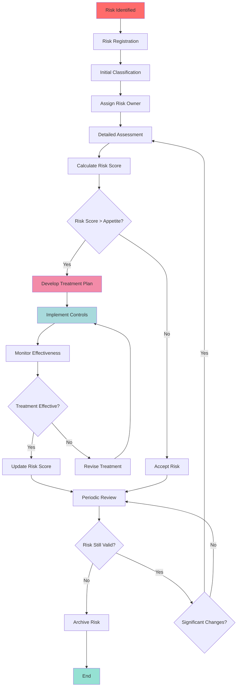

### 2.3 Incident Response Workflow

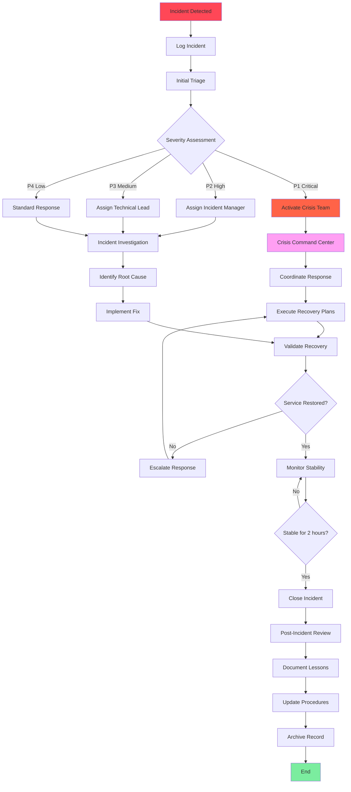

### 2.4 Plan Activation Workflow

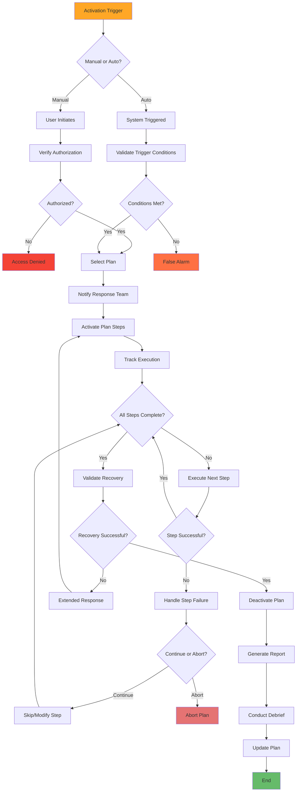

## 3. Event Flow Диаграммы - События между модулями

### 3.1 Cross-Module Event Flow

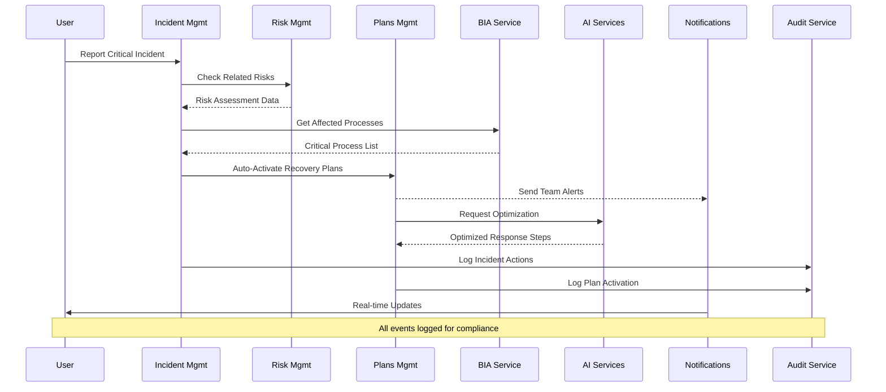

### 3.2 AI-Driven Event Orchestration

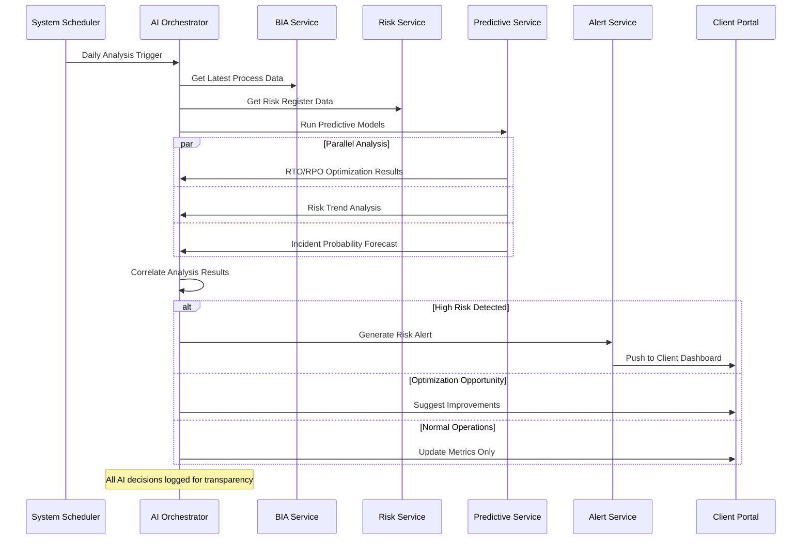

## 4. State Machines - Жизненные циклы объектов

### 4.1 Business Process Lifecycle

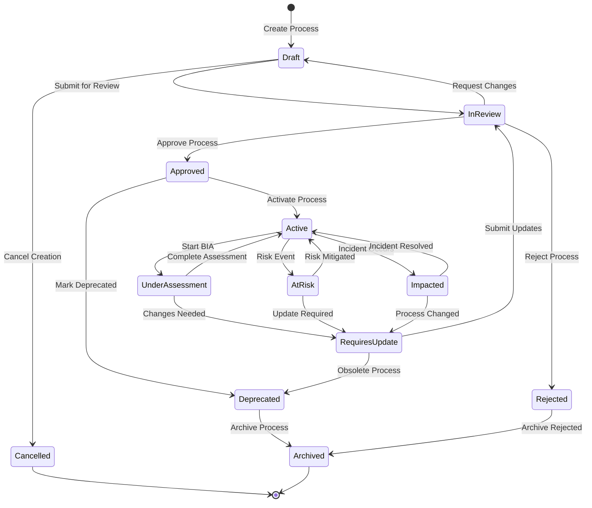

### 4.2 Incident Lifecycle State Machine

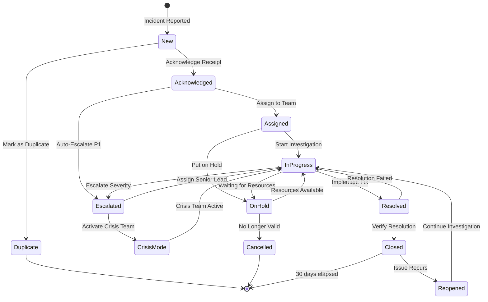

### 4.3 Risk Treatment State Machine

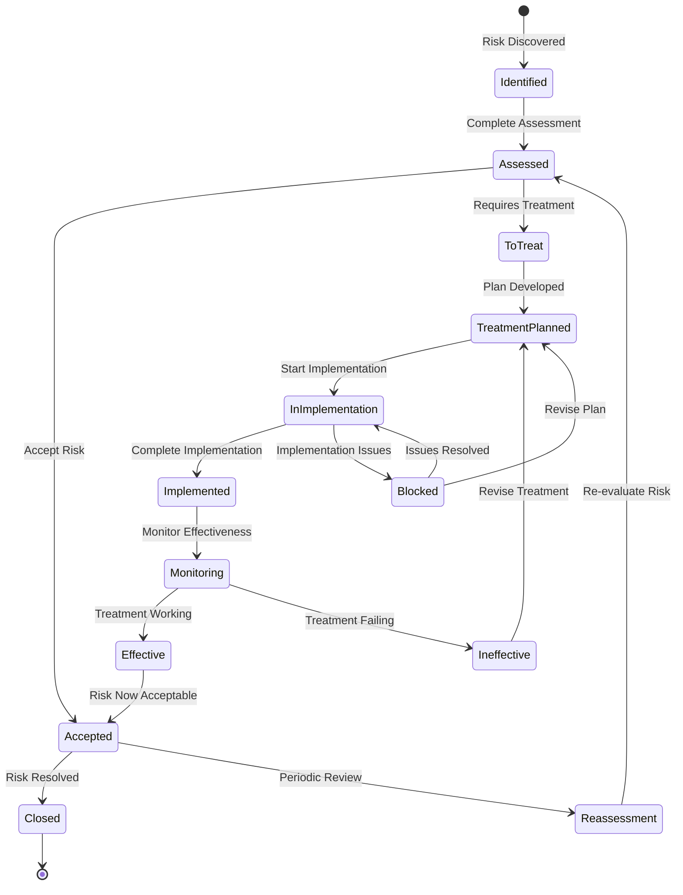

### 4.4 Plan Execution State Machine

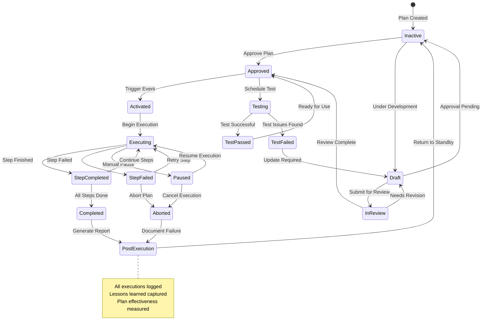

## 5. Module Integration Workflows

### 5.1 Complete BCM Cycle Integration

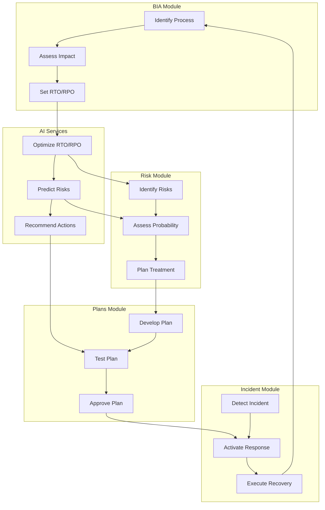

Эта документация покрывает **все 19 модулей** с детальными:
- User Journey Maps
- BPMN процессами
- Event Flow диаграммами
- State машинами жизненных циклов

Каждая диаграмма в формате Mermaid и готова для использования в документации или презентациях!