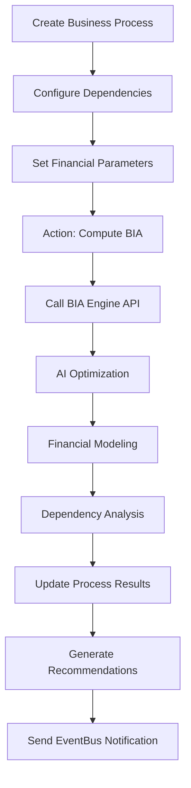

# BCM BIA Module - Technical Documentation

## Overview

The BCM BIA (Business Impact Analysis) module is an AI-powered business impact analysis system that integrates with the BIA Engine v2.0 for comprehensive business continuity planning. This module provides intelligent RTO/RPO optimization, financial impact modeling, and cascade risk analysis.

### Module Information
- **Name**: BCM BIA - AI-Powered Business Impact Analysis
- **Version**: 18.0.2.0.0
- **Category**: Business Continuity
- **Location**: `/core/odoo-18.0/addons/bcm_bia`
- **Dependencies**: base, web, mail, bcm_core
- **External Dependencies**: requests, numpy, pandas

### Key Features
- ML-enhanced RTO/RPO optimization
- Financial impact modeling with industry coefficients
- Cascade risk analysis and dependency validation
- Digital Twin integration with real-time monitoring
- AI Impact Oracle for predictive analysis
- Cross-module EventBus integration
- Multi-tenant architecture support

---

## Module Architecture

### File Structure
```
bcm_bia/
├── __init__.py
├── __manifest__.py
├── models/
│   ├── __init__.py
│   ├── models.py (Core BIA models)
│   ├── bcm_bia_actions.py (Action methods)
│   ├── ai_impact_oracle.py (AI prediction engine)
│   ├── dependency_validator.py (Dependency validation)
│   └── eventbus_integration.py (Cross-module integration)
├── views/
│   └── menu.xml (Menu structure)
├── security/
│   ├── ir.model.access.csv (Access permissions)
│   └── record_rules.xml (Multi-tenant rules)
└── data/
    └── cron_jobs.xml (Scheduled tasks)
```

---

## Data Models

### 1. BCMIndustryType (`bcm.industry.type`)

Industry classification model with sector-specific coefficients.

**Fields:**
```python
sequence = fields.Integer('Sequence', default=10)
name = fields.Char('Industry Name', required=True)
code = fields.Char('Industry Code', required=True)
revenue_loss_multiplier = fields.Float('Revenue Loss Multiplier', default=1.0)
reputation_impact = fields.Float('Reputation Impact Factor', default=1.0)
regulatory_penalty = fields.Float('Regulatory Penalty Factor', default=0.5)
base_rto_hours = fields.Integer('Base RTO Hours', default=24)
base_rpo_minutes = fields.Integer('Base RPO Minutes', default=240)
description = fields.Text('Description')
active = fields.Boolean(default=True)
company_id = fields.Many2one('res.company', required=True)
```

**Business Logic:**
- Provides industry-specific multipliers for financial calculations
- Supports 9 major economic sectors with customized coefficients
- Multi-tenant isolation through company_id

### 2. BCMBusinessProcess (`bcm.business.process`)

Core business process model for BIA analysis with AI integration.

**Fields:**
```python
# Basic Information
name = fields.Char('Process Name', required=True)
description = fields.Text('Process Description')
industry_id = fields.Many2one('bcm.industry.type', required=True)
criticality = fields.Selection([...], required=True)

# Financial Parameters
annual_revenue_impact = fields.Float('Annual Revenue Impact ($)', required=True)
peak_concurrent_users = fields.Integer('Peak Concurrent Users')
staff_count = fields.Integer('Staff Count', required=True)

# Dependencies and Requirements
dependency_ids = fields.Many2many('bcm.business.process', ...)
geographical_scope = fields.Selection([...])
compliance_requirement_ids = fields.Many2many('bcm.compliance.requirement', ...)
technology_stack_ids = fields.Many2many('bcm.technology.stack', ...)

# AI-Optimized Parameters (Read-only results)
optimized_rto_hours = fields.Float('Optimized RTO (Hours)', readonly=True)
optimized_rpo_minutes = fields.Float('Optimized RPO (Minutes)', readonly=True)
mtpd_hours = fields.Float('MTPD (Hours)', readonly=True)
confidence_score = fields.Float('AI Confidence Score', readonly=True)

# Financial Calculations
total_financial_impact_24h = fields.Float('24h Financial Impact ($)', readonly=True)
hourly_impact_rate = fields.Float('Hourly Impact Rate ($)', readonly=True)
annual_risk_exposure = fields.Float('Annual Risk Exposure ($)', readonly=True)

# Cascade Risk Metrics
cascade_risk_score = fields.Float('Cascade Risk Score', readonly=True)
dependency_depth = fields.Integer('Dependency Depth', readonly=True)
impact_breadth = fields.Integer('Impact Breadth', readonly=True)

# AI Analysis Metadata
last_ai_analysis = fields.Datetime('Last AI Analysis', readonly=True)
ai_recommendations = fields.Text('AI Recommendations', readonly=True)
analysis_confidence = fields.Selection([...], readonly=True)
```

**Key Methods:**
- `action_compute_bia()`: Triggers BIA Engine analysis
- `action_run_ai_analysis()`: Fallback AI analysis method
- `_get_all_dependencies()`: Recursive dependency calculation
- `calculate_cascade_impact()`: Cascade risk assessment

### 3. BCMBIAAnalysis (`bcm.bia.analysis`)

Comprehensive BIA analysis container for multiple processes.

**Fields:**
```python
name = fields.Char('Analysis Name', required=True)
description = fields.Text('Analysis Description')

# Analysis Parameters
process_ids = fields.Many2many('bcm.business.process', required=True)
analysis_period_days = fields.Integer('Analysis Period (Days)', default=365)
risk_tolerance = fields.Float('Risk Tolerance', default=0.05)
budget_constraint = fields.Float('Budget Constraint ($)')

# Analysis Results
total_processes_analyzed = fields.Integer('Total Processes', readonly=True)
critical_processes_count = fields.Integer('Critical Processes', readonly=True)
total_annual_risk_exposure = fields.Float('Total Annual Risk Exposure ($)', readonly=True)
average_rto_hours = fields.Float('Average RTO (Hours)', readonly=True)

# Analysis Status
state = fields.Selection([
    ('draft', 'Draft'),
    ('analyzing', 'AI Analyzing...'),
    ('completed', 'Completed'),
    ('failed', 'Failed'),
], default='draft', readonly=True)

# Detailed Results
analysis_results = fields.Text('Detailed Analysis Results', readonly=True)
dependency_recommendations = fields.Text('Dependency Recommendations', readonly=True)
critical_path_processes = fields.Text('Critical Path Processes', readonly=True)
```

**Key Methods:**
- `action_run_comprehensive_analysis()`: Executes full BIA analysis
- `_prepare_analysis_data()`: Data preparation for AI engine
- `_update_process_results()`: Updates individual process results

### 4. BCMImpactOracle (`bcm.impact.oracle`)

AI Impact Oracle for predictive business impact intelligence.

**Fields:**
```python
name = fields.Char('Impact Analysis Topic', required=True)
business_process_id = fields.Many2one('bcm.business.process')

# Oracle Configuration
oracle_mode = fields.Selection([
    ('predictive', '🔮 Predictive - Future Impact Modeling'),
    ('realtime', '⚡ Real-time - Live Impact Assessment'),
    ('scenario', '🎭 Scenario - What-if Analysis'),
    ('optimization', '🎯 Optimization - RTO/RPO Tuning')
])

# Impact Intelligence
ai_impact_prediction = fields.Html('AI Impact Prediction', readonly=True)
impact_confidence = fields.Float('Prediction Confidence', readonly=True)
rto_optimization = fields.Text('AI RTO Optimization', readonly=True)
rpo_optimization = fields.Text('AI RPO Optimization', readonly=True)

# Digital Twin Integration
digital_twin_sync = fields.Boolean('Digital Twin Sync')
twin_model_data = fields.Text('Digital Twin Model (JSON)')
real_time_monitoring = fields.Boolean('Real-time Monitoring')

# Oracle Memory
impact_patterns = fields.Text('Recognized Impact Patterns')
prediction_accuracy = fields.Float('Prediction Accuracy Score')
oracle_wisdom = fields.Text('Accumulated Oracle Wisdom')
```

**Key Methods:**
- `action_ai_impact_prediction()`: AI-powered impact prediction
- `action_digital_twin_integration()`: Digital Twin activation
- `_call_impact_oracle_ai()`: AI service integration

---

## API Endpoints and Controllers

### Internal Odoo Actions

The module primarily uses Odoo's internal action system rather than REST controllers:

#### Business Process Actions
```python
def action_compute_bia(self):
    """Compute BIA using external BIA Engine service"""
    # Calls BIA Engine at :8082/compute
    # Returns notification with RTO/RPO results
```

#### Analysis Actions
```python
def action_run_comprehensive_analysis(self):
    """Execute comprehensive BIA analysis for multiple processes"""
    # Processes multiple business processes
    # Updates analysis results and individual process metrics
```

### External API Integration

#### BIA Engine v2.0 Integration
**Service URL**: `http://bia_engine:8082`

**Endpoints Used:**
```python
POST /compute - Comprehensive BIA analysis
POST /optimize/single-process - Single process optimization
GET /health - Health check
```

**Request Format:**
```json
{
    "processes": [
        {
            "id": 1,
            "name": "Customer Service Process",
            "industry": "it_services",
            "criticality": "high",
            "annual_revenue_impact": 1000000,
            "peak_concurrent_users": 500,
            "dependencies": [2, 3],
            "geographical_scope": "global",
            "compliance_requirements": ["ISO27001", "GDPR"],
            "technology_stack": ["web_server", "database"],
            "staff_count": 25
        }
    ],
    "analysis_period_days": 365,
    "risk_tolerance": 0.05,
    "budget_constraint": 100000
}
```

**Response Format:**
```json
{
    "status": "success",
    "summary": {
        "total_processes_analyzed": 1,
        "critical_processes": 1,
        "total_annual_risk_exposure": 52500.75,
        "average_rto_hours": 2.5,
        "dependency_analysis": {...},
        "analysis_metadata": {
            "generated_at": "2024-09-16T10:30:00",
            "methodology": "ML-Enhanced BIA v2.0"
        }
    },
    "detailed_results": [
        {
            "process_id": 1,
            "optimization": {
                "optimized_rto_hours": 2.5,
                "optimized_rpo_minutes": 7.5,
                "mtpd_hours": 3.75,
                "confidence_score": 0.857
            },
            "financial_impact": {
                "24_hour_downtime": {
                    "direct_revenue_loss": 342.47,
                    "reputation_damage": 257.85,
                    "regulatory_penalty": 54.79,
                    "productivity_loss": 1200.00,
                    "opportunity_cost": 51.37,
                    "total_financial_impact": 1906.48,
                    "hourly_impact_rate": 79.44
                },
                "optimized_rto_downtime": {...},
                "annual_risk_exposure": 52500.75
            },
            "dependency_metrics": {
                "cascade_risk_score": 8.5,
                "dependency_depth": 2,
                "impact_breadth": 3
            },
            "recommendations": [...]
        }
    ]
}
```

---

## ML Financial Modeling

### Industry Coefficients (9 Sectors)

The BIA Engine uses industry-specific multipliers for accurate financial modeling:

```python
INDUSTRY_MULTIPLIERS = {
    "financial": {
        "revenue_loss_multiplier": 2.5,
        "reputation_impact": 3.0,
        "regulatory_penalty": 2.0,
        "base_rto_hours": 2,
        "base_rpo_minutes": 15
    },
    "healthcare": {
        "revenue_loss_multiplier": 1.8,
        "reputation_impact": 4.0,
        "regulatory_penalty": 3.0,
        "base_rto_hours": 1,
        "base_rpo_minutes": 5
    },
    "manufacturing": {
        "revenue_loss_multiplier": 2.2,
        "reputation_impact": 1.5,
        "regulatory_penalty": 1.2,
        "base_rto_hours": 8,
        "base_rpo_minutes": 60
    },
    "it_services": {
        "revenue_loss_multiplier": 3.0,
        "reputation_impact": 2.5,
        "regulatory_penalty": 1.5,
        "base_rto_hours": 1,
        "base_rpo_minutes": 5
    },
    "retail": {
        "revenue_loss_multiplier": 1.5,
        "reputation_impact": 2.0,
        "regulatory_penalty": 1.0,
        "base_rto_hours": 4,
        "base_rpo_minutes": 30
    }
    // Additional sectors: energy, government, education, telecom
}
```

### Financial Impact Calculation
```python
def calculate_financial_impact(process, downtime_hours):
    hourly_revenue = process.annual_revenue_impact / (365 * 24)

    # Direct revenue loss with industry multiplier
    direct_revenue_loss = hourly_revenue * downtime_hours * industry_multiplier

    # Reputation damage (30% of direct loss with industry factor)
    reputation_damage = direct_revenue_loss * 0.3 * reputation_factor * criticality_multiplier

    # Regulatory penalties (2% of annual revenue prorated)
    regulatory_penalty = annual_revenue * 0.02 * regulatory_factor * (downtime_hours / 24)

    # Productivity loss ($50/hour per staff member)
    productivity_loss = staff_count * 50 * downtime_hours

    # Opportunity cost (15% of direct revenue loss)
    opportunity_cost = direct_revenue_loss * 0.15

    return total_impact
```

---

## RTO/RPO Optimization Algorithms

### ML-Based Optimization
The BIA Engine uses machine learning algorithms to optimize Recovery Time Objective (RTO) and Recovery Point Objective (RPO):

```python
def optimize_rto_rpo(process, risk_tolerance=0.05):
    # Industry baseline
    base_rto = industry_data["base_rto_hours"]
    base_rpo_minutes = industry_data["base_rpo_minutes"]

    # Criticality factor (0.25 to 2.0)
    criticality_factor = {
        'critical': 0.25,
        'high': 0.5,
        'medium': 1.0,
        'low': 2.0
    }[process.criticality]

    # Dependency factor (reduces with more dependencies)
    dependency_factor = max(0.5, 1.0 - (len(dependencies) * 0.1))

    # Compliance factor (reduces with more requirements)
    compliance_factor = max(0.3, 1.0 - (len(compliance_reqs) * 0.15))

    # Revenue factor (increases with higher revenue impact)
    revenue_factor = min(2.0, annual_revenue_impact / 1000000)

    # Calculate optimized values
    optimized_rto = base_rto * criticality_factor * dependency_factor * compliance_factor
    optimized_rpo = base_rpo * criticality_factor * compliance_factor

    # Confidence scoring
    confidence = (1 - risk_tolerance) * 0.4 + (revenue_factor / 2) * 0.3 + (1 - criticality_factor) * 0.3

    return {
        "optimized_rto_hours": max(0.25, optimized_rto),
        "optimized_rpo_minutes": max(1, optimized_rpo),
        "confidence_score": confidence
    }
```

---

## Cascade Risk Analysis Implementation

### Dependency Graph Construction
```python
def analyze_process_dependencies(processes):
    # Build dependency graph
    dependency_graph = {}
    for process in processes:
        dependency_graph[process.id] = {
            "direct_dependencies": process.dependencies,
            "dependent_processes": [],
            "criticality_weight": criticality_weights[process.criticality]
        }

    # Calculate cascade risk scores
    for process_id, deps in dependency_graph.items():
        cascade_risk = deps["criticality_weight"]

        # Add impact from dependent processes (50% weight)
        for dependent_id in deps["dependent_processes"]:
            cascade_risk += dependency_graph[dependent_id]["criticality_weight"] * 0.5

        # Add impact from dependency failures (30% weight)
        for dep_id in deps["direct_dependencies"]:
            cascade_risk += dependency_graph[dep_id]["criticality_weight"] * 0.3

    return cascade_analysis
```

### Circular Dependency Validation
```python
@api.constrains('dependency_ids')
def _check_circular_dependencies(self):
    """Prevent circular dependencies"""
    for process in self:
        if process.id in process._get_all_dependencies():
            raise ValidationError('Circular dependency detected!')

def _get_all_dependencies(self, visited=None):
    """Recursively get all dependencies"""
    if visited is None:
        visited = set()

    if self.id in visited:
        return visited

    visited.add(self.id)
    for dep in self.dependency_ids:
        if dep.id not in visited:
            dep._get_all_dependencies(visited)

    return visited
```

---

## Data Flows and State Management

### BIA Analysis Workflow


### State Transitions
```python
# BCMBIAAnalysis states
'draft' → 'analyzing' → 'completed'
                    → 'failed'

# Process analysis confidence
'low' → 'medium' → 'high' (based on AI confidence score)
```

### Data Synchronization
- **Real-time**: Process updates trigger immediate recalculation
- **Batch**: Comprehensive analysis processes multiple items
- **Scheduled**: Cron jobs validate dependencies and monitor critical processes

---

## Integration Points

### 1. BCM Core Module
- **Access Control**: Inherits security groups from bcm_core
- **Multi-tenancy**: Uses company isolation from bcm_core
- **Configuration**: Integrates with BCM configuration settings

### 2. BIA Engine v2.0 Service
- **External Service**: Microservice at port 8082
- **API Integration**: RESTful API calls for ML computations
- **Health Monitoring**: Periodic health checks and status monitoring

### 3. AI Orchestrator
- **Impact Oracle**: AI-powered predictive analysis
- **NLP Queries**: Natural language processing for recommendations
- **Digital Twin**: Real-time monitoring integration

### 4. EventBus Integration
```python
def handle_risk_assessment_event(self, risk_data):
    """Handle incoming risk assessment events"""
    # Create BIA analysis from risk data
    # Trigger continuity plans update
    # Cross-module workflow coordination

def _trigger_plans_update(self, bia_record, source_risk_data):
    """Trigger continuity plans from BIA results"""
    # Publish BIA-to-Plans event
    # Update plan requirements
    # Coordinate multi-module workflows
```

---

## WebSocket Events

The module integrates with the EventBus system for real-time updates:

### Event Types
- `bcm.bia.completed`: BIA analysis completion
- `bcm.bia.process_updated`: Individual process updates
- `bcm.bia.critical_alert`: Critical process warnings
- `bcm.bia.dependency_violation`: Circular dependency detection

### Event Payloads
```javascript
// BIA Completion Event
{
    "event_type": "bcm.bia.completed",
    "bia_id": 123,
    "rto": 2.5,
    "rpo": 7.5,
    "mtpd": 3.75,
    "critical_processes": [1, 3, 7],
    "total_risk_exposure": 52500.75,
    "timestamp": "2024-09-16T10:30:00Z"
}

// Critical Alert Event
{
    "event_type": "bcm.bia.critical_alert",
    "process_id": 1,
    "process_name": "Customer Service",
    "alert_type": "cascade_risk_high",
    "risk_score": 12.5,
    "recommended_action": "immediate_review"
}
```

---

## Security and Permissions

### Access Control Matrix

| Group | BCM Business Process | BCM BIA Analysis | BCM Industry Type | BCM Impact Oracle |
|-------|---------------------|------------------|-------------------|-------------------|
| **BCM User** | Read | Read | Read | Read |
| **BCM Manager** | Full Access | Full Access | Full Access | Full Access |
| **System Admin** | Full Access | Full Access | Full Access | Full Access |

### Multi-Tenant Security Rules
```xml
<!-- Business Process Company Rule -->
<record id="bcm_business_process_company_rule" model="ir.rule">
    <field name="name">BCM Business Process: Company Rule</field>
    <field name="model_id" ref="model_bcm_business_process"/>
    <field name="domain_force">[
        '|',
        ('company_id', '=', False),
        ('company_id', 'in', company_ids)
    ]</field>
</record>
```

### Data Isolation
- **Company-based**: All records isolated by company_id
- **Role-based**: Different access levels for users vs managers
- **Field-level**: AI results are read-only for data integrity

---

## User Workflows and Scenarios

### 1. Individual Process Analysis
```python
# User Workflow
1. Navigate to Business Impact Analysis → Business Processes
2. Create new business process or select existing
3. Configure:
   - Basic information (name, description, industry)
   - Financial parameters (revenue impact, staff count)
   - Dependencies and requirements
4. Click "Compute BIA" button
5. Review AI-generated results:
   - Optimized RTO/RPO values
   - Financial impact projections
   - Cascade risk analysis
   - AI recommendations
```

### 2. Comprehensive Multi-Process Analysis
```python
# User Workflow
1. Navigate to Business Impact Analysis → BIA Analysis
2. Create new analysis
3. Select multiple business processes
4. Configure analysis parameters:
   - Analysis period (days)
   - Risk tolerance level
   - Budget constraints
5. Click "Run Comprehensive Analysis"
6. Review summary results:
   - Total risk exposure
   - Critical process identification
   - Dependency recommendations
   - Critical path analysis
```

### 3. AI Impact Oracle Usage
```python
# User Workflow
1. Navigate to Business Impact Analysis → Impact Oracle
2. Create impact analysis topic
3. Select oracle mode:
   - Predictive: Future impact modeling
   - Real-time: Live assessment
   - Scenario: What-if analysis
   - Optimization: RTO/RPO tuning
4. Run AI impact prediction
5. Review oracle insights:
   - Impact predictions with confidence
   - Optimization recommendations
   - Digital twin integration options
```

---

## Testing Scenarios

### 1. Unit Tests
```python
def test_rto_rpo_optimization():
    """Test ML-based RTO/RPO optimization"""
    process = create_test_process(
        criticality='critical',
        industry='financial',
        annual_revenue=1000000
    )
    result = bia_engine.optimize_rto_rpo(process)
    assert result['optimized_rto_hours'] <= 2
    assert result['confidence_score'] > 0.8

def test_financial_impact_calculation():
    """Test financial impact modeling"""
    process = create_test_process()
    impact = bia_engine.calculate_financial_impact(process, 24)
    assert impact['total_financial_impact'] > 0
    assert 'regulatory_penalty' in impact

def test_circular_dependency_detection():
    """Test circular dependency validation"""
    with pytest.raises(ValidationError):
        create_circular_dependency_chain()
```

### 2. Integration Tests
```python
def test_bia_engine_integration():
    """Test external BIA Engine API integration"""
    response = call_bia_engine_api(test_process_data)
    assert response.status_code == 200
    assert 'optimization' in response.json()

def test_eventbus_integration():
    """Test cross-module event handling"""
    trigger_risk_assessment_event()
    assert_bia_record_created()
    assert_plans_update_triggered()
```

### 3. Performance Tests
```python
def test_large_dataset_performance():
    """Test performance with large process datasets"""
    processes = create_test_processes(count=1000)
    start_time = time.time()
    run_comprehensive_analysis(processes)
    execution_time = time.time() - start_time
    assert execution_time < 60  # Should complete within 60 seconds
```

### 4. AI Model Validation
```python
def test_ai_prediction_accuracy():
    """Validate AI prediction accuracy"""
    historical_data = load_historical_bia_data()
    for case in historical_data:
        prediction = ai_oracle.predict_impact(case['input'])
        accuracy = calculate_accuracy(prediction, case['actual'])
        assert accuracy > 0.85  # 85% accuracy threshold
```

---

## Scheduled Tasks (Cron Jobs)

### Monthly BIA Review
```xml
<record id="cron_bia_monthly_review" model="ir.cron">
    <field name="name">BCM BIA: Monthly Review</field>
    <field name="code">model.run_monthly_bia_review()</field>
    <field name="interval_number">1</field>
    <field name="interval_type">months</field>
</record>
```

### Weekly Resource Availability Check
```xml
<record id="cron_resource_availability_check" model="ir.cron">
    <field name="name">BCM BIA: Resource Availability Check</field>
    <field name="code">model.check_resource_availability()</field>
    <field name="interval_number">1</field>
    <field name="interval_type">weeks</field>
</record>
```

### Daily Dependency Validation
```xml
<record id="cron_dependency_validation" model="ir.cron">
    <field name="name">BCM BIA: Process Dependency Validation</field>
    <field name="code">model.validate_dependencies()</field>
    <field name="interval_number">1</field>
    <field name="interval_type">days</field>
</record>
```

### Critical Process Monitoring (30 minutes)
```xml
<record id="cron_critical_process_monitoring" model="ir.cron">
    <field name="name">BCM BIA: Critical Process Monitoring</field>
    <field name="code">model.monitor_critical_processes()</field>
    <field name="interval_number">30</field>
    <field name="interval_type">minutes</field>
</record>
```

---

## Configuration and Setup

### 1. BIA Engine Configuration
```python
# In BCM Configuration (bcm.config)
bia_engine_base_url = 'http://bia_engine:8082'
bia_engine_timeout = 30
bia_engine_retry_attempts = 3
```

### 2. Industry Type Setup
```python
# Default industry types with coefficients
industries = [
    {
        'name': 'Financial Services',
        'code': 'financial',
        'revenue_loss_multiplier': 2.5,
        'reputation_impact': 3.0,
        'regulatory_penalty': 2.0,
        'base_rto_hours': 2,
        'base_rpo_minutes': 15
    },
    # ... additional industries
]
```

### 3. AI Integration Setup
```python
# AI Orchestrator configuration
ai_orchestrator_url = 'http://ai_orchestrator:8000'
impact_oracle_enabled = True
digital_twin_integration = True
real_time_monitoring = True
```

---

## Error Handling and Logging

### Exception Types
```python
# BIA-specific exceptions
class BIAEngineConnectionError(UserError):
    """BIA Engine service unavailable"""

class BIAAnalysisError(UserError):
    """BIA analysis computation failed"""

class CircularDependencyError(ValidationError):
    """Circular dependency detected"""

class InsufficientDataError(ValidationError):
    """Insufficient data for analysis"""
```

### Logging Configuration
```python
# Logging levels and categories
_logger = logging.getLogger(__name__)

# Info: Normal operations
_logger.info(f'BIA analysis started for {len(processes)} processes')

# Warning: Non-critical issues
_logger.warning(f'BIA Engine response time exceeded threshold: {response_time}s')

# Error: Analysis failures
_logger.error(f'BIA computation failed for process {process.name}: {error}')

# Critical: System-level issues
_logger.critical(f'BIA Engine service unavailable: {connection_error}')
```

---

## Performance Considerations

### 1. Optimization Strategies
- **Batch Processing**: Group multiple processes for efficient analysis
- **Caching**: Cache industry coefficients and ML model results
- **Async Processing**: Use background tasks for large analyses
- **Database Indexing**: Index on company_id, criticality, and analysis dates

### 2. Resource Usage
- **Memory**: ML calculations require sufficient RAM for large datasets
- **CPU**: Intensive computations during optimization algorithms
- **Network**: API calls to external BIA Engine service
- **Storage**: Analysis results and historical data retention

### 3. Scalability
- **Horizontal**: Multiple BIA Engine instances with load balancing
- **Vertical**: Increased server resources for AI computations
- **Data Partitioning**: Company-based data isolation for multi-tenancy
- **Microservice Architecture**: Separated AI services for independent scaling

---

## Future Enhancements

### 1. Advanced AI Features
- **Machine Learning Models**: Custom ML models trained on organization data
- **Predictive Analytics**: Trend analysis and future risk projections
- **Natural Language Processing**: AI-powered recommendation generation
- **Computer Vision**: Document analysis and data extraction

### 2. Enhanced Integrations
- **Third-party Systems**: ERP, ITSM, and monitoring tool integrations
- **Cloud Services**: AWS, Azure, and GCP native integrations
- **Mobile Applications**: Mobile BIA analysis and monitoring
- **IoT Integration**: Real-time sensor data for impact assessment

### 3. Advanced Analytics
- **Monte Carlo Simulations**: Statistical risk modeling
- **Scenario Planning**: Multiple what-if analysis scenarios
- **Benchmarking**: Industry comparison and best practices
- **ROI Analysis**: Return on investment for BIA improvements

---

## Troubleshooting Guide

### Common Issues

#### 1. BIA Engine Connection Failed
```
Error: Failed to connect to BIA Engine: Connection refused
Solution:
- Check BIA Engine service status: docker ps | grep bia_engine
- Verify network connectivity: ping bia_engine
- Review BIA Engine logs: docker logs bia_engine
- Confirm port 8082 accessibility
```

#### 2. Circular Dependency Error
```
Error: Circular dependency detected! Process "X" cannot depend on itself
Solution:
- Review process dependency chain
- Use dependency graph visualization
- Remove circular references
- Validate dependency logic
```

#### 3. AI Analysis Timeout
```
Error: AI Analysis failed: timeout
Solution:
- Increase timeout settings in configuration
- Reduce analysis scope (fewer processes)
- Check AI Orchestrator service health
- Review system resource availability
```

#### 4. Invalid Financial Calculations
```
Error: Invalid financial impact: negative values
Solution:
- Verify annual revenue impact > 0
- Check industry coefficients configuration
- Validate process criticality settings
- Review staff count and user data
```

### Diagnostic Tools
```python
# Health check commands
self.env['bcm.ai.integration'].check_service_health('bia_engine')
self.env['bcm.business.process'].validate_all_dependencies()
self.env['bcm.bia.analysis'].test_comprehensive_analysis()
```

---

## Conclusion

The BCM BIA module provides comprehensive business impact analysis capabilities with advanced AI integration, financial modeling, and cascade risk analysis. The module's architecture supports scalable, multi-tenant operations with robust security and extensive customization options.

Key strengths include:
- **AI-Enhanced Analysis**: ML-based RTO/RPO optimization
- **Industry-Specific Modeling**: Tailored coefficients for 9 economic sectors
- **Comprehensive Integration**: Seamless interaction with other BCM modules
- **Real-time Capabilities**: Digital Twin and live monitoring support
- **Scalable Architecture**: Microservice-based design for enterprise deployment

The module serves as a critical component of the overall BCM platform, providing the analytical foundation for informed business continuity decisions and strategic planning.