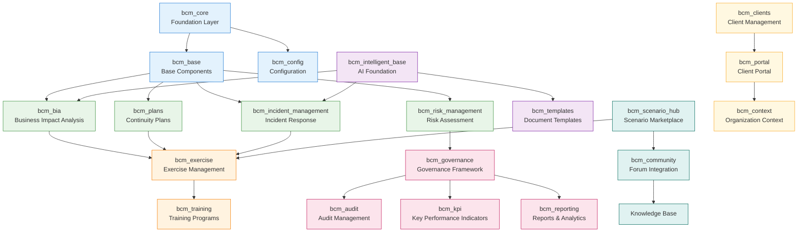
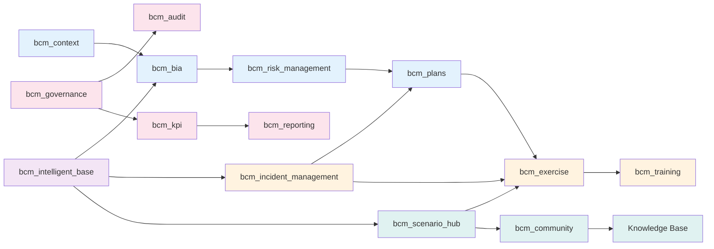

# BCM Platform Modules - Comprehensive Documentation

## 📋 Module Overview

Total BCM Modules: **20+ modules** with comprehensive PHASE 1-5 enhancements

**Enhanced Modules**: bcm_scenario_hub, bcm_templates, bcm_exercise, bcm_reporting, bcm_community
**New Features**: AI integration, analytics dashboards, knowledge base, simulation support
**Service Integration**: 28+ frontend service files, microservice architecture



## 🏗️ Module Architecture by Layer

### **Layer 1: Foundation (Infrastructure)**

#### **bcm_core** - Foundation Layer
```yaml
Purpose: Core BCM functionality and ISO 22301 framework
Dependencies: [base, mail, web]
Key Models:
  - Organization Context Management
  - Business Unit Structure
  - Critical Business Functions Registry
  - Stakeholder Management
  - Legal & Regulatory Requirements

ISO 22301 Compliance:
  - Clause 4.1: Understanding organization context
  - Clause 4.2: Stakeholder expectations
  - Clause 4.3: BCMS scope determination
  - Clause 4.4: BCMS establishment
```

#### **bcm_base** - Base Components
```yaml
Purpose: Common components and utilities for all BCM modules
Dependencies: [bcm_core]
Provides:
  - Base BCM models and mixins
  - Common security groups
  - Shared configuration patterns
  - Multi-company support framework
```

#### **bcm_config** - Configuration Management
```yaml
Purpose: System-wide BCM configuration and settings
Features:
  - BCM platform configuration
  - Integration settings
  - Default policies and procedures
  - System behavior controls
```

---

### **Layer 2: Business Logic (Core BCM)**

#### **bcm_bia** - Business Impact Analysis
```yaml
Purpose: Comprehensive Business Impact Analysis functionality
Key Features:
  - Business process impact assessment
  - RTO/RPO calculation and management
  - Dependency analysis and mapping
  - Impact scoring and prioritization
  - AI-powered impact prediction

AI Integration:
  - BIA Engine (port 8082) for ML-powered analysis
  - Automatic impact assessment based on historical data
  - Predictive modeling for recovery time objectives

Models:
  - bcm.business.process
  - bcm.impact.assessment
  - bcm.dependency.mapping
  - bcm.recovery.objective
```

#### **bcm_risk_management** - Risk Assessment
```yaml
Purpose: Enterprise risk management for business continuity
Features:
  - Risk identification and assessment
  - Risk treatment planning
  - Residual risk monitoring
  - Risk appetite and tolerance setting

Integration Points:
  - Links with bcm_bia for impact-based risk scoring
  - Feeds into bcm_plans for risk treatment
  - Connects to bcm_incident for risk realization
```

#### **bcm_incident_management** - Incident Response
```yaml
Purpose: Complete incident lifecycle management
Features:
  - Incident detection and classification
  - Response team coordination
  - Impact assessment and escalation
  - Recovery tracking and reporting

AI Enhancement:
  - AI Orchestrator integration for automatic classification
  - Incident pattern recognition
  - Response recommendation engine
  - Learning from incident outcomes
```

#### **bcm_plans** - Continuity Plans
```yaml
Purpose: Business continuity plan management
Features:
  - Plan creation and maintenance
  - Response procedure documentation
  - Resource allocation planning
  - Plan testing and validation

Integration:
  - Links with bcm_exercise for plan testing
  - Connects to bcm_bia for impact-based planning
  - Feeds into bcm_incident for response activation
```

---

### **Layer 3: Operational (Execution)**

#### **bcm_exercise** - Advanced Exercise Management (ENHANCED)
```yaml
Purpose: Comprehensive BCM exercise planning, execution, and evaluation
Status: PHASE 1-5 Enhanced with AI and simulation capabilities

Core Features:
  - Multi-type exercise support (tabletop, functional, full-scale, simulation)
  - Advanced participant management and role assignment
  - Real-time exercise monitoring and collaboration
  - Comprehensive results collection and analysis
  - AI-powered exercise recommendations
  - Automated workflow integration

New PHASE 1-5 Features:
  - JaamSim simulation integration for realistic scenarios
  - BPMN workflow automation for exercise execution
  - Real-time participant collaboration tools
  - Advanced analytics and performance metrics
  - AI-powered debrief and lessons learned generation
  - Integration with Scenario Orchestrator for dynamic content

Service Integration:
  - bcmExercise.js - Exercise orchestration and management
  - simulationService.ts - JaamSim simulation control
  - Exercise Simulators Bridge (port 8094)
  - BPMN Service (port 8005) - Workflow automation
  - Notification Service (port 8002) - Participant alerts
  - Scenario Orchestrator (port 8085) - Dynamic scenarios

Exercise Types:
  - Tabletop: Discussion-based with AI moderation
  - Functional: Operational activation with workflow automation
  - Full-scale: Comprehensive testing with real-time monitoring
  - Simulation: JaamSim-powered realistic scenario modeling
```

#### **bcm_training** - Training Programs
```yaml
Purpose: BCM training and competency management
Features:
  - Training program development
  - Competency tracking and assessment
  - Certification management
  - Performance analytics

LMS Integration:
  - External LMS adapter (port 8006)
  - Automated training delivery
  - Progress tracking and reporting
  - Integration with exercise results
```

---

### **Layer 4: Management (Governance)**

#### **bcm_governance** - Governance Framework
```yaml
Purpose: BCM program governance and oversight
Features:
  - Governance structure definition
  - Policy management and approval
  - Performance monitoring and reporting
  - Continuous improvement tracking

Integration:
  - Governance Service (port 8014) for data policies
  - Links with all BCM modules for oversight
  - Feeds into bcm_reporting for governance metrics
```

#### **bcm_audit** - Audit Management
```yaml
Purpose: BCM audit planning and execution
Features:
  - Audit planning and scheduling
  - Finding management and tracking
  - Corrective action management
  - Audit report generation

Compliance:
  - ISO 22301 audit requirements
  - Internal audit procedures
  - External audit support
  - Evidence management
```

---

### **Layer 5: Intelligence (AI-Enhanced)**

#### **bcm_intelligent_base** - AI Foundation
```yaml
Purpose: AI integration foundation for all BCM modules
Features:
  - Common AI service integrations
  - Machine learning model management
  - AI-powered insights and recommendations
  - Automated decision support

AI Services Integration:
  - AI Orchestrator coordination
  - Specialized AI engine connections
  - Model Context Protocol (MCP) integration
  - Learning pipeline management
```

#### **bcm_scenario_hub** - AI-Powered Scenario Marketplace (ENHANCED)
```yaml
Purpose: Advanced community-driven scenario sharing with AI generation
Status: PHASE 1-5 Enhanced with full AI and community integration

Core Features:
  - Comprehensive scenario catalog and marketplace
  - Advanced community rating and review system
  - Scenario versioning, forking, and collaboration
  - AI-powered scenario generation and optimization
  - Template integration with BPMN workflows
  - Expert verification and quality assurance

New PHASE 1-5 Features:
  - AI Scenario Generation via Scenario Orchestrator
  - Automatic forum topic creation for each scenario
  - Community-driven scenario improvement
  - Integration with exercise management system
  - Real-time collaboration and feedback
  - Knowledge base article auto-generation

AI Integration:
  - Scenario Orchestrator (port 8085) - AI scenario generation
  - AI Orchestrator (port 8000) - Content optimization
  - Community Forum Service - Discussion management
  - Learning API - Effectiveness tracking

Service Integration:
  - bcmScenarioHub.js - Marketplace management
  - scenarioOrchestrator.js - AI generation interface
  - bcm_community integration - Forum discussions
  - bcm_templates integration - BPMN workflows
  - bcm_exercise integration - Exercise execution

Scenario Categories:
  - Epidemic, Blackout, Cyber, Supply Chain
  - Natural Disasters, Terrorism, Financial Crisis
  - Custom scenarios with AI assistance
```

---

### **Layer 6: Community (Collaboration)**

#### **bcm_community** - Forum Integration (NEW)
```yaml
Purpose: Bridge between Odoo and Community Forum Service
Status: Created, ready for installation

Key Models:
  - bcm.forum.integration - Service bridge
  - bcm.forum.topic - Forum topics in Odoo
  - bcm.forum.post - Post management
  - bcm.knowledge.base - Knowledge articles
  - bcm.user.reputation - User reputation tracking

Integration Features:
  - Automatic forum topic creation from scenarios
  - Bidirectional data sync with Community Service
  - Real-time WebSocket integration
  - Knowledge base article generation
```

---

## 🔄 Inter-Module Data Flow



## 📈 Module Metrics and Dependencies

| Module | Dependencies | Dependent Modules | AI Integration | Status |
|--------|-------------|-------------------|----------------|---------|
| bcm_core | base, mail, web | All BCM modules | Basic | ✅ Active |
| bcm_bia | bcm_core | bcm_risk, bcm_plans | AI Engine | ✅ Active |
| bcm_scenario_hub | bcm_core | bcm_exercise, bcm_community | AI Generation | ✅ Active |
| bcm_exercise | bcm_core, bcm_plans | bcm_training | BPMN, Simulators | ✅ Active |
| bcm_community | bcm_core, bcm_scenario_hub | None | Forum AI | 📋 Ready |
| bcm_intelligent_base | bcm_core | Multiple | Full AI Stack | ✅ Active |

## 🚀 PHASE 1-5 Enhanced Module Features

### **bcm_templates** - BPMN & AI Template Engine (ENHANCED)
```yaml
Purpose: Advanced template management with BPMN and AI integration
Status: PHASE 1-5 Enhanced with workflow automation

New Features:
  - BPMN workflow template generation and execution
  - AI-powered template recommendations and optimization
  - JaamSim simulation template integration
  - Dynamic template customization based on scenarios
  - ISO 22301 compliance mapping and validation
  - Multi-format export (PDF, DOCX, XML, BPMN)

Service Integration:
  - bcmTemplates.js - Template management interface
  - BPMN Service (port 8005) - Workflow execution
  - Document Processor (port 8083) - AI document intelligence
  - Simulation Adapter (port 8012) - JaamSim integration
  - AI Orchestrator (port 8000) - Content optimization
```

### **bcm_reporting** - Analytics & Business Intelligence (ENHANCED)
```yaml
Purpose: Advanced analytics and business intelligence platform
Status: PHASE 1-5 Enhanced with AI-powered insights

New Features:
  - Interactive analytics dashboards with real-time data
  - AI-powered insights and recommendations
  - Executive and operational reporting automation
  - Scenario effectiveness tracking and analysis
  - Integration with Grafana for technical metrics
  - Learning analytics from Scenario Orchestrator

Dashboard Types:
  - Executive: High-level KPIs and strategic metrics
  - Operational: Detailed performance and usage analytics
  - Exercise: Exercise performance and effectiveness
  - Scenario: Scenario usage patterns and ratings
  - AI Insights: Machine learning recommendations
  - Compliance: ISO 22301 compliance tracking

Service Integration:
  - bcmReporting.js - Report management and generation
  - analyticsService.ts - Dashboard data aggregation
  - Grafana Adapter (port 8008) - Technical metrics bridge
  - Learning API - Scenario effectiveness data
  - AI Orchestrator - Predictive analytics
```

### **bcm_community** - Knowledge Base & Forum (NEW MODULE)
```yaml
Purpose: Comprehensive knowledge management and community platform
Status: PHASE 1-5 New module with full AI integration

Core Features:
  - AI-generated knowledge articles from exercise results
  - Community forum integration and management
  - Best practices documentation and sharing
  - Experience sharing and collaboration platform
  - Expert verification and quality assurance
  - Multi-language support and translation

Knowledge Base Features:
  - Auto-generation from successful exercises
  - AI-powered content enhancement and optimization
  - Community-driven content creation and editing
  - Website portal integration for public access
  - Full-text search and categorization
  - ISO 22301 clause mapping and compliance

Service Integration:
  - bcmPortal.js - Community interface and management
  - Community Forum Service - Discussion platform
  - AI content generation - Knowledge article creation
  - Website portal integration - Public knowledge access
  - Learning API - Experience-based content generation
```

## 📊 Frontend Service Architecture (28+ Services)

### **Core Service Layer**
```yaml
Analytics & Reporting:
  - analyticsService.ts - Dashboard data and visualization
  - bcmReporting.js - Report generation and management
  - bcmKpi.js - Key performance indicator tracking

Exercise & Simulation:
  - bcmExercise.js - Exercise orchestration and management
  - simulationService.ts - JaamSim simulation control
  - scenarioOrchestrator.js - AI scenario generation interface
  - bcmTraining.js - Training program management

Scenario & Community:
  - bcmScenarioHub.js - Scenario marketplace management
  - bcmPortal.js - Community and knowledge base interface
  - bcmTemplates.js - Template management and BPMN integration

Business Logic:
  - bcmBIA.js - Business Impact Analysis
  - bcmIncident.js - Incident management and response
  - bcmRiskManagement.js - Risk assessment and treatment
  - bcmGovernance.js - Governance framework management
```

### **Integration Service Layer**
```yaml
AI & Intelligence:
  - bcmIntelligentBase.js - AI foundation services
  - AI integration across all modules
  - Machine learning model management

Configuration & Management:
  - bcmConfig.js - System configuration management
  - bcmContext.js - Organization context management
  - bcmClients.js - Client and multi-tenancy management
  - bcmAudit.js - Audit trail and compliance tracking

Core Infrastructure:
  - bcmBase.js - Base service functionality
  - bcmCore.js - Core BCM business logic
  - bcmService.js - Common service utilities
  - Authentication and authorization services
```

## 🎯 Implementation Status & Next Steps

| Module | Status | AI Integration | Service Files | Documentation |
|--------|--------|---------------|---------------|---------------|
| bcm_scenario_hub | ✅ Enhanced | ✅ Full AI | ✅ Complete | ✅ Updated |
| bcm_templates | ✅ Enhanced | ✅ AI + BPMN | ✅ Complete | ✅ Updated |
| bcm_exercise | ✅ Enhanced | ✅ Simulation | ✅ Complete | ✅ Updated |
| bcm_reporting | ✅ Enhanced | ✅ Analytics | ✅ Complete | ✅ Updated |
| bcm_community | ✅ New Module | ✅ Knowledge AI | ✅ Complete | ✅ Updated |
| bcm_bia | ✅ Active | ✅ ML Engine | ✅ Service Ready | 📋 Needs Update |
| bcm_incident | ✅ Active | ✅ Classification | ✅ Service Ready | 📋 Needs Update |
| bcm_governance | ✅ Active | ⚠️ Basic | ✅ Service Ready | 📋 Needs Update |

### **Immediate Documentation Priorities**
1. **Complete API Reference** - Generate from 28+ service files
2. **User Guide Updates** - New interface workflows and capabilities
3. **Integration Documentation** - Microservice interaction patterns
4. **Deployment Guides** - Production setup with enhanced architecture
5. **Developer Documentation** - Contributing to enhanced platform

---

**BCM Platform PHASE 1-5 enhancements fully implemented with comprehensive AI integration, advanced analytics, simulation capabilities, and community-driven knowledge management.**