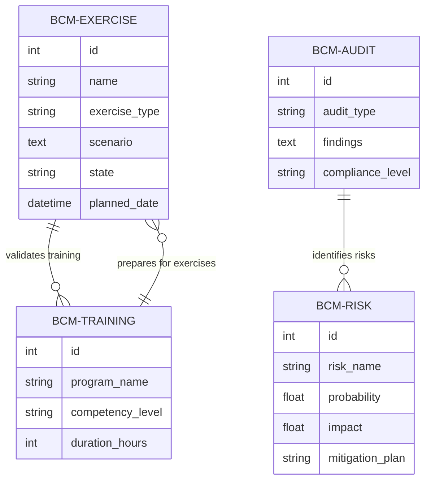

# BCM Операционные Модули - Техническая Документация

## Обзор системы

Данный документ представляет детальный технический анализ пяти основных операционных модулей BCM платформы для соответствия ISO 22301:

1. **bcm_exercise** - Управление учениями и симуляциями
2. **bcm_training** - Управление обучением и компетенциями  
3. **bcm_audit** - Управление аудитами и проверками
4. **bcm_governance** - Управление рисками и соответствием
5. **bcm_reporting** - Отчетность и аналитика

---

## 1. BCM Exercise - Управление Учениями

### 1.1 АНАЛИЗ ТЕКУЩЕГО СОСТОЯНИЯ

**Архитектура модуля:**
- Расположение: `/workspaces/ISO-22301/core/odoo-18.0/addons/bcm_exercise/`
- Статус: Частично реализован (базовая функциональность)
- Основная модель: `BcmExercise` (`bcm.exercise`)
- Дополнительная модель: `BcmExerciseRecord` (`bcm_exercise.record`)

**Текущая структура файлов:**
```
bcm_exercise/
├── data/
│   └── bcm_exercise_data.xml (пустой файл)
├── models/
│   ├── __init__.py
│   └── models.py (основная реализация)
├── security/
│   └── ir.model.access.csv (пустой файл)
└── views/
    └── menu.xml (базовое меню)
```

**Зависимости:**
```python
'depends': [
    'base', 'web', 'mail', 'hr',
    'bcm_intelligent_base',  # Для ИИ анализа
    'bcm_context',           # Связь с контекстом организации
    'bcm_plans',             # Тестирование планов
    'bcm_incident',          # Симуляция инцидентов
]
```

### 1.2 МОДЕЛИ ДАННЫХ

#### Основная модель: BcmExercise

```python
class BcmExercise(models.Model):
    _name = 'bcm.exercise'
    _description = 'BCM Exercise Management'
    _inherit = ['mail.thread', 'bcm.intelligent.base']
    _order = 'create_date desc'
```

**Ключевые поля:**
- `name`: Название учения (обязательное, отслеживается)
- `exercise_type`: Тип учения (tabletop/walkthrough/simulation/fullscale)
- `scenario`: Сценарий учения (Text)
- `ai_generated`: Флаг ИИ-генерированного сценария
- `state`: Статус (requested/pending/scheduled/completed/cancelled)
- `planned_date`: Планируемая дата/время
- `assigned_facilitator`: Назначенный ведущий
- `participant_ids`: Участники (Many2many с res.users)
- `feedback_data`: Данные обратной связи
- `company_id`: Мультитенантность

**Методы:**
- `action_schedule()`: Планирование учения
- `_send_status_notification()`: Отправка уведомлений
- Интеграция с EventBus для внешних систем

### 1.3 БИЗНЕС-ЛОГИКА И ПРОЦЕССЫ

**Workflow учений:**
1. **Requested** → Запрос на проведение учения
2. **Pending** → Ожидание рассмотрения
3. **Scheduled** → Запланировано (с назначением ведущего)
4. **Completed** → Завершено (с обратной связью)
5. **Cancelled** → Отменено

**Автоматизация:**
- Уведомления по email при изменении статуса
- Интеграция с EventBus для внешних систем
- ИИ-генерация сценариев (через bcm_intelligent_base)

### 1.4 GAP ANALYSIS

**Критические недостатки:**
1. **Отсутствуют views** - нет пользовательского интерфейса
2. **Пустая безопасность** - отсутствуют права доступа
3. **Нет моделей сценариев** - ссылка на `bcm_scenario_views.xml` не реализована
4. **Отсутствует оценка эффективности** - нет системы метрик
5. **Нет связи с планами** - отсутствует тестирование BCP/DRP

**Функциональные пробелы:**
- Управление ресурсами для учений
- Календарное планирование
- Шаблоны сценариев по отраслям
- Анализ результативности
- Интеграция с системами мониторинга

---

## 2. BCM Training - Управление Обучением

### 2.1 АНАЛИЗ ТЕКУЩЕГО СОСТОЯНИЯ

**Архитектура модуля:**
- Расположение: `/workspaces/ISO-22301/core/odoo-18.0/addons/bcm_training/`
- Статус: Минимальная заглушка (только базовая модель)
- Основная модель: `BcmTrainingRecord` (`bcm_training.record`)

**Текущая структура:**
```
bcm_training/
├── models/
│   ├── __init__.py
│   └── models.py (только заглушка)
├── security/
│   └── ir.model.access.csv (пустой)
└── views/
    └── menu.xml (базовое меню)
```

**Зависимости:**
```python
'depends': [
    'base', 'web', 'mail', 'hr',
    'bcm_intelligent_base',  # ИИ анализ обучения
    'bcm_context',           # Контекст организации
    'bcm_exercise',          # Практическое обучение
]
```

### 2.2 ТЕКУЩАЯ РЕАЛИЗАЦИЯ

```python
class BcmTrainingRecord(models.Model):
    _name = 'bcm_training.record'
    _description = 'BCM Training Record with Multi-tenancy'
    
    name = fields.Char(required=True)
    active = fields.Boolean(default=True)
    notes = fields.Text()
    company_id = fields.Many2one('res.company', ...)
```

### 2.3 ТРЕБУЕМАЯ ФУНКЦИОНАЛЬНОСТЬ

**Необходимые модели:**
1. **bcm.training.program** - Программы обучения
2. **bcm.training.course** - Курсы и модули
3. **bcm.training.session** - Сессии обучения
4. **bcm.competency.matrix** - Матрица компетенций
5. **bcm.training.assessment** - Оценка знаний
6. **bcm.training.certificate** - Сертификаты

**Ключевые процессы:**
- Планирование обучения по ролям
- Управление компетенциями
- Оценка эффективности обучения
- Интеграция с LMS системами
- Сертификация персонала

### 2.4 GAP ANALYSIS

**Критическое состояние:**
- Модуль практически не реализован
- Отсутствует вся функциональность обучения
- Нет интеграции с HR модулями
- Отсутствует связь с матрицей ролей BCM

---

## 3. BCM Audit - Управление Аудитами

### 3.1 АНАЛИЗ ТЕКУЩЕГО СОСТОЯНИЯ

**Архитектура модуля:**
- Расположение: `/workspaces/ISO-22301/core/odoo-18.0/addons/bcm_audit/`
- Статус: Минимальная заглушка
- Основная модель: `BcmAuditRecord` (`bcm_audit.record`)

**Текущая реализация:**
```python
class BcmAuditRecord(models.Model):
    _name = 'bcm_audit.record'
    _description = 'BCM Audit Record with Multi-tenancy'
    
    name = fields.Char(required=True)
    active = fields.Boolean(default=True)
    notes = fields.Text()
    company_id = fields.Many2one('res.company', ...)
```

### 3.2 ТРЕБУЕМЫЕ МОДЕЛИ И ФУНКЦИИ

**Система управления аудитами:**
1. **bcm.audit.program** - Программы аудитов
2. **bcm.audit.plan** - Планы аудитов
3. **bcm.audit.checklist** - Чек-листы
4. **bcm.audit.finding** - Находки аудита
5. **bcm.audit.corrective.action** - Корректирующие действия
6. **bcm.audit.report** - Отчеты аудитов

**Процессы ISO 22301:**
- Планирование внутренних аудитов
- Управление внешними аудитами
- Отслеживание корректирующих действий
- Анализ трендов соответствия

### 3.3 GAP ANALYSIS

**Полное отсутствие функциональности:**
- Нет системы управления аудитами
- Отсутствуют чек-листы ISO 22301
- Нет трекинга корректирующих действий
- Отсутствует интеграция с документооборотом

---

## 4. BCM Governance - Управление и Соответствие

### 4.1 АНАЛИЗ ТЕКУЩЕГО СОСТОЯНИЯ

**Архитектура модуля:**
- Расположение: `/workspaces/ISO-22301/core/odoo-18.0/addons/bcm_governance/`
- Статус: Частично реализован (есть конфигурация)
- Основные модели: `BcmGovernanceRecord` + `BcmConfig`

**Структура:**
```
bcm_governance/
├── data/
│   └── bcm_governance_data.xml (закомментированные данные)
├── models/
│   ├── bcm_config.py (развитая конфигурация)
│   └── models.py (заглушка)
```

### 4.2 РЕАЛИЗОВАННАЯ ФУНКЦИОНАЛЬНОСТЬ

#### BcmConfig - Конфигурация сервисов

**Интеграция с ИИ сервисами:**
```python
class BcmConfig(models.Model):
    _name = 'bcm.config'
    _description = 'BCM Configuration'
```

**Ключевые возможности:**
- Конфигурация AI Orchestrator, BIA Engine, Event Bus
- Мониторинг статуса сервисов
- Настройка webhooks и аутентификации
- Тестирование соединений
- Мультитенантность

**Методы:**
- `action_test_connection()`: Тестирование сервисов
- `action_test_webhooks()`: Проверка webhooks
- `cron_check_service_status()`: Мониторинг статуса

### 4.3 ТРЕБУЕМОЕ РАЗВИТИЕ

**Модели управления рисками:**
1. **bcm.risk** - Реестр рисков
2. **bcm.risk.category** - Категории рисков
3. **bcm.risk.assessment** - Оценка рисков
4. **bcm.compliance.requirement** - Требования соответствия
5. **bcm.governance.committee** - Комитеты управления

### 4.4 GAP ANALYSIS

**Частичная реализация:**
- Есть хорошая база для интеграции с ИИ
- Отсутствует модуль управления рисками
- Нет системы compliance management
- Отсутствует governance structure

---

## 5. BCM Reporting - Отчетность и Аналитика

### 5.1 АНАЛИЗ ТЕКУЩЕГО СОСТОЯНИЯ

**Архитектура модуля:**
- Расположение: `/workspaces/ISO-22301/core/odoo-18.0/addons/bcm_reporting/`
- Статус: Минимальная заглушка
- Структура: Практически пустая

**Текущая реализация:**
```python
class BcmReporting(models.Model):
    _name = 'bcm.reporting'
    _description = 'BCM Reporting'
    
    name = fields.Char(required=True)
    active = fields.Boolean(default=True)
    company_id = fields.Many2one('res.company', ...)
```

### 5.2 ТРЕБУЕМАЯ ФУНКЦИОНАЛЬНОСТЬ

**Система отчетности:**
1. **bcm.report.template** - Шаблоны отчетов
2. **bcm.dashboard** - Дашборды KPI
3. **bcm.analytics.cube** - Аналитические кубы
4. **bcm.report.schedule** - Расписание отчетов
5. **bcm.kpi.metric** - Метрики эффективности

### 5.3 GAP ANALYSIS

**Критическое отсутствие:**
- Полное отсутствие функциональности отчетности
- Нет дашбордов для руководства
- Отсутствуют KPI метрики BCM
- Нет автоматической генерации отчетов

---

## ПЛАН ПОЭТАПНОЙ ДОРАБОТКИ

### Phase 1: Базовая Стабилизация (1-2 месяца)

**Приоритет 1: Критические исправления**
1. **bcm_exercise**: Создать views, security, демо-данные
2. **bcm_training**: Разработать базовые модели обучения
3. **bcm_audit**: Создать фундаментальные модели аудита
4. **bcm_reporting**: Базовые шаблоны отчетов
5. **Все модули**: Настроить права доступа и безопасность

**Ожидаемые результаты:**
- Функционирующие базовые интерфейсы
- Корректные права доступа
- Демонстрационные данные
- Базовая документация пользователя

### Phase 2: Полнофункциональные Процессы (2-3 месяца)

**bcm_exercise - Расширенная функциональность:**
```python
# Новые модели
class BcmExerciseScenario(models.Model):
    _name = 'bcm.exercise.scenario'
    
class BcmExerciseEvaluation(models.Model):
    _name = 'bcm.exercise.evaluation'
    
class BcmExerciseResource(models.Model):
    _name = 'bcm.exercise.resource'
```

**bcm_training - Полная LMS интеграция:**
```python
class BcmTrainingProgram(models.Model):
    _name = 'bcm.training.program'
    
    # Связь с ролями BCM
    bcm_roles = fields.Many2many('bcm.role')
    # Матрица компетенций  
    competency_matrix = fields.One2many('bcm.competency.matrix.line')
    # Интеграция с внешней LMS
    lms_integration = fields.Boolean()
```

**bcm_audit - Управление аудитами:**
```python
class BcmAuditProgram(models.Model):
    _name = 'bcm.audit.program'
    
    # ISO 22301 чек-листы
    iso22301_checklists = fields.One2many('bcm.audit.checklist')
    # Корректирующие действия
    corrective_actions = fields.One2many('bcm.audit.corrective.action')
```

**bcm_governance - Управление рисками:**
```python
class BcmRisk(models.Model):
    _name = 'bcm.risk'
    
    # Оценка рисков с ИИ
    ai_risk_score = fields.Float()
    ai_recommendations = fields.Text()
    # Связь с BIA
    bia_impact = fields.Many2one('bcm.bia.impact')
```

**bcm_reporting - Аналитика:**
```python
class BcmDashboard(models.Model):
    _name = 'bcm.dashboard'
    
    # KPI метрики
    exercise_completion_rate = fields.Float()
    training_compliance_rate = fields.Float()
    audit_findings_trend = fields.Text()
```

### Phase 3: Интеграция с Внешними Системами (2-3 месяца)

**Интеграции:**
1. **LMS Systems** - Moodle, Coursera, LinkedIn Learning
2. **GRC Platforms** - ServiceNow, Archer, MetricStream  
3. **Document Management** - SharePoint, Confluence
4. **Monitoring Tools** - Nagios, Zabbix, DataDog
5. **Communication** - Slack, Teams, Telegram

**API Design:**
```python
# REST API endpoints
/api/v1/bcm/exercises/{id}/schedule
/api/v1/bcm/training/{program_id}/enroll
/api/v1/bcm/audit/{id}/findings
/api/v1/bcm/risks/{id}/assessment
/api/v1/bcm/reports/{type}/generate
```

### Phase 4: Advanced Analytics и Автоматизация (2-3 месяца)

**ИИ-powered функции:**
1. **Predictive Analytics** - Прогнозирование рисков
2. **NLP Processing** - Анализ документов и feedback
3. **ML Optimization** - Оптимизация RTO/RPO
4. **Automated Recommendations** - ИИ рекомендации

**Advanced Reporting:**
```python
class BcmAdvancedAnalytics(models.Model):
    _name = 'bcm.advanced.analytics'
    
    # ML модели
    risk_prediction_model = fields.Text()
    # Predictive insights  
    future_risk_trends = fields.Text()
    # Automated actions
    ai_automated_actions = fields.One2many('bcm.ai.action')
```

---

## ТЕХНИЧЕСКИЕ СПЕЦИФИКАЦИИ

### Архитектура интеграции

```yaml
BCM Platform Architecture:
  Core Layer:
    - bcm_core: Organization context, base configs
    - bcm_intelligent_base: AI integration layer
  
  Operational Layer:
    - bcm_exercise: Exercise management
    - bcm_training: Learning & competency  
    - bcm_audit: Audit management
    - bcm_governance: Risk & compliance
    - bcm_reporting: Analytics & dashboards
    
  Integration Layer:
    - AI Orchestrator: Central AI coordinator
    - BIA Engine: Impact analysis
    - Event Bus: Real-time messaging
    - Document Processor: AI document analysis
```

### Data Models Relationships



### API Specifications

**Exercise Management API:**
```json
POST /api/v1/exercises
{
    "name": "Cyber Security Incident Response",
    "exercise_type": "simulation", 
    "scenario": "Ransomware attack simulation",
    "participants": [1, 2, 3],
    "planned_date": "2024-03-15T10:00:00Z"
}
```

**Training Integration API:**
```json
POST /api/v1/training/programs
{
    "name": "BCM Fundamentals",
    "target_roles": ["bcm_coordinator", "crisis_manager"],
    "competency_requirements": {
        "iso22301_knowledge": "intermediate",
        "incident_response": "advanced"
    }
}
```

### Performance Requirements

**System Performance:**
- Response Time: < 2 seconds for standard operations
- Concurrent Users: Support up to 1000 users
- Data Volume: Handle 100GB+ of BCM data per tenant
- Availability: 99.9% uptime SLA

**AI Integration Performance:**
- ML Analysis: < 30 seconds for risk assessments
- Document Processing: < 5 seconds per document  
- Real-time Alerts: < 1 second notification delivery

---

## ВЫВОДЫ И РЕКОМЕНДАЦИИ

### Текущее состояние (Критическая оценка)

**Готовность модулей:**
- ✅ **bcm_exercise**: 30% готов (есть базовые модели)
- ❌ **bcm_training**: 5% готов (только заглушки)
- ❌ **bcm_audit**: 5% готов (только заглушки)  
- ⚠️ **bcm_governance**: 15% готов (есть конфигурация)
- ❌ **bcm_reporting**: 5% готов (только заглушки)

### Критические решения

**1. Немедленные действия :**
- Создать базовые views и security для всех модулей
- Наполнить демо-данными для тестирования
- Настроить корректные зависимости между модулями

**2. Среднесрочные задачи (1-3 месяца):**
- Полностью реализовать модели данных
- Создать workflow'ы и бизнес-логику
- Интегрировать с существующей AI инфраструктурой

**3. Долгосрочное развитие (3-12 месяцев):**
- Внешние интеграции (LMS, GRC системы)
- Advanced analytics и machine learning
- Production-ready deployment

### Стратегические рекомендации

**Приоритизация разработки:**
1. **bcm_exercise** → основа для практической отработки BCM
2. **bcm_governance** → критично для соответствия ISO 22301
3. **bcm_audit** → обязательно для сертификации
4. **bcm_training** → поддержка компетенций персонала  
5. **bcm_reporting** → управленческая отчетность

**Технические решения:**
- Использовать существующую AI инфраструктуру максимально
- Создать единую систему прав доступа через bcm_core
- Стандартизировать API для всех внешних интеграций
- Реализовать comprehensive testing strategy

Данная техническая документация служит основой для планирования развития BCM операционных модулей и обеспечения полного соответствия требованиям ISO 22301.