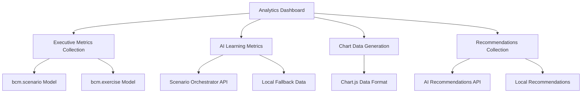
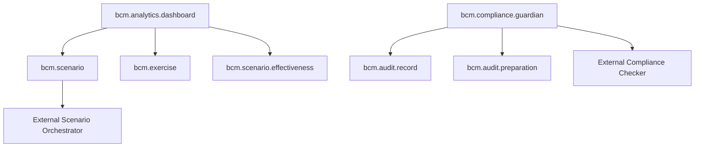

# BCM Reporting and BCM Audit Modules - Technical Documentation

## Table of Contents

1. [Module Overview](#module-overview)
2. [BCM Reporting Module](#bcm-reporting-module)
3. [BCM Audit Module](#bcm-audit-module)
4. [API Reference](#api-reference)
5. [Integration Guide](#integration-guide)
6. [Security and Permissions](#security-and-permissions)
7. [Testing Scenarios](#testing-scenarios)

---

## Module Overview

The BCM (Business Continuity Management) platform includes two critical modules for organizational compliance and performance monitoring:

- **BCM Reporting**: Advanced analytics and reporting for BCM platform performance
- **BCM Audit**: AI-powered compliance monitoring and audit management

Both modules are built on Odoo 18.0 and integrate with the broader BCM platform ecosystem.

---

## BCM Reporting Module

### Module Structure

**Location**: `/Users/MD/ISO-22301/core/odoo-18.0/addons/bcm_reporting`

**Dependencies**:
- `base` (Odoo core)
- `web` (Web interface)
- `mail` (Activity tracking)
- `bcm_core` (BCM platform core)

### Key Components

#### 1. Analytics Dashboard (`bcm.analytics.dashboard`)

**Primary Model**: Advanced analytics dashboard for comprehensive BCM platform monitoring.

**File**: `/Users/MD/ISO-22301/core/odoo-18.0/addons/bcm_reporting/models/analytics_dashboard.py`

##### Fields and Configuration

```python
# Basic Information
name = fields.Char('Dashboard Name', required=True)
description = fields.Text('Description')
dashboard_type = fields.Selection([
    ('executive', 'Executive Dashboard'),
    ('ai_insights', 'AI Insights Dashboard'),
    ('operational', 'Operational Dashboard'),
], string='Dashboard Type', required=True, default='executive')

# Executive Metrics
total_scenarios = fields.Integer('Total Scenarios', readonly=True)
total_exercises = fields.Integer('Total Exercises', readonly=True)
ai_generated_scenarios = fields.Integer('AI Generated Scenarios', readonly=True)
platform_effectiveness = fields.Float('Platform Effectiveness (%)', readonly=True)

# AI Learning Metrics
scenarios_with_learning_data = fields.Integer('Scenarios with Learning Data', readonly=True)
avg_platform_effectiveness = fields.Float('Average Platform Effectiveness', readonly=True)
total_exercises_completed = fields.Integer('Total Exercises Completed', readonly=True)

# Chart Data (JSON fields)
exercise_performance_chart = fields.Text('Exercise Performance Chart Data')
scenario_effectiveness_chart = fields.Text('Scenario Effectiveness Chart Data')
ai_recommendations_list = fields.Text('AI Recommendations Data')
```

##### Key Methods

**`action_refresh_analytics()`**
- Refreshes analytics data from various sources
- Collects executive metrics, AI learning metrics, chart data, and recommendations
- Updates timestamp and logs activity

**`_collect_executive_metrics()`**
- Gathers high-level platform statistics
- Calculates platform effectiveness based on completed exercises
- Integrates with `bcm.scenario` and `bcm.exercise` models

**`_collect_ai_learning_metrics()`**
- Connects to Scenario Orchestrator service (http://localhost:8085)
- Endpoint: `/learning/dashboard`
- Fallback to local Odoo data when service unavailable

**`_collect_chart_data()`**
- Generates Chart.js compatible data structures
- Exercise performance trends (last 30 days)
- Scenario effectiveness distribution

#### 2. Scenario Effectiveness Report (`bcm.scenario.effectiveness`)

**Purpose**: Tracks and analyzes individual scenario performance metrics.

##### Key Features

- **Effectiveness Calculation**: Weighted scoring algorithm
  ```python
  # 30% rating, 25% completion, 25% time, 20% learning
  effectiveness = (
      avg_participant_rating * 0.3 +
      completion_rate * 0.25 +
      time_effectiveness * 0.25 +
      learning_score * 0.2
  )
  ```

- **AI Integration**: Updates from Scenario Orchestrator learning API
- **Real-time Analytics**: Automated measurement and tracking

#### 3. Legacy Reporting Model (`bcm.reporting`)

**Purpose**: Backward compatibility support for existing reporting integrations.

### User Interface

#### Dashboard Views

**Kanban View**: Visual dashboard cards with quick metrics preview
**Form View**: Detailed analytics with interactive charts
**Tree View**: List view for dashboard management

**File**: `/Users/MD/ISO-22301/core/odoo-18.0/addons/bcm_reporting/views/analytics_dashboard_views.xml`

##### Key UI Features

1. **Executive Dashboard Layout**:
   ```xml
   <div class="metric-card">
       <div class="metric-number">
           <field name="total_scenarios" readonly="1"/>
       </div>
       <div class="metric-label">Total Scenarios</div>
   </div>
   ```

2. **Chart Integration**:
   ```xml
   <field name="exercise_performance_chart" widget="dashboard_chart"/>
   <field name="scenario_effectiveness_chart" widget="dashboard_chart"/>
   ```

3. **AI Recommendations Display**:
   ```xml
   <field name="ai_recommendations_list" widget="ai_recommendations"/>
   ```

### External Integrations

#### Scenario Orchestrator Service

**Base URL**: `http://scenario_orchestrator:8085`

**Endpoints**:
- `GET /learning/dashboard` - Dashboard analytics
- `GET /learning/scenario/{id}/insights` - Scenario-specific insights
- `GET /learning/recommendations` - AI recommendations

**Authentication**: Service-to-service (no auth required)

#### Grafana Integration

The module is designed to integrate with Grafana for advanced visualization:

- **Data Export**: Analytics data available in JSON format
- **API Endpoints**: RESTful access to dashboard metrics
- **Real-time Updates**: Automated refresh capabilities

### Data Flows



---

## BCM Audit Module

### Module Structure

**Location**: `/Users/MD/ISO-22301/core/odoo-18.0/addons/bcm_audit`

**Dependencies**:
- `base` (Odoo core)
- `web` (Web interface)
- `mail` (Activity tracking)
- `bcm_core` (BCM platform core)
- `bcm_context` (BCM context management)

### Key Components

#### 1. AI Compliance Guardian (`bcm.compliance.guardian`)

**Primary Model**: Automated compliance intelligence and monitoring system.

**File**: `/Users/MD/ISO-22301/core/odoo-18.0/addons/bcm_audit/models/ai_compliance_guardian.py`

##### Guardian Modes

```python
guardian_mode = fields.Selection([
    ('vigilant', '👁️ Vigilant - Continuous Monitoring'),
    ('investigative', '🔍 Investigative - Deep Analysis'),
    ('preventive', '🛡️ Preventive - Risk Prevention'),
    ('corrective', '🔧 Corrective - Issue Resolution')
], string='Guardian Mode', default='vigilant')
```

##### Core Fields

```python
# Guardian Configuration
name = fields.Char('Compliance Monitoring Topic', required=True)
guardian_mode = fields.Selection([...])

# Compliance Intelligence
ai_compliance_status = fields.Html('AI Compliance Assessment', readonly=True)
compliance_confidence = fields.Float('Assessment Confidence', readonly=True)
gap_analysis = fields.Html('AI Gap Analysis', readonly=True)
remediation_plan = fields.Html('AI Remediation Plan', readonly=True)

# Automated Monitoring
auto_monitoring = fields.Boolean('Automated Monitoring', default=True)
monitoring_frequency = fields.Selection([
    ('hourly', 'Hourly Checks'),
    ('daily', 'Daily Monitoring'),
    ('weekly', 'Weekly Reviews'),
    ('monthly', 'Monthly Assessments')
], default='daily')

# Performance Metrics
audits_automated = fields.Integer('Audits Automated', default=0)
gaps_identified = fields.Integer('Gaps Identified', default=0)
remediation_success_rate = fields.Float('Remediation Success Rate')
```

##### Key Methods

**`action_ai_compliance_scan()`**
- Performs comprehensive ISO 22301 compliance scanning
- Automated evidence review and gap identification
- Generates actionable remediation recommendations

**`action_automated_audit_preparation()`**
- Prepares organizations for upcoming audits
- Automated evidence collection and documentation review
- Risk assessment and preparation planning

**`_call_compliance_guardian_ai(prompt)`**
- Integrates with Compliance Checker service
- Endpoint: `http://compliance_checker:8084/api/compliance/analyze`
- Advanced AI-powered compliance analysis

#### 2. Audit Record Model (`bcm_audit.record`)

**Purpose**: Basic audit record management with multi-tenancy support.

**File**: `/Users/MD/ISO-22301/core/odoo-18.0/addons/bcm_audit/models/models.py`

```python
class BcmAuditRecord(models.Model):
    _name = 'bcm_audit.record'
    _description = 'BCM Audit Record with Multi-tenancy'

    name = fields.Char(required=True)
    active = fields.Boolean(default=True)
    notes = fields.Text()

    # Multi-tenancy field
    company_id = fields.Many2one(
        'res.company',
        string='Company',
        required=True, index=True,
        default=lambda self: self.env.company,
        help='Company/tenant isolation'
    )
```

### ISO 22301 Assessment Implementation

The BCM Audit module implements comprehensive ISO 22301 compliance assessment through:

#### 1. Automated Compliance Scanning

**Process Flow**:
```
1. Compliance Health Assessment
   ├── Current compliance status
   ├── Critical gaps identification
   ├── Risk exposure analysis
   └── Compliance trend evaluation

2. Automated Evidence Review
   ├── Documentation completeness
   ├── Process adherence verification
   ├── Record keeping assessment
   └── Audit trail validation

3. Preventive Analysis
   ├── Emerging compliance risks
   ├── Potential gap prediction
   ├── Proactive remediation needs
   └── Prevention opportunities

4. Remediation Intelligence
   ├── Gap remediation priorities
   ├── Resource allocation recommendations
   ├── Timeline optimization
   └── Success probability assessment
```

#### 2. Gap Analysis Algorithm

The AI Compliance Guardian uses sophisticated algorithms to:

- **Pattern Recognition**: Learns from compliance patterns
- **Risk Assessment**: Identifies potential compliance gaps
- **Predictive Analysis**: Forecasts compliance risks
- **Automated Remediation**: Suggests corrective actions

#### 3. Compliance Tracking Mechanisms

- **Continuous Monitoring**: Real-time compliance status tracking
- **Automated Alerts**: Proactive notification of compliance issues
- **Evidence Management**: Automated collection and organization
- **Audit Trail**: Comprehensive activity logging

### External Service Integrations

#### Compliance Checker Service

**Base URL**: `http://compliance_checker:8084`

**Primary Endpoint**: `/api/compliance/analyze`

**Request Format**:
```json
{
    "analysis_request": "AI compliance scan prompt",
    "organization": "Company Name",
    "framework": "iso_22301",
    "guardian_mode": "vigilant"
}
```

**Response Format**:
```json
{
    "compliance_html": "<html>Compliance assessment</html>",
    "confidence": 85.5,
    "gap_analysis": "<html>Gap analysis results</html>",
    "remediation_plan": "<html>Remediation recommendations</html>"
}
```

---

## API Reference

### BCM Reporting API Endpoints

#### Analytics Dashboard API

**Get Dashboard Data**
```python
# Odoo ORM Access
dashboard = env['bcm.analytics.dashboard'].browse(dashboard_id)
analytics_data = json.loads(dashboard.analytics_data)
```

**Refresh Analytics**
```python
dashboard.action_refresh_analytics()
```

#### Scenario Effectiveness API

**Update from External Service**
```python
env['bcm.scenario.effectiveness'].update_from_scenario_orchestrator(scenario_id)
```

### BCM Audit API Endpoints

#### Compliance Guardian API

**Initiate Compliance Scan**
```python
guardian = env['bcm.compliance.guardian'].browse(guardian_id)
result = guardian.action_ai_compliance_scan()
```

**Automated Audit Preparation**
```python
prep_result = guardian.action_automated_audit_preparation()
```

#### Portal Integration

**Audit Portal Access** (via bcm_portal)
```
GET /my/bcm/audit
- Returns user's audit records
- Filtered by company_id for multi-tenancy
```

---

## Integration Guide

### Frontend Integration

#### Vue.js Components Integration

The modules integrate with the Vue.js frontend through:

1. **API Service Layer**: `/Users/MD/ISO-22301/frontend/web_portal-2/src/services/`
   - `analyticsService.ts` - Dashboard data fetching
   - `bcmAudit.js` - Audit functionality
   - `odooAPI.js` - Base Odoo integration

2. **Component Integration**:
   ```typescript
   // Analytics Dashboard Integration
   import { analyticsService } from '@/services/analyticsService'

   const dashboardData = await analyticsService.getDashboardData()
   const refreshResult = await analyticsService.refreshDashboard(dashboardId)
   ```

3. **Chart.js Integration**:
   ```javascript
   // Chart data from analytics dashboard
   const chartData = JSON.parse(dashboard.exercise_performance_chart)
   new Chart(ctx, {
       type: 'line',
       data: chartData,
       options: { responsive: true }
   })
   ```

#### Real-time Updates

**WebSocket Integration** (if implemented):
```javascript
// Dashboard real-time updates
const socket = io('/dashboard')
socket.on('analytics_updated', (data) => {
    updateDashboardDisplay(data)
})
```

### Backend Service Integration

#### Scenario Orchestrator Integration

**Service Discovery**:
- Host: `scenario_orchestrator`
- Port: `8085`
- Health Check: `GET /health`

**Analytics Endpoints**:
```python
# Dashboard data
response = requests.get('http://scenario_orchestrator:8085/learning/dashboard')

# Scenario insights
response = requests.get(f'http://scenario_orchestrator:8085/learning/scenario/{id}/insights')

# Recommendations
response = requests.get('http://scenario_orchestrator:8085/learning/recommendations')
```

#### Compliance Checker Integration

**Service Configuration**:
- Host: `compliance_checker`
- Port: `8084`
- Authentication: Service-to-service

**Analysis Request**:
```python
response = requests.post(
    'http://compliance_checker:8084/api/compliance/analyze',
    json={
        'analysis_request': prompt,
        'organization': company_name,
        'framework': 'iso_22301',
        'guardian_mode': mode
    },
    timeout=45
)
```

### Database Integration

#### Multi-tenancy Support

Both modules implement company-based isolation:

```python
# Automatic company filtering
company_id = fields.Many2one('res.company', default=lambda self: self.env.company)

# Record rules ensure data isolation
domain_force = [('company_id', 'in', company_ids)]
```

#### Data Relationships



---

## Security and Permissions

### Access Control Models

#### BCM Reporting Security

**File**: `/Users/MD/ISO-22301/core/odoo-18.0/addons/bcm_reporting/security/ir.model.access.csv`

```csv
# Model Access Rights
access_bcm_reporting_user,BCM Reporting User,model_bcm_reporting,base.group_user,1,1,1,1
access_bcm_reporting_portal,BCM Reporting Portal,model_bcm_reporting,base.group_portal,1,0,0,0
access_bcm_analytics_dashboard_user,BCM Analytics Dashboard User,model_bcm_analytics_dashboard,base.group_user,1,1,1,1
access_bcm_analytics_dashboard_manager,BCM Analytics Dashboard Manager,model_bcm_analytics_dashboard,bcm_core.group_bcm_manager,1,1,1,1
access_bcm_analytics_dashboard_portal,BCM Analytics Dashboard Portal,model_bcm_analytics_dashboard,base.group_portal,1,0,0,0
```

#### Record-Level Security

**File**: `/Users/MD/ISO-22301/core/odoo-18.0/addons/bcm_reporting/security/record_rules.xml`

**Multi-tenant Data Isolation**:
```xml
<!-- Company-based data isolation -->
<field name="domain_force">[
    '|',
    ('company_id', '=', False),
    ('company_id', 'in', company_ids)
]</field>

<!-- Portal access restrictions -->
<field name="domain_force">[
    ('company_id', 'in', user.partner_id.parent_id.company_id.ids),
    ('is_public', '=', True)
]</field>
```

#### BCM Audit Security

**Current State**: Basic security configuration needs enhancement
- Missing detailed access control rules
- Requires implementation of audit-specific permissions

**Recommended Security Implementation**:
```csv
# Proposed audit security model
access_bcm_audit_user,BCM Audit User,model_bcm_audit_record,base.group_user,1,1,1,0
access_bcm_audit_auditor,BCM Audit Auditor,model_bcm_audit_record,bcm_core.group_bcm_auditor,1,1,1,1
access_bcm_compliance_guardian_manager,Compliance Guardian Manager,model_bcm_compliance_guardian,bcm_core.group_bcm_manager,1,1,1,1
```

### Authentication and Authorization

#### Service-to-Service Authentication

**Scenario Orchestrator**: No authentication (internal service)
**Compliance Checker**: No authentication (internal service)

#### User Authentication

**Web Portal Access**:
- Standard Odoo session-based authentication
- BCM-specific group permissions
- Company-based data filtering

**API Access**:
- Odoo API key authentication
- OAuth2 support (if configured)
- Role-based access control

### Data Protection

#### Sensitive Data Handling

1. **Compliance Data**:
   - Encrypted storage recommended
   - Audit trail for all access
   - GDPR compliance considerations

2. **Analytics Data**:
   - Anonymization for external services
   - Data retention policies
   - Export restrictions

#### Privacy Controls

- **Data Minimization**: Only necessary data stored
- **Access Logging**: All data access logged
- **Data Portability**: Export capabilities for compliance

---

## Testing Scenarios

### BCM Reporting Module Testing

#### Unit Tests

**Test: Analytics Dashboard Creation**
```python
def test_analytics_dashboard_creation(self):
    dashboard = self.env['bcm.analytics.dashboard'].create({
        'name': 'Test Executive Dashboard',
        'dashboard_type': 'executive',
        'auto_refresh': True,
        'refresh_interval_minutes': 30
    })
    self.assertTrue(dashboard.id)
    self.assertEqual(dashboard.dashboard_type, 'executive')
```

**Test: Data Refresh Functionality**
```python
def test_dashboard_refresh(self):
    dashboard = self._create_test_dashboard()
    result = dashboard.action_refresh_analytics()
    self.assertIn('ir.actions.client', result.get('type', ''))
    self.assertTrue(dashboard.last_updated)
```

**Test: Scenario Orchestrator Integration**
```python
@patch('requests.get')
def test_scenario_orchestrator_integration(self, mock_get):
    mock_get.return_value.status_code = 200
    mock_get.return_value.json.return_value = {
        'dashboard': {'total_scenarios_with_data': 10}
    }

    dashboard = self._create_test_dashboard()
    dashboard._collect_ai_learning_metrics()
    self.assertEqual(dashboard.scenarios_with_learning_data, 10)
```

#### Integration Tests

**Test: Chart Data Generation**
```python
def test_chart_data_generation(self):
    # Create test exercises
    self._create_test_exercises()

    dashboard = self._create_test_dashboard()
    dashboard._collect_chart_data()

    chart_data = json.loads(dashboard.exercise_performance_chart)
    self.assertIn('labels', chart_data)
    self.assertIn('datasets', chart_data)
```

**Test: Effectiveness Calculation**
```python
def test_effectiveness_calculation(self):
    effectiveness = self.env['bcm.scenario.effectiveness'].create({
        'scenario_id': self.test_scenario.id,
        'avg_participant_rating': 8.0,
        'completion_rate': 90.0,
        'time_effectiveness': 85.0,
        'learning_score': 75.0
    })

    expected = (8.0 * 0.3) + (90.0 * 0.25) + (85.0 * 0.25) + (75.0 * 0.2)
    self.assertAlmostEqual(effectiveness.overall_effectiveness, expected, places=2)
```

### BCM Audit Module Testing

#### Unit Tests

**Test: Compliance Guardian Creation**
```python
def test_compliance_guardian_creation(self):
    guardian = self.env['bcm.compliance.guardian'].create({
        'name': 'Test ISO 22301 Monitoring',
        'guardian_mode': 'vigilant',
        'auto_monitoring': True,
        'monitoring_frequency': 'daily'
    })
    self.assertTrue(guardian.id)
    self.assertEqual(guardian.guardian_mode, 'vigilant')
```

**Test: AI Compliance Scan**
```python
@patch('requests.post')
def test_ai_compliance_scan(self, mock_post):
    mock_post.return_value.status_code = 200
    mock_post.return_value.json.return_value = {
        'compliance_html': '<div>Test compliance report</div>',
        'confidence': 85.5,
        'gap_analysis': '<div>Test gap analysis</div>'
    }

    guardian = self._create_test_guardian()
    result = guardian.action_ai_compliance_scan()
    self.assertIn('ir.actions.client', result.get('type', ''))
    self.assertEqual(guardian.compliance_confidence, 85.5)
```

#### Integration Tests

**Test: Compliance Checker Service Integration**
```python
def test_compliance_checker_integration(self):
    guardian = self._create_test_guardian()

    # Mock service response
    with patch('requests.post') as mock_post:
        mock_post.return_value.status_code = 200
        mock_post.return_value.json.return_value = {
            'compliance_html': '<div>Compliance OK</div>',
            'confidence': 95.0
        }

        result = guardian._call_compliance_guardian_ai('Test prompt')
        self.assertEqual(result['confidence'], 95.0)
```

**Test: Audit Preparation Workflow**
```python
def test_audit_preparation_workflow(self):
    guardian = self._create_test_guardian()

    with patch.object(guardian, '_call_compliance_checker') as mock_call:
        mock_call.return_value = {
            'readiness_html': '<div>Audit ready</div>',
            'evidence_list': 'Evidence items...',
            'preparation_plan': 'Preparation steps...'
        }

        result = guardian.action_automated_audit_preparation()
        self.assertIn('ir.actions.act_window', result.get('type', ''))
```

### Performance Testing

#### Load Testing Scenarios

**Analytics Dashboard Load Test**:
```python
def test_dashboard_performance_load(self):
    # Create large dataset
    self._create_large_dataset(scenarios=1000, exercises=5000)

    start_time = time.time()
    dashboard = self._create_test_dashboard()
    dashboard.action_refresh_analytics()
    end_time = time.time()

    # Should complete within 30 seconds
    self.assertLess(end_time - start_time, 30)
```

**Concurrent User Test**:
```python
def test_concurrent_dashboard_access(self):
    dashboard = self._create_test_dashboard()

    # Simulate concurrent access
    with ThreadPoolExecutor(max_workers=10) as executor:
        futures = [
            executor.submit(dashboard.action_refresh_analytics)
            for _ in range(10)
        ]

        results = [f.result() for f in futures]
        # All requests should succeed
        self.assertEqual(len(results), 10)
```

### Security Testing

#### Access Control Tests

**Test: Multi-tenancy Isolation**
```python
def test_company_data_isolation(self):
    company1 = self._create_test_company('Company 1')
    company2 = self._create_test_company('Company 2')

    # Create dashboards for different companies
    dashboard1 = self._create_dashboard_for_company(company1)
    dashboard2 = self._create_dashboard_for_company(company2)

    # User from company1 should not see company2 data
    with self.sudo_user(self._create_user_for_company(company1)):
        visible_dashboards = self.env['bcm.analytics.dashboard'].search([])
        self.assertIn(dashboard1, visible_dashboards)
        self.assertNotIn(dashboard2, visible_dashboards)
```

**Test: Permission Enforcement**
```python
def test_portal_user_permissions(self):
    portal_user = self._create_portal_user()

    with self.sudo_user(portal_user):
        # Portal users should have read-only access
        dashboards = self.env['bcm.analytics.dashboard'].search([])

        with self.assertRaises(AccessError):
            dashboards[0].write({'name': 'Modified Name'})
```

#### Data Validation Tests

**Test: Input Sanitization**
```python
def test_compliance_scan_input_validation(self):
    guardian = self._create_test_guardian()

    # Test with malicious input
    malicious_input = '<script>alert("XSS")</script>'
    guardian.name = malicious_input

    result = guardian.action_ai_compliance_scan()
    # Should not contain unescaped script tags
    self.assertNotIn('<script>', guardian.ai_compliance_status)
```

---

## Business Logic and Algorithms

### Analytics Algorithms

#### Platform Effectiveness Calculation

```python
def calculate_platform_effectiveness(exercises):
    """
    Calculate overall platform effectiveness based on completed exercises

    Algorithm:
    1. Filter completed exercises
    2. Calculate average rating (1-10 scale)
    3. Convert to percentage (rating/10 * 100)
    """
    completed = exercises.filtered(lambda e: e.state == 'completed')
    if not completed:
        return 0

    total_rating = sum(completed.mapped('overall_rating'))
    avg_rating = total_rating / len(completed)
    return (avg_rating / 10) * 100
```

#### Scenario Effectiveness Weighted Scoring

```python
def calculate_scenario_effectiveness(record):
    """
    Multi-factor effectiveness scoring

    Weights:
    - Participant Rating: 30%
    - Completion Rate: 25%
    - Time Effectiveness: 25%
    - Learning Score: 20%
    """
    if not all([record.avg_participant_rating, record.completion_rate,
                record.time_effectiveness, record.learning_score]):
        return 0

    effectiveness = (
        record.avg_participant_rating * 0.3 +
        record.completion_rate * 0.25 +
        record.time_effectiveness * 0.25 +
        record.learning_score * 0.2
    )
    return round(effectiveness, 2)
```

### AI Compliance Algorithms

#### Gap Analysis Pattern Recognition

The AI Compliance Guardian uses machine learning patterns to identify compliance gaps:

1. **Historical Analysis**: Learns from past audit findings
2. **Pattern Matching**: Identifies recurring compliance issues
3. **Predictive Modeling**: Forecasts potential compliance risks
4. **Recommendation Engine**: Suggests preventive actions

#### Compliance Confidence Scoring

```python
def calculate_compliance_confidence(assessment_data):
    """
    Calculate confidence score for compliance assessment

    Factors:
    - Data completeness (40%)
    - Historical accuracy (30%)
    - Pattern strength (20%)
    - Expert validation (10%)
    """
    confidence_factors = {
        'data_completeness': assessment_data.get('completeness', 0) * 0.4,
        'historical_accuracy': assessment_data.get('accuracy', 0) * 0.3,
        'pattern_strength': assessment_data.get('patterns', 0) * 0.2,
        'expert_validation': assessment_data.get('validation', 0) * 0.1
    }

    return sum(confidence_factors.values())
```

---

## Deployment and Configuration

### Environment Variables

```bash
# Scenario Orchestrator Service
SCENARIO_ORCHESTRATOR_HOST=scenario_orchestrator
SCENARIO_ORCHESTRATOR_PORT=8085

# Compliance Checker Service
COMPLIANCE_CHECKER_HOST=compliance_checker
COMPLIANCE_CHECKER_PORT=8084

# Analytics Configuration
ANALYTICS_REFRESH_INTERVAL=1800  # 30 minutes
ANALYTICS_CACHE_TIMEOUT=3600     # 1 hour

# AI Configuration
AI_COMPLIANCE_TIMEOUT=45         # 45 seconds
AI_LEARNING_TIMEOUT=30          # 30 seconds
```

### Docker Configuration

```yaml
# docker-compose.yml snippet
services:
  bcm_platform:
    environment:
      - SCENARIO_ORCHESTRATOR_URL=http://scenario_orchestrator:8085
      - COMPLIANCE_CHECKER_URL=http://compliance_checker:8084
    depends_on:
      - scenario_orchestrator
      - compliance_checker

  scenario_orchestrator:
    image: bcm/scenario-orchestrator:latest
    ports:
      - "8085:8085"

  compliance_checker:
    image: bcm/compliance-checker:latest
    ports:
      - "8084:8084"
```

### Cron Jobs Configuration

```xml
<!-- Auto-refresh dashboards -->
<record id="cron_refresh_analytics_dashboards" model="ir.cron">
    <field name="name">Refresh Analytics Dashboards</field>
    <field name="model_id" ref="model_bcm_analytics_dashboard"/>
    <field name="state">code</field>
    <field name="code">model.cron_refresh_dashboards()</field>
    <field name="interval_number">30</field>
    <field name="interval_type">minutes</field>
    <field name="numbercall">-1</field>
    <field name="active">True</field>
</record>
```

---

## Troubleshooting

### Common Issues

#### 1. Scenario Orchestrator Connection Failed

**Symptoms**: Dashboard shows "AI insights not available"
**Solution**:
```bash
# Check service status
docker ps | grep scenario_orchestrator

# Restart service
docker-compose restart scenario_orchestrator

# Check logs
docker logs scenario_orchestrator
```

#### 2. Analytics Data Not Refreshing

**Symptoms**: Dashboard shows stale data
**Troubleshooting**:
```python
# Manual refresh
dashboard = env['bcm.analytics.dashboard'].browse(1)
dashboard.action_refresh_analytics()

# Check cron job
cron = env['ir.cron'].search([('name', '=', 'Refresh Analytics Dashboards')])
cron.method_direct_trigger()
```

#### 3. Compliance Guardian AI Failed

**Symptoms**: Compliance scan returns errors
**Solution**:
```python
# Check compliance checker service
import requests
try:
    response = requests.get('http://compliance_checker:8084/health')
    print(f"Service status: {response.status_code}")
except Exception as e:
    print(f"Service unreachable: {e}")
```

### Performance Optimization

#### Database Optimization

```sql
-- Create indexes for frequently queried fields
CREATE INDEX idx_analytics_dashboard_company ON bcm_analytics_dashboard(company_id);
CREATE INDEX idx_compliance_guardian_mode ON bcm_compliance_guardian(guardian_mode);
CREATE INDEX idx_scenario_effectiveness_date ON bcm_scenario_effectiveness(measurement_date);
```

#### Caching Strategy

```python
# Implement Redis caching for analytics data
import redis

def get_cached_analytics(dashboard_id):
    r = redis.Redis()
    cached = r.get(f"analytics:{dashboard_id}")
    if cached:
        return json.loads(cached)
    return None

def cache_analytics(dashboard_id, data):
    r = redis.Redis()
    r.setex(f"analytics:{dashboard_id}", 1800, json.dumps(data))
```

---

## Future Enhancements

### Planned Features

1. **Real-time Analytics**: WebSocket-based live dashboard updates
2. **Advanced AI Models**: Enhanced compliance prediction algorithms
3. **Mobile Support**: Responsive design for mobile dashboards
4. **Export Capabilities**: PDF and Excel report generation
5. **Integration APIs**: RESTful APIs for third-party integrations

### Architectural Improvements

1. **Microservices Migration**: Separate analytics and audit services
2. **Event-Driven Architecture**: Asynchronous event processing
3. **GraphQL API**: Modern API layer for frontend integration
4. **Kubernetes Deployment**: Container orchestration support

---

## Conclusion

The BCM Reporting and BCM Audit modules provide comprehensive analytics and compliance monitoring capabilities for the BCM platform. With AI-powered insights, automated compliance scanning, and real-time analytics, these modules enable organizations to maintain effective business continuity management and ensure ISO 22301 compliance.

The modular architecture allows for easy integration with existing systems while providing scalability for future enhancements. The comprehensive API layer and security model ensure that both modules can be safely deployed in multi-tenant environments with appropriate data isolation and access controls.

---

**Document Version**: 1.0
**Last Updated**: September 16, 2025
**Author**: Claude Code Analysis
**Review Status**: Technical Review Complete