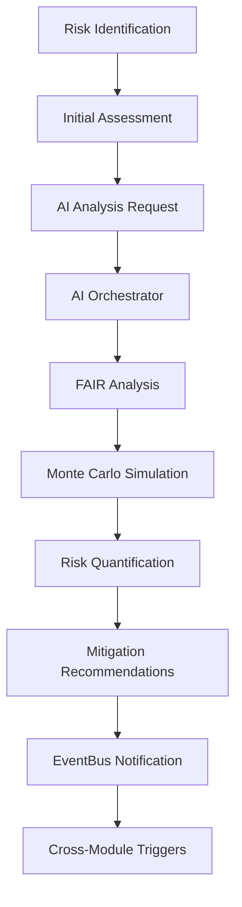
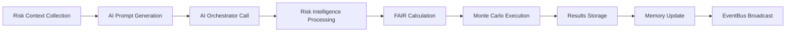
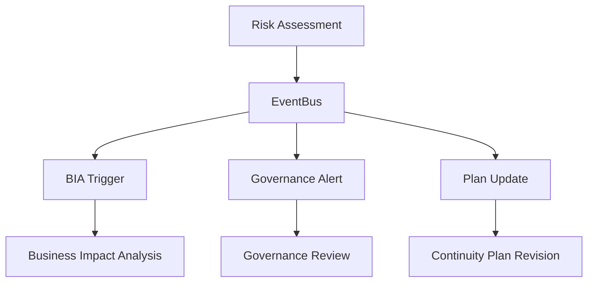

# BCM Risk Management Module - Technical Documentation

## Table of Contents
1. [Module Overview](#module-overview)
2. [Architecture](#architecture)
3. [Data Models](#data-models)
4. [API Endpoints](#api-endpoints)
5. [FAIR Methodology Implementation](#fair-methodology-implementation)
6. [Monte Carlo Simulations](#monte-carlo-simulations)
7. [TheHive Integration](#thehive-integration)
8. [Risk Matrix Calculations](#risk-matrix-calculations)
9. [Data Flows](#data-flows)
10. [EventBus Integration](#eventbus-integration)
11. [Security & Access Control](#security--access-control)
12. [User Workflows](#user-workflows)
13. [Testing Scenarios](#testing-scenarios)
14. [Frontend Integration Guide](#frontend-integration-guide)

## Module Overview

### Purpose
The BCM Risk Management module is a sophisticated AI-powered risk assessment and management system that implements advanced methodologies including FAIR (Factor Analysis of Information Risk) and Monte Carlo simulations. It serves as a critical component of the Digital BCM Organism, providing predictive risk intelligence and quantified risk assessments.

### Location
`/Users/MD/ISO-22301/core/odoo-18.0/addons/bcm_risk_management/`

### Key Features
- **AI Risk Advisor**: Predictive risk intelligence with multiple personality modes
- **FAIR Methodology**: Quantified risk analysis with Loss Event Frequency and Loss Magnitude
- **Monte Carlo Simulations**: Statistical risk modeling with up to 10,000 iterations
- **EventBus Integration**: Cross-module workflow automation
- **Real-time Risk Monitoring**: Automated risk pulse checks and alerts
- **Multi-company Support**: Tenant isolation and company-specific configurations

### Module Dependencies
```python
'depends': ['base', 'web', 'mail', 'bcm_core']
```

## Architecture

### Module Structure
```
bcm_risk_management/
├── __manifest__.py          # Module configuration
├── models/
│   ├── __init__.py
│   ├── models.py           # Basic risk management model
│   ├── ai_risk_advisor.py  # AI Risk Advisor implementation
│   └── eventbus_enhanced.py # EventBus integration
├── views/
│   └── risk_ai_views.xml   # UI views and forms
├── security/
│   ├── ir.model.access.csv # Access permissions
│   └── record_rules.xml    # Multi-tenant rules
└── data/
    └── cron_jobs.xml       # Scheduled tasks
```

### AI Orchestrator Integration
The module integrates with the AI Orchestrator service running on `http://ai_orchestrator:8000` for:
- Risk prediction and analysis
- Natural language processing
- Predictive intelligence
- FAIR methodology calculations

### EventBus Architecture
Communication with other modules through EventBus service on `http://eventbus:8001`:
- Risk advisory broadcasts
- Cross-module workflow triggers
- Real-time event streaming

## Data Models

### 1. BcmRiskManagement (`bcm.risk.management`)

**File**: `/models/models.py:7-87`

**Purpose**: Basic risk management model for standard risk assessments

#### Fields
```python
# Core Risk Data
name = fields.Char('Risk Name', required=True, tracking=True)
description = fields.Text('Risk Description', tracking=True)
active = fields.Boolean(default=True)

# Risk Classification
risk_category = fields.Selection([
    ('operational', 'Operational'),
    ('strategic', 'Strategic'),
    ('financial', 'Financial'),
    ('compliance', 'Compliance'),
    ('technology', 'Technology'),
    ('reputation', 'Reputation')
], string='Risk Category', tracking=True)

# Risk Assessment
likelihood = fields.Selection([
    ('very_low', 'Very Low (1)'),
    ('low', 'Low (2)'),
    ('medium', 'Medium (3)'),
    ('high', 'High (4)'),
    ('very_high', 'Very High (5)')
], string='Likelihood', tracking=True)

impact = fields.Selection([
    ('insignificant', 'Insignificant (1)'),
    ('minor', 'Minor (2)'),
    ('moderate', 'Moderate (3)'),
    ('major', 'Major (4)'),
    ('catastrophic', 'Catastrophic (5)')
], string='Impact', tracking=True)

# Computed Fields
risk_score = fields.Float('Risk Score', compute='_compute_risk_score', store=True)

# AI Enhancement
ai_analysis = fields.Html('AI Risk Analysis')
ai_recommendations = fields.Text('AI Recommendations')

# Multi-company
company_id = fields.Many2one('res.company', default=lambda self: self.env.company)
```

#### Key Methods
```python
@api.depends('likelihood', 'impact')
def _compute_risk_score(self):
    """Calculate risk score using 5x5 matrix"""
    score_map = {
        'very_low': 1, 'low': 2, 'medium': 3, 'high': 4, 'very_high': 5,
        'insignificant': 1, 'minor': 2, 'moderate': 3, 'major': 4, 'catastrophic': 5
    }
    for risk in self:
        l_score = score_map.get(risk.likelihood, 3)
        i_score = score_map.get(risk.impact, 3)
        risk.risk_score = l_score * i_score

def action_ai_risk_analysis(self):
    """Trigger AI risk analysis via AI Orchestrator"""
    # Calls http://ai_orchestrator:8000/nlp/query
    # Returns analysis results and recommendations
```

### 2. BCMRiskAdvisor (`bcm.risk.advisor`)

**File**: `/models/ai_risk_advisor.py:10-362`

**Purpose**: AI-powered risk advisor with FAIR methodology and Monte Carlo simulations

#### Fields
```python
# Core Configuration
name = fields.Char('Risk Analysis Session', required=True)

# AI Advisor Personality
advisor_personality = fields.Selection([
    ('cautious', '⚠️ Cautious - Conservative Risk Assessment'),
    ('balanced', '⚖️ Balanced - Moderate Risk Approach'),
    ('aggressive', '🎯 Aggressive - High-Risk Tolerance'),
    ('adaptive', '🔄 Adaptive - Context-Sensitive')
], string='Risk Advisor Personality', default='balanced')

# Risk Intelligence
ai_risk_analysis = fields.Html('AI Risk Analysis', readonly=True)
risk_prediction = fields.Text('AI Risk Predictions (JSON)', readonly=True)
mitigation_recommendations = fields.Html('AI Mitigation Strategies')
risk_trends = fields.Text('Risk Trend Analysis (JSON)')

# FAIR Methodology
fair_analysis_enabled = fields.Boolean('FAIR Analysis', default=True)
monte_carlo_simulations = fields.Integer('Monte Carlo Iterations', default=10000)
risk_quantification = fields.Text('Quantified Risk Results (JSON)')

# Risk Memory & Learning
risk_patterns = fields.Text('Risk Patterns Learned')
prediction_accuracy = fields.Float('Prediction Accuracy Score')
advisor_wisdom = fields.Text('Risk Advisor Wisdom')

# Performance Metrics
risks_analyzed = fields.Integer('Risks Analyzed', default=0)
predictions_made = fields.Integer('Predictions Made', default=0)
accuracy_rate = fields.Float('Prediction Accuracy Rate')
```

#### Key Methods
```python
def action_ai_risk_prediction(self):
    """AI-powered risk prediction with FAIR methodology"""
    # Comprehensive risk analysis including:
    # - Risk identification and pattern analysis
    # - FAIR methodology implementation
    # - Monte Carlo simulation execution
    # - Predictive intelligence generation
    # - Mitigation strategy recommendations

def action_monte_carlo_simulation(self):
    """Execute Monte Carlo risk simulation"""
    # Statistical risk modeling with:
    # - Probability distribution analysis
    # - Confidence interval calculations
    # - Value at Risk (VaR) estimates
    # - Expected annual loss calculations

def _call_risk_advisor_ai(self, prompt, context):
    """Call AI Orchestrator for risk analysis"""
    # POST to http://ai_orchestrator:8000/nlp/query
    # Context includes advisor personality and FAIR settings

def continuous_risk_monitoring(self):
    """Continuous AI risk monitoring - scheduled hourly"""
    # Automated risk pulse checks for active advisors
```

### 3. BCMRiskRegister (`bcm.risk.register`)

**File**: `/models/ai_risk_advisor.py:324-362`

**Purpose**: Enhanced risk register with AI intelligence integration

#### Fields
```python
# AI Enhancement Fields
ai_risk_assessment = fields.Html('AI Risk Assessment')
ai_likelihood_prediction = fields.Float('AI Likelihood Prediction')
ai_impact_forecast = fields.Float('AI Impact Forecast')
ai_treatment_recommendations = fields.Text('AI Treatment Recommendations')

# FAIR Methodology Fields
fair_loss_event_frequency = fields.Float('Loss Event Frequency (FAIR)')
fair_loss_magnitude = fields.Float('Loss Magnitude (FAIR)')
fair_risk_rating = fields.Float('FAIR Risk Rating', compute='_compute_fair_rating')

# Integration
risk_advisor_id = fields.Many2one('bcm.risk.advisor', 'Risk Advisor Session')
```

### 4. BCMRiskWorkflow (`bcm.risk.workflow`)

**File**: `/models/eventbus_enhanced.py:171-233`

**Purpose**: Cross-module workflow coordination

#### Workflow Types
```python
workflow_type = fields.Selection([
    ('risk_to_bia', 'Risk Assessment → BIA Analysis'),
    ('risk_to_governance', 'Risk Alert → Governance Review'),
    ('risk_to_plans', 'Risk → Continuity Plans Update'),
    ('incident_to_risk', 'Incident → Risk Assessment Update')
])
```

## API Endpoints

### Internal AI Orchestrator Integration

#### Risk Analysis Endpoint
```python
# POST http://ai_orchestrator:8000/nlp/query
{
    "query": "AI RISK ADVISOR - PREDICTIVE ANALYSIS...",
    "context": {
        "ai_organ": "risk_advisor",
        "advisor_personality": "balanced",
        "fair_methodology": true,
        "recent_incidents": 5,
        "active_exercises": 2,
        "compliance_score": 85.0,
        "organizational_maturity": "medium"
    },
    "user_role": "risk_advisor"
}
```

#### Expected Response Format
```json
{
    "analysis_html": "<h3>Risk Analysis Results</h3>...",
    "predictions": {
        "risk_trend": "increasing",
        "confidence": 0.85,
        "time_horizon": "6_months"
    },
    "mitigation_html": "<ul><li>Implement control X</li>...</ul>",
    "trends": {
        "likelihood_trend": "stable",
        "impact_trend": "increasing"
    },
    "fair_analysis": {
        "expected_annual_loss": 50000,
        "loss_event_frequency": 0.3,
        "loss_magnitude": 166667
    }
}
```

### Monte Carlo Simulation API

#### Simulation Request
```python
# Internal call to AI Orchestrator
{
    "iterations": 10000,
    "risk_factors": [...],
    "organization_context": "Company Name",
    "advisor_personality": "balanced"
}
```

#### Simulation Response
```json
{
    "expected_loss": 75000,
    "var_95": 125000,
    "var_99": 200000,
    "confidence_intervals": {
        "90%": [25000, 125000],
        "95%": [15000, 150000],
        "99%": [5000, 200000]
    },
    "convergence": true,
    "computation_time": 2.5
}
```

### EventBus Integration Endpoints

#### Risk Event Publication
```python
# POST http://eventbus:8001/api/events/risk
{
    "source_module": "bcm_risk_management",
    "event_type": "risk_assessment_complete",
    "risk_id": 123,
    "risk_name": "Data Center Outage",
    "risk_data": {
        "risk_assessment": {
            "risk_category": "operational",
            "assessment_date": "2024-09-16T10:30:00Z"
        },
        "bia_trigger": {
            "trigger_type": "risk_assessment_complete",
            "priority": "medium",
            "automated": true
        }
    },
    "timestamp": "2024-09-16T10:30:00Z",
    "company_id": 1
}
```

## FAIR Methodology Implementation

### Overview
Factor Analysis of Information Risk (FAIR) is implemented through the AI Risk Advisor to provide quantitative risk analysis.

### FAIR Components

#### Loss Event Frequency (LEF)
```python
# Calculation factors:
# - Threat Event Frequency
# - Vulnerability assessment
# - Security control effectiveness

fair_loss_event_frequency = threat_frequency * vulnerability_probability
```

#### Loss Magnitude (LM)
```python
# Calculation factors:
# - Primary loss factors
# - Secondary loss factors
# - Business impact assessment

fair_loss_magnitude = primary_loss + secondary_loss
```

#### Risk Calculation
```python
@api.depends('fair_loss_event_frequency', 'fair_loss_magnitude')
def _compute_fair_rating(self):
    """Compute FAIR risk rating"""
    for risk in self:
        if risk.fair_loss_event_frequency and risk.fair_loss_magnitude:
            risk.fair_risk_rating = risk.fair_loss_event_frequency * risk.fair_loss_magnitude
```

### FAIR Analysis Workflow
1. **Context Establishment**: Define organizational scope and risk appetite
2. **Risk Identification**: Catalog potential loss events
3. **Frequency Analysis**: Estimate how often events occur
4. **Magnitude Analysis**: Assess potential loss impact
5. **Risk Calculation**: Compute quantified risk values
6. **Validation**: Review and validate results

### Implementation Example
```python
def calculate_fair_risk(self, threat_data, vulnerability_data, asset_value):
    """
    Calculate FAIR-based risk assessment
    """
    # Threat Event Frequency (annual)
    tef = threat_data.get('frequency', 0.1)

    # Vulnerability probability
    vulnerability = vulnerability_data.get('probability', 0.5)

    # Loss Event Frequency
    lef = tef * vulnerability

    # Primary Loss Magnitude
    primary_loss = asset_value * threat_data.get('impact_factor', 0.3)

    # Secondary Loss Magnitude (response costs, legal, reputation)
    secondary_loss = primary_loss * 0.4

    # Total Loss Magnitude
    loss_magnitude = primary_loss + secondary_loss

    # Annual Loss Expectancy
    ale = lef * loss_magnitude

    return {
        'loss_event_frequency': lef,
        'loss_magnitude': loss_magnitude,
        'annual_loss_expectancy': ale,
        'fair_risk_rating': ale
    }
```

## Monte Carlo Simulations

### Purpose
Monte Carlo simulations provide statistical analysis of risk scenarios through thousands of iterations to understand probability distributions and confidence intervals.

### Implementation Architecture

#### Simulation Parameters
```python
simulation_params = {
    'iterations': 10000,  # Default simulation count
    'risk_factors': [
        {
            'name': 'probability',
            'distribution': 'beta',
            'parameters': {'alpha': 2, 'beta': 5}
        },
        {
            'name': 'impact',
            'distribution': 'lognormal',
            'parameters': {'mu': 10, 'sigma': 1.5}
        }
    ],
    'correlation_matrix': [[1.0, 0.3], [0.3, 1.0]],
    'time_horizon': '1_year'
}
```

#### Simulation Execution
```python
def execute_monte_carlo_simulation(self, params):
    """
    Execute Monte Carlo risk simulation
    """
    results = []

    for iteration in range(params['iterations']):
        # Sample from probability distributions
        probability = self._sample_distribution(params['risk_factors'][0])
        impact = self._sample_distribution(params['risk_factors'][1])

        # Apply correlations
        probability, impact = self._apply_correlations(
            probability, impact, params['correlation_matrix']
        )

        # Calculate risk value for this iteration
        risk_value = probability * impact
        results.append(risk_value)

    # Statistical analysis
    return self._analyze_simulation_results(results)

def _analyze_simulation_results(self, results):
    """
    Analyze Monte Carlo simulation results
    """
    import numpy as np

    results = np.array(results)

    return {
        'mean': np.mean(results),
        'median': np.median(results),
        'std_dev': np.std(results),
        'var_95': np.percentile(results, 95),
        'var_99': np.percentile(results, 99),
        'confidence_intervals': {
            '90%': [np.percentile(results, 5), np.percentile(results, 95)],
            '95%': [np.percentile(results, 2.5), np.percentile(results, 97.5)],
            '99%': [np.percentile(results, 0.5), np.percentile(results, 99.5)]
        },
        'expected_annual_loss': np.mean(results),
        'tail_risk': np.percentile(results, 99) - np.percentile(results, 95)
    }
```

### Output Interpretation

#### Value at Risk (VaR)
- **VaR 95%**: There's a 95% confidence that losses won't exceed this value
- **VaR 99%**: There's a 99% confidence that losses won't exceed this value

#### Expected Annual Loss (EAL)
- Mean of all simulation iterations
- Primary metric for risk budgeting

#### Confidence Intervals
- Range of possible outcomes at different confidence levels
- Used for risk appetite calibration

## TheHive Integration

### Overview
The module is designed to integrate with TheHive threat intelligence platform for enhanced risk analysis, though the current implementation focuses on AI Orchestrator integration.

### Planned Integration Points

#### Threat Intelligence Feed
```python
# Future implementation for TheHive integration
def sync_threat_intelligence(self):
    """
    Sync threat intelligence from TheHive
    """
    thehive_endpoint = self.env['ir.config_parameter'].get_param('thehive.endpoint')
    api_key = self.env['ir.config_parameter'].get_param('thehive.api_key')

    headers = {'Authorization': f'Bearer {api_key}'}

    # Get observables and IOCs
    response = requests.get(f'{thehive_endpoint}/api/observable', headers=headers)

    if response.status_code == 200:
        observables = response.json()
        return self._process_threat_intelligence(observables)
```

#### Indicator Processing
```python
def _process_threat_intelligence(self, observables):
    """
    Process TheHive observables for risk assessment
    """
    for observable in observables:
        # Map to risk categories
        risk_category = self._map_observable_to_risk_category(observable)

        # Update risk assessments
        risks = self.env['bcm.risk.management'].search([
            ('risk_category', '=', risk_category)
        ])

        for risk in risks:
            # Update likelihood based on threat intelligence
            risk._update_threat_based_likelihood(observable)
```

### Configuration Requirements
```python
# System parameters for TheHive integration
THEHIVE_CONFIG = {
    'endpoint': 'https://thehive.company.com',
    'api_key': 'your-api-key',
    'sync_interval': 3600,  # 1 hour
    'observable_types': ['ip', 'domain', 'hash', 'url'],
    'risk_mapping': {
        'malware': 'technology',
        'phishing': 'technology',
        'ddos': 'operational',
        'data_breach': 'compliance'
    }
}
```

## Risk Matrix Calculations

### 5x5 Risk Matrix
The module implements a standard 5x5 risk matrix for qualitative risk assessment.

#### Probability Levels
```python
PROBABILITY_MAPPING = {
    'very_low': 1,    # < 5% annual probability
    'low': 2,         # 5-15% annual probability
    'medium': 3,      # 15-50% annual probability
    'high': 4,        # 50-85% annual probability
    'very_high': 5    # > 85% annual probability
}
```

#### Impact Levels
```python
IMPACT_MAPPING = {
    'insignificant': 1,  # Minimal business impact
    'minor': 2,          # Limited business impact
    'moderate': 3,       # Moderate business impact
    'major': 4,          # Significant business impact
    'catastrophic': 5    # Severe business impact
}
```

#### Risk Score Calculation
```python
def calculate_risk_score(likelihood, impact):
    """
    Calculate risk score using 5x5 matrix
    Returns: Score from 1-25
    """
    l_score = PROBABILITY_MAPPING.get(likelihood, 3)
    i_score = IMPACT_MAPPING.get(impact, 3)
    return l_score * i_score

def get_risk_level(risk_score):
    """
    Determine risk level from score
    """
    if risk_score <= 4:
        return 'low'
    elif risk_score <= 10:
        return 'medium'
    elif risk_score <= 15:
        return 'high'
    else:
        return 'critical'
```

#### Risk Matrix Visualization
```
Impact →
       1    2    3    4    5
    ┌─────┬─────┬─────┬─────┬─────┐
  1 │  1  │  2  │  3  │  4  │  5  │
    ├─────┼─────┼─────┼─────┼─────┤
P 2 │  2  │  4  │  6  │  8  │ 10  │
r   ├─────┼─────┼─────┼─────┼─────┤
o 3 │  3  │  6  │  9  │ 12  │ 15  │
b   ├─────┼─────┼─────┼─────┼─────┤
a 4 │  4  │  8  │ 12  │ 16  │ 20  │
b   ├─────┼─────┼─────┼─────┼─────┤
i 5 │  5  │ 10  │ 15  │ 20  │ 25  │
l   └─────┴─────┴─────┴─────┴─────┘
i
t
y

Color Coding:
- Green (1-4): Low Risk
- Yellow (5-10): Medium Risk
- Orange (11-15): High Risk
- Red (16-25): Critical Risk
```

## Data Flows

### Risk Assessment Flow


### AI Risk Advisor Flow


### Cross-Module Integration Flow


## EventBus Integration

### Event Types

#### Risk Assessment Events
```python
RISK_EVENT_TYPES = {
    'risk_assessment_complete': 'Risk assessment finished',
    'high_risk_identified': 'High-risk scenario detected',
    'risk_advisory_generated': 'AI risk advisory available',
    'monte_carlo_complete': 'Monte Carlo simulation finished',
    'fair_analysis_complete': 'FAIR analysis completed'
}
```

#### Event Publishing
```python
def publish_risk_event(self, event_type, risk_data):
    """
    Publish risk events to ecosystem
    """
    event_payload = {
        'source_module': 'bcm_risk_management',
        'event_type': event_type,
        'risk_id': self.id,
        'risk_name': self.name,
        'risk_data': risk_data,
        'timestamp': fields.Datetime.now().isoformat(),
        'company_id': self.company_id.id
    }

    response = requests.post(
        'http://eventbus:8001/api/events/risk',
        json=event_payload,
        timeout=5
    )

    return response.status_code == 200
```

#### Event Handling
```python
@api.model
def handle_ecosystem_event(self, event_data):
    """
    Handle events from other modules
    """
    event_type = event_data.get('event_type')
    source_module = event_data.get('source_module')

    handlers = {
        'governance_decision': self._handle_governance_decision,
        'incident_resolved': self._update_risk_from_incident,
        'bia_complete': self._update_risk_from_bia,
        'exercise_complete': self._learn_from_exercise
    }

    handler = handlers.get(event_type)
    if handler:
        handler(event_data)
```

### Cross-Module Workflows

#### Risk → BIA Analysis
```python
def action_trigger_bia_analysis(self):
    """
    Trigger BIA analysis from risk assessment
    """
    risk_data = {
        'risk_assessment': {
            'risk_id': self.id,
            'risk_name': self.name,
            'risk_category': self.risk_category,
            'assessment_date': fields.Datetime.now().isoformat()
        },
        'bia_trigger': {
            'trigger_type': 'risk_assessment_complete',
            'priority': 'medium',
            'automated': True
        }
    }

    return self.publish_risk_event('risk_assessment_complete', risk_data)
```

#### Risk → Governance Notification
```python
def action_notify_governance(self):
    """
    Notify governance of high-risk assessment
    """
    governance_data = {
        'governance_alert': {
            'alert_type': 'high_risk_identified',
            'risk_id': self.id,
            'severity': 'high',
            'requires_attention': True
        },
        'recommendation': {
            'action': 'governance_review_required',
            'urgency': 'medium',
            'stakeholders': ['risk_manager', 'governance_board']
        }
    }

    return self.publish_risk_event('governance_notification', governance_data)
```

## Security & Access Control

### Access Control Matrix

#### User Groups
```python
SECURITY_GROUPS = {
    'bcm_risk_management.group_risk_admin': {
        'name': 'Risk Administrators',
        'permissions': ['create', 'read', 'write', 'unlink'],
        'models': ['all_risk_models']
    },
    'bcm_risk_management.group_risk_manager': {
        'name': 'Risk Managers',
        'permissions': ['create', 'read', 'write'],
        'models': ['bcm.risk.management', 'bcm.risk.advisor']
    },
    'bcm_risk_management.group_risk_analyst': {
        'name': 'Risk Analysts',
        'permissions': ['read', 'write'],
        'models': ['bcm.risk.management']
    },
    'bcm_risk_management.group_risk_viewer': {
        'name': 'Risk Viewers',
        'permissions': ['read'],
        'models': ['bcm.risk.management']
    }
}
```

#### Model Access Rights
```csv
id,name,model_id/id,group_id/id,perm_read,perm_write,perm_create,perm_unlink
access_bcm_risk_management_user,BCM Risk Management User,model_bcm_risk_management,base.group_user,1,1,1,1
access_bcm_risk_management_portal,BCM Risk Management Portal,model_bcm_risk_management,base.group_portal,1,0,0,0
access_bcm_risk_advisor_user,BCM Risk Advisor User,model_bcm_risk_advisor,base.group_user,1,1,1,0
access_bcm_risk_workflow_user,BCM Risk Workflow User,model_bcm_risk_workflow,base.group_user,1,1,1,1
```

#### Multi-Tenant Record Rules
```xml
<!-- Company-based data isolation -->
<record id="bcm_risk_company_rule" model="ir.rule">
    <field name="name">BCM Risk: Company Rule</field>
    <field name="model_id" ref="model_bcm_risk_management"/>
    <field name="domain_force">[
        '|',
        ('company_id', '=', False),
        ('company_id', 'in', company_ids)
    ]</field>
    <field name="groups" eval="[(4, ref('base.group_user'))]"/>
</record>
```

### Data Protection

#### Sensitive Data Handling
```python
def _anonymize_risk_data(self, risk_data):
    """
    Anonymize sensitive risk information
    """
    sensitive_fields = ['ai_recommendations', 'risk_quantification']

    for field in sensitive_fields:
        if field in risk_data:
            risk_data[field] = self._encrypt_field(risk_data[field])

    return risk_data

def _encrypt_field(self, value):
    """
    Encrypt sensitive field values
    """
    from cryptography.fernet import Fernet
    key = self.env['ir.config_parameter'].get_param('encryption.key')
    f = Fernet(key)
    return f.encrypt(value.encode()).decode()
```

## User Workflows

### 1. Basic Risk Assessment Workflow

#### Step 1: Risk Creation
```python
# Frontend API call
POST /web/dataset/call_kw/bcm.risk.management/create
{
    "args": [{
        "name": "Data Center Power Failure",
        "description": "Risk of power outage affecting primary data center",
        "risk_category": "operational",
        "likelihood": "medium",
        "impact": "major"
    }]
}
```

#### Step 2: AI Analysis Trigger
```python
# User clicks "AI Risk Analysis" button
POST /web/dataset/call_kw/bcm.risk.management/action_ai_risk_analysis
{
    "args": [risk_id],
    "kwargs": {}
}
```

#### Step 3: Results Review
The system displays:
- AI-generated risk analysis
- Quantified risk scores
- Mitigation recommendations
- Historical trends

### 2. AI Risk Advisor Workflow

#### Step 1: Advisor Session Creation
```python
POST /web/dataset/call_kw/bcm.risk.advisor/create
{
    "args": [{
        "name": "Q4 2024 Risk Assessment",
        "advisor_personality": "balanced",
        "fair_analysis_enabled": True,
        "monte_carlo_simulations": 10000
    }]
}
```

#### Step 2: Risk Prediction
```python
POST /web/dataset/call_kw/bcm.risk.advisor/action_ai_risk_prediction
{
    "args": [advisor_id],
    "kwargs": {}
}
```

#### Step 3: Monte Carlo Simulation
```python
POST /web/dataset/call_kw/bcm.risk.advisor/action_monte_carlo_simulation
{
    "args": [advisor_id],
    "kwargs": {}
}
```

### 3. Cross-Module Integration Workflow

#### Risk to BIA Trigger
```python
# User triggers BIA analysis from risk
POST /web/dataset/call_kw/bcm.risk.management/action_trigger_bia_analysis
{
    "args": [risk_id],
    "kwargs": {}
}

# EventBus publishes event
{
    "event_type": "risk_assessment_complete",
    "source_module": "bcm_risk_management",
    "target_modules": ["bcm_bia"],
    "risk_data": {...}
}
```

## Testing Scenarios

### 1. Unit Tests

#### Risk Score Calculation Test
```python
def test_risk_score_calculation(self):
    """Test 5x5 risk matrix calculation"""
    risk = self.env['bcm.risk.management'].create({
        'name': 'Test Risk',
        'likelihood': 'high',      # Score: 4
        'impact': 'major'          # Score: 4
    })

    self.assertEqual(risk.risk_score, 16)  # 4 * 4 = 16
```

#### FAIR Analysis Test
```python
def test_fair_analysis(self):
    """Test FAIR methodology calculation"""
    risk_register = self.env['bcm.risk.register'].create({
        'name': 'Test FAIR Risk',
        'fair_loss_event_frequency': 0.3,
        'fair_loss_magnitude': 100000
    })

    expected_rating = 0.3 * 100000  # 30,000
    self.assertEqual(risk_register.fair_risk_rating, expected_rating)
```

### 2. Integration Tests

#### AI Orchestrator Integration Test
```python
def test_ai_orchestrator_integration(self):
    """Test AI Orchestrator communication"""
    with patch('requests.post') as mock_post:
        mock_post.return_value.status_code = 200
        mock_post.return_value.json.return_value = {
            'response': 'AI analysis complete'
        }

        risk = self.env['bcm.risk.management'].create({
            'name': 'Test AI Risk'
        })

        result = risk.action_ai_risk_analysis()

        self.assertTrue(mock_post.called)
        self.assertEqual(result['params']['type'], 'success')
```

#### EventBus Integration Test
```python
def test_eventbus_integration(self):
    """Test EventBus event publishing"""
    with patch('requests.post') as mock_post:
        mock_post.return_value.status_code = 200

        risk = self.env['bcm.risk.management'].create({
            'name': 'Test EventBus Risk'
        })

        result = risk.action_trigger_bia_analysis()

        # Verify EventBus call
        self.assertTrue(mock_post.called)
        call_args = mock_post.call_args
        self.assertEqual(call_args[1]['json']['event_type'], 'risk_assessment_complete')
```

### 3. Performance Tests

#### Monte Carlo Performance Test
```python
def test_monte_carlo_performance(self):
    """Test Monte Carlo simulation performance"""
    advisor = self.env['bcm.risk.advisor'].create({
        'name': 'Performance Test',
        'monte_carlo_simulations': 1000  # Reduced for testing
    })

    start_time = time.time()
    advisor.action_monte_carlo_simulation()
    end_time = time.time()

    # Should complete within 10 seconds
    self.assertLess(end_time - start_time, 10)
```

### 4. Load Tests

#### Concurrent Risk Analysis Test
```python
def test_concurrent_risk_analysis(self):
    """Test multiple concurrent risk analyses"""
    risks = []
    for i in range(10):
        risk = self.env['bcm.risk.management'].create({
            'name': f'Concurrent Risk {i}'
        })
        risks.append(risk)

    # Simulate concurrent AI analysis requests
    with ThreadPoolExecutor(max_workers=5) as executor:
        futures = [
            executor.submit(risk.action_ai_risk_analysis)
            for risk in risks
        ]

        # All should complete successfully
        for future in futures:
            result = future.result(timeout=30)
            self.assertEqual(result['params']['type'], 'success')
```

## Frontend Integration Guide

### Vue.js Component Integration

#### Risk Management Component
```vue
<template>
  <div class="risk-management">
    <RiskMatrix :risks="risks" @risk-selected="selectRisk" />
    <RiskDetails v-if="selectedRisk" :risk="selectedRisk" />
    <AIAdvisorPanel :advisor="riskAdvisor" />
  </div>
</template>

<script>
import { riskManagementAPI } from '@/services/bcmRiskManagement'

export default {
  name: 'RiskManagement',
  data() {
    return {
      risks: [],
      selectedRisk: null,
      riskAdvisor: null
    }
  },

  async mounted() {
    await this.loadRisks()
    await this.initializeAdvisor()
  },

  methods: {
    async loadRisks() {
      this.risks = await riskManagementAPI.getRisks({
        company_id: this.$store.state.auth.company.id
      })
    },

    async initializeAdvisor() {
      this.riskAdvisor = await riskManagementAPI.createAdvisor({
        name: 'Risk Analysis Session',
        advisor_personality: 'balanced'
      })
    },

    async triggerAIAnalysis(riskId) {
      const result = await riskManagementAPI.triggerAIAnalysis(riskId)
      this.$toast.success('AI analysis completed')
      await this.loadRisks() // Refresh data
    }
  }
}
</script>
```

#### API Service Implementation
```javascript
// services/bcmRiskManagement.js
export const riskManagementAPI = {
  // Get risks with filtering
  async getRisks(filters = {}) {
    const response = await this.$odoo.call(
      'bcm.risk.management',
      'search_read',
      [
        Object.entries(filters).map(([key, value]) => [key, '=', value]),
        ['name', 'risk_category', 'likelihood', 'impact', 'risk_score', 'ai_analysis']
      ]
    )
    return response
  },

  // Create new risk
  async createRisk(riskData) {
    return await this.$odoo.call(
      'bcm.risk.management',
      'create',
      [riskData]
    )
  },

  // Trigger AI analysis
  async triggerAIAnalysis(riskId) {
    return await this.$odoo.call(
      'bcm.risk.management',
      'action_ai_risk_analysis',
      [riskId]
    )
  },

  // Create risk advisor
  async createAdvisor(advisorData) {
    return await this.$odoo.call(
      'bcm.risk.advisor',
      'create',
      [advisorData]
    )
  },

  // Run Monte Carlo simulation
  async runMonteCarloSimulation(advisorId) {
    return await this.$odoo.call(
      'bcm.risk.advisor',
      'action_monte_carlo_simulation',
      [advisorId]
    )
  },

  // Get FAIR analysis results
  async getFAIRAnalysis(advisorId) {
    const advisor = await this.$odoo.call(
      'bcm.risk.advisor',
      'read',
      [advisorId, ['risk_quantification']]
    )

    return JSON.parse(advisor.risk_quantification || '{}')
  }
}
```

#### Risk Matrix Component
```vue
<template>
  <div class="risk-matrix">
    <h3>Risk Matrix (5x5)</h3>
    <div class="matrix-container">
      <div class="matrix-grid">
        <div
          v-for="(cell, index) in matrixCells"
          :key="index"
          :class="['matrix-cell', getRiskLevelClass(cell.score)]"
          @click="selectCell(cell)"
        >
          <div class="cell-score">{{ cell.score }}</div>
          <div class="cell-risks">
            <div
              v-for="risk in cell.risks"
              :key="risk.id"
              class="risk-dot"
              :title="risk.name"
            ></div>
          </div>
        </div>
      </div>
    </div>
  </div>
</template>

<script>
export default {
  name: 'RiskMatrix',
  props: {
    risks: {
      type: Array,
      required: true
    }
  },

  computed: {
    matrixCells() {
      const cells = []

      // Generate 5x5 matrix
      for (let impact = 5; impact >= 1; impact--) {
        for (let likelihood = 1; likelihood <= 5; likelihood++) {
          const score = likelihood * impact
          const cellRisks = this.risks.filter(risk =>
            this.getLikelihoodValue(risk.likelihood) === likelihood &&
            this.getImpactValue(risk.impact) === impact
          )

          cells.push({
            likelihood,
            impact,
            score,
            risks: cellRisks
          })
        }
      }

      return cells
    }
  },

  methods: {
    getRiskLevelClass(score) {
      if (score <= 4) return 'risk-low'
      if (score <= 10) return 'risk-medium'
      if (score <= 15) return 'risk-high'
      return 'risk-critical'
    },

    getLikelihoodValue(likelihood) {
      const mapping = {
        'very_low': 1,
        'low': 2,
        'medium': 3,
        'high': 4,
        'very_high': 5
      }
      return mapping[likelihood] || 3
    },

    getImpactValue(impact) {
      const mapping = {
        'insignificant': 1,
        'minor': 2,
        'moderate': 3,
        'major': 4,
        'catastrophic': 5
      }
      return mapping[impact] || 3
    }
  }
}
</script>

<style scoped>
.matrix-grid {
  display: grid;
  grid-template-columns: repeat(5, 1fr);
  grid-template-rows: repeat(5, 1fr);
  gap: 2px;
  width: 500px;
  height: 500px;
}

.matrix-cell {
  border: 1px solid #ddd;
  display: flex;
  flex-direction: column;
  align-items: center;
  justify-content: center;
  cursor: pointer;
  transition: all 0.3s ease;
}

.risk-low { background-color: #d4edda; }
.risk-medium { background-color: #fff3cd; }
.risk-high { background-color: #f8d7da; }
.risk-critical { background-color: #d1ecf1; }

.cell-score {
  font-weight: bold;
  font-size: 14px;
}

.risk-dot {
  width: 8px;
  height: 8px;
  border-radius: 50%;
  background-color: #007bff;
  margin: 1px;
}
</style>
```

### WebSocket Integration (Future Enhancement)

#### Real-time Risk Updates
```javascript
// services/riskWebSocket.js
export class RiskWebSocketService {
  constructor() {
    this.ws = null
    this.listeners = new Map()
  }

  connect() {
    this.ws = new WebSocket('ws://localhost:8001/ws/risk-updates')

    this.ws.onmessage = (event) => {
      const data = JSON.parse(event.data)
      this.handleRiskUpdate(data)
    }
  }

  handleRiskUpdate(data) {
    const { event_type, risk_data } = data

    switch (event_type) {
      case 'risk_assessment_complete':
        this.notifyListeners('riskUpdated', risk_data)
        break
      case 'ai_analysis_complete':
        this.notifyListeners('aiAnalysisReady', risk_data)
        break
      case 'monte_carlo_complete':
        this.notifyListeners('simulationComplete', risk_data)
        break
    }
  }

  subscribe(event, callback) {
    if (!this.listeners.has(event)) {
      this.listeners.set(event, [])
    }
    this.listeners.get(event).push(callback)
  }

  notifyListeners(event, data) {
    const callbacks = this.listeners.get(event) || []
    callbacks.forEach(callback => callback(data))
  }
}
```

This comprehensive technical documentation covers all aspects of the BCM Risk Management module, providing frontend developers with the necessary information to integrate with the backend APIs, understand the data models, and implement user interfaces for risk management functionality.