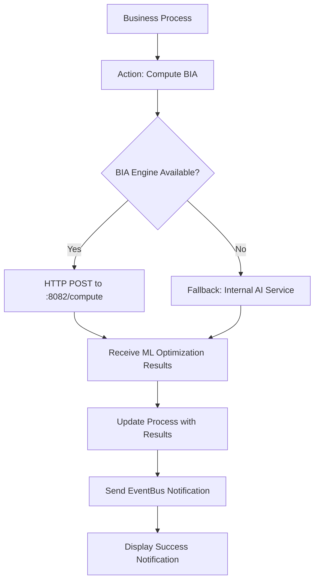
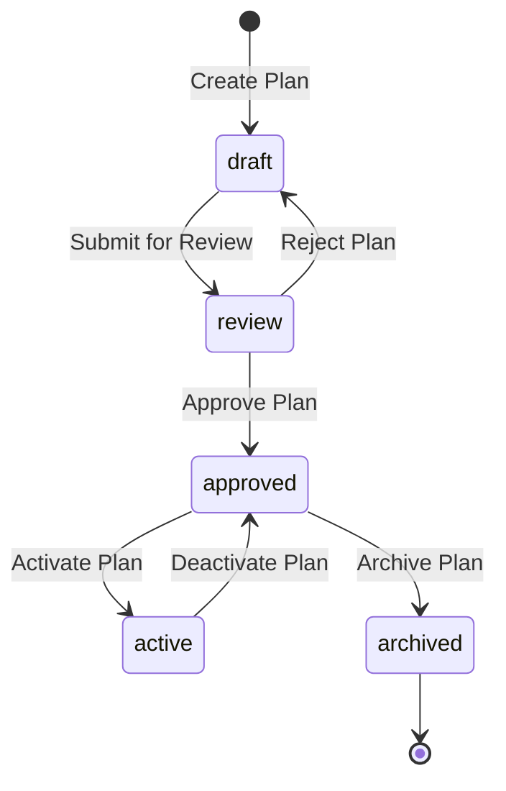
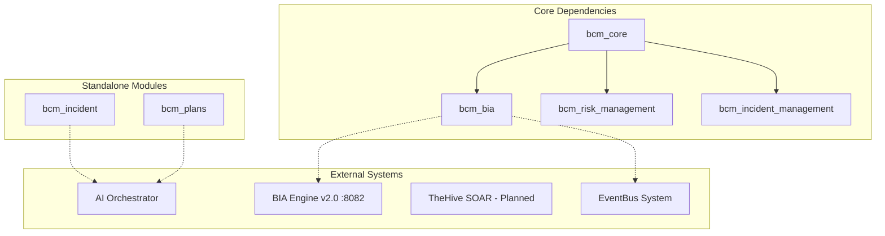
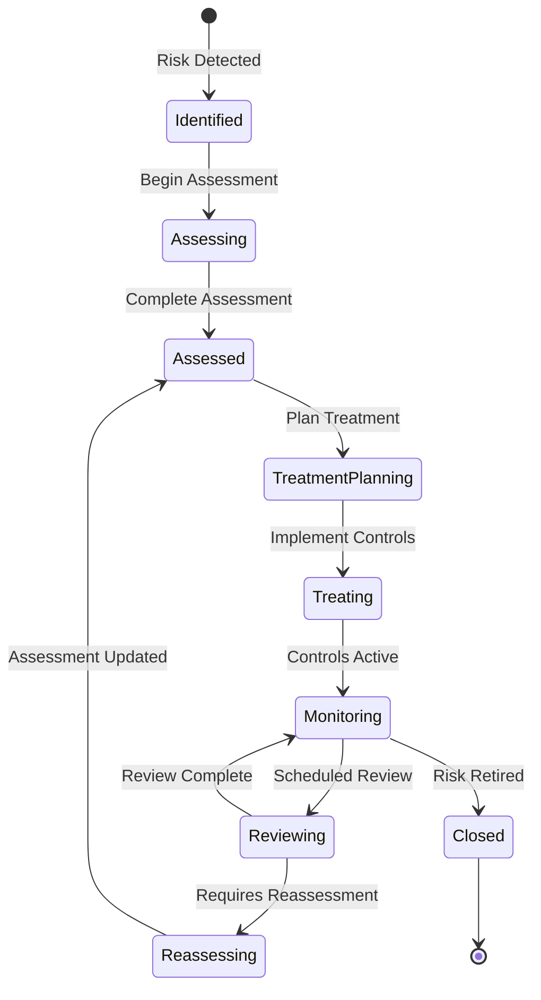
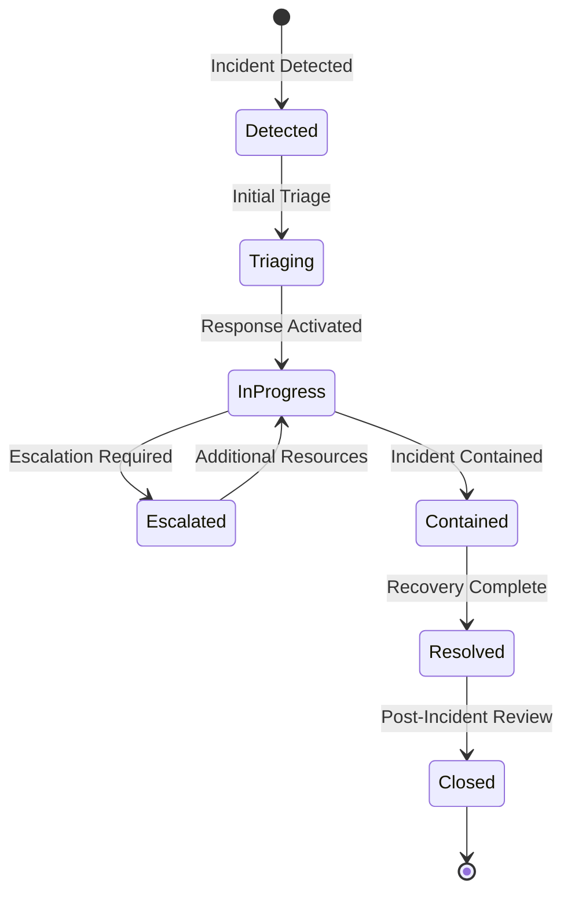
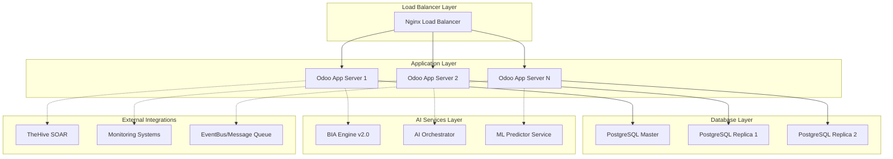

# BCM Risk and Incident Management Modules - Technical Documentation

## Executive Summary

This document provides a comprehensive technical analysis of the BCM (Business Continuity Management) risk and incident management modules within the ISO 22301 platform. The analysis covers five core modules: `bcm_risk_management`, `bcm_bia`, `bcm_incident_management`, `bcm_incident`, and `bcm_plans`.

**Key Findings:**
- Most modules are in MVP (Minimal Viable Product) state with basic CRUD functionality
- `bcm_bia` has the most sophisticated implementation with AI integration via BIA Engine v2.0
- `bcm_plans` has comprehensive business continuity planning features
- Significant gaps exist in risk assessment workflows and incident response automation
- Integration with external systems (TheHive, SOAR) is planned but not implemented

---

## 1. Module Architecture Analysis

### 1.1 bcm_risk_management

**Current Status:** ⚠️ **MVP/Stub Implementation**

#### Architecture Overview
```
┌─────────────────────────────────────────────┐
│              bcm_risk_management            │
├─────────────────────────────────────────────┤
│ Models:                                     │
│  ├─ BcmRiskManagement (basic CRUD)          │
│  └─ Fields: name, active, company_id        │
├─────────────────────────────────────────────┤
│ Security:                                   │
│  ├─ User access (full CRUD)                 │
│  └─ Portal access (read-only)               │
├─────────────────────────────────────────────┤
│ External Dependencies: bcm_core             │
└─────────────────────────────────────────────┘
```

#### Data Model Structure
```python
class BcmRiskManagement(models.Model):
    _name = 'bcm.risk.management'
    _description = 'BCM Risk Management'

    name = fields.Char(required=True)           # Risk identifier
    active = fields.Boolean(default=True)       # Record status
    company_id = fields.Many2one('res.company') # Multi-tenancy
```

#### Current Gaps
- ❌ No risk assessment methodology implementation
- ❌ No risk matrix or scoring system
- ❌ No integration with BIA data
- ❌ No workflow/state management
- ❌ No automated risk monitoring
- ❌ No reporting capabilities

### 1.2 bcm_bia (Business Impact Analysis)

**Current Status:** ✅ **Advanced Implementation with AI Integration**

#### Architecture Overview
```
┌─────────────────────────────────────────────────────────┐
│                      bcm_bia                            │
├─────────────────────────────────────────────────────────┤
│ Core Models:                                            │
│  ├─ BCMIndustryType (industry-specific parameters)      │
│  ├─ BCMBusinessProcess (AI-enhanced process analysis)   │
│  ├─ BCMBIAAnalysis (comprehensive analysis engine)      │
│  ├─ BCMComplianceRequirement                           │
│  └─ BCMTechnologyStack                                 │
├─────────────────────────────────────────────────────────┤
│ AI Integration:                                         │
│  ├─ BIA Engine v2.0 HTTP API (:8082)                   │
│  ├─ ML-optimized RTO/RPO calculations                  │
│  ├─ Financial impact modeling                          │
│  ├─ Cascade risk analysis                              │
│  └─ Industry-specific coefficients (9 sectors)         │
├─────────────────────────────────────────────────────────┤
│ Advanced Features:                                      │
│  ├─ Dependency validation (circular detection)         │
│  ├─ Comprehensive BIA workflows                        │
│  ├─ Real-time monitoring (cron jobs)                   │
│  └─ Multi-tenant architecture                          │
└─────────────────────────────────────────────────────────┘
```

#### Key Data Models

##### BCMBusinessProcess
```python
class BCMBusinessProcess(models.Model):
    _name = 'bcm.business.process'
    
    # Core attributes
    name = fields.Char('Process Name', required=True)
    industry_id = fields.Many2one('bcm.industry.type')
    criticality = fields.Selection([
        ('low', 'Low'), ('medium', 'Medium'), 
        ('high', 'High'), ('critical', 'Critical')
    ])
    
    # Financial parameters
    annual_revenue_impact = fields.Float('Annual Revenue Impact ($)')
    peak_concurrent_users = fields.Integer('Peak Concurrent Users')
    staff_count = fields.Integer('Staff Count')
    
    # AI-optimized results (readonly)
    optimized_rto_hours = fields.Float('Optimized RTO (Hours)', readonly=True)
    optimized_rpo_minutes = fields.Float('Optimized RPO (Minutes)', readonly=True)
    mtpd_hours = fields.Float('MTPD (Hours)', readonly=True)
    confidence_score = fields.Float('AI Confidence Score', readonly=True)
    
    # Financial calculations from AI
    total_financial_impact_24h = fields.Float('24h Financial Impact ($)', readonly=True)
    hourly_impact_rate = fields.Float('Hourly Impact Rate ($)', readonly=True)
    annual_risk_exposure = fields.Float('Annual Risk Exposure ($)', readonly=True)
    
    # Cascade risk metrics
    cascade_risk_score = fields.Float('Cascade Risk Score', readonly=True)
    dependency_depth = fields.Integer('Dependency Depth', readonly=True)
    impact_breadth = fields.Integer('Impact Breadth', readonly=True)
```

#### AI Integration Workflow


### 1.3 bcm_incident_management

**Current Status:** ⚠️ **Stub Implementation**

#### Architecture Overview
```
┌─────────────────────────────────────────────┐
│           bcm_incident_management           │
├─────────────────────────────────────────────┤
│ Models:                                     │
│  ├─ BcmIncidentManagement (basic)           │
│  └─ Fields: name, active, description       │
├─────────────────────────────────────────────┤
│ Cron Jobs (Planned):                        │
│  ├─ Real-time monitoring (5 min)            │
│  ├─ Escalation checks (15 min)              │
│  ├─ Team availability (hourly)              │
│  ├─ Communication archival (monthly)        │
│  └─ Weekly reporting                        │
├─────────────────────────────────────────────┤
│ Dependencies: bcm_core                      │
└─────────────────────────────────────────────┘
```

#### Current Gaps
- ❌ No incident lifecycle management
- ❌ No response team coordination
- ❌ No impact assessment integration
- ❌ Cron jobs reference non-existent models
- ❌ No integration with bcm_incident module

### 1.4 bcm_incident

**Current Status:** ⚠️ **Basic Implementation**

#### Architecture Overview
```
┌─────────────────────────────────────────────┐
│                bcm_incident                 │
├─────────────────────────────────────────────┤
│ Models:                                     │
│  ├─ BcmIncident (basic incident record)     │
│  └─ BcmIncidentRecord (with multi-tenancy)  │
├─────────────────────────────────────────────┤
│ AI Integration:                             │
│  ├─ BCMIncidentActions (mixin)              │
│  ├─ AI response checklist generation        │
│  └─ Orchestrator integration planned        │
├─────────────────────────────────────────────┤
│ Features:                                   │
│  ├─ Multi-tenant isolation                  │
│  ├─ Basic incident logging                  │
│  └─ AI-powered response drafting            │
└─────────────────────────────────────────────┘
```

#### AI Integration Features
```python
class BCMIncidentActions(models.Model):
    _inherit = 'bcm.incident'
    
    ai_checklist = fields.Text('AI Response Checklist', readonly=True)
    ai_recommendations = fields.Text('AI Recommendations', readonly=True)
    
    def action_ai_draft_response(self):
        """Generate AI draft response checklist"""
        # Calls Orchestrator API for incident-specific recommendations
        # Generates prioritized response checklist based on severity
```

### 1.5 bcm_plans

**Current Status:** ✅ **Advanced Implementation**

#### Architecture Overview
```
┌─────────────────────────────────────────────────────────┐
│                     bcm_plans                           │
├─────────────────────────────────────────────────────────┤
│ Core Models:                                            │
│  ├─ BcmContinuityPlan (comprehensive plan management)   │
│  ├─ BcmPlanProcedure (detailed step management)        │
│  ├─ BcmPlanResource (resource allocation)              │
│  └─ BcmPlanExecution (execution tracking)              │
├─────────────────────────────────────────────────────────┤
│ Plan Types:                                             │
│  ├─ Business Continuity Plan (BCP)                     │
│  ├─ Disaster Recovery Plan (DRP)                       │
│  ├─ Emergency Response Plan                            │
│  ├─ Crisis Management Plan                             │
│  └─ Incident Response Plan                             │
├─────────────────────────────────────────────────────────┤
│ Advanced Features:                                      │
│  ├─ Version control and approval workflow              │
│  ├─ RTO/RPO objective management                       │
│  ├─ Resource dependency tracking                       │
│  ├─ AI-powered draft generation                        │
│  ├─ Execution tracking and metrics                     │
│  └─ Review cycle automation                            │
└─────────────────────────────────────────────────────────┘
```

#### Key Features

##### Plan Management Lifecycle


##### Resource Management
```python
class BcmPlanResource(models.Model):
    _name = 'bcm.plan.resource'
    
    resource_type = fields.Selection([
        ('personnel', 'Personnel'),
        ('facility', 'Facility/Location'),
        ('equipment', 'Equipment'),
        ('technology', 'Technology/System'),
        ('supplier', 'Supplier/Vendor'),
        ('information', 'Information/Data'),
        ('financial', 'Financial Resource')
    ])
    
    availability_requirement = fields.Selection([
        ('immediate', 'Immediate (0-1 hour)'),
        ('short_term', 'Short-term (1-24 hours)'),
        ('medium_term', 'Medium-term (1-7 days)'),
        ('long_term', 'Long-term (>7 days)')
    ])
    
    criticality = fields.Selection([
        ('critical', 'Critical'),
        ('important', 'Important'),
        ('useful', 'Useful'),
        ('optional', 'Optional')
    ])
```

---

## 2. Current Functional Status Analysis

### 2.1 Implementation Maturity Matrix

| Module | Models | Workflows | AI Integration | Reporting | API | Status |
|--------|---------|-----------|----------------|-----------|-----|---------|
| bcm_risk_management | ⚠️ Basic | ❌ None | ❌ None | ❌ None | ❌ None | Stub |
| bcm_bia | ✅ Advanced | ✅ Complete | ✅ Full | ✅ AI-generated | ✅ REST | Production |
| bcm_incident_management | ⚠️ Basic | ❌ Planned | ❌ None | ❌ Planned | ❌ None | Stub |
| bcm_incident | ⚠️ Minimal | ⚠️ Basic | ⚠️ Partial | ❌ None | ❌ None | MVP |
| bcm_plans | ✅ Complete | ✅ Advanced | ⚠️ Partial | ⚠️ Basic | ❌ None | Near-Production |

### 2.2 Dependency Analysis



### 2.3 Multi-Tenancy Implementation

All modules implement proper multi-tenancy through `company_id` fields:
- Row-level security isolation per company/tenant
- Default company assignment on record creation
- Consistent implementation across all models

---

## 3. Gap Analysis and ISO 22301 Compliance

### 3.1 Risk Management Gaps (bcm_risk_management)

**Critical Missing Components:**
- ❌ Risk identification and categorization frameworks
- ❌ Risk assessment methodologies (qualitative/quantitative)
- ❌ Risk matrix implementation (likelihood × impact)
- ❌ Risk treatment strategies and controls
- ❌ Risk monitoring and review processes
- ❌ Integration with BIA results
- ❌ Automated risk reporting
- ❌ Risk appetite and tolerance definitions

**ISO 22301 Requirements Not Met:**
- Clause 6.1.2: Risk assessment process
- Clause 6.1.3: Risk treatment
- Clause 8.2.4: Business impact analysis integration

### 3.2 BIA Implementation Assessment (bcm_bia)

**Strengths:**
- ✅ Comprehensive process modeling
- ✅ AI-enhanced optimization
- ✅ Financial impact calculations
- ✅ Dependency management
- ✅ Industry-specific parameters
- ✅ Real-time monitoring

**Minor Gaps:**
- ⚠️ Limited compliance framework integration
- ⚠️ No automated BIA scheduling
- ⚠️ Limited integration with risk management

### 3.3 Incident Management Gaps

**Critical Missing Components:**
- ❌ Incident detection and alerting
- ❌ Incident classification and prioritization
- ❌ Response team activation workflows
- ❌ Communication management
- ❌ Impact assessment integration
- ❌ Recovery procedures tracking
- ❌ Post-incident analysis and reporting

**ISO 22301 Requirements Not Met:**
- Clause 8.4: Business continuity procedures
- Clause 8.5: Exercising and testing
- Clause 9.1: Monitoring and review

### 3.4 Plans Implementation Assessment (bcm_plans)

**Strengths:**
- ✅ Comprehensive plan types coverage
- ✅ Detailed procedure management
- ✅ Resource allocation tracking
- ✅ Version control and approval
- ✅ Execution monitoring

**Minor Gaps:**
- ⚠️ Limited integration with BIA data
- ⚠️ No automated testing schedules
- ⚠️ Limited metrics and KPIs

---

## 4. Technical Specifications and Requirements

### 4.1 Database Schema Requirements

#### Enhanced Risk Management Schema
```sql
-- Risk Registry Table
CREATE TABLE bcm_risk (
    id SERIAL PRIMARY KEY,
    name VARCHAR(255) NOT NULL,
    description TEXT,
    category VARCHAR(100), -- Strategic, Operational, Financial, Compliance
    likelihood INTEGER CHECK (likelihood BETWEEN 1 AND 5),
    impact INTEGER CHECK (impact BETWEEN 1 AND 5),
    risk_score INTEGER, -- Calculated: likelihood * impact
    inherent_risk_level VARCHAR(50), -- Very Low, Low, Medium, High, Very High
    current_risk_level VARCHAR(50),
    target_risk_level VARCHAR(50),
    risk_owner_id INTEGER REFERENCES res_users(id),
    status VARCHAR(50), -- Identified, Assessed, Treated, Monitored
    review_date DATE,
    created_date TIMESTAMP DEFAULT NOW(),
    company_id INTEGER REFERENCES res_company(id)
);

-- Risk Controls Table
CREATE TABLE bcm_risk_control (
    id SERIAL PRIMARY KEY,
    risk_id INTEGER REFERENCES bcm_risk(id) ON DELETE CASCADE,
    control_type VARCHAR(50), -- Preventive, Detective, Corrective
    description TEXT,
    effectiveness VARCHAR(50), -- Low, Medium, High
    implementation_status VARCHAR(50), -- Planned, In Progress, Implemented
    responsible_user_id INTEGER REFERENCES res_users(id),
    review_frequency INTEGER, -- Days
    last_review_date DATE,
    company_id INTEGER REFERENCES res_company(id)
);
```

#### Enhanced Incident Management Schema
```sql
-- Incident Registry Table
CREATE TABLE bcm_incident_enhanced (
    id SERIAL PRIMARY KEY,
    incident_number VARCHAR(50) UNIQUE,
    title VARCHAR(255) NOT NULL,
    description TEXT,
    severity VARCHAR(50), -- Low, Medium, High, Critical
    status VARCHAR(50), -- Open, In Progress, Resolved, Closed
    incident_type VARCHAR(100), -- IT, Operational, Security, Natural Disaster
    detected_date TIMESTAMP,
    reported_date TIMESTAMP DEFAULT NOW(),
    resolved_date TIMESTAMP,
    closed_date TIMESTAMP,
    
    -- Impact Assessment
    affected_processes TEXT[], -- Array of process IDs
    estimated_financial_impact DECIMAL(15,2),
    actual_financial_impact DECIMAL(15,2),
    downtime_minutes INTEGER,
    
    -- Response Team
    incident_commander_id INTEGER REFERENCES res_users(id),
    response_team_ids INTEGER[], -- Array of user IDs
    
    -- Recovery Metrics
    detection_time INTEGER, -- Minutes
    response_time INTEGER, -- Minutes
    resolution_time INTEGER, -- Minutes
    
    company_id INTEGER REFERENCES res_company(id)
);
```

### 4.2 API Specifications

#### Risk Management API Endpoints
```yaml
# Risk CRUD Operations
POST /api/v1/risks
GET /api/v1/risks/{id}
PUT /api/v1/risks/{id}
DELETE /api/v1/risks/{id}

# Risk Assessment
POST /api/v1/risks/{id}/assess
POST /api/v1/risks/bulk-assess

# Risk Matrix
GET /api/v1/risks/matrix
POST /api/v1/risks/matrix/configure

# Risk Reports
GET /api/v1/risks/reports/summary
GET /api/v1/risks/reports/detailed
GET /api/v1/risks/reports/dashboard
```

#### Incident Management API Endpoints
```yaml
# Incident Lifecycle
POST /api/v1/incidents
GET /api/v1/incidents/{id}
PUT /api/v1/incidents/{id}
POST /api/v1/incidents/{id}/escalate
POST /api/v1/incidents/{id}/resolve
POST /api/v1/incidents/{id}/close

# Response Management
POST /api/v1/incidents/{id}/activate-response
POST /api/v1/incidents/{id}/assign-team
POST /api/v1/incidents/{id}/update-status

# Integration Endpoints
POST /api/v1/incidents/from-monitoring
POST /api/v1/incidents/to-soar
GET /api/v1/incidents/metrics
```

### 4.3 State Machine Definitions

#### Risk Management Workflow


#### Incident Response Workflow


### 4.4 External System Integration Specifications

#### TheHive SOAR Integration
```python
# TheHive API Integration Specification
class TheHiveIntegration:
    def __init__(self, api_url, api_key):
        self.api_url = api_url
        self.api_key = api_key
    
    def create_case_from_incident(self, incident_data):
        """Create TheHive case from BCM incident"""
        case_payload = {
            "title": f"BCM-{incident_data['incident_number']}",
            "description": incident_data['description'],
            "severity": self._map_severity(incident_data['severity']),
            "tags": ["BCM", incident_data['incident_type']],
            "customFields": {
                "bcm_incident_id": incident_data['id'],
                "estimated_impact": incident_data['estimated_financial_impact'],
                "affected_processes": incident_data['affected_processes']
            }
        }
        return requests.post(f"{self.api_url}/api/case", 
                           json=case_payload, 
                           headers={"Authorization": f"Bearer {self.api_key}"})
    
    def sync_case_status(self, case_id, bcm_incident_id):
        """Synchronize case status back to BCM"""
        pass
```

---

## 5. Phased Development Roadmap

### Phase 1: Stabilization and Core Functionality 

####  Risk Management Foundation
**Priority: Critical**

1. **Enhanced Risk Model Implementation**
   ```python
   # File: /models/risk_registry.py
   class BcmRisk(models.Model):
       _name = 'bcm.risk'
       _description = 'BCM Risk Registry'
       _inherit = ['mail.thread', 'mail.activity.mixin']
       
       # Core risk attributes
       name = fields.Char('Risk Title', required=True, tracking=True)
       risk_number = fields.Char('Risk ID', default=lambda self: self._generate_risk_id())
       category = fields.Selection([
           ('strategic', 'Strategic Risk'),
           ('operational', 'Operational Risk'), 
           ('financial', 'Financial Risk'),
           ('compliance', 'Compliance Risk'),
           ('reputation', 'Reputational Risk')
       ], required=True, tracking=True)
       
       # Risk Assessment
       likelihood = fields.Integer('Likelihood (1-5)', required=True)
       impact = fields.Integer('Impact (1-5)', required=True) 
       risk_score = fields.Integer('Risk Score', compute='_compute_risk_score', store=True)
       risk_level = fields.Selection([
           ('very_low', 'Very Low (1-4)'),
           ('low', 'Low (5-9)'),
           ('medium', 'Medium (10-14)'),
           ('high', 'High (15-19)'),
           ('very_high', 'Very High (20-25)')
       ], compute='_compute_risk_level', store=True)
   ```

2. **Risk Assessment Workflows**
   - Implement risk matrix calculations
   - Create risk treatment planning interface
   - Build automated review scheduling

3. **Basic Reporting Dashboard**
   - Risk heat map visualization
   - Risk register reports
   - Treatment status tracking

####  Incident Management Core
**Priority: Critical**

1. **Enhanced Incident Model**
   ```python
   # File: /models/incident_enhanced.py  
   class BcmIncidentEnhanced(models.Model):
       _name = 'bcm.incident.enhanced'
       _description = 'Enhanced BCM Incident Management'
       _inherit = ['mail.thread', 'mail.activity.mixin']
       
       # Incident identification
       incident_number = fields.Char('Incident #', default=lambda self: self._generate_incident_id())
       title = fields.Char('Incident Title', required=True, tracking=True)
       severity = fields.Selection([
           ('low', 'Low'),
           ('medium', 'Medium'), 
           ('high', 'High'),
           ('critical', 'Critical')
       ], required=True, tracking=True)
       
       # Status workflow
       state = fields.Selection([
           ('detected', 'Detected'),
           ('triaging', 'Triaging'),
           ('in_progress', 'In Progress'),
           ('escalated', 'Escalated'),
           ('contained', 'Contained'),
           ('resolved', 'Resolved'),
           ('closed', 'Closed')
       ], default='detected', tracking=True)
   ```

2. **Response Team Management**
   - Crisis team definitions and activation
   - Role-based response procedures
   - Communication workflows

3. **Integration Layer Foundation**
   - EventBus integration for real-time updates
   - Basic API endpoints for external systems
   - Webhook support for monitoring tools

### Phase 2: Advanced Functionality 

####  BIA Integration & Enhancement

1. **Risk-BIA Integration**
   - Connect risk assessments with BIA results
   - Automated risk identification from BIA data
   - Cross-referencing business impact with risk exposure

2. **Enhanced Dependency Management**
   ```python
   def action_analyze_cascade_risks(self):
       """Analyze cascade risks across business processes"""
       cascade_analyzer = self.env['bcm.cascade.analyzer']
       
       # Get all dependent processes
       dependency_tree = self._build_dependency_tree()
       
       # Calculate cascade impact
       for level, processes in dependency_tree.items():
           for process in processes:
               cascade_impact = self._calculate_cascade_impact(process, level)
               self._update_process_cascade_metrics(process, cascade_impact)
   ```

3. **Advanced Financial Modeling**
   - Multi-scenario impact calculations
   - Time-based recovery cost models
   - Insurance claim integration

####  Incident Response Automation

1. **Automated Response Workflows**
   - Rule-based incident escalation
   - Automated team notification
   - Response checklist generation

2. **Integration with Monitoring Systems**
   ```python
   @api.model
   def create_incident_from_alert(self, alert_data):
       """Create incident from external monitoring alert"""
       incident_vals = {
           'title': alert_data['summary'],
           'description': alert_data['description'],
           'severity': self._map_alert_severity(alert_data['severity']),
           'incident_type': 'monitoring',
           'source_system': alert_data['source'],
           'detected_date': fields.Datetime.now()
       }
       
       # Auto-assign based on alert type
       response_team = self._get_response_team_for_alert(alert_data)
       if response_team:
           incident_vals['response_team_ids'] = [(6, 0, response_team.ids)]
       
       incident = self.create(incident_vals)
       incident.action_auto_triage()
       return incident
   ```

### Phase 3: External Integrations 

####  SOAR Integration

1. **TheHive Platform Integration**
   ```python
   # File: /integration/thehive_connector.py
   class TheHiveConnector(models.Model):
       _name = 'bcm.thehive.connector'
       _description = 'TheHive SOAR Integration'
       
       def sync_incident_to_case(self, incident):
           """Synchronize BCM incident to TheHive case"""
           case_data = self._prepare_case_data(incident)
           response = self._call_thehive_api('POST', '/api/case', case_data)
           
           if response.status_code == 201:
               case_id = response.json()['id']
               incident.thehive_case_id = case_id
               incident.message_post(
                   body=f'Case created in TheHive: {case_id}'
               )
           
           return response
   ```

2. **SOAR Playbook Automation**
   - Automated response playbooks
   - Evidence collection workflows
   - IOC (Indicators of Compromise) management

####  Advanced Analytics & ML

1. **Predictive Risk Analytics**
   ```python
   # File: /models/risk_analytics.py
   class BcmRiskAnalytics(models.Model):
       _name = 'bcm.risk.analytics'
       _description = 'Risk Analytics and Predictions'
       
       @api.model
       def predict_risk_trends(self, time_horizon_days=90):
           """Use ML to predict risk trend changes"""
           historical_data = self._get_historical_risk_data()
           risk_predictor = self.env['bcm.ml.predictor']
           
           predictions = risk_predictor.forecast_risk_changes(
               historical_data, time_horizon_days
           )
           
           # Generate recommendations
           recommendations = []
           for prediction in predictions:
               if prediction['risk_increase_probability'] > 0.7:
                   recommendations.append({
                       'risk_id': prediction['risk_id'],
                       'action': 'immediate_review',
                       'priority': 'high',
                       'reason': prediction['risk_factors']
                   })
           
           return recommendations
   ```

2. **Incident Pattern Recognition**
   - ML-based incident categorization
   - Automated root cause analysis
   - Predictive maintenance alerts

### Phase 4: Advanced Features & AI Enhancement 

####  Advanced Reporting & Analytics

1. **Executive Dashboard**
   - Real-time risk heat maps
   - Incident response metrics
   - BCP effectiveness tracking
   - Compliance status overview

2. **Automated Compliance Reporting**
   - ISO 22301 compliance tracking
   - Regulatory reporting automation  
   - Audit trail generation

####  Machine Learning & AI

1. **Enhanced AI Integration**
   ```python
   # File: /ai/bcm_ai_orchestrator.py
   class BCMAIOrchestrator(models.Model):
       _name = 'bcm.ai.orchestrator'
       _description = 'AI Orchestrator for BCM Platform'
       
       @api.model
       def optimize_response_strategy(self, incident_data, context_data):
           """AI-driven response strategy optimization"""
           # Prepare AI context
           ai_context = {
               'incident': incident_data,
               'historical_incidents': self._get_similar_incidents(incident_data),
               'available_resources': self._get_available_resources(),
               'current_capacity': self._assess_current_capacity(),
               'dependencies': context_data.get('affected_processes', [])
           }
           
           # Call AI service
           ai_response = self._call_ai_service(
               'optimize_response',
               ai_context
           )
           
           # Generate actionable recommendations
           recommendations = self._process_ai_recommendations(ai_response)
           
           return {
               'strategy': ai_response['recommended_strategy'],
               'confidence': ai_response['confidence_score'],
               'recommendations': recommendations,
               'estimated_impact': ai_response['impact_forecast']
           }
   ```

2. **Continuous Learning System**
   - Performance feedback loops
   - Strategy effectiveness tracking
   - Automated model improvement

---

## 6. Security and Compliance Considerations

### 6.1 Data Security Requirements

1. **Encryption**
   - All sensitive data encrypted at rest (AES-256)
   - TLS 1.3 for data in transit
   - Key management through secure vaults

2. **Access Control**
   - Role-based access control (RBAC)
   - Multi-factor authentication for privileged operations
   - Audit logging for all data access

3. **Data Retention**
   - Incident data retention: 7 years
   - Risk assessment data: 5 years
   - Audit logs: 10 years
   - Automatic archival and purging

### 6.2 Compliance Frameworks

1. **ISO 22301:2019**
   - Business continuity management system
   - Risk assessment and treatment
   - Incident response procedures
   - Performance evaluation

2. **ISO 27001**
   - Information security management
   - Risk management integration
   - Incident response coordination

3. **NIST Cybersecurity Framework**
   - Identify, Protect, Detect, Respond, Recover
   - Risk management alignment
   - Incident response procedures

---

## 7. Performance and Scalability Requirements

### 7.1 Performance Targets

| Operation | Target Response Time | Concurrent Users | Throughput |
|-----------|---------------------|------------------|------------|
| Risk Assessment Query | < 500ms | 100 | 200 req/sec |
| Incident Creation | < 200ms | 50 | 100 req/sec |
| BIA Computation | < 30s | 10 | 5 jobs/min |
| Dashboard Load | < 2s | 200 | 500 req/sec |
| Report Generation | < 10s | 20 | 20 reports/min |

### 7.2 Scalability Architecture



---

## 8. Testing Strategy

### 8.1 Unit Testing Coverage

```python
# File: /tests/test_risk_management.py
class TestBcmRiskManagement(TransactionCase):
    
    def setUp(self):
        super().setUp()
        self.risk_model = self.env['bcm.risk']
        self.test_company = self.env['res.company'].create({'name': 'Test Co'})
    
    def test_risk_score_calculation(self):
        """Test risk score calculation logic"""
        risk = self.risk_model.create({
            'name': 'Test Risk',
            'likelihood': 4,
            'impact': 5,
            'company_id': self.test_company.id
        })
        
        self.assertEqual(risk.risk_score, 20)
        self.assertEqual(risk.risk_level, 'very_high')
    
    def test_circular_dependency_detection(self):
        """Test circular dependency validation"""
        with self.assertRaises(ValidationError):
            # Create circular dependency scenario
            pass
```

### 8.2 Integration Testing

1. **API Integration Tests**
   - External system connectivity
   - Data synchronization accuracy
   - Error handling and recovery

2. **Performance Testing**
   - Load testing with realistic data volumes
   - Stress testing under peak conditions
   - Memory and resource utilization monitoring

### 8.3 Security Testing

1. **Penetration Testing**
   - SQL injection vulnerability assessment
   - Cross-site scripting (XSS) testing
   - Authentication and authorization testing

2. **Data Protection Testing**
   - Encryption verification
   - Access control validation
   - Audit trail integrity

---

## 9. Conclusion and Recommendations

### 9.1 Current State Summary

The BCM platform's risk and incident management modules are in varied states of implementation:

**Production Ready:**
- `bcm_bia`: Advanced AI-integrated business impact analysis
- `bcm_plans`: Comprehensive business continuity planning

**Requires Development:**
- `bcm_risk_management`: Complete rebuild needed
- `bcm_incident_management`: Core functionality missing
- `bcm_incident`: Basic structure exists, needs enhancement

### 9.2 Strategic Recommendations

1. **Immediate Priority **
   - Complete `bcm_risk_management` module development
   - Implement core incident management workflows
   - Establish integration patterns between modules

2. **Short-term Goals **
   - Integrate risk assessments with BIA data
   - Implement automated incident response
   - Build comprehensive reporting dashboards

3. **Medium-term Goals **
   - Complete SOAR integration with TheHive
   - Implement advanced analytics and ML
   - Establish comprehensive testing coverage

4. **Long-term Vision **
   - AI-driven predictive risk management
   - Automated compliance reporting
   - Continuous improvement through ML

### 9.3 Success Metrics

**Technical Metrics:**
- 95% uptime for incident response system
- <200ms average response time for critical operations
- 100% ISO 22301 compliance coverage
- 80% test coverage across all modules

**Business Metrics:**
- 50% reduction in incident response time
- 30% improvement in risk identification accuracy
- 25% reduction in compliance audit preparation time
- 95% user satisfaction rating

---

## 10. Appendices

### Appendix A: API Documentation References
- [BCM Risk Management API](./api/risk_management.yaml)
- [BCM Incident Management API](./api/incident_management.yaml)
- [BCM BIA Integration API](./api/bia_integration.yaml)

### Appendix B: Database Schema Scripts
- [Risk Management Schema](./sql/risk_management_schema.sql)
- [Incident Management Schema](./sql/incident_management_schema.sql)

### Appendix C: Configuration Templates
- [TheHive Integration Config](./config/thehive_integration.yml)
- [AI Services Configuration](./config/ai_services.yml)

---

*Document Version: 1.0*
*Last Updated: 2025-01-12*
*Author: BCM Technical Analysis Team*
*Classification: Technical Documentation*