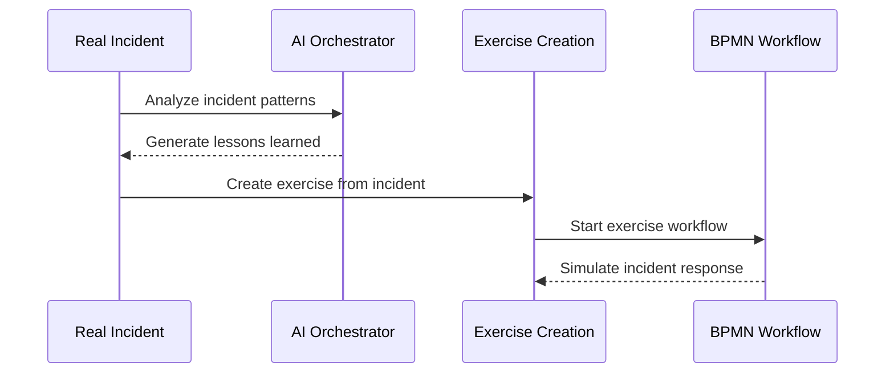
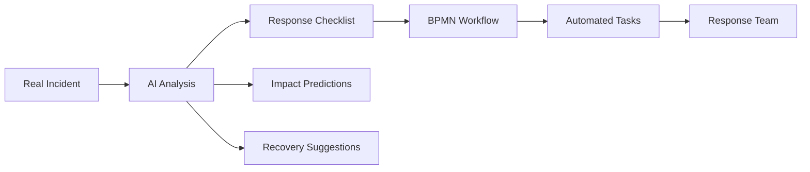
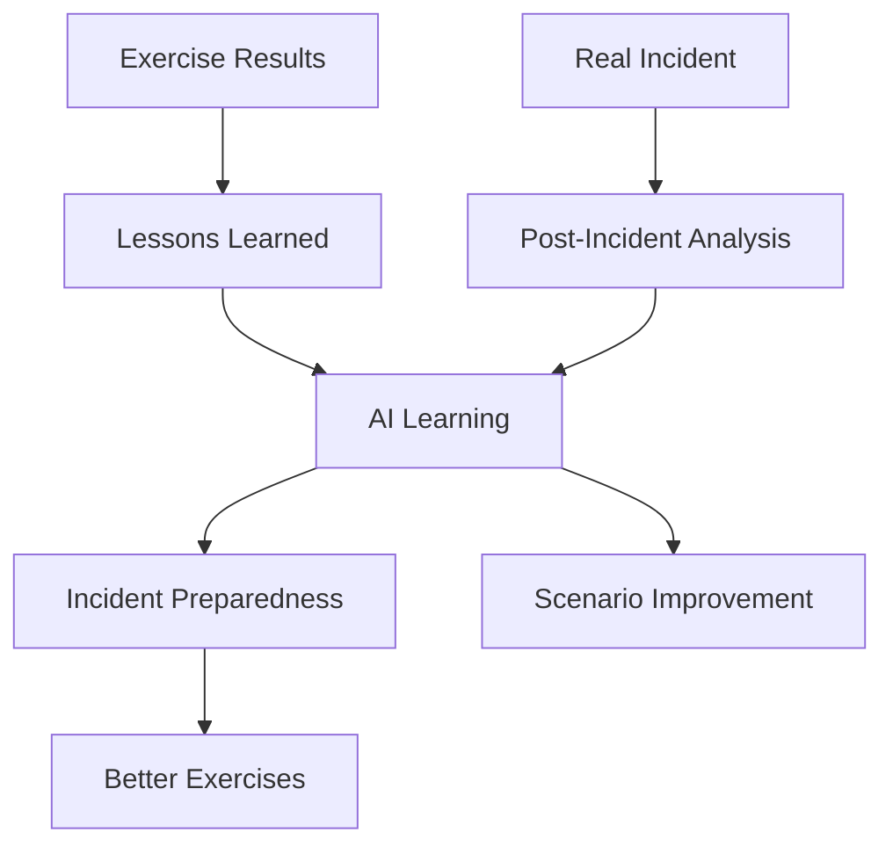

# BCM Incident & Exercise Modules Enhancement Plan

## 🎯 Current State Analysis

### **bcm_incident** - "Incident Response Management"
```yaml
Status: ✅ HAS AI INTEGRATION
Features:
  - Basic incident model
  - AI-powered response checklist generation
  - AI recommendations via Orchestrator
  - EventBus integration

AI Capabilities Found:
  - action_ai_draft_response() - generates AI checklist
  - AI recommendations field
  - Orchestrator API integration
  - Event publishing to EventBus

Issues:
  - Very basic incident model (только name, notes)
  - No incident lifecycle management
  - No severity classification
  - No stakeholder management
```

### **bcm_incident_management** - "Advanced Controls"
```yaml
Status: ❌ NEARLY EMPTY
Features:
  - Depends on bcm_incident
  - Should provide "advanced controls"
  - Has scheduled monitoring (в manifest)

Issues:
  - Only basic model (name, description)
  - No advanced functionality implemented
  - No connection to bcm_incident
  - No real "advanced controls"
```

### **bcm_exercise** - "Drills & Simulations"
```yaml
Status: ✅ ENHANCED BY US
Features:
  - Exercise lifecycle management
  - Template integration (ЭТАП 3)
  - BPMN workflow integration
  - Participant management

Recent Enhancements:
  ✅ Template integration
  ✅ BPMN workflow execution
  ✅ Scenario linking
  ✅ Notification system
```

---

## 🏗️ Enhancement Strategy

### **STRATEGY 1: Enhance bcm_incident Model**

#### **Current vs Enhanced**:
```python
# CURRENT (очень простая):
class BcmIncident(models.Model):
    name = fields.Char()
    notes = fields.Text()
    company_id = fields.Many2one('res.company')

# ENHANCED (comprehensive):
class BcmIncident(models.Model):
    # Basic Information
    name = fields.Char('Incident Title')
    incident_id = fields.Char('Incident ID', default=lambda self: self._generate_incident_id())
    description = fields.Html('Incident Description')

    # Classification
    incident_type = fields.Selection([
        ('operational', 'Operational Disruption'),
        ('security', 'Security Incident'),
        ('natural', 'Natural Disaster'),
        ('technology', 'Technology Failure'),
        ('human', 'Human Error'),
        ('external', 'External Threat')
    ])

    severity = fields.Selection([
        ('low', 'Low'),
        ('medium', 'Medium'),
        ('high', 'High'),
        ('critical', 'Critical')
    ])

    # Lifecycle Management
    state = fields.Selection([
        ('reported', 'Reported'),
        ('investigating', 'Under Investigation'),
        ('responding', 'Response Active'),
        ('recovering', 'Recovery Phase'),
        ('resolved', 'Resolved'),
        ('closed', 'Closed')
    ])

    # Impact Assessment
    affected_processes = fields.Many2many('bcm.business.process')
    estimated_impact = fields.Float('Estimated Impact ($)')
    actual_impact = fields.Float('Actual Impact ($)')

    # Response Team
    incident_commander = fields.Many2one('res.users')
    response_team_ids = fields.Many2many('res.users')

    # Timeline
    detected_at = fields.Datetime('Detection Time')
    reported_at = fields.Datetime('Reporting Time')
    response_started_at = fields.Datetime('Response Started')
    recovery_started_at = fields.Datetime('Recovery Started')
    resolved_at = fields.Datetime('Resolution Time')

    # AI Integration (EXISTING + ENHANCED)
    ai_checklist = fields.Text('AI Response Checklist')
    ai_recommendations = fields.Text('AI Recommendations')
    ai_impact_prediction = fields.Text('AI Impact Prediction')  # NEW
    ai_recovery_suggestions = fields.Text('AI Recovery Suggestions')  # NEW

    # External Integration
    thehive_case_id = fields.Char('TheHive Case ID')
    external_ticket_id = fields.Char('External Ticket ID')

    # Metrics
    response_time_minutes = fields.Integer('Response Time (minutes)')
    recovery_time_hours = fields.Float('Recovery Time (hours)')
    downtime_cost = fields.Float('Downtime Cost')
```

---

### **STRATEGY 2: Transform bcm_incident_management**

#### **Make it a Real "Advanced Controls" Module**:
```python
# NEW: Advanced Incident Management Features
class BCMIncidentAdvancedControls(models.Model):
    _name = 'bcm.incident.advanced'
    _description = 'Advanced Incident Management Controls'

    # Incident Escalation Rules
    escalation_rules = fields.One2many('bcm.incident.escalation.rule')

    # Automated Response Triggers
    auto_response_triggers = fields.One2many('bcm.incident.auto.trigger')

    # AI-Powered Monitoring
    ai_monitoring_enabled = fields.Boolean('AI Monitoring')
    ai_prediction_threshold = fields.Float('AI Prediction Threshold')

    # Crisis Management
    crisis_level_threshold = fields.Selection([
        ('medium', 'Medium Severity'),
        ('high', 'High Severity'),
        ('critical', 'Critical Only')
    ])

    # Integration Controls
    thehive_integration = fields.Boolean('TheHive Integration')
    slack_escalation = fields.Boolean('Slack Escalation')
    pagerduty_integration = fields.Boolean('PagerDuty Integration')

class BCMIncidentEscalationRule(models.Model):
    _name = 'bcm.incident.escalation.rule'

    name = fields.Char('Rule Name')
    trigger_condition = fields.Selection([
        ('time_based', 'Time-based (no response in X minutes)'),
        ('severity_based', 'Severity-based escalation'),
        ('impact_based', 'Business impact threshold'),
        ('ai_predicted', 'AI-predicted escalation need')
    ])

    escalation_time_minutes = fields.Integer('Escalation Time (minutes)')
    escalate_to_user_ids = fields.Many2many('res.users', 'Escalate To')
    notification_channels = fields.Selection([
        ('email', 'Email Only'),
        ('slack', 'Slack + Email'),
        ('pagerduty', 'PagerDuty + Slack + Email')
    ])

class BCMIncidentAutoTrigger(models.Model):
    _name = 'bcm.incident.auto.trigger'

    name = fields.Char('Trigger Name')
    trigger_type = fields.Selection([
        ('keyword_detection', 'Keyword Detection'),
        ('system_threshold', 'System Threshold Breach'),
        ('ai_anomaly', 'AI Anomaly Detection'),
        ('external_feed', 'External Feed Alert')
    ])

    trigger_config = fields.Text('Trigger Configuration (JSON)')
    auto_actions = fields.Text('Automatic Actions (JSON)')
    create_incident = fields.Boolean('Auto-create Incident')
```

---

### **STRATEGY 3: Enhanced Exercise-Incident Integration**

#### **Connect Exercises with Real Incidents**:
```python
# ADD to bcm.exercise:
based_on_incident = fields.Many2one(
    'bcm.incident',
    string='Based on Real Incident',
    help='Real incident this exercise is based on'
)

incident_lessons_learned = fields.Text(
    'Lessons from Real Incident',
    help='Lessons learned from the real incident'
)

# ADD to bcm.incident:
related_exercises = fields.One2many(
    'bcm.exercise',
    'based_on_incident',
    string='Related Exercises'
)

def action_create_exercise_from_incident(self):
    """Create exercise based on this real incident"""
    return {
        'type': 'ir.actions.act_window',
        'name': _('Create Exercise from Incident'),
        'res_model': 'bcm.exercise',
        'view_mode': 'form',
        'context': {
            'default_name': f'Exercise: {self.name}',
            'default_based_on_incident': self.id,
            'default_exercise_type': 'tabletop',
            'default_scenario': self.description,
            'default_incident_lessons_learned': self.ai_recommendations
        }
    }
```

---

## 🔄 **Integration Opportunities Identified**

### **INTEGRATION 1: Incident → Exercise Pipeline**


### **INTEGRATION 2: AI-Enhanced Incident Response**


### **INTEGRATION 3: Exercise-Incident Learning Loop**


---

## 🎯 **Proposed Enhancements**

### **ENHANCE 1: bcm_incident (Core Model)**
```yaml
Priority: HIGH
Effort: 2-3 days

Enhancements:
  - Complete incident lifecycle model
  - Severity classification и impact assessment
  - Response team management
  - Timeline tracking (detection → resolution)
  - Enhanced AI integration
  - TheHive integration
  - Metrics и KPIs

Integration Points:
  - AI Orchestrator для enhanced recommendations
  - BPMN Service для automated response workflows
  - Notification Service для escalation
  - Exercise module для lesson-based exercises
```

### **ENHANCE 2: bcm_incident_management (Advanced Controls)**
```yaml
Priority: MEDIUM
Effort: 3-4 days

Transform into:
  - Incident escalation rules engine
  - AI-powered monitoring и prediction
  - Advanced crisis management controls
  - Multi-channel notification escalation
  - Automated response triggers

Integration Points:
  - Real-time monitoring via EventBus
  - AI predictions via AI Orchestrator
  - External escalation via PagerDuty/Slack
  - Automated workflow triggers via BPMN Service
```

### **ENHANCE 3: bcm_exercise (Already Enhanced)**
```yaml
Priority: LOW (уже хорошо)
Effort: 1 day

Additional Enhancements:
  - Exercise-incident learning integration
  - Advanced simulation metrics
  - Real-time exercise monitoring dashboard
  - Integration с JaamSim results

Current Status:
  ✅ Template integration working
  ✅ BPMN workflow execution
  ✅ Scenario linking
  ✅ Participant notifications
```

---

## 📊 **Integration Matrix**

| Module | AI Integration | BPMN Integration | Template Integration | External Integration |
|--------|---------------|------------------|---------------------|---------------------|
| **bcm_incident** | ✅ Basic | 📋 Planned | 📋 Planned | 🔄 TheHive |
| **bcm_incident_management** | 📋 Planned | 📋 Planned | ❌ N/A | 📋 Planned |
| **bcm_exercise** | 📋 Planned | ✅ **Done** | ✅ **Done** | ✅ Notifications |

## 🚀 **Recommendation**

**Enhance bcm_incident** как **приоритет для ЭТАП 4** - это даст максимальную пользу:

1. **Real incident management** с AI enhancement
2. **Exercise creation from real incidents**
3. **Learning loop** между real incidents и exercises
4. **Advanced escalation** и crisis management

**Хочешь чтобы я начал enhancement bcm_incident модуля?** 🚨🤖