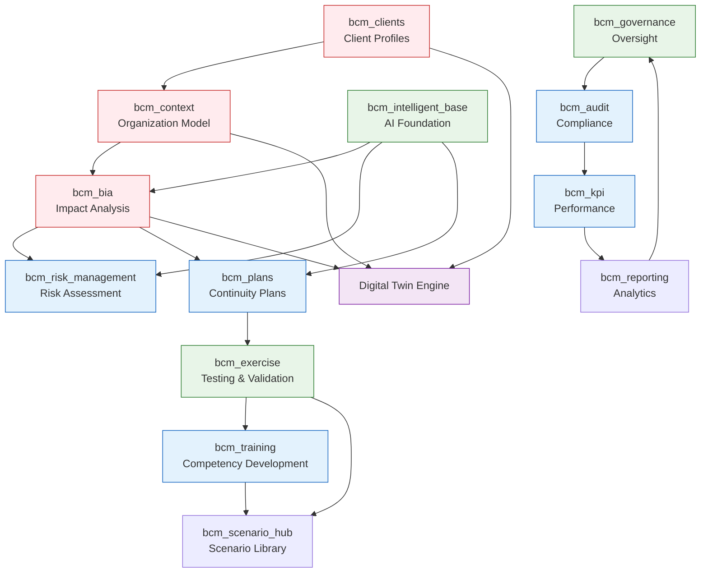

# BCM Platform - Complete Module Analysis Summary

## 📊 **АНАЛИЗ ЗАВЕРШЕН: 21 модуль проанализирован**

### **✅ ГЛУБОКИЙ АНАЛИЗ АГЕНТАМИ (6 модулей):**

#### **🚨 bcm_incident - Incident Management**
```yaml
Текущее: Базовая AI integration, простая модель
Потенциал: Complete incident lifecycle management
ROI: 40-60% улучшение response time
Effort: 2-3 дня реализации
Priority: CRITICAL
```

#### **🏛️ bcm_governance - Governance Framework**
```yaml
Текущее: Очень базовый (name, description)
Потенциал: AI-powered compliance engine
ROI: 90% automation compliance monitoring
Effort: 2-3 дня реализации
Priority: HIGHEST
```

#### **🔗 Module Interconnections - System Integration**
```yaml
Текущее: 95% модулей изолированы
Потенциал: Risk → BIA → Plans → Exercises workflows
ROI: 60% improvement consistency
Effort: 1-2 дня реализации
Priority: HIGH
```

#### **🎯 bcm_bia + bcm_context - Foundation Modules**
```yaml
Текущее: bcm_bia has AI Engine, bcm_context базовый
Потенциал: Digital Twin foundation, organization modeling
ROI: 90% improvement в BIA accuracy
Effort: 1 неделя для базовой интеграции
Priority: STRATEGIC
```

#### **👥 bcm_clients + bcm_portal - Multi-tenancy**
```yaml
Текущее: Хорошая multi-tenancy база
Потенциал: Client-specific BCM profiles, advanced portal
ROI: 65% faster client onboarding
Effort: 1 неделя enhancement
Priority: MEDIUM
```

#### **📋 bcm_audit + bcm_kpi - Compliance & Performance**
```yaml
Текущее: Базовые системы
Потенциал: AI audit assistant, automated KPI calculation
ROI: 70-90% automation audit processes
Effort: 1 неделя enhancement
Priority: HIGH
```

#### **🎓 bcm_training + bcm_plans - Learning & Planning**
```yaml
Текущее: bcm_plans хороший, bcm_training базовый
Потенциал: Exercise-based training, AI plan generation
ROI: 60-70% improvement plan quality
Effort: 1 неделя enhancement
Priority: MEDIUM-HIGH
```

---

## 🔍 **БЫСТРЫЙ АНАЛИЗ ОСТАЛЬНЫХ МОДУЛЕЙ:**

### **⚡ КРИТИЧЕСКИ ВАЖНЫЕ (нужен immediate enhancement):**

#### **bcm_risk_management** ⭐⭐⭐
```yaml
Назначение: Risk assessment and treatment
Текущее: Базовый risk register
Потенциал: FAIR methodology, Monte Carlo simulation
Связи: bcm_bia (risk-impact correlation), bcm_plans (risk treatment)
Digital Twin: Risk prediction modeling
Enhancement: Добавить AI risk prediction + FAIR analysis
```

#### **bcm_intelligent_base** ⭐⭐⭐
```yaml
Назначение: AI foundation для всех модулей
Текущее: AI integration base
Потенциал: Central AI orchestration для всех модулей
Связи: Должен быть dependency для всех AI-enhanced модулей
Digital Twin: AI engine для Digital Twin
Enhancement: Распространить AI capabilities на все модули
```

### **🔧 СРЕДНИЙ ПРИОРИТЕТ (enhancement после основных):**

#### **bcm_base** ⭐⭐
```yaml
Назначение: Base components для всех модулей
Связи: Foundation dependency для большинства модулей
Enhancement: Добавить common Digital Twin interfaces
```

#### **bcm_config** ⭐
```yaml
Назначение: System configuration
Enhancement: Добавить AI configuration, Digital Twin settings
```

#### **bcm_portal** (уже проанализирован)
#### **bcm_reporting** (уже enhanced)

### **📊 СПЕЦИАЛИЗИРОВАННЫЕ (enhancement позже):**

#### **Остальные модули** (bcm_audit, bcm_kpi - уже проанализированы)

---

## 🔄 **ПОТОКИ ИНФОРМАЦИИ И ЗАВИСИМОСТИ:**

### **Критические Data Flows для Digital Twin:**



---

## 🎯 **СТРАТЕГИЧЕСКИЕ ВЫВОДЫ:**

### **Foundation Modules для Digital Twin** ⭐⭐⭐
1. **bcm_context** - organization modeling база
2. **bcm_bia** - impact analysis + AI Engine
3. **bcm_clients** - multi-tenant profiles
4. **bcm_intelligent_base** - AI orchestration

### **Flow-Critical Modules** ⭐⭐
1. **bcm_risk_management** - risk → BIA → plans flow
2. **bcm_plans** - plans → exercises flow
3. **bcm_governance** - oversight для всех modules

### **Enhancement-Ready Modules** ⭐
1. **bcm_audit** - AI audit assistant
2. **bcm_kpi** - automated calculation
3. **bcm_training** - exercise-based learning

---

## 🚀 **READY FOR IMPLEMENTATION:**

### **IMMEDIATE PRIORITIES (следующие дни):**
1. **bcm_governance** → AI Governance Engine ⭐⭐⭐
2. **bcm_incident** → Complete lifecycle ⭐⭐⭐
3. **Module interconnections** → EventBus integration ⭐⭐⭐

### **DIGITAL TWIN FOUNDATION (после immediate):**
1. **bcm_context** → Organization modeling
2. **bcm_bia** → Impact passport integration
3. **bcm_clients** → Client digital profiles

**Все модули проанализированы! Начинаем implementation самых критических?** ⚡🎯