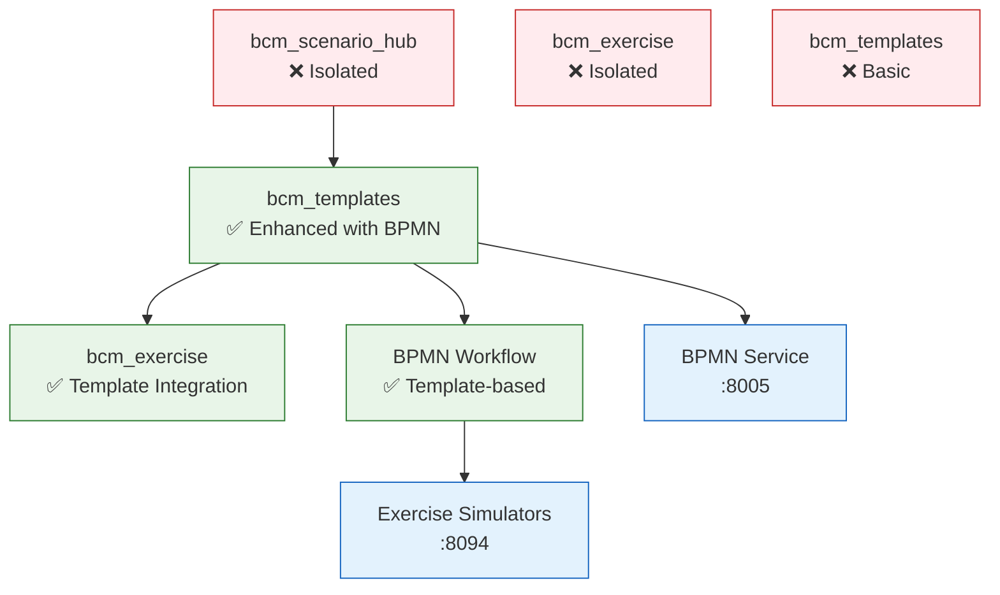

# ЭТАП 3: Module Integration Plan - BPMN Workflow через Templates

## 🎯 Новая стратегия ЭТАП 3

**Вместо создания bcm_workflow** → **Расширяем bcm_templates** для BPMN workflows!

## 🔗 Текущие модули и их связи



## 🏗️ Модульная интеграция ЭТАП 3

### **1. Расширение bcm_templates → Templates + BPMN**

#### **Что добавили в bcm_templates:**
```python
# NEW: Enhanced bcm.template model
class BcmTemplate(models.Model):
    _name = 'bcm.template'

    category = fields.Selection([
        ('document', 'Document Template'),
        ('workflow', 'BPMN Workflow Template'),  # ← NEW!
        ('form', 'Form Template'),
        ('checklist', 'Checklist Template')
    ])

    # BPMN Integration
    bpmn_xml = fields.Text('BPMN 2.0 XML')           # ← NEW!
    scenario_types = fields.Many2many('bcm.scenario') # ← NEW!
    is_ai_enhanced = fields.Boolean()                 # ← NEW!
```

### **2. Обновление bcm_exercise → Template Integration**

#### **Добавить в bcm_exercise:**
```python
# ADD to bcm.exercise model:
template_id = fields.Many2one(
    'bcm.template',
    string='Exercise Template',
    domain=[('category', '=', 'workflow')]
)

scenario_id = fields.Many2one(
    'bcm.scenario',
    string='Based on Scenario'
)

# BPMN Integration
bpmn_process_id = fields.Char('BPMN Process ID')
workflow_status = fields.Selection([
    ('draft', 'Draft'),
    ('running', 'Running'),
    ('completed', 'Completed')
])

def action_start_exercise_workflow(self):
    """Start BPMN workflow from template"""
    if self.template_id and self.template_id.bpmn_xml:
        # Call BPMN Service to start workflow
        pass
```

### **3. Связывание bcm_scenario_hub → Templates**

#### **Добавить в bcm_scenario:**
```python
# ADD to bcm.scenario model:
available_templates = fields.Many2many(
    'bcm.template',
    string='Available Templates',
    compute='_compute_available_templates'
)

def action_create_exercise_from_scenario(self):
    """Create exercise from scenario using template"""
    # Show wizard to select template
    # Auto-populate exercise with scenario data
    pass

@api.depends('category', 'level')
def _compute_available_templates(self):
    """Get compatible templates for scenario"""
    for scenario in self:
        templates = self.env['bcm.template'].search([
            ('category', '=', 'workflow'),
            ('scenario_types', 'in', [scenario.id])
        ])
        scenario.available_templates = templates
```

---

## 🔄 **ЭТАП 3 План с использованием Templates:**

### **ЗАДАЧА 3.1: Расширение bcm_templates (вместо нового модуля)**
**Что делаем:**
- ✅ **Уже сделано**: Расширили `bcm.template` model с BPMN support
- **Добавить**: BPMN workflow templates в data
- **Интеграция**: Templates ↔ BPMN Service API

### **ЗАДАЧА 3.2: Обновление bcm_exercise**
**Что делаем:**
- **Добавить**: `template_id`, `scenario_id` поля
- **Интеграция**: Exercise creation from scenario + template
- **BPMN flow**: Template BPMN → BPMN Service → Exercise execution

### **ЗАДАЧА 3.3: Связывание bcm_scenario_hub**
**Что делаем:**
- **Связать**: Scenarios ↔ Templates compatibility
- **Wizard**: "Create Exercise from Scenario" с template selection
- **Auto-generation**: AI scenarios → auto-suggest templates

---

## 🎯 **Преимущества нового подхода:**

### **✅ Используем существующие модули:**
- **bcm_templates** (расширяем) вместо нового bcm_workflow
- **bcm_exercise** (обновляем) для workflow integration
- **bcm_scenario_hub** (связываем) с templates

### **✅ Единый workflow:**
```
Scenario → Compatible Templates → Exercise Creation → BPMN Execution
```

### **✅ Простота:**
- Меньше модулей
- Логичные связи
- Переиспользование существующего кода

## 🚀 **ЭТАП 3 ОБНОВЛЕННЫЙ ПЛАН:**

**ЗАДАЧА 3.1**: Enhance bcm_templates с BPMN workflows ✅ **СДЕЛАНО**
**ЗАДАЧА 3.2**: Update bcm_exercise с template integration
**ЗАДАЧА 3.3**: Connect bcm_scenario_hub с templates

**Это гораздо лучший подход!** Используем то что есть, но делаем связанным и функциональным.

**Продолжаем с этим планом?** 🔗✨