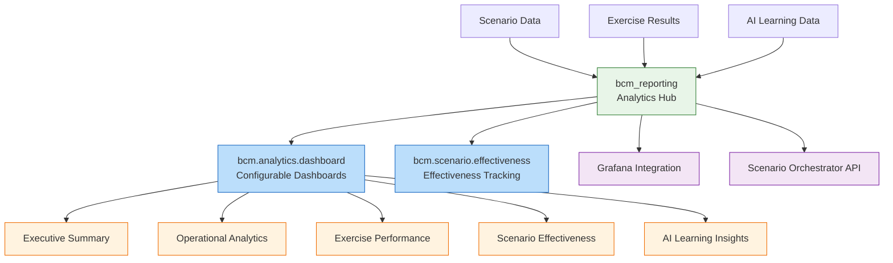
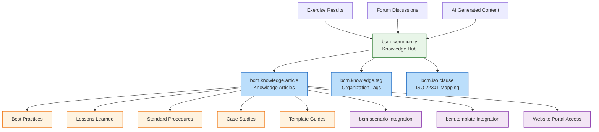
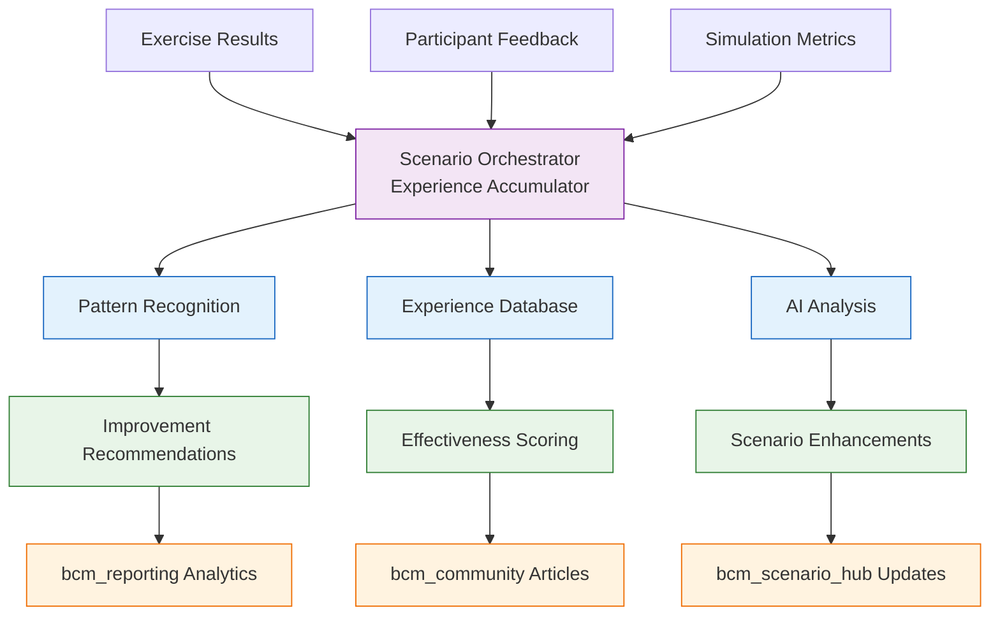

# ЭТАП 5: Intelligence & Analytics - Module Documentation

## 🧠 ЭТАП 5 Overview

**Цель**: Замкнуть learning loop с AI-powered improvements через расширение существующих модулей

**Стратегия**: Расширение 5 существующих модулей вместо создания новых

**Результат**: Полная intelligence & analytics система с knowledge management

---

## 📊 **МОДУЛЬ 1: bcm_reporting → Analytics Hub**

### **🎯 Назначение модуля:**
Центр аналитики и business intelligence для BCM Platform с AI-powered insights

### **🏗️ Enhanced Architecture:**



### **📋 Новые модели:**

#### **bcm.analytics.dashboard**
```python
Purpose: Configurable analytics dashboards
Key Features:
  - 6 типов dashboards (Executive, Operational, Exercise, Scenario, AI, Compliance)
  - Auto-refresh functionality
  - JSON-based analytics data caching
  - Real-time integration с Scenario Orchestrator

Fields:
  - name: Dashboard name
  - dashboard_type: Type selection
  - analytics_data: Cached JSON data
  - auto_refresh: Auto-update configuration
  - refresh_interval_minutes: Update frequency

Methods:
  - action_refresh_analytics(): Manual refresh trigger
  - _compute_analytics_data(): Analytics calculation by type
  - _compute_exercise_analytics(): Exercise performance metrics
  - _compute_scenario_analytics(): Scenario effectiveness analysis
  - _compute_ai_insights(): AI learning insights from Scenario Orchestrator
```

#### **bcm.scenario.effectiveness**
```python
Purpose: Track scenario effectiveness over time
Key Features:
  - Multi-dimensional effectiveness scoring
  - AI recommendations integration
  - Automatic updates from exercise results
  - Trend analysis capabilities

Fields:
  - scenario_id: Related scenario
  - exercise_count: Number of times used
  - avg_participant_rating: Average participant feedback
  - completion_rate: Exercise completion percentage
  - time_effectiveness: Time management effectiveness
  - learning_score: Learning outcomes score
  - overall_effectiveness: Computed weighted score

Methods:
  - update_from_scenario_orchestrator(): Sync with learning data
  - _compute_overall_effectiveness(): Calculate weighted effectiveness score
```

### **🔗 Analytics Integration:**

#### **Data Sources:**
```yaml
Scenario Orchestrator:
  - GET /learning/dashboard - Platform-wide analytics
  - GET /learning/scenario/{id}/insights - Scenario-specific insights
  - Experience accumulation database

Odoo Internal:
  - bcm.exercise records - Exercise outcomes
  - bcm.scenario records - Scenario usage patterns
  - bcm.template records - Template effectiveness

External Systems:
  - Grafana metrics - Technical performance data
  - JaamSim results - Simulation outcomes
  - Prometheus time-series - Historical trends
```

#### **Analytics Capabilities:**
```yaml
Executive Analytics:
  - Platform overview metrics
  - ROI и effectiveness trends
  - AI adoption и impact
  - Compliance status summary

Operational Analytics:
  - Exercise performance trends
  - Resource utilization
  - Participant engagement metrics
  - Template usage patterns

AI Learning Analytics:
  - Scenario improvement recommendations
  - Learning effectiveness trends
  - AI prediction accuracy
  - Continuous improvement metrics
```

---

## 📚 **МОДУЛЬ 2: bcm_community → Knowledge Management**

### **🎯 Enhanced Назначение:**
Community forum + Knowledge base + AI-powered content generation

### **🏗️ Knowledge Architecture:**



### **📋 Knowledge Base Models:**

#### **bcm.knowledge.article**
```python
Purpose: Central knowledge repository with AI generation
Key Features:
  - Auto-generation from exercise results
  - AI-powered content creation
  - Community collaboration
  - Website portal integration
  - Multi-language support

Fields:
  - name: Article title (translatable)
  - content: HTML content (translatable)
  - category: Article categorization
  - article_type: Source type (manual/AI/community/exercise)
  - source_exercise_id: Source exercise tracking
  - ai_prompt: AI generation prompt
  - usefulness_score: Computed usefulness metric

Methods:
  - create_from_exercise_results(): Auto-generate from exercise
  - _generate_article_content_with_ai(): AI content generation
  - action_regenerate_with_ai(): Update with latest insights
```

#### **Content Generation Flow:**
```python
# Auto-generation trigger:
Exercise Completion →
  Scenario Orchestrator Learning Analysis →
    AI Content Generation →
      bcm.knowledge.article Creation →
        Website Portal Publication

# AI Enhancement:
AI Prompt + Exercise Data + Learning Insights →
  AI Orchestrator NLP Processing →
    Structured HTML Content →
      Knowledge Article с metadata
```

### **🌐 Website Integration:**

#### **Portal Pages:**
```yaml
/bcm/community:
  - Community homepage с knowledge highlights
  - Recent articles display
  - Category navigation

/bcm/community/knowledge:
  - Knowledge base homepage
  - Article search и filtering
  - Category-based browsing

/bcm/community/knowledge/article/{id}:
  - Individual article display
  - Related articles suggestions
  - Community comments

/my/bcm/knowledge:
  - Personal knowledge dashboard
  - Bookmarked articles
  - Reading history
```

---

## 🔄 **МОДУЛЬ 3: Scenario Orchestrator → Experience Accumulator**

### **🎯 Enhanced Role:**
Central experience accumulation и learning coordination hub

### **🧠 Learning System Architecture:**



### **📊 Experience Accumulation Features:**

#### **Learning API Endpoints:**
```python
POST /learning/exercise-result:
  - Collect complete exercise outcomes
  - Participant feedback processing
  - Simulation metrics integration
  - Pattern recognition и analysis

GET /learning/scenario/{id}/insights:
  - Accumulated learning insights для specific scenario
  - Effectiveness trends over time
  - AI-generated improvement recommendations
  - Success patterns и common issues

GET /learning/dashboard:
  - Platform-wide learning analytics
  - Top performing scenarios
  - Scenarios needing improvement
  - Learning effectiveness metrics
```

#### **Experience Data Models:**
```json
ExerciseResult: {
  "exercise_id": "string",
  "scenario_id": "string",
  "template_id": "string",
  "duration_actual_hours": "float",
  "success_metrics": "object",
  "participant_feedback": "array",
  "simulation_metrics": "object",
  "lessons_learned": "array",
  "effectiveness_score": "float"
}

ScenarioLearning: {
  "scenario_id": "string",
  "total_uses": "integer",
  "avg_effectiveness": "float",
  "successful_elements": "array",
  "common_issues": "array",
  "ai_recommendations": "array",
  "effectiveness_trend": "array"
}
```

---

## 🎯 **ЭТАП 5 Итоговая архитектура:**

### **Hybrid Intelligence System:**

```yaml
Business Intelligence (Odoo):
  ✅ bcm_reporting: Analytics dashboards
  ✅ bcm_community: Knowledge base
  ✅ Integrated с business data

Technical Analytics (External):
  ✅ Grafana: Real-time monitoring
  ✅ Prometheus: Time-series storage
  ✅ Performance metrics

AI Learning (Microservice):
  ✅ Scenario Orchestrator: Experience accumulation
  ✅ Pattern recognition и recommendations
  ✅ Continuous improvement loop
```

### **📈 Intelligence Capabilities:**

**Predictive Analytics:**
- Scenario effectiveness prediction
- Exercise outcome forecasting
- Resource requirement estimation
- Risk trend analysis

**Prescriptive Analytics:**
- AI-powered scenario improvements
- Exercise optimization recommendations
- Template effectiveness suggestions
- Training needs identification

**Descriptive Analytics:**
- Exercise performance reporting
- Scenario usage patterns
- Participant engagement metrics
- Platform adoption trends

---

**ЭТАП 5 полностью задокументирован! Создаю ТЗ для интерфейсов следующим сообщением...** 🎨📋