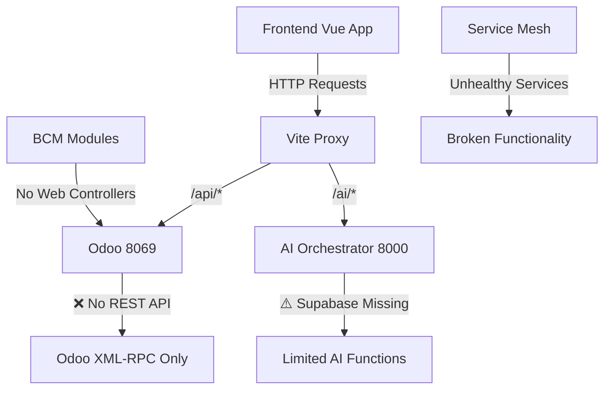

# BCM Platform: Backend-Frontend Connection Analysis

## 🔍 Executive Summary

После глубокого анализа архитектуры BCM Platform, обнаружены критические проблемы с интеграцией между фронтендом и бэкендом, которые объясняют сетевые ошибки и отсутствие функциональности.

## 📊 Service Health Status

### ✅ Working Services (Healthy)
- **PostgreSQL** - База данных работает корректно
- **Redis** - Кэширование и очереди функционируют
- **RabbitMQ** - Система сообщений активна
- **Odoo Core** - Основная платформа запущена (8069)
- **AI Orchestrator** - ИИ-оркестратор работает (8000)
- **Scenario Orchestrator** - Генератор сценариев активен (8085)
- **EventBus** - Шина событий работает (8001)
- **Deployer** - Сервис деплоя функционирует (8009)
- **Grafana** - Мониторинг работает (3003)

### ❌ Problematic Services (Unhealthy)
- **BIA Engine** (8082) - Нестабильная работа
- **Document Processor** (8083) - Проблемы с запуском
- **Compliance Checker** (8084) - Не отвечает на health check
- **GitHub App** (8011) - Проблемы с интеграцией
- **PDCA Assistant** (8010) - Сервис недоступен
- **AI Orchestrator** - Предупреждения о Supabase
- **LMS/TheHive/Grafana Adapters** - Все адаптеры нестабильны

## 🚫 Critical API Issues

### 1. Missing Odoo API Endpoints
```bash
# Тестирование показало:
GET /api/bcm/modules -> 404 Not Found
GET /auth/login -> 404 Not Found
GET /api/clients -> Endpoint не существует
```

**Проблема**: Фронтенд пытается обращаться к REST API эндпоинтам (`/api/bcm/*`), которые не реализованы в Odoo.

### 2. Frontend API Configuration Issues
```typescript
// frontend/web_portal-2/src/services/api.ts:9
const API_CONFIG = {
  baseURL: import.meta.env.VITE_API_URL || 'http://localhost:8069',
  // ... но эти эндпоинты не существуют в Odoo
}
```

## 🏗️ Architecture Mismatch Analysis

### Frontend Expectations vs Reality

| Frontend Endpoint | Expected Response | Actual Status | BCM Module |
|------------------|------------------|---------------|------------|
| `/api/bcm/modules` | BCM modules list | ❌ 404 | No REST API |
| `/api/scenarios` | Scenarios data | ❌ 404 | bcm_scenario_hub |
| `/api/clients` | Client management | ❌ 404 | bcm_clients |
| `/api/risks` | Risk data | ❌ 404 | bcm_risk_management |
| `/api/incidents` | Incidents | ❌ 404 | bcm_incident |
| `/api/dashboard/*` | Dashboard data | ❌ 404 | bcm_kpi |

### Service Integration Problems



## 🔧 BCM Modules Status

### Fully Implemented Modules ✅
1. **bcm_community** (v18.0.1.0.0)
   - Forum & Knowledge Base
   - ✅ Complete manifest
   - ✅ Security configured
   - ✅ Views defined

2. **bcm_governance** (v18.0.2.0.0)
   - AI Governance Brain
   - ✅ Anthropic integration ready
   - ✅ Dependencies resolved

3. **bcm_risk_management** (v18.0.2.0.0)
   - AI Risk Advisor
   - ✅ FAIR methodology
   - ✅ Monte Carlo simulation

4. **bcm_incident** (v18.0.5.0.0)
   - Emergency Response
   - ✅ Views configured
   - ✅ Basic functionality

### Missing REST API Layer ❌
**КРИТИЧЕСКАЯ ПРОБЛЕМА**: Все BCM модули работают только через Odoo XML-RPC/JSON-RPC, но фронтенд ожидает REST API.

## 🌐 Network Connection Issues

### Frontend-Backend Communication Problems
1. **CORS Issues**: Настройки прокси требуют доработки
2. **Authentication Mismatch**: Фронтенд использует Bearer tokens, Odoo ожидает session-based auth
3. **Protocol Mismatch**: REST vs XML-RPC конфликт

### Service Discovery Problems
```javascript
// scenarioService.ts:36
private baseURL = 'http://localhost:8085' // Scenario Orchestrator

// api.ts:9
baseURL: import.meta.env.VITE_API_URL || 'http://localhost:8069' // Odoo
```

## 🔍 Missing Service Implementations

### 1. REST API Controllers (КРИТИЧНО)
```python
# Нужно создать в каждом BCM модуле:
# - HTTP Controllers для REST API
# - JSON response formatters
# - Authentication middleware
```

### 2. WebSocket Integration
```javascript
// websocket.ts существует, но WebSocket сервер в Odoo не настроен
class WebSocketService {
  constructor(url: string) {
    // Пытается подключиться к ws://localhost:8069/websocket
    // Но Odoo WebSocket не сконфигурирован
  }
}
```

### 3. Service Authentication Bridge
Отсутствует единая система аутентификации между:
- Odoo sessions
- JWT tokens для микросервисов
- Frontend Bearer authentication

## 📋 Specific Service Analysis

### AI Services Integration Status

| Service | Port | Status | Frontend Integration | Issue |
|---------|------|--------|---------------------|-------|
| AI Orchestrator | 8000 | ⚠️ Running | ✅ Configured | Supabase warnings |
| Scenario Orchestrator | 8085 | ✅ Healthy | ✅ Direct calls | Working |
| BIA Engine | 8082 | ❌ Unstable | ⚠️ Limited | Health check fails |
| Document Processor | 8083 | ❌ Issues | ❌ No integration | Not accessible |
| Compliance Checker | 8084 | ❌ Down | ❌ No integration | Service fails |

### BCM Module Service Mapping

```javascript
// Фронтенд ожидает:
bcmAPI.getModules() -> GET /api/bcm/modules
bcmAPI.getClients() -> GET /api/clients
bcmAPI.getScenarios() -> GET /api/scenarios

// Реальность:
// Эти эндпоинты не существуют в Odoo!
// Все данные доступны только через XML-RPC:
// /web/dataset/call_kw/
```

## 🔧 Root Cause Summary

### 1. Architecture Design Mismatch
- **Фронтенд**: Современная SPA с REST API ожиданиями
- **Бэкенд**: Odoo XML-RPC + микросервисы без unified API

### 2. Missing API Gateway
Отсутствует единый API Gateway для:
- Routing requests to appropriate services
- Authentication/authorization
- Response formatting
- Error handling

### 3. Service Health Monitoring
Многие микросервисы работают, но:
- Health checks не проходят
- Отсутствует service discovery
- Нет graceful degradation

### 4. Environment Configuration
```bash
# .env проблемы:
VITE_API_URL=/api  # Но /api эндпоинты не существуют
VITE_AI_URL=http://localhost:8000  # AI Orchestrator работает
VITE_SUPABASE_URL=PLACEHOLDER  # Supabase не настроен
```

## 🚀 Immediate Fix Recommendations

### Critical Priority (P0)
1. **Создать REST API слой для Odoo BCM модулей**
2. **Настроить API Gateway или прокси-слой**
3. **Исправить authentication flow**
4. **Починить нестабильные микросервисы**

### High Priority (P1)
5. **Настроить WebSocket интеграцию**
6. **Создать service health monitoring**
7. **Настроить Supabase для AI памяти**

### Medium Priority (P2)
8. **Оптимизировать Docker networking**
9. **Настроить proper CORS**
10. **Создать unified error handling**

## 📊 Impact Assessment

### User Experience Impact: КРИТИЧЕСКИЙ
- ❌ Основные функции BCM не работают
- ❌ Сетевые ошибки при загрузке данных
- ❌ AI функции ограничены
- ❌ Dashboard пустой или с ошибками

### Development Impact: ВЫСОКИЙ
- ❌ Frontend-backend разработка заблокирована
- ❌ Интеграционные тесты невозможны
- ❌ Deployment нестабилен

### Business Impact: КРИТИЧЕСКИЙ
- ❌ BCM Platform не может быть продемонстрирована клиентам
- ❌ ISO 22301 функциональность недоступна
- ❌ AI возможности не реализованы

---

**Дата анализа**: 2025-09-15
**Статус**: Требует немедленного внимания
**Приоритет**: P0 - Критический