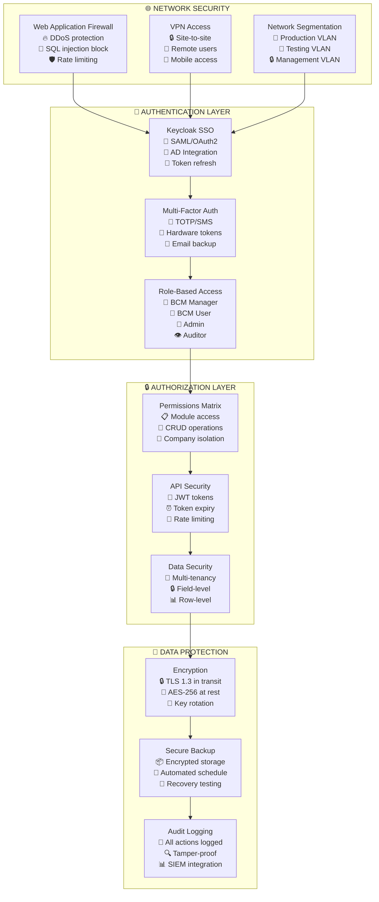
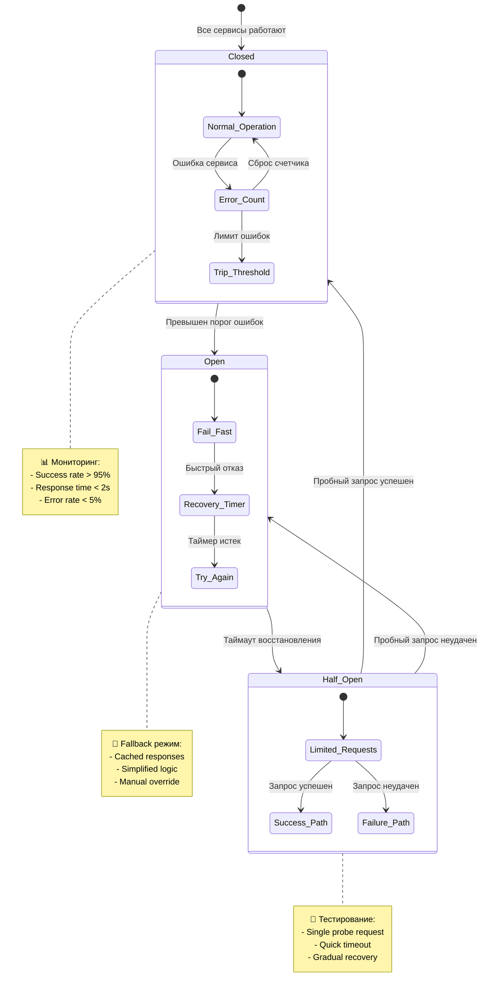
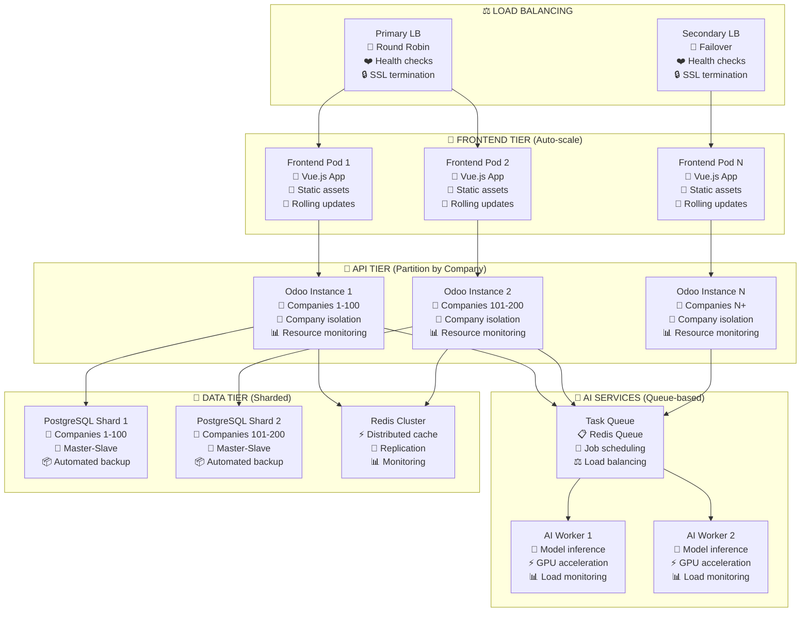
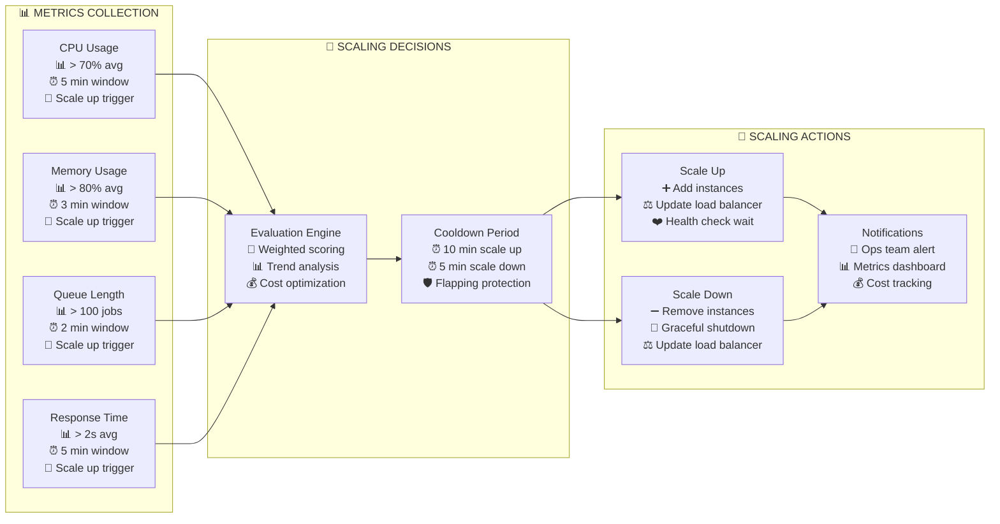
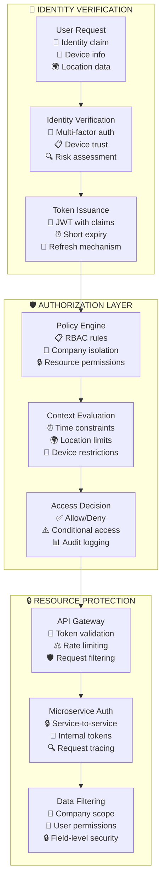
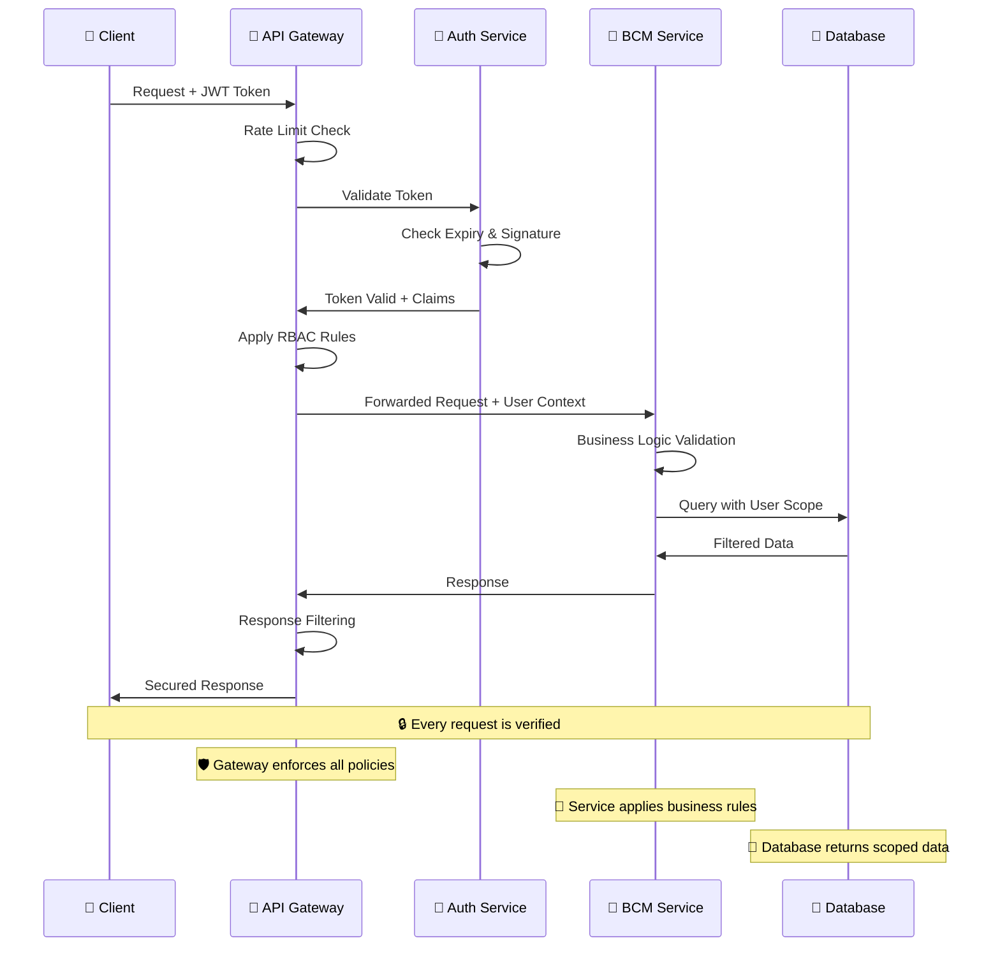
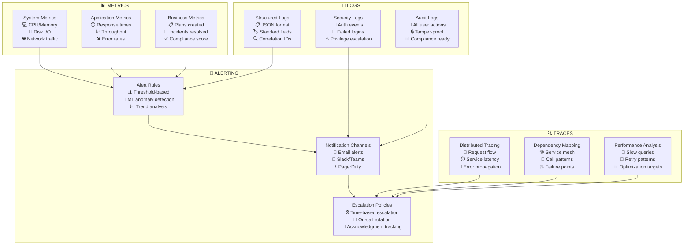
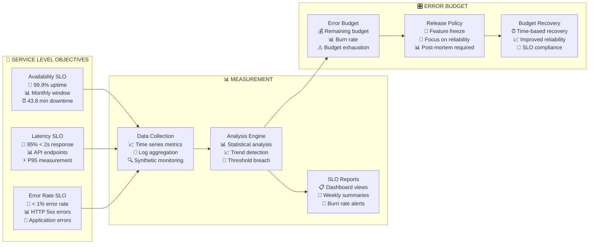
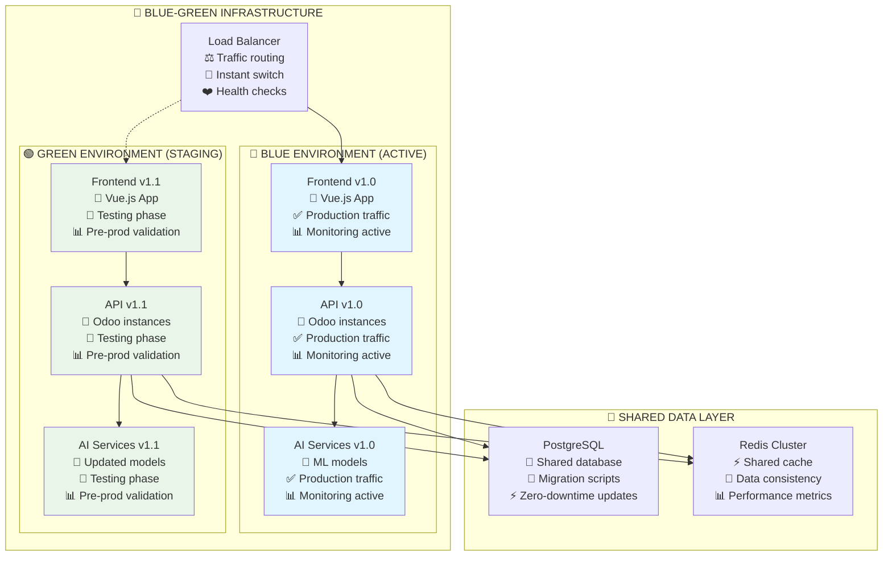
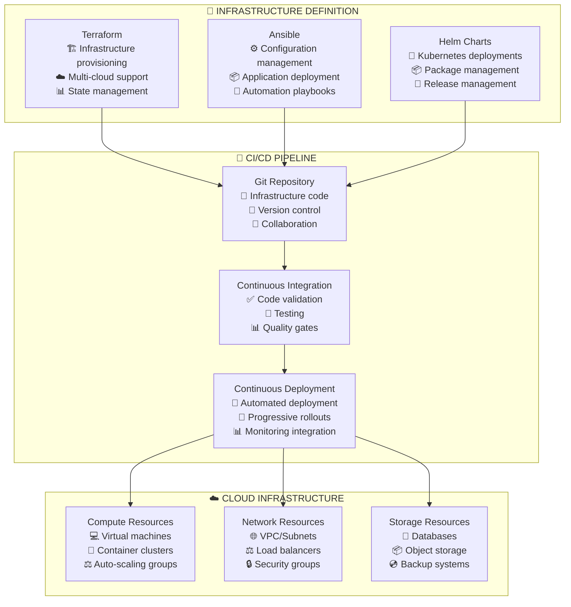

# 🛡️ BCM PLATFORM - БЕЗОПАСНОСТЬ И ПАТТЕРНЫ ИНТЕГРАЦИИ

## 🔐 АРХИТЕКТУРА БЕЗОПАСНОСТИ

### 🛡️ Многоуровневая система безопасности


### 🔐 Матрица прав доступа по ролям

| Модуль/Функция | 👑 BCM Manager | 👤 BCM User | 🔧 Admin | 👁️ Auditor |
|----------------|---------------|-------------|----------|------------|
| **bcm_core** |
| └── Планы: Создание | ✅ | ✅ | ✅ | ❌ |
| └── Планы: Редактирование | ✅ | ✅¹ | ✅ | ❌ |
| └── Планы: Удаление | ✅ | ❌ | ✅ | ❌ |
| └── Инциденты: Создание | ✅ | ✅ | ✅ | ❌ |
| └── Инциденты: Назначение | ✅ | ❌ | ✅ | ❌ |
| └── AI Lifecycle: Просмотр | ✅ | ❌ | ✅ | ✅ |
| **bcm_intelligent_base** |
| └── AI Конфигурация | ✅ | ❌ | ✅ | ❌ |
| └── AI Анализ: Запуск | ✅ | ✅ | ✅ | ❌ |
| └── AI Результаты: Просмотр | ✅ | ✅ | ✅ | ✅ |
| **bcm_base** |
| └── Сервисы: Конфигурация | ✅ | ❌ | ✅ | ❌ |
| └── Health Checks | ✅ | ✅ | ✅ | ✅ |
| └── API Интеграции | ✅ | ❌ | ✅ | ❌ |
| **Административные** |
| └── Управление пользователями | ❌ | ❌ | ✅ | ❌ |
| └── Системные логи | ✅ | ❌ | ✅ | ✅ |
| └── Резервное копирование | ❌ | ❌ | ✅ | ❌ |
| └── Аудит и соответствие | ✅ | ❌ | ✅ | ✅ |

¹ Только свои записи

---

## 🔄 ПАТТЕРНЫ ОБРАБОТКИ ОШИБОК

### ⚠️ Централизованная обработка ошибок

```mermaid
graph TB
    subgraph "🎯 ERROR SOURCES"
        USER_ERR[User Errors<br/>📝 Invalid input<br/>🚫 Permission denied<br/>⏰ Session timeout]
        SYS_ERR[System Errors<br/>💾 Database failure<br/>🔗 Network timeout<br/>💥 Service crash]
        AI_ERR[AI Service Errors<br/>🤖 Model failure<br/>⏰ Processing timeout<br/>📊 Invalid response]
        EXT_ERR[External Errors<br/>🌐 API unavailable<br/>🔒 Auth failure<br/>📊 Rate limit exceeded]
    end

    subgraph "🔍 ERROR DETECTION"
        VALIDATION[Input Validation<br/>✅ Schema validation<br/>🔍 Business rules<br/>🛡️ Security checks]
        MONITORING[System Monitoring<br/>📊 Health checks<br/>🚨 Alert thresholds<br/>📈 Performance metrics]
        EXCEPTION[Exception Handling<br/>🛡️ Try-catch blocks<br/>📝 Error logging<br/>🔄 Graceful degradation]
    end

    subgraph "📊 ERROR PROCESSING"
        CLASSIFICATION[Error Classification<br/>🔴 Critical (P1)<br/>🟡 High (P2)<br/>🟢 Medium (P3)<br/>🔵 Low (P4)]
        ROUTING[Error Routing<br/>👥 Team assignment<br/>📧 Notification rules<br/>🔄 Escalation paths]
        RECOVERY[Recovery Actions<br/>🔄 Auto-retry<br/>💾 Fallback mode<br/>👥 Manual intervention]
    end

    subgraph "📤 ERROR RESPONSE"
        USER_MSG[User Messages<br/>💬 Friendly errors<br/>🎯 Action guidance<br/>🔒 No sensitive data]
        LOGGING[Error Logging<br/>📝 Structured logs<br/>🔍 Stack traces<br/>📊 Metrics tracking]
        ALERTING[Alerting<br/>🚨 Real-time alerts<br/>📧 Email notifications<br/>📱 Mobile push]
    end

    USER_ERR --> VALIDATION
    SYS_ERR --> MONITORING
    AI_ERR --> EXCEPTION
    EXT_ERR --> EXCEPTION
    VALIDATION --> CLASSIFICATION
    MONITORING --> CLASSIFICATION
    EXCEPTION --> CLASSIFICATION
    CLASSIFICATION --> ROUTING
    ROUTING --> RECOVERY
    RECOVERY --> USER_MSG
    RECOVERY --> LOGGING
    RECOVERY --> ALERTING
```

### 🎯 Circuit Breaker Pattern для AI Services



---

## 🔄 ПАТТЕРНЫ МАСШТАБИРОВАНИЯ

### 📈 Horizontal Scaling Architecture



### 📊 Auto-scaling Triggers



---

## 🔐 SECURITY PATTERNS

### 🛡️ Zero Trust Security Model



### 🔐 API Security Pattern



---

## 📊 MONITORING AND OBSERVABILITY

### 📈 Three Pillars of Observability



### 🎯 SLA/SLO Monitoring



---

## 🚀 DEPLOYMENT PATTERNS

### 🔄 Blue-Green Deployment



### 🏗️ Infrastructure as Code



**🎯 Эти схемы дают команде разработчиков:**

1. **🛡️ Понимание безопасности** - как защищать данные и систему
2. **⚠️ Обработка ошибок** - как корректно реагировать на сбои
3. **📈 Масштабирование** - как система растет под нагрузкой
4. **📊 Мониторинг** - как отслеживать здоровье системы
5. **🚀 Развертывание** - как безопасно обновлять продакшн

Теперь у тебя полный набор для передачи команде! Что еще добавить?