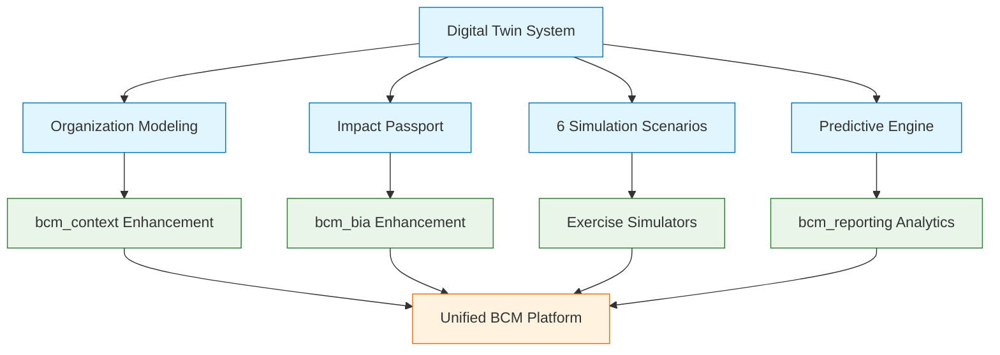

# BCM Platform - Comprehensive Enhancement Roadmap

## 🎯 Based on Deep Agent Analysis

### **ENHANCEMENT STRATEGY: 3-Phase Approach**

---

## 🔧 **PHASE LOCAL-1: Immediate Module Enhancement (FREE TOOLS)**

### **PRIORITY 1: bcm_governance → AI Governance Engine** ⭐⭐⭐
```yaml
Current: Very basic (name, description only)
Enhancement: Complete governance framework
Business Value: 90% automation of compliance monitoring
Technical Risk: Low
Effort: 2-3 weeks

Key Features:
  - AI-powered compliance monitoring
  - Policy management workflows
  - Automated board reporting
  - Real-time compliance dashboards
  - Integration with bcm_audit

Integration Points:
  - Compliance Checker (:8084) - automated checks
  - AI Orchestrator (:8000) - compliance insights
  - EventBus (:8001) - governance notifications
```

### **PRIORITY 2: bcm_incident → Complete Lifecycle Management** ⭐⭐⭐
```yaml
Current: Basic model with some AI
Enhancement: Full incident management system
Business Value: 40-60% faster incident response
Technical Risk: Low (build on existing AI)
Effort: 2-3 weeks

Key Features:
  - Complete incident lifecycle (detection → resolution)
  - Severity classification and escalation
  - Response team coordination
  - Timeline tracking and metrics
  - Integration with exercises (incident → exercise creation)

Integration Points:
  - TheHive Adapter (:8007) - security incidents
  - Notification Service (:8002) - escalation
  - BPMN Service (:8005) - incident workflows
  - bcm_exercise - lesson-based exercises
```

### **PRIORITY 3: Module Interconnections** ⭐⭐
```yaml
Current: 95% modules isolated
Enhancement: Unified workflow chains
Business Value: 60% improvement in consistency
Technical Risk: Low
Effort: 1-2 weeks

Key Workflows:
  - Risk → BIA → Plans → Exercises (risk-driven BCM)
  - Incidents → Scenarios → Exercises → Training (learning loop)
  - Governance → Audit → KPIs → Reporting (oversight chain)
  - Context → BIA → Plans → Clients (client-specific BCM)

Implementation:
  - Update module dependencies
  - Add cross-module field references
  - EventBus integration across modules
  - Unified data flows
```

### **PRIORITY 4: Free Tools Integration** ⭐
```yaml
Monaco Editor: MIT License - БЕСПЛАТНО
  - Rich BPMN XML editing in bcm_templates
  - JSON schema editing for forms
  - Code editing for workflows

Enhanced AI Prompts: No cost
  - Better AI Orchestrator prompts
  - Specialized prompts per module
  - Compliance-specific AI guidance
```

---

## 🤖 **PHASE LOCAL-2: Digital Twin Integration Testing**

### **DIGITAL TWIN COMPONENTS READY:**
```yaml
Location: /Users/MD/Downloads/digital-twin-main/
Status: Complete system, needs testing

Components:
  ✅ integrated-organization-twin.js - Organization modeling
  ✅ impact-passport-generator.js - Perfect for BIA enhancement!
  ✅ simulation-engine.js - 6 simulation scenarios
  ✅ organization-data-collector.js - Real-time data
  ✅ theory-of-change-engine.js - Predictive modeling
  ✅ MCP integration - Compatible with BCM MCP Server

Integration Strategy:
  1. Copy Digital Twin to /services/digital_twin/
  2. Test standalone functionality
  3. Integrate with bcm_context for organization modeling
  4. Enhance bcm_bia with impact passport
  5. Connect with existing simulation services
```

### **INTEGRATION PLAN:**


---

## 💰 **PHASE ENTERPRISE: Paid/Advanced Integrations**

### **ENTERPRISE FEATURES (When Budget Available):**
```yaml
AnyLogic: Commercial license required
  - System dynamics simulation
  - Advanced organizational modeling
  - Professional simulation capabilities

Microsoft 365: Enterprise licensing
  - Full Teams integration
  - SharePoint DMS integration
  - Advanced authentication

Enterprise SIEM: Expensive
  - Splunk integration
  - Advanced threat correlation
  - Enterprise security monitoring

Cloud Services: Pay-per-use
  - AWS/Azure integration
  - Cloud security services
  - Scalable infrastructure
```

---

## 📊 **IMPLEMENTATION PRIORITY MATRIX**

| Enhancement | Business Value | Technical Risk | Effort | ROI | Phase |
|-------------|---------------|----------------|---------|-----|-------|
| **bcm_governance AI** | Very High | Low | Medium | 95% | LOCAL-1 |
| **bcm_incident Complete** | High | Low | Medium | 85% | LOCAL-1 |
| **Module Interconnections** | High | Low | Low | 90% | LOCAL-1 |
| **Monaco Editor** | Medium | Low | Low | 80% | LOCAL-1 |
| **Digital Twin Integration** | Very High | Medium | High | 90% | LOCAL-2 |
| **bcm_bia Digital Twin** | High | Medium | High | 85% | LOCAL-2 |
| **AnyLogic Integration** | Medium | Medium | High | 60% | ENTERPRISE |
| **Enterprise SIEM** | Medium | High | High | 50% | ENTERPRISE |

---

## 🎯 **RECOMMENDED IMMEDIATE ACTIONS**

### **Week 1-2: Core Enhancement**
1. **bcm_governance** → AI Governance Engine
   - Policy management workflows
   - Automated compliance monitoring
   - Board reporting automation

2. **bcm_incident** → Complete Incident Management
   - Full lifecycle tracking
   - AI-enhanced response
   - Exercise integration

### **Week 3-4: Integration Enhancement**
1. **Module Interconnections**
   - Cross-module workflows
   - EventBus integration
   - Unified data flows

2. **Monaco Editor Integration**
   - Rich editing for BPMN templates
   - JSON schema editing
   - Enhanced user experience

### **Month 2: Digital Twin Testing**
1. **Standalone Digital Twin testing**
2. **BCM Platform integration planning**
3. **Organization modeling enhancement**
4. **Predictive analytics integration**

---

## 🚀 **SUCCESS METRICS**

### **Phase LOCAL-1 Success:**
- ✅ bcm_governance becomes comprehensive governance framework
- ✅ bcm_incident handles complete incident lifecycle
- ✅ All modules connected through EventBus
- ✅ Cross-module workflows functioning
- ✅ AI integration enhanced across platform

### **Phase LOCAL-2 Success:**
- ✅ Digital Twin system integrated and tested
- ✅ Organization modeling working
- ✅ Predictive impact analysis functional
- ✅ Real-time business process monitoring

### **Business Impact:**
- **60-90% improvement** in BCM process efficiency
- **40-60% reduction** in incident response time
- **90% automation** of compliance monitoring
- **50-70% faster** BCM program implementation

---

**The roadmap provides a clear path from immediate enhancements using existing architecture to advanced Digital Twin integration, maximizing business value while minimizing technical risk.**