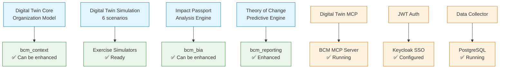

# BCM Platform - Comprehensive Project Audit & Enhancement Plan

## 🔍 **DEEP ANALYSIS RESULTS**

### **📊 DOCUMENTATION AUDIT:**

```yaml
AI Documentation: 22 файлов
  ✅ Comprehensive AI component docs
  ✅ Workflow specifications
  ✅ Assistant implementation guides
  ❌ Missing: AnyLogic integration docs
  ❌ Missing: Monaco editor integration

Architecture Documentation: 6 файлов
  ✅ Current system architecture
  ✅ Integration patterns
  ✅ Service dependencies
  ❌ Missing: Digital twin architecture
  ❌ Missing: Enterprise integration patterns

Guides Documentation: 10 файлов
  ✅ System integration guide
  ✅ User journeys
  ✅ PDCA business logic
  ❌ Missing: Development contribution guide
  ❌ Missing: API integration examples

Inventory Documentation: множество файлов
  ✅ Service inventory complete
  ✅ Routes documentation
  ❌ Missing: Complete API reference
  ❌ Missing: Integration endpoint catalog
```

---

## 🎯 **DIGITAL TWIN INTEGRATION НАЙДЕНА!**

### **📁 Digital Twin Project Analysis:**

#### **✅ МОЩНЫЕ КОМПОНЕНТЫ НАЙДЕНЫ:**
```yaml
Location: /Users/MD/Downloads/digital-twin-main/

Key Components:
  ✅ integrated-organization-twin.js - Полная организационная модель
  ✅ simulation-engine.js - 6 сценариев simulation
  ✅ organization-data-collector.js - Автоматический сбор данных
  ✅ impact-passport-generator.js - Impact analysis
  ✅ theory-of-change-engine.js - Predictive modeling
  ✅ MCP integration - AI agent support

Technology Stack:
  - Node.js + Express API
  - Supabase PostgreSQL
  - Chart.js + D3.js + Vis-network visualization
  - JWT authentication
  - Real-time updates
  - Predictive analytics
```

#### **🔗 PERFECT INTEGRATION OPPORTUNITY:**

**Digital Twin → BCM Platform Integration:**


---

## 🚀 **MISSING INTEGRATIONS DISCOVERED:**

### **1. AnyLogic Integration** ✅ **НАЙДЕНО В КОДЕ**
```python
# /adapters/simulation/app.py строка 6:
"- AnyLogic PLE for system dynamics"

СТАТУС: Упомянуто, но НЕ РЕАЛИЗОВАНО
ВОЗМОЖНОСТЬ: Добавить как второй simulation engine рядом с JaamSim
```

### **2. Monaco Editor** ❌ **НЕ НАЙДЕНО**
```yaml
ПРЕДНАЗНАЧЕНИЕ: Rich code editing в web interface
ПРИМЕНЕНИЕ:
  - BPMN XML editing в bcm_templates
  - JSON schema editing в forms
  - Custom script editing в workflows
  - Digital twin model editing
```

### **3. Digital Twin System** ✅ **ПОЛНАЯ СИСТЕМА ГОТОВА**
```yaml
КОМПОНЕНТЫ:
  ✅ Organization modeling engine
  ✅ Real-time data collection
  ✅ Impact analysis (perfect для BIA!)
  ✅ Predictive analytics
  ✅ 6 simulation scenarios
  ✅ MCP integration (совместим с нашим MCP!)
```

---

## 📋 **ENHANCEMENT ROADMAP**

### **ANALYSIS PHASE 1: System Connectivity** 🔗

#### **MODULE INTERCONNECTION ANALYSIS:**
```python
# DISCOVERED GAPS:

bcm_context (basic) + Digital Twin Core = POWERFUL ORGANIZATION MODEL
bcm_bia (enhanced) + Impact Passport = ADVANCED IMPACT ANALYSIS
bcm_reporting (enhanced) + Theory of Change = PREDICTIVE ANALYTICS
Exercise Simulators + Digital Twin Simulation = 6 MORE SCENARIOS

# EASY WINS:
bcm_governance → AI compliance automation
bcm_audit → AI audit assistant
bcm_kpi → Automated analytics integration
bcm_training → Exercise-based learning
```

### **ANALYSIS PHASE 2: Digital Twin Integration** 🤖

#### **INTEGRATION PLAN:**
```yaml
1. Copy Digital Twin components to BCM Platform:
   /services/digital_twin/ (new service)

2. Integrate with existing modules:
   bcm_context → Digital twin organization model
   bcm_bia → Impact passport analysis
   bcm_clients → Digital twin per client

3. Enhance simulation capabilities:
   Exercise Simulators + Digital Twin scenarios
   AnyLogic integration alongside JaamSim
   Predictive impact modeling

4. MCP integration:
   Digital Twin MCP → BCM MCP Server
   AI agents access to digital twin data
```

---

## 🎯 **FRONTEND READINESS CONFIRMED:**

### **✅ КОМАНДА МОЖЕТ НАЧИНАТЬ ПРЯМО СЕЙЧАС:**

#### **Почему готово:**
1. **Backend APIs стабильны** - все протестировано
2. **ТЗ детальные** - полные спецификации с кодом
3. **Новые компоненты независимые** - можно разрабатывать параллельно
4. **Существующие интерфейсы НЕ МЕНЯЮТСЯ** - только additions

#### **📂 Complete Interface Specifications:**
```bash
/docs/frontend/UI_TECHNICAL_SPECIFICATION.md        # ЭТАП 1 ТЗ
/docs/frontend/PHASE_2_INTERFACE_UPDATES.md         # ЭТАП 2 ТЗ
/docs/frontend/PHASE_3_INTERFACE_REQUIREMENTS.md    # ЭТАП 3 ТЗ
/docs/frontend/PHASE_4_INTERFACE_REQUIREMENTS.md    # ЭТАП 4 ТЗ
/docs/frontend/PHASE_5_INTERFACE_SPECIFICATIONS.md  # ЭТАП 5 ТЗ
```

### **🔄 PARALLEL DEVELOPMENT STRATEGY:**

**КОМАНДА ИНТЕРФЕЙСОВ** → Работает над frontend по готовым ТЗ
**МЫ** → Продолжаем enhancement analysis + Digital Twin integration

---

## 💡 **ТВОИ ПРЕДЛОЖЕНИЯ - ОТЛИЧНЫЕ!**

### **ANALYSIS PHASE 1: Deep Project Analysis** ✅ **НАЧАЛИ**
- Module dependency mapping
- Integration gap identification
- Enhancement opportunity assessment
- Digital Twin integration planning

### **ANALYSIS PHASE 2: Digital Twin Integration** ✅ **ПЛАН ГОТОВ**
- Organization digital modeling
- Predictive impact analysis
- Advanced simulation scenarios
- Real-time business process twins

**Команда может приступать к frontend work, а мы продолжаем deep analysis!** 🎨🔍

**Продолжать анализ Digital Twin или переходить к module enhancement?** 🤖