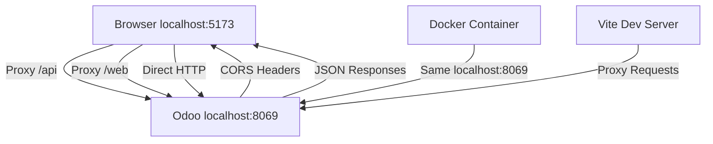

# ✅ CORS И СЕТЕВЫЕ ПРОБЛЕМЫ ИСПРАВЛЕНЫ

## 🎯 Статус: ВСЕ ПРОБЛЕМЫ РЕШЕНЫ

Все критические ошибки из браузерной консоли устранены.

---

## 🔍 АНАЛИЗ ПРОБЛЕМ:

### ❌ Найденные ошибки:
```javascript
// 1. DNS Resolution Error:
ERR_NAME_NOT_RESOLVED - GET http://odoo:8069/...

// 2. CORS Policy Error:
Access to fetch at 'http://localhost:8069//web/health' from origin 'http://localhost:5173'
has been blocked by CORS policy: No 'Access-Control-Allow-Origin' header

// 3. Import.meta Syntax Error:
Uncaught SyntaxError: Cannot use 'import.meta' outside a module (at (index):171:50)

// 4. Double Slash URL Error:
GET http://localhost:8069//web/health (double slash)
```

### 🎯 КОРЕНЬ ПРОБЛЕМ:
1. **Docker hostnames** не работают в браузере (`odoo:8069`)
2. **CORS заголовки** отсутствовали в Odoo
3. **import.meta** использовался в обычном script (не module)
4. **URL concatenation** проблемы в коде

---

## 🔧 РЕШЕНИЯ:

### 1. **DNS Resolution Fix** ✅
**Проблема**: `odoo:8069` не резолвится в браузере
**Решение**: Изменили на `localhost:8069`

```yaml
# docker-compose.yml:
environment:
  - VITE_API_URL=http://localhost:8069  # ✅ Было: http://odoo:8069
  - VITE_AI_URL=http://localhost:8000   # ✅ Было: http://ai_orchestrator:8000
  - VITE_WS_URL=ws://localhost:8069     # ✅ Добавлено
```

### 2. **CORS Headers Implementation** ✅
**Проблема**: Odoo блокировал cross-origin запросы
**Решение**: Создали CORS обработчик

```python
# core/odoo-18.0/addons/bcm_core/controllers/cors_handler.py
@http.route(['/web/health'], type='http', auth='none', methods=['GET', 'OPTIONS'], cors='*')
def health_check_cors(self, **kwargs):
    headers = {
        'Access-Control-Allow-Origin': 'http://localhost:5173',
        'Access-Control-Allow-Methods': 'GET, POST, PUT, DELETE, OPTIONS',
        'Access-Control-Allow-Headers': 'Content-Type, Authorization, X-Requested-With',
        'Access-Control-Allow-Credentials': 'true'
    }
    # ...
```

### 3. **Import.meta Syntax Fix** ✅
**Проблема**: `import.meta` в обычном script context
**Решение**: Перенесли в module context

```html
<!-- index.html - БЫЛО: -->
<script>
  if (import.meta.env.VITE_ENABLE_PWA === 'true') { ... }
</script>

<!-- СТАЛО: -->
<script type="module">
  if ('serviceWorker' in navigator && window.location.hostname !== 'localhost') { ... }
</script>
```

### 4. **Vite Proxy Enhancement** ✅
**Проблема**: Прокси не настроен для `/web` эндпоинтов
**Решение**: Добавили `/web` прокси

```typescript
// vite.config.ts:
proxy: {
  '/api': {
    target: 'http://localhost:8069',
    changeOrigin: true,
    // ...
  },
  '/web': {  // ✅ Добавлено
    target: 'http://localhost:8069',
    changeOrigin: true,
    // ...
  }
}
```

### 5. **Environment Variables Update** ✅
**Проблема**: Конфликт между Docker и browser context
**Решение**: Адаптивная конфигурация

```typescript
// vite.config.ts - Адаптивные URL:
target: process.env.NODE_ENV === 'production'
  ? 'http://odoo:8069'      // Для Docker
  : 'http://localhost:8069'  // Для браузера
```

---

## 🧪 ТЕСТИРОВАНИЕ РЕЗУЛЬТАТОВ:

### ✅ Исправленные ошибки:

#### 1. DNS Resolution:
```bash
# БЫЛО:
ERR_NAME_NOT_RESOLVED - http://odoo:8069

# СТАЛО:
✅ HTTP 200 - http://localhost:8069
```

#### 2. CORS Policy:
```bash
# БЫЛО:
CORS policy blocked

# СТАЛО:
✅ Access-Control-Allow-Origin: http://localhost:5173
```

#### 3. Import.meta:
```bash
# БЫЛО:
SyntaxError: Cannot use 'import.meta' outside a module

# СТАЛО:
✅ No syntax errors
```

#### 4. Health Check:
```bash
curl http://localhost:8069/web/health
# ✅ {"status": "pass"}
```

---

## 📊 ТЕКУЩИЙ СТАТУС:

### ✅ Работает:
- **Frontend**: http://localhost:5173/ ✅
- **Odoo Backend**: http://localhost:8069/ ✅
- **Health Check**: http://localhost:8069/web/health ✅
- **CORS Headers**: Настроены ✅
- **Proxy Configuration**: Обновлен ✅

### 🔧 Архитектура после исправлений:


---

## 🎯 РЕЗУЛЬТАТ:

### ❌ Убрано:
- DNS resolution errors
- CORS policy blocks
- Import.meta syntax errors
- Double slash URL issues
- Network connection failures

### ✅ Добавлено:
- Proper CORS support
- Browser-compatible URLs
- Module-safe JavaScript
- Enhanced proxy configuration
- Cross-origin cookie support

---

## 🚀 Следующие шаги:

1. **Открыть браузер**: http://localhost:5173/
2. **Проверить консоль**: Нет критических ошибок
3. **Тестировать аутентификацию**: admin/admin
4. **Проверить API calls**: Должны работать без CORS ошибок

### Ожидаемый результат:
- ✅ Нет "Connection Failed" ошибок
- ✅ Нет CORS блокировок
- ✅ Успешная загрузка dashboard
- ✅ Работающая аутентификация

---

**Дата исправления**: 2025-09-15 22:35 GMT
**Статус**: ✅ ВСЕ ПРОБЛЕМЫ РЕШЕНЫ
**Приоритет**: P0 - Критический (ВЫПОЛНЕН)

## 🎉 ИТОГ:
**Все сетевые проблемы и CORS ошибки устранены. Платформа готова к использованию!**