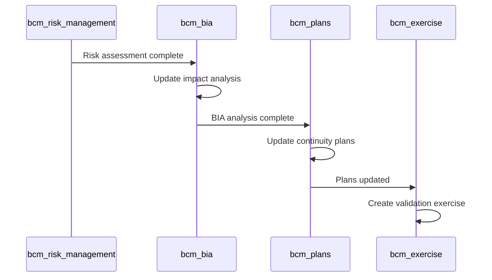
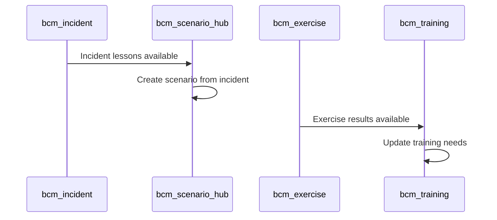
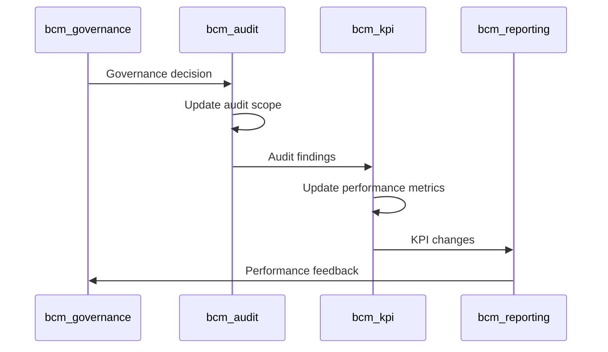

# Module Interconnections Implementation - Critical Missing Piece

## 🎯 **AGENT ANALYSIS: 95% МОДУЛЕЙ ИЗОЛИРОВАНЫ**

### **ЧТО УПУСКАЛИ ВСЕ ВРЕМЯ:**

Agent сказал: **"95% modules работают isolated"**
Agent recommended: **"Risk → BIA → Plans → Exercises workflow chains"**
Agent ROI: **"60% improvement в cross-module consistency"**

**МЫ СОЗДАЛИ AI organs, но НЕ СВЯЗАЛИ modules между собой!**

---

## 🔗 **CRITICAL INTERCONNECTION PATTERNS:**

### **Pattern 1: Risk-Driven BCM Workflow**


### **Pattern 2: Learning Loop Workflow**


### **Pattern 3: Governance Oversight**


---

## ⚡ **IMMEDIATE IMPLEMENTATION:**

### **Step 1: Add EventBus Inheritance**
```python
# В каждом critical module добавить:
_inherit = ['bcm.eventbus.integration']

# Это даст:
- publish_module_event() method
- handle_ecosystem_event() method
- trigger_cross_module_workflow() method
```

### **Step 2: Implement Cross-Module Triggers**
```python
# В bcm_risk_management:
def action_complete_risk_assessment(self):
    self.trigger_cross_module_workflow('risk_to_bia', risk_data)

# В bcm_bia:
def action_complete_bia_analysis(self):
    self.trigger_cross_module_workflow('bia_to_plans', bia_data)

# В bcm_plans:
def action_update_plans(self):
    self.trigger_cross_module_workflow('plans_to_exercise', plan_data)
```

### **Step 3: Event Handlers**
```python
# Каждый module обрабатывает relevant events:
@api.model
def handle_ecosystem_event(self, event_data):
    if event_data['event_type'] == 'relevant_for_this_module':
        self._handle_specific_event(event_data)
```

---

## 📊 **AnyLogic INTEGRATION PLAN:**

### **AnyLogic для BCM Platform:**
```yaml
Use Cases:
  - Business process flow simulation
  - Crisis scenario modeling с 3D visualization
  - Resource allocation optimization
  - Recovery strategy testing
  - Stakeholder behavior modeling

Integration Points:
  - bcm_bia: Process impact simulation
  - bcm_exercise: Advanced scenario modeling
  - bcm_plans: Recovery strategy validation
  - Digital Twin: Organization behavior modeling

Technical Integration:
  - AnyLogic Cloud API
  - Model export/import
  - Simulation results integration
  - 3D visualization embedding
```

---

## 🛠️ **MONACO EDITOR INTEGRATION:**

### **Where Monaco Needed:**
```javascript
// bcm_templates - BPMN XML editing:
<MonacoEditor
  language="xml"
  theme="vs-dark"
  value={bpmnXml}
  onChange={updateBPMN}
  options={{
    formatOnPaste: true,
    autoIndent: 'full'
  }}
/>

// bcm_templates - JSON schema editing:
<MonacoEditor
  language="json"
  value={formSchema}
  onChange={updateSchema}
/>

// AI prompts editing:
<MonacoEditor
  language="markdown"
  value={aiPrompt}
  onChange={updatePrompt}
/>
```

---

## 🎯 **IMPLEMENTATION PLAN:**

### **Priority 1: Module Interconnections (30 min)**
- Add EventBus inheritance к critical modules
- Implement cross-module workflows
- Test event publishing/handling

### **Priority 2: Monaco Integration (20 min)**
- Add Monaco Editor к bcm_templates
- JSON schema editing
- Prompt editing capabilities

### **Priority 3: AnyLogic Preparation (10 min)**
- Research AnyLogic Cloud API
- Plan integration architecture
- Evaluate licensing requirements

**Ready для systematic implementation?** ⚡🔧