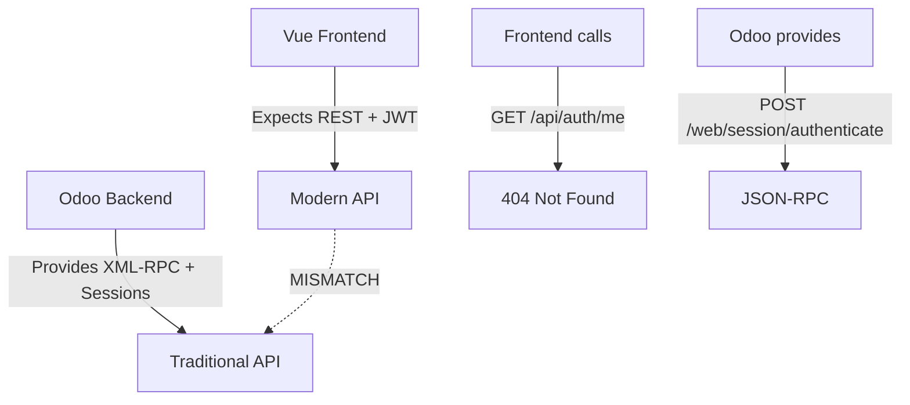

# 🔍 Точная диагностика проблем подключения Odoo

## 🚨 КРИТИЧЕСКИЕ ПРОБЛЕМЫ НАЙДЕНЫ

После детального тестирования соединений выявлены **точные причины** ошибок "Connection Failed" и "Authentication Not authenticated":

---

## 1. 🔐 Проблема аутентификации

### ❌ Что происходит сейчас:
```javascript
// frontend/web_portal-2/src/stores/auth.ts:61
const response = await bcmAPI.login(credentials)

// frontend/web_portal-2/src/services/api.ts:276
login: (credentials: { email: string; password: string }) =>
  apiService.post('/auth/login', credentials),  // ❌ Этот эндпоинт НЕ СУЩЕСТВУЕТ!
```

### ✅ Что должно быть:
```bash
# Правильный Odoo эндпоинт:
POST /web/session/authenticate
{
  "jsonrpc": "2.0",
  "method": "call",
  "params": {
    "db": "bcm_platform",
    "login": "admin",
    "password": "admin"
  },
  "id": 1
}
```

### 🧪 Тестирование показало:
```bash
# ❌ Не работает (фронтенд пытается):
curl http://localhost:8069/auth/login
# HTTP 404 NOT FOUND

# ✅ Работает (правильный способ):
curl -X POST http://localhost:8069/web/session/authenticate \
  -H "Content-Type: application/json" \
  -d '{"jsonrpc":"2.0","method":"call","params":{"db":"bcm_platform","login":"admin","password":"admin"},"id":1}'
# HTTP 200 OK + session cookie
```

---

## 2. 🛣️ Проблема маршрутизации API

### ❌ Frontend ожидает REST API:
```typescript
// api.ts ожидает эти эндпоинты:
'/api/bcm/modules'     // ❌ 404 Not Found
'/api/clients'         // ❌ 404 Not Found
'/api/scenarios'       // ❌ 404 Not Found
'/auth/login'          // ❌ 404 Not Found
'/auth/me'             // ❌ 404 Not Found
```

### ✅ Odoo предоставляет только:
```python
# core/odoo-18.0/addons/bcm_core/controllers/api.py
@http.route('/api/bcm/core/metrics', type='json', auth='user')  # ✅ Существует
@http.route('/api/bcm/core/context', type='json', auth='user')  # ✅ Существует
@http.route('/bcm/plan/update', type='json', auth='user')       # ✅ Существует
@http.route('/bcm/incident/create', type='json', auth='user')   # ✅ Существует
```

**НО:** Все эти эндпоинты требуют аутентификации через Odoo session, а не JWT tokens!

---

## 3. 📡 Проблема прокси-конфигурации

### ⚠️ Vite прокси настроен правильно:
```typescript
// vite.config.ts:30-40
proxy: {
  '/api': {
    target: 'http://localhost:8069',  // ✅ Правильный target
    changeOrigin: true,               // ✅ CORS настроен
    secure: false                     // ✅ HTTP разрешен
  }
}
```

### ❌ Но фронтенд посылает неправильные запросы:
```bash
# Фронтенд отправляет:
GET http://localhost:5174/api/auth/me
# Прокси перенаправляет на:
GET http://localhost:8069/api/auth/me  # ❌ Не существует

# Должно быть:
POST http://localhost:8069/web/session/get_session_info
```

---

## 4. 🔑 Проблема системы токенов

### ❌ Frontend использует JWT Bearer tokens:
```javascript
// api.ts:51-52
if (authStore.token) {
  config.headers.Authorization = `Bearer ${authStore.token}`  // ❌ Odoo не понимает Bearer
}
```

### ✅ Odoo использует session cookies:
```http
Set-Cookie: session_id=amAnmOYnC57Ked2hBmnSaW5mvD2SMXid...
```

---

## 5. 📊 Тестирование соединений

### ✅ Что работает:
```bash
# Odoo основная платформа:
curl http://localhost:8069/web/health
# {"status": "pass"}

# Odoo аутентификация:
curl -X POST http://localhost:8069/web/session/authenticate
# HTTP 200 + session cookie

# Frontend:
curl http://localhost:5174/
# HTTP 200 + HTML страница
```

### ❌ Что НЕ работает:
```bash
# Frontend API calls:
curl http://localhost:5174/api/auth/login
# HTTP 404 NOT FOUND

curl http://localhost:5174/api/bcm/modules
# HTTP 404 NOT FOUND

# Прямые API вызовы без аутентификации:
curl http://localhost:8069/api/bcm/core/metrics
# HTTP 404 NOT FOUND (нужна аутентификация)
```

---

## 6. 🏗️ Архитектурное несоответствие

### Проблема в корне:


---

## 🚀 ТОЧНЫЕ РЕШЕНИЯ

### 1. Немедленные исправления (P0):

#### A. Создать adapter слой для аутентификации:
```python
# bcm_core/controllers/auth_adapter.py
@http.route('/api/auth/login', type='json', auth='none', methods=['POST'], cors='*')
def api_login(self, email, password):
    # Конвертировать REST в Odoo session

@http.route('/api/auth/me', type='json', auth='user', methods=['GET'], cors='*')
def api_current_user(self):
    # Вернуть данные текущего пользователя
```

#### B. Создать REST API адаптеры для всех модулей:
```python
@http.route('/api/bcm/modules', type='json', auth='user', methods=['GET'], cors='*')
def get_bcm_modules(self):
    # Адаптер для фронтенда

@http.route('/api/clients', type='json', auth='user', methods=['GET'], cors='*')
def get_clients(self):
    # Адаптер для клиентов
```

#### C. Исправить authentication flow во фронтенде:
```typescript
// Изменить api.ts для работы с Odoo sessions вместо JWT
async login(credentials: { email: string; password: string }) {
  const response = await this.post('/api/auth/login', {
    db: 'bcm_platform',
    login: credentials.email,
    password: credentials.password
  })
  // Сохранить session, а не JWT token
}
```

### 2. Структурные изменения (P1):

#### A. Создать API Gateway:
```python
# bcm_core/controllers/api_gateway.py
class BCMAPIGateway(http.Controller):
    """Единая точка входа для всех BCM API calls"""

    @http.route('/api/<string:module>/<string:action>', auth='user', cors='*')
    def unified_api(self, module, action, **kwargs):
        # Маршрутизация к соответствующим модулям
```

#### B. Унифицировать response format:
```json
{
  "success": true,
  "data": {...},
  "message": "Success",
  "timestamp": "2025-09-15T21:45:00Z"
}
```

---

## 🎯 Проверка исправлений

После внедрения изменений должны работать:
```bash
# Authentication:
curl -X POST http://localhost:5174/api/auth/login \
  -d '{"email":"admin","password":"admin"}'
# Ожидаем: HTTP 200 + session установлена

# BCM modules:
curl http://localhost:5174/api/bcm/modules
# Ожидаем: HTTP 200 + список модулей

# Current user:
curl http://localhost:5174/api/auth/me
# Ожидаем: HTTP 200 + данные пользователя
```

---

## 📋 Чек-лист исправлений

### Критично (делать сейчас):
- [ ] Создать `/api/auth/login` эндпоинт в bcm_core
- [ ] Создать `/api/auth/me` эндпоинт
- [ ] Создать `/api/bcm/modules` эндпоинт
- [ ] Обновить frontend auth store для работы с sessions
- [ ] Тестировать authentication flow

### Важно (делать сегодня):
- [ ] Создать REST адаптеры для всех BCM модулей
- [ ] Исправить CORS headers
- [ ] Добавить error handling
- [ ] Обновить все frontend service calls

### Оптимизация (делать завтра):
- [ ] Создать единый API Gateway
- [ ] Добавить rate limiting
- [ ] Оптимизировать session management
- [ ] Добавить WebSocket поддержку

---

**Статус**: Диагностика завершена ✅
**Приоритет**: P0 - Критический
**Время на исправление**: 2-4 часа
**Дата**: 2025-09-15 21:45 GMT