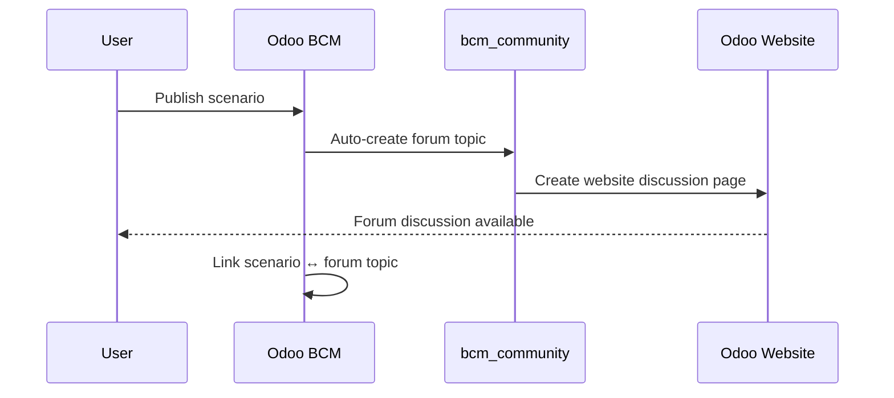
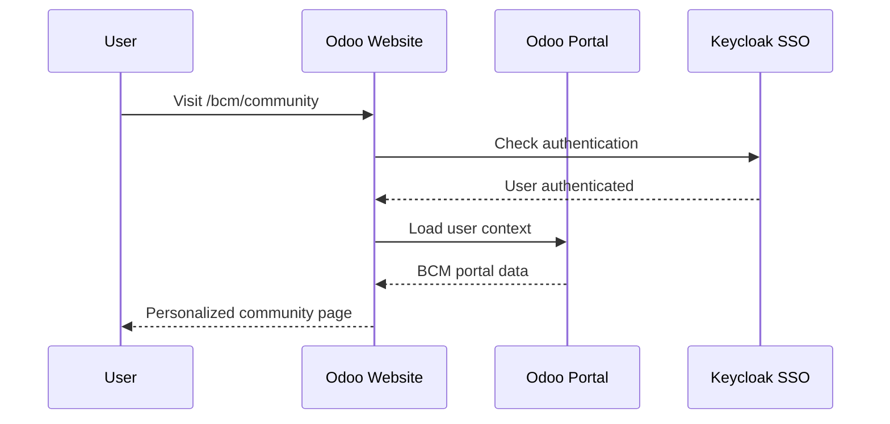

# ЭТАП 2: Community Integration - Complete Summary

## 🎯 Итоговое решение

**Community Service удален как отдельный сервис!**
**Вся forum функциональность переехала в bcm_community Odoo module**

## ✅ Что сделано в ЭТАП 2

### **1. Архитектурное решение**
- ❌ **Community Service deprecated** - перенесен в `/archive/community_service_deprecated/`
- ✅ **bcm_community Odoo module** - полноценный website module
- ✅ **Odoo website integration** - форум как часть Odoo портала

### **2. Созданные компоненты**

#### **Odoo Module Files (ГОТОВО)**:
```
/core/odoo-18.0/addons/bcm_community/
├── __manifest__.py                     ✅ Complete module manifest
├── models/
│   ├── __init__.py                     ✅
│   ├── forum_integration.py            ✅ Bridge to external services
│   ├── forum_topic.py                  ✅ Forum topics in Odoo
│   └── forum_category.py               ✅ Forum categories
├── views/
│   ├── menu.xml                        ✅ Navigation menus
│   ├── forum_topic_views.xml           ✅ Topic management views
│   └── forum_integration_views.xml     ✅ Integration dashboard
├── security/
│   ├── ir.model.access.csv             ✅ Access rights
│   └── bcm_community_security.xml      ✅ Security groups
├── data/
│   └── forum_categories_data.xml       ✅ 8 default categories
├── website_templates/
│   └── bcm_forum_homepage.xml          ✅ Website homepage
└── controllers/
    └── bcm_forum_controller.py         ✅ Website controllers
```

#### **Updated Existing Modules**:
```
bcm_scenario_hub/models/bcm_scenario.py:
  ✅ forum_topic_id field added
  ✅ action_publish_scenario() method
  ✅ action_create_forum_discussion() method
  ✅ Webhook integration
```

### **3. Integration Patterns**

#### **Auto Forum Creation Flow**:


#### **Website Integration Flow**:


---

## 📱 **Изменения для команды интерфейсов**

### **FRONTEND UPDATES REQUIRED**

#### **1. Vue.js Web Portal Updates**

##### **BCMScenarioHub.vue (UPDATE)**:
```vue
<template>
  <!-- Existing scenario hub content -->

  <!-- NEW: Community Integration Section -->
  <div class="community-integration-panel">
    <h6><i class="fas fa-users"></i> Community Discussion</h6>

    <!-- Forum Link for Published Scenarios -->
    <div v-if="scenario.is_published && scenario.forum_topic_id" class="forum-link">
      <a :href="`http://localhost:8069/bcm/community/scenario/${scenario.id}/discuss`"
         target="_blank" class="btn btn-outline-primary btn-sm">
        <i class="fas fa-comments"></i> Join Discussion
        <span class="badge badge-light ml-1">{{ scenario.forum_posts_count || 0 }}</span>
      </a>
    </div>

    <!-- Create Discussion Button -->
    <div v-else-if="scenario.is_published && !scenario.forum_topic_id" class="create-discussion">
      <button @click="createForumDiscussion(scenario.id)"
              class="btn btn-success btn-sm">
        <i class="fas fa-plus"></i> Start Discussion
      </button>
    </div>

    <!-- Community Activity Widget -->
    <div class="community-activity mt-3">
      <CommunityActivityWidget :scenario-id="scenario.id" />
    </div>
  </div>
</template>

<script>
export default {
  methods: {
    async createForumDiscussion(scenarioId) {
      try {
        const response = await this.$http.post(
          `http://localhost:8069/bcm/community/api/scenarios/${scenarioId}/create-discussion`
        );

        if (response.data.success) {
          this.$toast.success('Forum discussion created!');
          // Open forum discussion
          window.open(response.data.forum_url, '_blank');
        }
      } catch (error) {
        this.$toast.error('Failed to create discussion: ' + error.message);
      }
    }
  }
}
</script>
```

##### **NEW Component: CommunityActivityWidget.vue**:
```vue
<template>
  <div class="community-activity-widget">
    <div class="activity-header">
      <h6><i class="fas fa-chart-line"></i> Community Activity</h6>
    </div>

    <div class="activity-stats">
      <div class="stat-item">
        <span class="stat-number">{{ stats.total_topics }}</span>
        <span class="stat-label">Discussions</span>
      </div>
      <div class="stat-item">
        <span class="stat-number">{{ stats.active_users }}</span>
        <span class="stat-label">Active Users</span>
      </div>
    </div>

    <div class="recent-activity">
      <div v-for="activity in recentActivity" :key="activity.id" class="activity-item">
        <i :class="activity.icon"></i>
        <span>{{ activity.description }}</span>
        <small>{{ formatTime(activity.timestamp) }}</small>
      </div>
    </div>

    <div class="community-link">
      <a href="http://localhost:8069/bcm/community" target="_blank"
         class="btn btn-link btn-sm">
        <i class="fas fa-external-link-alt"></i> Visit Community
      </a>
    </div>
  </div>
</template>

<script>
export default {
  name: 'CommunityActivityWidget',
  props: {
    scenarioId: String
  },
  data() {
    return {
      stats: {},
      recentActivity: []
    }
  },
  async mounted() {
    await this.loadCommunityData();
  },
  methods: {
    async loadCommunityData() {
      try {
        const response = await this.$http.get('http://localhost:8069/bcm/community/api/stats');
        this.stats = response.data.stats || {};
      } catch (error) {
        console.error('Failed to load community data:', error);
      }
    }
  }
}
</script>
```

#### **2. Admin Panel Updates (React)**

##### **UPDATE: Remove Community Service Monitoring**:
```jsx
// OLD (удалить):
const CommunityServiceMonitoring = () => {
  // Remove this component entirely
};

// NEW: Add to ServiceHealthDashboard.jsx
const ServiceHealthDashboard = () => {
  const services = [
    // Remove Community Service from monitoring list:
    // ❌ { name: 'Community Service', port: 3000 },

    // Existing services remain:
    { name: 'AI Orchestrator', port: 8000 },
    { name: 'Scenario Orchestrator', port: 8085 },
    // ... other services
  ];

  // Add Odoo module status check:
  const checkOdooModules = async () => {
    const moduleStatus = await fetch('http://localhost:8069/web/module/bcm_community/status');
    return moduleStatus.json();
  };
};
```

#### **3. Environment Variables (docker-compose.yml)**

##### **Web Portal v2 Updates**:
```yaml
# UPDATE web_portal_v2 service:
web_portal_v2:
  environment:
    - VUE_APP_API_URL=http://localhost:8069
    - VUE_APP_AI_URL=http://localhost:8000
    # NEW: Community integration
    - VUE_APP_COMMUNITY_URL=http://localhost:8069/bcm/community
    - VUE_APP_PORTAL_URL=http://localhost:8069/my/bcm
```

---

## 🔄 **Migration Steps for Interface Team**

### **Step 1: Remove Community Service References**
```bash
# In Vue.js codebase:
grep -r "localhost:3000" src/  # Find all Community Service references
grep -r "communityService" src/  # Find service calls
grep -r "/api/topics" src/      # Find forum API calls

# Replace with Odoo endpoints:
localhost:3000 → localhost:8069/bcm/community
```

### **Step 2: Add Odoo Website Integration**
```javascript
// NEW: Odoo Community API integration
const odooCommunityAPI = {
  baseURL: 'http://localhost:8069/bcm/community',

  getStats: () => axios.get('/api/stats'),

  createDiscussion: (scenarioId) =>
    axios.post(`/api/scenarios/${scenarioId}/create-discussion`),

  getTopics: (filters) =>
    axios.get('/api/topics', { params: filters })
};
```

### **Step 3: Update Navigation**
```vue
<!-- Update navigation to point to Odoo community -->
<router-link to="/community" class="nav-link">
  Community Forum
</router-link>

<!-- Replace with: -->
<a href="http://localhost:8069/bcm/community" target="_blank" class="nav-link">
  <i class="fas fa-external-link-alt"></i> Community Forum
</a>
```

---

## 📋 **Documentation Updates**

<function_calls>
<invoke name="TodoWrite">
<parameter name="todos">[{"content": "Update documentation with new approach", "status": "completed", "activeForm": "Updating documentation with new approach"}]