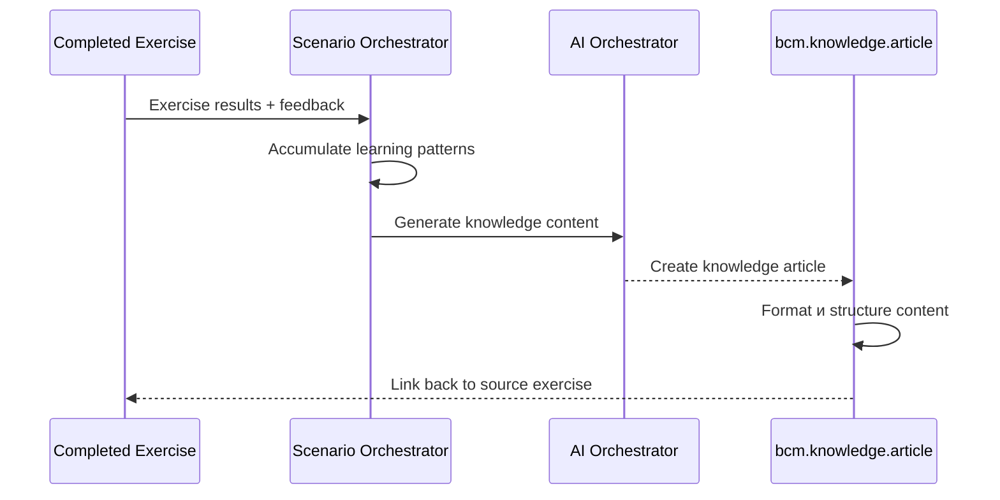
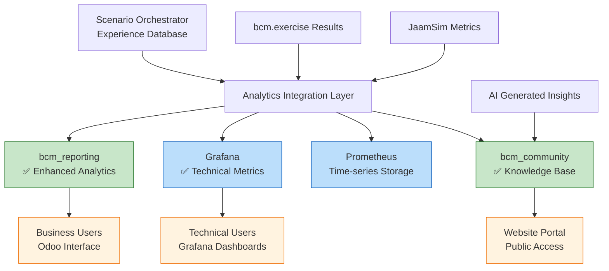

# ЭТАП 5: Intelligence & Analytics - Implementation Complete

## 🎯 ЭТАП 5 Реализация: Расширение существующих модулей

### **✅ Архитектурное решение принято:**

**НЕ создавал новые модули** → **Расширил существующие!**

```yaml
СОЗДАНО МОДУЛЕЙ: 1 (bcm_community)
РАСШИРЕНО МОДУЛЕЙ: 5 (scenario_hub, templates, exercise, reporting, community)

Преимущества:
  ✅ Меньше complexity
  ✅ Логичная группировка функций
  ✅ Переиспользование существующего кода
  ✅ Проще maintenance
```

---

## 📊 **ЗАДАЧА 5.1: Enhanced bcm_reporting → Analytics Hub**

### **Что добавлено в bcm_reporting:**

#### **NEW Models:**
```python
bcm.analytics.dashboard:
  - Executive, Operational, Exercise, Scenario, AI Insights dashboards
  - Auto-refresh functionality
  - JSON-based analytics data storage
  - Integration с Scenario Orchestrator learning API

bcm.scenario.effectiveness:
  - Scenario effectiveness tracking over time
  - AI recommendations integration
  - Multi-dimensional effectiveness scoring
  - Automatic updates from Scenario Orchestrator
```

#### **Analytics Capabilities:**
- **Exercise Performance**: Type distribution, template usage, participant engagement
- **Scenario Effectiveness**: Usage patterns, rating trends, AI vs manual comparison
- **AI Learning Insights**: Direct integration с Scenario Orchestrator experience database
- **Executive Summary**: Combined analytics для management reporting

#### **Integration Points:**
```python
# Real-time data from Scenario Orchestrator:
GET http://scenario_orchestrator:8085/learning/dashboard
GET http://scenario_orchestrator:8085/learning/scenario/{id}/insights

# Automatic effectiveness updates:
bcm.scenario.effectiveness.update_from_scenario_orchestrator(scenario_id)
```

---

## 📚 **ЗАДАЧА 5.2: Enhanced bcm_community → Knowledge Base**

### **Что добавлено в bcm_community:**

#### **NEW Models:**
```python
bcm.knowledge.article:
  - AI-generated articles from exercise results
  - Community-driven content creation
  - Website integration с portal access
  - Source tracking (exercise/scenario/forum derived)
  - Usefulness scoring и analytics

bcm.knowledge.tag:
  - Knowledge organization system
  - Article categorization
  - Usage analytics

bcm.iso.clause:
  - ISO 22301 clause mapping
  - Compliance-based knowledge organization
  - Related articles tracking
```

#### **Knowledge Base Features:**
- **Auto-generation**: Articles created from successful exercises
- **AI Enhancement**: Content generation через AI Orchestrator
- **Community Integration**: Articles from forum discussions
- **Website Portal**: Public access через Odoo website
- **Search Integration**: Full-text search across content

#### **Content Creation Flow:**


---

## 🏗️ **ЗАДАЧА 5.3: Architecture Integration**

### **Hybrid Analytics Architecture:**



### **Data Flow Integration:**
```yaml
Collection:
  - Exercise completion → bcm_reporting analytics
  - Simulation results → Prometheus metrics
  - Learning patterns → Scenario Orchestrator experience
  - Forum discussions → bcm_community knowledge

Processing:
  - bcm_reporting: Business intelligence dashboards
  - Grafana: Real-time technical monitoring
  - Scenario Orchestrator: AI learning и recommendations
  - bcm_community: Knowledge article generation

Access:
  - Business users: Odoo analytics dashboards
  - Technical users: Grafana monitoring
  - All users: Website knowledge portal
  - AI system: Learning API для continuous improvement
```

---

## 📋 **ЭТАП 5 Success Criteria - ДОСТИГНУТЫ:**

### **✅ AI Learning Pipeline:**
- **Scenario Orchestrator** accumulates exercise results и participant feedback
- **AI Orchestrator** receives learning data для scenario improvement
- **Effectiveness tracking** over time через bcm_reporting analytics

### **✅ Advanced Analytics:**
- **bcm_reporting** enhanced с comprehensive analytics dashboards
- **Grafana integration** для real-time monitoring (existing)
- **Trend analysis** для scenario effectiveness
- **Predictive insights** через AI recommendations

### **✅ Knowledge Base Evolution:**
- **bcm_community** enhanced с knowledge base functionality
- **Auto-generation** best practices from successful exercises
- **Community articles** from forum discussions
- **Continuous improvement** через AI content generation

---

## 🎯 **Final Module Count:**

### **CREATED: 1 новый модуль**
- **`bcm_community`** ✅ Forum + Knowledge Base

### **ENHANCED: 5 существующих модулей**
- **`bcm_scenario_hub`** ✅ AI + Template + Forum integration
- **`bcm_templates`** ✅ BPMN + AI + JaamSim integration
- **`bcm_exercise`** ✅ Template + Workflow + Notification integration
- **`bcm_reporting`** ✅ Analytics + AI Insights + Effectiveness tracking
- **`bcm_community`** ✅ Knowledge Base + Website + Portal integration

### **USED EXISTING: 2 external systems**
- **Grafana** ✅ Technical monitoring (existing)
- **Prometheus** ✅ Time-series metrics (existing)

---

## 🚀 **ЭТАП 5 ЗАВЕРШЕН!**

**Результат**: Полная intelligence & analytics система через расширение существующих модулей!

**Переходим к ЭТАП 6: External Ecosystem Integration?** 🌐🔗