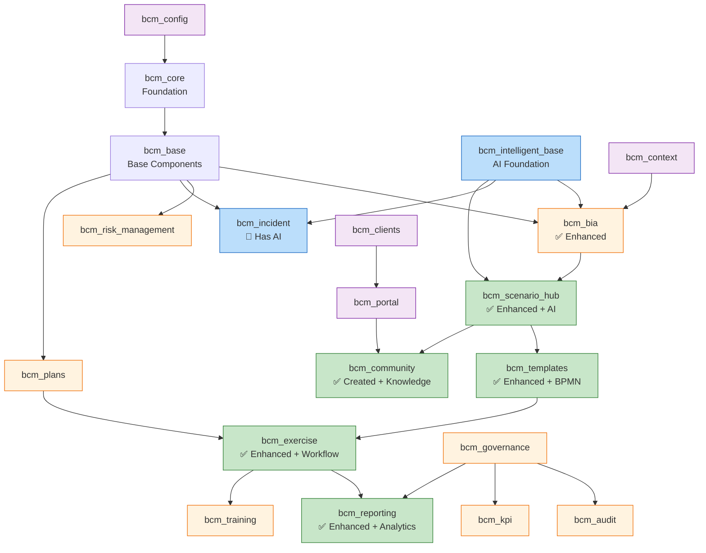

# BCM Platform - Deep Project Analysis

## 🔍 Comprehensive Project Audit

### **НАЙДЕННЫЕ КОМПОНЕНТЫ И ПРОПУСКИ:**

#### **✅ ОБНАРУЖЕНО: AnyLogic Integration**
```python
# В /adapters/simulation/app.py:
"""
Integrates with simulation engines for business continuity exercise automation:
- JaamSim for discrete event simulation
- AnyLogic PLE for system dynamics  # ← НАЙДЕНО!
- Custom simulation scenarios for BCM exercises
"""
```

**Статус**: Упомянуто в коде, но **НЕ РЕАЛИЗОВАНО**
**Возможность**: Добавить AnyLogic как второй simulation engine

#### **❓ MONACO Editor**
**Поиск**: Не найден в проекте
**Предположение**: Планировался для BPMN/code editing
**Возможность**: Добавить Monaco editor для:
- BPMN XML editing в templates
- JSON schema editing в forms
- Code editing для custom scripts

#### **❓ Digital Twin Repository**
**URL**: https://github.com/SEH-foundation/digital-twin.git (404)
**Статус**: Repository недоступен
**Возможность**: Воссоздать digital twin functionality

---

## 🏗️ MODULE DEPENDENCY ANALYSIS

### **Current Module Interconnections:**



### **🔍 DEPENDENCY GAPS IDENTIFIED:**

#### **❌ DISCONNECTED MODULES:**
```yaml
bcm_governance: Не связан с exercise/scenario workflow
bcm_audit: Изолирован от AI capabilities
bcm_kpi: Не интегрирован с analytics
bcm_training: Не связан с exercise results
bcm_clients: Не интегрирован с scenarios
bcm_context: Базовые возможности, можно расширить
```

#### **💡 INTEGRATION OPPORTUNITIES:**

**1. bcm_governance + bcm_exercise Integration:**
```python
# ADD to bcm_exercise:
governance_approval_required = fields.Boolean('Requires Governance Approval')
governance_approved_by = fields.Many2one('res.users', 'Approved by')
governance_approval_date = fields.Datetime('Approval Date')

# ADD to bcm_governance:
exercise_approvals = fields.One2many('bcm.exercise', 'governance_approval')
```

**2. bcm_audit + AI Integration:**
```python
# ENHANCE bcm_audit with AI:
ai_audit_assistant = fields.Boolean('AI Audit Assistant')
ai_finding_analysis = fields.Text('AI Finding Analysis')
ai_compliance_score = fields.Float('AI Compliance Score')
```

**3. bcm_kpi + Analytics Integration:**
```python
# CONNECT bcm_kpi with bcm_reporting analytics:
automated_kpi_calculation = fields.Boolean('Automated KPI')
ai_kpi_insights = fields.Text('AI KPI Insights')
scenario_effectiveness_kpi = fields.Float('Scenario Effectiveness KPI')
```

**4. bcm_training + Exercise Results:**
```python
# LINK bcm_training with exercise outcomes:
exercise_based_training = fields.Boolean('Exercise-based Training')
training_from_lessons = fields.Text('Training from Lessons Learned')
competency_gaps_identified = fields.Text('Competency Gaps from Exercises')
```

---

## 🔧 MISSING INTEGRATIONS IDENTIFIED

### **SIMULATION ENGINES:**

#### **AnyLogic Integration (Mentioned but Missing)**
```python
# В simulation adapter упомянуто, но не реализовано:
# - AnyLogic PLE for system dynamics
# Возможность: Добавить AnyLogic client рядом с JaamSim
```

#### **Monaco Editor (Missing)**
```javascript
// Предполагаемое использование:
// - BPMN XML editing в bcm_templates
// - JSON schema editing в forms
// - Custom script editing
```

### **ENTERPRISE FEATURES:**

#### **Digital Twin Capabilities (Repository 404)**
**Предполагаемые features:**
- Organization digital models
- Real-time business process mapping
- Virtual environment simulation
- Predictive business impact modeling

---

## 📊 MODULE ENHANCEMENT MATRIX

| Module | Current State | AI Integration | Analytics | Enhancement Potential |
|--------|--------------|---------------|-----------|---------------------|
| **bcm_core** | ✅ Foundation | ❌ None | ❌ None | 🔧 **Medium** - Add AI foundation |
| **bcm_bia** | ✅ Enhanced | ✅ Has AI Engine | ❌ Basic | 🚀 **HIGH** - Advanced AI + Digital Twin |
| **bcm_scenario_hub** | ✅ Enhanced | ✅ AI Generation | ✅ Analytics | 🔧 **Medium** - AnyLogic integration |
| **bcm_exercise** | ✅ Enhanced | ✅ BPMN + AI | ✅ Analytics | 🔧 **Medium** - Training integration |
| **bcm_incident** | ✅ Has AI | ✅ AI Actions | ❌ Basic | 🚀 **HIGH** - Full lifecycle + TheHive |
| **bcm_templates** | ✅ Enhanced | ✅ AI Generation | ❌ Basic | 🔧 **Medium** - Monaco editor |
| **bcm_governance** | ❌ Basic | ❌ None | ❌ None | 🚀 **HIGH** - AI compliance + workflow |
| **bcm_audit** | ❌ Basic | ❌ None | ❌ None | 🚀 **HIGH** - AI audit assistant |
| **bcm_kpi** | ❌ Basic | ❌ None | ❌ None | 🚀 **HIGH** - Automated KPI + AI insights |
| **bcm_training** | ❌ Basic | ❌ None | ❌ None | 🚀 **HIGH** - Exercise-based training |
| **bcm_clients** | ❌ Basic | ❌ None | ❌ None | 🚀 **HIGH** - Digital twin integration |
| **bcm_context** | ❌ Basic | ❌ None | ❌ None | 🚀 **HIGH** - Organization digital model |

---

## 🎯 **TOP ENHANCEMENT OPPORTUNITIES:**

### **HIGHEST IMPACT (🚀 HIGH):**

#### **1. bcm_bia → Digital Twin Integration**
```python
# MAJOR ENHANCEMENT:
class BCMDigitalTwin(models.Model):
    _name = 'bcm.digital.twin'
    _inherit = 'bcm.bia'  # Extend BIA с digital twin

    # Digital model components
    digital_model_data = fields.Text('Digital Model (JSON)')
    real_time_sync = fields.Boolean('Real-time Sync')
    twin_accuracy = fields.Float('Twin Accuracy %')

    # Virtual simulation
    virtual_impact_simulation = fields.Boolean('Virtual Impact Simulation')
    predictive_modeling = fields.Boolean('Predictive Modeling')

    # Organization modeling
    organizational_structure = fields.Text('Org Structure (JSON)')
    process_dependencies = fields.Text('Process Dependencies (JSON)')
    resource_allocation = fields.Text('Resource Allocation (JSON)')
```

#### **2. bcm_incident → Full Lifecycle Management**
```python
# MAJOR ENHANCEMENT (use existing AI base):
class BCMAdvancedIncident(models.Model):
    _inherit = 'bcm.incident'

    # Lifecycle management
    incident_timeline = fields.One2many('bcm.incident.timeline', 'incident_id')
    stakeholder_notifications = fields.One2many('bcm.incident.notification')

    # AI enhancement (build on existing)
    ai_impact_prediction = fields.Text('AI Impact Prediction')
    ai_recovery_timeline = fields.Text('AI Recovery Timeline')
    ai_resource_recommendations = fields.Text('AI Resource Recommendations')

    # External integration
    thehive_case_id = fields.Char('TheHive Case ID')
    misp_event_id = fields.Char('MISP Event ID')
    jira_ticket_id = fields.Char('Jira Ticket ID')
```

#### **3. bcm_governance → AI Compliance Engine**
```python
# TRANSFORM basic governance to AI-powered:
class BCMAIGovernance(models.Model):
    _name = 'bcm.ai.governance'
    _description = 'AI-Powered BCM Governance'

    # AI compliance monitoring
    ai_compliance_monitoring = fields.Boolean('AI Compliance Monitoring')
    compliance_score = fields.Float('AI Compliance Score')
    compliance_gaps = fields.Text('AI-Identified Gaps')

    # Automated policy management
    policy_auto_update = fields.Boolean('Auto Policy Updates')
    ai_policy_recommendations = fields.Text('AI Policy Recommendations')

    # Integration with other modules
    linked_exercises = fields.Many2many('bcm.exercise', 'Governed Exercises')
    linked_scenarios = fields.Many2many('bcm.scenario', 'Governed Scenarios')
```

---

## 🔧 **MISSING COMPONENTS IDENTIFIED:**

### **1. AnyLogic Integration** (mentioned but missing)
```yaml
Location: Should be in /integrations/exercise_simulators/
Current: Only JaamSim implemented
Missing: AnyLogic client и system dynamics simulation

Implementation Plan:
  - Add AnyLogic client class
  - System dynamics models для organization behavior
  - Integration с existing simulation bridge
```

### **2. Monaco Editor Integration**
```yaml
Purpose: Code/XML editing в web interface
Missing: Rich editing experience для:
  - BPMN XML в bcm_templates
  - JSON schemas в forms
  - Custom scripts в workflows

Implementation Plan:
  - Add Monaco editor widget для Odoo
  - BPMN syntax highlighting
  - JSON schema validation
```

### **3. Digital Twin Capabilities**
```yaml
Repository: https://github.com/SEH-foundation/digital-twin.git (404)
Missing: Organization digital modeling
Needed for: Real-time business impact simulation

Implementation Plan:
  - Recreate digital twin models
  - Organization structure mapping
  - Real-time data integration
  - Predictive impact analysis
```

---

## 📋 **FRONTEND READINESS для команды:**

### **✅ КОМАНДА МОЖЕТ РАБОТАТЬ ПАРАЛЛЕЛЬНО:**

#### **Existing Interfaces (минимальные изменения):**
- **BCMScenarioHub.vue** ✅ Уже обновлен командой
- **Admin Panel** ✅ Только additions, не breaking changes

#### **New Interfaces (основная работа):**
- **AI Generation Wizards** - полностью новые компоненты
- **Analytics Dashboards** - новые Odoo views + Vue.js charts
- **Knowledge Base Portal** - новый website
- **Simulation Controls** - новые Vue.js компоненты

### **🎯 РЕКОМЕНДАЦИЯ для команды:**

**КОМАНДА МОЖЕТ НАЧИНАТЬ ПРЯМО СЕЙЧАС** с новыми компонентами, пока мы:
1. **Анализируем missing integrations**
2. **Добавляем AnyLogic + Monaco + Digital Twin**
3. **Усиливаем module interconnections**

---

## 🚀 **FOLLOWING PHASES PROPOSED:**

### **ANALYSIS PHASE 1: Система connectivity**
- Глубокий анализ module dependencies
- Выявление integration gaps
- Enhancement opportunities mapping
- Missing component identification

### **ANALYSIS PHASE 2: Digital Twin Integration**
- Воссоздание digital twin capabilities
- Organization modeling system
- Real-time business process mapping
- Predictive impact simulation

### **ENHANCEMENT PHASE: Module Powerup**
- bcm_governance → AI compliance engine
- bcm_audit → AI audit assistant
- bcm_kpi → Automated analytics
- bcm_training → Exercise-based learning
- AnyLogic + Monaco integration

---

**Продолжать анализ или команда может уже начинать frontend work?** 🤔🎨