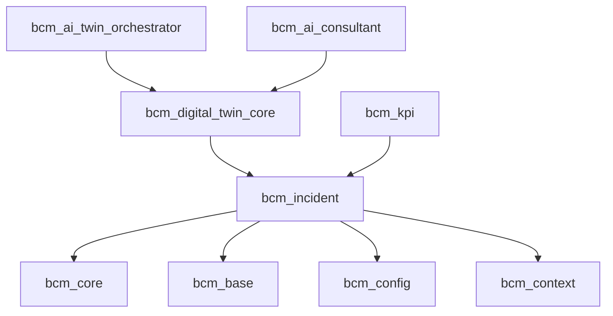

# 📋 **ОБНОВЛЕНИЕ ТЕХНИЧЕСКОЙ СПЕЦИФИКАЦИИ**
## **BCM PLATFORM - ИЗМЕНЕНИЯ ПОСЛЕ ИНТЕГРАЦИИ**

---

## **🚨 КРИТИЧЕСКИЕ ИЗМЕНЕНИЯ ДЛЯ FRONTEND КОМАНДЫ:**

### **1. ИЗМЕНЕНИЯ В МОДУЛЯХ ODOO**

#### **❌ УДАЛЕННЫЕ МОДУЛИ (больше НЕ существуют):**
```javascript
// ЭТИ МОДУЛИ БЫЛИ ОБЪЕДИНЕНЫ И БОЛЬШЕ НЕ СУЩЕСТВУЮТ:
const DELETED_MODULES = [
  'bcm_incident_management',  // → объединен в bcm_incident
  'bcm_foundation'            // → разделен на bcm_base, bcm_config, bcm_context
]
```

#### **✅ АКТУАЛЬНАЯ СТРУКТУРА BCM МОДУЛЕЙ:**
```javascript
const CURRENT_BCM_MODULES = {
  // Основные модули
  'bcm_incident': 'Unified Incident Management (включает bcm_incident_management)',
  'bcm_core': 'Core BCM Infrastructure',
  'bcm_base': 'Base BCM Module',
  'bcm_config': 'BCM Configuration',
  'bcm_context': 'BCM Organization Context',

  // AI модули
  'bcm_ai_consultant': 'AI Consultant',
  'bcm_ai_control': 'AI Control Center',
  'bcm_ai_twin_orchestrator': 'AI Twin Orchestrator',

  // Digital Twin модули
  'bcm_digital_twin_core': 'Digital Twin Core',
  'bcm_digital_copy_manager': 'Digital Copy Manager',
  'bcm_corporate_twin': 'Corporate Digital Twin',

  // Функциональные модули
  'bcm_audit': 'Audit Management',
  'bcm_bia': 'Business Impact Analysis',
  'bcm_clients': 'Client Management',
  'bcm_community': 'Community & Knowledge',
  'bcm_exercise': 'Exercise Management',
  'bcm_governance': 'Governance & Compliance',
  'bcm_intelligent_base': 'Intelligent Base Layer',
  'bcm_kpi': 'KPI Management',
  'bcm_plans': 'Business Continuity Plans',
  'bcm_reporting': 'Reporting & Analytics',
  'bcm_risk_management': 'Risk Management',
  'bcm_scenario_hub': 'Scenario Hub',
  'bcm_templates': 'Template Management',
  'bcm_training': 'Training Management',
  'bcm_web_portal': 'Web Portal Integration'
}
```

---

## **🔄 API ENDPOINTS - КРИТИЧЕСКИЕ ИЗМЕНЕНИЯ:**

### **❌ СТАРЫЕ ENDPOINTS (НЕ РАБОТАЮТ):**
```typescript
// НЕ ИСПОЛЬЗУЙТЕ ЭТИ ENDPOINTS:
const DEPRECATED_API = {
  incidents: '/api/bcm_incident_management/*',  // УДАЛЕН
  foundation: '/api/bcm_foundation/*'           // УДАЛЕН
}
```

### **✅ НОВЫЕ ENDPOINTS:**
```typescript
// ИСПОЛЬЗУЙТЕ ЭТИ ENDPOINTS:
const UPDATED_API = {
  // Incident Management - НОВЫЙ unified endpoint
  incidents: {
    base: '/api/bcm_incident',
    list: '/api/bcm_incident/incidents',
    create: '/api/bcm_incident/create',
    update: '/api/bcm_incident/update',
    delete: '/api/bcm_incident/delete',

    // AI функции
    aiClassify: '/api/bcm_incident/ai/classify',
    aiRecommend: '/api/bcm_incident/ai/recommend',

    // Digital Twin интеграция
    simulate: '/api/bcm_incident/simulation/run',
    syncDigitalTwin: '/api/bcm_incident/digital_twin/sync',

    // Integration API
    hooks: '/api/bcm_incident/integration/hooks',
    externalSync: '/api/bcm_incident/integration/sync'
  },

  // Base/Config/Context - РАЗДЕЛЕННЫЕ endpoints
  configuration: {
    base: '/api/bcm_base',
    config: '/api/bcm_config',
    context: '/api/bcm_context'
  }
}
```

---

## **🏗️ АРХИТЕКТУРНЫЕ ИЗМЕНЕНИЯ:**

### **1. INCIDENT MANAGEMENT SECTION - ПОЛНАЯ ПЕРЕСТРОЙКА**

```typescript
// app/sections/incident-management/page.tsx
export default function IncidentManagementSection() {
  // ВАЖНО: bcm_incident теперь включает ВСЕ функции
  const API_BASE = '/api/bcm_incident'  // НЕ bcm_incident_management!

  return (
    <SectionLayout
      title="Unified Incident & Crisis Management"
      relatedModules={[
        '/modules/incidents',     // UI модуль
        'bcm_incident',           // Backend - unified модуль
        'bcm_exercise',           // Exercises
        'bcm_digital_twin_core'   // Digital Twin симуляции
      ]}
    >
      <Tabs defaultValue="incidents">
        <TabsContent value="incidents">
          <UnifiedIncidentManagement />  {/* НОВЫЙ компонент */}
        </TabsContent>
        <TabsContent value="ai-commander">
          <AICommander />  {/* НОВЫЙ - AI управление инцидентами */}
        </TabsContent>
        <TabsContent value="digital-simulation">
          <DigitalTwinSimulation />  {/* НОВЫЙ - симуляции */}
        </TabsContent>
      </Tabs>
    </SectionLayout>
  )
}
```

### **2. НОВЫЙ UnifiedIncidentManagement КОМПОНЕНТ**

```typescript
// components/incidents/UnifiedIncidentManagement.tsx
import { useIncidentIntegrationAPI } from '@/hooks/useIncidentIntegrationAPI'

export function UnifiedIncidentManagement() {
  // Используем новый Integration API
  const {
    registerHook,
    getIncidentData,
    triggerSimulation,
    syncWithExternalSystem,
    getAIRecommendations
  } = useIncidentIntegrationAPI()

  // Регистрируем hooks при монтировании
  useEffect(() => {
    registerHook('frontend', 'on_create', handleIncidentCreated)
    registerHook('frontend', 'on_escalate', handleIncidentEscalated)
  }, [])

  return (
    <div className="space-y-6">
      {/* AI Commander Panel */}
      <AICommanderPanel
        onClassify={handleAIClassification}
        onRecommend={getAIRecommendations}
      />

      {/* Digital Twin Integration */}
      <DigitalTwinIntegrationPanel
        onSimulate={triggerSimulation}
        onSync={syncWithExternalSystem}
      />

      {/* Main Incident Grid */}
      <IncidentGrid
        apiEndpoint="/api/bcm_incident/incidents"
        features={[
          'ai-classification',
          'digital-twin-sync',
          'external-integration',
          'mobile-response',
          'gps-tracking'
        ]}
      />
    </div>
  )
}
```

---

## **🔌 ИНТЕГРАЦИИ С DIGITAL TWIN:**

### **ВАЖНО: Digital Twin теперь центральный коллектор данных**

```typescript
// hooks/useDigitalTwinIntegration.ts
export function useDigitalTwinIntegration() {
  // Digital Twin "пылесосит" данные из всех модулей
  const syncIncidentWithDigitalTwin = async (incidentId: number) => {
    // Автоматическая синхронизация
    const response = await fetch('/api/bcm_incident/integration/sync', {
      method: 'POST',
      body: JSON.stringify({
        incident_id: incidentId,
        system_type: 'digital_twin'
      })
    })

    return response.json()
  }

  // Запуск симуляции кризиса
  const runCrisisSimulation = async (incidentId: number) => {
    const response = await fetch('/api/bcm_incident/simulation/run', {
      method: 'POST',
      body: JSON.stringify({ incident_id: incidentId })
    })

    return response.json()
  }

  return { syncIncidentWithDigitalTwin, runCrisisSimulation }
}
```

---

## **📊 ЗАВИСИМОСТИ МОДУЛЕЙ (ОБНОВЛЕНО):**



---

## **⚠️ BREAKING CHANGES:**

1. **bcm_incident_management больше НЕ существует**
   - Все ссылки заменить на `bcm_incident`
   - API endpoints изменены

2. **bcm_foundation разделен на 3 модуля**
   - Использовать `bcm_base`, `bcm_config`, `bcm_context`

3. **Новый Integration API в bcm_incident**
   - Поддержка hooks для событий
   - Интеграция с Digital Twin
   - Синхронизация с внешними системами

---

## **✅ ПРОВЕРКА ГОТОВНОСТИ:**

### **Frontend команда должна:**

1. **Обновить все API вызовы:**
   ```typescript
   // Было
   await fetch('/api/bcm_incident_management/incidents')

   // Стало
   await fetch('/api/bcm_incident/incidents')
   ```

2. **Добавить поддержку Digital Twin:**
   - Кнопка "Run Simulation" для инцидентов
   - Панель синхронизации с Digital Twin
   - Визуализация результатов симуляций

3. **Использовать Integration Hooks:**
   ```typescript
   // Регистрация обработчиков событий
   registerHook('frontend', 'on_create', handleIncidentCreated)
   registerHook('frontend', 'on_update', handleIncidentUpdated)
   registerHook('frontend', 'on_close', handleIncidentClosed)
   ```

4. **Обновить навигацию:**
   - Убрать ссылки на старые модули
   - Добавить новые разделы для unified функций

---

## **🚀 ПРЕИМУЩЕСТВА НОВОЙ АРХИТЕКТУРЫ:**

1. **Полная интеграция с AI:**
   - AI Commander встроен в incident management
   - Автоматические рекомендации
   - Интеллектуальная классификация

2. **Digital Twin как центр данных:**
   - Все модули синхронизируются с Digital Twin
   - Возможность симуляций кризисов
   - 3D визуализация организации

3. **Расширяемость через hooks:**
   - Любой модуль может подписаться на события
   - Внешние системы легко интегрируются
   - Поддержка TheHive, ServiceNow, Jira

4. **Backward compatibility:**
   - Migration скрипты для старых данных
   - Wrapper методы для совместимости

---

## **📝 КОНТРОЛЬНЫЙ ЧЕКЛИСТ:**

- [ ] Все API endpoints обновлены на bcm_incident
- [ ] Удалены ссылки на bcm_incident_management
- [ ] Добавлена интеграция с Digital Twin
- [ ] Реализованы Integration Hooks
- [ ] Обновлена навигация и routing
- [ ] Добавлены новые AI компоненты
- [ ] Протестирована миграция данных
- [ ] Обновлена документация

---

## **📞 КОНТАКТЫ ДЛЯ ВОПРОСОВ:**

При возникновении вопросов по интеграции:
1. Проверить Integration API документацию в `bcm_incident/models/bcm_incident_integration_api.py`
2. Использовать migration скрипты из `bcm_incident/migration/`
3. Смотреть примеры в `bcm_incident/demo/`

---

**Дата обновления:** 2024-09-18
**Версия:** 2.0 (после unified интеграции)
**Статус:** CRITICAL UPDATE - требует немедленного внедрения