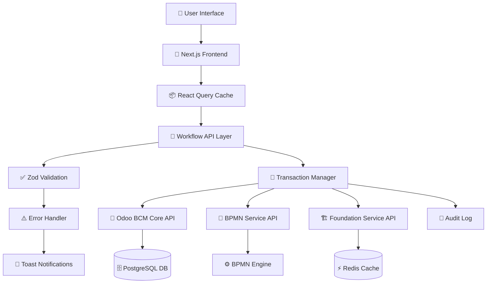

# 📋 **WORKFLOW MANAGEMENT - USER SCENARIOS & DATA FLOWS**

> **Шаблон документации пользовательских сценариев и потоков данных**
> Версия: 1.0 | Дата: 2025-01-18 | Модуль: Workflow Management

---

## 🎯 **OVERVIEW - ОБЗОР МОДУЛЯ**

### **Назначение модуля:**
Workflow Management - центральный модуль для управления бизнес-процессами, их автоматизации и мониторинга в рамках системы BCM (Business Continuity Management).

### **Ключевые возможности:**
- 📊 **Dashboard** - мониторинг метрик и активных workflow
- 🎨 **BPMN Designer** - визуальное моделирование бизнес-процессов
- ⚙️ **Process Management** - управление жизненным циклом процессов
- 🤖 **Automation Center** - настройка правил автоматизации

### **Интеграции:**
- **Odoo BCM Core** - основная база данных процессов
- **BPMN Service** - движок выполнения BPMN диаграмм
- **Foundation Service** - базовая функциональность BCM
- **Notification Service** - уведомления и алерты

---

## 👥 **USER ROLES & PERMISSIONS - РОЛИ И ПРАВА ДОСТУПА**

### **🔐 Матрица ролей:**

| Роль | Dashboard | BPMN Designer | Process Management | Automation Center |
|------|-----------|---------------|-------------------|-------------------|
| **BCM Manager** | ✅ Full | ✅ Full | ✅ Full | ✅ Full |
| **Process Owner** | ✅ Read | ✅ Edit Own | ✅ Edit Own | ✅ View Own |
| **BCM Coordinator** | ✅ Read | ✅ Read | ✅ Create/Edit | ✅ Read |
| **Department Head** | ✅ Dept Only | ❌ No Access | ✅ Dept Only | ❌ No Access |
| **Regular User** | ✅ Read Only | ❌ No Access | ✅ View Own | ❌ No Access |

### **🎭 Детальные права доступа:**

#### **BCM Manager (Менеджер BCM)**
```typescript
permissions: {
  dashboard: ['view_all_metrics', 'export_reports'],
  bpmn: ['create', 'edit', 'delete', 'export', 'simulate'],
  processes: ['create', 'edit', 'delete', 'archive', 'assign_owners'],
  automation: ['create', 'edit', 'delete', 'execute', 'view_logs']
}
```

#### **Process Owner (Владелец процесса)**
```typescript
permissions: {
  dashboard: ['view_own_metrics'],
  bpmn: ['create_own', 'edit_own', 'view_related'],
  processes: ['edit_own', 'update_status', 'add_stakeholders'],
  automation: ['view_own', 'request_changes']
}
```

---

## 📖 **USER STORIES - ПОЛЬЗОВАТЕЛЬСКИЕ СЦЕНАРИИ**

### **🎯 Epic 1: Process Lifecycle Management**

#### **Story 1.1: Создание нового бизнес-процесса**
```gherkin
Как BCM Manager
Я хочу создать новый бизнес-процесс
Чтобы документировать критически важные операции компании

Acceptance Criteria:
✅ Форма содержит все обязательные поля (название, описание, владелец, RTO/RPO)
✅ Валидация RTO >= RPO в реальном времени
✅ Возможность добавления stakeholders
✅ Автоматическое присвоение уникального ID
✅ Уведомление назначенному владельцу процесса
```

**🔄 Пошаговый сценарий:**
1. **Вход в раздел** → Process Management → "Create New Process"
2. **Заполнение формы:**
   - Название процесса (обязательно)
   - Категория (BCP/Incident/Training/Audit/Governance)
   - Описание и цель процесса
   - Владелец процесса и департамент
   - Критичность (Low/Medium/High/Critical)
   - RTO (Recovery Time Objective) и RPO (Recovery Point Objective)
   - Список заинтересованных сторон
3. **Валидация в реальном времени** → проверка бизнес-правил
4. **Сохранение** → автоматическое создание в Odoo BCM Core
5. **Уведомления** → отправка владельцу и stakeholders

#### **Story 1.2: BPMN моделирование процесса**
```gherkin
Как Process Owner
Я хочу создать BPMN диаграмму для своего процесса
Чтобы визуализировать последовательность действий и принятия решений

Acceptance Criteria:
✅ Drag-and-drop редактор BPMN элементов
✅ Валидация диаграммы на корректность
✅ Связывание с существующим бизнес-процессом
✅ Экспорт в XML/SVG/PNG форматы
✅ Симуляция выполнения workflow
```

**🔄 Пошаговый сценарий:**
1. **Переход к BPMN Designer** из контекста процесса
2. **Создание диаграммы:**
   - Start Event → добавление точки начала
   - Tasks → определение действий и активностей
   - Gateways → логика принятия решений
   - End Events → завершение процесса
3. **Настройка свойств** каждого элемента
4. **Валидация** → проверка на полноту и корректность
5. **Сохранение и связывание** с бизнес-процессом
6. **Симуляция** → тестирование логики выполнения

#### **Story 1.3: Автоматизация процесса**
```gherkin
Как BCM Coordinator
Я хочу настроить автоматические действия для процесса
Чтобы минимизировать ручное вмешательство при инцидентах

Acceptance Criteria:
✅ Триггеры на основе событий (время, статус, метрики)
✅ Действия (уведомления, создание задач, обновление статуса)
✅ Условная логика выполнения правил
✅ Логирование всех автоматических действий
✅ Возможность отключения/включения правил
```

### **🎯 Epic 2: Monitoring & Analytics**

#### **Story 2.1: Мониторинг активных workflow**
```gherkin
Как BCM Manager
Я хочу видеть статус всех активных workflow в реальном времени
Чтобы быстро реагировать на проблемы и узкие места

Acceptance Criteria:
✅ Dashboard с ключевыми метриками
✅ Список активных процессов с фильтрацией
✅ Индикаторы производительности (SLA, время выполнения)
✅ Алерты при превышении пороговых значений
✅ Drill-down в детали конкретного workflow
```

#### **Story 2.2: Анализ эффективности процессов**
```gherkin
Как Department Head
Я хочу анализировать эффективность процессов моего департамента
Чтобы выявлять возможности для улучшения

Acceptance Criteria:
✅ Фильтрация по департаменту/владельцу
✅ Метрики времени выполнения и соблюдения SLA
✅ Сравнение с историческими данными
✅ Экспорт отчетов в Excel/PDF
✅ Визуализация трендов и аномалий
```

---

## 🔄 **DATA FLOWS - ПОТОКИ ДАННЫХ**

### **📊 Архитектура потоков данных:**



### **🗂️ Основные модели данных:**

#### **BusinessProcess (Бизнес-процесс)**
```typescript
interface BusinessProcess {
  id: string                    // Уникальный идентификатор
  name: string                  // Название процесса
  description: string           // Описание и цель
  category: ProcessCategory     // Категория (BCP/Incident/etc)
  status: ProcessStatus         // Статус (draft/active/archived)
  owner: string                 // Владелец процесса
  department: string            // Департамент
  stakeholders: string[]        // Заинтересованные стороны
  complexity: Complexity        // Сложность (low/medium/high)
  criticality: Criticality      // Критичность
  rto: string                   // Recovery Time Objective
  rpo: string                   // Recovery Point Objective
  version: string               // Версия процесса
  createdAt: Date              // Дата создания
  lastModified: Date           // Последнее изменение
  bpmnDiagramId?: string       // Связанная BPMN диаграмма
  automationRules?: string[]   // Правила автоматизации
}
```

#### **BPMNDiagram (BPMN диаграмма)**
```typescript
interface BPMNDiagram {
  id: string                    // Уникальный идентификатор
  name: string                  // Название диаграммы
  processId: string             // Связанный бизнес-процесс
  xmlContent: string            // BPMN XML содержимое
  version: string               // Версия диаграммы
  isValid: boolean              // Результат валидации
  validationErrors?: string[]   // Ошибки валидации
  lastModified: Date           // Последнее изменение
  createdBy: string            // Автор диаграммы
}
```

#### **AutomationRule (Правило автоматизации)**
```typescript
interface AutomationRule {
  id: string                    // Уникальный идентификатор
  name: string                  // Название правила
  processId: string             // Связанный процесс
  trigger: AutomationTrigger    // Условие срабатывания
  actions: AutomationAction[]   // Список действий
  isActive: boolean             // Включено/выключено
  executionCount: number        // Количество выполнений
  lastExecuted?: Date          // Последнее выполнение
  createdBy: string            // Автор правила
}
```

### **🚀 Типичные потоки данных:**

#### **Поток 1: Создание процесса с BPMN**
```
1. [Frontend] Заполнение формы CreateProcessForm
   ↓ (Zod validation)
2. [API] processManagementApi.createProcessWithWorkflow()
   ↓ (Transaction начало)
3. [Odoo API] POST /api/bcm/processes → создание процесса
   ↓ (Success)
4. [BPMN API] POST /api/bpmn/diagrams → создание диаграммы
   ↓ (Success)
5. [Foundation API] POST /api/notifications → уведомления
   ↓ (Transaction commit)
6. [React Query] Обновление кэша + UI update
   ↓
7. [User] Toast уведомление об успехе
```

#### **Поток 2: Мониторинг активных workflow**
```
1. [Frontend] WorkflowDashboard component mount
   ↓
2. [React Query] useWorkflowMetrics() hook
   ↓ (Cache check)
3. [API] workflowDashboardApi.getMetrics()
   ↓ (Parallel requests)
4. [Odoo API] GET /api/bcm/processes/active
   [BPMN API] GET /api/bpmn/instances/running
   [Foundation API] GET /api/metrics/performance
   ↓ (Data aggregation)
5. [Frontend] Dashboard обновление в реальном времени
   ↓ (WebSocket/polling каждые 30 сек)
6. [User] Актуальные метрики и статусы
```

#### **Поток 3: Обработка ошибок**
```
1. [API Call] Любой запрос к backend
   ↓ (Network/validation/business error)
2. [Error Handler] WorkflowApiError classification
   ↓ (Error type определение)
3. [Retry Logic] Условные повторы (network errors only)
   ↓ (Max retries reached)
4. [React Query] Error state + user notification
   ↓
5. [Frontend] Error boundary + recovery options
   ↓
6. [User] Понятное сообщение об ошибке + action buttons
```

---

## 🔗 **COMPONENT INTERACTIONS - ВЗАИМОДЕЙСТВИЕ КОМПОНЕНТОВ**

### **🎨 Frontend Architecture:**

```
📱 WorkflowManagementPage
├── 📊 WorkflowDashboard
│   ├── MetricsCards (KPI display)
│   ├── ActiveWorkflowsList (real-time)
│   └── PerformanceCharts (analytics)
├── 🎯 BPMNDesigner
│   ├── BPMNCanvas (visual editor)
│   ├── ElementPalette (drag-and-drop)
│   ├── PropertiesPanel (configuration)
│   └── ValidationPanel (errors/warnings)
├── ⚙️ ProcessManagement
│   ├── ProcessList (filterable table)
│   ├── CreateProcessForm (validated form)
│   ├── ProcessDetails (view/edit)
│   └── ProcessHistory (audit trail)
└── 🤖 AutomationCenter
    ├── RulesList (automation rules)
    ├── CreateRuleForm (trigger/action)
    ├── RuleExecution (manual/auto)
    └── ExecutionLogs (history)
```

### **🔧 API Services Layer:**

```typescript
// Centralized API management
export const workflowServices = {
  dashboard: workflowDashboardApi,     // Metrics & monitoring
  processes: processManagementApi,     // CRUD operations
  bpmn: bpmnDesignerApi,              // Diagram management
  automation: automationApi,           // Rules & execution
  integration: integrationApi,         // Service status
  templates: workflowTemplatesApi      // Predefined templates
}

// Transaction-safe operations
export const transactionOperations = {
  createProcessWithWorkflow,           // Process + BPMN + Rules
  updateProcessAndDiagram,            // Coordinated updates
  archiveProcessAndCleanup,           // Safe archival
  deployWorkflowToProduction          // Full deployment
}
```

---

## 🚨 **ERROR SCENARIOS - СЦЕНАРИИ ОШИБОК**

### **🔴 Критические ошибки:**

#### **Сценарий 1: Сбой при создании процесса**
```
Trigger: Сетевая ошибка во время создания BPMN диаграммы
Response:
1. Автоматический rollback созданного процесса
2. Сохранение draft данных в localStorage
3. Предложение пользователю восстановить данные
4. Логирование ошибки для мониторинга
```

#### **Сценарий 2: Нарушение бизнес-правил**
```
Trigger: RTO меньше RPO при создании процесса
Response:
1. Предотвращение отправки формы
2. Подсветка некорректных полей
3. Информативное сообщение об ошибке
4. Предложение автоматической коррекции
```

#### **Сценарий 3: Недоступность backend сервисов**
```
Trigger: Odoo BCM Core недоступен
Response:
1. Graceful degradation UI (offline mode)
2. Кэширование действий для последующей синхронизации
3. Уведомление о режиме offline
4. Автоматическое восстановление при восстановлении связи
```

---

## 📋 **INTEGRATION DEPENDENCIES - ИНТЕГРАЦИОННЫЕ ЗАВИСИМОСТИ**

### **🔗 Backend Services:**

| Service | Purpose | API Endpoints | Data Flow |
|---------|---------|---------------|-----------|
| **Odoo BCM Core** | Основная БД процессов | `/api/bcm/processes/*` | CRUD операции |
| **BPMN Service** | Выполнение workflow | `/api/bpmn/engine/*` | Диаграммы и симуляция |
| **Foundation Service** | Базовая функциональность | `/api/foundation/*` | Уведомления, логи |
| **Notification Service** | Алерты и уведомления | `/api/notifications/*` | Push/Email/SMS |

### **📊 Data Synchronization:**

```typescript
// Стратегии синхронизации данных
export const syncStrategies = {
  realTime: ['active_workflows', 'automation_execution'],     // WebSocket
  polling: ['metrics', 'performance_data'],                   // 30 сек
  onDemand: ['process_details', 'bpmn_diagrams'],            // User action
  cached: ['templates', 'user_preferences']                   // 10 мин
}
```

### **🔄 Event-Driven Updates:**

```typescript
// События для межкомпонентной коммуникации
export const workflowEvents = {
  'process.created': (processId) => refreshDashboard(),
  'bpmn.validated': (diagramId) => updateValidationStatus(),
  'automation.executed': (ruleId) => logExecution(),
  'workflow.completed': (instanceId) => updateMetrics()
}
```

---

## 📈 **PERFORMANCE CONSIDERATIONS - ПРОИЗВОДИТЕЛЬНОСТЬ**

### **⚡ Оптимизации:**

1. **React Query Caching**
   - Стратегии кэширования для разных типов данных
   - Intelligent invalidation при изменениях
   - Background refetching для актуальности

2. **Pagination & Virtualization**
   - Пагинация списков процессов (20 элементов на странице)
   - Виртуализация больших BPMN диаграмм
   - Lazy loading компонентов

3. **Optimistic Updates**
   - Мгновенный UI отклик при создании/изменении
   - Rollback при ошибках backend
   - Conflict resolution для concurrent edits

### **📊 Метрики производительности:**

```typescript
export const performanceTargets = {
  pageLoad: '<2 секунд',           // Первая загрузка страницы
  apiResponse: '<500ms',           // Отклик backend API
  formValidation: '<100ms',        // Валидация в реальном времени
  dashboardRefresh: '<1 секунда',  // Обновление метрик
  bpmnRendering: '<3 секунд'       // Отрисовка сложных диаграмм
}
```

---

## 🎯 **SUCCESS METRICS - МЕТРИКИ УСПЕХА**

### **👤 User Experience:**
- **Task Completion Rate**: >95% успешных создания процессов
- **Time to Create Process**: <5 минут для стандартного процесса
- **Error Recovery Rate**: >90% успешных восстановлений после ошибок
- **User Satisfaction**: >4.5/5 в опросах пользователей

### **🔧 Technical Performance:**
- **API Success Rate**: >99.5% успешных запросов
- **Transaction Success Rate**: >99.9% транзакций без data corruption
- **Cache Hit Rate**: >85% запросов обслуживаются из кэша
- **Validation Success Rate**: >98% предотвращения некорректных данных

---

## 📚 **TEMPLATE USAGE - ИСПОЛЬЗОВАНИЕ ШАБЛОНА**

### **🔄 Адаптация для других модулей:**

1. **Замените секции:**
   - OVERVIEW → описание вашего модуля
   - USER ROLES → роли специфичные для модуля
   - USER STORIES → сценарии вашего функционала

2. **Обновите модели данных:**
   - Замените BusinessProcess на ваши основные сущности
   - Добавьте специфичные интерфейсы и типы

3. **Адаптируйте потоки данных:**
   - Укажите ваши API endpoints
   - Обновите диаграммы взаимодействия компонентов

4. **Настройте метрики:**
   - Определите KPI специфичные для вашего домена
   - Установите целевые значения производительности

### **✅ Чек-лист для каждого модуля:**
- [ ] Описаны все пользовательские роли и права доступа
- [ ] Задокументированы основные User Stories с Acceptance Criteria
- [ ] Определены потоки данных и API интеграции
- [ ] Созданы диаграммы взаимодействия компонентов
- [ ] Описаны сценарии обработки ошибок
- [ ] Указаны зависимости от других сервисов
- [ ] Определены метрики производительности и успеха

---

**📝 Документ создан:** 2025-01-18
**👤 Автор:** Claude AI Assistant
**🔄 Версия:** 1.0 - Шаблон для документации модулей BCM платформы