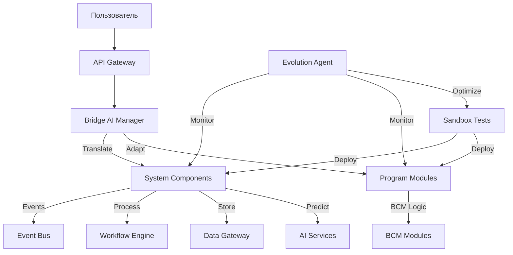

# 🏗️ ФИНАЛЬНАЯ АРХИТЕКТУРА COGNITIVE ORCHESTRATION SYSTEM

## 🎯 КОНЦЕПЦИЯ: ИНТЕЛЛЕКТУАЛЬНАЯ САМОЭВОЛЮЦИОНИРУЮЩАЯ СИСТЕМА

```
┌─────────────────────────────────────────────────────────────────┐
│                         SANDBOX LAYER                            │
│            🧪 Песочница для эволюции и экспериментов            │
│  ┌──────────────────────────────────────────────────────────┐  │
│  │  Evolution Agent: Анализ → Эксперименты → Оптимизация    │  │
│  └──────────────────────────────────────────────────────────┘  │
└─────────────────────────────────────────────────────────────────┘
                                ↕️
┌─────────────────────────────────────────────────────────────────┐
│                      PROGRAM COMPONENTS                          │
│                   📦 Бизнес-модули (BCM, etc)                   │
│  ┌─────────┐ ┌─────────┐ ┌─────────┐ ┌─────────┐              │
│  │   BCM   │ │  Cyber  │ │ Quality │ │  Pizza  │              │
│  │ Modules │ │ Modules │ │ Modules │ │ Modules │              │
│  └─────────┘ └─────────┘ └─────────┘ └─────────┘              │
└─────────────────────────────────────────────────────────────────┘
                                ↕️
┌─────────────────────────────────────────────────────────────────┐
│                         BRIDGE LAYER                             │
│              🌉 Интеллектуальный мост интеграции                │
│  ┌──────────────────────────────────────────────────────────┐  │
│  │  AI Bridge Manager: Адаптация • Трансляция • Обучение    │  │
│  ├──────────────────────────────────────────────────────────┤  │
│  │ • Module Wrapper    • Event Translator   • Auth Bridge   │  │
│  │ • Workflow Adapter  • Data Mapper        • Config Bridge │  │
│  └──────────────────────────────────────────────────────────┘  │
└─────────────────────────────────────────────────────────────────┘
                                ↕️
┌─────────────────────────────────────────────────────────────────┐
│                      SYSTEM COMPONENTS                           │
│               ⚙️ Универсальное системное ядро                   │
├─────────────────────────────────────────────────────────────────┤
│  ┌────────────────┐  ┌────────────────┐  ┌────────────────┐  │
│  │1_ORCHESTRATION │  │   2_EVENTS     │  │ 3_PROCESSING   │  │
│  │ • orchestrator │  │ • event-bus    │  │ • workflow     │  │
│  │ • registry     │  │ • message-queue│  │ • scheduler    │  │
│  └────────────────┘  └────────────────┘  └────────────────┘  │
│  ┌────────────────┐  ┌────────────────┐  ┌────────────────┐  │
│  │  4_STORAGE     │  │5_INTELLIGENCE  │  │   6_TOOLS      │  │
│  │ • db-gateway   │  │ • prediction   │  │ • gateway      │  │
│  │ • cache        │  │ • ai-services  │  │ • monitoring   │  │
│  └────────────────┘  └────────────────┘  └────────────────┘  │
└─────────────────────────────────────────────────────────────────┘
```

## 📊 СТРУКТУРА ПАПОК:

```
/Users/MD/ COGNITIVE ORCHESTRATION-ISO22301/BCM-v1/lego/
│
├── SYSTEM_COMPONENTS/           # Универсальные системные компоненты
│   ├── 1_ORCHESTRATION/         # Координация (5 компонентов + service-registry)
│   ├── 2_EVENTS/                # События (4 компонента + message-queue)
│   ├── 3_PROCESSING/            # Обработка (3 компонента + task-scheduler)
│   ├── 4_STORAGE/               # Данные (5 компонентов + cache-layer)
│   ├── 5_INTELLIGENCE/          # AI/ML (8 компонентов + prediction-engine)
│   └── 6_TOOLS/                 # Утилиты (10+ компонентов)
│
├── BRIDGE_LAYER/                # Мост между системой и модулями
│   ├── ai-bridge-manager/       # AI менеджер моста
│   ├── module-wrapper/          # Обертка для модулей
│   ├── event-translator/        # Трансляция событий
│   ├── workflow-adapter/        # Адаптация процессов
│   ├── data-mapper/             # Маппинг данных
│   ├── context-provider/        # Провайдер контекста
│   ├── auth-bridge/             # Мост аутентификации
│   └── bcm_content_training_bridge/ # Мост обучения BCM
│
├── PROGRAM_COMPONENTS/          # BCM-специфичные модули
│   ├── addons26/                # Odoo BCM модули
│   ├── bcm_modules/             # Кастомные BCM модули
│   └── integrations/            # Интеграции BCM
│
└── SANDBOX/                     # Песочница для эволюции
    ├── evolution-agent/         # Агент эволюции системы
    ├── test-environment/        # Тестовое окружение
    ├── module-generator/        # Генератор модулей
    └── system-optimizer/        # Оптимизатор системы
```

## 🧠 AI-АГЕНТЫ НА КАЖДОМ СЛОЕ:

### 1. **System AI Orchestrator** (Системный уровень)
- Координирует все компоненты
- Управляет жизненным циклом
- Распределяет ресурсы
- Не знает о бизнес-логике

### 2. **Bridge AI Manager** (Уровень моста)
- Переводит концепции между слоями
- Обучается маппингам
- Оптимизирует интеграцию
- Управляет контекстом

### 3. **Module AI Assistant** (Программный уровень)
- Оптимизирует бизнес-процессы
- Предсказывает риски (для BCM)
- Автоматизирует рутину
- Domain-specific интеллект

### 4. **Evolution Agent** (Уровень песочницы)
- Анализирует систему
- Предлагает улучшения
- Тестирует в изоляции
- Эволюционирует конфигурацию

## 🔄 FLOW РАБОТЫ СИСТЕМЫ:



## 💡 КЛЮЧЕВЫЕ ПРЕИМУЩЕСТВА:

### 1. **Универсальность**
- Система работает с ЛЮБОЙ предметной областью
- Легко переключаться между BCM, Cyber, Quality
- Один раз написал - работает везде

### 2. **Интеллектуальность**
- AI на каждом слое
- Самообучение через Bridge
- Автоматическая оптимизация через Evolution

### 3. **Эволюция**
- Система сама себя улучшает
- Безопасное тестирование в Sandbox
- Генетические алгоритмы оптимизации

### 4. **Чистая архитектура**
- Четкое разделение слоев
- Никаких зависимостей вверх
- Легко тестировать и поддерживать

## 🚀 MVP КОМПОНЕНТЫ (минимум для запуска):

### Критичные (без них не работает):
✅ service-registry - знает о модулях
✅ message-queue - не теряет события
✅ task-scheduler - автоматизация
✅ cache-layer - скорость
✅ prediction-engine - интеллект
✅ ai-bridge-manager - интеграция
✅ evolution-agent - оптимизация

### Базовые (уже есть):
✅ orchestrator - координация
✅ event-bus - события
✅ workflow - процессы
✅ database-gateway - данные
✅ ai-services - ML/AI
✅ gateway - точка входа
✅ auth - безопасность

## 📈 СТАТУС ГОТОВНОСТИ:

| Слой | Готовность | Компоненты |
|------|------------|------------|
| SYSTEM_COMPONENTS | 85% | 30+ компонентов |
| BRIDGE_LAYER | 70% | 8 компонентов |
| PROGRAM_COMPONENTS | 90% | 30+ BCM модулей |
| SANDBOX | 60% | 4 компонента |

**Общая готовность: ~80%**

## 🎯 NEXT STEPS:

1. ✅ Создать структуру папок
2. ✅ Разложить компоненты по слоям
3. ✅ Создать критичные компоненты
4. ✅ Создать Bridge AI Manager
5. ✅ Создать Evolution Agent
6. ⏳ Настроить docker-compose для всех слоев
7. ⏳ Запустить MVP
8. ⏳ Протестировать эволюцию в Sandbox

## 🔑 ГЛАВНАЯ ИДЕЯ:

**Система не знает что такое BCM, но интеллектуально учится через Bridge и эволюционирует через Sandbox, становясь все умнее и эффективнее с каждым днем!**

---

Готово! Архитектура спроектирована для:
- **Универсальности** (работает с любой темой)
- **Интеллектуальности** (AI на каждом слое)
- **Эволюции** (сама себя улучшает)
- **Масштабируемости** (легко добавлять модули)