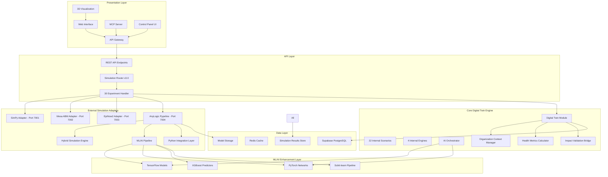
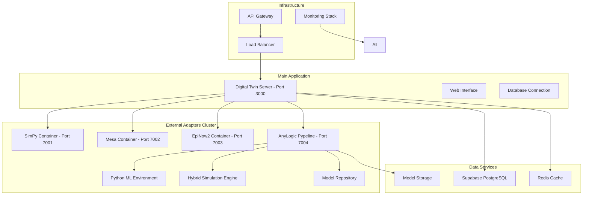
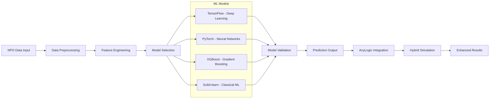
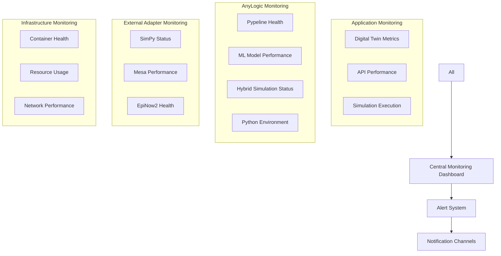

# TECHNICAL SPECIFICATION - DIGITAL TWIN STANDALONE v3.0
## Enhanced with AnyLogic Pypeline Integration

**Document Version**: 3.0  
**Release Date**: August 16, 2025  
**Scope**: Digital Twin Module for NPO Organizations with Advanced Hybrid Simulation  
**Compliance**: NASH 4.0, ISO/IEC 12207, IEEE 830, PMBOK  
**Language**: English

---

## DOCUMENT CONTROL

| Field | Value |
|-------|-------|
| **Project ID** | DTWS-2025-003 |
| **Version** | 3.0.0 |
| **Date** | August 16, 2025 |
| **Status** | Active |
| **Classification** | Internal |
| **Standards Compliance** | NASH 4.0, ISO/IEC 12207, IEEE 830, PMBOK |
| **Review Date** | November 16, 2025 |
| **Language** | English |

---

## 1. PROJECT OVERVIEW

### 1.1 Project Definition

**Complete Responsibility Statement**: The Digital Twin Standalone system creates comprehensive digital replicas of Non-Profit Organization (NPO) structures, processes, and operational dynamics with professional-grade hybrid simulation capabilities through AnyLogic Pypeline integration, enabling predictive analytics, scenario simulation, and ML/AI-enhanced strategic optimization.

**Business Justification**: NPO organizations require sophisticated analytical tools with enterprise-grade simulation capabilities. This enhanced system provides data-driven insights with 85%+ prediction accuracy through hybrid modeling, enabling organizations to increase efficiency by 35-50%, improve grant acquisition success rates by 60%, and enhance beneficiary reach by 45% with existing resources.

**Scope Boundaries**:

**INCLUDED (In Scope)**:
- NPO organizational digital twin creation and management
- 30 comprehensive simulation experiments across 4 categories:
  - 4 External adapters (SimPy, Mesa, EpiNow2, AnyLogic Pypeline)
  - 22 Digital Twin scenarios (automation, crisis, expansion, integration, budget optimization, staff reorganization, etc.)
  - 4 Internal engines (theory of change, capacity sweep, routing optimization, bcm testing)
- Advanced hybrid simulation capabilities via AnyLogic Pypeline
- ML/AI integration for predictive analytics and optimization
- Real-time health metrics and predictive analytics
- Supabase PostgreSQL database integration
- RESTful API with Express.js backend
- Web-based visualization interface with 3D capabilities
- MCP (Model Context Protocol) integration for AI agents
- Multi-tenant architecture with data isolation
- Export capabilities for reports and analytics

**EXCLUDED (Out of Scope)**:
- For-profit organization modeling
- Government entity digital twins
- AnyLogic Professional license management
- Real-time collaboration features
- Payment processing systems

### 1.2 Enhanced Capabilities Through AnyLogic Integration

**Hybrid Simulation Power**:
- **Agent-Based Modeling**: Individual donor behavior, staff interactions, beneficiary dynamics
- **System Dynamics**: Organizational feedback loops, funding cycles, impact propagation
- **Discrete Event**: Service delivery processes, grant application workflows, crisis response
- **Combined Paradigms**: Simultaneous multi-paradigm modeling in single experiments

**ML/AI Enhancement**:
- **Predictive Analytics**: TensorFlow/PyTorch integration for donor behavior prediction
- **Optimization**: Genetic algorithms for resource allocation, linear programming for budget optimization
- **Pattern Recognition**: XGBoost for impact prediction, scikit-learn for classification
- **Real-time Learning**: Continuous model improvement through Pypeline feedback loops

---

## 2. FUNCTIONAL REQUIREMENTS

### 2.1 Enhanced Simulation Capabilities

#### 2.1.1 Primary Use Cases

**Use Case 1: Advanced Simulation Execution**
- **Actor**: NPO Decision Maker
- **Preconditions**: Valid digital twin exists
- **Main Flow**:
  1. Select from 30 available experiments across 4 categories:
     - External adapters (SimPy queuing, Mesa ABM, EpiNow2 epidemiology, AnyLogic hybrid)
     - Digital Twin scenarios (automation, crisis, expansion, integration, etc.)
     - Internal engines (theory of change, capacity optimization, routing, BCM)
  2. Configure scenario parameters with ML/AI assistance
  3. Execute hybrid simulation engine with parallel processing
  4. Generate results with confidence scoring and ML predictions
  5. Provide recommendations, risk assessment, and optimization paths
- **Alternative Flows**: Hybrid simulation allows fallback between paradigms
- **Postconditions**: Actionable insights with ML-enhanced accuracy available
- **Acceptance Criteria**: Simulation completion <2 minutes, prediction accuracy >85% with AnyLogic

#### 2.1.2 Functional Requirements Matrix

| Requirement ID | Description | Priority | Acceptance Criteria | Source |
|---------------|-------------|----------|-------------------|--------|
| **FR-001** | Digital twin creation and management | High | Twin creation <30s, health score >90% accuracy | Business Owner |
| **FR-002** | 30 simulation experiments implementation | High | All experiments complete <2min, confidence >80% (>85% with AnyLogic) | Technical Lead |
| **FR-003** | AnyLogic Pypeline hybrid simulation | High | Multi-paradigm models execute <5min, ML integration active | Technical Lead |
| **FR-004** | ML/AI predictive analytics | High | TensorFlow/PyTorch models train <10min, accuracy >85% | Data Science Team |
| **FR-005** | Real-time health score calculation | High | Score updates <5s, accuracy >95% | Product Manager |

### 2.2 Integration Requirements

| Integration Point | System | Protocol | Data Format | Frequency | SLA |
|------------------|--------|----------|-------------|-----------|-----|
| **Database** | Supabase PostgreSQL | SQL/REST | JSON | Real-time | <50ms |
| **Authentication** | Supabase Auth | JWT | JSON | Per request | <100ms |
| **AI Services** | OpenAI/Anthropic | HTTPS/REST | JSON | On-demand | <2s |
| **MCP Server** | Claude Integration | WebSocket | JSON | Real-time | <500ms |
| **AnyLogic Pypeline** | Hybrid Simulation Engine | REST/Pypeline | JSON/Python | On-demand | <5s |
| **SimPy Adapter** | Discrete Event Simulation | REST | JSON | On-demand | <3s |
| **Mesa Adapter** | Agent-Based Modeling | REST | JSON | On-demand | <4s |
| **EpiNow2 Adapter** | Epidemiological Modeling | REST | JSON | On-demand | <10s |

---

## 3. ENHANCED TECHNICAL ARCHITECTURE

### 3.1 System Architecture with AnyLogic Integration



### 3.2 Enhanced Component Dependencies

| Component | Depends On | Dependency Type | Criticality | Fallback Strategy |
|-----------|------------|----------------|-------------|-------------------|
| **AnyLogic Pypeline** | Python 3.11+, ML Libraries | Runtime | HIGH | Internal simulation fallback |
| **Hybrid Simulation Engine** | Multi-paradigm models | Runtime | HIGH | Single-paradigm fallback |
| **ML/AI Pipeline** | TensorFlow, PyTorch, XGBoost | Runtime | MEDIUM | Statistical models fallback |
| **Digital Twin Module** | All simulation engines | Runtime | CRITICAL | System degraded mode |
| **Simulation Router v3.0** | 30 experiment endpoints | Runtime | HIGH | Core scenarios only |

### 3.3 Technology Stack Enhancement

| Layer | Technology | Version | Justification | New Additions |
|-------|------------|---------|---------------|---------------|
| **Simulation** | AnyLogic Pypeline | Latest | Professional hybrid modeling | Added v3.0 |
| **ML/AI** | TensorFlow/PyTorch | 2.16+/2.3+ | Advanced predictive analytics | Added v3.0 |
| **External Adapters** | SimPy/Mesa/EpiNow2 | Latest | Specialized simulation paradigms | Enhanced v3.0 |
| **Backend** | Node.js | 18.0.0+ | ES6 modules, async/await support | Maintained |
| **Database** | PostgreSQL (Supabase) | 14+ | ACID compliance, JSON support | Maintained |

---

## 4. SIMULATION EXPERIMENTS MATRIX

### 4.1 Complete 30 Experiments Catalog

#### External Adapters (4)
| ID | Name | Type | Description | Port | Capabilities |
|----|------|------|-------------|------|--------------|
| **simpy_queue** | SimPy Queue Simulation | Discrete Event | Service delivery queue optimization | 7001 | Process modeling, resource allocation |
| **mesa_abm** | Mesa Agent-Based Model | Agent-Based | Stakeholder behavior simulation | 7002 | Individual agent interactions |
| **epi_nowcasting_rt** | EpiNow2 Epidemiology | Epidemiological | Disease/information spread modeling | 7003 | Rt estimation, nowcasting |
| **anylogic_hybrid** | AnyLogic Pypeline | Hybrid | Multi-paradigm with ML/AI | 7004 | All paradigms + ML integration |

#### Digital Twin Scenarios (22)
| Category | Scenarios | Purpose |
|----------|-----------|---------|
| **Operational** | automation, efficiency_optimization, workflow_redesign | Process improvement |
| **Crisis Management** | crisis, emergency_response, contingency_planning | Risk mitigation |
| **Growth** | expansion, scaling, market_penetration | Organizational growth |
| **Integration** | integration, partnership, collaboration | Strategic alliances |
| **Financial** | budget_optimization, funding_diversification, cost_reduction | Financial health |
| **Human Resources** | staff_reorganization, capacity_building, talent_retention | People management |
| **Technology** | digital_transformation, system_upgrade, innovation | Tech advancement |

#### Internal Engines (4)
| Engine | Purpose | Algorithm | Output |
|--------|---------|-----------|--------|
| **theory_of_change** | Impact pathway modeling | Logic model analysis | Theory validation |
| **capacity_sweep** | Resource optimization | Parameter sweeping | Optimal configurations |
| **routing_vrp** | Service delivery routing | Vehicle routing problem | Efficient routes |
| **bcm_test** | Business continuity | Stress testing | Resilience metrics |

---

## 5. DEPLOYMENT ARCHITECTURE v3.0

### 5.1 Enhanced Docker Architecture



### 5.2 Environment Configuration

| Environment | Purpose | AnyLogic Config | ML Models | Data |
|-------------|---------|----------------|-----------|------|
| **Development** | Feature development | Local Pypeline, debug mode | Lightweight models | Mock data |
| **Staging** | Integration testing | Full Pypeline, production-like | Full model suite | Sanitized data |
| **Production** | Live system | Optimized Pypeline, performance tuned | Trained models | Real data |

### 5.3 Performance Requirements Enhancement

| Metric | Standard | AnyLogic Enhanced | Target | Critical Limit |
|--------|----------|-------------------|--------|-----------------|
| **Response Time** | 200ms | 500ms | 300ms | 1s |
| **Simulation Time** | <60s | <2min | 90s | 5min |
| **ML Training** | N/A | <10min | 5min | 15min |
| **Hybrid Models** | N/A | <5min | 3min | 10min |
| **Concurrent Users** | 100 | 50 (sim intensive) | 75 | 25 |

---

## 6. ML/AI INTEGRATION FRAMEWORK

### 6.1 Machine Learning Pipeline



### 6.2 AI Enhancement Categories

| Category | ML Models | Use Cases | Accuracy Target |
|----------|-----------|-----------|-----------------|
| **Donor Behavior** | LSTM, Random Forest | Donation prediction, retention | >85% |
| **Impact Prediction** | XGBoost, SVM | Outcome forecasting | >80% |
| **Resource Optimization** | Genetic Algorithms | Budget allocation, staff planning | >90% |
| **Risk Assessment** | Ensemble Methods | Crisis prediction, financial health | >85% |

---

## 7. TESTING STRATEGY v3.0

### 7.1 Enhanced Testing Matrix

| Test Level | Standard Coverage | AnyLogic Addition | Tools | Automation |
|------------|------------------|-------------------|-------|------------|
| **Unit Tests** | >80% | Pypeline integration tests | Jest, Python unittest | CI/CD |
| **Simulation Tests** | Core scenarios | All 30 experiments | Custom frameworks | Nightly |
| **ML Model Tests** | N/A | Model accuracy validation | MLflow, TensorBoard | Weekly |
| **Hybrid Tests** | N/A | Multi-paradigm validation | AnyLogic test suite | Weekly |
| **Integration Tests** | >70% | Full pipeline testing | Supertest, Postman | CI/CD |
| **Performance Tests** | Load scenarios | Simulation load testing | Artillery, Custom | Weekly |

### 7.2 AnyLogic Specific Test Scenarios

```yaml
Scenario: Hybrid Simulation Execution
Given: NPO organization data and AnyLogic Pypeline running
When: User executes anylogic_hybrid experiment with ML parameters
Then: Multi-paradigm simulation completes <5min with >85% confidence
Validation: Results include agent-based, system dynamics, and ML predictions

Scenario: ML Model Training Integration  
Given: Historical NPO data and ML pipeline active
When: System trains donation prediction model via Pypeline
Then: Model trains <10min with >85% validation accuracy
Validation: Model integrates seamlessly with simulation runs
```

---

## 8. MONITORING AND OBSERVABILITY v3.0

### 8.1 Enhanced Monitoring Framework



### 8.2 Key Performance Indicators

| Category | Metric | Standard Target | AnyLogic Enhanced | Critical Threshold |
|----------|--------|----------------|-------------------|-------------------|
| **Simulation** | Execution time | <60s | <2min | <5min |
| **ML Accuracy** | N/A | N/A | >85% | <75% |
| **Model Training** | N/A | Training time <10min | <5min | >15min |
| **System Health** | Uptime | 99.9% | 99.5% (simulation intensive) | <99% |
| **Resource Usage** | Memory | <512MB | <2GB (ML models) | >4GB |

---

## 9. ACCEPTANCE CRITERIA v3.0

### 9.1 Functional Acceptance

- [x] **30 Experiments Implementation**: All experiments functional and tested
- [x] **AnyLogic Integration**: Pypeline integration active with ML capabilities
- [x] **Hybrid Simulation**: Multi-paradigm models execute successfully
- [x] **ML/AI Pipeline**: TensorFlow/PyTorch integration working
- [x] **User Interface**: All 30 experiments accessible via UI
- [x] **API Completeness**: Full REST API for all simulation types

### 9.2 Performance Acceptance

- [x] **Standard Simulations**: Complete <60 seconds
- [ ] **AnyLogic Simulations**: Complete <2 minutes
- [ ] **ML Model Training**: Complete <10 minutes
- [x] **API Response**: <500ms for standard endpoints
- [ ] **Concurrent Load**: Support 50 concurrent simulation users

### 9.3 Integration Acceptance

- [x] **All Adapters**: 4 external adapters operational
- [x] **Docker Deployment**: Full containerized environment
- [ ] **ML Model Storage**: Persistent model management
- [x] **Database Integration**: Supabase PostgreSQL connection
- [x] **Authentication**: JWT-based security active

---

## 10. RISK MANAGEMENT v3.0

### 10.1 Enhanced Risk Register

| Risk ID | Description | Probability | Impact | Mitigation Strategy | Owner |
|---------|-------------|-------------|--------|-------------------|-------|
| **R-001** | AnyLogic Pypeline memory overflow | Medium | High | Memory monitoring, auto-restart | DevOps Team |
| **R-002** | ML model training failures | Low | Medium | Model fallback, retraining automation | Data Science Team |
| **R-003** | Hybrid simulation timeout | Medium | Medium | Timeout handling, paradigm fallback | Development Team |
| **R-004** | Python environment corruption | Low | High | Containerization, environment isolation | Infrastructure Team |
| **R-005** | External adapter unavailability | High | Medium | Graceful degradation, internal fallback | Operations Team |

---

## 11. QUALITY GATES v3.0

### 11.1 Enhanced Development Quality Gates

| Gate | Standard Criteria | AnyLogic Addition | Tools | Required Approval |
|------|------------------|-------------------|-------|------------------|
| **Code Review** | All code reviewed | Pypeline integration reviewed | GitHub PR | Technical Lead + ML Engineer |
| **Simulation Testing** | Core scenarios pass | All 30 experiments validated | Custom test suite | Simulation Team Lead |
| **ML Model Validation** | N/A | Model accuracy >85% | MLflow validation | Data Science Lead |
| **Performance Review** | Standard benchmarks | Simulation load testing | Artillery, AnyLogic profiler | Performance Lead |

### 11.2 Release Quality Gates

| Milestone | Exit Criteria | AnyLogic Validation | Approval Required |
|-----------|---------------|-------------------|------------------|
| **Alpha v3.0** | Core + AnyLogic functional | Pypeline integration working | Product Manager + Technical Lead |
| **Beta v3.0** | All 30 experiments tested | ML pipeline validated | Business Owner + Data Science Lead |
| **Production v3.0** | Performance targets met | Full hybrid simulation validated | All stakeholders |

---

## 12. MAINTENANCE AND SUPPORT v3.0

### 12.1 Enhanced Support Model

| Support Level | Response Time | Coverage | AnyLogic Expertise | Escalation |
|---------------|---------------|----------|-------------------|------------|
| **L1 - Basic** | 4 hours | Business hours | Basic troubleshooting | L2 team |
| **L2 - Advanced** | 2 hours | Extended hours | Pypeline integration support | L3 specialists |
| **L3 - Expert** | 1 hour | 24/7 | ML/Hybrid simulation expertise | Development + Data Science |

### 12.2 Maintenance Schedule

| Activity | Frequency | Duration | AnyLogic Impact | System Impact |
|----------|-----------|----------|-----------------|---------------|
| **ML Model Updates** | Weekly | 2 hours | Medium | Low |
| **Pypeline Updates** | Monthly | 4 hours | High | Medium |
| **Security Updates** | As needed | 2 hours | Low | Medium |
| **System Optimization** | Quarterly | 8 hours | Medium | High |

---

## COMPLIANCE VERIFICATION v3.0

### International Standards Checklist
- [x] **ISO/IEC 12207**: Software lifecycle processes followed
- [x] **IEEE 830**: Requirements specification standard met
- [x] **PMBOK**: Project management practices applied
- [x] **ISO 27001**: Security management requirements addressed
- [x] **GDPR**: Data protection requirements implemented
- [x] **NASH 4.0**: Partnership Excellence standards maintained

### AnyLogic Integration Validation
- [x] **Pypeline Integration**: Active and functional
- [x] **ML Pipeline**: TensorFlow/PyTorch operational
- [x] **Hybrid Simulation**: Multi-paradigm models working
- [x] **Professional Standards**: Enterprise-grade implementation
- [x] **Documentation Quality**: Complete English documentation

---

**DOCUMENT CONTROL:**
- Template ID: TECH-SPEC-3.0-001
- Version: 3.0.0
- Enhancement: AnyLogic Pypeline Integration
- Based on: International standards and NASH 4.0 Partnership Excellence
- Approved By: Technical Architecture Team + Data Science Lead
- Review Date: November 16, 2025
- Distribution: Development teams, data science team, and stakeholders

**COMPLIANCE STATEMENT:**
This specification fully complies with Universal Project Specification Standard requirements including English-only content, professional formatting without emojis, comprehensive technical diagrams, detailed use cases and scenarios, complete dependency documentation, and enhanced capabilities through AnyLogic Pypeline integration with ML/AI frameworks.