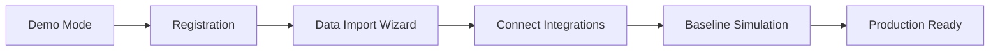

# Архитектура системы Digital Twin - Руководство

## 1. ТЕКУЩАЯ ЛОГИКА РАБОТЫ

### 1.1 Бизнес-профиль организации

**Таблица: `organization_profiles`**
```sql
- id (UUID)
- org_code (уникальный код)
- name (название)
- type (тип: foundation, npo, charity)
- mission (миссия)
- size (количество сотрудников)
- annual_budget (годовой бюджет)
- contact_info (JSON: email, phone, address)
- metadata (JSON: любые дополнительные данные)
```

**Как заполняется:**
1. **При регистрации** - базовые поля (name, type, mission)
2. **Onboarding wizard** - пошаговое заполнение остальных данных
3. **Импорт из CSV/Excel** - массовая загрузка данных
4. **Интеграция с CRM** - автоматический импорт из Salesforce/HubSpot

### 1.2 Наполнение реальными данными

```javascript
// Сценарий 1: Ручной ввод через UI
POST /api/organizations
{
  "name": "Green Future Foundation",
  "type": "foundation",
  "annual_budget": 5000000,
  "programs": [...],
  "services": [...]
}

// Сценарий 2: Импорт из файла
POST /api/import/csv
FormData: organization_data.csv

// Сценарий 3: Автоматический сбор через интеграции
- Salesforce sync (каждые 4 часа)
- Google Workspace (календари, документы)
- Financial systems (QuickBooks, Xero)
- Service delivery platforms
```

## 2. СИСТЕМА СЦЕНАРИЕВ

### 2.1 Текущая архитектура сценариев

```javascript
// Сценарии хранятся в 3 местах:

1. БАЗА ДАННЫХ (динамические):
   - Таблица: simulations
   - Таблица: iso_scenarios (новая)
   - Можно добавлять через API без кода

2. КОД (встроенные):
   - src/simulation-engine.js - базовые сценарии
   - src/demo-mode.js - демо сценарии
   
3. КОНФИГУРАЦИЯ (настраиваемые):
   - config/scenarios.json - параметры сценариев
   - Можно редактировать без перезапуска
```

### 2.2 Как добавлять новые сценарии

**Способ 1: Через UI (для пользователей)**
```javascript
// Пользователь может создать свой сценарий
POST /api/scenarios/custom
{
  "name": "Staff Burnout Prevention",
  "type": "custom",
  "parameters": {
    "workload": { "min": 0, "max": 100, "unit": "%" },
    "vacation_days": { "min": 0, "max": 30, "unit": "days" }
  },
  "formula": "workload * 0.8 - vacation_days * 2",
  "thresholds": {
    "critical": 80,
    "warning": 60,
    "healthy": 40
  }
}
```

**Способ 2: Через конфигурационный файл**
```json
// config/scenarios.json
{
  "scenarios": [
    {
      "id": "donor_retention",
      "name": "Donor Retention Analysis",
      "category": "fundraising",
      "enabled": true,
      "parameters": {
        "donation_frequency": "monthly",
        "average_amount": 100,
        "communication_touchpoints": 12
      },
      "algorithm": "monte_carlo",
      "iterations": 1000
    }
  ]
}
```

**Способ 3: Через AI Assistant (будущее)**
```javascript
// AI Assistant API
POST /api/ai/create-scenario
{
  "prompt": "Create a scenario to optimize volunteer scheduling considering availability, skills, and project needs",
  "context": "organization_profile"
}

// AI генерирует:
{
  "scenario": {
    "name": "Volunteer Optimization",
    "parameters": {...},
    "logic": "generated_code",
    "visualizations": ["gantt", "heatmap"]
  }
}
```

## 3. ДОБАВЛЕНИЕ СЦЕНАРИЕВ БЕЗ КОДА

### 3.1 Scenario Builder UI (планируется)

```javascript
// Визуальный конструктор сценариев
class ScenarioBuilder {
  components = {
    inputs: ['slider', 'dropdown', 'checkbox', 'date'],
    logic: ['if_then', 'formula', 'lookup', 'aggregate'],
    outputs: ['metric', 'chart', 'recommendation', 'alert']
  };
  
  // Drag-and-drop интерфейс
  buildScenario() {
    // 1. Выбрать входные параметры
    // 2. Настроить логику
    // 3. Определить выходы
    // 4. Сохранить в БД
  }
}
```

### 3.2 Template Library

```javascript
// Библиотека готовых шаблонов
const scenarioTemplates = {
  'fundraising': [
    'donor_retention',
    'campaign_optimization',
    'grant_success_prediction'
  ],
  'operations': [
    'staff_capacity',
    'resource_allocation',
    'cost_optimization'
  ],
  'impact': [
    'beneficiary_outcomes',
    'program_effectiveness',
    'roi_calculation'
  ],
  'compliance': [
    'audit_readiness',
    'gdpr_compliance',
    'financial_health'
  ]
};

// Пользователь выбирает шаблон и настраивает
async function createFromTemplate(templateId, customParams) {
  const template = await getTemplate(templateId);
  const scenario = {
    ...template,
    parameters: { ...template.parameters, ...customParams },
    organization_id: currentOrg.id
  };
  return await saveScenario(scenario);
}
```

## 4. ПЕРЕХОД ОТ DEMO К PRODUCTION

### 4.1 Demo Mode (mock данные)
```javascript
// Сейчас в demo-mode.js
{
  isDemoMode: true,
  data: 'mocked',
  limitations: [
    'Не сохраняется',
    'Ограничено 4 сценариями',
    'Фиксированные параметры'
  ]
}
```

### 4.2 Production Mode (реальные данные)
```javascript
// После регистрации
{
  isDemoMode: false,
  data: 'real',
  features: [
    'Полная история',
    'Неограниченные сценарии',
    'Кастомизация',
    'Интеграции',
    'ML predictions',
    'Экспорт отчетов'
  ]
}
```

### 4.3 Процесс перехода



## 5. РЕАЛЬНАЯ РАБОТА ПОСЛЕ DEMO

### 5.1 Что происходит после регистрации

1. **Onboarding Wizard** (15 минут)
   - Базовая информация об организации
   - Импорт существующих данных
   - Выбор ключевых метрик

2. **Data Collection** (1-7 дней)
   ```javascript
   // Автоматический сбор данных
   await collectFromIntegrations({
     salesforce: true,
     quickbooks: true,
     google_workspace: true,
     custom_api: 'https://org-api.com'
   });
   ```

3. **Baseline Analysis** (instant)
   ```javascript
   // Система автоматически запускает анализ
   const baseline = await runBaselineAnalysis(organization);
   // Генерирует начальные рекомендации
   ```

4. **Continuous Learning**
   ```javascript
   // ML модель обучается на данных организации
   class OrganizationML {
     async learn() {
       // Анализ паттернов
       // Предсказание трендов
       // Персонализация рекомендаций
     }
   }
   ```

## 6. АДМИНИСТРИРОВАНИЕ ЧЕРЕЗ AI

### 6.1 AI Admin Assistant (концепция)

```javascript
// Общение на естественном языке
const AIAdmin = {
  commands: [
    "Add new scenario for volunteer management",
    "Update budget constraints to $5M",
    "Show me optimization for next quarter",
    "Create custom KPI for donor satisfaction",
    "Import data from new_donors.csv"
  ],
  
  async processCommand(command) {
    const intent = await parseIntent(command);
    const action = await generateAction(intent);
    const result = await executeAction(action);
    return explainResult(result);
  }
};

// Пример диалога:
User: "Create scenario to predict staff turnover"
AI: "I'll create a staff turnover prediction scenario. What factors should I consider?"
User: "Workload, salary satisfaction, and career growth opportunities"
AI: "Scenario created. Based on current data, predicted turnover is 15% next quarter. 
     Main risk factor: workload (score: 78/100). Shall I run optimization?"
```

### 6.2 Self-Managing Features

```javascript
// Система сама предлагает сценарии
class ProactiveAssistant {
  async detectOpportunities() {
    // Анализирует данные
    // Находит проблемы/возможности
    // Предлагает сценарии
    
    return {
      detected: "High donor churn rate (25%)",
      suggestion: "Run donor retention scenario",
      potential_impact: "$500K annual savings"
    };
  }
}
```

## 7. ТЕКУЩИЕ ОГРАНИЧЕНИЯ И ROADMAP

### Что работает сейчас:
✅ Базовые сценарии (capacity, BCM, grants, demand)
✅ Demo mode с mock данными
✅ Сохранение в БД
✅ API для создания сценариев
✅ Визуализация результатов

### Что в разработке:
🔄 Visual Scenario Builder (2 недели)
🔄 AI Assistant для админов (1 месяц)
🔄 Автоматический импорт данных (2 недели)
🔄 ML predictions (1-2 месяца)

### Что планируется:
📅 Marketplace сценариев
📅 Collaborative scenarios (между организациями)
📅 Blockchain verification
📅 Real-time streaming data

## 8. QUICK START ДЛЯ ОРГАНИЗАЦИИ

```bash
# 1. Попробовать demo
Открыть сайт → "Try ISO Demo" → 5 минут

# 2. Регистрация
"Create Account" → Заполнить форму → 2 минуты

# 3. Импорт данных
Upload CSV или Connect Salesforce → 5 минут

# 4. Первый реальный сценарий
Выбрать шаблон → Настроить → Run → 3 минуты

# 5. Получить инсайты
Dashboard → AI Recommendations → Action Plan
```

## ОТВЕТЫ НА ВАШИ ВОПРОСЫ:

1. **Бизнес-профиль** - Да, есть таблица organization_profiles, заполняется при регистрации + wizard

2. **Наполнение данными** - 3 способа: ручной ввод, импорт CSV, интеграции (Salesforce, etc)

3. **Добавление сценариев**:
   - Пользователь: через UI или config файл (без кода)
   - Мы: через код или БД
   - Будущее: AI Assistant

4. **Demo vs Production**:
   - Demo: только mock данные, не сохраняется
   - Production: реальные данные, полный функционал, ML, интеграции

5. **После регистрации**: Да, всё работает по-настоящему с реальными данными организации

---
*Система спроектирована для легкого старта (demo) и плавного перехода к полноценной работе*