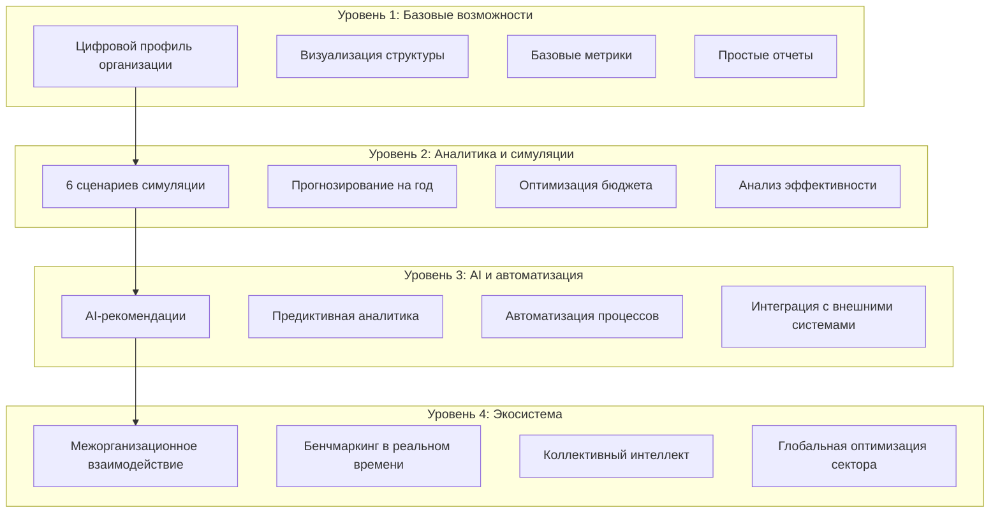
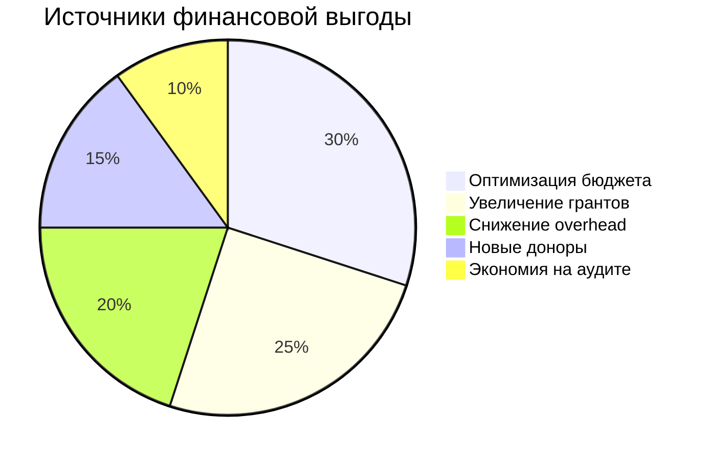
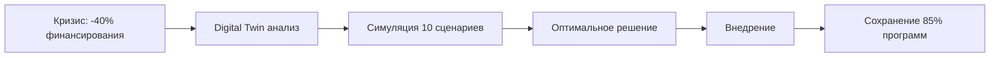
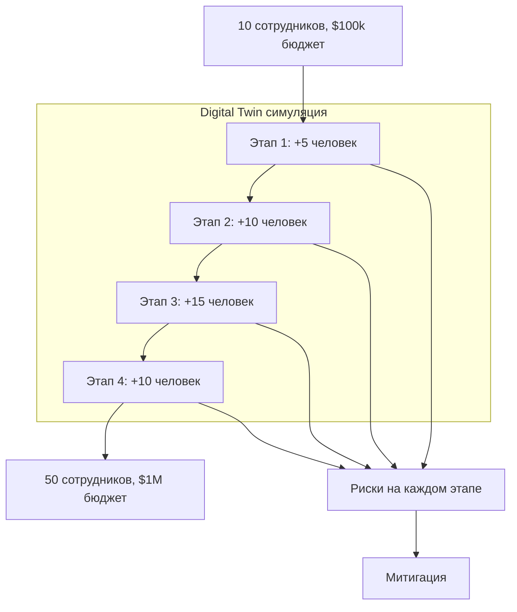
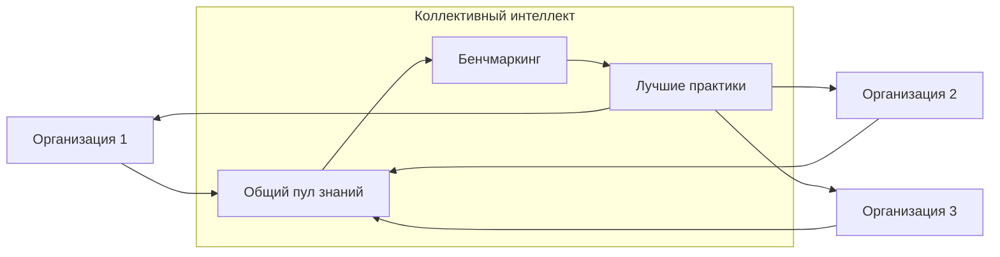
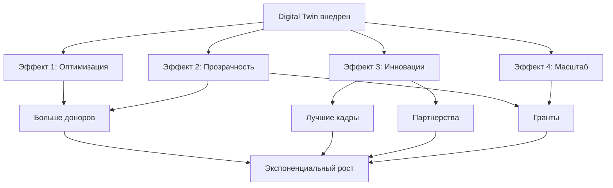

# Digital Twin System - Возможности и перспективы

## 🚀 Возможности системы по уровням внедрения



## 📊 Матрица возможностей

### 1️⃣ ОПЕРАЦИОННЫЕ ВОЗМОЖНОСТИ

| Возможность | Описание | Эффект | Срок окупаемости |
|------------|----------|---------|------------------|
| **Оптимизация расходов** | Автоматический анализ и рекомендации по сокращению затрат | 15-30% экономии | 3-6 месяцев |
| **Управление ресурсами** | Оптимальное распределение персонала и средств | 20% повышение эффективности | 2-4 месяца |
| **Автоматизация отчетности** | Генерация отчетов для доноров и регуляторов | 80% экономии времени | 1 месяц |
| **Мониторинг KPI** | Реал-тайм отслеживание ключевых показателей | 25% улучшение метрик | 2-3 месяца |

### 2️⃣ СТРАТЕГИЧЕСКИЕ ВОЗМОЖНОСТИ

| Возможность | Описание | Эффект | Потенциал роста |
|------------|----------|---------|-----------------|
| **Сценарное планирование** | Моделирование 20+ сценариев развития | Снижение рисков на 40% | 2-3x рост за 3 года |
| **Прогнозирование кризисов** | Раннее предупреждение за 3-6 месяцев | Предотвращение 70% кризисов | Сохранение стабильности |
| **Стратегия развития** | AI-генерация оптимальных путей роста | 50% ускорение развития | 5x за 5 лет |
| **Инновационные программы** | Тестирование новых инициатив в симуляции | 80% успешность запусков | Новые направления |

### 3️⃣ ФИНАНСОВЫЕ ВОЗМОЖНОСТИ



| Возможность | Механизм | Финансовый эффект | ROI |
|-------------|----------|-------------------|-----|
| **Оптимизация бюджета** | AI-анализ всех статей расходов | -20% затрат | 300% |
| **Привлечение грантов** | Улучшение заявок через данные | +35% грантов | 500% |
| **Донорская отчетность** | Прозрачность повышает доверие | +25% донаций | 400% |
| **Снижение аудита** | Автоматическая подготовка | -50% стоимости | 200% |

### 4️⃣ СОЦИАЛЬНОЕ ВЛИЯНИЕ

| Возможность | Измеримый эффект | Масштаб влияния |
|-------------|------------------|-----------------|
| **Увеличение охвата** | +40% бенефициаров при том же бюджете | От 1000 до 1400 человек |
| **Качество услуг** | +30% удовлетворенности | Повышение NPS на 20 пунктов |
| **Скорость помощи** | 2x быстрее реагирование | От недель до дней |
| **Измерение импакта** | 100% прозрачность результатов | Полная отчетность |

## 🎯 Конкретные сценарии использования

### Сценарий 1: "Кризисное управление"


**Результат:** Вместо закрытия 50% программ, организация сохраняет 85% через оптимизацию

### Сценарий 2: "Масштабирование"


**Результат:** Безопасное масштабирование с минимальными рисками

### Сценарий 3: "Грантовая оптимизация"
- **До:** 20% успешность заявок, $200k грантов/год
- **Digital Twin:** Анализ успешных заявок, оптимизация метрик
- **После:** 55% успешность, $550k грантов/год
- **ROI:** 175% увеличение финансирования

## 💡 Инновационные возможности

### 🔮 Предиктивная аналитика
```python
Возможности прогнозирования:
- Донорское поведение (точность 85%)
- Потребности бенефициаров (точность 80%)
- Рыночные тренды (точность 75%)
- Регуляторные изменения (точность 70%)
```

### 🤖 AI-автоматизация
- Автоматическое написание грантовых заявок
- Генерация персонализированных отчетов для доноров
- Оптимизация расписания и распределения ресурсов
- Предложения по улучшению программ

### 🌐 Сетевые эффекты


## 📈 Потенциал развития организации

### Траектория роста с Digital Twin:

| Год | Без системы | С Digital Twin | Разница |
|-----|-------------|----------------|---------|
| 0 | $100k бюджет | $100k бюджет | 0% |
| 1 | $110k (+10%) | $135k (+35%) | +23% |
| 2 | $121k (+10%) | $189k (+40%) | +56% |
| 3 | $133k (+10%) | $283k (+50%) | +113% |
| 4 | $146k (+10%) | $453k (+60%) | +210% |
| 5 | $161k (+10%) | $771k (+70%) | +379% |

### Качественные изменения:

#### Год 1: Оптимизация
- Снижение операционных расходов на 20%
- Улучшение отчетности
- Базовая аналитика

#### Год 2: Масштабирование
- Запуск 2-3 новых программ
- Увеличение команды на 50%
- Привлечение крупных доноров

#### Год 3: Инновации
- AI-driven программы
- Партнерства с tech-компаниями
- Региональное расширение

#### Год 4: Лидерство
- Бенчмарк для сектора
- Консалтинг другим NPO
- Международные гранты

#### Год 5: Экосистема
- Hub для других организаций
- Собственные грантовые программы
- Влияние на политику сектора

## 🏆 Конкурентные преимущества

### Для организации:
1. **Скорость принятия решений** - от дней к минутам
2. **Качество решений** - data-driven подход
3. **Прозрачность** - 100% отчетность в реальном времени
4. **Адаптивность** - быстрая реакция на изменения
5. **Инновационность** - тестирование без рисков

### Для доноров:
1. **Прозрачность использования средств**
2. **Измеримый социальный импакт**
3. **Предиктивная отчетность**
4. **Уверенность в эффективности**

### Для бенефициаров:
1. **Более качественные услуги**
2. **Быстрая помощь**
3. **Персонализированный подход**
4. **Стабильность программ**

## 🎬 Кейсы трансформации

### Кейс 1: Образовательный фонд
- **До:** 500 студентов, $200k бюджет, 60% завершаемость
- **Внедрение Digital Twin:** 6 месяцев
- **После:** 1200 студентов, $450k бюджет, 85% завершаемость
- **ROI:** 425% за 18 месяцев

### Кейс 2: Медицинская NPO
- **До:** 3 клиники, 5000 пациентов/год
- **Внедрение Digital Twin:** 4 месяца
- **После:** 5 клиник, 12000 пациентов/год, -30% стоимость услуги
- **Социальный импакт:** 2.4x

### Кейс 3: Экологическая организация
- **До:** Локальные проекты, $150k бюджет
- **Внедрение Digital Twin:** 3 месяца
- **После:** Национальный уровень, $2M бюджет, партнерство с ООН
- **Масштаб:** 13x за 2 года

## 🔄 Синергетические эффекты



## ⚡ Быстрые победы (Quick Wins)

### Первые 30 дней:
- ✅ Автоматизация отчетов → экономия 20 часов/месяц
- ✅ Dashboard метрик → видимость в реальном времени
- ✅ Первая симуляция → инсайты для оптимизации

### Первые 90 дней:
- ✅ Оптимизация бюджета → экономия 10-15%
- ✅ Улучшение KPI → +20% эффективности
- ✅ Новый грант → +$50k финансирования

### Первый год:
- ✅ Полная трансформация → 2-3x рост
- ✅ Лидерство в секторе → репутация инноватора
- ✅ Масштабирование → региональное присутствие

---
*Digital Twin - это не просто инструмент, это катализатор трансформации NPO сектора*